# LLM Updates — 2026-Jul-21

Tuesday brief, written Tue Jul 21 (Los Angeles time). Monday's report (Jul-20)
closed on five watch-items; the loudest of them — *"DeepSeek v4 cutover (Jul 24)…
whether DeepSeek answer Kimi K3's pricing up-move or undercut it"* (Jul-20 §Watch
next) — **resolved in a way neither option anticipated.** DeepSeek didn't pick a
number. **It changed the unit.**

One theme dominates the 24 hours since:

> **The pricing *mechanism* is now the frontier.** In the space of two days, the two
> labs that most define the price axis both stopped competing on the *rate* and started
> competing on *how the meter runs*. Anthropic split Fable 5 by **who you are**
> (Max-bundled vs. Pro-metered — Jul-20 §1). DeepSeek, launching **V4 GA**, split its
> price by **when you call** — the **first time-of-day surge pricing on a major AI API.**

Three things define the window since Jul-20:

1. **DeepSeek V4 reached GA (rolling out since Jul 19) with peak/off-peak "rush-hour"
   pricing.** Output during two Beijing daytime windows (09:00–12:00, 14:00–18:00) now
   costs **2× the off-peak rate**; the other 18 hours stay at the base rate
   (V4-Pro **$0.87** out, V4-Flash **$0.28** out). It is the first time a frontier-class
   API has priced the same tokens differently by hour, and it arrives *just* as the
   legacy `deepseek-chat`/`deepseek-reasoner` IDs retire (Jul 24, 15:59 UTC — Jul-08 §1)
   (§1).
2. **A "grayscale" routing controversy has attached itself to the GA rollout.** Since
   ~Jul 17, testers report the staged V4-GA build returning outputs whose chain-of-thought
   *signatures match Claude Fable 5* — raising an (unverified) claim that the DeepSeek API
   is forwarding hard coding requests **out** to Anthropic's $50/Mtok model. If Jul-08's
   Anthropic-format endpoint pointed Claude-shaped requests *into* DeepSeek, this is the
   mirror image, and it is exactly the kind of thing a from-nothing benchmark should treat
   as **alleged, not established** (§2).
3. **The rest of the board is unchanged from Monday.** Gemini 3.5 Pro is still absent
   (market still ~Jul 31 / Aug — Jul-20 §4); Kimi K3's open weights are still due **Jul 27**;
   Inkling's Tinker-fed customization graph keeps building (Jul-20 §2). Nothing new to
   re-derive there (§3).

The through-line: the competition that these briefs watched move from *can it ship*
(spring) to *what does it cost* (Jul-08 §epilogue) has moved once more — to **how it is
metered.** Peak-hour surcharges and tier splits are the same underlying move: with a
near-Opus open model now selling output at **1/57th of Fable 5** (§1), a flat headline
rate is no longer where the labs differentiate. The meter is.

This report does **not** re-derive DeepSeek's Jul-24 legacy-ID cutover and Anthropic-format
endpoint (Jul-08 §1), the V4 CSA/HCA sparse-attention architecture and 1M context
(established at the Apr-24 preview), the Fable 5 tier split (Jul-20 §1), the
Inkling/Kimi K3 open-weights spread (Jul-20 §2–§3), or the Gemini absence (Jul-20 §4).
Those stand as written. Here we advance only what is **new since Jul-20.**

---

## 1. DeepSeek V4 GA — the first time-of-day price on a major AI API (rolling out Jul 19→)

The Apr-24 V4 preview always carried a mid-July GA date; what it did **not** carry was
this. On **Jun 30**, DeepSeek announced that the official V4 release would introduce
**peak/off-peak API pricing** — and the GA rollout that began **Jul 19** is where that
mechanism goes live. The structure:

| | Off-peak (base) | **Peak** (09:00–12:00 & 14:00–18:00 Beijing) |
|---|---|---|
| **V4-Pro** — output | **$0.87** /Mtok | **$1.74** /Mtok (2×) |
| **V4-Pro** — input (cache miss / hit) | $0.435 / ~$0.004 | ~$0.87 / ~$0.007 (2×) |
| **V4-Flash** — output | **$0.28** /Mtok | **$0.56** /Mtok (2×) |
| **V4-Flash** — input (cache miss / hit) | $0.14 / ~$0.003 | $0.28 / ~$0.006 (2×) |

(USD from published RMB rates: V4-Pro output 6→12 RMB, V4-Flash 2→4 RMB across the peak
boundary. DeepSeek says it will give **24 hours' notice** before any price change.)

Three reads:

- **This is a genuinely new *primitive*, not a new number.** Cloud compute has had
  spot/on-demand and time-of-use tiers for years; frontier LLM APIs have not. Every prior
  price move these briefs tracked — Fable 5's $10/$50 credits (Jul-08), GPT-5.6 Sol's
  $5/$30 (Jul-09), Kimi K3's $3/$15 up-move (Jul-17) — changed the *rate*. DeepSeek changed
  the *axis*: identical tokens now cost 2× more between 9 and 12 and 2 and 6, Beijing time,
  and nothing between 6 p.m. and 9 a.m. A batch job that can wait until the Beijing evening
  now pays half what an interactive session at 10 a.m. does.
- **The stated reason is capacity, and it rhymes with Anthropic's.** DeepSeek frames the
  surcharge as *"better distribution of resources and… service stability"* under rapid
  user growth — the same logic Anthropic used to explain Fable 5's four extensions
  (*"demand… challenging to predict… as we secured additional capacity,"* Jul-20 §1). Two
  labs, one week, same diagnosis: **the constraint is inference capacity, and the lever is
  the meter.** Anthropic rations the premium model by *plan tier*; DeepSeek rations
  aggregate load by *hour of day*. Both are demand-shaping dressed as pricing.
- **It undercuts even at 2×.** The move is a *reversal* of the price war DeepSeek itself
  triggered — but it barely dents the gap. V4-Pro-Max is reported at **SWE-bench Verified
  80.6%** (the top open-weights coding score, ~tied Gemini 3.1 Pro) and **Codeforces ~3,206
  Elo**, "approaching Opus 4.8," yet its *peak* output price ($1.74) is still ~1/29 of Fable
  5's $50, and its off-peak price (~1/57) is the number developers quote. Surge pricing on a
  model this cheap is a rounding error against the closed frontier — which is exactly why the
  *mechanism*, not the rate, is the story (see §3).

**The cutover context still lands this week.** The legacy `deepseek-chat` / `deepseek-reasoner`
IDs retire **Jul 24, 15:59 UTC** (Jul-08 §1); community reporting ties the formal GA reveal to
**WAIC in Shanghai** this week (with a rumored Huawei Ascend 950 SuperPOD demo). As of this
writing DeepSeek has **not** posted a formal GA announcement — the rollout is staged
("grayscale"), which is where §2's controversy comes from. Weights remain **MIT-licensed on
Hugging Face** (`deepseek-ai/DeepSeek-V4-Pro` / `-Flash`), unchanged from preview.

**Sources:**
[TechNode — DeepSeek to launch V4 in mid-July with new peak-time API pricing (Jun 30)](https://technode.com/2026/06/30/deepseek-to-launch-v4-in-mid-july-with-new-peak-time-api-pricing/) ·
[SCMP — After triggering price war, DeepSeek reverses course with peak-hour surcharge](https://www.scmp.com/tech/big-tech/article/3358868/after-triggering-price-war-deepseek-reverses-course-surcharge-peak-hour-api-use) ·
[BigGo Finance — DeepSeek peak/off-peak pricing doubles API costs during peak hours, sparks developer debate](https://finance.biggo.com/news/385baf56-274e-457c-bcd7-d11657d93894) ·
[SERVOLA — AI tokens now have a rush hour](https://servola.de/journal/ai-tokens-now-have-a-rush-hour/) ·
[Wan 2.7 — DeepSeek V4 GA is here: near-Opus performance at 1/57th the price of Fable 5](https://wan27.org/blog/deepseek-v4-ga) ·
[igeekphone — DeepSeek V4 official release expected within days](https://www.igeekphone.com/deepseek-v4-official-release-expected-within-days-as-ai-community-anticipates-next-major-open-source-model/)

---

## 2. The "grayscale" routing controversy — alleged, not established

Because GA is rolling out in stages through the live API, some callers have been served the
**GA-candidate build** rather than the preview. Starting ~**Jul 17**, testers reported that
these grayscale outputs *"show signatures that match Claude Fable 5"* — not the V4-preview
architecture — and floated the claim that DeepSeek's API is acting as a **"transfer
station,"** forwarding hard coding requests out to Anthropic's $50/Mtok Fable 5 and returning
the results as "V4 GA."

The evidence being circulated is behavioral, not forensic:

- A widely-shared **chain-of-thought marker**: grayscale responses that open reasoning with
  *"I'm"/"I'll"* rather than the V4-preview's habitual *"Let me"* are claimed to indicate the
  GA build (with the implication it is a different model underneath).
- Investigations attributed to independent testers (e.g. `@synthwavedd`) and a cluster of X
  accounts posting side-by-side grayscale samples since Jul 17–18.

**Treat this as an open allegation.** A style-signature match is weak evidence: post-training
on distilled or shared data, convergent RLHF, and simple prompt-template changes all produce
CoT drift, and "sounds like Fable 5" is not "is Fable 5." No primary confirmation, no DeepSeek
statement, and no reproducible instrumentation has surfaced. This brief records the controversy
because it is the dominant Jul-17→21 conversation around the GA — **not** because the routing
claim is substantiated.

What makes it *narratively* sharp is the symmetry with Jul-08. That report documented
DeepSeek's **inbound** Anthropic-format endpoint — `claude-opus*`→`deepseek-v4-pro`,
`claude-sonnet*`/`haiku*`→`v4-flash` — a real, documented reroute that turns Claude-shaped
requests into DeepSeek answers (Jul-08 §1). The Jul-21 claim is the **outbound** mirror:
DeepSeek-shaped requests allegedly answered by Claude. One direction is confirmed API design;
the other is unverified community suspicion. The diagram below keeps them clearly separated.

```mermaid
flowchart TB
    subgraph IN["Jul-08 — CONFIRMED (documented API design)"]
        direction LR
        A["Client sends<br/>model: claude-opus-*"]:::req
        B(["api.deepseek.com<br/>/anthropic endpoint"]):::ds
        C["Served by<br/>deepseek-v4-pro / -flash"]:::ds
        A -->|"Claude-format request"| B --> C
    end
    subgraph OUT["Jul-21 — ALLEGED (unverified, grayscale outputs)"]
        direction LR
        D["Client sends<br/>hard coding request"]:::req
        E(["DeepSeek V4-GA<br/>(grayscale build)"]):::ds
        F["Claude Fable 5<br/>$50/Mtok output"]:::claude
        D --> E -.->|"forwarded? (claim)"| F
        F -.->|"CoT signature match?"| E
    end

    classDef req fill:#64748b,stroke:#334155,color:#ffffff;
    classDef ds fill:#0d9488,stroke:#134e4a,color:#ffffff;
    classDef claude fill:#b45309,stroke:#7c2d12,color:#ffffff;
```

**Sources:**
[Hugging Face (ResterChed) — DeepSeek V4 GA is in grayscale testing: architecture, routing controversy, and what we actually know](https://huggingface.co/blog/ResterChed/deepseek-v4-ga-architecture) ·
[kie.ai — DeepSeek V4 release: leaks, preview, and GA signals](https://kie.ai/blog/deepseek-v4-release-what-we-know) ·
[DeepSeek API Docs — V4 preview release & legacy-ID retirement (Jul 24, 15:59 UTC)](https://api-docs.deepseek.com/news/news260424/) ·
[Developers Digest — deepseek-chat → V4 migration guide](https://www.developersdigest.tech/blog/deepseek-chat-to-v4-migration-guide)

---

## 3. Two labs, two new pricing units in 48 hours

Line up the last three price stories and the shift is unmistakable — the *rate* stopped
being the variable and the *metering rule* took its place:

| Lab / model | Old unit | **New unit (this week)** | Rationed by | Stated driver |
|---|---|---|---|---|
| **DeepSeek** V4 (GA) | flat $/Mtok | **time-of-day** (peak 2× / off-peak) | *when* you call | capacity / "service stability" |
| **Anthropic** Fable 5 | flat $/Mtok | **subscriber tier** (Max-bundled / Pro-metered) | *who* you are | capacity / "hard to predict demand" (Jul-20 §1) |
| *(reference)* GPT-5.6 Sol · Kimi K3 | flat $/Mtok | unchanged | — | — |

Both moves are demand-shaping. Anthropic pushes its scarcest resource (premium-model
inference) to the customers who value it most, by *plan*. DeepSeek pushes elastic load off
its busiest hours, by *clock*. Neither is a straightforward price cut or hike — each is a
**smarter meter**, and each concedes the same thing: at 2026 volumes, serving frontier-class
tokens is capacity-bound, and a single flat rate leaves money and stability on the table.

Why this matters more than any single number: the **cost-quality gap has widened to the
point where the rate no longer differentiates.** A buyer choosing between Fable 5 ($50 out)
and a near-Opus, MIT-licensed, downloadable V4-Pro (~$0.87 out, ~$1.74 at peak) is not
weighing a 20% price delta — it is a **~57×** one. When the open floor is that far below the
closed ceiling, the closed labs cannot win on headline price and don't try; they compete on
*access structure* (who gets the premium tier, at what commitment) while the open labs
compete on *operational efficiency* (how to serve floods of cheap tokens without falling
over). Peak pricing and tier splits are the first visible artifacts of that split.

The rest of the map is Monday's map. For completeness, unchanged since Jul-20:

| Corner | Model(s) | Status Jul 21 |
|---|---|---|
| Peak quality (closed) | Claude Fable 5 · Mythos 5 | tier split holding (Jul-20 §1); classifier fix still unshipped |
| Platform depth (closed) | GPT-5.6 Sol | unchanged |
| Open · near-frontier | Kimi K3 | weights still due **Jul 27** |
| Open · cheap/customizable | Inkling (+ Tinker) | live; adoption graph building (Jul-20 §2) |
| Open · cheap/near-Opus | **DeepSeek V4** | **GA rollout + surge pricing (§1)** |
| Absent | Gemini 3.5 Pro | still no date; market ~Jul 31 / Aug (Jul-20 §4) |

---

## 4. The through-line — the meter is the message

For two months these briefs tracked a competition that kept changing what it was *about*:
whether the frontier model could legally ship (the Fable 5 export saga, Jun–Jul 1), then
what it cost (the price war and Fable 5's credit cliff, Jul-08), then who could ship an
*open* peer (Kimi K3, Inkling, Jul-17→20). This week it changed again, quietly: the labs
that set the price floor and ceiling **both re-engineered the meter in the same 48 hours.**

That convergence is the signal. When Anthropic gates its best model by plan and DeepSeek
gates its cheapest by clock — each citing capacity, within a day of each other — the
takeaway is not "prices went up" or "prices went down." It is that **the flat per-token
API, the default since the GPT-3 era, is starting to fracture into demand-shaped meters**,
because the underlying constraint (inference capacity) has become the thing worth pricing.
Expect the pattern to spread before it standardizes: the question is no longer *what does a
token cost* but *a token, for whom, and when.*

Google, meanwhile, is still not on the board at all (Jul-20 §4). A month into the Gemini 3.5
Pro slip, the lab that can least afford to be absent from a pricing conversation isn't in
one — it has no current-generation flagship to meter.

---

## Watch next

- **DeepSeek V4 formal GA + WAIC (this week).** Whether the staged rollout converts to a
  posted GA announcement (rumored WAIC Shanghai / Ascend 950 demo), whether the peak-pricing
  windows survive contact with real developer load, and whether the **grayscale routing
  claim** (§2) is ever confirmed or debunked with primary evidence. The legacy-ID cutover
  still lands **Jul 24, 15:59 UTC**.
- **Does the pricing-mechanism move spread?** Whether OpenAI/xAI/Google adopt time-of-day or
  tiered metering, or whether peak pricing stays a DeepSeek-specific answer to a
  China-inference-capacity problem. First non-DeepSeek surge-pricing SKU is the tell.
- **Kimi K3 open weights (Jul 27).** Unchanged from Jul-17/20: whether the weights land,
  under what license ("Modified MIT" still unconfirmed), and how MXFP4 behaves in the wild.
- **Fable 5 tier split — does anyone follow, and is the classifier fixed?** Whether the
  Max-bundled / Pro-metered structure holds as "permanent" and whether a rival copies it; the
  classifier false-positive fix (Jul-03 §1) is now ~3 weeks unshipped and unmeasured.
- **Gemini date.** Whether Google attaches any official date, model card, or Index score to
  the Pro before the market's Jul 31 line — or ships a *Gemini 3.6 Flash* stopgap first.

---

*Compiled Tue Jul 21 2026 (Los Angeles time) from public reporting and independent benchmark
trackers. Vendor-reported figures (parameter counts, architecture, RMB→USD conversions,
routing) are flagged as such; the §2 routing claim is explicitly an unverified community
allegation, recorded for salience, not endorsed. Several publisher and primary domains
(TheNextWeb, igeekphone, DevelopersDigest, Hugging Face blog) returned HTTP 403 to direct
fetches during compilation, so figures are cited via the search index and secondary trackers
where a direct read failed; benchmark and pricing figures for a still-staging GA model should
be treated as provisional. Prior background is referenced by date/section rather than repeated.*
