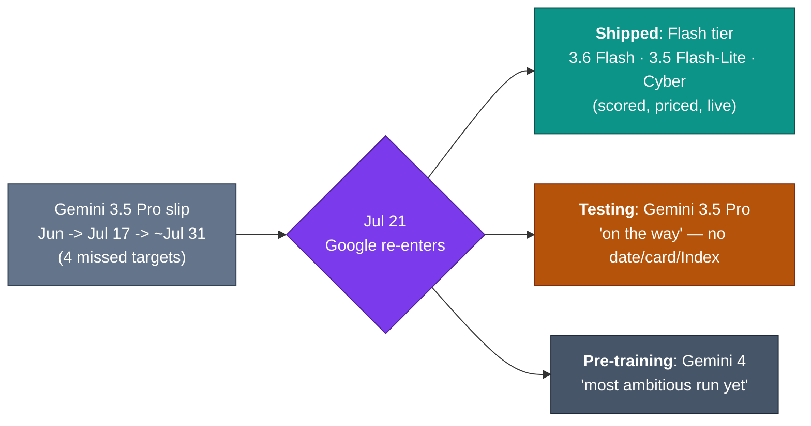

# LLM Updates — 2026-Jul-22

Wednesday brief, written Wed Jul 22 (Los Angeles time). Tuesday's report (Jul-21) closed
on the thesis that *"the pricing **mechanism** is now the frontier"* and left five
watch-items — the loudest being *whether Google would ever attach a date, model card, or
Index score to its absent flagship, "or ship a **Gemini 3.6 Flash** stopgap first"*
(Jul-21 §Watch next; the stopgap thesis runs back to Jul-15 §4). **It shipped the
stopgap.**

One thing defines the 24 hours since Jul-21:

> **Google is back on the board — but with the Flash tier, not the Pro.** On **Jul 21**
> Google launched **Gemini 3.6 Flash** plus two siblings (**3.5 Flash-Lite**, **3.5 Flash
> Cyber**), broke a month of silence to say **Gemini 3.5 Pro is "on the way" and in
> partner testing**, and confirmed **Gemini 4 pre-training has begun**. The launch is a
> near-perfect fit to the "meter is the message" frame: 3.6 Flash's composite
> **Intelligence Index is flat (50, unchanged from 3.5 Flash)** while its **price drops
> and its token-efficiency jumps up to 65%** on long-horizon work. Google's answer to the
> mid-July board is *cost-per-task*, not *smarts-per-token*.

Three things define the window since Jul-21:

1. **The predicted stopgap arrived — a whole Flash tier.** Gemini **3.6 Flash** ($1.50 in /
   **$7.50 out**, down from $9.00), **3.5 Flash-Lite** ($0.30 / $2.50), and a security-tuned
   **3.5 Flash Cyber**, all Jul 21, live on AI Studio / Vertex / the Gemini app. The
   headline is efficiency: **−17% output tokens**, **304 tok/s**, and a knowledge cutoff
   that jumps **Jan 2025 → Mar 2026** (§1).
2. **The gains are real on tasks and absent on the composite Index.** 3.6 Flash beats 3.5
   Flash on every published benchmark (DeepSWE 37→49, MLE Bench 49.7→63.9, SWE-Bench Pro
   55.1→58.7, OSWorld 78.4→83.0) — yet Artificial Analysis scores it **50, identical to
   3.5 Flash**, below Muse Spark 1.1, GLM-5.2, Sonnet 5, Grok 4.5, GPT-5.6 Terra/Luna. The
   "worst model" headlines and the "biggest efficiency Flash yet" headlines are **both
   right**, about different axes (§2, §3).
3. **Two Jul-21 watch-items resolved.** Google **broke its silence** on Gemini 3.5 Pro
   (still no ship, but now an on-record "on the way" + a Gemini 4 pre-training run), and
   the **"grayscale routing" claim** (Jul-21 §2 — that DeepSeek V4 was secretly proxying
   to Claude Fable 5) has been **debunked**: the changed outputs are a genuine V4-GA
   checkpoint, not a third-party model behind a proxy (§4).

The through-line: Jul-21 argued the labs stopped competing on the *rate* and started
competing on *how the meter runs* (tier splits, time-of-day surge). Google's Jul-21→22
move is the same shift from a **third** angle — competing on *tokens burned per completed
task*. A model with the *same* Index that finishes a coding agent's job with up to 65%
fewer output tokens is cheaper in practice without being smarter on paper. Efficiency, not
intelligence, is Google's re-entry ticket.

This report does **not** re-derive the Gemini 3.5 Pro slip history and stopgap-Flash
thesis (Jul-15 §4, Jul-17 §2, Jul-20 §4, Jul-21 §3), the DeepSeek V4 GA + peak/off-peak
pricing and the grayscale controversy's *setup* (Jul-21 §1–§2), the Fable 5 tier split
(Jul-20 §1), or the Inkling / Kimi K3 open-weights spread (Jul-20 §2–§3). Those stand as
written. Here we advance only what is **new since Jul-21.**

![Grouped bar chart comparing Gemini 3.5 Flash in slate with Gemini 3.6 Flash in teal across five benchmarks on a 0 to 100 scale. The Artificial Analysis Intelligence Index is flat at 50 for both models. Every task benchmark rises for 3.6 Flash: SWE-Bench Pro 55.1 to 58.7, DeepSWE 37 to 49, MLE Bench 49.7 to 63.9, and OSWorld-Verified 78.4 to 83.0. A callout notes output price falls from 9.00 to 7.50 dollars per million tokens, output tokens drop 17 percent, and long-horizon token use falls up to 65 percent on DeepSWE. The chart's message is that 3.6 Flash is cheaper and more token-efficient without being more intelligent on the composite index.](gemini_flash_efficiency_not_iq.svg)

---

## 1. Google ships the stopgap — a three-model Flash tier (Jul 21)

The stopgap-Flash thesis these briefs carried since Jul-15 — that Google would ship an
**upgraded Flash before the Pro**, using the GA'd Gemini 3.5 Flash to hold production
workloads in the interim (Jul-17 §2, Jul-20 §4, Jul-21 §3) — resolved **exactly as
forecast**. On **Jul 21** Google launched not one model but a **Flash tier**:

| Model | Input $/Mtok | Output $/Mtok | Role |
|---|---|---|---|
| **Gemini 3.6 Flash** | **$1.50** | **$7.50** (was $9.00) | mainline agentic / high-volume Flash |
| **Gemini 3.5 Flash-Lite** | **$0.30** | **$2.50** | cheapest tier, latency-sensitive work |
| **Gemini 3.5 Flash Cyber** | *(pilot; not list-priced)* | — | vulnerability find/fix, gated (§3) |

Gemini 3.6 Flash's pitch is **operational efficiency**, not a new intelligence ceiling:

- **Cheaper and lighter per token.** Output falls from **$9.00 → $7.50/Mtok** (input
  unchanged at $1.50), and the model uses **~17% fewer output tokens** to finish the same
  work. On long-horizon software tasks the compounding is larger — Google claims **up to
  65% lower token cost on DeepSWE-style multi-step engineering**, because fewer tokens
  *per step* multiply across a long agent trajectory.
- **Faster and more current.** Generation is quoted at **~304 tokens/second**, and the
  **knowledge cutoff jumps from January 2025 to March 2026** — a 14-month leap that is
  arguably the most useful practical change for day-to-day use.
- **Better on every published task benchmark** (see §2 for the numbers and the catch).
- **Available immediately** through the Gemini API in **Google AI Studio** and **Vertex
  AI**, with sightings in the consumer **Gemini app**. This is a shipped GA product, not a
  preview — the first current-generation Gemini flagship-family model these briefs can
  actually score and price since the series began tracking the slip.

The framing matters: after a month of "absence hardens" (Jul-16 → Jul-21), Google did not
answer the frontier question (the Pro is still not here). It answered a **different**
question — *what is the cheapest competent model to run an agent on* — and did it with a
tier built explicitly for agentic, high-volume workloads.

**Sources:**
[Google — Introducing Gemini 3.6 Flash, 3.5 Flash-Lite, and 3.5 Flash Cyber](https://blog.google/innovation-and-ai/models-and-research/gemini-models/gemini-3-6-flash-3-5-flash-lite-3-5-flash-cyber/) ·
[MarkTechPost — Google releases Gemini 3.6 Flash, 3.5 Flash-Lite, and 3.5 Flash Cyber: a cheaper, more token-efficient Flash tier for agentic workloads](https://www.marktechpost.com/2026/07/21/google-releases-gemini-3-6-flash-3-5-flash-lite-and-3-5-flash-cyber-a-cheaper-more-token-efficient-flash-tier-built-for-agentic-workloads/) ·
[VentureBeat — Gemini 3.6 Flash cuts AI agent token costs by up to 65% on long-horizon tasks — and 3.5 Pro is on the way](https://venturebeat.com/technology/googles-gemini-3-6-flash-model-cuts-ai-agent-token-costs-by-up-to-65-on-long-horizon-engineering-tasks-and-3-5-pro-is-on-the-way) ·
[9to5Google — Google launches Gemini 3.6 Flash and 3.5 Flash-Lite, teases Gemini 4](https://9to5google.com/2026/07/21/gemini-3-6-flash-launch/) ·
[officechai — Gemini Flash 3.6 priced cheaper than 3.5 Flash](https://officechai.com/ai/google-releases-gemini-flash-3-6-and-gemini-flash-3-5-lite/)

---

## 2. The gains are real on tasks — and flat on the composite Index

Here is the tension that produced two opposite sets of headlines on the same day. **On
every published benchmark, 3.6 Flash beats 3.5 Flash:**

| Benchmark | Gemini 3.5 Flash | **Gemini 3.6 Flash** |
|---|---|---|
| DeepSWE (multi-step SWE agent) | 37% | **49%** |
| MLE Bench | 49.7% | **63.9%** |
| OSWorld-Verified (computer use) | 78.4% | **83.0%** |
| SWE-Bench Pro | 55.1% | **58.7%** |
| GDPval-AA v2 (knowledge work, Elo) | 1349 | **1421** |

**And yet** the Artificial Analysis **Intelligence Index — the composite these briefs use
as the spine of the frontier map — scores 3.6 Flash at 50, identical to 3.5 Flash**
(rank ~21 of 187 models). On that aggregate it does not beat **Muse Spark 1.1, GLM-5.2,
GPT-5.6 Luna, Claude Sonnet 5, Grok 4.5, or GPT-5.6 Terra** — which is why outlets like
WCCFTech ran "**might be its worst model to date**," while MarkTechPost/VentureBeat ran
"cheapest, most token-efficient Flash yet." **Both are correct**, and the disagreement is
purely about *which axis you weight*:

- The **Index** is a smarts-per-answer composite. On it, 3.6 Flash is a **lateral** move —
  a re-tuned 3.5 Flash, not a smarter model.
- The **task + cost** axes are about *getting a defined job done for less*. On those, 3.6
  Flash is a **clear** step: same class of answer, fewer tokens, lower price, more current
  knowledge, faster.

This is the honest read, and it is *exactly* the shape Jul-21 predicted the market would
move toward. When a near-Opus open model sells output at 1/57th of Fable 5 (Jul-21 §1),
raising the Index is not where a Flash-tier model competes — **lowering the cost of a
completed task is.** 3.6 Flash is the first major model whose headline improvement is
*efficiency with the intelligence held constant*, and the split-screen coverage is the
tell that the industry's scoreboards haven't caught up to that yet.

**Sources:**
[Artificial Analysis — Gemini 3.6 Flash: intelligence, performance & price analysis](https://artificialanalysis.ai/models/gemini-3-6-flash) ·
[WCCFTech — Google just released Gemini 3.6 Flash, and it might be its worst model to date](https://wccftech.com/google-just-released-gemini-3-6-flash-and-it-might-be-its-worst-model-to-date/) ·
[felloAI — Gemini 3.6 Flash: pricing, benchmarks & what's new](https://felloai.com/gemini-3-6-flash/) ·
[Requesty — gemini-3.6-flash API pricing, context window & benchmarks](https://www.requesty.ai/models/vertex/gemini-3.6-flash)

---

## 3. Gemini 3.5 Flash Cyber — the "gated frontier for defenders" pattern returns

The third model in Thursday's tri-launch is the one that rhymes with a recurring theme in
these briefs. **Gemini 3.5 Flash Cyber** is a **3.5 Flash derivative fine-tuned to find,
validate, and patch software vulnerabilities**, and — like Mythos 5 before it (scoped to
~100 approved US defenders, Jul-01 §1) and the "US cyber threshold" that gated GPT-5.6 and
delayed Gemini's own launch (Jul-08 §1) — it is **not a general release**:

- **Deployment is gated.** It ships through Google's automated remediation platform
  **CodeMender** under a **limited-access pilot reserved for governments and trusted
  enterprise partners** — the same "release the offensive-capable model only to
  defenders" posture the June–July export saga established, now applied voluntarily by the
  vendor rather than by an export order.
- **The agentic pattern is the point.** CodeMender calls Flash Cyber **many times in rapid
  succession**, exploring dozens of alternative execution paths across a codebase in
  parallel before compiling a single vetted report — a multi-agent fan-out where a *cheap,
  fast* model is the enabling ingredient (a frontier-priced model would make the fan-out
  uneconomic). This is the clearest production example yet of *why the Flash-tier
  efficiency story (§1–§2) matters*: it makes swarm-style security automation affordable.
- **Vendor benchmark (flagged as internal).** On Google Chrome's V8 JavaScript engine,
  Flash Cyber is reported to have surfaced **55 confirmed unique vulnerabilities**, vs.
  **47** for stock 3.5 Flash and **36** for Anthropic's Claude Opus 4.6 — a first-party
  number on a first-party target, so treat it as directional, not independent.

The significance: the "dual-use frontier gets fenced to defenders" pattern these briefs
have tracked since June is no longer only an *export-control* story. A vendor just
built a security-specialized model and **chose** to ration it to vetted government/
enterprise users from day one. The gate is becoming a product decision, not just a policy
one.

**Sources:**
[The Hacker News — Google launches Gemini 3.5 Flash Cyber to find and fix software vulnerabilities](https://thehackernews.com/2026/07/google-launches-gemini-35-flash-cyber.html) ·
[Help Net Security — Google's Gemini 3.5 Flash Cyber becomes a vulnerability hunter](https://www.helpnetsecurity.com/2026/07/22/google-gemini-3-5-flash-cyber-model/) ·
[Crypto Briefing — Google unveils Gemini 3.5 Flash Cyber as cost-efficient AI security model](https://cryptobriefing.com/google-gemini-flash-cyber-ai-security/) ·
[Google DeepMind — Gemini 3.5 Flash Cyber](https://deepmind.google/models/gemini/cyber/)

---

## 4. Two Jul-21 watch-items resolve

### 4a. Google breaks its silence on the Pro (but still doesn't ship it)

The Jul-20/21 reading was that Google was the **only tracked lab with no
current-generation flagship on the board and no date** (Jul-20 §4). Half of that changed
on Jul 21. In the **same** launch, Google stated on the record — reflected in the
VentureBeat headline "*…and 3.5 Pro is on the way*" — that:

- **Gemini 3.5 Pro is in testing with partners**, described as "on the way," though
  **still with no public ship date, model card, or Index score.**
- **Gemini 4 pre-training has begun** — DeepMind says it has "already started our most
  ambitious pre-training run yet, for Gemini 4," and coverage also notes a **native
  computer-use** capability teased alongside.

So the absence **softens** but does not end: Google went from *silence* to a *stated
roadmap*, and it now has a scored, priced, shippable model family (the Flash tier) in
market. But the specific unresolved question these briefs have carried for a month — *a
scored, priced Gemini 3.5 **Pro** with a model card* — is **still open.** The market's
Jul-31 / early-August window (Jul-20 §4) is untouched by a Flash launch.

### 4b. The "grayscale routing" claim is debunked

Jul-21 §2 recorded — explicitly as *alleged, not established* — the claim that DeepSeek's
staged V4-GA build was secretly forwarding hard coding requests to Claude Fable 5, on the
strength of chain-of-thought "signature" similarities. **That claim has now been
debunked.** The consensus read:

- **No technical proof** of API-level proxying was ever produced; the evidence stayed
  behavioral (output similarity, CoT-style drift).
- **The changed outputs are a genuine V4-GA checkpoint.** The sharper results testers saw
  from ~Jul 17 reflect a **new instruction-tuning distribution on an updated checkpoint**,
  not a third-party model behind a proxy.
- **Style convergence is expected, not anomalous.** Large models trained on overlapping
  corpora with convergent post-training objectives routinely "sound alike" — a
  style-signature match is weak evidence, exactly as the Jul-21 brief cautioned.

This is the outcome a from-nothing benchmark should want: the salient rumor got recorded
with its uncertainty, then retired on the evidence. It closes the Jul-21 §2 thread without
having ever endorsed it.

**Sources:**
[VentureBeat — …and Gemini 3.5 Pro is on the way](https://venturebeat.com/technology/googles-gemini-3-6-flash-model-cuts-ai-agent-token-costs-by-up-to-65-on-long-horizon-engineering-tasks-and-3-5-pro-is-on-the-way) ·
[9to5Google — Google teases Gemini 4](https://9to5google.com/2026/07/21/gemini-3-6-flash-launch/) ·
[Hugging Face (ResterChed) — DeepSeek V4 GA: architecture, inference efficiency, and what the grayscale test reveals](https://huggingface.co/blog/ResterChed/deepseek-v4-ga-architecture) ·
[kie.ai — DeepSeek V4 release: leaks, preview, and GA signals](https://kie.ai/blog/deepseek-v4-release-what-we-know)

---

## 5. The through-line — a third way to compete on the meter

Jul-21 named the shift: the labs stopped competing on the *rate* and started competing on
*how the meter runs*. It listed two mechanisms — **who you are** (Anthropic's Fable 5 tier
split) and **when you call** (DeepSeek's time-of-day surge). Google's Jul-21→22 launch adds
a **third**: **how many tokens the job takes.**

| Lab / model | Competitive lever this month | What it optimizes |
|---|---|---|
| **Anthropic** Fable 5 | subscriber tier (Max-bundled / Pro-metered) — Jul-20 §1 | *who* pays for the premium tier |
| **DeepSeek** V4 GA | time-of-day peak/off-peak surge — Jul-21 §1 | *when* elastic load runs |
| **Google** Gemini 3.6 Flash | **tokens-per-completed-task** (−17% / up to −65%) | ***how much*** a job costs to finish |

All three concede the same underlying fact Jul-21 identified — serving frontier-class
tokens is capacity-bound and a flat per-token rate leaves value on the table — and each
attacks it from a different side. Google's is arguably the most durable, because it lowers
*real* cost (fewer tokens × price) without touching the sticker rate or asking the customer
to change *when* or *who* they are. A cheaper, same-IQ, more-current, faster Flash that
finishes agent trajectories with fewer tokens is a **cost-per-outcome** play — the natural
next step once the token rate itself has stopped being where models differentiate.

Where the frontier map stands, updated for Jul 22:

| Corner | Model(s) | Status Jul 22 |
|---|---|---|
| Peak quality (closed) | Claude Fable 5 · Mythos 5 | tier split holding (Jul-20 §1); classifier fix still unshipped |
| Platform depth (closed) | GPT-5.6 Sol | unchanged |
| Open · near-frontier | Kimi K3 | weights still due **Jul 27** |
| Open · cheap/near-Opus | DeepSeek V4 (GA) | surge pricing live; grayscale claim **debunked** (§4b) |
| Open · cheap/customizable | Inkling (+ Tinker) | unchanged (Jul-20 §2) |
| **Efficiency / cost-per-task** | **Gemini 3.6 Flash (+ Lite, Cyber)** | **shipped Jul 21 — Index flat, cost down (§1–§3)** |
| Absent (frontier) | **Gemini 3.5 Pro** | **still no ship — but now "on the way" + Gemini 4 in pre-training (§4a)** |

The net for Google: it is **partly back on the board** — with a scored, priced,
efficiency-led Flash tier and a stated Pro/Gemini-4 roadmap — but the specific frontier
seat (a shipped, scored 3.5 Pro) remains empty, and the market's end-July/August line for
it is unchanged.

---

## Watch next

- **Gemini 3.5 Pro — does the "on the way" become a ship?** Whether Google attaches an
  actual date, model card, and Index score to the Pro before the market's Jul-31 line
  (Jul-20 §4) — now that it has broken silence, the pressure to convert words into a launch
  is higher, not lower.
- **Does the 3.6 Flash "efficiency, not IQ" pattern hold up independently?** Whether the
  −17% / up-to-−65% token-efficiency claims survive third-party measurement on real agent
  workloads, and whether a flat composite Index actually costs Google mindshare or whether
  buyers price cost-per-task instead.
- **Flash Cyber's gated-defender model.** Whether the CodeMender pilot expands beyond
  governments/trusted enterprise, and whether rivals ship their own security-specialized,
  deliberately-rationed models — turning the "fence the dual-use frontier to defenders"
  posture from an export rule into a standard product pattern.
- **Kimi K3 open weights (Jul 27).** Unchanged from Jul-17/20/21: whether the weights land,
  under what license ("Modified MIT" still unconfirmed), and how MXFP4 behaves in the wild.
- **DeepSeek V4 formal GA + Jul-24 cutover.** The legacy `deepseek-chat` /
  `deepseek-reasoner` retirement still lands **Jul 24, 15:59 UTC** (Jul-08 §1); whether the
  staged GA gets a posted announcement and whether peak-pricing windows survive real load.
- **Fable 5 classifier fix.** Still unshipped and unmeasured, now ~3 weeks on (Jul-03 §1,
  Jul-20 §1) — the one quality-gate question that has stayed open across every brief since.

---

*Compiled Wed Jul 22 2026 (Los Angeles time) from public reporting and independent
benchmark trackers. Vendor-reported figures (pricing, token-efficiency percentages,
Flash Cyber's internal V8 vulnerability count, roadmap statements) are flagged as such;
independent Intelligence Index and per-benchmark numbers are from Artificial Analysis as
relayed by secondary trackers. Several publisher and primary domains (blog.google,
9to5Google, MarkTechPost, WCCFTech, felloAI, Hugging Face blog) returned HTTP 403 to
direct fetches during compilation, so figures are cited via the search index and secondary
trackers where a direct read failed; benchmark and pricing figures for a one-day-old model
should be treated as provisional. Prior background is referenced by date/section rather
than repeated.*
