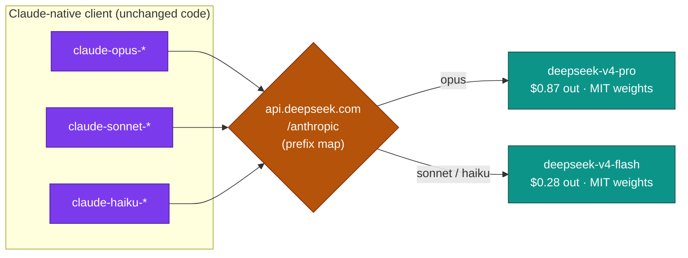
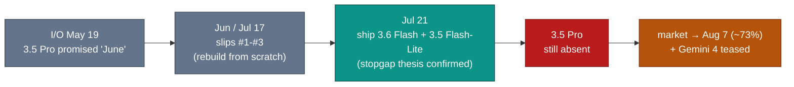

# LLM Updates — 2026-Jul-23

Thursday brief, written Thu Jul 23 (Los Angeles time). Monday's report (Jul-20) left
five items on the board (Jul-20 "Watch next"): *the DeepSeek v4 cutover due Jul 24;
Kimi K3's open weights due Jul 27; whether the Fable 5 tier split would hold; whether
Inkling would pull real fine-tuning volume; and whether Google would attach any date
to the absent Gemini 3.5 Pro — or ship a Gemini 3.6 Flash stopgap first.* **Three of
the five moved, and one of them landed the exact way the brief flagged as the
tell-tale: Google shipped the Flash, not the Pro.**

Three things define the window since Jul-20:

1. **Google finally shipped a current-generation model — the *Flash*, not the Pro.**
   On **Jul 21**, Google released **Gemini 3.6 Flash** (plus a **Gemini 3.5
   Flash-Lite**) — the exact "stopgap Flash first" outcome these briefs flagged since
   Jul-17 (§2). The flagship **Gemini 3.5 Pro is still absent**, and the market has
   pushed its date *back*, not forward: the leading outcome is now **Aug 7 (~73%)**,
   past the Jul 31 line the Jul-20 brief cited. Google also **teased Gemini 4** in the
   same breath (§2).
2. **The DeepSeek v4 alias cutover lands tomorrow — and drops the open-weights price
   floor below a dollar.** The hard retirement of `deepseek-chat` / `deepseek-reasoner`
   (Jul-08 §1) hits **Jul 24 at 15:59 UTC**. Its replacement, **DeepSeek V4 Pro**, is
   **MIT-licensed with day-one weights** at **$0.87/Mtok output** — roughly **1/5 of
   Inkling** and **1/17 of Kimi K3.** The open-weights corner now has a *third*, and
   cheapest, pole (§1, §3).
3. **The Fable 5 tier split is holding as a "permanent" structure, and Inkling's
   fine-tuning bet is real.** No fifth extension, no reversal (§4). Inkling's launch
   customers include **Bridgewater Associates** via Thinking Machines' **Tinker**
   platform — the "adapt-it, don't-rank-it" thesis (Jul-20 §2) with a marquee name
   attached (§4).

The through-line: the mid-July map (Jul-15 §4 → Jul-20 §5) keeps its shape, but the
two corners that were still *open questions* on Monday have now **resolved in
character, not just in date.** Google's absence didn't end — it *specialized*: a
capable mid-tier Flash ships while the frontier Pro keeps slipping. And the
open-weights corner, which grew its second pole last week, now grows a **third at the
bottom** — DeepSeek's MIT-licensed V4 Pro reasserting the sub-dollar floor that Kimi
K3's $15 tag was said to have ended (Jul-17 §1). See chart.

This report does **not** re-derive the Fable 5 / Mythos 5 export saga and shared-weights
+ classifier-gate architecture (Jun-11 §2, Jul-01 §1), the GPT-5.6 family launch and
tiering (Jul-09 §1, Jul-15 §1), Kimi K3's architecture and coding-benchmark split
(Jul-17 §1), Inkling's full spec sheet (Jul-20 §2), Meta's Muse Spark 1.1 closed-API
pivot (Jul-15 §2), or the Fable 5 tier-split mechanics (Jul-20 §1). Those stand as
written. Here we advance only what is **new since Jul-20.**

![Logarithmic price ladder of output cost in dollars per million tokens as of July 23 2026. Open-weights models are shown in teal on the upper row: DeepSeek V4 Flash at $0.28, DeepSeek V4 Pro at $0.87 (MIT, day-one weights), Inkling at $4.68 (Apache-2.0), and Kimi K3 at $15 (weights due July 27). Closed or hosted-API models are in slate-blue on the lower row: Gemini 3.6 Flash at $7.50 (new July 21), GPT-5.6 Sol at $30, and Claude Fable 5 at $50 (Pro credits). The open-weights field now stretches from a new sub-dollar floor at DeepSeek V4 Pro up to Kimi K3, undercutting the closed frontier by one to nearly two orders of magnitude — though Kimi K3 at $15 still sits above the cheapest closed option, Gemini 3.6 Flash.](open_weights_price_floor.svg)

---

## 1. DeepSeek v4 cutover lands tomorrow (Jul 24) — and the price floor drops below $1

The hard date the Jul-08 brief flagged (§1) arrives **Jul 24 at 15:59 UTC**. After that
instant, the legacy aliases `deepseek-chat` and `deepseek-reasoner` **stop resolving** —
any call using them returns an error rather than the silent V4-Flash routing that has
carried them through the grace period since the Apr 24 preview. There is **no extension
under discussion.** The migration is a one-line model-name swap, but the operational
edges are worth stating plainly for anyone still on the old IDs:

| Legacy alias (retires Jul 24 15:59 UTC) | New model ID | Output $/Mtok | Concurrency |
|---|---|---|---|
| `deepseek-reasoner` | **`deepseek-v4-pro`** | **$0.87** ($0.435 in) | 500 req |
| `deepseek-chat` | **`deepseek-v4-flash`** | **$0.28** ($0.14 in, cache-miss) | 2,500 req |

Both expose a **1M-token context**; Flash prices a cache-hit block ~50× under a
cache-miss. Billing systems that aggregate by model ID need the new identifiers, and
historical `deepseek-chat` data maps to V4-Flash for trend continuity.

**The Anthropic-format reroute (Jul-08 §1) is the part that matters for Claude-native
teams.** The endpoint `https://api.deepseek.com/anthropic` accepts the Anthropic SDK
natively and maps model names by prefix:

Set `ANTHROPIC_BASE_URL` + `ANTHROPIC_AUTH_TOKEN` and a Claude Code / OpenCode
workflow runs on DeepSeek with no OpenAI-format shim. The significance is unchanged
from Jul-08 but now *dated*: as of tomorrow, swapping a Claude-native agentic stack
onto **open-weight, MIT-licensed** DeepSeek costs a base-URL change — and the
destination is the cheapest capable tier on the board.

**The pricing is the headline the Jul-17 brief's "end of super-cheap Chinese AI" read
did not anticipate.** Kimi K3 at $15/Mtok output was framed as the signal that Chinese
labs had stopped loss-leading (Jul-17 §1). DeepSeek just re-drew the floor underneath
it: **V4 Pro at $0.87 output is ~17× cheaper than Kimi K3 and ~57× cheaper than Fable
5's Pro-credit rate** — and it ships weights on Hugging Face day one under a clean MIT
license. On a cost-per-task basis, independent trackers put V4 Pro at roughly **$0.04
per task**, the cost leader of the trillion-scale open field. Kimi K3's up-move was a
*Moonshot* pricing decision, not an industry one; DeepSeek is answering it by
undercutting, not matching.

**Sources:**
[DeepSeek API Docs — Anthropic API (base URL, model mapping)](https://api-docs.deepseek.com/guides/anthropic_api/) ·
[DeepSeek API Docs — V4 Preview release notes](https://api-docs.deepseek.com/news/news260424/) ·
[Enterprise DNA — DeepSeek API migration: July 24 deadline](https://enterprisedna.co/resources/news/deepseek-api-migration-july-24-deadline-2026/) ·
[TheRouter.ai — deepseek-chat/reasoner deprecation & Anthropic routing playbook](https://therouter.ai/news/deepseek-chat-reasoner-deprecation-v4-migration-routing/) ·
[MarkTechPost — Kimi K3 vs DeepSeek V4 Pro vs GLM-5.2 (license, cost-per-task)](https://www.marktechpost.com/2026/07/18/kimi-k3-vs-deepseek-v4-pro-vs-glm-5-2-open-trillion-scale-moe-models-compared-on-benchmarks-license-and-serving-cost/) ·
[BenchLM.ai — DeepSeek API pricing (V4 Pro & Flash rates, July 2026)](https://benchlm.ai/deepseek/api-pricing)

---

## 2. Google ships Gemini 3.6 Flash (Jul 21) — the stopgap, not the flagship

The "stopgap Flash first" thesis these briefs carried since Jul-17 (§2) — that Google
would ship an upgraded Flash *before* the Pro cleared its reliability wall — **resolved
on Jul 21.** Google released **Gemini 3.6 Flash** and a lighter **Gemini 3.5
Flash-Lite**, live in the Gemini app and, for developers, through **Google
Antigravity, AI Studio, Android Studio, and third-party tools including GitHub
Copilot.** Gemini 3.6 Flash **replaces** Gemini 3.5 Flash as the mid-tier default.

| Attribute | Gemini 3.6 Flash |
|---|---|
| Released | **Jul 21, 2026** (replaces Gemini 3.5 Flash) |
| Pricing | **$1.50 in / $7.50 out per Mtok** |
| Intelligence Index | **50** — *unchanged* from Gemini 3.5 Flash (median for tier: 31) |
| Headline gain | **GDPval-AA v2 +72 Elo → 1,421**; small regression on HLE (−3 → 38%) |
| Efficiency claim | Same reasoning quality at **fewer tokens, fewer tool calls, ~half the time per task** |
| Also shipped | **Gemini 3.5 Flash-Lite** (cheaper/faster tier) |

The read is precise and a little deflationary. **Gemini 3.6 Flash did not get
*smarter* on the aggregate — it matches 3.5 Flash's Index of 50 almost
evaluation-for-evaluation.** What changed is **efficiency and one real-work jump**: it
reaches the same answers with fewer tokens and tool calls (Artificial Analysis frames
it as *"halving time per task"*), and it posts a **+72 Elo leap on GDPval-AA v2** — the
economically-weighted real-task benchmark — to 1,421, against a modest slide on
Humanity's Last Exam. At **$7.50/Mtok output** it is Google's cheapest current model
and, notably, **cheaper than the near-frontier open Kimi K3 ($15)** — but it sits at
Index 50, a point *under* Meta's Muse Spark 1.1 (51) and GPT-5.6 Luna (51), and far
below the frontier tier.

For these briefs the point is structural, not benchmark-line: **Google's absence from
the frontier did not end — it specialized.** Google now has a live, priced,
independently-scored *mid-tier* model on the board again, which it lacked all through
early July. But the **flagship Gemini 3.5 Pro is still not shipped, still uncarded,
still unpriced**, and the reasons are the same hard ones (coding shortfalls,
hallucinations, reliability gaps that triggered the from-scratch pre-training restart —
Jul-08 §1, Jul-16). And the timing moved the *wrong* way:

**The market repriced *later*, not sooner.** On Jul-20 the leading outcome was Jul 31
(~81%); after the Flash shipped, prediction markets moved the leading Pro date to **Aug
7 (~73%)** — i.e. shipping the stopgap *bought Google time* and the crowd took the July
line off the table. And Google **teased Gemini 4** alongside the 3.6 Flash launch,
raising the live question of whether DeepMind partly reroutes effort past the
troubled 3.5 Pro toward the next generation. Name registrations and teasers remain
intent, not shipping.

**Sources:**
[9to5Google — Google launches Gemini 3.6 Flash and 3.5 Flash-Lite, teases Gemini 4 (Jul 21)](https://9to5google.com/2026/07/21/gemini-3-6-flash-launch/) ·
[Artificial Analysis — Gemini 3.6 Flash & 3.5 Flash-Lite: halving time per task](https://artificialanalysis.ai/articles/gemini-3-6-flash-3-5-flash-lite-halving-time) ·
[officechai — Gemini 3.6 Flash scores 50 on AA Intelligence Index, same as 3.5 Flash](https://officechai.com/ai/gemini-3-6-flash-scores-50-on-artificial-analysis-intelligence-index-same-as-gemini-3-5-flash/) ·
[Artificial Analysis (X) — 3.6 Flash maintains 3.5 Flash's Intelligence, +72 on GDPval-AA v2](https://x.com/ArtificialAnlys/status/2079596244339707956) ·
[Bloomberg — Google Gemini launch delayed as tech falls short of internal goals (Jul 16)](https://www.bloomberg.com/news/articles/2026-07-16/google-gemini-launch-delayed-as-tech-falls-short-of-internal-goals) ·
[Bind AI — Gemini 3.5 Pro slips; market prices Aug 7](https://blog.getbind.co/gemini-3-5-pro-slips-to-july-and-four-senior-google-researchers-just-left-for-anthropic/)

---

## 3. The open-weights map now has three poles — and the floor moved

Last week's brief resolved the open-weights corner into a two-pole *spread* (Jul-20 §3):
Inkling (US, cheap, Apache-2.0, mid-tier) versus Kimi K3 (China, near-frontier,
$15, weights promised). Tomorrow's DeepSeek cutover adds a **third pole below both** —
and it is the one that most directly contradicts a claim these briefs made a week ago.

| | **DeepSeek V4 Pro** | **Inkling** | **Kimi K3** |
|---|---|---|---|
| Lab / origin | DeepSeek · **China** | Thinking Machines · **US** | Moonshot AI · **China** |
| License | **MIT** (confirmed) | **Apache 2.0** (confirmed) | "Modified MIT" (**still unconfirmed**) |
| Weights | **live on HF, day one** | **live** (Jul 15) | **due Jul 27** |
| Output $/Mtok | **$0.87** | ~$4.68 | $15 |
| Positioning | **cheapest capable tier · MIT** | cheap, customizable base | near-frontier, trades coding wins |
| Cost/task (indicative) | **~$0.04** | low | highest of the three |

Three reads:

- **The "super-cheap Chinese AI is over" call (Jul-17 §1) was premature.** Kimi K3's $15
  tag signaled *Moonshot's* move up-market, not the field's. DeepSeek answered it by
  reasserting a sub-dollar floor with weights and a permissive license attached — the
  low-cost/high-volume open pole is very much alive, just held by a different Chinese
  lab than the one that set the $15 mark.
- **License clarity now tracks with price at the bottom.** DeepSeek V4 Pro (MIT,
  confirmed, day-one weights) and Inkling (Apache-2.0, confirmed, live) are the two
  *cleanest* open options; Kimi K3 — the strongest of the three — is still on an
  **unconfirmed** "Modified MIT" and weights that haven't dropped. The cheaper, more
  permissive models are the ones you can actually deploy today.
- **The closed labs face open pressure across the *entire* price range now.** From
  $0.28 (V4 Flash) through $0.87 (V4 Pro) and $4.68 (Inkling) up to $15 (Kimi K3), the
  open field brackets everything from the volume floor to the near-frontier ceiling —
  and, for the first time on these charts, part of it (Kimi K3 at $15) sits *above* a
  closed option (Gemini 3.6 Flash at $7.50), so "open = cheap" is no longer even
  reliably true. The axis is a spread of licenses, prices, and capability, not a slogan.

**Standing watch-item, still open:** Kimi K3's promised weights are due **Jul 27** —
four days out — under the still-unconfirmed license. That remains the single largest
unresolved open-weights question (Jul-20 "Watch next"), and it now lands into a field
where DeepSeek has just reset expectations on both price and license cleanliness.

**Sources:**
[MarkTechPost — Kimi K3 vs DeepSeek V4 Pro vs GLM-5.2 (license, cost-per-task)](https://www.marktechpost.com/2026/07/18/kimi-k3-vs-deepseek-v4-pro-vs-glm-5-2-open-trillion-scale-moe-models-compared-on-benchmarks-license-and-serving-cost/) ·
[cryptobriefing — Kimi K3: open weights dropping July 27](https://cryptobriefing.com/kimi-k3-open-weights-july-27/) ·
[Nathan Lambert (Interconnects) — Kimi K3: the open-weights escalation](https://www.interconnects.ai/p/kimi-k3-the-open-weights-escalation) ·
[techsy.io — Best open-source LLMs: July 2026 leaderboard](https://techsy.io/en/blog/best-open-source-llms-2026)

---

## 4. Standing threads — Fable 5 tier split holds; Inkling's fine-tuning bet gets a marquee name

Two Jul-20 watch-items advanced without changing the map's shape:

- **The Fable 5 tier split is holding as "permanent."** The Jul-20 resolution — Fable 5
  bundled on **Max / Team Premium** at 50% of weekly limits, and **usage credits
  ($10 in / $50 out per Mtok) plus a one-time $100 credit** for **Pro / Team Standard**
  (Jul-20 §1) — has seen **no fifth extension and no reversal** three days on. The
  structure is behaving like the durable two-tier design Anthropic framed it as, not
  another countdown. **The classifier false-positive fix (Jul-03 §1) is still unshipped
  and unmeasured** — now roughly **three-and-a-half weeks** since the Jul-2 BridgeBench
  measurement, with no independent re-test. Pricing resolved; the quality-gate question
  has not.
- **Inkling's "adapt-it, don't-rank-it" bet has a real customer.** The Jul-20 read (§2)
  — that Inkling monetizes through **fine-tuning on Tinker (LoRA), not a metered chat
  API** — is confirmed by Thinking Machines' own framing, and the launch names
  **Bridgewater Associates** among customers already building on Tinker. An **Inkling
  Playground** shipped in the Tinker console. This is the clearest early signal that
  the US open-weights pole is being taken up for exactly the use it was designed for —
  proprietary-data customization — rather than as a leaderboard entry. Whether that
  converts to broad volume (and whether **Inkling-Small** graduates from preview) is
  still the open question.

**Sources:**
[Thinking Machines Lab — Introducing Inkling (Tinker fine-tuning, Playground)](https://thinkingmachines.ai/news/introducing-inkling/) ·
[Enterprise DNA — Thinking Machines Inkling: own your AI model (Bridgewater on Tinker)](https://enterprisedna.co/resources/news/thinking-machines-inkling-open-weight-enterprise-ai-2026/) ·
[Simon Willison — "Claude: make Fable 5 permanent" (Jul 18)](https://simonwillison.net/2026/Jul/18/claude-make-fable-5-permanent/)

---

## 5. The through-line — the map holds; Google specializes, the open floor drops

The frontier map (Jul-15 §4 → Jul-20 §5) keeps its shape. What changed this week is the
*bottom-left* and the *Google row*:

| Corner | Model(s) | Index | Output $/Mtok | Weights | Change since Jul-20 |
|---|---|---|---|---|---|
| Peak quality | Claude Fable 5 · Mythos 5 (scoped) | 59.9 / 60 | $50 (Pro) / bundled (Max) | closed | Tier split **holds** (§4) |
| Platform depth | GPT-5.6 Sol (max) | 58.9 | $30 | closed | — |
| Open · near-frontier | Kimi K3 | 57 | $15 | open **≤ Jul 27** | weights still pending (§3) |
| Price-efficiency (closed) | Grok 4.5 · Muse Spark 1.1 | 54 / 51 | $6 / $4.25 | closed | — |
| **Google mid-tier** | **Gemini 3.6 Flash** | **50** | **$7.50** | closed | **new — shipped Jul 21 (§2)** |
| Open · cheap base | Inkling | 41 | ~$4.68 | open (Apache-2.0) | Bridgewater/Tinker uptake (§4) |
| **Open · price floor** | **DeepSeek V4 Pro** | *(mid)* | **$0.87** | **open (MIT, live)** | **cutover Jul 24 (§1, §3)** |
| Absent | **Gemini 3.5 Pro** | — | — | — | market → **Aug 7** (§2) |

Three shifts stand out. **First, Google is back on the board — one tier down.** A
scored, priced Gemini 3.6 Flash at Index 50 fills the mid-tier hole Google carried all
month, but the frontier Pro is still absent and now priced by the market for **August**,
with **Gemini 4** teased over its shoulder. The stopgap-Flash prediction resolved
*correct*; the flagship one keeps sliding. **Second, the open-weights floor dropped
below a dollar.** DeepSeek's Jul-24 cutover puts an MIT-licensed, day-one-weights model
at **$0.87/Mtok output** under the whole field — reopening the low-cost pole that Kimi
K3's $15 was said to have closed. **Third, "open" and "cheap" have decoupled.** With
Kimi K3 ($15) now pricier than Gemini 3.6 Flash ($7.50), open weights is a *spread*
across license, price, and capability — not a single value proposition.

The one thing that has *not* moved all month remains the largest open question: a
scored, priced, model-carded **Gemini 3.5 Pro** at the frontier. Until it appears (or
Google pivots publicly to Gemini 4), Google is the only tracked lab whose
current-generation *flagship* is neither scored nor priced — even as its mid-tier is
now, again, live.

---

## Watch next

- **DeepSeek v4 cutover executes (Jul 24 15:59 UTC).** Whether the hard alias
  retirement lands cleanly, whether the Anthropic-format reroute holds under load at
  the new concurrency caps (Pro 500 / Flash 2,500), and whether the $0.87 floor forces
  a response from Moonshot (Kimi K3) or Zhipu (GLM-5.2).
- **Kimi K3 open weights (Jul 27).** The headline open-weights watch-item, four days
  out: whether the ~1.4 TB MXFP4 weights actually drop, under what license (the
  "Modified MIT" claim is still unconfirmed), and how the release behaves against a
  field where DeepSeek just reset the price/license bar.
- **Gemini 3.5 Pro — date, or a Gemini 4 pivot?** Whether Google attaches any official
  date, model card, or Index score to the Pro before the market's Aug 7 line — or lets
  Gemini 3.6 Flash carry production while it teases Gemini 4. The reliability wall
  (coding, hallucinations) is unchanged, not newly fixed.
- **Fable 5 tier split durability + the classifier fix.** Whether the Max-bundled /
  Pro-metered structure sticks past its first full billing cycle, how fast Pro users
  burn the $100 credit, and whether the ~3.5-week-unshipped classifier false-positive
  fix (Jul-03 §1) ever gets a date or an independent re-measurement.
- **Inkling adoption depth.** Whether Bridgewater-style Tinker uptake broadens into
  measurable fine-tuning volume, and whether **Inkling-Small** ships from preview to GA.

---

*Compiled Thu Jul 23 2026 (Los Angeles time) from public reporting and independent
benchmark trackers. Vendor-reported figures (parameter counts, pricing, routing,
concurrency) are flagged as such; independent Intelligence Index and per-benchmark
numbers are from Artificial Analysis as relayed by secondary trackers. Several
publisher and primary domains (9to5Google, digitalapplied, and others) returned HTTP
403 to direct fetches during compilation, so figures are cited via the search index
and secondary trackers where a direct read failed; benchmark and price figures for
models less than two weeks old (Gemini 3.6 Flash, DeepSeek V4, Kimi K3, Inkling) should
be treated as provisional. Prior background is referenced by date/section rather than
repeated.*
