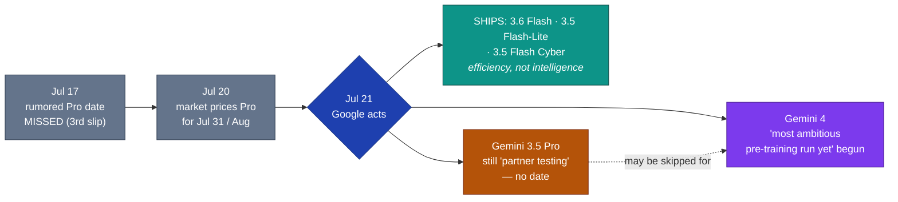

# LLM Updates — 2026-Jul-24

Friday brief, written Fri Jul 24 (Los Angeles time). Monday's report (Jul-20)
closed on five watch-items: *Kimi K3's promised Jul-27 open weights; whether the
Fable 5 tier split would hold; Inkling adoption; whether Google would attach any
date to the absent Gemini 3.5 Pro before the market's Jul-31 line; and the DeepSeek
v4 legacy cutover due this week* (Jul-20 "Watch next"). Four days later, **the two
items that moved are the two at the edges of the map — Google and DeepSeek — and
both moved in ways the Monday brief did not pencil in.**

Two things define the window since Jul-20:

1. **Google came back onto the board — but at the *Flash* tier, not the Pro tier —
   and openly redirected attention to Gemini 4.** On **Jul 21** Google shipped
   **three** models at once (Gemini 3.6 Flash, Gemini 3.5 Flash-Lite, and a
   restricted Gemini 3.5 Flash Cyber) and its product lead confirmed **Gemini 3.5
   Pro is still only "testing with partners"** while **"the most ambitious
   pre-training run yet, for Gemini 4"** has already begun. The "stopgap Flash"
   thesis these briefs tracked (Jul-17 §2, Jul-20 §4) **resolved as fact** — and the
   flagship question mutated from *"when does 3.5 Pro ship"* into *"does Google skip
   it for Gemini 4."* (§1, §2)
2. **The DeepSeek v4 legacy cutover landed today, on schedule.** As of **Jul 24
   15:59 UTC**, `deepseek-chat` and `deepseek-reasoner` are **hard-retired** — the
   Jul-08 §1 watch-item resolves exactly as dated, with one concrete gotcha for
   anyone doing the "one-line" rename (§3).

The through-line: the mid-July frontier map (Jul-15 §4 → Jul-20 §5) keeps its shape,
but **Google's corner finally has *something* in it** — just not the thing everyone
was waiting for. Google chose to compete on **efficiency** (speed, price,
token-count) at the Flash tier and on **specialized cyber tooling**, while conceding
the **intelligence-flagship** rung remains empty and betting the next real answer is
a *generation* away, not a point-release.

This report does **not** re-derive the Fable 5 / Mythos 5 architecture and the Jul-20
tier split (Jul-01 §1, Jul-20 §1), the GPT-5.6 family (Jul-09 §1, Jul-15 §1), Kimi K3
(Jul-17 §1) or Inkling (Jul-20 §2) — those are **unchanged since Monday** (§4). Here
we advance only what is **new since Jul-20.**

![Horizontal bar chart of Artificial Analysis Intelligence Index by Gemini tier after Google's Jul 21 2026 release. Gemini 3.5 Flash-Lite ships at Index 36, up 11 points from 3.1 Flash-Lite, in teal. Gemini 3.6 Flash ships at Index 50 — flat versus 3.5 Flash — in teal, but with task time roughly halved and 17 percent fewer output tokens. The Gemini 3.5 Pro flagship rung is an empty amber dashed bar marked "not shipped, still in partner testing." A purple dashed bar marks Gemini 4, whose "most ambitious pre-training run yet" has just started. Google shipped efficiency at the Flash tier while the flagship tier stayed empty and attention shifted to Gemini 4.](gemini_flash_tier_pro_hole.svg)

---

## 1. Google ships the Flash tier — three models, Jul 21

After missing the rumored Jul-17 Pro date (Jul-17 §2) and letting the market drift
to a Jul-31/Aug line (Jul-20 §4), Google **broke its silence on Jul 21** — but with
the *stopgap*, not the flagship. It released three models the same day:

| Model | Index | Price (in/out $/Mtok) | What it is | Availability |
|---|---|---|---|---|
| **Gemini 3.6 Flash** | **50** (flat vs 3.5 Flash) | **$1.50 / $7.50** | Faster, cheaper Flash — same intelligence, ~½ task time | GA — AI Studio, API, app |
| **Gemini 3.5 Flash-Lite** | **36** (**+11** vs 3.1 Flash-Lite's 25) | ~$0.25 / $1.50 (est.) | Cheapest tier, biggest *relative* Index jump | GA |
| **Gemini 3.5 Flash Cyber** | not indexed | restricted pilot | Vulnerability-finding/patching model on the Flash base | **Gov + trusted partners only**, via CodeMender |

The defining feature of the release is **what did *not* move: intelligence.** On the
Artificial Analysis Intelligence Index, **Gemini 3.6 Flash scores 50 — identical to
Gemini 3.5 Flash**, evaluation-for-evaluation, with only two deltas of note: a
**+72-Elo jump on GDPval-AA v2 (to 1421)** and a **3-point slide on Humanity's Last
Exam (to 38%)**. What Google actually shipped is **efficiency**:

- **Task time roughly halved** — average time per task on the AA Index fell from
  **~2.7 min to ~1.3 min.**
- **~17% fewer output tokens** on the same Index, cutting estimated task cost **~18%.**
- **Output price cut** from **$9.00 → $7.50** per Mtok (input flat at $1.50; cached
  input $0.15); knowledge cutoff advanced to **March 2026**; ~280 tok/s.

**Flash-Lite** is the more interesting *movement*: at Index 36 it is **+11 points**
over the 3.1 Flash-Lite it replaces (25) — the largest relative gain in the release —
and it too roughly halves time per task. It sits just below Gemini 3.6 Flash on the
cheap end of Google's ladder.

The read: Google, unable to field an intelligence-flagship, competed on the axis it
*could* win — **cost and latency**. Artificial Analysis' own summary is blunt:
"Gemini 3.6 Flash does not improve in intelligence over 3.5 Flash." At Index 50 the
Flash tier lands **just under Muse Spark 1.1 (51) and GPT-5.6 Luna (51)** — squarely
a mid-tier efficiency play, not a frontier entry.

**Sources:**
[Google blog — Introducing Gemini 3.6 Flash, 3.5 Flash-Lite, and 3.5 Flash Cyber](https://blog.google/innovation-and-ai/models-and-research/gemini-models/gemini-3-6-flash-3-5-flash-lite-3-5-flash-cyber/) ·
[Artificial Analysis — Gemini 3.6 Flash & 3.5 Flash-Lite: halving time per task](https://artificialanalysis.ai/articles/gemini-3-6-flash-3-5-flash-lite-halving-time) ·
[Artificial Analysis on X — benchmark summary](https://x.com/ArtificialAnlys/status/2079596244339707956) ·
[9to5Google — Gemini 3.6 Flash & 3.5 Flash-Lite launch, Gemini 4 teased (Jul 21)](https://9to5google.com/2026/07/21/gemini-3-6-flash-launch/) ·
[TechCrunch — Google releases three new Gemini models — but no 3.5 Pro (Jul 21)](https://techcrunch.com/2026/07/21/google-releases-three-new-gemini-models-but-no-3-5-pro/) ·
[officechai — Gemini 3.6 Flash scores 50, same as 3.5 Flash](https://officechai.com/ai/gemini-3-6-flash-scores-50-on-artificial-analysis-intelligence-index-same-as-gemini-3-5-flash/)

### 1a. Gemini 3.5 Flash Cyber — a restricted, government-gated vuln-hunter

The third model rhymes with a theme these briefs have tracked since the Fable 5 /
Mythos "Glasswing" cyber lineage (Jul-01 §1): **a capable security model released
under restricted, government-facing access.** **Gemini 3.5 Flash Cyber** is a
Flash-based model tuned to **discover, validate, and patch software vulnerabilities**,
deployed through Google's **CodeMender** agent as a **limited-access pilot for
governments and trusted partners** — explicitly *not* a public release, on stated
dual-use / misuse grounds.

The capability claim is notable: in stress-testing on real codebases (Chrome, Safari),
Google reports it **"significantly" surpassed Gemini 3.5 Flash, 3.6 Flash, and
Anthropic's Claude Opus 4.6** at finding new vulnerabilities — its pitch is being a
*cheap, fast* security model you can call many times to scan more code paths, rather
than a single expensive pass. (Comparison is vs Opus 4.6, a prior-generation Claude,
not Fable 5 / Opus 4.8.)

**Sources:**
[Google DeepMind — Introducing Gemini 3.5 Flash Cyber](https://deepmind.google/blog/introducing-gemini-3-5-flash-cyber/) ·
[The Hacker News — Gemini 3.5 Flash Cyber to find and fix software vulnerabilities](https://thehackernews.com/2026/07/google-launches-gemini-35-flash-cyber.html) ·
[Help Net Security — Gemini 3.5 Flash Cyber becomes a vulnerability hunter (Jul 22)](https://www.helpnetsecurity.com/2026/07/22/google-gemini-3-5-flash-cyber-model/) ·
[GCN — Google launches Gemini Flash + cybersecurity model with 17% fewer output tokens](https://gcn.com/google-launches-gemini-flash-cybersecurity-model/19924/)

---

## 2. The Pro question becomes a Gemini 4 question

The most consequential line in the Jul 21 release was not a model — it was the
framing around the one Google *didn't* ship. Two things happened at once:

- **Gemini 3.5 Pro is still "testing with partners."** DeepMind product lead **Logan
  Kilpatrick** said the flagship is in partner testing and Google "hopes to land [it]
  soon" — still **no date, no model card, no Index score, no price.** This is the
  fourth-plus consecutive slip (Jul-17 §2, Jul-20 §4); the difference now is that
  Google has *shipped around it* rather than shipping it.
- **Gemini 4 pre-training has started.** Kilpatrick, on X: **"We have started our
  most ambitious pre-training run yet, for Gemini 4, and are excited by the
  progress."** Reporting explicitly floats that Google **"may consider skipping the
  3.5 Pro generation entirely and focusing resources on Gemini 4.0"** — while
  cautioning that name registrations and internal targets are not commitments.

So the Jul-20 framing — *the market prices a 3.5 Pro launch for end-July/August* — is
now partly **overtaken by events.** The relevant question is no longer only "when
does the delayed flagship arrive" but "**is the delayed flagship being quietly
leapfrogged**." Both readings share the same near-term fact: **Google still has no
current-generation intelligence-flagship on the board**, and now says the real one
may be a **generation** away.

The market took the delay badly. On the underlying Bloomberg report that the Pro
"fell short of internal targets, particularly on coding," and that a late-June
training-data fix "produced disappointing results," **Alphabet stock fell ~4.4% —
roughly $200B of market cap in a single session.** The Flash trio was, in part,
Google's answer to that reaction: *ship what works now, promise the big one later.*

**Sources:**
[Logan Kilpatrick on X — "most ambitious pre-training run yet, for Gemini 4"](https://x.com/OfficialLoganK/status/2079594867161022817) ·
[officechai — 3.5 Pro testing with partners; Gemini 4 pre-training begun](https://officechai.com/ai/gemini-3-5-pro-is-testing-with-partners-have-begun-pre-training-run-for-gemini-4-pro-google/) ·
[Search Engine Journal — Google delays Gemini 3.5 Pro over coding, Bloomberg reports](https://www.searchenginejournal.com/gemini-3-5-pro-delayed-over-coding-bloomberg-reports/582660/) ·
[WinBuzzer — Google reportedly delays Gemini 3.5 Pro over coding issues (Jul 20)](https://winbuzzer.com/2026/07/20/google-reportedly-delays-gemini-35-pro-over-coding-issues-xcxwbn/) ·
[The Rundown AI — Google's Gemini lineup has a Pro-sized hole](https://www.therundown.ai/p/google-gemini-lineup-has-a-pro-sized-hole) ·
[Decrypt — Google ships new Gemini Flash models, but Pro is still missing](https://decrypt.co/373975/google-new-gemini-flash-models-pro-still-missing)

---

## 3. DeepSeek v4 legacy cutover lands today (Jul 24 15:59 UTC)

The Jul-08 §1 watch-item resolves **exactly on schedule.** As of **today, Jul 24 at
15:59 UTC**, DeepSeek's legacy aliases **`deepseek-chat` and `deepseek-reasoner` are
hard-retired** — calls using those names now return an error, with no fallback and no
announced grace extension. Callers must move to the explicit generation IDs:

| Legacy alias (retired) | Migrate to | Notes |
|---|---|---|
| `deepseek-chat` (non-thinking) | **`deepseek-v4-flash`** | 284B total / 13B active, 1M ctx |
| `deepseek-reasoner` (thinking) | **`deepseek-v4-pro`** | 1.6T total / 49B active, 1M ctx, 384K max output |

Two practical notes worth surfacing, because the migration is being marketed as a
"one-line change" and the catch is easy to miss:

- **`deepseek-v4-flash` defaults to thinking *enabled*.** `deepseek-chat` was the
  *non-thinking* mode. Rename it to `deepseek-v4-flash` without disabling reasoning
  and you silently switch on chain-of-thought you never had — **more output tokens,
  higher latency, a bigger bill.** The safe non-thinking swap needs the thinking flag
  turned off explicitly.
- The **Anthropic-format reroute** shipped alongside this (Jul-08 §1) —
  `api.deepseek.com/anthropic`, mapping `claude-opus*` → `v4-pro` and
  `claude-sonnet*`/`haiku*` → `v4-flash` — is the other half of the same cutover:
  a base-URL swap that turns Claude-native workflows into DeepSeek ones. That path is
  unaffected by the alias retirement (it keys off Claude model names, not DeepSeek
  ones).

**Sources:**
[DeepSeek API — Change Log](https://api-docs.deepseek.com/updates/) ·
[TECHi — DeepSeek's legacy model names retire today, and the easy fix has a catch](https://www.techi.com/deepseek-chat-reasoner-retirement-v4-migration/) ·
[DEV Community — DeepSeek V4 API migration guide: before the Jul 24 2026 deadline](https://dev.to/agdex_ai/deepseek-v4-api-migration-guide-everything-before-the-july-24-2026-deadline-4m30) ·
[TheRouter.ai — deepseek-chat/reasoner deprecation, V4 migration & Anthropic routing](https://therouter.ai/news/deepseek-chat-reasoner-deprecation-v4-migration-routing/) ·
[Enterprise DNA — Migrate before Jul 24 or integrations break](https://enterprisedna.co/resources/news/deepseek-api-migration-july-24-deadline-2026/)

---

## 4. Unchanged since Monday (no new signal)

To avoid re-deriving stable stories, these Jul-20 threads carried **no material new
development** in the Jul 20→24 window:

- **Kimi K3 open weights** are still promised **by Jul 27** — 3 days out as of this
  brief. The model remains **API-accessible, not yet self-hostable**, and the final
  license (the "Modified MIT" claim, Jul-17 §1) is **still unpublished.** The Jul-27
  drop is next week's headline watch-item, unchanged.
- **Fable 5's tier split** (Jul-20 §1) — Max/Team Premium bundled at 50% of limits,
  Pro/Team Standard on $10/$50 credits + one-time $100 — is **holding** with no new
  announcement; no other lab has visibly copied the structure yet. The **classifier
  false-positive fix** (Jul-03 §1) remains **unshipped and unmeasured** — now ~3
  weeks old.
- **Inkling** (Jul-20 §2) — the US Apache-2.0 open-weights base at Index 41 — has no
  new adoption metrics or an Inkling-Small GA since Monday.

---

## 5. The through-line — Google's corner fills, but not at the top

The frontier map is unchanged in structure; the update is entirely in **Google's
box**, which went from *empty* to *occupied at the wrong altitude*:

| Corner | Model(s) | Index | Output $/Mtok | Weights | Change since Jul-20 |
|---|---|---|---|---|---|
| Peak quality | Claude Fable 5 · Mythos 5 (scoped) | 59.9 / 60 | $50 (Pro credits) / bundled (Max) | closed | tier split holding (§4) |
| Platform depth | GPT-5.6 Sol (max) | 58.9 | $30 | closed | — |
| Open · near-frontier | Kimi K3 | 57 | $15 | open ≤ Jul 27 | weights still pending (§4) |
| Price-efficiency (closed) | Grok 4.5 · Muse Spark 1.1 | 54 / 51 | $6 / $4.25 | closed | — |
| **Efficiency (Google)** | **Gemini 3.6 Flash · 3.5 Flash-Lite** | **50 / 36** | **$7.50 / ~$1.50** | closed | **new — shipped Jul 21 (§1)** |
| Open · cheap base | Inkling | 41 | ~$4.68 | open (Apache-2.0) | — |
| **Absent (flagship)** | **Gemini 3.5 Pro → Gemini 4?** | — | — | — | **partner-testing; Gemini 4 in pre-training (§2)** |

Two shifts stand out. **First, Google is no longer entirely off the board** — but it
entered at the **Flash/efficiency** tier (Index 50, matching its own predecessor)
rather than the intelligence-flagship tier, and paired it with a **restricted cyber
model** rather than a general frontier release. It competed on **cost, latency, and
token-efficiency** because that is the axis it could win this month.

**Second, the flagship gap didn't close — it moved up a generation.** The story is no
longer "the delayed Pro is weeks away." It is "the Pro is stuck in partner testing and
Google's own product lead is pointing at **Gemini 4**." Whether 3.5 Pro ever ships or
is quietly folded into a Gemini-4 push is now the single largest open question on the
map — the same *absence* the Jul-15 →Jul-20 briefs tracked, but reframed from a
schedule slip into a possible **generation skip.**

Meanwhile **DeepSeek's cutover** (§3) closes a month-old countdown cleanly, tightening
the Chinese-open-model plumbing (explicit v4 IDs + an Anthropic-format on-ramp)
without changing the capability map.

---

## Watch next

- **Kimi K3 open weights (Jul 27).** Still the headline item: do the weights land, under
  what license (the "Modified MIT" claim is still unconfirmed), and how does the
  MXFP4-quantized release behave once the community can self-host it (§4).
- **Gemini: Pro or generation-skip?** Whether Google attaches *any* date/model
  card/Index score to Gemini 3.5 Pro — or lets it lapse in favor of Gemini 4. Watch for
  a Pro model card, or a Gemini-4 timeline that makes 3.5 Pro moot (§2).
- **Does anyone match the Flash efficiency move?** Gemini 3.6 Flash reset the
  price/latency bar at the mid-tier ($7.50 out, ~½ task time). Whether OpenAI (Luna),
  xAI, or Meta answer with their own token-efficiency step, or compete on Index instead.
- **Gemini 3.5 Flash Cyber's blast radius.** Whether the restricted vuln-finder stays
  government-gated, and whether its "beats Opus 4.6" vulnerability-discovery claim holds
  up under independent testing — a live test of the "capable-but-gated security model"
  pattern (§1a).
- **Fable 5 tier split & classifier fix.** Whether the Max-bundled/Pro-metered split
  sticks and whether anyone copies it; the classifier false-positive fix (Jul-03 §1) is
  now ~3 weeks unshipped and unmeasured.

---

*Compiled Fri Jul 24 2026 (Los Angeles time) from public reporting and independent
benchmark trackers. Vendor-reported figures (parameter counts, training details,
routing) are flagged as such; independent Intelligence Index and per-benchmark numbers
are from Artificial Analysis as relayed by secondary trackers. Many publisher and
primary domains (Artificial Analysis, Google blog, 9to5Google, felloai, kie.ai,
Search Engine Journal, GCN, and others) returned HTTP 403 to direct fetches during
compilation, so figures are cited via the search index and secondary trackers where a
direct read failed; benchmark and price figures for models days old (the Jul-21 Gemini
trio) should be treated as provisional. Flash-Lite pricing is an estimate pending
Google's published rate. Prior background is referenced by date/section rather than
repeated.*
