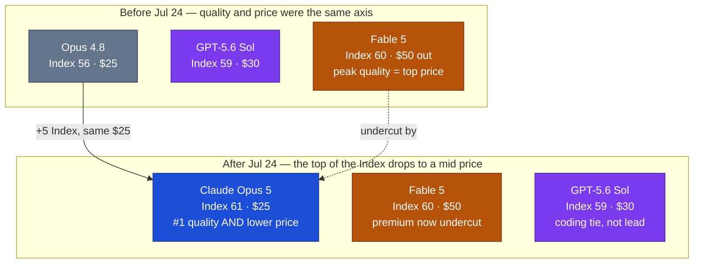

# LLM Updates — 2026-Jul-25

Saturday brief, written Sat Jul 25 (Los Angeles time). Yesterday's brief (Jul-24)
was compiled Friday around Google's Flash trio and the DeepSeek v4 cutover — and
**missed the biggest model of the week, because it shipped the same day.** On
**Jul 24, Anthropic launched Claude Opus 5**, and the independent numbers that
landed alongside it reorder the top of the map the Jul-15 → Jul-24 briefs have been
tracking.

The single fact that matters: **for the first time in this saga, the model at the top
of the Artificial Analysis Intelligence Index is not the ultra-premium flagship — it's
the mid-priced one.** Opus 5 (max) scores **61**, edging **Fable 5 (60)** and
**GPT-5.6 Sol (59)**, while listing at **$5 / $25 per Mtok — half Fable 5's
$10 / $50.** The intelligence leader and the price leader are now the same model. That
inverts the "peak-quality corner = most expensive" assumption every prior brief built
on (Jul-15 §4 → Jul-24 §5), and it makes the **Jul-20 Fable 5 tier split** (Jul-20 §1)
look immediately awkward — Anthropic is metering access to a model its own cheaper
model now out-scores.

This report advances only what is **new since Jul-24.** It does **not** re-derive the
Fable 5 / Mythos 5 lineage (Jul-01 §1), the GPT-5.6 family (Jul-09 §1), Kimi K3
(Jul-17 §1), Inkling (Jul-20 §2), or Google's Jul-21 Flash trio and the Gemini-4 pivot
(Jul-24 §1–§2) — those are unchanged (§4).

![Scatter plot of Artificial Analysis Intelligence Index (vertical, higher is smarter) against output price in dollars per million tokens (horizontal, further left is cheaper) as of July 25 2026. Claude Opus 5 is the highest point at Index 61 and $25 output, up and to the left of Claude Fable 5 at Index 60 and $50 — smarter and half the price. GPT-5.6 Sol sits at 59 and $30, Kimi K3 (open weights) at 57 and $15, Opus 4.8 at 56 and $25 directly below Opus 5 (a five-point generational jump at unchanged price), and Gemini 3.6 Flash at 50 and $7.50. A dashed arrow from Fable 5 to Opus 5 marks comparable intelligence at 26 percent lower cost per task.](opus5_index_vs_price.svg)

---

## 1. Anthropic ships Claude Opus 5 (Jul 24) — the top of the Index moves down the price curve

Anthropic made Opus 5 broadly available on **Jul 24** (rollout across providers began
Jul 23). The framing is deliberately un-flashy: Anthropic calls it **"a thoughtful and
proactive model that comes close to the frontier intelligence of Claude Fable 5 at half
the price,"** and says it expects Opus 5 to be **the default for many day-to-day office
needs.** It is the **new default model on Claude Max** and the **strongest model on
Claude Pro**, and it is live in Claude.ai, Claude Code, Claude Cowork, and the API /
Platform.

The positioning undersells what the benchmarks show. This is not a cheap sidecar to
Fable 5 — on the independent Artificial Analysis Intelligence Index **v4.1** (the
agentic-weighted version, Jul-15), **Opus 5 is narrowly the most intelligent model
tested:**

| Model | AA Intelligence Index (max) | Output $/Mtok | Note |
|---|---|---|---|
| **Claude Opus 5** | **61** | **$25** | **new #1 — Jul 24** |
| Claude Fable 5 | 60 | $50 | prior #1 since Jun 9 |
| GPT-5.6 Sol | 59 | $30 | Jul-09 §1 |
| Kimi K3 | 57 | $15 | open ≤ Jul 27 (§4) |
| Claude Opus 4.8 | 56 | $25 | the model Opus 5 replaces |

Artificial Analysis' own summary: Opus 5 offers **"comparable intelligence to Fable 5
at 26% lower Cost per Task,"** and it **"sets the highest GDPval-AA v2 and AA-Briefcase
scores so far."** The margins on those two agentic-knowledge-work benchmarks are not
narrow:

- **GDPval-AA v2:** Opus 5 (max) scores **1861 Elo — >100 points ahead** of both Fable 5
  and GPT-5.6 Sol.
- **AA-Briefcase** (AA's proprietary agentic knowledge-work benchmark): **1720 Elo,
  +146 ahead of Fable 5.**
- **Agentic Index:** Opus 5 leads at **55.3**, above GPT-5.6 Sol (54.0) and Fable 5
  (52.8).
- **Coding Agent Index:** running inside Claude Code at high/adaptive effort, Opus 5
  reaches **78 — joint first with GPT-5.6 Sol (xhigh, 78)**, above Sol (max, 77). The
  Jul-15 §1 "Sol leads coding" line now reads as a **tie**, not a lead.

Vendor-reported raw benchmarks are in the same register: **SWE-bench Verified 96.0%**,
**SWE-bench Pro 79.2%**, and **FrontierBench v0.1** (a 74-task successor to Terminal-
Bench 2.1) **44.4% at xhigh effort.** Anthropic notes one explicit ceiling: Opus 5
remains **behind the gated Mythos 5 on cybersecurity** (the Jul-01 §1 scoped defender
model), so the "peak quality" and "peak security" crowns have split.

**Sources:**
[Anthropic — Introducing Claude Opus 5](https://www.anthropic.com/news/claude-opus-5) ·
[Artificial Analysis — Opus 5: Fable 5-level intelligence at lower cost per task](https://artificialanalysis.ai/articles/opus-5) ·
[Artificial Analysis on X — Opus 5 narrowly #1, 26% lower cost/task, top GDPval-AA v2 & AA-Briefcase](https://x.com/ArtificialAnlys/status/2080734447717298483) ·
[officechai — Opus 5 becomes top model on the AA Intelligence Index, beats Fable 5](https://officechai.com/ai/claude-opus-5-becomes-top-model-in-the-world-on-artificial-analysis-intelligence-index-beats-fable-5/) ·
[TechCrunch — Anthropic launches Opus 5](https://techcrunch.com/2026/07/24/anthropic-launches-opus-5/) ·
[VentureBeat — Anthropic launches Claude Opus 5, a cheaper model for coding, agents and enterprise](https://venturebeat.com/orchestration/anthropic-launches-claude-opus-5-a-cheaper-ai-model-for-coding-agents-and-enterprise-workflows) ·
[MarkTechPost — Opus 5: frontier-class agentic coding at unchanged Opus pricing](https://www.marktechpost.com/2026/07/24/meet-the-new-claude-opus-5-frontier-class-agentic-coding-and-computer-use-at-unchanged-opus-pricing/) ·
[Bloomberg — Anthropic unveils more cost-efficient model for everyday tasks](https://www.bloomberg.com/news/articles/2026-07-24/anthropic-unveils-more-cost-efficient-model-for-everyday-tasks)

### 1a. Two dials: effort levels and a paid "fast mode"

The launch feature the consumer press led with is a **cost/capability dial**. Opus 5
exposes the full **effort ladder — low · medium · high · xhigh · max** — as a behavioral
knob: lower effort spends fewer thinking tokens and returns faster and cheaper; higher
effort lets the model reason, check, and refine longer. Fortune and others framed the
low/medium/high toggle as **"a dial on your AI bill"** — the lever Anthropic built for
teams worried about runaway inference cost. Anthropic's own guidance: start at **high**,
step up to **xhigh** for demanding coding/agentic work or **max** when the task justifies
unconstrained spend, and use low/medium as the primary cost/latency control where evals
show quality holds.

Separately, Opus 5 ships in **two speeds**: standard mode costs the same as Opus 4.8,
while **fast mode costs ~2× but runs ~2.5× faster** — aimed at latency-sensitive,
interactive work in Claude Code and the Platform. (This is the Claude Code "Fast mode"
surface, now available on Opus 5 as well as 4.8/4.7.) Net: pricing headline is unchanged
from Opus 4.8 ($5 / $25), but there are now **two orthogonal spend levers** — how hard it
thinks, and how fast it answers.

**Sources:**
[Fortune — Opus 5 lets users toggle between cost and capability](https://fortune.com/2026/07/24/anthropic-debuts-claude-opus-5-with-feature-that-lets-users-toggle-between-cost-and-capability/) ·
[Claude Platform Docs — Effort](https://platform.claude.com/docs/en/build-with-claude/effort) ·
[MarketScale — Anthropic puts a dial on your AI bill: what it means for B2B teams](https://www.marketscale.com/industries/software-and-technology/anthropic-launches-claude-opus-5-and-puts-a-dial-on-your-ai-bill-here-is-what-it-means-for-b2b-teams) ·
[felloai — Claude Opus 5: pricing, benchmarks & effort setting](https://felloai.com/claude-opus-5/) ·
[MacRumors — Opus 5 nearly matches flagship Fable 5 at half the cost](https://www.macrumors.com/2026/07/24/anthropic-opus-5/)

---

## 2. What this does to the map: the flagship gets undercut from below

Every brief since Jul-15 drew the frontier as corners — *peak quality* (expensive,
closed) vs *price-efficiency* (cheaper, lower Index) vs *open* vs *platform depth*. Opus
5 collapses the first two corners into one point. The consequences:

- **Fable 5's premium is now hard to justify on the Index alone.** A model at
  **$25 output** out-scores one at **$50 output** on the headline benchmark and on every
  agentic sub-index. Fable 5 keeps a niche — the very top of raw reasoning at *max* effort
  for cost-insensitive workloads, and it is still the model Mythos 5 descends from — but
  the "pay double for the best number" story is gone.
- **The Jul-20 tier split reads differently today.** That split (Max/Team Premium keep
  Fable 5 bundled at 50% of limits; Pro/Team Standard moved to $10/$50 usage credits,
  Jul-20 §1) was designed to ration an expensive flagship. With Opus 5 now the **default
  on Max** and the **top model on Pro** — and out-scoring Fable 5 — the metered-Fable
  tier looks like a premium lane around a model most users no longer need. Watch whether
  Anthropic repositions Fable 5 or lets Opus 5 quietly absorb its demand.
- **The "third of the cost" price-war framing (Jul-15 §5) now cuts inside Anthropic's own
  lineup, not just against it.** The competitive pressure GPT-5.6 Luna / Grok 4.5 / Muse
  Spark applied from below (Index ~51–54 at $4–6) is now answered by Anthropic **undercutting
  its own flagship** while staying #1 on quality.

**Sources:**
[The Decoder — Opus 5 costs well below Fable 5 while matching or beating it across most benchmarks](https://the-decoder.com/anthropics-claude-opus-5-costs-well-below-fable-5-while-matching-or-beating-it-across-most-benchmarks/) ·
[Artificial Analysis — Claude Opus 5: the new leader in agentic knowledge work](https://artificialanalysis.ai/articles/claude-opus-5-leader-agentic-knowledge-work) ·
[Axios — Anthropic releases new model, Opus 5](https://www.axios.com/2026/07/24/anthropic-releases-new-model-opus-5) ·
[Qz — Anthropic launched Opus 5 at half the price of its most powerful model](https://qz.com/anthropic-claude-opus-5-fable-5-price-072426)

---

## 3. Why "Opus 5 > Fable 5" is stranger than a normal point-release

Worth flagging for readers tracking the naming: in this timeline Anthropic's tiers run
**Fable (flagship) → Opus (workhorse) → Sonnet → Haiku.** A new *Opus* out-scoring the
standing *Fable* is a **lower tier leapfrogging a higher one within the same vendor** — the
generational cadence (Opus 5 is +5 Index over Opus 4.8 at identical price) outran the
flagship's refresh cycle. Two honest caveats keep this from being over-read:

- **It's a 1-point Index gap at max effort** (61 vs 60) — inside the noise band for a
  single composite score. The durable, large-margin wins are on the **agentic** benches
  (GDPval-AA v2 +100, AA-Briefcase +146, Agentic Index 55.3 vs 52.8) and on **cost per
  task** (−26%), not on raw peak reasoning, where Fable 5 at max is still level.
- **Fable 5 hasn't been refreshed.** This is a new Opus vs a ~7-week-old Fable (top since
  Jun 9). The comparison is real *today*, but a Fable-5.x or the long-absent Gemini/Grok
  flagships could re-open a gap. The structural point survives either way: **quality and
  price have decoupled**, and the decoupling came from inside the leading lab.

**Sources:**
[Artificial Analysis — Claude Opus 5 (max) model page](https://artificialanalysis.ai/models/claude-opus-5) ·
[unite.ai — Anthropic's Opus 5 nears frontier intelligence at Opus prices](https://www.unite.ai/anthropics-opus-5-nears-frontier-intelligence-at-opus-prices/) ·
[Hacker News — Opus 5 is currently #1 on the AA Intelligence leaderboard](https://news.ycombinator.com/item?id=49040741)

---

## 4. Unchanged since Jul-24 (no new signal)

To avoid re-deriving stable threads, these carried **no material development** in the
Jul 24 → 25 window:

- **Kimi K3 open weights — still promised Jul 27** (2 days out). As of today the weights
  are **not yet on Hugging Face**; the model is API-/product-accessible only, and the
  final license (the "Modified MIT" claim, Jul-17 §1) is **still unpublished.** Community
  prep notes peg the release at **~594 GB in BF16**, with Q4 GGUF quantizations expected
  to land it around **300–400 GB** for self-hosters. This is next week's headline
  watch-item, unchanged from Monday.
- **Gemini 3.5 Pro / Gemini 4** — no change since Google's Jul-21 Flash trio (Jul-24
  §1–§2). Pro is still "testing with partners" with no date/card/Index; the
  "most ambitious pre-training run yet, for Gemini 4" is the stated next real answer.
- **DeepSeek v4 cutover** — resolved yesterday on schedule (Jul-24 §3); the legacy
  `deepseek-chat` / `deepseek-reasoner` aliases are hard-retired, the `v4-flash`
  thinking-default gotcha stands.
- **Fable 5 tier split & classifier fix** — the Jul-20 split is still in force (now made
  awkward by §2); the classifier false-positive fix (Jul-03 §1) remains **unshipped and
  unmeasured**, now ~3 weeks old.
- **Inkling** (Jul-20 §2), **Grok 4.5** (Jul-09 §1), **Muse Spark 1.1** (Jul-15 §2) — no
  new adoption metrics or refreshes.

**Sources:**
[Kimi K3 open weights — Jul 27 status & self-host prep](https://explainx.ai/blog/kimi-k3-run-locally-open-weights-desktop-july-2026) ·
[Hugging Face — Kimi K3 model overview: 2.8T params, MXFP4 quantization](https://huggingface.co/blog/ResterChed/kimi-k3-model-overview-mxfp4-quantization-open-wei) ·
[Medium (AI Engineering Simplified) — why Google delayed Gemini 3.5 Pro three times and started Gemini 4](https://medium.com/ai-engineering-simplified/gemini-3-5-pro-release-date-2026-why-google-delayed-it-3-times-and-started-training-gemini-4-427f55207e5b)

---

## 5. The through-line — quality and price decoupled, from inside the leader

For six weeks these briefs described a frontier where the smartest model was also the
priciest, and cheaper challengers (GPT-5.6 Luna, Grok 4.5, Muse Spark, Inkling, Kimi K3)
attacked that flagship from below on cost. **Opus 5 ends that shape — but not the way the
challengers intended.** The undercut came from **Anthropic itself**: it shipped a
mid-priced model that tops the Intelligence Index, leads the agentic benchmarks by wide
margins, ties the coding lead, and lists at half its own flagship's output price.

| Corner (Jul-24 map) | Now | Change since Jul-24 |
|---|---|---|
| **Peak quality** | **Opus 5 (Index 61, $25) > Fable 5 (60, $50)** | **new — Opus 5 takes #1 at half the price (§1)** |
| Platform depth | GPT-5.6 Sol (59, $30) | coding lead now a **tie** with Opus 5 (§1) |
| Open · near-frontier | Kimi K3 (57, $15) | weights still pending Jul 27 (§4) |
| Price-efficiency (closed) | Grok 4.5 · Muse Spark (54 / 51) | — |
| Efficiency (Google) | Gemini 3.6 Flash (50, $7.50) | unchanged (Jul-24 §1) |
| Absent (flagship) | Gemini 3.5 Pro → Gemini 4? | unchanged — still partner-testing (§4) |
| Peak security (gated) | Mythos 5 | still ahead of Opus 5 on cyber (§1) |

The net: the map's *structure* is intact, but its organizing assumption — pay more, get
smarter — no longer holds at the top. The most consequential competitive move of the week
wasn't a challenger closing the gap on the flagship; it was the **flagship's own vendor
making the flagship optional.**

---

## Watch next

- **Kimi K3 open weights (Jul 27).** Still the headline external item: do the weights land
  Monday, under what license (the "Modified MIT" claim is unconfirmed), and how does the
  ~594 GB / Q4-GGUF release behave once the community can self-host it (§4)?
- **Does Anthropic reposition Fable 5?** With Opus 5 the new Max default and #1 on the
  Index at half the price, watch for a Fable-5.x refresh, a repriced Fable tier, or Fable 5
  quietly narrowing to a max-effort / Mythos-lineage niche (§2).
- **Do rivals answer the "top quality at mid price" move?** OpenAI (a cheaper Sol variant),
  xAI, or Meta matching Opus 5's Index-at-$25 point — or competing on the cost/effort dial
  rather than raw Index.
- **Effort-dial economics in the wild.** Whether the low/medium/high dial and the 2×-cost
  fast mode measurably change per-task spend once teams run them against real evals — the
  first field test of "put a dial on your AI bill."
- **Gemini: Pro or generation-skip?** Unchanged from Jul-24 — any date/card for 3.5 Pro,
  or a Gemini-4 timeline that makes it moot (§4).

---

*Compiled Sat Jul 25 2026 (Los Angeles time) from public reporting and independent
benchmark trackers. Vendor-reported figures (raw SWE-bench/FrontierBench scores, pricing,
effort/fast-mode behavior) are flagged as such; independent Intelligence Index, Agentic
Index, Coding Agent Index, GDPval-AA v2 and AA-Briefcase numbers are from Artificial
Analysis as relayed via its X post and secondary trackers. As in prior compiles, many
primary and publisher domains (Anthropic, Artificial Analysis, TechCrunch, VentureBeat,
Fortune, felloai, codersera, and others) returned HTTP 403 to direct fetches during
compilation, so figures are cited via the search index and mirrored trackers where a
direct read failed; benchmark and price figures for a model one day old should be treated
as provisional. Prior background is referenced by date/section rather than repeated.*
