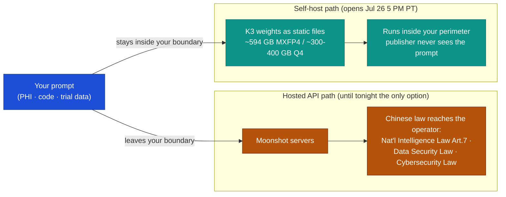

# LLM Updates — 2026-Jul-26

Sunday brief, written Sun Jul 26 (Los Angeles time). Yesterday's brief (Jul-25)
closed on a single watch item that dominated the week: **the Kimi K3 open weights,
promised "by Jul 27" since the model launched Jul 16.** That countdown resolves
today. Moonshot AI has set the drop for **Jul 27 00:00 UTC — which is Sunday
Jul 26 at 5:00 PM Pacific**, so in Los Angeles time the largest open-weight
release ever made lands *tonight*, not tomorrow.

The single fact that matters: **the near-frontier open model stops being a promise
and becomes a file you can download.** Kimi K3 has been API-and-product-only since
Jul 16 (Jul-17 §1); as of this evening its **2.8-trillion-parameter weights are
public on Hugging Face under a confirmed Modified MIT license** — resolving the two
loose ends every brief since Jul-17 has flagged (weights not yet posted; license
"unconfirmed"). But the release ships the *capability* without the *paperwork*: no
safety/system card, an undisclosed hallucination rate, and an unaddressed spring
data-breach travel with it (§3). So the story of the day is not a new score — it's
**what open weights do and don't buy you** at the near-frontier.

This report advances only what is **new since Jul-25.** It does **not** re-derive
Claude Opus 5 and the "top of the Index at half the price" map (Jul-25 §1–§5), the
Fable 5 / Mythos 5 lineage (Jul-01 §1), the GPT-5.6 family (Jul-09 §1), Inkling
(Jul-20 §2), or Google's Jul-21 Flash trio and the Gemini-4 pivot (Jul-24 §1–§2) —
those are unchanged (§5).

![Horizontal bar chart of Kimi K3's self-host download footprint in gigabytes. The native MXFP4 safetensors release is about 594 GB (amber bar); a community Q4 GGUF quantization is about 300 to 400 GB (teal bar with a lighter range extension). Two dashed reference lines mark a single 80 GB GPU near 80 GB and an eight-GPU 640 GB node near 640 GB, showing the native release fits just inside an 8-by-80-GB node while a Q4 quant roughly halves the size — but neither runs on one GPU. Caption: open weights remove the data-residency problem, not the hardware bill.](kimi_k3_selfhost_footprint.svg)

---

## 1. Kimi K3 open weights land tonight (Jul 26 5 PM PT / Jul 27 00:00 UTC)

Moonshot AI is releasing the Kimi K3 weights on Hugging Face at **00:00 UTC on
Jul 27 — 8:00 PM ET Jul 26, i.e. 5:00 PM Pacific this evening.** Three things that
were open in every prior brief now close:

- **The weights are actually posted.** As of Jul-25 §4 they were "not yet on Hugging
  Face"; the model was reachable only through Moonshot's hosted API (`kimi-k3` on
  `platform.kimi.ai`) and aggregators. Tonight the download goes live — described
  across trackers as the **largest open-weight release in history** at **2.8T total
  parameters.**
- **The license is confirmed: Modified MIT.** The "Modified MIT" claim has been
  carried as *unconfirmed* since Jul-17 §1 and again in Jul-25 §4. It is now the
  stated license — freely downloadable weights, though **open-weight, not
  open-source in the OSI sense**: the training data and full training pipeline are
  **not** released, and a technical report with architecture/training/eval detail is
  promised to *accompany* the drop rather than precede it.
- **The self-host footprint is real and heavy.** The native release ships as
  **~594 GB of MXFP4 safetensors**; community **Q4 GGUF quantizations are expected
  around 300–400 GB** (see chart). Local stacks — Ollama, vLLM, llama.cpp/GGUF — are
  expected to add K3 support in the days after the drop; an "abliterated" GGUF
  fork has already been staged on Hugging Face ahead of the official files.

The architecture is the same one the Jul-17 brief recorded, now confirmed against the
model card: a sparse **Mixture-of-Experts activating 16 of 896 experts**, 1M-token
context, native vision, built from **Kimi Delta Attention, Attention Residuals,
Stable LatentMoE, and Gated MLA**, with **quantization-aware training (MXFP4 weights /
MXFP8 activations)** — which is why the native release is already in a 4-bit-class
format rather than BF16. Independent placement is unchanged from Jul-17: **AA
Intelligence Index ~57**, #3 behind Opus 5 (61) and Fable 5 (60), roughly level with
GPT-5.6 Sol (59), and a coding-bench trader with both closed leaders.

**Sources:**
[Hugging Face — Kimi-K3 (upcoming release page)](https://huggingface.co/reteetzad/Kimi-K3) ·
[Hugging Face — Kimi K3 model overview: 2.8T params, MXFP4 quantization](https://huggingface.co/blog/ResterChed/kimi-k3-model-overview-mxfp4-quantization-open-wei) ·
[TechTimes — Kimi K3 open weights arrive Sunday](https://www.techtimes.com/articles/321551/20260725/kimi-k3-open-weights-arrive-sunday-self-hosting-cuts-china-data-risk-api-never-can.htm) ·
[Wan 2.7 — Is Kimi K3 open source? License, weights, GitHub](https://wan27.org/blog/kimi-k3-open-source) ·
[explainX — Run Kimi K3 locally: weights Jul 27 prep](https://explainx.ai/blog/kimi-k3-run-locally-open-weights-desktop-july-2026) ·
[kimi-k2.org — Kimi K3 open weights Jul 27: what you can use today](https://kimi-k2.org/blog/31-kimi-k3-open-weights-july-27)

---

## 2. What the open weights actually buy: data residency, not price

For a US-priced model at $3/$15 (Jul-17 §1), "open weights" is not primarily a *cost*
lever — Moonshot's own API is cheaper to *operate* than a 300–600 GB self-host cluster
for most teams. The reason the weights matter is **jurisdiction.**

Using K3 through Moonshot's hosted API sends every prompt to Moonshot's servers, and
those servers sit under Chinese law regardless of where they are physically located or
how the company is incorporated offshore. The relevant statutes, cited across this
weekend's enterprise write-ups:

- **National Intelligence Law (2017), Article 7** — all organizations and citizens
  must "support, assist, and cooperate with" national intelligence work on request.
- **Data Security Law (2021)** — data-classification tiers plus state access rights to
  classified data.
- **Cybersecurity Law (2017)** — data-localization requirements and inspection powers
  over company systems.

Open weights are the escape hatch: **download the model and run it inside your own
perimeter, and no prompt ever leaves it** — the publisher never sees your inputs, the
weights are static files, and data residency is back under your control. That is the
difference an API "the API never can" close, and it is why the open-weights drop is a
bigger deal for **regulated buyers** (health/PHI, clinical-trial, manufacturing,
public-sector) than the raw benchmark delta suggests. Before tonight, the only way to
touch K3 was to send data across that border.

**Sources:**
[TechTimes — self-hosting cuts China data risk the API never can](https://www.techtimes.com/articles/321551/20260725/kimi-k3-open-weights-arrive-sunday-self-hosting-cuts-china-data-risk-api-never-can.htm) ·
[IntuitionLabs — Kimi K3 for life sciences: running it on regulated data](https://intuitionlabs.ai/articles/kimi-k3-life-sciences-regulated-data) ·
[Layer3Labs — Kimi K3 open weights: guide for regulated business](https://www.layer3labs.io/open-weights/kimi-k3-open-weights-guide) ·
[Layer3Labs — Is Kimi K3 safe for business? A compliance review](https://www.layer3labs.io/guides/is-kimi-k3-safe-for-business)

---

## 3. The flip side: the capability shipped, the safety card didn't

Open weights solve *where the data lives.* They do not solve *whether you can trust
the outputs* — and this is where K3's release is thinner than a comparable closed
launch. Set against Opus 5's full system card two days earlier (Jul-25 §1), K3 lands
with three documented gaps:

- **An undisclosed hallucination rate.** Independent testing puts K3's raw accuracy at
  **~46% (up from K2.6's ~33%)** — a real gain — but its **measured hallucination rate
  at ~51%**, a figure Moonshot **omitted from its own benchmark charts.** Higher
  accuracy and higher hallucination moving together is exactly the mismatch that makes
  a benchmark headline misleading without the safety appendix.
- **No dedicated safety documentation.** Moonshot's K3 materials describe **no
  model-specific jailbreak evaluation, no assigned CVE, and no public prompt-injection
  benchmark** — a live concern for a model being marketed for *agentic, tool-using,
  long-horizon coding*, where prompt-injection is the primary attack surface. The
  technical report is promised to *accompany* the weights, not to have preceded them.
- **An unaddressed spring incident.** Enterprise compliance reviews this weekend flag
  an **April 2026 cross-user data breach** on Moonshot's platform that the company
  **never publicly addressed** — relevant to the API path in §2, and to any
  trust assessment of the operator.

The net for a buyer: self-hosting (§2) removes the *jurisdiction* risk but inherits the
*model* risk — you are now running a near-frontier model with a ~51% hallucination
rate and no published red-team results inside your own perimeter, with your own team as
the only safety layer. That is a genuinely different risk posture from "call the API of
a lab that published a system card," and it is the honest cost of the open-weights win.

**Sources:**
[TechTimes — Kimi K3 open weights drop Jul 27: near-frontier coding, undisclosed hallucination risk](https://www.techtimes.com/articles/321499/20260724/kimi-k3-open-weights-drop-july-27-near-frontier-coding-undisclosed-hallucination-risk.htm) ·
[Kili Technology — Kimi K3's benchmarks and hallucinations, and what that says about AI evaluation](https://kili-technology.com/blog/kimi-k3s-benchmarks-and-hallucinations----what-that-tells-us-about-ai-evaluation) ·
[Penligent — Kimi K3 jailbreak risk: prompt injection and the coding-agent security boundary](https://www.penligent.ai/hackinglabs/kimi-k3-jailbreak/) ·
[Stroople — Kimi K3: what China's AI means for your security](https://www.stroople.com/kimi-k3-security-enterprise/)

---

## 4. Where this sits on the Jul-25 map

Two days ago the headline was Anthropic collapsing the "quality vs price" corners with
**Opus 5 — #1 on the Index at $25, half of Fable 5** (Jul-25 §1–§2). K3's open-weights
drop sharpens a *different* axis of the same map: **closed-and-audited vs
open-and-self-hostable.**

| | Claude Opus 5 (Jul-24) | Kimi K3 (weights tonight) |
|---|---|---|
| Access | Closed API / product | **Open weights** (Modified MIT) + API |
| Index (max) | **61 (#1)** | 57 (#3) |
| Output $/Mtok (API) | $25 | $15 |
| Data residency | Moonshot/US-lab servers | **you choose — can stay in-perimeter (§2)** |
| Safety card | Full system card at launch | **none at launch; ~51% hallucination undisclosed (§3)** |
| Self-host cost | n/a | **~594 GB / ~300–400 GB Q4; 8×80 GB-class node (§1)** |

This also completes the **two-pole open-weights picture** the Jul-20 brief drew:
Inkling (US / Apache-2.0 / mid-tier / cheap fine-tuning base, Jul-20 §2) at one end and
**Kimi K3 (CN / Modified MIT / near-frontier / use-as-is generalist)** at the other —
now both genuinely downloadable. The open corner is no longer defined by *price* (K3's
$15 API is pricier than closed Gemini 3.6 Flash's $7.50); it is defined by **control** —
who holds the weights, and whose jurisdiction the prompts touch. That is the axis Opus 5,
for all its Index and cost wins, deliberately does not compete on.

---

## 5. Unchanged since Jul-25 (no new signal)

To avoid re-deriving stable threads, these carried **no material development** in the
Jul 25 → 26 window:

- **Claude Opus 5** — the Jul-24 launch and its "top of the Index at half the price"
  map (Jul-25 §1–§5) are unchanged; no rival has yet answered the Index-at-$25 move
  (the OpenAI/xAI/Meta price cuts predate it — GPT-5.6 GA Jul 9, Grok 4.5 Jul 8, Muse
  Spark 1.1 Jul 9), and there is still no signal on a Fable 5 reposition.
- **Gemini 3.5 Pro / Gemini 4** — no change since Google's Jul-21 Flash trio (Jul-24
  §1–§2); Pro still "testing with partners," Gemini 4 the stated next real answer.
- **DeepSeek v4 cutover** — resolved Jul-24 on schedule (Jul-24 §3); legacy
  `deepseek-chat` / `deepseek-reasoner` aliases hard-retired.
- **Fable 5 tier split & classifier fix** — the Jul-20 split holds (made awkward by
  Opus 5, Jul-25 §2); the classifier false-positive fix (Jul-03 §1) remains
  **unshipped and unmeasured**, now ~3.5 weeks old.
- **Talent note (not new):** the Karpathy→Anthropic pre-training move that resurfaced in
  weekend roundups is **May 2026** news, not a Jul-26 development — flagged only to keep
  it out of the "new" column.

**Sources:**
[TechCrunch — Karpathy joined Anthropic's pre-training team (May 19)](https://techcrunch.com/2026/05/19/openai-co-founder-andrej-karpathy-joins-anthropics-pre-training-team/) ·
[felloai — Best AI models July 2026](https://felloai.com/best-ai-models/) ·
[digitalapplied — OpenRouter July 2026: new models, prices, rankings](https://www.digitalapplied.com/blog/openrouter-new-models-july-2026-roundup-pricing)

---

## 6. The through-line — "open" now means control, not cheap

For six weeks these briefs tracked the frontier as a price/quality field. This weekend
adds the axis those two miss. **Opus 5 (Jul-24) won the price/quality argument outright;
Kimi K3 (tonight) wins a different one — control.** A regulated buyer who cannot send
data across a border, or who needs the model to keep running when an API contract or an
export rule changes, now has a near-frontier option that lives on their own disks. The
cost of that option is honest and specific: a **300–600 GB, multi-GPU** deployment (§1),
and a model that ships **without the safety card** a closed launch now includes — a
~51% hallucination rate and an unaddressed breach you inherit along with the weights
(§3). "Open" stopped meaning "cheap" back on Jul-17; tonight it finishes meaning
**"yours."**

---

## Watch next

- **Do the weights land on time, and how do they behave self-hosted?** The 5 PM PT drop
  is the first moment the community can measure K3 outside Moonshot's API — watch for the
  first independent GGUF quants, the real minimum hardware, and whether self-hosted
  scores match the hosted ~57 Index (§1).
- **Does the technical report/safety card actually arrive?** Moonshot promised it *with*
  the weights. Whether it discloses the ~51% hallucination figure and any red-team /
  prompt-injection results is the difference between "open weights" and "trustworthy open
  weights" (§3).
- **Does a Western lab or a self-host stack productize the data-residency pitch?** The
  §2 escape-hatch argument is exactly the wedge an on-prem vendor (or Inkling's Tinker,
  Jul-20 §2) can sell; watch for "run K3 in your VPC" offerings within the week.
- **Any answer to Opus 5's Index-at-$25?** Unchanged from Jul-25 — OpenAI/xAI/Meta
  matching the top-quality-at-mid-price point, or a Fable 5 reposition (§5).
- **Gemini: Pro or generation-skip?** Unchanged — any date/card for 3.5 Pro, or a
  Gemini-4 timeline that makes it moot (§5).

---

*Compiled Sun Jul 26 2026 (Los Angeles time) from public reporting and independent
benchmark/compliance trackers. The Jul-27 00:00 UTC drop time is Moonshot-stated and
equals Jul 26 5:00 PM Pacific; Index/coding placements are the Artificial Analysis
figures relayed via secondary trackers (Jul-17). Vendor-reported figures (params,
quantization sizes, architecture, license) are flagged as such; the ~46% accuracy /
~51% hallucination figures and the April-2026 breach are from independent/compliance
write-ups, not from Moonshot, and are attributed rather than independently reproduced.
As in prior compiles, several primary and publisher domains (TechTimes, Hugging Face
blog, and others) returned HTTP 403 to direct fetches during compilation, so figures are
cited via the search index and mirrored trackers where a direct read failed; benchmark,
size, and safety figures for a same-day open-weights release should be treated as
provisional until the community verifies them post-drop. Prior background is referenced
by date/section rather than repeated.*
