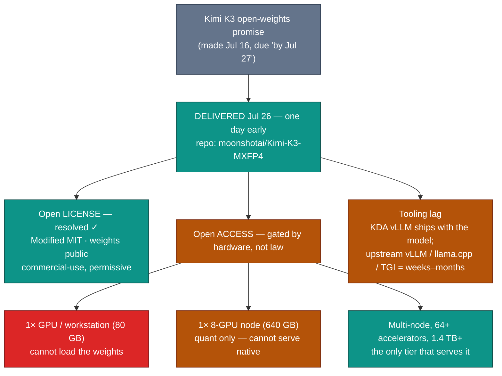

# LLM Updates — 2026-Jul-27

Monday brief, written Mon Jul 27 (Los Angeles time). For six weeks these briefs
tracked one external item above all others: **would Moonshot AI actually open the
weights of Kimi K3, the near-frontier 2.8-trillion-parameter model it promised to
release "by Jul 27"?** Every Friday/weekend compile since Jul-17 carried it as the
headline watch-item, and the Jul-25 brief closed on it explicitly (§4, §Watch next).

The answer landed over the weekend, **a day early: Moonshot pushed the Kimi K3 open
weights to Hugging Face late Sunday, Jul 26.** That resolves the single largest open
thread of the Jun→Jul saga — and the way it resolved is the story. The weights are
genuinely open (Modified MIT, public, downloadable). But the release makes plain that
**"open weights" and "runnable" are now two different things**: the native checkpoint is
a ~1.4 TB MXFP4 file that no single GPU and no single 8-GPU server can serve, and the
inference tooling most self-hosters rely on is weeks-to-months behind. The axis prior
briefs labeled *"open · near-frontier"* splits cleanly into **open license (delivered)**
vs **open access (gated by hardware, not law).**

This report advances only what is **new since Jul-25.** It does **not** re-derive the
Kimi K3 architecture (Jul-17 §1), the Opus 5 launch and the Fable-5-undercut (Jul-24/25),
the GPT-5.6 family (Jul-09), or Google's Flash trio and Gemini-4 pivot (Jul-24) — those
are unchanged (§4).

![Horizontal bar chart of aggregate GPU memory at three deployment tiers against the memory needed to serve Kimi K3. A single H100 has 80 GB and cannot load the weights. A single 8-GPU node has 640 GB, enough only for a heavily quantized community version near 594 GB, not the native four-bit MXFP4 checkpoint. A shaded requirement band runs from about 594 GB to 1.4 TB; only a multi-node cluster of 64 or more accelerators with 1.4 TB or more clears the band and can serve the model in production. The chart's point: the license is open but practical access is gated by hardware.](kimi_k3_hardware_wall.svg)

---

## 1. Kimi K3 open weights land (Jul 26) — a day ahead of the promised date

Moonshot AI made good on the commitment tracked since Jul-17: the **Kimi K3 weights are
public on Hugging Face**, pushed late **Sunday Jul 26** (roughly 7:30 PM US Eastern),
about a day before the "by Jul 27" target. The canonical repository is
**`moonshotai/Kimi-K3-MXFP4`**. This is, by Moonshot's framing, the **first openly
released ~3-trillion-parameter-class model** — the near-frontier tier that until now had
only ever shipped as a closed API.

**What shipped:**

- **License — Modified MIT, confirmed on release day.** This matches the Jul-17
  prediction exactly (Kimi K2.7 Code shipped under the same license), closing the
  "license unpublished" caveat that every brief since Jul-17 flagged. It is a permissive,
  commercial-use-friendly license — not a restricted "open-ish" research license — which
  is the material point for the data-sovereignty case in §3.
- **Native format — MXFP4 (4-bit).** The canonical checkpoint is quantized, not a
  full-precision BF16 release. For a 2.8T-parameter model this is a deliberate
  deployment-cost choice (the same pattern GPT-OSS used): shipping 4-bit weights as the
  reference artifact roughly quarters the download and memory footprint versus BF16, at
  some precision cost. There is no full-precision reference checkpoint in the initial drop.
- **Size — ~1.4 TB, not the ~594 GB the community expected.** Here the pre-release
  estimates were off, and the discrepancy is worth stating plainly. The Jul-25 brief (§4)
  relayed a community figure of *"~594 GB in BF16"* — but that is arithmetically
  impossible (2.8T params in BF16 ≈ 5.6 TB). The **native MXFP4 checkpoint is ~1.4 TB**,
  which *is* consistent with 2.8T params at 4 bits each. The ~594 GB number now looks like
  it referred to a **sub-4-bit community quantization**, not the reference release. Both
  figures still circulate across trackers; treat ~1.4 TB as the native footprint and
  ~594 GB as an aggressive community quant. This distinction drives the whole hardware
  story in §2.
- **Architecture (confirmed, not new).** As detailed Jul-17: 2.8T total parameters with
  **~16 of 896 experts active** per token (≈ A50B active) under a **Stable LatentMoE**
  framework that compresses token embeddings before expert routing to cut cross-GPU
  communication; **Kimi Delta Attention (KDA)**, a hybrid linear-attention scheme Moonshot
  says gives up to **6.3× faster decoding at million-token context**; **Attention
  Residuals (AttnRes)** for selective cross-depth retrieval; and **Quantile Balancing** for
  expert allocation. Moonshot claims **~2.5× better scaling efficiency than Kimi K2**, with
  a **1M-token context window.**
- **Independent standing (unchanged).** On the Artificial Analysis Intelligence Index
  v4.1, Kimi K3 sits at **~57 (57.1)** — comparable to Opus 4.8 and GPT-5.5, behind Opus 5
  (61), Fable 5 (60), and GPT-5.6 Sol (59). AA's leaderboard should now **flip K3's label
  from "proprietary" to open**, since its prior "proprietary" tag was explicitly a
  consequence of the weights not being public as of Jul-17.

One thing the release does **not** yet include: broad independent third-party
benchmarks. As of today the only independent numbers are from Artificial Analysis and
Arena.ai; everything else still traces to Moonshot's own eval runs or API-submitted
results. Community re-benchmarking on self-hosted weights is the thing to watch this week
(§3).

**Sources:**
[Hugging Face — moonshotai/Kimi-K3 (model repo)](https://huggingface.co/moonshotai/Kimi-K3) ·
[Hugging Face blog — Kimi K3 overview: 2.8T params, MXFP4 quantization, what open weights mean](https://huggingface.co/blog/ResterChed/kimi-k3-model-overview-mxfp4-quantization-open-wei) ·
[TechTimes — Kimi K3 open weights arrive: self-hosting cuts China data risk the API never can](https://www.techtimes.com/articles/321551/20260725/kimi-k3-open-weights-arrive-sunday-self-hosting-cuts-china-data-risk-api-never-can.htm) ·
[Northflank — What is Kimi K3: benchmarks, pricing, hardware and self-hosting](https://northflank.com/blog/what-is-kimi-k3-self-hosting) ·
[Artificial Analysis — Kimi K3 achieves #3 on the Intelligence Index, comparable to Opus 4.8 and GPT-5.5](https://artificialanalysis.ai/articles/kimi-k3-achieves-3-in-the-artificial-analysis-intelligence-index-comparable-to-opus-4-8-and-gpt-5-5) ·
[Kimi (Moonshot) — K3 tech blog: open frontier intelligence](https://www.kimi.com/blog/kimi-k3) ·
[DEV Community — Kimi K3 open weights are here: how to self-host the 2.8T model (hardware, vLLM, data sovereignty)](https://dev.to/lola_lin_a1be8395c517b081/kimi-k3-open-weights-are-here-how-to-self-host-the-28t-parameter-model-hardware-vllm-and-data-4b0n)

---

## 2. "Open" splits into two questions: license (yes) and access (hardware-gated)

The release forces a distinction the earlier briefs blurred when they filed Kimi K3 under
a single *"open · near-frontier"* corner. Having the weights under a permissive license is
necessary but not sufficient to actually run the model. The gap between the two is a
**multi-node data-center cluster.**

- **A single accelerator is out of the question.** A top-end 80 GB GPU holds ~6% of the
  native 1.4 TB checkpoint. Kimi K3 is not a "download and run on a workstation" model in
  any configuration.
- **A single 8-GPU server (≈640 GB) still can't serve it.** 640 GB of aggregate memory
  clears the ~594 GB *sub-4-bit community quant* on paper, but leaves **no headroom for the
  KV cache and activations** — which at a 1M-token context are substantial — and falls well
  short of the ~1.4 TB native checkpoint. Practically, one node cannot serve the reference
  model.
- **Production serving means multi-node, 64+ accelerators, 1.4 TB+ aggregate memory.**
  Reported recommendations for real serving run to **64 or more accelerators** across
  multiple nodes. That is a data-center deployment, not a self-host — the same class of
  infrastructure the closed labs run, just now legally reproducible.
- **Tooling lag compounds the hardware wall.** Moonshot shipped a **KDA implementation for
  vLLM alongside the weights**, so day-0 serving is *possible* on the right cluster. But
  integration into the broader ecosystem — upstream vLLM, `llama.cpp`, text-generation-
  inference — is expected to take **weeks to months**, because KDA and Stable LatentMoE are
  novel enough that the usual inference stacks need real work to support them. Until then,
  the practical on-ramp is narrow.

The upshot: the *promise* the briefs tracked ("will the weights open?") is fully resolved
in the affirmative. But the *implied benefit* many read into it ("so anyone can run a
near-frontier model themselves") is only true for organizations that can stand up a
multi-node cluster. For everyone else, Kimi K3 in practice remains an **API product that
now also happens to be legally self-hostable by the well-resourced.**

**Sources:**
[Northflank — Kimi K3 hardware requirements and self-hosting](https://northflank.com/blog/what-is-kimi-k3-self-hosting) ·
[DEV Community — self-hosting the 2.8T model: hardware, vLLM, data sovereignty](https://dev.to/lola_lin_a1be8395c517b081/kimi-k3-open-weights-are-here-how-to-self-host-the-28t-parameter-model-hardware-vllm-and-data-4b0n) ·
[explainx.ai — Run Kimi K3 locally: open-weights prep](https://explainx.ai/blog/kimi-k3-run-locally-open-weights-desktop-july-2026) ·
[Layer3 Labs — Kimi K3 open-weights guide for regulated business](https://www.layer3labs.io/open-weights/kimi-k3-open-weights-guide)

---

## 3. What the open release actually changes — and what it doesn't

**Changes (real):**

- **Data sovereignty becomes possible.** The core argument for open weights over the
  hosted Kimi API is that self-hosting keeps prompts and data off Moonshot's
  China-based infrastructure entirely. For regulated sectors (finance, healthcare,
  government-adjacent), that is a genuine unlock the API could never provide — and the
  permissive Modified MIT license means it's a legal one, not a grey area. The catch is
  §2: only orgs that can afford the cluster can cash this in.
- **Auditability and fine-tuning.** Public weights mean the model can be inspected,
  fine-tuned, and distilled by anyone — the near-frontier tier is now a base other builders
  can specialize, not just call. Watch for community fine-tunes and smaller distillations
  that make the *capabilities* portable even if the *full model* isn't.
- **A near-frontier floor for the open ecosystem.** Together with the Jul-15 US open pole
  (Inkling, Apache-2.0, mid-tier) and Nemotron-class models, the open field now has a
  member within ~4 Index points of the closed frontier. The ceiling on "what you can run
  without a vendor" moved up materially.

**Doesn't change (yet):**

- **The independent-benchmark picture.** Until third parties re-run K3 on self-hosted
  weights, its standing rests on Moonshot's evals plus AA/Arena. The **hallucination /
  reliability** questions raised around K3's benchmarks (a recurring caveat in the coverage)
  won't be settled until the community can probe the actual weights.
- **The cost story.** The hosted K3 API remains **~$3 / $15 per Mtok** (Jul-17 §1) — no
  longer super-cheap by Chinese-model standards, and now sitting *below* Opus 5's #1 Index
  at $25 but *above* Gemini 3.6 Flash at $7.50. Self-hosting only beats the API on
  per-token cost at very high, sustained utilization of an owned cluster.
- **The top of the quality map.** K3 at Index ~57 is unchanged relative to Opus 5 (61),
  Fable 5 (60), and GPT-5.6 Sol (59). Opening the weights doesn't move K3 up the Index — it
  changes *who can run the 57-point model*, not *how good it is.*

**Sources:**
[TechTimes — self-hosting cuts China data risk the API never can](https://www.techtimes.com/articles/321551/20260725/kimi-k3-open-weights-arrive-sunday-self-hosting-cuts-china-data-risk-api-never-can.htm) ·
[Kili Technology — Kimi K3's benchmarks and hallucinations: what it tells us about AI evaluation](https://kili-technology.com/blog/kimi-k3s-benchmarks-and-hallucinations----what-that-tells-us-about-ai-evaluation) ·
[OpenRouter — Kimi K3 API pricing & benchmarks](https://openrouter.ai/moonshotai/kimi-k3) ·
[Trilogy AI — Kimi K3 is live: pricing, benchmarks, and the wait for public weights](https://trilogyai.substack.com/p/kimi-k3-is-live-pricing-benchmarks)

---

## 4. Unchanged since Jul-25 (no new signal)

To avoid re-deriving stable threads, these carried **no material development** in the
Jul 25 → 27 window:

- **Claude Opus 5 / Fable 5.** Opus 5 (Jul 24, Index 61, $25) remains #1 and still
  out-scores Fable 5 (60, $50) at half the output price (Jul-25 §1–§2). **No Fable 5
  reprice or refresh** has appeared — the Jul-25 open question ("does Anthropic reposition
  Fable 5?") is still open. The only additional independent color is a reliability angle:
  trackers relaying AA note Opus 5 **hallucinates in roughly half the cases** where Fable 5
  does when uncertain — reinforcing, not changing, the Jul-25 conclusion.
- **Gemini 3.5 Pro / Gemini 4.** No change. Pro remains unshipped (four+ slips, no date,
  no card, no Index); Google's stated next real answer is still the from-scratch
  **Gemini 4** pretraining run, with the Jul-21 Flash trio (3.6 Flash / 3.5 Flash Lite) as
  the stopgap. Google is still the lone frontier lab without a current flagship on the board.
- **GPT-5.6 family & xAI.** No new frontier release. (xAI shipped a narrow **Grok STT 1.0**
  speech-to-text model on Jul 23 — noted for completeness; it doesn't touch the
  text-frontier map.) GPT-5.6 Sol's coding lead remains a **tie** with Opus 5 (Jul-25 §1).
- **DeepSeek v4 cutover.** Resolved Jul-24 on schedule; nothing new.
- **Fable 5 classifier false-positive fix** (Jul-03 §1) — still **unshipped and
  unmeasured**, now ~3.5 weeks old.
- **Inkling** (Jul-15/20), **Muse Spark 1.1** (Jul-15) — no new adoption metrics.

**Sources:**
[Artificial Analysis — Claude Opus 5: leader in agentic knowledge work](https://artificialanalysis.ai/articles/claude-opus-5-leader-agentic-knowledge-work) ·
[TechCrunch — Google releases three new Gemini models, but no 3.5 Pro](https://techcrunch.com/2026/07/21/google-releases-three-new-gemini-models-but-no-3-5-pro/) ·
[Medium (AI Engineering Simplified) — why Google delayed Gemini 3.5 Pro three times and started Gemini 4](https://medium.com/ai-engineering-simplified/gemini-3-5-pro-release-date-2026-why-google-delayed-it-3-times-and-started-training-gemini-4-427f55207e5b) ·
[ThursdAI — July 2026 releases: OpenAI, Anthropic, Google DeepMind, Meta AI](https://thursdai.news/releases/2026-07)

---

## 5. The through-line — the open frontier is delivered, but "open" no longer means "runnable"

For six weeks these briefs framed the map as competing corners, with an *"open ·
near-frontier"* corner defined mostly by a promise: Moonshot *would* open the weights of a
57-Index model on Jul 27. That promise is now **kept, and early** — the largest external
watch-item of the Jun→Jul saga is resolved, cleanly, in the open direction. The
significant thing is what the resolution reveals: at the 2.8-trillion-parameter scale,
**an open license and a runnable model have come apart.** The license is genuinely free;
the model still requires a data-center-class cluster and inference tooling that mostly
doesn't exist yet. Open weights at this scale democratize *permission*, not *access.*

| Corner (Jul-25 map) | Now | Change since Jul-25 |
|---|---|---|
| Peak quality | Opus 5 (Index 61, $25) > Fable 5 (60, $50) | unchanged — Opus 5 still #1 at half the price (§4) |
| Platform depth | GPT-5.6 Sol (59, $30) | unchanged — coding still a tie with Opus 5 (§4) |
| **Open · near-frontier** | **Kimi K3 (57, $15 API) — weights now PUBLIC** | **resolved: Modified MIT, ~1.4 TB MXFP4, live on HF (§1); but access is hardware-gated (§2)** |
| Price-efficiency (closed) | Grok 4.5 · Muse Spark (54 / 51) | unchanged |
| Efficiency (Google) | Gemini 3.6 Flash (50, $7.50) | unchanged |
| Absent (flagship) | Gemini 3.5 Pro → Gemini 4? | unchanged — still no date/card (§4) |
| Peak security (gated) | Mythos 5 | unchanged — still ahead of Opus 5 on cyber |

The net: the map's structure held all week — the only cell that moved was the open corner,
and it moved from *promised* to *delivered.* But the delivery reframes what "open" buys.
The most consequential move of the week wasn't a new frontier model; it was a near-frontier
model becoming legally free to run — and the discovery that, at 2.8T parameters, "free to
run" and "able to run" are separated by a 64-GPU cluster.

---

## Watch next

- **Independent re-benchmarks of the self-hosted weights.** The first third-party numbers
  run on downloaded K3 weights (rather than Moonshot's API/evals) — especially on the
  hallucination/reliability questions — are the next real signal. Do the open weights
  confirm the ~57 Index and the coding-trade story, or diverge from the API?
- **Community quantization & distillation.** Whether sub-4-bit quants, GGUF conversions,
  and smaller distillations land that shrink K3 enough to run on a single node — the thing
  that would turn "legally open" into "actually accessible" for more than data-center
  operators.
- **Ecosystem tooling.** How fast KDA / Stable LatentMoE support reaches upstream vLLM,
  `llama.cpp`, and TGI. Until it does, the practical on-ramp stays narrow (§2).
- **Does Anthropic reposition Fable 5?** Still open from Jul-25 — a Fable-5.x refresh, a
  repriced tier, or Fable quietly narrowing to a max-effort / Mythos-lineage niche now that
  Opus 5 out-scores it at half the price (§4).
- **Gemini: Pro or generation-skip?** Unchanged — any date/card for 3.5 Pro, or a Gemini-4
  timeline that makes it moot (§4).
- **Do rivals answer Opus 5's "top quality at mid price"?** Still open — a cheaper Sol
  variant, or xAI/Meta matching the Index-at-$25 point.

---

*Compiled Mon Jul 27 2026 (Los Angeles time) from public reporting and independent
benchmark trackers. Vendor-reported figures (Kimi K3 architecture claims, KDA speedups,
scaling-efficiency, raw benchmark scores, pricing) are flagged as such; independent
Intelligence Index numbers are from Artificial Analysis as relayed via secondary trackers.
The ~1.4 TB vs ~594 GB size figures diverge across trackers — §1 states which is the
native MXFP4 checkpoint and which is an aggressive community quant, with the arithmetic
shown. As in prior compiles, many primary and publisher domains (Hugging Face, Moonshot,
Artificial Analysis, TechTimes, DEV, and others) returned HTTP 403 to direct fetches
during compilation, so figures are cited via the search index and mirrored trackers where
a direct read failed; benchmark, size, and hardware figures for a release under 48 hours
old should be treated as provisional. Prior background is referenced by date/section
rather than repeated.*
