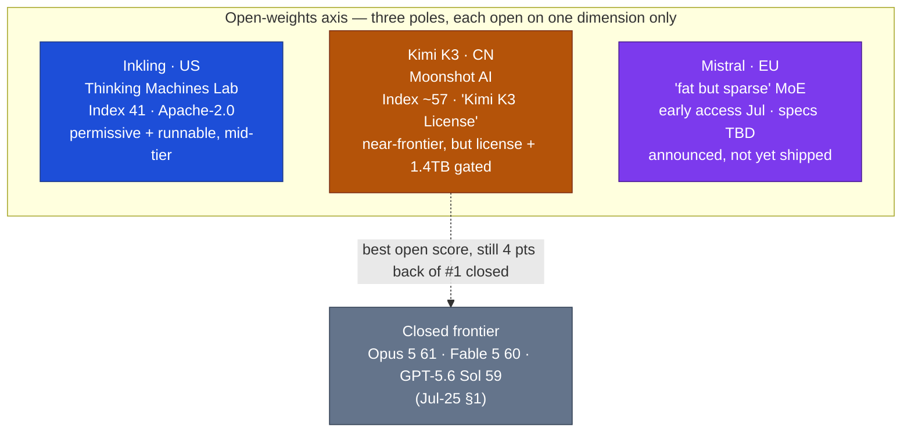

# LLM Updates — 2026-Jul-28

Tuesday brief, written Tue Jul 28 (Los Angeles time). The last brief in this
series (Jul-25) closed with one headline **watch-item: would Kimi K3's open
weights actually land on Jul 27, under what license, and how would the
~594 GB / Q4-GGUF release behave once the community could self-host it?**
That item **resolved over the weekend** — and it resolved in a way worth a
brief of its own.

The single fact that matters: **on Jul 26 (~7:30 pm EDT, roughly a day ahead of
the stated Jul 27 target) Moonshot AI published the full Kimi K3 weights on
Hugging Face — the largest open-weight release in history (2.8T parameters).**
But "open weights" turned out **not to be a single bit.** It resolved in three
layers, and **only the first is unqualified:** the weights are genuinely public,
the *license* is a bespoke revenue-tiered document (not the "Modified MIT" that
was claimed on Jul-17), and *running it yourself* is gated behind a ~1.4 TB
serving footprint that keeps day-0 practical access on rented endpoints. The
"open frontier" arrived — and immediately showed how much of "open" is really
about license terms and hardware, not the download link.

This report advances only what is **new since Jul-25.** It does **not** re-derive
the Kimi K3 architecture and benchmark standing (Jul-17 §1), Claude Opus 5 and
the Jul-24 Index reshuffle (Jul-25 §1–§3), the Fable 5 tier split (Jul-20 §1),
Inkling (Jul-20 §2), Google's Flash trio / Gemini-4 pivot (Jul-24 §1–§2), or the
DeepSeek v4 cutover (Jul-24 §3) — those are unchanged (§4).

![Diagram showing that "open weights" resolved in three layers when Kimi K3 shipped on Jul 26 2026, and only the first layer is unqualified. Layer 1, the weights: OPEN — 2.8 trillion parameters, about 50 billion active per token, published on Hugging Face as roughly 594 gigabytes in MXFP4, the largest open-weight release in history, Index number 4 at about 57, number 1 on the Frontend Code Arena. Layer 2, the license: RESTRICTED — a bespoke Kimi K3 License, not the Modified MIT claimed on July 17; a revenue-triggered separate agreement is required to resell as a service, and any product over 100 million monthly users or 20 million dollars monthly revenue must display "Kimi K3" in its interface. Layer 3, running it yourself: GATED BY HARDWARE — about a 1.4 terabyte VRAM planning floor to serve, roughly 18 H100 80GB GPUs at 4-bit, 64-plus accelerators recommended, with production-stable local inference not expected before Q4 2026. A footer notes day-zero practical access is still to rent it: 3 and 15 dollars per million tokens on Moonshot's API, hosted same-window by Together AI and Modal.](kimi_k3_three_layers_of_open.svg)

---

## 1. Kimi K3 open weights land (Jul 26) — the Jul-27 promise resolved a day early

Moonshot AI published the complete Kimi K3 weights to Hugging Face on the
evening of **Jul 26 (~7:30 pm EDT)**, roughly a day ahead of the **Jul 27**
target the model card had carried since launch (Jul-17 §1). The repository went
up **public and ungated**, containing the sharded weights (community notes count
**96 shards**), config, tokenizer, an index, code, and the license. It is, by
parameter count, **the largest open-weight release ever shipped.**

Nothing about the *model* changed from the Jul-17 picture — this is a release
event, not a new model:

- **2.8T total parameters, ~50B active per token** — a sparse
  Stable-LatentMoE (Jul-17 §1). (One tracker cited ~104B active; the
  inference-economics reporting consistently describes **~50B firing per step**,
  which is what the per-token cost math below uses.)
- **~594 GB native download in MXFP4.** Kimi K3 was trained
  **quantization-aware from the SFT stage** (MXFP4 weights, MXFP8 activations),
  so the low-precision release is the *intended* artifact, not a lossy
  after-the-fact squeeze — it cuts memory-bandwidth needs ~4× vs FP16.
- **Independent standing unchanged: #4 on the Artificial Analysis Intelligence
  Index at ~57** (behind Fable 5 ~60, GPT-5.6 Sol ~59, and now Opus 5 61 from
  Jul-25 §1; level with Opus 4.8), still the **top open-weight model** by a wide
  margin. It holds **#1 on the Frontend Code Arena** and posts the **strongest
  open-weight GPQA-Diamond to date (~93.5%).**

The significance is not the score — that was known on Jul-17 — it's that a model
at that score is now **downloadable**. Every prior brief since Jul-17 treated the
"open frontier from China" as a *promise*; as of this weekend it is a **file.**

**Sources:**
[moonshotai/Kimi-K3 · Hugging Face](https://huggingface.co/moonshotai/Kimi-K3) ·
[Kimi K3 Tech Blog — Open Frontier Intelligence](https://www.kimi.com/blog/kimi-k3) ·
[Artificial Analysis — Kimi K3 achieves #3 in the Intelligence Index (comparable to Opus 4.8 / GPT-5.5)](https://artificialanalysis.ai/articles/kimi-k3-achieves-3-in-the-artificial-analysis-intelligence-index-comparable-to-opus-4-8-and-gpt-5-5) ·
[Interconnects (Nathan Lambert) — Kimi K3: the open-weights escalation](https://www.interconnects.ai/p/kimi-k3-the-open-weights-escalation) ·
[Hugging Face blog — Kimi K3 overview: 2.8T params, MXFP4 quantization](https://huggingface.co/blog/ResterChed/kimi-k3-model-overview-mxfp4-quantization-open-wei) ·
[DEV — Kimi K3 open weights are here: how to self-host the 2.8T-param model](https://dev.to/lola_lin_a1be8395c517b081/kimi-k3-open-weights-are-here-how-to-self-host-the-28t-parameter-model-hardware-vllm-and-data-4b0n)

---

## 2. The two catches: the license is restricted, and self-hosting is a data-center problem

The Jul-25 watch-item asked *under what license* and *how it behaves once
self-hosted.* Both answers push back on the word "open."

### 2a. License — bespoke and revenue-tiered, not the "Modified MIT" that was claimed

The Jul-17 brief (§1) relayed a rumored **"Modified MIT"** license, flagged as
unconfirmed. The published terms are **not that.** Kimi K3 ships under a bespoke
**"Kimi K3 License"** — tagged on Hugging Face as **`license:other`** — with two
commercial hooks a true MIT/Apache grant would never carry:

- A **revenue-triggered separate-agreement clause**: you cannot resell K3 as a
  Model-as-a-Service business past a defined revenue line without negotiating a
  separate agreement with Moonshot.
- A **user-interface attribution mandate**: any product above **~100M monthly
  active users or ~$20M/month revenue** must display **"Kimi K3"** prominently
  in its interface.

This is the same **capped-openness** pattern Meta's Llama licenses popularized —
free for the long tail, gated at hyperscaler scale — and it stands in sharp
contrast to the *other* new open-weights pole this series has tracked:
**Inkling** (Thinking Machines Lab, Jul-20 §2) shipped under a clean
**Apache-2.0.** So the "Modified MIT" claim resolved as **effectively false**:
Kimi K3 is open to download and to run, but its license is a commercial
instrument, not a permissive grant. (Some secondary trackers still loosely call
it "Modified MIT"; the detailed license reporting describes the revenue-tiered
terms above.)

### 2b. Economics — "open" ≠ "runnable by most"

The self-host reality is the second catch, and it is stark. Because K3 is a
sparse MoE, it is **cheap per token once resident** (~50B of 2.8T params fire per
step) but **expensive to keep resident** (all 2.8T must stay loaded):

- **~594 GB to download** (MXFP4), but a **~1.4 TB VRAM planning floor** to
  actually *serve* — weights plus runtime overhead and long-context KV cache.
- Practical deployment target: **~18× H100-80GB** at 4-bit, with **64+
  accelerators recommended** for real throughput.
- **Tooling isn't fully there yet:** the vLLM **KDA** (Kimi Delta Attention)
  prefill-cache path shipped as a preview alongside the weights (Together AI and
  Modal confirmed **same-window hosted support**), but **production-stable local
  inference is a ~Q4 2026 story** for most teams while KDA support hardens.

The upshot: **day-0 practical access is still to *rent* the model, not host it.**
Moonshot's own API remains **$3 / $15 per Mtok** (~$0.30 cache-hit input) — the
Sonnet-5-class pricing the Jul-17 brief flagged as "the end of super-cheap
Chinese AI" — and the day-one hosting story is Together AI / Modal, not a laptop.
The weights being public changes **sovereignty and auditability** (you *can* run
it inside your own walls, and inspect it) far more than it changes **who can
afford to run it this quarter.**

**Sources:**
[Unite.AI — Moonshot opens Kimi K3 weights under a revenue-tiered license](https://www.unite.ai/moonshot-opens-kimi-k3-weights-under-a-revenue-tiered-license/) ·
[digitalapplied — Kimi K3 open weights shipped: what the licence says](https://www.digitalapplied.com/blog/kimi-k3-open-weights-shipped-license-restrictions-2026) ·
[TECHi — Kimi K3's open weights arrive: the catch is 1.4TB](https://www.techi.com/kimi-k3-open-weights-inference-economics/) ·
[Glows.ai — Run Kimi K3 today: the 1.4TB VRAM reality](https://glows.ai/article/run_kimi_k3_hardware_cost_guide_en) ·
[Northflank — Kimi K3: benchmarks, pricing, hardware requirements, self-hosting](https://northflank.com/blog/what-is-kimi-k3-self-hosting) ·
[vLLM blog — a preview of production-scale Kimi K3 support on vLLM](https://vllm.ai/blog/2026-07-22-kimi-k3-preview) ·
[TechTimes — Kimi K3 open weights arrive: self-hosting cuts China data risk the API never can](https://www.techtimes.com/articles/321551/20260725/kimi-k3-open-weights-arrive-sunday-self-hosting-cuts-china-data-risk-api-never-can.htm)

---

## 3. What it does to the open-weights map: three poles, none of them simply "open"

With the weights actually out, the open-weights axis this series has been drawing
since Jul-17 → Jul-20 comes into focus as **three distinct poles**, each trading
a different thing for "openness":

- **US / permissive / mid-tier — Inkling** (Thinking Machines Lab, Jul-20 §2):
  **Apache-2.0**, weights live, Index 41, easy to license and (relatively) to
  run — but not near the frontier.
- **CN / restricted / near-frontier — Kimi K3** (now live): **Index ~57**, the
  best open-weight quality by far, but a **revenue-tiered license** and a
  **~1.4 TB serving floor** — near-frontier capability behind a commercial
  license and a hardware wall.
- **EU / incoming / unknown — Mistral:** CEO Arthur Mensch has confirmed a new
  **"fat but sparse" open-weight MoE family**, with **early access opening in
  July** to research/government/industry partners and a broader open-weight
  release to follow. No parameter count, benchmarks, or license terms yet — but
  it puts a **European open-weights entrant** on the board for the first time in
  this run.

The through-line: **"open weights" has stopped being a binary.** Each pole is
open on one axis and closed on another — permissive-but-weaker (Inkling),
strong-but-license-and-hardware-gated (Kimi K3), or announced-but-unshipped
(Mistral). The interesting comparison is no longer "open vs closed" but **which
dimension of open a given model actually delivers.**

**Sources:**
[Artificial Analysis — Kimi K3 model page (Index, price)](https://artificialanalysis.ai/models/kimi-k3) ·
[AI Weekly — Kimi K3 pushes China's open models within months of the frontier](https://aiweekly.co/alerts/kimi-k3-pushes-chinas-open-models-within-months-of-frontier) ·
[TechTimes — Mistral targets frontier gap with open-weight model entering July early access](https://www.techtimes.com/articles/319798/20260706/mistral-ai-targets-frontier-gap-open-weight-model-entering-july-early-access.htm) ·
[AI Weekly — Mistral confirms open-weight model launch as ARR tops $400M](https://aiweekly.co/alerts/mistral-confirms-open-weight-model-launch-as-arr-tops-400m)

---

## 4. Unchanged since Jul-25 (no new signal)

To avoid re-deriving stable threads, these carried **no material development** in
the Jul 25 → 28 window:

- **Gemini 3.5 Pro / Gemini 4 — still absent.** No model card, pricing, or Index
  listing as of today; the Pro remains partner-testing after its Jul-17 miss and
  the Jul-21 Flash trio (Jul-24 §1–§2). Prediction markets still price the next
  real answer around **Jul 31**, with **Gemini 4** ("most ambitious pre-training
  run yet") the stated longer-term move. Google remains the lone frontier lab off
  the public board.
- **Claude Opus 5 / Fable 5** — no repositioning news since launch. Opus 5 stays
  the **#1 Index model at $25** and the new Max default (Jul-25 §1); the awkward
  **Jul-20 Fable 5 tier split** (metering a model Opus 5 out-scores, Jul-25 §2)
  is unchanged, and the classifier false-positive fix (Jul-03 §1) remains
  **unshipped and unmeasured** — now ~4 weeks old.
- **DeepSeek v4 cutover** — resolved on schedule Jul 24 (Jul-24 §3); legacy
  `deepseek-chat` / `deepseek-reasoner` aliases hard-retired, `v4-flash`
  thinking-default gotcha stands.
- **GPT-5.6 family** (Jul-09 §1), **Grok 4.5** (Jul-09 §1), **Muse Spark 1.1**
  (Jul-15 §2), **Inkling** (Jul-20 §2) — no new refreshes or adoption metrics.

**Sources:**
[TechCrunch — Google releases three new Gemini models, but no 3.5 Pro](https://techcrunch.com/2026/07/21/google-releases-three-new-gemini-models-but-no-3-5-pro/) ·
[kie.ai — What is Gemini 4? Google's next frontier model](https://kie.ai/blog/what-is-gemini-4) ·
[llm-stats — AI updates today (July 2026): latest model releases](https://llm-stats.com/llm-updates)

---

## 5. The through-line — the "open frontier" arrived, and redefined "open"

For two weeks these briefs framed Kimi K3 as the test of whether a **near-frontier
model could be open.** The weekend's answer is **yes, and it's complicated.** The
weights are public — the largest release ever — so the capability *is* open in the
sense that anyone can download, inspect, and (given a data center) run it. But the
release also demonstrated that at 2.8T parameters, **"open" fragments into three
separate questions,** and Kimi K3 answers only the first cleanly:

| Layer of "open" | Kimi K3's answer | vs Inkling (Jul-20 §2) |
|---|---|---|
| **Weights published** | ✅ Yes — ~594 GB MXFP4 on Hugging Face | ✅ Yes (live since Jul 15) |
| **License permissive** | ⚠️ No — bespoke revenue-tiered + attribution | ✅ Apache-2.0 |
| **Runnable by most** | ⚠️ No — ~1.4 TB / ~18×H100 / prod-stable ~Q4 | ✅ far smaller (~41B active class) |
| **Near-frontier quality** | ✅ Yes — Index ~57, top open model | ❌ mid-tier (Index 41) |

The net: the most consequential open-weights event of the run so far is also the
clearest demonstration that **for frontier-scale models, "open weights" is a
spectrum, not a switch.** Capability and true accessibility have decoupled — the
best open model is the least practical to self-host, and the most practical
(Inkling) is the least capable. Whoever closes *that* gap — permissive license
*and* frontier score *and* commodity hardware — hasn't shipped yet. Mistral's
"fat but sparse" family is the next candidate to watch.

---

## Watch next

- **Does anyone actually self-host Kimi K3 — or does it stay a rented model?**
  Watch vLLM/KDA reaching production-stable, Q4-GGUF community quantizations
  shrinking the footprint, and whether real deployments run the weights or the
  hosted endpoints (Moonshot / Together / Modal). The first field test of
  "open but 1.4 TB."
- **Mistral's open-weight MoE.** Any specs, benchmarks, license terms, or a
  public (vs partner-only) release — the third open-weights pole and Europe's
  first entry in this run (§3).
- **Gemini: Pro or generation-skip?** Unchanged from Jul-24 — any date/card for
  3.5 Pro around the Jul-31 market target, or a Gemini-4 timeline that moots it
  (§4).
- **Does Anthropic reposition Fable 5?** Still open from Jul-25 §2 — a Fable-5.x
  refresh, a repriced tier, or Fable quietly narrowing to a max-effort /
  Mythos-lineage niche now that Opus 5 out-scores it at half the price.
- **A challenger answer to Opus 5's "top quality at mid price."** OpenAI, xAI, or
  Meta matching the Index-at-$25 point, or competing on the cost/effort dial.

---

*Compiled Tue Jul 28 2026 (Los Angeles time) from public reporting and
independent benchmark trackers. The Kimi K3 release facts (release timing, ~594 GB
MXFP4 / ~1.4 TB serving floor, ~18×H100 target, license terms, day-0 hosting) are
drawn from multiple secondary trackers and self-hosting write-ups; the parameter
and Intelligence Index figures are carried from Artificial Analysis (Index ~57,
#4). Active-parameter reporting varies (~50B vs ~104B per token); the ~50B figure
consistent with the inference-economics coverage and prior briefs is used here.
As in prior compiles, several primary and publisher domains (Anthropic, Artificial
Analysis, Interconnects, TechCrunch, and others) returned HTTP 403 to direct
fetches during compilation, so figures are cited via the search index and mirrored
trackers where a direct read failed; benchmark, license, and hardware figures for a
release days old should be treated as provisional. Prior background is referenced
by date/section rather than repeated.*
