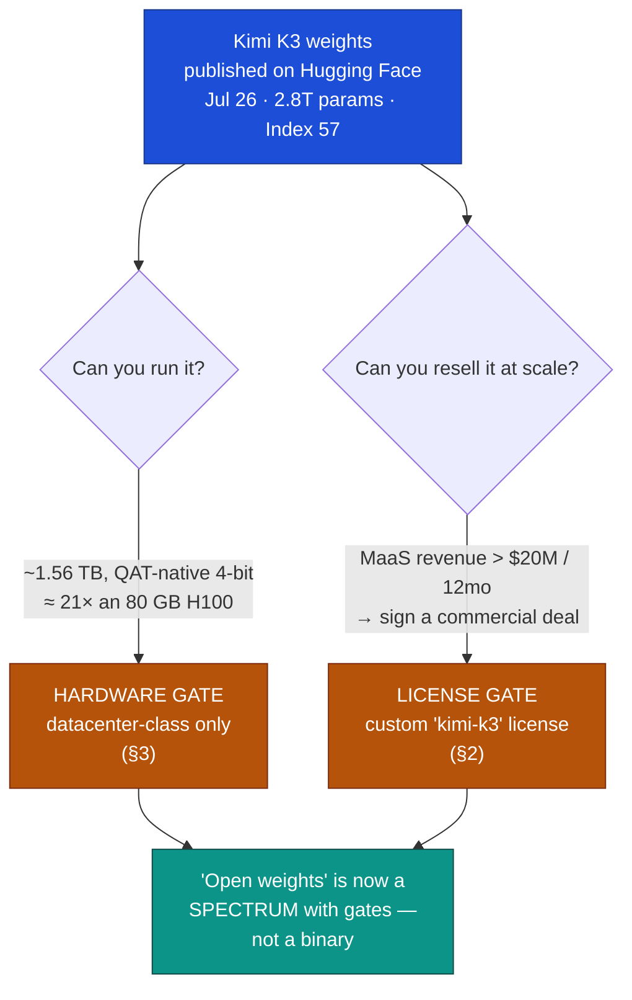

# LLM Updates — 2026-Jul-29

Wednesday brief, written Wed Jul 29 (Los Angeles time). For six weeks these briefs
carried the same open line-item on the "Watch next" list: **Kimi K3's promised Jul-27
open weights** (Jul-17 §1 → Jul-24 §4 → Jul-25 §4). It resolved this window — and it
resolved in a way that reframes what "open weights" even means at the 3-trillion-parameter
scale.

The single fact that matters: **on Jul 26, a day ahead of target, Moonshot AI published
the full Kimi K3 weights on Hugging Face — the first genuinely open model to sit in the
top tier of the Artificial Analysis Intelligence Index (57, #3–#4).** It hit #1 on
Hugging Face trending in ~30 minutes. But the release settles the month-long "will they
ship, and under what license" question with **two asterisks the earlier briefs did not
price in**: you almost certainly *cannot run it* (the repo is **~1.56 TB**, and because it
ships **quantization-aware in 4-bit** there is no compression dividend left to spend), and
large providers **cannot freely monetize it** (the license is **not** the rumored "Modified
MIT" — it carries a **$20M/12-month revenue gate** on Model-as-a-Service). Open weights
just became a **spectrum with gates**, not a binary.

This report corrects three specifics the Jul-25 brief carried as estimates (active-param
count, file size, license), and advances only what is **new since Jul-25**. It does **not**
re-derive the Opus 5 launch and the "quality/price decoupled from inside the leader" thesis
(Jul-25 §1–§5), the Gemini Flash trio and Gemini-4 pivot (Jul-24 §1–§2), the Fable 5 tier
split (Jul-20 §1), Inkling (Jul-20 §2), or the GPT-5.6 family (Jul-09 §1) — those are
unchanged (§5).

![Horizontal bar chart of storage and video-memory footprint in gigabytes for the Kimi K3 open-weights release. Serving the full model in vLLM needs about 1,680 GB of VRAM; the Hugging Face repository in native MXFP4 4-bit is about 1,560 GB; the smallest usable community quantization is still about 540 GB. For reference a single Nvidia H100 holds 80 GB and a high-end consumer GPU holds 24 GB. Because Kimi K3 ships quantization-aware in 4-bit there is no compression dividend left, so even the smallest build needs roughly seven H100s and the full model about twenty-one — a datacenter-class model, not consumer-runnable.](kimi_k3_storage_wall.svg)

---

## 1. Kimi K3 weights land (Jul 26) — the first open model at the top of the Index

Moonshot AI pushed the full **`moonshotai/Kimi-K3`** weights to Hugging Face on **Jul 26,
~7:30 PM EDT — roughly a day early** against the Jul-27 target every recent brief was
counting down to. Reported reception: **#1 on HF trending inside ~30 minutes** (HF's Clem
Delangue called it the fastest ever), ~7,700 likes and tens of thousands of downloads
within a day. Day-0 hosted access came from **Together AI and Modal**, timed to the drop.

The benchmark and price picture is exactly what the Jul-17 → Jul-25 briefs described, now
confirmed against the weights rather than an API:

| Fact | Value | vs. prior brief |
|---|---|---|
| AA Intelligence Index (K3 max) | **57.1**, ranked **#3–#4** | confirmed (Jul-17 §1 said ~57) |
| Position on Index | behind Fable 5 (59.9) & GPT-5.6 Sol max (58.9); at/above Opus 4.8 (56) | unchanged |
| Price | **$3 / $15** per Mtok; effective ~$0.94 / weighted task | confirmed (Jul-17 §1) |
| Also tops | **Frontend Code Arena** (per Artificial Analysis) | new detail |

So the headline claim holds: **this is the first fully-open-weights model to land in the
top tier of the Index** — level with the prior-generation closed flagships (Opus 4.8,
GPT-5.5) and behind only the current closed leaders. On cost-per-task (~$0.94) it undercuts
GPT-5.6 Sol max (~$1.04) and Fable 5 (~$2.75).

**Three corrections to the Jul-25 brief.** The weights let independent readers check specs
the earlier briefs carried on trust, and two of the three were off:

- **Active parameters: ~104B, not ~A50B.** Sources consistently report **16 of 896 experts
  per token → ~104B active** (the Jul-17 §1 "~A50B" figure is not supported). Architecture
  as described: **Kimi Delta Attention**, **Stable LatentMoE**, hybrid linear attention in a
  subset of layers, 1M-token context, natively multimodal (text/image/video).
- **Size: ~1.56 TB, not ~594 GB.** The HF repo is reported at **~1,561 GB** — because the
  release *is* the native 4-bit distribution plus multimodal components, not a BF16 dump
  (§3). The Jul-25 "~594 GB BF16 / Q4 300–400 GB" estimate does not hold.
- **License: a custom "kimi-k3" document, not "Modified MIT"** (§2).

**Sources:**
[Hugging Face — moonshotai/Kimi-K3](https://huggingface.co/moonshotai/Kimi-K3) ·
[Artificial Analysis — Kimi K3 achieves #3 on the Intelligence Index, comparable to Opus 4.8 & GPT-5.5](https://artificialanalysis.ai/articles/kimi-k3-achieves-3-in-the-artificial-analysis-intelligence-index-comparable-to-opus-4-8-and-gpt-5-5) ·
[Artificial Analysis — Kimi K3 model page](https://artificialanalysis.ai/models/kimi-k3) ·
[daily.dev — Moonshot releases Kimi K3 weights, tops the Frontend Code Arena](https://daily.dev/posts/moonshot-ai-releases-kimi-k3-weights-a-2-8t-open-weight-model-that-tops-the-frontend-code-arena-dxt19nyw1) ·
[Kimi — K3 blog](https://www.kimi.com/blog/kimi-k3) ·
[The Interconnects — Kimi K3, the open-weights escalation](https://www.interconnects.ai/p/kimi-k3-the-open-weights-escalation)

---

## 2. The license gate — "open," but with a $20M Model-as-a-Service threshold

The flagged uncertainty from Jul-17 (§1) — *"the 'Modified MIT' claim is unconfirmed"* —
resolves as a **correction**: the shipped license is **not** stock or modified MIT. Hugging
Face lists it as **"other / kimi-k3,"** a custom document, and the substance is a
**commercial-scale gate** grafted onto otherwise permissive terms:

- **Clause 2 — the MaaS revenue threshold.** Any licensee (with affiliates) running a
  **Model-as-a-Service** business whose aggregate revenue exceeds **US $20M over any
  consecutive 12 months** must sign a **separate commercial agreement with Moonshot** before
  commercial use. Below that line, use is free.
- **Attribution.** Products above roughly **100M MAU or $20M/month** must display
  **"Kimi K3"** prominently in-UI.
- **Exemptions.** Internal use, and access via Moonshot's own products or certified
  partners, are exempt from the threshold.

VentureBeat published the full text and flags clause 2 as the material enterprise risk;
implicator.ai independently confirms the $20M MaaS clause. This is the same shape as
Llama's old "700M MAU" carve-out, re-drawn as a **revenue** line — permissive for
researchers, startups, and internal deployment, but a **negotiation trigger** for anyone
who would resell K3 inference at scale. It is meaningfully **more restrictive than
Inkling's Apache-2.0** (Jul-20 §2) and meaningfully **more open than any closed frontier
model** — which is precisely why "open weights" no longer reads as a single bit.

**Sources:**
[VentureBeat — Kimi K3's full weights are here, but they're open with a caveat: what enterprises should know](https://venturebeat.com/technology/kimi-k3s-full-weights-are-here-but-theyre-open-with-a-caveat-what-enterprises-should-know) ·
[implicator.ai — Moonshot attaches a $20M revenue clause to Kimi K3 open weights](https://www.implicator.ai/moonshot-attaches-20-million-revenue-clause-to-kimi-k3-open-weights/) ·
[MLQ — Moonshot releases 1.56 TB Kimi K3 weights under a custom commercial license](https://mlq.ai/news/moonshot-releases-156-tb-kimi-k3-weights-under-a-custom-commercial-license/) ·
[digitalapplied — Kimi K3 open weights shipped: license restrictions (2026)](https://www.digitalapplied.com/blog/kimi-k3-open-weights-shipped-license-restrictions-2026)

---

## 3. The hardware gate — QAT-native 4-bit means the quantization dividend is already spent

The more surprising asterisk is physical. Normally "open weights" implies a path to
self-hosting: download the BF16 checkpoint, quantize to 4-bit yourself, and a big model
shrinks ~4× onto attainable hardware. **Kimi K3 removes that path by design.** It ships
**quantization-aware trained (QAT) in MXFP4** — 4-bit weights, 8-bit activations — from the
SFT stage onward. The distribution *is already* the 4-bit model.

The consequence is what the hero chart shows: **there is no dividend left to spend.**

- **HF repo:** ~**1.56 TB** (reported 1,561,018,243,668 bytes) in native MXFP4.
- **To serve full** in vLLM: ~**1.68 TB of VRAM** — on the order of **21× an 80 GB H100.**
- **Smallest usable community quant** as of Jul 28 (Unsloth dynamic ~1-bit / IQ1_S): still
  **~540 GB** — and pushing below that degrades a model that was *already* 4-bit, so quality
  falls off fast. Consensus across the self-host writeups: **datacenter-class, not
  consumer-runnable**, and **no full-fidelity community GGUF** confirmed yet.

This is the quiet structural point of the whole release. An "open" 3T-class model whose
**cheapest possible footprint is ~540 GB** is open to *labs, clouds, and well-funded
enterprises* — not to the hobbyist tier that "open weights" historically implied. The 4-bit
QAT choice that makes K3 cheap to *serve at scale* is the same choice that makes it
impossible to *shrink for a workstation*. Access, in practice, is gated by a purchase order
for GPUs even before the license (§2) is read.

**Sources:**
[Hugging Face — AtomicChat/Kimi-K3-GGUF](https://huggingface.co/AtomicChat/Kimi-K3-GGUF) ·
[Unsloth — running Kimi K3 (dynamic quants)](https://unsloth.ai/docs/models/kimi-k3) ·
[kingy.ai — run Kimi K3 locally: hardware, VRAM, cost](https://kingy.ai/ai/ai-guides/run-kimi-k3-locally-hardware-vram-cost/) ·
[kie.ai — what is Kimi K3](https://kie.ai/blog/what-is-kimi-k3)

---

## 4. The other in-window primary event — MCP 2026-07-28 goes stateless (Jul 28)

While the model story was Kimi K3, the **infrastructure** story was the fifth
**Model Context Protocol** spec, published **Jul 28, 2026**. It matters here because MCP is
now the default plumbing under agentic LLM use, and this revision is a re-architecture, not
a point bump:

- **Stateless request/response core.** The spec retires the `initialize` / `initialized`
  handshake and the `Mcp-Session-Id` header, moving to a stateless model designed for
  horizontal scale (load-balanced, serverless MCP servers). Adds **Multi-Round-Trip
  Requests**, header-based routing (`Mcp-Method` / `Mcp-Name`), and **cacheable list
  results** (`ttlMs` / `cacheScope`).
- **Auth hardening.** Adopts RFC 9207 and **CIMD** (replacing Dynamic Client Registration);
  formalizes a **Tasks** extension. Roots / Sampling / Logging are deprecated with a
  12-month support window.
- **Scale signal.** Anthropic reports the connector/SDK ecosystem at roughly **~400M monthly
  SDK downloads (≈4× YoY)** and **950+ servers** in the connectors directory; the TS and
  Python SDKs each cite >1B cumulative downloads. Claude announced same-day support
  alongside embedded-UI connectors, enterprise-managed auth, and observability.

The through-line: as the *models* consolidate at the top (Opus 5, Kimi K3), the *protocol*
they act through is being re-engineered for enterprise-scale, multi-tenant agent traffic —
stateless, cacheable, and auth-hardened.

**Sources:**
[Model Context Protocol — 2026-07-28 spec release](https://blog.modelcontextprotocol.io/posts/2026-07-28/) ·
[Claude — bringing MCP 2026-07-28 to Claude](https://claude.com/blog/bringing-mcp-2026-07-28-to-claude) ·
[mpost — Anthropic releases largest MCP update yet, moving the protocol to a stateless core](https://mpost.io/anthropic-releases-largest-mcp-update-yet-moving-protocol-to-stateless-core-for-enterprise-scale/)

---

## 5. Also moving, and what didn't (Jul 25 → 29)

- **xAI — Grok 4.6 / 4.7 roadmap (Musk, Jul 25 & 28), forward-looking only.** Musk posted
  that **Grok 4.6 is ~2 weeks out (≈ Aug 7 target, ~1.5T params, improved SFT/RL)** and
  **Grok 4.7 follows weeks later (~2.1T params)**, claiming the pair with Opus 5 sit "alone
  on the Pareto frontier" and that 4.7 will beat "China's biggest model." **No benchmarks,
  context window, or pricing** were published — these are roadmap claims, not a release. A
  Jul 26 Bloomberg piece separately alleged internal turbulence at xAI ahead of the SpaceX
  IPO.
  [American Bazaar — Musk says Grok 4.6 is weeks away, 4.7 to follow](https://americanbazaaronline.com/2026/07/28/elon-musk-says-grok-4-6-is-weeks-away-grok-4-7-to-follow-soon-485356/) ·
  [xAI — news](https://x.ai/news) ·
  [releasebot — xAI updates](https://releasebot.io/updates/xai)

- **Anthropic — Opus 5 follow-on coverage, no new event.** Opus 5 (launched Jul 24, Jul-25
  §1) drew a week of "half the price of Fable 5" analysis but **no new model, price, or
  Fable-5 repositioning** dated Jul 25–29. The zero-data-retention enterprise option and
  the ~$965B IPO framing were re-reported, not new.
  [Anthropic — Introducing Claude Opus 5](https://www.anthropic.com/news/claude-opus-5) ·
  [MLQ — Opus 5 tops the AA Index at half the cost of Fable 5](https://mlq.ai/news/anthropic-launches-claude-opus-5-tops-ai-benchmark-index-at-half-the-cost-of-fable-5/)

- **Alibaba Qwen3.8-Max — previewed Jul 19 (just pre-window).** A **2.4T-param** multimodal
  sparse-MoE, preview endpoint only, claiming to trail only Fable 5; **open weights promised
  "soon" with no date or license.** No new Qwen release landed Jul 25–29 — but it is the next
  near-frontier open-weights candidate after K3.
  [MarkTechPost — Alibaba previews Qwen3.8-Max, 2.4T-param multimodal model](https://www.marktechpost.com/2026/07/19/alibaba-previews-qwen3-8-max-a-2-4-trillion-parameter-multimodal-model-days-after-moonshots-kimi-k3-open-weight-launch/)

- **Unchanged, no new signal:** **Gemini 3.5 Pro** — still "testing with partners," no
  date/card/Index, **Gemini 4** pre-training the stated next answer (Jul-24 §1–§2).
  **DeepSeek V4** — the official/GA build over the Apr-24 preview still had **no confirmed,
  dated GA announcement** in-window (the Jul-24 §3 alias cutover already landed).
  **Inkling** (Jul-20 §2) — **Inkling-Small still unreleased.** **Fable 5 tier split**
  (Jul-20 §1) and the **classifier false-positive fix** (Jul-03 §1, now ~4 weeks unshipped)
  — no change.

---

## 6. Techniques & architecture — the current under 2026: sparse attention and 4-bit-native

Two research threads directly explain *why* Kimi K3 looks the way it does, and both are the
frontier's prevailing direction rather than one-off tricks. (Independent-source caveat in
the closing note.)

- **Sparse / linear attention amortized across layers.** K3's "Kimi Delta Attention" sits
  in the same family as Z.ai's **GLM-5.2 "IndexShare"** (Jun 13) — run the expensive top-k
  attention *indexer* only once every few layers and **reuse** the selected indices in the
  layers between, cutting per-token FLOPs at 1M context (GLM-5.2 claims ~2.9× fewer). This,
  plus **multi-head latent attention** (from DeepSeek) and hybrid **SSM/attention** stacks
  (the Mamba-3 line), is how 1M-context MoEs are being made affordable to serve.
  [Sebastian Raschka — GLM-5.2 & IndexShare sparse attention](https://sebastianraschka.com/blog/2026/glm-5-2-indexshare.html) ·
  [Hugging Face — GLM-5.2 blog (Z.ai)](https://huggingface.co/blog/zai-org/glm-52-blog) ·
  [Princeton PLI — Mamba-3: improved sequence modeling with state-space principles](https://pli.princeton.edu/blog/2026/mamba-3-improved-sequence-modeling-using-state-space-principles)

- **4-bit-native training (MXFP4 / NVFP4).** K3 shipping QAT-in-MXFP4 (§3) is the productized
  edge of the **fully-quantized-training** literature: NVIDIA Blackwell natively runs
  NVFP4/MXFP4; "FP4 All the Way" showed FP4 *training* (not just inference); LLM Compressor
  and AMD Quark now ship MXFP4 paths for vLLM. The trade K3 makes concrete: 4-bit-native is
  cheap to serve at scale **and** removes the post-hoc quantization headroom self-hosters
  used to rely on.
  [Red Hat — LLM Compressor 0.9.0: MXFP4 support](https://developers.redhat.com/articles/2026/01/16/llm-compressor-090-attention-quantization-mxfp4-support-and-more) ·
  [arXiv — FP4 All the Way: Fully Quantized Training (2505.19115)](https://arxiv.org/abs/2505.19115) ·
  [arXiv — Low-bit quantization survey (2507.17417)](https://arxiv.org/abs/2507.17417)

---

## 7. The through-line — "open weights" splits into a spectrum

For weeks these briefs treated *open vs. closed* as one of the map's axes, with a single
open pole (Kimi K3, near-frontier) and a cheaper one (Inkling, Apache-2.0). **The K3 drop
shows that pole is itself a gradient**, defined by two gates the word "open" hides:

| | Closed frontier | **Kimi K3** | Inkling |
|---|---|---|---|
| Weights | none | **public (HF, Jul 26)** | public |
| License | proprietary | **custom "kimi-k3" — $20M MaaS gate (§2)** | Apache-2.0 |
| Runnable by | vendor only | **datacenter only (~540 GB floor, §3)** | large infra |
| Index | 59–61 | **57** | 41 |

The net for Jul 29: the headline watch-item of the last month **resolved as a "yes" — the
weights are real, top-tier, and out** — but the release quietly redefines the category. An
open 3T model that lists at a fifth of the flagship's cost-per-task, yet needs ~21 H100s to
load and a signed contract to resell, is **"open" in a way that helps clouds, national labs,
and large enterprises far more than the community that the term historically described.**
The most important move of the week wasn't a benchmark — it was the **first proof that
"open weights" at frontier scale comes with a hardware bill and a revenue clause.**

---

## Watch next

- **Does a runnable K3 appear?** Whether anyone lands a genuinely usable sub-540 GB
  quantization (or a distilled "K3-mini"), or whether QAT-native 4-bit permanently caps the
  self-host floor at datacenter scale (§3).
- **Who else copies the revenue-gated license?** Whether the **$20M MaaS threshold** (§2)
  becomes the template for near-frontier "open" models — watch **Qwen3.8-Max**'s promised
  weights and license (§5) as the next test.
- **Grok 4.6 (≈ Aug 7).** Whether xAI's roadmap post (§5) ships on time, and with what
  independent Index / price — the first real answer to Opus 5 and K3 from a challenger, vs.
  another forward-looking claim.
- **MCP 2026-07-28 adoption.** Whether the stateless core (§4) is actually adopted by major
  MCP servers, or whether the 12-month deprecation of the handshake/session model creates a
  messy migration like the DeepSeek alias cutover (Jul-24 §3).
- **Gemini: Pro or generation-skip?** Unchanged from Jul-24 — any date/card for 3.5 Pro, or
  a Gemini-4 timeline that makes it moot (§5).

---

*Compiled Wed Jul 29 2026 (Los Angeles time) from public reporting and independent benchmark
trackers. Vendor- and roadmap-reported figures (Kimi K3 architecture/params, license terms,
storage/VRAM footprints, MCP adoption counts, Grok 4.6/4.7 specs) are flagged as such;
independent Intelligence Index and cost-per-task numbers are from Artificial Analysis as
relayed by secondary trackers. As in prior compiles, direct fetches to many primary and
publisher domains (Hugging Face, Artificial Analysis, VentureBeat, arXiv, vendor blogs)
returned HTTP 403 during compilation, so figures are cited via the search index and mirrored
trackers where a direct read failed — treat freshly-reported specs for a model days old, and
Musk's unreleased-model claims, as provisional. This brief corrects three Jul-25 estimates
(K3 active params, size, and license) against post-release reporting. Prior background is
referenced by date/section rather than repeated.*
