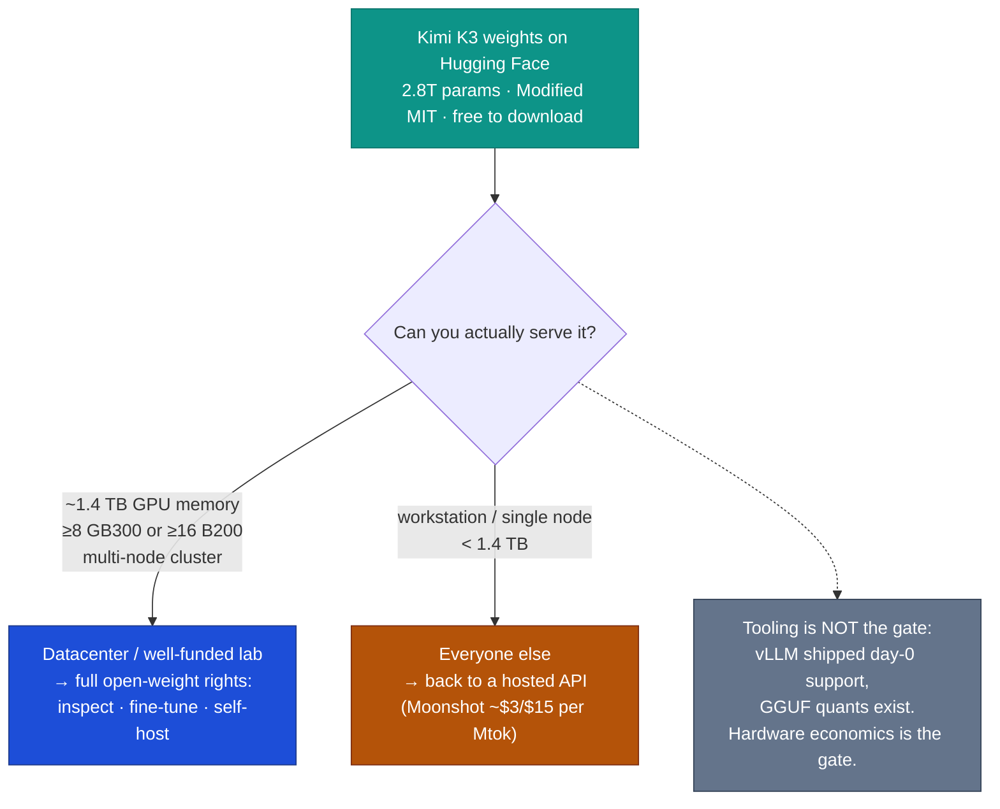

# LLM Updates — 2026-Jul-30

Thursday brief, written Thu Jul 30 (Los Angeles time). The last brief (Jul-25,
Saturday) closed with one headline external watch-item: **would Moonshot's Kimi K3
weights actually land on Jul 27, under what license, and how would they behave once
the community could self-host them?** (Jul-25 §4, "Watch next"). That item has now
**resolved** — and it resolved into the largest open-weight release in history landing
straight into a public fight over whether releases like it should be legal at all.

The single fact that matters this week: **the most capable open-weight model ever
released is now free to download — and it is effectively un-runnable by almost everyone
who can download it.** On **Jul 27** (weights actually posted the evening of **Jul 26**,
a day ahead of target), Moonshot AI published the full **Kimi K3** weights to Hugging
Face — **2.8T parameters** — under a confirmed **Modified MIT** license. It is the
highest-scoring open model on the independent Artificial Analysis Intelligence Index at
**57** (#3 overall, behind only closed Opus 5 / Fable 5 / GPT-5.6 Sol). But serving it
needs **~1.4 TB of aggregate GPU memory** — a multi-node datacenter cluster, not a
workstation. "Open" and "runnable" have come apart. The same week, **Anthropic CEO Dario
Amodei** posted the company's formal position on open weights (Jul 27), tying this
release back to the **June export-control saga** these briefs tracked (Jun-21 → Jul-01).

This report advances only what is **new since Jul-25.** It does **not** re-derive the
Opus 5 launch and the "top quality at mid price" reshuffle (Jul-25 §1–§3), the Fable 5
tier split (Jul-20 §1), the GPT-5.6 family (Jul-09 §1), Google's Flash trio / Gemini-4
pivot (Jul-24 §1–§2), or Kimi K3's original Jul-16 API launch (Jul-17 §1) — those are
unchanged (§4).

---

## 1. Kimi K3 weights ship (Jul 26–27) — the watch-item resolves, with the license confirmed

Moonshot AI posted the full Kimi K3 weights to `huggingface.co/moonshotai/Kimi-K3` on
the evening of **Jul 26 (~7:30 PM EDT)** — roughly a day ahead of the **Jul 27 00:00 UTC**
target it had been signalling since Jul-17. Two of the three things the Jul-25 brief
flagged as unknown are now settled:

- **License — confirmed "Modified MIT"** (the claim the Jul-17 §1 brief carried as
  *unconfirmed* is now real). It is free to use, modify, and deploy commercially with
  attribution. Two conditions bite **only at scale**: a model-as-a-service business
  earning **>$20M/year** on K3 needs a separate agreement with Moonshot, and any product
  with **>100M monthly users or >$20M/month revenue** must display **"Kimi K3"** in its
  interface. For research, startups, and internal enterprise use this is a genuinely
  permissive release — closer to Apache in spirit than to the source-available licenses
  some Chinese labs have used.
- **Independent Index — 57, #3 overall.** Artificial Analysis scores the released model
  at **57** on the Intelligence Index v4.1, matching the API figure carried since Jul-17.
  Only six variants across three models score higher, all closed: **Opus 5 (61), Fable 5
  (60), GPT-5.6 Sol (59)**. Among open weights it is not close — **GLM-5.2 is next at 51**,
  **DeepSeek V4 Pro at 44**, Inkling at 41. K3 is now unambiguously the **top open-weight
  model in the world**, ~4 points under the closed ceiling (see chart above).

One **correction to prior briefs**: the active-parameter count is **~104B active** of
2.8T total (Mixture-of-Experts), per Artificial Analysis' model page — the Jul-17 §1
figure of "~A50B active" was low. Total params (2.8T), the 1M-token context, and the
multimodal-in profile are unchanged.

**Sources:**
[Hugging Face — moonshotai/Kimi-K3 (model card)](https://huggingface.co/moonshotai/Kimi-K3) ·
[Artificial Analysis — Kimi K3 model page (Index 57, 2.8T/104B active)](https://artificialanalysis.ai/models/kimi-k3) ·
[Artificial Analysis — Kimi K3 achieves #3 on the Intelligence Index](https://artificialanalysis.ai/articles/kimi-k3-achieves-3-in-the-artificial-analysis-intelligence-index-comparable-to-opus-4-8-and-gpt-5-5) ·
[Medium (Data Science in Your Pocket) — Kimi K3 weights released on Hugging Face](https://medium.com/data-science-in-your-pocket/kimi-k3-weights-released-on-huggingface-8dcd58e29b55) ·
[TechTimes — Kimi K3 open weights arrive; self-hosting cuts China data risk the API never can](https://www.techtimes.com/articles/321551/20260725/kimi-k3-open-weights-arrive-sunday-self-hosting-cuts-china-data-risk-api-never-can.htm) ·
[Kingy AI — Kimi K3 benchmarks & pricing vs Fable 5 / GPT-5.6 Sol](https://kingy.ai/blog/kimi-k3-benchmarks-specs-price-fable-5-gpt-5-6-sol/)

---

## 2. "Open" ≠ "runnable" — the hardware floor is the real gate

The genuinely new story is not that the weights exist; it's what happens when you try to
use them. The Jul-25 brief guessed the release would be **~594 GB in BF16** with Q4 GGUFs
landing it around 300–400 GB for self-hosters. The reality is heavier, and the practical
barrier turns out to be **hardware economics, not tooling**:

- **Download footprint:** ~**1.56 TB** across **96 safetensors** shards on Hugging Face;
  the **MXFP4** weights alone are ~**1.4 TB**.
- **Serving floor:** no single GPU — and **no single 8-GPU node** — can hold it. vLLM's
  own deployment metadata estimates a **~1,680 GB minimum VRAM** footprint and its recipe
  calls for at least **eight GB300** GPUs; on the prior generation you need a **minimum of
  ~16 B200/GB200** accelerators, and production serving recommendations run to **64+**.
- **Tooling — a correction worth making:** contrary to early "the custom architecture
  isn't supported in local tools yet" takes, **vLLM shipped day-0 support** for K3's
  attention design alongside the weights (a "Kimi K3 is here — efficient day-0 support"
  post dated Jul 27), and `unsloth` posted GGUF quantizations. So the blocker is **not**
  that inference engines can't load it. The blocker is that **even quantized, it needs a
  multi-node cluster with >1.4 TB of aggregate GPU memory** — comfortably out of reach for
  the single-workstation self-hosters "open weights" usually implies.

The upshot: K3 delivers the two things only open weights can — **inspect / fine-tune /
self-host on your own infrastructure**, which is exactly the "cuts China data risk the API
never can" pitch — but the audience that can actually exercise those rights is limited to
teams that can provision datacenter-class GPU fleets. For everyone else, "open" K3 is, in
practice, still an API product (Moonshot's own endpoint, ~$3/$15 per Mtok, Jul-17 §1).

**Sources:**
[vLLM Blog — Kimi K3 is here: efficient day-0 support on vLLM](https://vllm.ai/blog/2026-07-27-k3) ·
[Northflank — Kimi K3: benchmarks, hardware requirements, and self-hosting](https://northflank.com/blog/what-is-kimi-k3-self-hosting) ·
[Yotta Labs — Kimi K3 model size, open weights, and hardware requirements](https://www.yottalabs.ai/post/kimi-k3-specs-benchmarks-how-to-access-2026) ·
[explainx.ai — Run Kimi K3 locally: confirmed hardware + vLLM](https://explainx.ai/blog/kimi-k3-run-locally-open-weights-desktop-july-2026) ·
[Hugging Face — unsloth/Kimi-K3-GGUF](https://huggingface.co/unsloth/Kimi-K3-GGUF)

---

## 3. The open-weights policy fight goes public — Amodei's Jul 27 post

The K3 drop landed the same day Anthropic chose to put its open-weights position on the
record. On **Jul 27**, in a post ("Our position on open-weights models") and follow-up
remarks, **Dario Amodei** said Anthropic **"has never advocated for a ban on open-weights
models"** as a category, and called non-dangerous open models **"a public good."** What he
*does* argue for is narrower and unchanged from the June saga: **chip export controls, a
crackdown on distillation, and mandatory safety testing for all sufficiently capable
models — open and closed alike.** His framing: a blanket ban **"would not address my most
serious national security concerns."**

Why this matters here, and why now:

- **It closes a loop these briefs opened.** The June arc (Jun-21 → Jul-01) was about the
  US export suspension that pulled **Fable 5 / Mythos 5** dark for 19 days and the legal
  fight over its basis (EAR 744.22 vs IEEPA). Amodei's post is the frontier-lab argument
  that produced that regime, stated plainly — and it arrives precisely as **the strongest
  open model on earth ships from a Chinese lab, freely and permissively licensed,**
  demonstrating in real time that unilateral US controls don't gate the global open
  frontier.
- **He was responding to being isolated.** Reporting frames the post as a reply after
  **Nvidia, Microsoft, Meta, OpenAI, and Google** publicly backed open-weight models, with
  the **WSJ** reporting Silicon Valley criticism of Anthropic over its guardrails and its
  perceived lack of support for open weights. Jensen Huang in particular has pushed the
  opposite line. So this is Anthropic defending a distillation-and-testing-not-bans middle
  position against both a "ban it" caricature it rejects and an "open everything" camp it
  won't join.
- **Background context, not a model event:** separately, **1,100+ employees** across
  OpenAI, Anthropic, Google, and Meta signed a petition asking the US government to help
  **slow AI down** — a reminder the policy pressure runs in both directions this week.

Net: the open-weights debate stopped being an abstract export-control story and became a
concrete one — a specific 2.8T-param artifact you can download today, and a frontier-lab
CEO explaining, on the same day, which parts of that he thinks policy should and shouldn't
touch.

**Sources:**
[Anthropic — Our position on open-weights models](https://www.anthropic.com/news/position-open-weights-models) ·
[TechCrunch — Amodei: doesn't oppose open-weight models, but fears Chinese AI](https://techcrunch.com/2026/07/27/anthropics-dario-amodei-responds-doesnt-oppose-open-weight-models-but-fears-chinese-ai/) ·
[The Next Web — Anthropic's Amodei: company has never called for banning open-weight AI](https://thenextweb.com/news/anthropic-dario-amodei-open-weights-position-not-ban) ·
[Qz — Amodei rejects open-weight AI ban, wants safety testing](https://qz.com/anthropic-dario-amodei-open-weight-ai-ban-safety-testing-072826) ·
[Tech Startups — Amodei breaks silence after Nvidia, Microsoft, Meta, OpenAI, Google back open weights](https://techstartups.com/2026/07/27/anthropic-ceo-dario-amodei-breaks-silence-on-open-weight-ai-after-nvidia-microsoft-meta-openai-and-google-back-open-ai-models/) ·
[buildfastwithai — AI News Today, Jul 29 2026 (industry petition to slow AI)](https://www.buildfastwithai.com/blogs/ai-news-today-july-29-2026)

---

## 4. Unchanged since Jul-25 (no new signal)

To avoid re-deriving stable threads, these carried **no material development** in the
Jul 25 → 30 window:

- **Opus 5 remains #1** on the Intelligence Index at **61** (§1 chart ceiling), still ahead
  of Fable 5 (60) and GPT-5.6 Sol (59). No rival has yet answered the Jul-25 "top quality
  at mid price" move ($5/$25 at Index 61); no cheaper Sol variant, Grok, or Meta model at
  the Opus-5 point has appeared.
- **Fable 5 tier split** (Jul-20 §1) is still in force and still awkward (Jul-25 §2):
  Anthropic continues to meter a flagship its own cheaper Opus 5 out-scores. No repricing
  or Fable-5.x refresh yet — the open question from Jul-25's "Watch next" is still open.
- **Gemini 3.5 Pro — still absent.** No date, model card, pricing, or Index as of Jul 30;
  Google's answer remains the Jul-21 Flash trio (Gemini 3.6 Flash / 3.5 Flash-Lite / Flash
  Cyber) plus the stated "most ambitious pre-training run yet, for Gemini 4" (Jul-24 §1–§2).
  Google is still the lone frontier lab with no live top-tier model.
- **DeepSeek v4 cutover** — completed on schedule Jul 24 (Jul-24 §3); `deepseek-chat` /
  `deepseek-reasoner` remain hard-retired. **GLM-5.2** (51) and **DeepSeek V4 Pro** (44)
  are now the reference points *below* K3 on the open-weight board (§1 chart).
- **Classifier false-positive fix** (Jul-03 §1) — still **unshipped and unmeasured**, now
  ~4 weeks old.

**Sources:**
[Artificial Analysis — Intelligence Index leaderboard (Opus 5 #1)](https://artificialanalysis.ai/models/kimi-k3) ·
[TechCrunch — Google releases three new Gemini models, but no 3.5 Pro](https://techcrunch.com/2026/07/21/google-releases-three-new-gemini-models-but-no-3-5-pro/) ·
[llm-stats — AI updates & model releases (July 2026)](https://llm-stats.com/llm-updates)

---

## 5. The through-line — the export-control premise, empirically tested

The June arc of these briefs rested on a premise: that frontier-class model **weights** are
strategically sensitive enough to gate — the logic behind the 19-day Fable 5 / Mythos 5
suspension and the EAR-vs-IEEPA fight (Jun-21 → Jul-01). Six weeks later, that premise got
its cleanest real-world test. A Chinese lab **freely published the strongest open-weight
model ever built** (Index 57, permissive Modified MIT), and on the same day the CEO whose
lab most shaped the US control regime published a careful "not a ban, but yes to chip
controls and safety testing" position. Two things the Jul-17 → Jul-20 briefs treated as
open now have answers:

| Thread (prior briefs) | Status on Jul 30 | Change |
|---|---|---|
| Kimi K3 weights + license (Jul-17/25 watch-item) | **Shipped Jul 26–27, Modified MIT confirmed** | **resolved (§1)** |
| "Open weights" = self-hostable? | **Yes in principle; ~1.4 TB floor makes it datacenter-only** | **new — hardware, not tooling, is the gate (§2)** |
| Top open-weight model | **Kimi K3 (57), +6 over GLM-5.2, −4 to closed #1** | confirmed, now with live weights (§1) |
| Export-control / open-weights policy | **Amodei states position; industry split public** | **new — debate goes concrete (§3)** |
| Peak quality (closed) | Opus 5 (61) > Fable 5 (60) | unchanged (Jul-25 §1) |
| Absent flagship | Gemini 3.5 Pro → Gemini 4? | unchanged (§4) |

The net: the open frontier is now a **downloadable fact rather than a promise** — but the
practical meaning of "open" narrowed the moment the weights hit disk. What the closed labs
gate with pricing and access tiers, the open frontier now gates with **1.4 TB of GPU
memory**. The strategic question the June briefs asked — *can you actually control frontier
weights?* — got a two-part answer this week: **policy can't stop the release; hardware
still rations the use.**

---

## Watch next

- **Does a rival answer Opus 5's "top quality at mid price"?** Six days on, no OpenAI /
  xAI / Meta / Google model has matched the Index-61-at-$25 point (§4). Watch for a cheaper
  Sol tier or a Gemini-4 preview that reopens the quality-vs-price gap.
- **Fine-tunes and distillations of K3.** The Modified MIT license permits them; the real
  test of the release is whether the community produces smaller, cheaper K3 derivatives
  that fit a *single* node — collapsing the §2 hardware gate — and whether Moonshot's
  anti-distillation-sensitive licensing (§1) is tested (§3 ties this to Amodei's
  distillation-crackdown ask).
- **Does Anthropic reposition Fable 5?** Still open from Jul-25 — a Fable-5.x refresh, a
  repriced tier, or Fable quietly narrowing to a max-effort / Mythos-lineage niche now that
  Opus 5 out-scores it (§4).
- **Gemini: Pro or generation-skip?** Unchanged — any date/card for 3.5 Pro, or a Gemini-4
  timeline that makes it moot (§4).
- **Policy follow-through.** Whether Amodei's "chip controls + distillation crackdown +
  mandatory testing, not bans" position (§3) turns into any concrete rulemaking, and how
  the industry split (Nvidia/Meta/OpenAI/Google vs Anthropic) develops after the K3 release
  made the stakes tangible.

---

*Compiled Thu Jul 30 2026 (Los Angeles time) from public reporting and independent
benchmark trackers. Independent Intelligence Index figures (Opus 5 61, Fable 5 60,
GPT-5.6 Sol 59, Kimi K3 57, GLM-5.2 51, DeepSeek V4 Pro 44, Inkling 41) are from
Artificial Analysis; model specs, hardware/VRAM figures, license terms, and pricing are
from vendor pages and secondary trackers and are flagged as vendor-reported where relevant.
As in prior compiles, several primary and publisher domains (Hugging Face model card,
Northflank, and others) returned HTTP 403 to direct fetches during compilation, so figures
are cited via the search index and mirrored trackers where a direct read failed; a
license-scale threshold and hardware floor for a release days old should be treated as
provisional. Prior background is referenced by date/section rather than repeated.*
