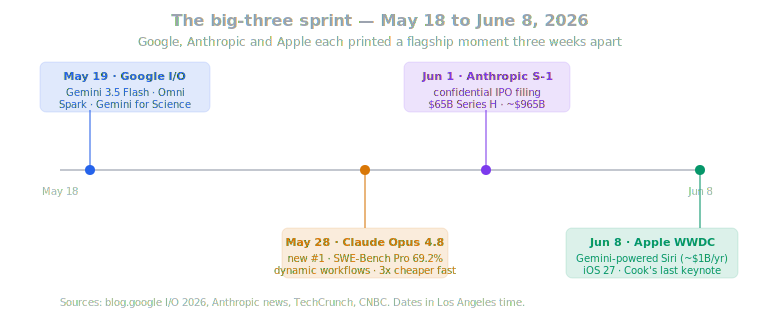
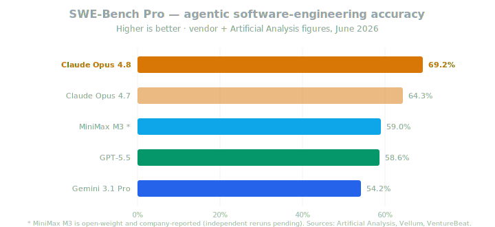
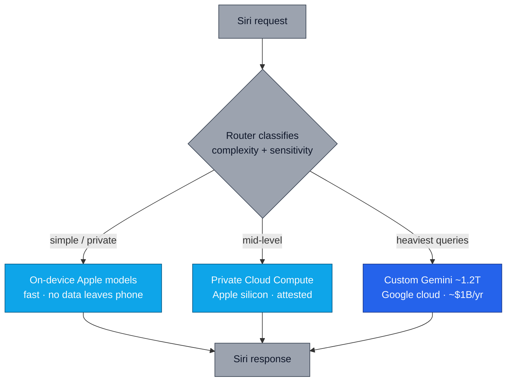
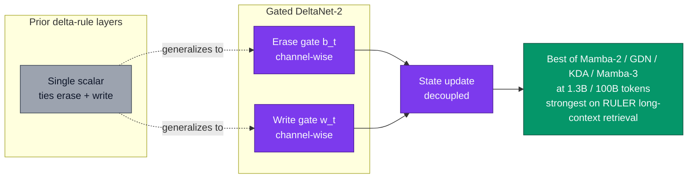
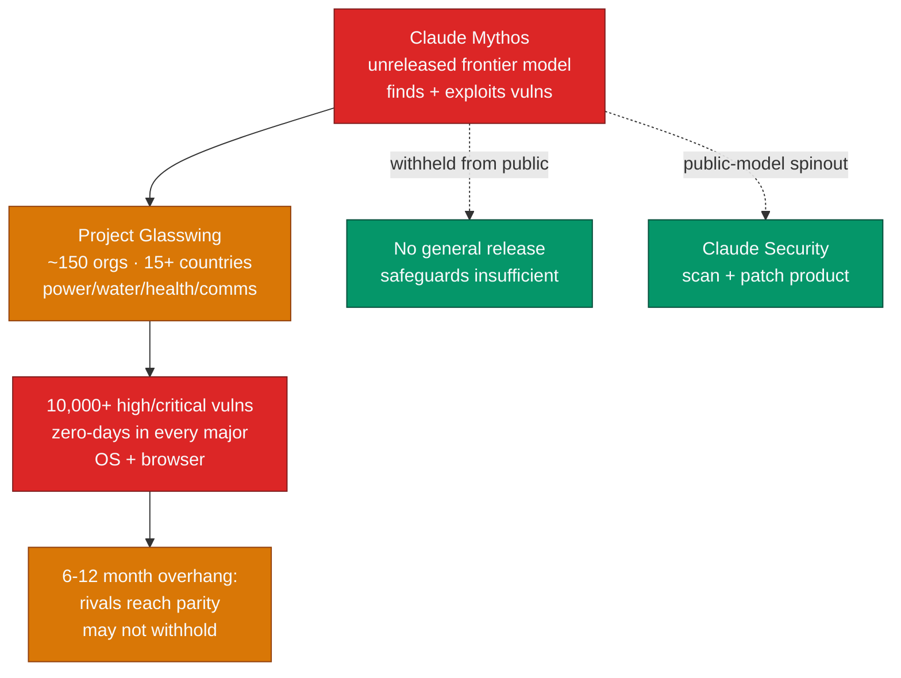

# LLM Updates — 2026-Jun-08

Monday brief, written Mon Jun 8 (Los Angeles time), the day **Apple's
WWDC 2026** keynote ran at Apple Park. This is the first brief since
**May 17**, so it consolidates a three-week window in which the three
biggest Western labs each printed a flagship moment almost exactly a
week apart: **Google I/O (May 19)**, **Claude Opus 4.8 (May 28)**,
**Anthropic's confidential IPO filing (Jun 1)**, and **WWDC (Jun 8)** —
where the headline was that **Siri now runs on Google Gemini**.

Net of the noise, the period resolved several open threads the May 17
brief had flagged as pending:

1. **Google I/O delivered the leaked lineup** (May 19) — **Gemini 3.5
   Flash** shipped GA (not 3.2 Flash as the leaks guessed), **Gemini
   Omni Flash** began rolling out to all paid tiers, **Gemini for
   Science** launched with same-day *Nature* validation, and the
   **Spark** agent and **Intelligent Eyewear** glasses were both real.
2. **Claude Opus 4.8 landed (May 28)** as the new #1 on the
   independent aggregate boards — **69.2% SWE-Bench Pro**, **96.7%
   USAMO 2026**, a **"dynamic workflows"** tool in Claude Code, and a
   **fast mode that is 3× cheaper** than before, at unchanged
   $5 / $25 per-MTok pricing.
3. **The Anthropic capital story resolved upward**: the May-flagged
   round closed as a **$65B Series H at a ~$965B valuation**, revenue
   run-rate is **$47B** (from $10B a year ago), and on **Jun 1**
   Anthropic **confidentially filed a draft S-1 with the SEC** —
   the first frontier-lab IPO filing.
4. **Apple resolved its model question by licensing Gemini**
   (Jun 8) — a custom ~1.2T-parameter Gemini reportedly powering the
   cloud tier of a rebuilt Siri, under a deal reported at **~$1B/yr**.
   It is Tim Cook's last WWDC; **John Ternus** takes over Sep 1.
5. **The open-weights wave kept its ~2-day cadence** — **MiniMax M3**
   (Jun 1, 1M context, MSA), **Gemma 4 12B** (Jun 3), **NVIDIA
   Nemotron 3 Ultra 550B** (Jun 4), **Qwen3 Coder Next** (Jun 6).
6. **Architecture research consolidated around linear/hybrid
   attention** — NVIDIA's **Gated DeltaNet-2** (arXiv 2605.22791),
   **DASH** hybrid-attention search (2605.20936), and the
   **MiniMax-M2 series** report all in a two-week burst.
7. **Anthropic put a frontier offensive-security model into the
   open** as a *story*, not a release — **Project Glasswing** expanded
   to ~150 orgs in 15+ countries, with the unreleased **Claude
   Mythos** model having surfaced **10,000+ high/critical
   vulnerabilities**.

Items from the May 17 brief *not* re-derived here: the Ramp AI Index
crossover, Claude Code at ~4% of GitHub commits, the "2028: Two
scenarios" policy paper, the Brockman $50B compute testimony, the
pre-I/O Spark/Teamfood/Omni leaks (now resolved below), Predictive
Maps (2605.11453) and Cattle Trade (2605.14537), GPT-5.5 Instant,
GPT-Realtime-2, PwC × Anthropic, ZAYA1-8B, and the Microsoft Agent
365 GA.

---

## 1. Claude Opus 4.8 — the new #1, and a step-change in math

Anthropic shipped **Claude Opus 4.8** on **May 28**, calling it "a
modest but tangible improvement" over Opus 4.7 — language that
undersells what the benchmarks show
([Anthropic — Introducing Claude Opus 4.8](https://www.anthropic.com/news/claude-opus-4-8),
[Artificial Analysis — Opus 4.8 is the new #1](https://artificialanalysis.ai/articles/claude-opus-4-8-analysis-and-benchmarks),
[Vellum — Opus 4.8 benchmarks explained](https://www.vellum.ai/blog/claude-opus-4-8-benchmarks-explained),
[TechCrunch — Opus 4.8 with dynamic-workflow tool](https://techcrunch.com/2026/05/28/anthropic-releases-opus-4-8-with-new-dynamic-workflow-tool/),
[VentureBeat — 3× cheaper fast mode, near-Mythos alignment](https://venturebeat.com/technology/anthropics-claude-opus-4-8-is-here-with-3x-cheaper-fast-mode-and-near-mythos-level-alignment),
[CloudZero — Opus 4.8 pricing](https://www.cloudzero.com/blog/claude-opus-4-8-pricing/)).

The numbers worth recording:

| Benchmark | Opus 4.8 | Opus 4.7 | GPT-5.5 | Gemini 3.1 Pro |
| --- | --- | --- | --- | --- |
| SWE-Bench Pro (agentic SWE) | **69.2%** | 64.3% | 58.6% | 54.2% |
| Terminal-Bench 2.1 | 74.6% | — | **78.2%** | — |
| USAMO 2026 (olympiad math) | **96.7%** | 69.3% | — | — |
| GDPval-AA (knowledge work) | **1890** | — | 1769 | 1314 |
| OSWorld-Verified (computer use) | **83.4%** | — | — | — |

Three things stand out:

- **The math jump is the headline.** A **+27.4 point** USAMO gain
  (69.3 → 96.7) in a **41-day** release cycle is the largest
  single-cycle olympiad-math improvement in the Opus line. It puts a
  general-purpose frontier model at near-ceiling on a benchmark that
  was differentiating *reasoning-specialist* models a year ago.
- **GPT-5.5 still owns one lane.** Terminal-Bench 2.1 (agentic
  *terminal* coding) stays with GPT-5.5 at 78.2% vs. Opus 4.8's
  74.6%. The frontier is no longer a single ladder — it is
  lane-by-lane, and procurement should benchmark on its own task mix
  rather than the topline.
- **The economics moved more than the model.** Opus 4.8's **fast
  mode** (≈2.5× throughput) is now **3× cheaper** than the previous
  fast tier, and headline pricing held at **$5 / $25 per MTok**. A
  capability gain *and* a cost cut in the same release is the pattern
  that has been pulling the Ramp/Claude-Code adoption flywheel from
  the May 17 brief.

The new product surface is **"dynamic workflows"** in Claude Code —
a mechanism that lets the agent decompose and sustain very
large-scale tasks across many steps without losing the plan. It is
the operational complement to the SWE-Bench Pro lead: the lab is
shipping the *harness* alongside the *model*. (This is also the model
this very brief is being written on.)

---

## 2. Anthropic: $65B Series H, ~$965B, and a confidential S-1

The May 17 brief flagged a "$30B / $900B in-progress round" and a
late-May close window. Both resolved larger than expected. The round
closed as a **$65B Series H at a roughly $965B post-money
valuation**, and on **Jun 1** Anthropic **confidentially submitted a
draft Form S-1 to the SEC** — the first IPO filing by a frontier AI
lab
([Anthropic — confidential draft S-1](https://www.anthropic.com/news/confidential-draft-s1-sec),
[CNBC — Anthropic files IPO prospectus](https://www.cnbc.com/2026/06/01/anthropic-ipo-s1-prospectus.html),
[Fortune — $65B round, $965B valuation](https://fortune.com/2026/06/01/anthropic-confidentially-files-ipo-965-billion-valuation/),
[TechCrunch — Anthropic files to go public](https://techcrunch.com/2026/06/01/anthropic-files-to-go-public/),
[CBS News — public-market test of the AI boom](https://www.cbsnews.com/news/anthropic-ipo-confidential-filing-claude-ai/)).

The shape that matters:

- **Revenue run-rate is now ~$47B**, up from **$10B** in annual
  revenue a year ago — a ~4.7× expansion that is the quantitative
  basis for the valuation step from the ~$350B range earlier in the
  cycle to ~$965B now.
- **A trillion-dollar debut is the base case** if markets cooperate.
  A confidential S-1 does not lock a timetable; the prospectus must
  reach investors ≥15 days before a roadshow, so the earliest public
  pricing window is plausibly **Q3–Q4 2026**.
- **This reframes the OpenAI race.** OpenAI's $50B-compute,
  $852B-valuation posture (May 17 brief) now sits opposite a rival
  that is both **higher-valued on paper** *and* **first to the public
  markets**. The IPO converts the "Anthropic ahead" narrative from a
  private-round talking point into an SEC-disclosable one — the
  audited financials in the eventual public S-1 will be the first
  apples-to-apples frontier-lab number the market has ever seen.

The watch item: whether OpenAI responds with its own structured
liquidity event (tender, secondary, or its own filing) **before**
Anthropic's roadshow. The order of the two prints will set the
two-year framing for which lab "the market" treats as the leader.

---

## 3. Google I/O 2026 — Gemini 3.5 Flash, Omni, and Science

Google I/O ran **May 19**. The leaks the May 17 brief tracked were
*directionally* right and *specifically* wrong: the speed tier shipped
as **Gemini 3.5 Flash** (not "3.2 Flash"), and the agent shipped as
**Spark** as predicted
([blog.google — 100 things at I/O 2026](https://blog.google/innovation-and-ai/technology/ai/google-io-2026-all-our-announcements/),
[Google Developers Blog — all the I/O 2026 keynote news](https://developers.googleblog.com/all-the-news-from-the-google-io-2026-developer-keynote/),
[Deeper Insights — 12 biggest announcements](https://deeperinsights.com/news/google-i-o-2026-recap/),
[Tom's Guide — Spark, Intelligent Eyewear and more](https://www.tomsguide.com/news/live/google-io-2026-live-news-updates)).

### 3.1 Gemini 3.5 Flash

The headline model is **Gemini 3.5 Flash** — "frontier intelligence
with action," GA via **Google Antigravity**, the **Gemini API in AI
Studio**, and **Android Studio**. Google's claim is that 3.5 Flash
**outperforms the older Gemini 3.1 Pro on hard coding and agentic
benchmarks** while keeping Flash-tier speed. **Gemini 3.5 Pro** is in
internal use with a stated rollout "the following month" (i.e., a
**June** Pro release is queued — see §8).

### 3.2 Gemini Omni — the unified generative model

**Gemini Omni** is the unified "create anything from any input" model
the May leaks called "Omni." **Gemini Omni Flash** began rolling out
to **all Google AI Plus / Pro / Ultra subscribers globally** through
the Gemini app and **Google Flow**, starting with video. This is the
consolidation play the May 17 brief predicted — folding the Veo /
Imagen / Lyria generative stack into one Gemini-branded model.

### 3.3 Gemini for Science — the most underrated reveal

The reveal with the longest half-life is **Gemini for Science**, a
suite of agentic research tools backed by **two same-day,
peer-reviewed *Nature* papers** (Co-Scientist and the Empirical
Research Assistance / ERA system)
([blog.google — Gemini for Science](https://blog.google/innovation-and-ai/technology/research/gemini-for-science-io-2026/),
[TechTimes — ERA beat the CDC forecasting ensemble](https://www.techtimes.com/articles/316901/20260520/gemini-science-launches-peer-reviewed-benchmarks-era-beat-cdc-forecasting-model.htm),
[The Decoder / 36Kr — Gemini in Nature twice in one day](https://eu.36kr.com/en/p/3823976470794370)).

The substance:

- **Science Skills** integrates **30+ life-science databases and
  tools** — UniProt, the AlphaFold Database, the AlphaGenome API,
  InterPro — so a structural-bioinformatics analysis that "normally
  takes hours" runs in minutes (Google's AK2-mutation case study).
- **ERA outperformed the U.S. CDC's own COVID-19 hospitalization
  forecasting ensemble** on a peer-reviewed benchmark — a rare case
  of an AI research-agent claim landing *with* the journal validation
  attached on the same day, rather than as a press-release assertion.

This is the closest the frontier set has come to operationalizing
"AI for science" as a shipping product rather than a demo — and it is
Google's strongest differentiator against Anthropic and OpenAI, who
have no comparable validated science surface.

---

## 4. WWDC 2026 — Siri now runs on Gemini

The May 17 brief's open question — *what model powers the rebuilt
Siri?* — was answered today. **Apple licensed Google Gemini.** A
custom Gemini model (reported at **~1.2T parameters**, ~**$1B/yr**)
now backs Siri's cloud tier
([TechCrunch — everything at WWDC 2026](https://techcrunch.com/2026/06/08/wwdc-2026-everything-announced-on-siri-ai-os-27-apple-intelligence-and-more/),
[CNBC — Apple's big Siri AI reveal](https://www.cnbc.com/2026/06/08/apple-wwdc-2026-live-updates.html),
[Engadget — everything announced](https://www.engadget.com/2189698/everything-announced-at-apples-wwdc-2026-keynote/),
[Technobezz — Apple licenses Gemini for Siri](https://www.technobezz.com/news/apple-licenses-google-gemini-model-for-rebuilt-siri-at-wwdc-2026),
[Tech-Insider — the reported $1B Gemini deal](https://tech-insider.org/apple-google-gemini-siri-deal-1-billion-2026/)).

The architecture Apple described is a **three-tier router** — privacy
on the cheap path, capability on the expensive one:

What's worth pulling out:

- **Capabilities**: a standalone Siri app plus cross-app Siri; visual
  intelligence ("ask Siri what your camera sees"); on-screen actions
  (read a festival schedule, add picks to Calendar). **Spatial
  Reframing** in Photos uses on-device spatial + generative models.
- **Availability**: **Siri AI public beta in July**, stable in
  **September** alongside iPhone 18; everything **iPhone 11 and
  newer** is eligible. **macOS is "Golden Gate."**
- **The strategic read**: Apple has chosen **the same vendor whose
  Siri-search-default antitrust entanglement it is already in**, and
  is paying ~$1B/yr to *rent* frontier capability rather than build
  it. The numbers (parameters, price) are **Gurman-sourced, not
  Apple-confirmed** — treat as well-sourced but unofficial.
- **The succession note**: this is **Tim Cook's final WWDC**; **John
  Ternus** becomes CEO **Sep 1**. The biggest AI bet of the Cook era
  is a *buy*, not a *build* — a fact his successor inherits.

For Google, this is the counter-narrative to the Anthropic/Claude
adoption story: while Anthropic owns the developer surface, **Google
just put Gemini inside ~1.5B active Apple devices**.

---

## 5. The open-weights wave — MiniMax M3 leads a dense fortnight

The "new model every ~2 days" cadence held. The standout is **MiniMax
M3** (Jun 1): a **1M-token-context**, natively multimodal,
open-weight model on the proprietary **MiniMax Sparse Attention
(MSA)** architecture
([VentureBeat — M3 eclipses GPT-5.5/Gemini at 5–10% of cost](https://venturebeat.com/technology/minimax-m3-debuts-eclipsing-gpt-5-5-and-gemini-3-1-pro-on-key-benchmark-performance-for-just-5-10-of-the-cost),
[The Decoder — M3 1M-context open weights](https://the-decoder.com/minimax-m3-open-weight-model-with-a-million-token-context-challenges-proprietary-leaders/),
[TechTimes — frontier claims, unverified benchmarks](https://www.techtimes.com/articles/317532/20260601/minimax-m3-open-weight-coding-model-frontier-claims-unverified-benchmarks.htm)).

| Model | Date | Note |
| --- | --- | --- |
| **MiniMax M3** | Jun 1 | 1M context, MSA; SWE-Bench Pro 59.0%, BrowseComp 83.5 (> Opus 4.7's 79.3); ~$0.60 / $2.40 per MTok |
| **Gemma 4 12B** | Jun 3 | Google open model; 77.2% MMLU-Pro |
| **NVIDIA Nemotron 3 Ultra 550B** | Jun 4 | 550B (A55B active) MoE flagship |
| **Qwen3 Coder Next** | Jun 6 | Alibaba's next coding-specialist iteration |

Two caveats the press is consistently flagging:

- **M3's scores are company-reported.** Weights + technical report
  were promised within ten days of launch; until independent
  engineers rerun SWE-Bench Pro and BrowseComp, the "beats GPT-5.5"
  framing is a vendor claim, not a verified fact.
- **BrowseComp 83.5 > Opus 4.7's 79.3** is the eye-catching line, but
  it is against *Opus 4.7*, not the just-shipped **Opus 4.8** (§1) —
  the open-weights frontier is chasing a target that moved the same
  week.

The throughline: the **price-per-capability floor** keeps dropping
from the open-weights side (M3 at "5–10% of the cost"), which is the
structural pressure underneath every proprietary lab's
fast/cheap-tier economics — including the Opus 4.8 fast-mode price cut
in §1 and the Gemini 3.5 Flash positioning in §3.

---

## 6. Architecture research — linear/hybrid attention consolidates

The May 17 brief noted the research community was "consolidating *how
it runs* what it has." The late-May arXiv wave sharpens that into a
specific theme: **the post-softmax-attention layer is now a real
horse race**, and the contenders are linear/recurrent.

### 6.1 Gated DeltaNet-2 (NVIDIA, arXiv 2605.22791)

**Gated DeltaNet-2: Decoupling Erase and Write in Linear Attention**
(Hatamizadeh, Choi, Kautz) is the cleanest result of the batch
([arXiv 2605.22791](https://arxiv.org/abs/2605.22791),
[MarkTechPost — NVIDIA releases Gated DeltaNet-2](https://www.marktechpost.com/2026/05/24/nvidia-ai-releases-gated-deltanet-2-a-linear-attention-layer-that-decouples-erase-and-write-in-the-delta-rule/),
[NVlabs/GatedDeltaNet-2 (code)](https://github.com/NVlabs/GatedDeltaNet-2),
[Hugging Face — paper page](https://huggingface.co/papers/2605.22791)).

The core idea: prior linear-attention layers (Gated DeltaNet, KDA)
tie *how much you erase* and *how much you write* to a single scalar.
GDN-2 splits them into a **channel-wise erase gate** and a
**channel-wise write gate** — and recovers KDA and Gated DeltaNet as
special cases when the gates collapse.

At **1.3B params / 100B FineWeb-Edu tokens**, GDN-2 is the strongest
across Mamba-2, Gated DeltaNet, KDA, and Mamba-3 on LM, commonsense,
and retrieval — and the gap is widest on **RULER long-context
needle-in-a-haystack**, exactly where linear-attention layers have
historically been weakest. NVIDIA shipped the code, which makes this
the most likely of the batch to land in a production hybrid stack.

### 6.2 DASH and the rest of the wave

- **DASH (arXiv 2605.20936)** — differentiable architecture search
  for *hybrid* attention: it relaxes discrete per-layer operator
  placement into continuous logits and searches the
  attention-operator layout "in minutes on a single GPU," freezing
  model and operator weights. The infrastructure complement to GDN-2:
  *given* a menu of attention layers, **where do you put each one?**
  ([arXiv 2605.20936](https://arxiv.org/abs/2605.20936)).
- **The MiniMax-M2 series report (May 25)** documents the MSA lineage
  behind the M3 release in §5 — production evidence that
  sparse/linear attention now ships in frontier-class open models,
  not just research checkpoints.
- Sebastian Raschka's running 2026 survey frames the through-line:
  **KV sharing, multi-head latent compression, and compressed
  attention** are the three levers every 2026 architecture is pulling
  ([Raschka — recent developments in LLM architectures](https://magazine.sebastianraschka.com/p/recent-developments-in-llm-architectures),
  [Raschka — LLM research papers 2026, Jan–May](https://magazine.sebastianraschka.com/p/llm-research-papers-2026-part1)).

The take: **2026's architecture frontier is the attention layer
itself**, not the transformer block around it. Decoupled-gate linear
attention (GDN-2) plus automated hybrid placement (DASH) is the
shape of the next generation of long-context models.

---

## 7. Project Glasswing — a frontier offensive-security model, kept closed

The most consequential safety story of the window: Anthropic expanded
**Project Glasswing** to **~150 organizations across 15+ countries**
on **Jun 2–3**, targeting **power, water, healthcare, and
communications** infrastructure
([Anthropic — Expanding Project Glasswing](https://www.anthropic.com/news/expanding-project-glasswing),
[TechCrunch — Mythos scaled to critical infrastructure in 15+ countries](https://techcrunch.com/2026/06/02/anthropic-scales-claude-mythos-to-critical-infrastructure-in-15-countries/),
[Help Net Security — Glasswing expansion](https://www.helpnetsecurity.com/2026/06/03/anthropic-project-glasswing-expansion/),
[CyberScoop — expanding access to Glasswing](https://cyberscoop.com/anthropic-project-glasswing-expansion-critical-infrastructure-claude-mythos/)).

The mechanism and the policy choice:

- The program runs on **Claude Mythos** — an **unreleased**
  general-purpose frontier model that, per Anthropic, can **surpass
  all but the most skilled humans** at finding and exploiting software
  vulnerabilities. Since launching in early April it has surfaced
  **10,000+ high/critical vulnerabilities**, including zero-days "in
  every major operating system and every major web browser."
- **Anthropic will not release Mythos-class models publicly**, citing
  the absence of safeguards sufficient to prevent misuse. Instead it
  shipped **Claude Security**, a product that uses *public* frontier
  models to scan code and propose patches.
- **The 6–12-month clock**: Anthropic explicitly warns that other
  labs will reach Mythos-class capability within a year and **may not
  withhold it**. That is the substantive argument — an offensive-
  security capability overhang is coming whether or not any single
  lab is responsible with it.

The strategic reading ties back to §1's "near-Mythos alignment"
framing of Opus 4.8: Anthropic is positioning the **gap between its
public model (Opus 4.8) and its withheld model (Mythos)** as a
deliberate safety buffer — and using Glasswing to demonstrate the
withheld capability's value *defensively* without shipping the
offensive tool. Whether that posture survives the competitive
pressure it names is the open question.

---

## 8. Frontier snapshot, Jun 8

| Slot | Top model / state (Jun 8) | Δ vs. May 17 brief |
| --- | --- | --- |
| Frontier reasoning | **Claude Opus 4.8** | **new** — replaces Opus 4.7 (May 28) |
| Frontier coding (SWE-Bench Pro) | **Claude Opus 4.8 (69.2%)** | **new** — clear of GPT-5.5 / Gemini |
| Agentic terminal coding | GPT-5.5 (Terminal-Bench 2.1, 78.2%) | clarified — GPT-5.5 still leads this lane |
| Olympiad math | **Opus 4.8 (USAMO 96.7%)** | **new** — +27.4 pts in one cycle |
| Default consumer chat | GPT-5.5 Instant | unchanged |
| Speed / cost tier | **Gemini 3.5 Flash (GA)** | **new** — shipped at I/O (not "3.2") |
| Unified generative | **Gemini Omni Flash** | **new** — folds Veo/Imagen/Lyria |
| AI-for-science surface | **Gemini for Science** + *Nature* validation | **new** — ERA beat CDC ensemble |
| On-device + cloud assistant | **Siri on custom Gemini ~1.2T** | **new** — Apple licenses Google (WWDC) |
| Open-weight frontier | **MiniMax M3** (1M ctx, MSA) | **new** — DeepSeek V4-Pro displaced |
| Open model (Google) | **Gemma 4 12B** (77.2% MMLU-Pro) | **new** |
| Open MoE flagship | **NVIDIA Nemotron 3 Ultra 550B** | **new** |
| Linear-attention SOTA | **Gated DeltaNet-2** (2605.22791) | **new** — decoupled erase/write |
| Hybrid-attention search | **DASH** (2605.20936) | **new** |
| Frontier offensive-security | **Claude Mythos** (withheld) | **new** — 10K+ vulns, not released |
| Defensive-security product | **Claude Security** | **new** |
| Lab valuation / capital | **Anthropic ~$965B + S-1 filed** | **new** — $65B Series H, IPO race |
| Revenue run-rate (Anthropic) | **~$47B** (from $10B yr-ago) | **new** |
| Anthropic self-coding share | **>80% of its own code** | **new** (from <10% Feb 2025) |
| GPT-5.6 | rumored, Polymarket ~Jun 30 | **new** — unconfirmed, Codex-log canary |
| Gemini 3.5 Pro | queued "following month" (June) | **new** — internal use, June rollout |

---

## 9. Forward signals, Jun 9 – 30

- **Gemini 3.5 Pro release.** Google said "the following month" at
  I/O — a **June** Pro launch is the single highest-confidence near
  event. It is the direct counter to Opus 4.8's §1 lead.
- **GPT-5.6.** Prediction markets price **~Jun 30**, ~80–89%; Codex
  rollout logs and three codenames (iris/ember/beacon-alpha) are the
  only hard evidence. Unconfirmed by OpenAI — watch for a system card.
- **MiniMax M3 weights + technical report.** Promised within ten days
  of the Jun 1 launch (≈**Jun 11**). The first independent SWE-Bench
  Pro / BrowseComp reruns will either confirm or deflate the
  "beats GPT-5.5" claim.
- **Siri AI public beta (July).** The WWDC stable date is September;
  the July beta is the first chance to see how the three-tier Gemini
  router behaves — and how much traffic actually reaches Google's
  cloud (the part that costs Apple ~$1B/yr).
- **Anthropic IPO mechanics.** A confidential S-1 implies the public
  S-1 + roadshow could land in Q3. Watch for a flip to public filing
  and for an OpenAI liquidity-event counter.
- **Claude reliability.** A **Jun 5 outage** hit claude.ai, the API,
  Claude Code, and Cowork
  ([CybersecurityNews — Claude services down](https://cybersecuritynews.com/anthropics-claude-services-down/)).
  As Claude Code authors a growing share of production commits, its
  uptime is now an industry-level dependency, not a single-vendor one.
- **Glasswing / Mythos response.** Expect other labs (OpenAI,
  DeepMind, and the PRC open-weights set) to be asked directly whether
  they hold Mythos-class capability and what their release posture is.

---

## 10. Action set, Jun 8

**Model selection**
- **Re-baseline on Opus 4.8** for reasoning, general SWE, and math
  workloads; but **benchmark GPT-5.5 on terminal/agentic-CLI tasks
  specifically** — the frontier is lane-by-lane now, and the topline
  hides a GPT-5.5 win on Terminal-Bench.
- **Recheck your fast/cheap tier.** Opus 4.8 fast mode is 3× cheaper;
  Gemini 3.5 Flash is GA; MiniMax M3 claims 5–10% of proprietary cost.
  The cost floor moved under all three in three weeks — re-run your
  per-task cost model before renewing any annual commit.

**Open-weights**
- If you self-host, **MiniMax M3** is the one to evaluate once weights
  land (~Jun 11) — 1M context + native multimodal + open is a rare
  combination. Treat its benchmarks as unverified until then.
- For research/long-context teams, **prototype Gated DeltaNet-2**
  (code is on NVlabs) before committing to a softmax-only long-context
  architecture — the RULER retrieval gap it closes is the historical
  weak point of linear attention.

**Apple / Gemini surface**
- Apple shipped a **three-tier router**; if you build iOS apps,
  **design for the Extensions/Siri surface, not for a fixed model** —
  the cloud tier is Gemini today and is contractually re-negotiable.
  Don't hard-code assumptions about which model answers.

**Security**
- The **Glasswing 6–12-month overhang** is a planning input, not a
  headline. If you run critical software, assume **Mythos-class
  vulnerability discovery is imminent on the offensive side** and
  prioritize patch velocity now. **Claude Security** (public-model
  scanning) is the available defensive tool today.

**Capital / vendor strategy**
- The **Anthropic S-1** means the first **audited** frontier-lab
  financials are coming. If you're in a multi-year vendor commit,
  the public numbers (margins, concentration, compute cost) will
  change the negotiating picture — **build a re-open clause around the
  IPO** if you can.

---

## Sources

Claude Opus 4.8
- [Anthropic — Introducing Claude Opus 4.8](https://www.anthropic.com/news/claude-opus-4-8)
- [Artificial Analysis — Opus 4.8 is the new #1](https://artificialanalysis.ai/articles/claude-opus-4-8-analysis-and-benchmarks)
- [Vellum — Opus 4.8 benchmarks explained](https://www.vellum.ai/blog/claude-opus-4-8-benchmarks-explained)
- [TechCrunch — Opus 4.8 with dynamic-workflow tool](https://techcrunch.com/2026/05/28/anthropic-releases-opus-4-8-with-new-dynamic-workflow-tool/)
- [VentureBeat — 3× cheaper fast mode, near-Mythos alignment](https://venturebeat.com/technology/anthropics-claude-opus-4-8-is-here-with-3x-cheaper-fast-mode-and-near-mythos-level-alignment)
- [CloudZero — Opus 4.8 pricing](https://www.cloudzero.com/blog/claude-opus-4-8-pricing/)
- [Yahoo Finance — Opus 4.8 debut amid IPO race](https://finance.yahoo.com/news/anthropic-debuts-flagship-claude-opus-48-ai-model-as-ipo-race-with-openai-heats-up-170000527.html)

Anthropic capital + IPO
- [Anthropic — confidential draft S-1 to the SEC](https://www.anthropic.com/news/confidential-draft-s1-sec)
- [CNBC — Anthropic confidentially files IPO prospectus](https://www.cnbc.com/2026/06/01/anthropic-ipo-s1-prospectus.html)
- [Fortune — $65B round at $965B valuation](https://fortune.com/2026/06/01/anthropic-confidentially-files-ipo-965-billion-valuation/)
- [TechCrunch — Anthropic files to go public](https://techcrunch.com/2026/06/01/anthropic-files-to-go-public/)
- [CBS News — public-market test of the AI boom](https://www.cbsnews.com/news/anthropic-ipo-confidential-filing-claude-ai/)
- [ABC7 — Anthropic races toward a public debut](https://abc7news.com/post/anthropic-races-public-offering-debut-confidential-sec-filing/19213604/)

Google I/O 2026
- [blog.google — 100 things we announced at I/O 2026](https://blog.google/innovation-and-ai/technology/ai/google-io-2026-all-our-announcements/)
- [Google Developers Blog — all the I/O 2026 keynote news](https://developers.googleblog.com/all-the-news-from-the-google-io-2026-developer-keynote/)
- [Google Cloud Blog — innovations from I/O 26](https://cloud.google.com/blog/products/ai-machine-learning/innovations-from-google-io-26-on-google-cloud)
- [Deeper Insights — 12 biggest announcements](https://deeperinsights.com/news/google-i-o-2026-recap/)
- [Tom's Guide — Spark, Intelligent Eyewear and more](https://www.tomsguide.com/news/live/google-io-2026-live-news-updates)
- [blog.google — Gemini for Science](https://blog.google/innovation-and-ai/technology/research/gemini-for-science-io-2026/)
- [TechTimes — Gemini for Science ERA beat CDC ensemble](https://www.techtimes.com/articles/316901/20260520/gemini-science-launches-peer-reviewed-benchmarks-era-beat-cdc-forecasting-model.htm)
- [36Kr — Gemini in Nature twice in one day](https://eu.36kr.com/en/p/3823976470794370)

Apple WWDC 2026
- [TechCrunch — everything announced at WWDC 2026](https://techcrunch.com/2026/06/08/wwdc-2026-everything-announced-on-siri-ai-os-27-apple-intelligence-and-more/)
- [CNBC — Apple's big Siri AI reveal](https://www.cnbc.com/2026/06/08/apple-wwdc-2026-live-updates.html)
- [Engadget — everything announced at the WWDC 2026 keynote](https://www.engadget.com/2189698/everything-announced-at-apples-wwdc-2026-keynote/)
- [TechRadar — WWDC 2026 as it happened](https://www.techradar.com/news/live/apple-wwdc-2026-live)
- [Technobezz — Apple licenses Gemini for Siri](https://www.technobezz.com/news/apple-licenses-google-gemini-model-for-rebuilt-siri-at-wwdc-2026)
- [Tech-Insider — the reported $1B Apple–Gemini deal](https://tech-insider.org/apple-google-gemini-siri-deal-1-billion-2026/)

Open-weights wave
- [VentureBeat — MiniMax M3 at 5–10% of cost](https://venturebeat.com/technology/minimax-m3-debuts-eclipsing-gpt-5-5-and-gemini-3-1-pro-on-key-benchmark-performance-for-just-5-10-of-the-cost)
- [The Decoder — MiniMax M3, 1M context open weights](https://the-decoder.com/minimax-m3-open-weight-model-with-a-million-token-context-challenges-proprietary-leaders/)
- [TechTimes — MiniMax M3 frontier claims, unverified benchmarks](https://www.techtimes.com/articles/317532/20260601/minimax-m3-open-weight-coding-model-frontier-claims-unverified-benchmarks.htm)
- [llm-stats — AI updates today (June 2026)](https://llm-stats.com/llm-updates)
- [AI Flash Report — model release timeline](https://aiflashreport.com/model-releases.html)

Architecture research
- [arXiv 2605.22791 — Gated DeltaNet-2](https://arxiv.org/abs/2605.22791)
- [MarkTechPost — NVIDIA releases Gated DeltaNet-2](https://www.marktechpost.com/2026/05/24/nvidia-ai-releases-gated-deltanet-2-a-linear-attention-layer-that-decouples-erase-and-write-in-the-delta-rule/)
- [NVlabs/GatedDeltaNet-2 (code)](https://github.com/NVlabs/GatedDeltaNet-2)
- [arXiv 2605.20936 — DASH: differentiable hybrid-attention search](https://arxiv.org/abs/2605.20936)
- [Raschka — recent developments in LLM architectures](https://magazine.sebastianraschka.com/p/recent-developments-in-llm-architectures)
- [Raschka — LLM research papers 2026 (Jan–May)](https://magazine.sebastianraschka.com/p/llm-research-papers-2026-part1)

Security — Project Glasswing / Claude Mythos
- [Anthropic — Expanding Project Glasswing](https://www.anthropic.com/news/expanding-project-glasswing)
- [Anthropic — Project Glasswing](https://www.anthropic.com/project/glasswing)
- [TechCrunch — Mythos scaled to critical infrastructure in 15+ countries](https://techcrunch.com/2026/06/02/anthropic-scales-claude-mythos-to-critical-infrastructure-in-15-countries/)
- [Help Net Security — Glasswing expansion to 150 orgs](https://www.helpnetsecurity.com/2026/06/03/anthropic-project-glasswing-expansion/)
- [CyberScoop — expanding access to Project Glasswing](https://cyberscoop.com/anthropic-project-glasswing-expansion-critical-infrastructure-claude-mythos/)

GPT-5.6 (rumored) + reliability
- [WaveSpeed — GPT-5.6 canary leak, what we know](https://wavespeed.ai/blog/posts/gpt-5-6-canary-leak-what-we-know/)
- [TokenMix — GPT-5.6 release-date leaks](https://tokenmix.ai/blog/gpt-5-6-release-date-leaks-2026)
- [OpenAI — model release notes](https://help.openai.com/en/articles/9624314-model-release-notes)
- [CybersecurityNews — Claude services down (Jun 5)](https://cybersecuritynews.com/anthropics-claude-services-down/)

Big-picture trackers
- [llm-stats — AI news today](https://llm-stats.com/ai-news)
- [whatllm.org — new AI models May 2026](https://whatllm.org/blog/new-ai-models-may-2026)
- [Anthropic news](https://www.anthropic.com/news)
- [OpenAI news](https://openai.com/news/)
