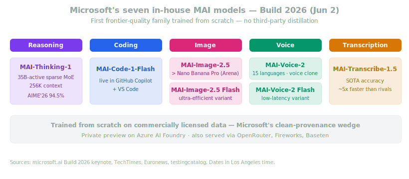
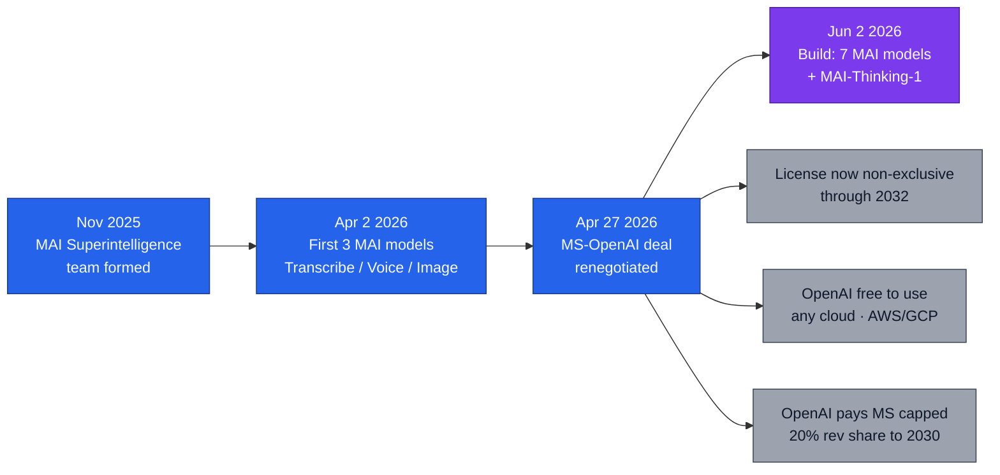
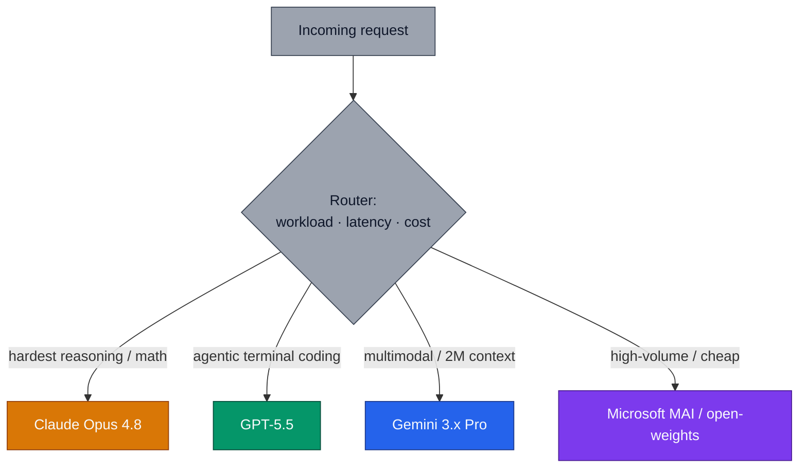

# LLM Updates — 2026-Jun-09

Tuesday brief, written Tue Jun 9 (Los Angeles time), the morning after
**WWDC 2026**. Yesterday's brief was a three-week consolidation framed
around the "big three" Western labs — Anthropic, Google, Apple. This
brief makes a correction and a sharpening:

1. **The consolidation under-weighted a fourth entrant.** A week before
   WWDC, at **Build 2026 (Jun 2)**, **Microsoft shipped seven in-house
   "MAI" models** — including **MAI-Thinking-1**, its first reasoning
   model, *trained from scratch with no third-party distillation*. The
   big story of the period is no longer a three-lab race; Microsoft is
   now a frontier *model-maker*, not just OpenAI's distribution arm.
2. **The two imminent forward signals got sharper, not resolved.**
   **Gemini 3.5 Pro** is still unshipped but its specs leaked in detail
   (2M context, Deep Think, ~$15/$60 pricing). **GPT-5.6** remains a
   Codex-log rumor with a ~Jun 30 prediction-market window.
3. **A theme crystallized: training-data provenance is now a product
   claim.** Microsoft's "no OpenAI data" framing turns the
   distillation-attack discourse of early 2026 into a marketing wedge.

This brief does **not** re-derive yesterday's items (Opus 4.8, the
Anthropic S-1 / $65B / ~$965B, Google I/O's Flash/Omni/Science, the
Gemini-powered Siri, MiniMax M3, Gated DeltaNet-2 / DASH, or Project
Glasswing). It extends the Microsoft thread and the two open forward
signals.

---

## 1. Microsoft becomes a model-maker — Build 2026 and the MAI seven

At **Build 2026 (Jun 2)**, Microsoft AI launched **seven first-party
models** under the **MAI** ("Microsoft AI") brand — its first serious
attempt to build and ship frontier-quality models without leaning on a
third-party lab
([Microsoft AI — Build 2026 keynote transcript](https://microsoft.ai/news/microsoft-build-2026-mai-keynote-transcript/),
[Microsoft AI — launching seven new MAI models](https://microsoft.ai/news/building-a-hillclimbing-machine-launching-seven-new-mai-models/),
[Euronews — Microsoft launches its own AI models to take on OpenAI and Anthropic](https://www.euronews.com/next/2026/06/03/microsoft-launches-its-own-ai-models-to-take-on-openai-and-anthropic),
[TechTimes — MAI-Thinking-1, trained without OpenAI data](https://www.techtimes.com/articles/317631/20260602/microsoft-build-2026-mai-thinking-1-first-house-reasoning-model-trained-without-openai-data.htm)).

The headline of the seven is **MAI-Thinking-1**, Microsoft's **first
in-house reasoning model**:

| Property | MAI-Thinking-1 |
| --- | --- |
| Architecture | sparse Mixture-of-Experts, **35B active** params |
| Context | **256K tokens** |
| Reasoning | **AIME 2025 97.0%**, **AIME 2026 94.5%** |
| Coding | matches **Claude Opus 4.6** on SWE-Bench Pro |
| Training data | **commercially licensed only — no third-party distillation** |
| Availability | private preview on **Azure AI Foundry**; also OpenRouter, Fireworks, Baseten |

The other six round the family into a full stack: **MAI-Code-1-Flash**
(already live in **GitHub Copilot** and **VS Code**),
**MAI-Image-2.5** + **MAI-Image-2.5 Flash** (Microsoft claims the 2.5
model passes **Nano Banana Pro** on the image Arena), **MAI-Voice-2** +
**MAI-Voice-2 Flash** (15 languages, voice-cloning from a short
sample), and **MAI-Transcribe-1.5** (pitched as SOTA accuracy at ~5×
the speed of rivals)
([MindStudio — Microsoft MAI models explained](https://www.mindstudio.ai/blog/microsoft-mai-models-explained-build-2026),
[testingcatalog — Build 2026 recap](https://www.testingcatalog.com/microsoft-build-2026-recap-from-windows-to-copilot-all-ai/)).

Three things make this more than a vendor refresh:

- **It is a *full* stack, not a single hero model.** Reasoning, coding,
  image, voice, and transcription in one launch is the shape of a lab
  that intends to *replace* a portfolio of external dependencies, not
  augment one of them.
- **The cost framing is the real weapon.** MAI chief **Mustafa
  Suleyman** said that after tuning for McKinsey, the models
  **outperformed GPT-5.5 on quality with a projected ~10× better cost
  efficiency** (his framing, extrapolated from public per-token
  pricing). MAI-Thinking-1 is explicitly positioned as *high efficiency
  at low token cost* — the same lane the open-weights wave and Opus
  4.8's cheaper fast mode are crowding into.
- **MAI-Code-1-Flash already ships inside the product.** It is live in
  GitHub Copilot and VS Code today — meaning Microsoft can route real
  developer traffic to a first-party model from day one, not "soon."

The benchmark caveat worth recording: MAI-Thinking-1's coding parity is
against **Opus 4.6** (a February model), and the AIME numbers are
company-reported in a **private preview**. This is a credible first
reasoning model, not yet a verified frontier #1 — and it is two Opus
releases behind the current top of the board (Opus 4.8, §4 of
yesterday's brief).

---

## 2. The decoupling — why Microsoft is building now

MAI is the visible output of a strategy that has been forming since
late 2025. The arc:

The pivot point is the **Apr 27, 2026 renegotiation** that removed
exclusivity from the ~$13B partnership: Microsoft's license to OpenAI
IP became **non-exclusive (running to 2032)**, OpenAI gained the right
to serve its products on **any cloud** (AWS, Google Cloud), OpenAI now
**pays Microsoft a capped 20% revenue share through 2030**, and
Microsoft **stopped paying OpenAI a revenue share**
([Startup Fortune — Microsoft is making OpenAI optional](https://startupfortune.com/microsoft-is-making-openai-optional-inside-its-ai-stack/),
[Crypto Briefing — Microsoft gains autonomy to pursue superintelligence](https://cryptobriefing.com/microsoft-openai-autonomy-superintelligence/),
[Tech-Insider — Microsoft MAI vs OpenAI](https://tech-insider.org/microsoft-mai-in-house-ai-models-openai-2026/)).

The dependency is not gone — reporting puts OpenAI at roughly **45% of
Microsoft's cloud backlog**, Microsoft still supplies most of OpenAI's
compute, and **GPT-5.4-class models still power the bulk of Copilot**.
But the *direction* is unambiguous: Build 2026 is the first conference
where Microsoft answered "what powers Copilot?" with "increasingly,
*us*." For procurement, the read is that **Copilot is becoming a
multi-model router** — first-party MAI on the cheap/high-volume lanes,
OpenAI frontier models on the hard ones — which is the same
lane-by-lane pattern now visible across the whole field (§5).

---

## 3. Provenance becomes a product claim

The single most repeated line in the MAI coverage is not a benchmark —
it is **"trained without OpenAI data"** and **"no distillation from
third-party models."** That framing is doing strategic work.

Early 2026 was defined by the **distillation-attack fight**: in
February, Anthropic accused **DeepSeek, Moonshot, and MiniMax** of
running industrial-scale distillation — **~24,000 fraudulent accounts**
generating **16M+ Claude exchanges** to train competing models — and
both Anthropic and OpenAI framed it as a national-security issue
([CNBC — Anthropic accuses DeepSeek, Moonshot, MiniMax](https://www.cnbc.com/2026/02/24/anthropic-openai-china-firms-distillation-deepseek.html),
[Anthropic — detecting and preventing distillation attacks](https://www.anthropic.com/news/detecting-and-preventing-distillation-attacks)).

Microsoft is now turning that discourse into a **sales position**: a
frontier-capable model whose *provenance* — commercially licensed data,
no scraping of a rival's outputs — is itself the differentiator. For an
enterprise buyer worried about IP indemnification and the legal
exposure of distilled lineage, "clean training data" is a procurement
checkbox, not a research footnote.

The honest counter-note: "no distillation" is currently an **unaudited
vendor claim**, exactly as the Chinese labs' denials were. The thing
that has changed is that provenance is now something a lab *advertises*
— a sign the 2026 market has priced legal/lineage risk into model
selection alongside capability and cost.

---

## 4. Gemini 3.5 Pro on the doorstep — leaked specs sharpen

Yesterday's #1 forward signal was a **June Gemini 3.5 Pro** launch
("the following month," per Pichai at I/O). It still has **not
shipped** — but the leaked spec sheet firmed up enough to plan against
([TechTimes — Gemini 3.5 Pro nears June launch: 2M context + Deep Think](https://www.techtimes.com/articles/317919/20260606/google-gemini-35-pro-nears-june-launch-2-million-token-context-deep-think-reasoning.htm),
[AI Weekly — Gemini 3.5 Pro eyes June GA with 2M context and Deep Think](https://aiweekly.co/alerts/gemini-35-pro-eyes-june-ga-with-2m-context-and-deep-think),
[WaveSpeed — what the Flash release already tells us](https://wavespeed.ai/blog/posts/gemini-3-5-pro-coming-next-month/)).

What's reported (all **expected/leaked**, not Google-confirmed):

- **2M-token context window** — double the typical 1M frontier ceiling,
  the differentiator for whole-codebase and long-document work.
- **Deep Think reasoning mode** — gated to **Ultra** ($250/mo)
  subscribers; the direct counter to Opus 4.8's reasoning lead.
- **Pricing ~10× Flash** — roughly **$15 / $60 per MTok**, putting it
  in Opus-4.8 ($5/$25) and GPT-5.5 territory at the high end.
- **Consumer-first rollout** — through the **$20 Pro** and **$250
  Ultra** tiers before broad API GA; Pichai's "wait another month" line
  at I/O reportedly drew groans.

The watch item is narrow: **does it beat Opus 4.8 on the aggregate
boards, or just on multimodal and long-context?** Gemini 3.1 Pro
already owns the multimodal lane (§5); a 3.5 Pro that takes the overall
#1 would be the first real challenge to Opus 4.8's three-week reign.

---

## 5. GPT-5.6 watch — still a log entry, not a launch

OpenAI has **not** announced GPT-5.6. The entire evidentiary basis
remains a single rollout-mapping entry in **Codex backend logs**
(surfaced before May 13, then scrubbed), plus three internal codenames —
**iris-alpha, ember-alpha, beacon-alpha** — and ChatGPT-Pro users
reporting behavior consistent with a **~1.5M-token context window**
(≈43% above GPT-5.5's documented 1M)
([TokenMix — GPT-5.6: Codex leaks, June odds, what's real](https://tokenmix.ai/blog/gpt-5-6-release-date-leaks-2026),
[WaveSpeed — GPT-5.6 canary leak](https://wavespeed.ai/blog/posts/gpt-5-6-canary-leak-what-we-know/),
[QCode — GPT-5.6 release tracker](https://qcode.cc/en/gpt-5-6-guide)).

Prediction markets price a **release before end of June at ~80–89%**
(Polymarket ~Jun 30). The three-codename pattern hints at more than the
5.5 / 5.5-Instant binary — possibly a flagship, a fast tier, and a
specialty third variant. **Everything beyond the log entry is
inference**; treat context-window and pricing numbers as unverified
until a system card exists.

---

## 6. Frontier snapshot, Jun 9

The board itself barely moved in 24 hours — the change is that the
*shape* of the field now clearly has a **fourth Western model-maker**
and is settling into a **routing era**, where teams run several models
behind a layer keyed to workload, latency, and cost rather than picking
one winner.

| Slot | Top model / state (Jun 9) | Δ vs. Jun 8 brief |
| --- | --- | --- |
| Frontier reasoning | **Claude Opus 4.8** (AA Index 61.4) | unchanged — still #1 |
| Frontier coding (SWE-Bench Pro) | **Claude Opus 4.8 (69.2%)** | unchanged |
| Agentic terminal coding | GPT-5.5 (Terminal-Bench 2.1) | unchanged |
| Multimodal | **Gemini 3.1 Pro** | clarified — wins AA multimodal lane |
| In-house enterprise reasoning | **Microsoft MAI-Thinking-1** | **new** — Build 2026, no-distillation |
| First-party coding (Copilot) | **MAI-Code-1-Flash** | **new** — live in Copilot + VS Code |
| Open-weight frontier | MiniMax M3 (1M ctx, MSA) | unchanged |
| Speed / cost tier | Gemini 3.5 Flash (GA) | unchanged |
| Frontier reasoning (queued) | **Gemini 3.5 Pro** — 2M ctx, Deep Think | **sharpened** — specs/pricing leaked |
| Next OpenAI model | **GPT-5.6** — ~1.5M ctx rumored | **sharpened** — ~Jun 30 odds, unconfirmed |
| Lab independence | **Microsoft decoupling from OpenAI** | **new** — non-exclusive deal + MAI stack |

---

## 7. Forward signals, Jun 9 – 30

- **Gemini 3.5 Pro GA.** Still the highest-confidence near event — a
  June launch was promised at I/O and the specs have leaked. Watch
  whether it takes the *overall* #1 from Opus 4.8 or only multimodal /
  long-context.
- **GPT-5.6.** Prediction markets ~80–89% for a June release (~Jun 30).
  A system card is the only thing that converts the Codex-log rumor
  into fact.
- **MiniMax M3 weights + technical report.** Promised within ten days
  of the Jun 1 launch (≈Jun 11) — the first independent reruns of its
  SWE-Bench Pro / BrowseComp claims.
- **MAI-Thinking-1 public preview.** It is private-preview today; a
  public Foundry GA (and independent benchmarking against Opus 4.8 /
  GPT-5.5, not Opus 4.6) is the test of whether the "10× cost
  efficiency" claim survives contact.
- **Anthropic IPO mechanics.** A confidential S-1 implies a possible
  public filing + roadshow in Q3; watch for an OpenAI liquidity-event
  counter.

---

## 8. Action set, Jun 9

**Model selection**
- **Add MAI to your evaluation set if you're on Azure / Copilot.**
  MAI-Code-1-Flash is already routable in Copilot + VS Code, and
  MAI-Thinking-1's pitch is reasoning at a fraction of frontier cost.
  Benchmark it against your *current* baseline (Opus 4.8 / GPT-5.5),
  not the Opus 4.6 it advertises parity with.
- **Design for routing, not for a single model.** Copilot is becoming a
  multi-model surface; build your own stack the same way — cheap
  in-house/open-weights on volume lanes, frontier models on the hard
  ones.

**Procurement / risk**
- **Treat training-data provenance as a real selection axis now.**
  Microsoft is selling "no distillation" as a feature; if IP
  indemnification matters to you, ask every vendor for their lineage
  posture in writing — but treat "clean data" as an unaudited claim
  until contractually backed.
- **If you're locked to OpenAI through Microsoft, re-read the new
  terms.** The Apr 27 non-exclusive renegotiation changes which models
  Microsoft is incentivized to route you to. Confirm your contract
  pins the model family you actually depend on.

**Timing**
- **Hold any new annual frontier commit ~2 weeks** if you can — Gemini
  3.5 Pro and (probably) GPT-5.6 both land this month, and either could
  reset the price/capability frontier you'd be locking against.

---

## Sources

Microsoft Build 2026 / MAI models
- [Microsoft AI — Build 2026 keynote transcript](https://microsoft.ai/news/microsoft-build-2026-mai-keynote-transcript/)
- [Microsoft AI — launching seven new MAI models](https://microsoft.ai/news/building-a-hillclimbing-machine-launching-seven-new-mai-models/)
- [TechTimes — MAI-Thinking-1, trained without OpenAI data](https://www.techtimes.com/articles/317631/20260602/microsoft-build-2026-mai-thinking-1-first-house-reasoning-model-trained-without-openai-data.htm)
- [Euronews — Microsoft launches its own AI models to take on OpenAI and Anthropic](https://www.euronews.com/next/2026/06/03/microsoft-launches-its-own-ai-models-to-take-on-openai-and-anthropic)
- [MindStudio — Microsoft MAI models explained](https://www.mindstudio.ai/blog/microsoft-mai-models-explained-build-2026)
- [testingcatalog — Build 2026 recap](https://www.testingcatalog.com/microsoft-build-2026-recap-from-windows-to-copilot-all-ai/)
- [Thurrott — Build 2026: Microsoft launches first flagship reasoning model](https://www.thurrott.com/a-i/336960/build-2026-microsoft-launches-first-flagship-reasoning-ai-model-and-more)

Microsoft–OpenAI decoupling
- [Startup Fortune — Microsoft is making OpenAI optional inside its AI stack](https://startupfortune.com/microsoft-is-making-openai-optional-inside-its-ai-stack/)
- [Crypto Briefing — Microsoft gains autonomy to pursue superintelligence](https://cryptobriefing.com/microsoft-openai-autonomy-superintelligence/)
- [Tech-Insider — Microsoft MAI in-house models vs OpenAI](https://tech-insider.org/microsoft-mai-in-house-ai-models-openai-2026/)
- [IndexBox — seven in-house models, reducing reliance on OpenAI](https://www.indexbox.io/blog/microsoft-unveils-seven-in-house-ai-models-at-build-2026-reducing-reliance-on-openai/)

Provenance / distillation context
- [CNBC — Anthropic accuses DeepSeek, Moonshot, MiniMax of distillation](https://www.cnbc.com/2026/02/24/anthropic-openai-china-firms-distillation-deepseek.html)
- [Anthropic — detecting and preventing distillation attacks](https://www.anthropic.com/news/detecting-and-preventing-distillation-attacks)
- [VentureBeat — 24,000 fake accounts, 16M exchanges](https://venturebeat.com/technology/anthropic-says-deepseek-moonshot-and-minimax-used-24-000-fake-accounts-to)

Gemini 3.5 Pro (leaked / expected)
- [TechTimes — Gemini 3.5 Pro nears June launch: 2M context + Deep Think](https://www.techtimes.com/articles/317919/20260606/google-gemini-35-pro-nears-june-launch-2-million-token-context-deep-think-reasoning.htm)
- [AI Weekly — Gemini 3.5 Pro eyes June GA with 2M context and Deep Think](https://aiweekly.co/alerts/gemini-35-pro-eyes-june-ga-with-2m-context-and-deep-think)
- [WaveSpeed — Gemini 3.5 Pro coming next month](https://wavespeed.ai/blog/posts/gemini-3-5-pro-coming-next-month/)
- [blog.google — Gemini 3.5: frontier intelligence with action](https://blog.google/innovation-and-ai/models-and-research/gemini-models/gemini-3-5/)

GPT-5.6 (rumored)
- [TokenMix — GPT-5.6: Codex leaks, June odds, what's real](https://tokenmix.ai/blog/gpt-5-6-release-date-leaks-2026)
- [WaveSpeed — GPT-5.6 canary leak, what we know](https://wavespeed.ai/blog/posts/gpt-5-6-canary-leak-what-we-know/)
- [QCode — GPT-5.6 release tracker](https://qcode.cc/en/gpt-5-6-guide)

Leaderboards / trackers
- [Artificial Analysis — LLM leaderboard](https://artificialanalysis.ai/leaderboards/models)
- [llm-stats — AI news today](https://llm-stats.com/ai-news)
- [Microsoft AI — news](https://microsoft.ai/news/)
