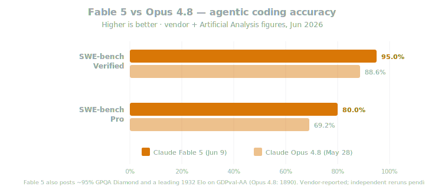
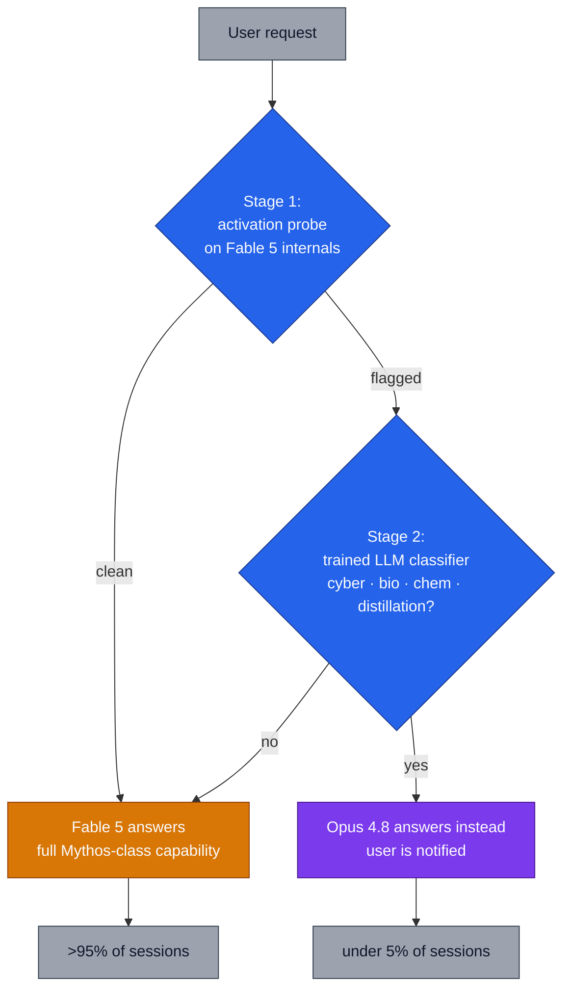
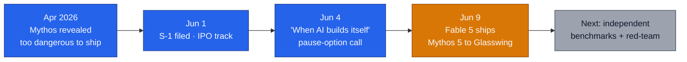

# LLM Updates — 2026-Jun-10

Wednesday brief, written Wed Jun 10 (Los Angeles time). The two prior
briefs covered the WWDC-week consolidation (Jun 8) and Microsoft's
arrival as a frontier model-maker with the MAI seven (Jun 9). This
brief is built around the single biggest release of the week, which
landed the evening of **Jun 9**:

1. **Anthropic took Mythos public.** It shipped **Claude Fable 5** — a
   *Mythos-class* model made "safe for general use" — alongside
   **Claude Mythos 5**, the same underlying model with some guardrails
   lifted, kept to vetted partners via **Project Glasswing**. Fable 5
   is now the most powerful model Anthropic has ever made generally
   available, and on the vendor numbers it is the new SOTA on nearly
   every board.
2. **The interesting part is the safety *mechanism*, not the score.**
   Fable 5 does not *refuse* in high-risk areas — it **reroutes** the
   query to **Opus 4.8** via a two-stage classifier, so >95% of
   sessions run on full Mythos-class capability and the rest silently
   downgrade. "Reroute, don't refuse" is the new technique to record.
3. **The timing is the story journalists are telling.** Fable 5 shipped
   **five days after** Anthropic's **Jun 4 "When AI builds itself"**
   report, which argued the industry should preserve the *option to
   pause* frontier development. Shipping its most powerful public model
   the same week reads, to critics, as a contradiction.

This brief does **not** re-derive earlier items: the Microsoft MAI
seven and the OpenAI decoupling (Jun 9 §1–3), the Opus 4.8 launch
itself (Jun 8 §1), the Project Glasswing *basics* and the original
unreleased Mythos (Jun 8 §7), or the Gemini-3.5-Pro / GPT-5.6 forward
signals — those are updated only where they moved (§6).

---

## 1. Claude Fable 5 — Mythos goes public

On **Jun 9**, Anthropic released **Claude Fable 5**, describing it as a
model whose capabilities "exceed those of any model Anthropic has ever
made generally available," with SOTA performance "on nearly all tested
benchmarks" across software engineering, knowledge work, vision, and
scientific research
([Anthropic — Claude Fable 5 and Claude Mythos 5](https://www.anthropic.com/news/claude-fable-5-mythos-5),
[VentureBeat — Anthropic brings Mythos to the masses](https://venturebeat.com/technology/anthropic-brings-mythos-to-the-masses-with-claude-fable-5-its-most-powerful-generally-available-model-ever),
[CNBC — Anthropic releases Mythos-like model to the public](https://www.cnbc.com/2026/06/09/anthropic-mythos-claude-fable-5.html)).

This is the resolution of the thread the Jun 8 brief flagged as a
*story, not a release*: **Claude Mythos** — the offensive-security
model that had surfaced 10,000+ high/critical vulnerabilities inside
Project Glasswing — was the model Anthropic had deemed too dangerous to
ship. Fable 5 is that capability, wrapped in safeguards and put on sale.

| Property | Claude Fable 5 |
| --- | --- |
| Relationship to Mythos | **Same underlying model** as Mythos 5; Fable = public build with safety classifiers active |
| SWE-bench Verified | **95.0%** |
| SWE-bench Pro | **~80%** (vs Opus 4.8's 69.2%) |
| GPQA Diamond | **~95%** |
| GDPval-AA | **1932 Elo** — #1 (Opus 4.8: 1890) |
| FrontierCode | **#1** |
| Context | **1M-token input**, up to **128K output** |
| Input modalities | text + image |
| Pricing | **$10 / $50 per MTok** (2× Opus 4.8's $5 / $25) |
| Agentic | "works for days" in Claude Code / Managed Agents — plans, delegates to sub-agents, self-checks |
| Availability | Claude Platform, **AWS Bedrock**, **Google Cloud**, **Microsoft Foundry**, **GitHub Copilot**, Harvey |

Two things stand out beyond the raw scores. First, the **price step**:
at $10/$50, Fable is *double* Opus 4.8 — Anthropic is positioning it as
a premium frontier tier, not a replacement for the cheaper Opus lane.
Second, the **day-one distribution**: it launched simultaneously across
all three hyperscaler clouds plus GitHub Copilot
([GitHub Changelog — Fable 5 GA for Copilot](https://github.blog/changelog/2026-06-09-claude-fable-5-is-generally-available-for-github-copilot/),
[AWS — Fable 5 on Bedrock](https://aws.amazon.com/blogs/aws/anthropic-claude-fable-5-on-aws-mythos-class-capabilities-with-built-in-safeguards-now-available/)).
That breadth is only possible *because* of the safeguard layer in §2 —
the clouds would not host an unguarded Mythos.

The standing caveat: every benchmark here is **vendor-reported at
launch**. GDPval-AA, FrontierCode, and the SWE-bench figures have not
yet had independent reruns. Treat Fable 5's "new #1" status as credible
but unconfirmed until the neutral aggregators (Artificial Analysis,
Vellum) post their own numbers.

---

## 2. The technique — "reroute, don't refuse"

The genuinely new engineering idea in this release is *how* Anthropic
made a Mythos-class model safe enough to put on three public clouds. It
is not a refusal-trained model. It is a **capability router with a
graceful fallback**
([claude5.ai — Fable 5 safety architecture](https://claude5.ai/en/blog/claude-fable-5-safety-architecture-explained),
[SecurityWeek — Mythos-class AI with cybersecurity guardrails](https://www.securityweek.com/anthropic-launches-claude-fable-5-mythos-class-ai-with-cybersecurity-guardrails/),
[DataCamp — Claude Fable 5: a Mythos-class model you can use](https://www.datacamp.com/blog/claude-fable-5)):

The flow:

- **Stage 1 — activation probe.** A lightweight probe watches Fable 5's
  internal activations across *all* traffic and cheaply flags anything
  that might touch a covered area.
- **Stage 2 — classifier.** Flagged requests escalate to a separately
  trained LLM classifier that makes the final call. Covered areas:
  **offensive cyber operations, advanced biology, chemistry**, and
  **model distillation / capability-extraction** attempts.
- **The fallback is the trick.** A triggered request is *not refused* —
  it is **answered by Claude Opus 4.8** instead, and the user is told.
  So a security engineer in legitimately sensitive territory still gets
  a strong answer, just without Mythos-class offensive depth.

Anthropic says the fallback fires in **fewer than 5% of sessions** on
average, so **>95% of usage runs on full Fable 5**, and calls the
classifiers "extremely difficult (though not impossible)" to bypass.

Why this matters beyond Anthropic: refusal-trained models pay an
"over-refusal tax" — they decline benign adjacent questions and
frustrate exactly the expert users who need them. **Reroute-to-a-weaker-model**
preserves a good user experience while removing the dangerous *delta*
between a frontier model and the runner-up. Expect other labs to copy
the pattern; it converts safety from a binary gate into a **capability
dial**.

---

## 3. Fable 5 vs Mythos 5 — the safety split

Fable and Mythos are the **same weights**. What differs is *which
guardrails are lifted* and *who is allowed in*
([Silverthread Labs — Fable 5 or Mythos 5: the difference is who you are](https://www.silverthreadlabs.com/blog/claude-fable-5-or-mythos-5),
[ITdaily — Mythos for the masses](https://itdaily.com/blogs/innovation/anthropic-claude-fable-5-mythos-5/),
[Lushbinary — Fable 5 vs Mythos 5 safeguards explained](https://lushbinary.com/blog/claude-fable-5-vs-mythos-5-safeguards-explained/)):

| | Who | Cyber safeguard | Bio / chem safeguard | Distillation guard |
| --- | --- | --- | --- | --- |
| **Fable 5** | general public, all clouds | **on** (reroutes to Opus 4.8) | **on** | on |
| **Mythos 5** | vetted Project Glasswing partners | **lifted** | on | on |
| **Bio trusted-access** (planned) | vetted biomedical researchers | on | **lifted** | on |

Existing Claude Mythos Preview holders (the Glasswing cybersecurity
partners from the Jun 8 brief) upgrade to **Mythos 5**. Anthropic also
says it will open a **trusted-access program for biology** — Fable 5
with the bio/chem guardrails removed but the cyber guardrail intact —
to accelerate biomedical research. The cyber guardrail is the one
Anthropic is least willing to lift broadly, which tells you where it
thinks the sharpest near-term risk sits.

---

## 4. The paradox — a pause call, then the most powerful public model

The framing dominating coverage is the **five-day gap**. On **Jun 4**,
Anthropic published **"When AI builds itself"** through the Anthropic
Institute, arguing that AI is now materially accelerating AI
development and that "it would be good for the world to have the option
to slow or temporarily pause frontier AI development"
([Anthropic — When AI builds itself](https://www.anthropic.com/institute/recursive-self-improvement),
[Scientific American — Anthropic warns AI may soon begin recursive self-improvement](https://www.scientificamerican.com/article/anthropic-warns-ai-may-soon-begin-recursive-self-improvement/)).

The report's headline metrics:

- **>80% of code merged into Anthropic's own codebase is now written by
  Claude** — up from low single digits before Claude Code shipped in
  early 2025.
- The typical engineer is merging **~8× as much code per day** as in
  2024 (a March internal poll of 130 researchers put the *median*
  self-reported uplift nearer **4×** — the honest, lower number).
- The proposed pause is **conditional and verifiable**: Anthropic says
  it would only slow if multiple well-resourced labs across multiple
  countries agreed under identical, checkable conditions.

Then, on **Jun 9**, it shipped Fable 5. Critics — TechCrunch, The
Register, NBC — read the sequence as: *warn that the technology is
getting too dangerous to race on, then release the most powerful model
you've ever sold to the public*
([TechCrunch — released days after warning AI is becoming too dangerous](https://techcrunch.com/2026/06/09/anthropic-released-claude-fable-5-its-most-powerful-model-publicly-days-after-warning-ai-is-getting-too-dangerous/),
[The Register — Anthropic spins a Fable of a tamer, safer Mythos](https://www.theregister.com/ai-and-ml/2026/06/09/anthropic-spins-a-fable-of-a-tamer-safer-mythos/),
[NBC News — Fable 5, public release of Mythos-class model](https://www.nbcnews.com/tech/security/fable-5-anthropic-release-public-mythos-claude-model-rcna349104)).

Anthropic's implicit answer is the §2 architecture: the pause proposal
is about *capability racing without brakes*, and Fable is the brake —
a frontier model shipped *with* the dangerous delta routed away. Whether
that reconciles the two depends entirely on whether the classifiers hold
up under adversarial pressure, which is precisely the part that is
"difficult (though not impossible)" to bypass and has not been
independently stress-tested. The honest read: this is a real
engineering answer to the safety/access tradeoff *and* a convenient
commercial one, and the two are not separable yet.

---

## 5. Why the clouds said yes

The fact that Fable 5 launched simultaneously on AWS Bedrock, Google
Cloud, Microsoft Foundry, and GitHub Copilot is itself a signal. A
frontier offensive-security model is exactly what a hyperscaler's risk
team would normally block. The §2 reroute layer is what made the
distribution legally and reputationally tractable: the clouds are
hosting **Fable** (guarded), never raw **Mythos**, and the most
dangerous queries are answered by the already-vetted Opus 4.8.

This is the same **routing-era** pattern the Jun 9 brief flagged for
Microsoft's Copilot — except here the router lives *inside one model
family* and is keyed to **risk**, not cost or latency. Procurement
implication: when you adopt Fable 5, you are also implicitly adopting
Opus 4.8 as your fallback tier, whether or not you provisioned it. Plan
your rate limits and billing for both.

---

## 6. Forward signals — what moved, what didn't

| Signal | State on Jun 10 | Δ vs Jun 9 |
| --- | --- | --- |
| **Gemini 3.5 Pro GA** | Still **not shipped**; "next month" promise from I/O, 2M ctx + Deep Think, ~$15/$60 leaked | unchanged — still pending |
| **GPT-5.6** | Still **unconfirmed**; Codex-log rumor, ~Jun 30 prediction-market window (~80–89%) | unchanged |
| **MiniMax M3 weights + report** | Promised within ten days of the Jun 1 launch (**≈Jun 11**) — independent reruns begin then | imminent — watch tomorrow |
| **Fable 5 independent benchmarks** | Vendor numbers only so far | **new** — neutral reruns are the next test |
| **Fable 5 classifier red-teaming** | "difficult, not impossible" per Anthropic; no external audit yet | **new** — the safety claim to verify |

The near-term watch order is tight: **MiniMax M3's weights drop (~Jun
11)** is the next dated event, and it will be the first chance to
independently rerun an open-weight frontier claim. After that, the two
big proprietary launches (Gemini 3.5 Pro, GPT-5.6) both still sit
inside June.

---

## 7. Frontier snapshot, Jun 10

| Slot | Top model / state (Jun 10) | Δ vs Jun 9 brief |
| --- | --- | --- |
| Frontier reasoning / knowledge | **Claude Fable 5** (vendor SOTA) | **new #1** — pending independent reruns |
| Frontier coding (SWE-bench Pro) | **Claude Fable 5 (~80%)** | **new** — passes Opus 4.8's 69.2% |
| Prior frontier (now fallback tier) | **Claude Opus 4.8** | reframed — Fable's safety-reroute target |
| Restricted offensive-security | **Claude Mythos 5** (Glasswing only) | **new** — Mythos line versioned to 5 |
| Multimodal | Gemini 3.1 Pro | unchanged |
| In-house enterprise reasoning | Microsoft MAI-Thinking-1 | unchanged (Jun 9) |
| Open-weight frontier | MiniMax M3 (1M ctx, MSA) | weights/report ~Jun 11 |
| Frontier reasoning (queued) | **Gemini 3.5 Pro** — 2M ctx, Deep Think | unchanged — still unshipped |
| Next OpenAI model | **GPT-5.6** — ~1.5M ctx rumored | unchanged — ~Jun 30 odds |

The board's *shape* changed in one specific way: Anthropic now occupies
**two adjacent rungs** — Fable 5 at the top and Opus 4.8 one step down
as its own safety fallback — plus a third, restricted Mythos 5 rung that
the public cannot reach. The "single frontier #1" is, for now, an
Anthropic model gating a quieter Anthropic model.

---

## 8. Action set, Jun 10

**Model selection**
- **Pilot Fable 5 on your hardest agentic and coding work**, but
  benchmark it against *your* Opus 4.8 baseline — at 2× the price, the
  case has to be made on tasks where the capability delta is real
  (long-horizon agents, SWE-bench-Pro-style work), not on everything.
- **Budget for the fallback.** Adopting Fable 5 means Opus 4.8 answers
  your flagged <5% of sessions. Provision and price for both tiers, and
  log when the reroute fires so you can see what's tripping it.

**Risk / governance**
- **If you do security or life-sciences work, expect reroutes.** Benign
  expert queries in cyber/bio/chem will sometimes drop to Opus 4.8.
  Decide whether you need the **Glasswing (Mythos 5)** or the planned
  **biology trusted-access** program, and start the vetting conversation
  now — broad access to the unguarded model is gated and slow.
- **Treat the safety claim as unverified until red-teamed.** "Difficult,
  not impossible" to bypass is Anthropic's own framing; don't assume the
  classifiers are airtight for compliance purposes until an external
  audit exists.

**Timing**
- **The next 48 hours are eventful:** MiniMax M3's weights (~Jun 11)
  enable the first independent open-weight frontier rerun, and Fable 5's
  neutral-aggregator numbers should start landing. Hold any "Fable 5 is
  the new #1" procurement decision until at least one independent board
  confirms the vendor scores.
- **The June pile-up still stands** — Gemini 3.5 Pro and (probably)
  GPT-5.6 land this month. A new annual frontier commit can reasonably
  wait two more weeks.

---

## Sources

Claude Fable 5 / Mythos 5 (release)
- [Anthropic — Claude Fable 5 and Claude Mythos 5](https://www.anthropic.com/news/claude-fable-5-mythos-5)
- [Anthropic — Claude Fable](https://www.anthropic.com/claude/fable)
- [VentureBeat — Anthropic brings Mythos to the masses](https://venturebeat.com/technology/anthropic-brings-mythos-to-the-masses-with-claude-fable-5-its-most-powerful-generally-available-model-ever)
- [CNBC — Anthropic releases Mythos-like model to the public](https://www.cnbc.com/2026/06/09/anthropic-mythos-claude-fable-5.html)
- [TechTimes — most powerful public model, gated by safeguards](https://www.techtimes.com/articles/318082/20260609/anthropic-launches-claude-fable-5-most-powerful-public-model-gated-safeguards.htm)
- [MangoMind — Fable 5 benchmarks: ~80% SWE-bench Pro, $10/M](https://www.mangomindbd.com/blog/claude-fable-5-benchmarks)
- [llm-stats — Claude Fable 5 review, benchmarks, pricing](https://llm-stats.com/blog/research/claude-fable-5-review)

Safeguard architecture ("reroute, don't refuse")
- [claude5.ai — Fable 5 safety architecture: classifiers & fallback](https://claude5.ai/en/blog/claude-fable-5-safety-architecture-explained)
- [SecurityWeek — Mythos-class AI with cybersecurity guardrails](https://www.securityweek.com/anthropic-launches-claude-fable-5-mythos-class-ai-with-cybersecurity-guardrails/)
- [CSO Online — Mythos-class Fable 5 with safeguards for cyber risks](https://www.csoonline.com/article/4183094/anthropic-releases-mythos-class-fable-5-model-with-safeguards-for-cyber-risks.html)
- [DataCamp — Claude Fable 5: a Mythos-class model you can use](https://www.datacamp.com/blog/claude-fable-5)

Fable vs Mythos split
- [Silverthread Labs — Fable 5 or Mythos 5: the difference is who you are](https://www.silverthreadlabs.com/blog/claude-fable-5-or-mythos-5)
- [ITdaily — Mythos for the masses](https://itdaily.com/blogs/innovation/anthropic-claude-fable-5-mythos-5/)
- [Lushbinary — Fable 5 vs Mythos 5 safeguards explained](https://lushbinary.com/blog/claude-fable-5-vs-mythos-5-safeguards-explained/)

The pause paradox
- [Anthropic — When AI builds itself](https://www.anthropic.com/institute/recursive-self-improvement)
- [Scientific American — Anthropic warns AI may soon begin recursive self-improvement](https://www.scientificamerican.com/article/anthropic-warns-ai-may-soon-begin-recursive-self-improvement/)
- [TechCrunch — released days after warning AI is becoming too dangerous](https://techcrunch.com/2026/06/09/anthropic-released-claude-fable-5-its-most-powerful-model-publicly-days-after-warning-ai-is-getting-too-dangerous/)
- [The Register — Anthropic spins a Fable of a tamer, safer Mythos](https://www.theregister.com/ai-and-ml/2026/06/09/anthropic-spins-a-fable-of-a-tamer-safer-mythos/)
- [NBC News — Fable 5, public release of Mythos-class model](https://www.nbcnews.com/tech/security/fable-5-anthropic-release-public-mythos-claude-model-rcna349104)

Availability
- [GitHub Changelog — Fable 5 GA for Copilot](https://github.blog/changelog/2026-06-09-claude-fable-5-is-generally-available-for-github-copilot/)
- [AWS — Fable 5 on Bedrock with built-in safeguards](https://aws.amazon.com/blogs/aws/anthropic-claude-fable-5-on-aws-mythos-class-capabilities-with-built-in-safeguards-now-available/)
- [Harvey — Fable 5 now available](https://www.harvey.ai/blog/fable-5-now-available-in-harvey)

Forward signals (updated)
- [TechTimes — Gemini 3.5 Pro nears June launch: 2M context + Deep Think](https://www.techtimes.com/articles/317919/20260606/google-gemini-35-pro-nears-june-launch-2-million-token-context-deep-think-reasoning.htm)
- [TokenMix — GPT-5.6: Codex leaks, June odds, what's real](https://tokenmix.ai/blog/gpt-5-6-release-date-leaks-2026)
- [MarkTechPost — MiniMax M3 with MSA, 1M context](https://www.marktechpost.com/2026/06/01/minimax-releases-minimax-m3-with-msa-architecture-supporting-1m-token-context-native-multimodality-and-agentic-coding/)

Leaderboards / trackers
- [Artificial Analysis — LLM leaderboard](https://artificialanalysis.ai/leaderboards/models)
- [llm-stats — AI news today](https://llm-stats.com/ai-news)
- [Anthropic — news](https://www.anthropic.com/news)
