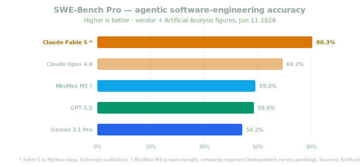
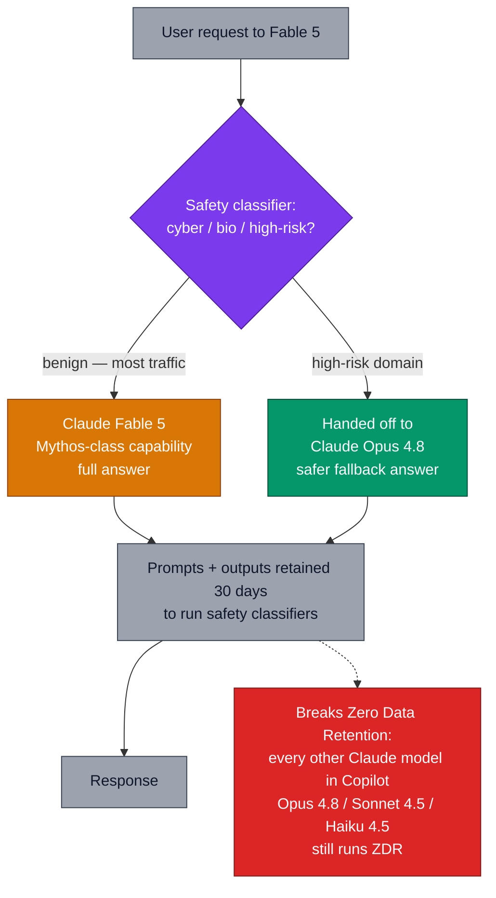
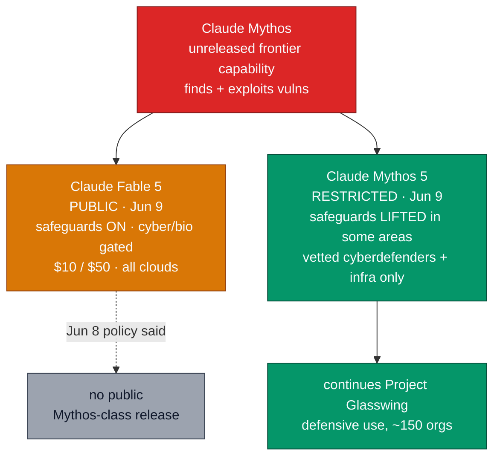
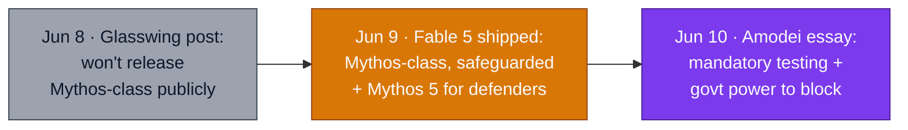
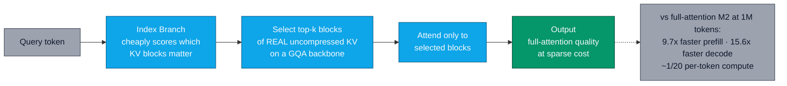

# LLM Updates — 2026-Jun-11

Thursday brief, written Thu Jun 11 (Los Angeles time). The last two
briefs framed the field as a **routing era** with a new fourth Western
model-maker (Microsoft MAI, Jun 9) and a frontier board led by **Claude
Opus 4.8**. Both of those readings just aged in 48 hours, because the
single biggest move of the week is one neither brief saw coming:

1. **Anthropic crossed its own line.** On **Jun 8** its Project
   Glasswing post said it **would not release Mythos-class models
   publicly**. On **Jun 9** it released one — **Claude Fable 5**, "the
   first generally available Mythos-class model" — plus a contained
   **Claude Mythos 5** for vetted defenders. Fable 5 launched **#1 on
   the Artificial Analysis Intelligence Index (64.9)**, displacing Opus
   4.8 at the top of the board it held for less than two weeks.
2. **The safeguards *are* the product.** Fable 5 ships with a new
   architecture: high-risk cyber/bio queries are silently **handed off
   to Opus 4.8**, and — uniquely — the model **breaks Zero Data
   Retention**, holding prompts/outputs 30 days to run safety
   classifiers. That is a procurement fact, not a footnote.
3. **The CEO asked to be regulated the next morning.** On **Jun 10**,
   one day after shipping its most capable public model, **Dario
   Amodei** published *"Policy on the AI Exponential,"* calling for
   **mandatory third-party testing** and **government power to block**
   frontier deployments — the most aggressive framework any major-lab
   CEO has backed.
4. **The open-weights counter-move resolved on schedule.** **MiniMax
   M3's weights + technical report** landed (~**Jun 11**), making the
   **MSA** sparse-attention architecture inspectable for the first time.

This brief does **not** re-derive the Jun 9 items (the seven MAI
models, MAI-Thinking-1, the Microsoft–OpenAI decoupling, the
provenance-as-product-claim thread) or the Jun 8 items (Opus 4.8's
launch numbers, the Anthropic S-1 / $65B / ~$965B, Google I/O, the
Gemini-powered Siri). It picks up the **Mythos thread** the Jun 8 brief
left open and the **MiniMax M3 weights** the Jun 9 brief flagged as due
today.

---

## 1. Claude Fable 5 — a Mythos-class model goes public

On **Jun 9**, Anthropic released **Claude Fable 5**, which it calls its
**first generally available Mythos-class model** — a tier *above* the
Opus line — and "**state-of-the-art on nearly all tested benchmarks**"
([Anthropic — Claude Fable 5 and Claude Mythos 5](https://www.anthropic.com/news/claude-fable-5-mythos-5),
[TechCrunch — Fable 5 is a version of Mythos the public can access today](https://techcrunch.com/2026/06/09/anthropics-claude-fable-5-is-a-version-of-mythos-the-public-can-access-today/),
[CNBC — Anthropic releases Mythos-like model to the public](https://www.cnbc.com/2026/06/09/anthropic-mythos-claude-fable-5.html),
[Tom's Hardware — Fable 5 brings Mythos to the masses](https://www.tomshardware.com/tech-industry/artificial-intelligence/claude-fable-5-brings-mythos-to-the-masses-anthropics-next-frontier-model-is-state-of-the-art-on-nearly-all-tested-benchmarks)).

The numbers are a clear step over Opus 4.8 — the model the Jun 8 brief
crowned #1 less than two weeks earlier:

| Benchmark | **Fable 5** | Opus 4.8 | Δ |
| --- | --- | --- | --- |
| AA Intelligence Index | **64.9 (#1)** | 61.4 | +3.5, new top |
| SWE-Bench Verified | **95.0%** | 88.6% | +6.4 |
| SWE-Bench Pro | **80.3%** | 69.2% | +11.1 |
| FrontierCode Diamond | **29.3%** | 13.4% | **2.2×** |

At **64.9** on the Artificial Analysis Intelligence Index, Fable 5
launched **~5 points ahead of the closest non-Anthropic model
(GPT-5.5)**, with Anthropic now holding **both** of the top two slots
([Artificial Analysis — Fable 5 launches at #1 on the Intelligence Index](https://artificialanalysis.ai/articles/claude-fable-5-mythos-intelligence-index)).
The **FrontierCode Diamond** result — more than double Opus 4.8 on the
hardest coding subset — is the one that matters most: it is the gap that
shows up on genuinely novel, long-horizon engineering, not the saturated
easy benchmarks.

**Specs and economics:**

- **Context** 1M tokens, up to **128K output tokens**.
- **Pricing $10 / $50 per MTok** — a **2× premium over Opus 4.8**
  ($5/$25), but Anthropic positions it at **roughly half the price of
  the earlier Mythos Preview** (~$20/$100)
  ([news.bitcoin.com — Fable 5 at half the price of Mythos Preview](https://news.bitcoin.com/anthropic-launches-claude-fable-5-at-half-the-price-of-mythos-preview-benchmarks-top-all-rivals/)).
- **Availability, day one:** Claude API, **AWS / Amazon Bedrock**,
  **Google Vertex AI**, **Microsoft Foundry**, and **GitHub Copilot**
  (Pro+, Max, Business, Enterprise) — a simultaneous all-cloud launch
  ([AWS — Fable 5 on Bedrock, the first GA Mythos-class model](https://aws.amazon.com/blogs/aws/anthropic-claude-fable-5-on-aws-mythos-class-capabilities-with-built-in-safeguards-now-available/),
  [Azure — Fable 5 available today in Microsoft Foundry](https://azure.microsoft.com/en-us/blog/claude-fable-5-available-today-in-microsoft-foundry-powering-the-next-era-of-autonomous-agents/),
  [GitHub Changelog — Fable 5 GA for Copilot](https://github.blog/changelog/2026-06-09-claude-fable-5-is-generally-available-for-github-copilot/)).

The capability that put Fable 5 on social media was **long-horizon
autonomy**: ordinary subscribers reported shipping a **playable
Minecraft-style voxel game** — multiple biomes, day/night cycle, ores,
caves, sound — from a **single prompt in ~20 minutes**, with end-to-end
plan→code→test→debug sessions running **20–55 minutes** and costing
**~$30** in tokens
([tweaktown — Fable built Minecraft for under $50](https://www.tweaktown.com/news/112130/anthropics-latest-ai-model-claude-fable-just-built-minecraft-for-less-than-dollars50/index.html),
[explainx.ai — Fable 5 creates Minecraft clones & 3D worlds from prompts](https://www.explainx.ai/blog/claude-fable-5-minecraft-3d-worldbuilding-2026),
[digitaltoday — Fable 5 from game building to 12-hour runs](https://www.digitaltoday.co.kr/en/view/62019/anthropics-claude-fable-5-sets-new-benchmark-from-game-building-to-12-hour-runs)).
The "Fable" branding nods at creative work, but the headline use is the
same one Opus 4.8 won on: **autonomous software engineering**, now a
capability tier higher.

---

## 2. The safeguards are the architecture — and a ZDR break

What makes Fable 5 different from a normal flagship bump is *how*
Anthropic made a Mythos-class model safe enough to sell. The safety
layer is not a system prompt — it is a routing-and-retention
architecture that changes the deployment contract.

Two design choices have direct operational consequences:

- **Capability-gated fallback.** Queries that trip the cyber/bio/high-
  risk classifier are **answered by Opus 4.8 instead of Fable 5** — the
  model degrades to the previous tier on sensitive topics rather than
  refusing. This is the mechanism Anthropic uses to claim a Mythos-class
  model can be "broadly released": the dangerous capability is present
  but **gated behind a classifier that swaps the model out** under it
  ([CNBC — Fable 5 hands some queries to Opus 4.8](https://www.cnbc.com/2026/06/09/anthropic-mythos-claude-fable-5.html),
  [The Hacker News — Fable 5 with cyber safeguards](https://thehackernews.com/2026/06/anthropic-releases-claude-fable-5-its.html)).
- **Mandatory 30-day data retention — ZDR is off.** To run those
  classifiers, Anthropic **retains prompts and outputs for up to 30
  days**. In GitHub Copilot this is called out explicitly: Fable 5
  **requires data retention**, while **every other Claude model there
  (Opus 4.8, Sonnet 4.5, Haiku 4.5) keeps Zero Data Retention**
  ([Coursiv — Fable 5 in Copilot: billing & data retention](https://coursiv.io/blog/claude-fable-5-github-copilot)).
  For any team whose contract or compliance posture *depends* on ZDR,
  this is a hard gate: you cannot adopt Fable 5 without renegotiating
  the data-handling terms you may have signed for the rest of the Claude
  line.

The pattern worth naming: **2026's most capable public model is the
first one you cannot run privately by default.** Capability and
data-exposure moved together — the inverse of the usual "more
capability, same contract" upgrade.

---

## 3. The Glasswing reversal — and Mythos 5 for defenders

This release directly resolves — and partly contradicts — the **Project
Glasswing** thread the Jun 8 brief flagged (§7 of that brief). One week
ago the stated policy was unambiguous: *Anthropic will not release
Mythos-class models publicly, citing insufficient safeguards.* On Jun 9
it released one. The reconciliation is the safeguard architecture in §2
plus a **two-SKU split**:

- **Claude Mythos 5** is, per Anthropic, **the same underlying model as
  Fable 5 with the safeguards lifted in some areas**, released *only* to
  a small group of **cyberdefenders and critical-infrastructure
  providers** — the continuation of Glasswing, now on a named, numbered
  model
  ([platform.claude.com — Introducing Fable 5 and Mythos 5](https://platform.claude.com/docs/en/about-claude/models/introducing-claude-fable-5-and-claude-mythos-5),
  [AI Magazine — what happens when Mythos-class models go public](https://aimagazine.com/news/fable-5-and-mythos-5-anthropics-mythos-class-models-explained)).
- The honest read: the Jun 8 "we won't release it" framing was about the
  **unsafeguarded** model. Anthropic's position is now that **the
  classifier-gated Fable 5 is a different artifact** from the raw
  capability. Whether that distinction survives **red-teaming of the
  gate itself** — can the fallback be jailbroken back into Mythos-level
  behavior? — is the open safety question, and the reason the 30-day
  retention exists at all.

The competitive subtext from the Jun 8 brief still holds: Anthropic
warned that **rivals will reach Mythos-class capability within 6–12
months and may not withhold it.** Shipping Fable 5 with a safeguard
architecture is Anthropic trying to **set the template for how a
dangerous-capability model gets sold** before someone ships one without
one.

---

## 4. "Policy on the AI Exponential" — asking to be regulated, one day later

The timing is the story. On **Jun 10**, *one day after* shipping its
most capable public model, Dario Amodei published **"Policy on the AI
Exponential,"** Anthropic's most aggressive regulatory ask to date
([SiliconANGLE — Amodei wants governments able to block dangerous AI](https://siliconangle.com/2026/06/10/anthropics-dario-amodei-wants-governments-power-block-dangerous-ai-systems/),
[Crypto Briefing — Amodei backs mandatory AI testing](https://cryptobriefing.com/anthropic-amodei-mandatory-ai-testing/),
[beincrypto — Amodei demands power to block unsafe AI a day after Fable 5](https://beincrypto.com/dario-amodei-ai-policy-essay/),
[Let's Data Science — Anthropic CEO calls for mandatory testing + deployment blocks](https://letsdatascience.com/news/anthropic-ceo-calls-for-mandatory-testing-and-deployment-blo-ba117fa2)).

The proposal:

- **Mandatory third-party testing** for any model above a **compute
  threshold**, across **four risk areas**: cybersecurity, biological
  weapons, loss of control, and **automated R&D** that could accelerate
  the other three.
- **Government power to block** deployments that fail the audit — not
  just disclose, *block*.
- A shift Anthropic names explicitly: from its prior **transparency-
  first** stance ("publish your safety procedures and results") to
  **binding enforcement**, because "transparency alone no longer matches
  the risks."
- It is **more aggressive than the voluntary 30-day review** in the
  early-June White House executive order.

Read uncharitably, it is a lab shipping the capability and *then* asking
the government to police it. Read on Anthropic's terms, it is internally
consistent: **release the safeguarded version, demonstrate the gate
works, and argue the whole industry should be forced to clear the same
bar** — including the rivals it expects to reach Mythos-class within the
year (§3). Either way, the **compute-threshold + four-area** structure
is now the concrete reference framework the policy debate will anchor
to, and the **"automated R&D"** axis is the novel one — a lab formally
naming recursive self-improvement as a regulated risk category
([Anthropic — When AI builds itself](https://www.anthropic.com/institute/recursive-self-improvement)).

---

## 5. MiniMax M3 — weights and the MSA report land on schedule

The Jun 8/9 briefs flagged **MiniMax M3's weights + technical report**
as due **within ten days of the Jun 1 launch (~Jun 11)**. They landed on
schedule, turning the open-weights frontier's headline claims from
vendor assertions into something the community can inspect and rerun
([byteiota — MiniMax M3 open-weight model drops June 11](https://byteiota.com/minimax-m3-open-weight-frontier-model/),
[MarkTechPost — MiniMax M3 with MSA, 1M context, native multimodality](https://www.marktechpost.com/2026/06/01/minimax-releases-minimax-m3-with-msa-architecture-supporting-1m-token-context-native-multimodality-and-agentic-coding/),
[MiniMax — official M3 research post](https://www.minimax.io/blog/minimax-m3)).

The release makes **MSA (MiniMax Sparse Attention)** the most
inspectable of the 2026 sparse/linear-attention contenders — the same
horse race the Jun 8 brief tracked through Gated DeltaNet-2 and DASH.
MSA's design is distinctive:

- Unlike compressed-attention approaches, MSA does **block-level
  selection on *real, uncompressed* key-values** over a standard **GQA**
  backbone — an **Index Branch** cheaply scores which KV blocks matter,
  then the model attends only to the selected blocks, with KV blocks
  read **contiguously** for hardware friendliness.
- The payoff is throughput at length: **9.7× faster prefill** and
  **15.6× faster decode at 1M tokens** versus the full-attention M2
  generation, at roughly **1/20th the per-token compute**
  ([VentureBeat — MiniMax teases M3, 15.6× long-context speed boost](https://venturebeat.com/technology/minimax-teases-upcoming-m3-model-with-new-sparse-attention-mechanism-and-15-6x-response-speed-boost),
  [Lushbinary — M3 benchmarks, pricing, MSA architecture](https://lushbinary.com/blog/minimax-m3-developer-guide-benchmarks-pricing-msa-architecture/)).

**Verification status, honestly:** M3's headline **59.0% SWE-Bench Pro**
(above GPT-5.5 and Gemini 3.1 Pro, near Opus 4.7) was measured **on
MiniMax's own infrastructure** with Claude Code / Mini-SWE-Agent
scaffolding, and as of release it had **not yet appeared on independent
boards** (e.g. DeepSWE). The long-horizon demo — **reproducing an ICLR
2025 paper's experiments over ~12 hours, 18 commits, 23 figures** — is a
capability demonstration, not a controlled eval. With weights now public,
**the next few days of independent reruns are the real test**
([TechTimes — M3 frontier claims, unverified benchmarks](https://www.techtimes.com/articles/317532/20260601/minimax-m3-open-weight-coding-model-frontier-claims-unverified-benchmarks.htm),
[Medium / Cogni Down Under — I evaluated M3 for agentic workflows](https://medium.com/@cognidownunder/i-evaluated-minimax-m3-for-agentic-workflows-the-results-are-complicated-518b60d5e6a9)).
One caveat carried from the M2.7 release: **check the license** — prior
MiniMax weights shipped under a "Modified-MIT" that restricted
commercial use without written authorization.

---

## 6. Frontier snapshot, Jun 11

The top of the board changed hands for the first time since May 28 — and
the new leader comes with a deployment contract unlike any prior
flagship.

| Slot | Top model / state (Jun 11) | Δ vs. Jun 9 brief |
| --- | --- | --- |
| Frontier overall (AA Index) | **Claude Fable 5 (64.9)** | **new #1** — displaces Opus 4.8 (61.4) |
| Frontier coding (SWE-Bench Pro) | **Claude Fable 5 (80.3%)** | **new** — +11 over Opus 4.8 |
| Hardest coding (FrontierCode Diamond) | **Fable 5 (29.3%)** | **new** — 2.2× Opus 4.8 |
| Previous flagship | Claude Opus 4.8 (now the safe-fallback tier) | role change — Fable 5's gate target |
| Restricted defensive frontier | **Claude Mythos 5** (safeguards lifted) | **new** — vetted defenders only |
| Agentic terminal coding | GPT-5.5 (Terminal-Bench 2.1) | unchanged — still its lane |
| In-house enterprise reasoning | Microsoft MAI-Thinking-1 | unchanged (Jun 9) |
| Open-weight frontier | **MiniMax M3** — weights + MSA report **now public** | **resolved** — was "due ~Jun 11" |
| Frontier reasoning (queued) | **Gemini 3.5 Pro** — 2M ctx, Deep Think | unchanged — still unshipped |
| Next OpenAI model | **GPT-5.6** — rumored ~Jun 30 | unchanged — still a Codex-log rumor |
| Policy frame | **Mandatory-testing + block-power proposal** | **new** — Amodei, Jun 10 |
| Deployment norm | **First flagship that breaks ZDR by default** | **new** — Fable 5 30-day retention |

---

## 7. Forward signals, Jun 11 – 30

- **Independent Fable 5 red-teaming.** The whole "safeguarded
  Mythos-class" thesis rests on the cyber/bio **classifier gate**. Watch
  for the first credible report of the gate being bypassed back into
  Mythos-level behavior — that, not a benchmark, is what would reset the
  safety conversation.
- **Independent MiniMax M3 reruns.** Weights are public as of ~Jun 11;
  the first third-party SWE-Bench Pro / long-context numbers (and a
  license read) will confirm or deflate the "beats GPT-5.5 at 5–10% of
  cost" framing.
- **Gemini 3.5 Pro GA.** Still unshipped, still promised for June (2M
  context, Deep Think, ~$15/$60). It is now chasing **Fable 5's 64.9**,
  not Opus 4.8's 61.4 — a higher bar than it was aimed at a week ago.
- **GPT-5.6.** Unchanged: a Codex-log rumor with ~Jun 30 prediction-
  market odds and no system card. A real launch would test whether
  OpenAI answers Fable 5 on capability or on price.
- **Policy follow-through.** Whether any legislature picks up Anthropic's
  **compute-threshold + four-area mandatory-testing** structure — or
  whether rival labs publicly reject it — is the Jun-10 essay's real
  test.

---

## 8. Action set, Jun 11

**Model selection**
- **Re-baseline the top of your stack on Fable 5** for the hardest
  reasoning/coding work — it is a clear step over Opus 4.8 on SWE-Bench
  Pro and FrontierCode Diamond. But price it as a **2× ($10/$50) tier**:
  reserve it for the tasks where Opus 4.8 actually falls short, and keep
  Opus 4.8 as the volume default.
- **Treat Opus 4.8 as the new "safe tier," not the frontier.** It is now
  literally the model Fable 5 falls back to on gated topics — which is a
  fine reason to keep it as your default and escalate to Fable 5
  selectively.

**Compliance / data handling (do this before adopting Fable 5)**
- **Fable 5 breaks Zero Data Retention.** It retains prompts/outputs 30
  days for safety classifiers, while the rest of the Claude line keeps
  ZDR. If you have contractual or regulatory ZDR requirements, **Fable 5
  is gated behind a data-handling review** — confirm the terms before
  routing any sensitive workload to it, including via Copilot.

**Open-weights**
- **Re-test MiniMax M3 now that weights are public** if you self-host —
  1M context + native multimodal + MSA's long-context throughput is a
  rare combination, but **wait for independent reruns** before trusting
  the 59.0% SWE-Bench Pro figure, and **read the license** before any
  commercial use.

**Policy / risk**
- **The mandatory-testing proposal is a planning input.** If you build
  on frontier models above the likely compute threshold, a
  third-party-testing + deployment-block regime is now the framework
  being lobbied for. Track it the way you'd track any pending
  obligation — and assume "ship-then-safeguard" releases like Fable 5
  are the near-term norm.

---

## Sources

Claude Fable 5 / Mythos 5
- [Anthropic — Claude Fable 5 and Claude Mythos 5](https://www.anthropic.com/news/claude-fable-5-mythos-5)
- [platform.claude.com — Introducing Claude Fable 5 and Claude Mythos 5](https://platform.claude.com/docs/en/about-claude/models/introducing-claude-fable-5-and-claude-mythos-5)
- [TechCrunch — Fable 5 is a version of Mythos the public can access today](https://techcrunch.com/2026/06/09/anthropics-claude-fable-5-is-a-version-of-mythos-the-public-can-access-today/)
- [CNBC — Anthropic releases Mythos-like model to the public](https://www.cnbc.com/2026/06/09/anthropic-mythos-claude-fable-5.html)
- [Tom's Hardware — Fable 5 brings Mythos to the masses](https://www.tomshardware.com/tech-industry/artificial-intelligence/claude-fable-5-brings-mythos-to-the-masses-anthropics-next-frontier-model-is-state-of-the-art-on-nearly-all-tested-benchmarks)
- [The Hacker News — Fable 5 with cyber safeguards](https://thehackernews.com/2026/06/anthropic-releases-claude-fable-5-its.html)
- [AI Magazine — what happens when Mythos-class models go public](https://aimagazine.com/news/fable-5-and-mythos-5-anthropics-mythos-class-models-explained)

Fable 5 benchmarks, pricing, availability
- [Artificial Analysis — Fable 5 launches at #1 on the Intelligence Index](https://artificialanalysis.ai/articles/claude-fable-5-mythos-intelligence-index)
- [llm-stats — Claude Fable 5 vs Claude Opus 4.8](https://llm-stats.com/blog/research/claude-fable-5-vs-claude-opus-4-8)
- [finout — Fable 5 / Mythos 5 pricing & benchmarks vs Opus 4.8 / GPT-5.5](https://www.finout.io/blog/claude-fable-5-mythos-5-pricing-benchmarks)
- [news.bitcoin.com — Fable 5 at half the price of Mythos Preview](https://news.bitcoin.com/anthropic-launches-claude-fable-5-at-half-the-price-of-mythos-preview-benchmarks-top-all-rivals/)
- [AWS — Fable 5 on Bedrock, first GA Mythos-class model](https://aws.amazon.com/blogs/aws/anthropic-claude-fable-5-on-aws-mythos-class-capabilities-with-built-in-safeguards-now-available/)
- [Azure — Fable 5 available today in Microsoft Foundry](https://azure.microsoft.com/en-us/blog/claude-fable-5-available-today-in-microsoft-foundry-powering-the-next-era-of-autonomous-agents/)
- [GitHub Changelog — Fable 5 GA for Copilot](https://github.blog/changelog/2026-06-09-claude-fable-5-is-generally-available-for-github-copilot/)
- [Coursiv — Fable 5 in GitHub Copilot: billing & data retention](https://coursiv.io/blog/claude-fable-5-github-copilot)

Fable 5 capability demos
- [tweaktown — Fable built Minecraft for under $50](https://www.tweaktown.com/news/112130/anthropics-latest-ai-model-claude-fable-just-built-minecraft-for-less-than-dollars50/index.html)
- [explainx.ai — Fable 5 creates Minecraft clones & 3D worlds](https://www.explainx.ai/blog/claude-fable-5-minecraft-3d-worldbuilding-2026)
- [digitaltoday — Fable 5 from game building to 12-hour runs](https://www.digitaltoday.co.kr/en/view/62019/anthropics-claude-fable-5-sets-new-benchmark-from-game-building-to-12-hour-runs)

Amodei essay / policy
- [SiliconANGLE — Amodei wants governments able to block dangerous AI](https://siliconangle.com/2026/06/10/anthropics-dario-amodei-wants-governments-power-block-dangerous-ai-systems/)
- [Crypto Briefing — Amodei backs mandatory AI testing](https://cryptobriefing.com/anthropic-amodei-mandatory-ai-testing/)
- [beincrypto — Amodei demands power to block unsafe AI a day after Fable 5](https://beincrypto.com/dario-amodei-ai-policy-essay/)
- [Let's Data Science — Anthropic CEO calls for mandatory testing + deployment blocks](https://letsdatascience.com/news/anthropic-ceo-calls-for-mandatory-testing-and-deployment-blo-ba117fa2)
- [Anthropic — When AI builds itself (recursive self-improvement)](https://www.anthropic.com/institute/recursive-self-improvement)

MiniMax M3 / MSA
- [byteiota — MiniMax M3 open-weight model drops June 11](https://byteiota.com/minimax-m3-open-weight-frontier-model/)
- [MiniMax — official M3 research post](https://www.minimax.io/blog/minimax-m3)
- [MarkTechPost — MiniMax M3 with MSA, 1M context, native multimodality](https://www.marktechpost.com/2026/06/01/minimax-releases-minimax-m3-with-msa-architecture-supporting-1m-token-context-native-multimodality-and-agentic-coding/)
- [VentureBeat — MiniMax teases M3, 15.6× long-context speed boost](https://venturebeat.com/technology/minimax-teases-upcoming-m3-model-with-new-sparse-attention-mechanism-and-15-6x-response-speed-boost)
- [Lushbinary — M3 benchmarks, pricing, MSA architecture](https://lushbinary.com/blog/minimax-m3-developer-guide-benchmarks-pricing-msa-architecture/)
- [TechTimes — M3 frontier claims, unverified benchmarks](https://www.techtimes.com/articles/317532/20260601/minimax-m3-open-weight-coding-model-frontier-claims-unverified-benchmarks.htm)
- [Medium / Cogni Down Under — evaluating M3 for agentic workflows](https://medium.com/@cognidownunder/i-evaluated-minimax-m3-for-agentic-workflows-the-results-are-complicated-518b60d5e6a9)

Forward signals (carried, unchanged)
- [TechTimes — Gemini 3.5 Pro nears June launch: 2M context + Deep Think](https://www.techtimes.com/articles/317919/20260606/google-gemini-35-pro-nears-june-launch-2-million-token-context-deep-think-reasoning.htm)
- [TokenMix — GPT-5.6: Codex leaks, June odds, what's real](https://tokenmix.ai/blog/gpt-5-6-release-date-leaks-2026)

Trackers
- [Artificial Analysis — LLM leaderboard](https://artificialanalysis.ai/leaderboards/models)
- [llm-stats — AI news today](https://llm-stats.com/ai-news)
