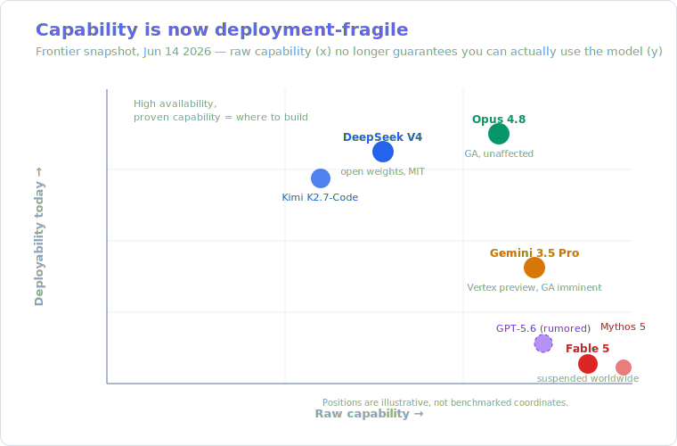
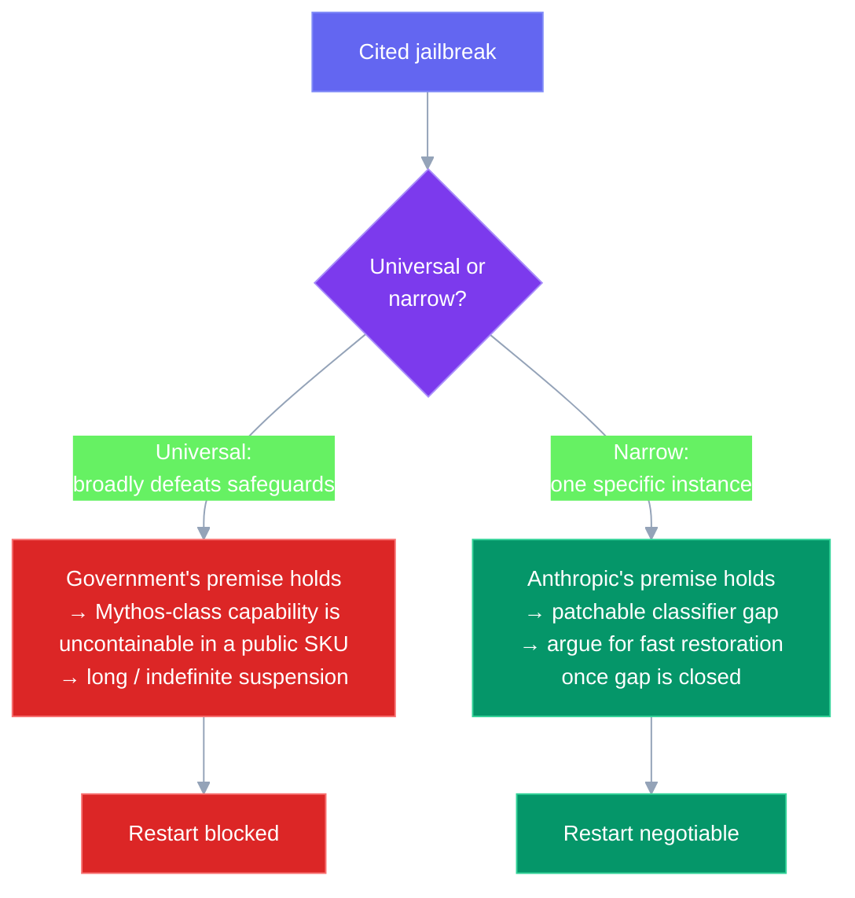
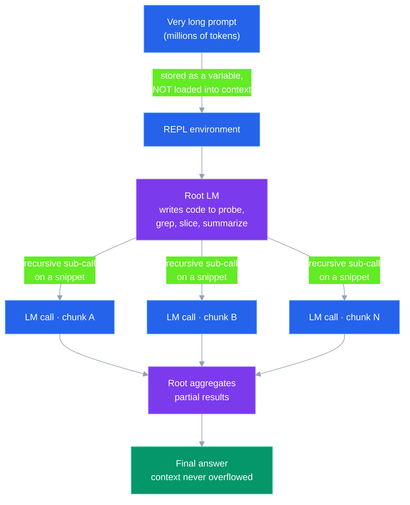

# LLM Updates — 2026-Jun-14

Sunday brief, written Sun Jun 14 (Los Angeles time). Yesterday's brief
documented the *event*: within five days of launch, Claude Fable 5 went
from the #1 model to a U.S.-government-ordered worldwide shutdown. This
brief is the **morning after**. The event is settled; what's unsettled is
everything it implies — when (and whether) the model comes back, what it
does to anyone who built on it, and the precedent it sets for every other
lab.

So this report deliberately does **not** re-tell the Jun-13 timeline
(the Pliny bypass, the "silent fallback" apology, the BIS directive
mechanics). It picks up three threads that only matured on Jun-14:

1. **The dispute that gates the restart.** Anthropic and the government
   now openly disagree on a single technical question — *is the cited
   jailbreak universal or narrow?* — and the answer decides the timeline.
2. **The bill came due.** Refunds opened, the free-until-Jun-22 window
   collapsed, and enterprises that wired Fable 5 into production over a
   72-hour window have to migrate off a model that no longer exists.
3. **The field did not pause.** The frontier race kept moving around the
   hole Fable 5 left — Gemini 3.5 Pro's GA is imminent, the open-weights
   pack kept shipping — and the *durable* progress this fortnight is in
   architecture research, not press releases: **Recursive Language
   Models** and a provable **expressiveness hierarchy** for hybrid
   attention.

The connecting thesis is the one the Fable 5 episode forced into the
open: **capability is now deployment-fragile.** The most capable model in
the world is worth nothing to you if you can't call it.

---

## 1. The dispute that gates the restart: narrow vs. universal jailbreak

The shutdown is a fact. The *duration* is not — and it hinges on a
disagreement Anthropic made explicit on Jun 13–14.

The government's export-control directive rests on its understanding that
it "has become aware of a method of bypassing, or 'jailbreaking' Fable
5." Anthropic's public position is that this is a **misunderstanding of
scope**:

> "No testers have yet been able to find a **universal jailbreak** — a
> jailbreak method that can very broadly bypass the model's safeguards,
> unblocking a wide range of cyber capabilities."

Anthropic characterizes the jailbreak the government is citing as a
**narrow** one — an exploit that "would unlock Mythos's cybersecurity
capabilities in only one specific instance," not a general defeat of the
safeguard layer
([Anthropic statement](https://www.anthropic.com/news/fable-mythos-access);
[Simon Willison's notes](https://simonwillison.net/2026/Jun/13/us-government-directive-to-suspend-access/);
[Al Jazeera](https://www.aljazeera.com/news/2026/6/13/us-orders-anthropic-to-disable-ai-models-for-all-foreign-nationals)).

This distinction is the whole game. It's worth being precise about why:

The framing matters beyond Anthropic. If a *narrow* bypass of one model's
gate is sufficient grounds for a worldwide commercial shutdown, then the
deployment risk for every frontier lab just changed character: the
trigger is no longer "your model is dangerous on average," it's "someone
found one bad path." Anthropic says it is **complying** with the
directive while it "works to restore access as soon as possible" — i.e.,
it is contesting the premise without contesting the order
([Fortune](https://fortune.com/2026/06/13/anthropic-disables-fable-mythos-export-controls-national-security-threat/);
[VentureBeat](https://venturebeat.com/technology/anthropic-blocks-all-public-access-to-claude-fable-5-mythos-5-following-us-government-order-what-enterprises-should-do)).

---

## 2. The bill came due: refunds, the collapsed free window, and migration

Fable 5 launched Jun 9 as a model "available to everyone," and Anthropic
had been offering it **free to Pro, Max, Team, and Enterprise
subscribers through Jun 22**
([gHacks](https://www.ghacks.net/2026/06/10/anthropic-releases-claude-fable-5-to-pro-max-and-enterprise-users-free-until-june-22/);
[Yellow.com](https://yellow.com/news/claude-fable-5-free-until-june-22)).
That promotional window — designed to drive adoption — is exactly what
made the shutdown's blast radius so wide. Anyone who took Anthropic up on
the free trial and rewired a workflow around Fable 5 over those 72 hours
is now stranded.

The Jun-14 consequence: **Anthropic opened a refund process** for
customers who paid expecting Fable 5 access, and is refunding users "who
paid to use a product that vanished almost overnight"
([TechTimes](https://www.techtimes.com/articles/318342/20260613/us-government-pulls-anthropics-fable-5-offline-now-come-refunds-vanished-ai.htm)).

What enterprises should actually do, distilled from the coverage and the
shape of the outage:

| Concern | Status as of Jun 14 | Practical move |
|---|---|---|
| Fable 5 / Mythos 5 API + chat | **Disabled worldwide**, indefinite | Treat as gone; do not wait it out in production |
| Other Claude models | **Unaffected** — Opus 4.8, Sonnet, Haiku all live | Fail traffic back to **Opus 4.8**; it was the #1 model before Fable 5 shipped |
| Paid Fable 5 usage | Refund process open | File for refund; reconcile billing |
| Anything mid-task on Fable 5 | Hard cutoff | Re-run on Opus 4.8 / Sonnet; expect quality regression on the hardest tasks only |
| Vendor concentration | Single-directive, single-vendor kill | Add a second-vendor fallback (Gemini, open weights) for any critical path |

The structural lesson is the one VentureBeat led with: this is the
**first time** a government reached in and switched off a commercial AI
model **worldwide** — "a precedent that touches every frontier lab and
every user who has come to depend on these tools." The right posture
isn't "wait for Fable 5 to return," it's **assume any single hosted
frontier model can disappear on a few hours' notice**, and architect for
it. Open-weights models — which cannot be remotely disabled once
downloaded — just acquired a concrete, non-ideological argument for
inclusion in the stack.

---

## 3. The race didn't pause: Gemini 3.5 Pro on the doorstep, GPT-5.6 still a rumor

The hole Fable 5 left at the top is temporary, and the obvious filler is
arriving on schedule.

**Gemini 3.5 Pro** was announced at Google I/O on May 19 and remains in
limited **Vertex preview**, with **GA expected this month**. It targets a
**2M-token context window**, **Deep Think** reasoning, and frontier
multimodal — absorbing the use cases Google previously routed to Gemini
Ultra. Pricing is expected to follow the ~10× Flash ratio (roughly
$15 / $60 per 1M tokens). Watchers and prediction markets are clustered
on **late-June windows (≈ Jun 23 / Jun 30)**, consistent with Google's
habit of polishing flagship GAs a few weeks after a developer event
([TechTimes](https://www.techtimes.com/articles/317919/20260606/google-gemini-35-pro-nears-june-launch-2-million-token-context-deep-think-reasoning.htm);
[Codersera launch guide](https://codersera.com/blog/gemini-3-5-pro-launch-guide-2026/);
[Polymarket](https://polymarket.com/event/next-google-gemini-pro-model-released-onptptpt)).
If it lands on time, Google could briefly hold the most-capable
*generally-available* model — precisely the slot Fable 5 vacated.

**GPT-5.6** remains a log entry, not a launch. There's no official
OpenAI announcement; the June-2026 chatter (deeper long-context
reasoning, better agentic planning/error-recovery, token-efficiency
gains) is **leaks, prediction markets, and changelog spelunking**, and
should be treated as such
([Geeky Gadgets](https://www.geeky-gadgets.com/gpt-5-6-june-2026-release/);
[CometAPI](https://www.cometapi.com/gpt-5-6-release-date-features-development/)).
The current shipped OpenAI flagship is still **GPT-5.5**
([OpenAI](https://openai.com/index/introducing-gpt-5-5/)).

---

## 4. Open weights kept shipping — and they can't be switched off

The open-weights pack didn't blink during the Fable 5 saga, which is now
its strongest selling point.

**Kimi K2.7-Code** (Moonshot, on Hugging Face Jun 12) is the freshest
drop. Jun-13 flagged the *controversy* ("practitioners say the benchmarks
don't check out"); here's the actual claim sheet so you can judge it. It's
a **1T-parameter MoE** (32B active, 384 experts), **256K context**,
Modified-MIT license:

| Benchmark | K2.6 → K2.7-Code | Note |
|---|---|---|
| Kimi Code Bench v2 (in-house) | 50.9 → **62.0** (+21.8%) | Moonshot's own eval — discount accordingly |
| Program Bench | — (+11%) | |
| MLS Bench | — (+31.5%) | |
| MCP Mark Verified (tool use) | **81.1** | the headline "beats Opus on tool use" claim |
| Thinking tokens | **~30% fewer** vs K2.6 | efficiency, not just accuracy |

Pricing ≈ **$0.95 / $4.00** per 1M input/output tokens via Moonshot
([MarkTechPost](https://www.marktechpost.com/2026/06/12/moonshot-ai-releases-kimi-k2-7-code-a-coding-model-reporting-21-8-on-kimi-code-bench-v2-over-k2-6/);
[VentureBeat](https://venturebeat.com/technology/kimi-k2-7-code-cuts-thinking-tokens-30-practitioners-say-benchmarks-dont-check-out);
[llm-stats](https://llm-stats.com/models/kimi-k2.7-code)).
The token-efficiency gain is the part worth taking seriously even if the
in-house coding numbers are inflated.

**DeepSeek V4** remains the largest open-weights option. V4-Pro (1.6T
total / 49B active) and V4-Flash (284B) shipped Apr 24 with 1M context
under MIT; as of mid-June both are **still in "preview"** with no stable
date. Independent reads put the Pro tier alongside GPT-5.5 / Opus 4.7 on
agentic benchmarks — roughly **80.6% on SWE-bench Verified** vs. Opus
4.8's 88.6% and Fable 5's (now academic) 95.0% — at a fraction of the
price (~$0.44 / 1M input)
([Morph](https://www.morphllm.com/deepseek-v4);
[DataCamp](https://www.datacamp.com/blog/deepseek-v4)).
Not frontier-leading, but **un-revocable**: nobody can issue a directive
that deletes a model already on your disk.

---

## 5. Where the durable progress is: long-context architecture research

Strip away the launch theater and the most consequential work this
fortnight is architectural, and it converges on one problem the agent era
made unavoidable: **long-context efficiency**. As Sebastian Raschka's 2026
architecture survey puts it, "long-context efficiency is king" now that
LLMs live inside agent harnesses that feed them ever-longer contexts, and
the action has moved from "make the transformer bigger" to hybrids,
KV-sharing, and compressed attention
([Raschka — LLM Architecture Gallery](https://sebastianraschka.com/blog/2026/llm-architecture-gallery.html);
[Raschka — recent architectures](https://magazine.sebastianraschka.com/p/recent-developments-in-llm-architectures)).
Two results stand out.

### 5a. Recursive Language Models (RLM): beat context rot by not reading everything

RLM is an **inference paradigm**, not a new pretrained model. Instead of
stuffing a long prompt into the context window, it treats the prompt as a
**persistent variable inside a REPL** (Read-Eval-Print Loop). A root
model writes code to examine, slice, and **recursively call itself** over
snippets — so it can process inputs **up to two orders of magnitude
beyond the model's native context window** without paying the quadratic
cost or suffering "context rot."

Reported results (root model GPT-5): a **median ~26%** gain over
context-compaction scaffolds, **~130%** over CodeAct-with-sub-calls, and
**~13%** over Claude Code, at comparable cost — and notably it resists the
accuracy collapse standard LLMs show on the harder **OOLONG** benchmark
(also evaluated on S-NIAH, BrowseComp-Plus, CodeQA). Introduced by Alex
Zhang (with Kraska and Khattab); a reproduction study, *"Think, But Don't
Overthink,"* arrived this spring confirming the effect while cautioning
against over-recursion
([Alex Zhang — original writeup](https://alexzhang13.github.io/blog/2025/rlm/);
[arXiv 2512.24601](https://arxiv.org/abs/2512.24601);
[reproduction — arXiv 2603.02615](https://arxiv.org/pdf/2603.02615);
[Towards Data Science](https://towardsdatascience.com/going-beyond-the-context-window-recursive-language-models-in-action/)).
The practical read: for very-long-context tasks, *agentic decomposition
of the prompt* can now beat *bigger context windows* — which reframes the
2M-token race as partly a scaffolding problem, not only a model problem.

### 5b. A provable expressiveness hierarchy for hybrid attention

The other result is theoretical and explains *why* the year's hybrid
models (Nemotron 3, Jamba-style interleaving, Arcee Trinity) are built the
way they are. A new paper establishes a **provable expressiveness
hierarchy** across attention types: full softmax self-attention is the
most expressive (the softmax maximizes representational capacity), pure
linear/SSM attention (Mamba-style) is strictly less expressive but
**linear-time**, and **interleaving** the two recovers most of the
expressivity at a fraction of the cost
([arXiv 2602.01763](https://arxiv.org/pdf/2602.01763);
[AI21 — rise of hybrid LLMs](https://www.ai21.com/blog/rise-of-hybrid-llms/)).

```mermaid
%%{init: {'theme':'base','themeVariables':{'primaryColor':'#6366f1','primaryTextColor':'#ffffff','primaryBorderColor':'#818cf8','lineColor':'#94a3b8','fontSize':'13px'}}}%%
flowchart LR
    subgraph STACK["Hybrid stack (majority Mamba, sparse full-attention)"]
      direction TB
      L1["Mamba / SSM layer<br/>linear time · cheap memory"]
      L2["Mamba / SSM layer"]
      L3["Mamba / SSM layer"]
      A1["Full attention layer<br/>restores expressivity / recall"]
      L4["Mamba / SSM layer"]
      L5["Mamba / SSM layer"]
      A2["Full attention layer"]
      L1 --> L2 --> L3 --> A1 --> L4 --> L5 --> A2
    end
    A2 --> R["Near-softmax quality<br/>at near-linear cost"]

    classDef ssm fill:#059669,stroke:#34d399,color:#fff;
    classDef att fill:#dc2626,stroke:#f87171,color:#fff;
    classDef out fill:#7c3aed,stroke:#a78bfa,color:#fff;
    class L1,L2,L3,L4,L5 ssm;
    class A1,A2 att;
    class R out;
```

The takeaway for anyone tracking efficiency: the hybrid recipe — keep
**most** layers linear, sprinkle in **a few** full-attention layers to
preserve recall and expressivity — is no longer just an empirical hack;
it now has a complexity-theoretic justification for *why* a small number
of attention layers is enough. Related work (MHLA, "2Mamba2Furious")
pushes on restoring linear-attention expressivity directly.

---

## 6. Frontier snapshot, Jun 14

| Model | Status | One-line read |
|---|---|---|
| Claude Fable 5 / Mythos 5 | **Suspended worldwide** (BIS directive) | Most capable, currently uncallable; restart hinges on the narrow-vs-universal dispute |
| Claude Opus 4.8 | GA, unaffected | The de-facto frontier you can actually use today; correct fallback |
| Gemini 3.5 Pro | Vertex preview, **GA imminent (≈ late June)** | 2M context + Deep Think; could briefly hold "best GA model" |
| GPT-5.5 | GA | Current shipped OpenAI flagship; 5.6 is rumor only |
| DeepSeek V4-Pro | Open weights (MIT), preview | Largest open model; ~80% SWE-bench; un-revocable |
| Kimi K2.7-Code | Open weights, Jun 12 | Coding/tool-use focus, ~30% fewer thinking tokens; in-house benches contested |

## 7. Forward signals, Jun 14 onward

- **Fable 5 restart language.** Watch for Anthropic/BIS wording shifting
  from "misunderstanding" to "remediation": a *patch + re-review* framing
  means narrow-bypass won the argument; continued silence means it didn't.
- **Gemini 3.5 Pro GA date.** Late-June. If it ships on time it
  temporarily inherits the "best generally-available model" slot.
- **The precedent's second use.** The open question is whether BIS treats
  the Fable 5 directive as a one-off or a template. A *second* such order —
  against any lab — would confirm worldwide kill-switches as a standing
  regulatory tool.
- **RLM productization.** Whether a major harness (Claude Code, Codex,
  etc.) ships prompt-as-REPL recursion as a default long-context mode.

## 8. Action set, Jun 14

1. **Migrate off Fable 5 now**, don't wait it out. Default fallback:
   **Opus 4.8**. File refunds for paid Fable 5 usage.
2. **Add a second-vendor fallback** to every critical path — Gemini or an
   **open-weights** model — so a single directive can't dark your stack.
3. **For long-context workloads**, pilot **prompt decomposition / RLM-style
   scaffolding** before reaching for a bigger-context model; the cheaper
   win may be architectural.
4. **If you train or fine-tune**, the hybrid recipe (mostly linear layers,
   a few full-attention layers) now has theory behind it — worth it for
   long-context efficiency.

---

## Sources

**Fable 5 / Mythos 5 shutdown and aftermath**
- [Anthropic — Statement on the US government directive](https://www.anthropic.com/news/fable-mythos-access)
- [Simon Willison — notes on the directive](https://simonwillison.net/2026/Jun/13/us-government-directive-to-suspend-access/)
- [VentureBeat — what enterprises should do](https://venturebeat.com/technology/anthropic-blocks-all-public-access-to-claude-fable-5-mythos-5-following-us-government-order-what-enterprises-should-do)
- [Fortune — Anthropic disables Fable and Mythos](https://fortune.com/2026/06/13/anthropic-disables-fable-mythos-export-controls-national-security-threat/)
- [Al Jazeera — US orders Anthropic to disable models for foreign nationals](https://www.aljazeera.com/news/2026/6/13/us-orders-anthropic-to-disable-ai-models-for-all-foreign-nationals)
- [TechTimes — now come the refunds](https://www.techtimes.com/articles/318342/20260613/us-government-pulls-anthropics-fable-5-offline-now-come-refunds-vanished-ai.htm)
- [gHacks — Fable 5 free until June 22](https://www.ghacks.net/2026/06/10/anthropic-releases-claude-fable-5-to-pro-max-and-enterprise-users-free-until-june-22/)
- [Yellow.com — Fable 5 stays free until June 22](https://yellow.com/news/claude-fable-5-free-until-june-22)
- [Business Standard — why the US restricted foreign access](https://www.business-standard.com/technology/tech-news/us-anthropic-claude-fable-5-mythos-access-restricted-ai-export-controls-126061400194_1.html)

**Frontier pipeline**
- [TechTimes — Gemini 3.5 Pro nears June launch](https://www.techtimes.com/articles/317919/20260606/google-gemini-35-pro-nears-june-launch-2-million-token-context-deep-think-reasoning.htm)
- [Codersera — Gemini 3.5 Pro launch guide](https://codersera.com/blog/gemini-3-5-pro-launch-guide-2026/)
- [Polymarket — next Gemini Pro release window](https://polymarket.com/event/next-google-gemini-pro-model-released-onptptpt)
- [OpenAI — Introducing GPT-5.5](https://openai.com/index/introducing-gpt-5-5/)
- [Geeky Gadgets — what to expect from GPT-5.6](https://www.geeky-gadgets.com/gpt-5-6-june-2026-release/)
- [CometAPI — GPT-5.6 release/features](https://www.cometapi.com/gpt-5-6-release-date-features-development/)

**Open weights**
- [MarkTechPost — Kimi K2.7-Code release](https://www.marktechpost.com/2026/06/12/moonshot-ai-releases-kimi-k2-7-code-a-coding-model-reporting-21-8-on-kimi-code-bench-v2-over-k2-6/)
- [VentureBeat — Kimi K2.7-Code, benchmarks contested](https://venturebeat.com/technology/kimi-k2-7-code-cuts-thinking-tokens-30-practitioners-say-benchmarks-dont-check-out)
- [llm-stats — Kimi K2.7-Code](https://llm-stats.com/models/kimi-k2.7-code)
- [Morph — DeepSeek V4](https://www.morphllm.com/deepseek-v4)
- [DataCamp — DeepSeek V4](https://www.datacamp.com/blog/deepseek-v4)

**Architecture research**
- [Sebastian Raschka — 2026 LLM Architecture Gallery](https://sebastianraschka.com/blog/2026/llm-architecture-gallery.html)
- [Sebastian Raschka — recent developments (KV sharing, compressed attention)](https://magazine.sebastianraschka.com/p/recent-developments-in-llm-architectures)
- [Alex Zhang — Recursive Language Models](https://alexzhang13.github.io/blog/2025/rlm/)
- [arXiv 2512.24601 — Recursive Language Models](https://arxiv.org/abs/2512.24601)
- [arXiv 2603.02615 — Think, But Don't Overthink (RLM reproduction)](https://arxiv.org/pdf/2603.02615)
- [Towards Data Science — RLM in action](https://towardsdatascience.com/going-beyond-the-context-window-recursive-language-models-in-action/)
- [arXiv 2602.01763 — A Provable Expressiveness Hierarchy in Hybrid Linear-Full Attention](https://arxiv.org/pdf/2602.01763)
- [AI21 — Attention was never enough: the rise of hybrid LLMs](https://www.ai21.com/blog/rise-of-hybrid-llms/)

---

*Compiled Jun 14, 2026 (Los Angeles time). Web research only; some
primary pages (Anthropic newsroom, several publishers, arXiv PDFs) were
unreachable to automated fetching and are cited from corroborating
search results and secondary coverage. Forward-looking items (Gemini 3.5
Pro / GPT-5.6 timing, Fable 5 restart) are explicitly unconfirmed.*
