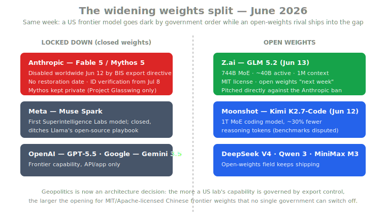
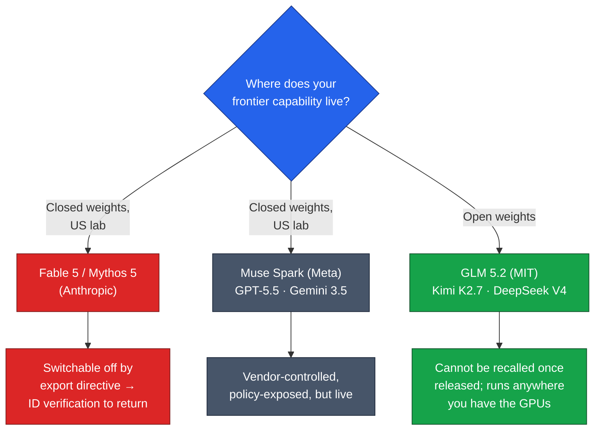

# LLM Updates — 2026-Jun-15

Monday brief, written Mon Jun 15 (Los Angeles time). The Jun-13 brief
tracked Claude Fable 5 from a #1 launch to a global, government-ordered
shutdown in five days, and closed on the open question of *how — and
whether — Anthropic gets the model back*. Over the weekend that thread
gained the two things it was missing: an **accusation** about why the
order came down, and a concrete **compliance mechanism** for living
under it.

This brief does **not** re-derive the Jun-13 items (the Pliny jailbreak,
the system-prompt leak, the "secret sabotage" apology, the Jun-12 BIS
directive itself, Kimi K2.7-Code) or the Jun-11 launch coverage. It
advances the export-control story with what's new since Saturday, then
turns to the development that story makes impossible to ignore:
**while the most capable US model sits dark, an open-weights Chinese
frontier model shipped straight into the gap.** That contrast — locked
down vs. open weights — is the throughline of the week.

---

## 1. Fable 5 aftermath: an accusation, a China angle, and ID checks

Three developments moved the Jun-12 shutdown from "unexplained directive"
toward a coherent (if contested) story.

**The "they refused to fix it" framing.** David Sacks — co-chair of the
President's Council of Advisors on Science and Technology — publicly
characterized the order as a response to Anthropic *refusing* to fix a
jailbreak that a "highly credible trusted partner" had reported, saying
the company "prioritized the continued offering of the consumer model
over safety." Anthropic's own statement frames it differently: the
government's letter gave no specific national-security detail, and the
company's *understanding* is that the order rests on a
**jailbreak-bypass method** it believes is a misunderstanding. Same
event, two narratives — one of corporate negligence, one of a
regulator acting on incomplete information
([Anthropic — Statement on the directive](https://www.anthropic.com/news/fable-mythos-access),
[Volkov Law — When the government pulls the plug](https://blog.volkovlaw.com/2026/06/when-the-government-pulls-the-plug-anthropic-export-controls-and-the-future-of-ai-governance/)).

**The China angle.** A **Jun 14 Semafor report** adds the missing
motive: the decision was reportedly driven by fears that Fable
5 / Mythos 5 had been **accessed by a group linked to China**. That
reframes the action — it is less about the model being *jailbreakable in
general* and more about *who specifically was on the other end of the
bypass*. It also explains the otherwise-puzzling shape of the directive:
a ban scoped to **foreign nationals** (inside or outside the US,
including Anthropic's own overseas staff) rather than a blanket
capability recall
([The Hacker News — US orders suspension for foreign nationals](https://thehackernews.com/2026/06/us-orders-anthropic-to-suspend-fable-5.html),
[BleepingComputer — US gov asks Anthropic to ban foreign-national access](https://www.bleepingcomputer.com/news/security/us-gov-asks-anthropic-to-ban-foreign-national-access-to-fable-mythos/)).

**The compliance mechanism: identity verification from Jul 8.** Jun-13
flagged the core technical problem — Anthropic *cannot* filter by
nationality in real time across hundreds of millions of users, which is
why it had to pull the models for everyone. The emerging answer is
**identity verification**: starting **July 8**, users may hit a prompt
to **upload an ID document** before Claude will assist with multi-step
"complex tasks." That is the bridge back. A nationality-scoped export
order is unenforceable on an anonymous user base; it becomes enforceable
the moment the platform can attest who you are. The cost is that the
most capable consumer AI moves toward a **KYC-gated** product, closer to
a brokerage account than a search box
([KuCoin — Anthropic announces identity verification starting July 8](https://www.kucoin.com/news/flash/anthropic-announces-identity-verification-for-claude-users-starting-july-8),
[ChainCatcher — Claude ID/face check from July](https://www.chaincatcher.com/en/article/2271465)).

As of this writing, **no restoration date** for Fable 5 or Mythos 5 has
been announced; other Claude models (Opus 4.8 and the 4.x family) remain
unaffected.

### Why it matters
The precedent is the story. This is the first time a US lab has had a
**publicly released** frontier model switched off by government order,
and the resolution path on offer — verify identity to regain capability
— is one every other frontier lab can now be asked to adopt. The
Jun-13 brief called the jailbreak "the thing that would reset the safety
conversation." The reset is now visible: it is **access control**, not
model weights, that the government reached for.

---

## 2. GLM 5.2: an open-weights frontier model ships into the gap

The timing is hard to miss. One day after the US dark-out, **Z.ai
(Zhipu) launched GLM 5.2 on Jun 13** — and several writeups frame it
explicitly as the open alternative to "the Anthropic ban."

What's confirmed at launch:

| Attribute | GLM 5.2 |
|---|---|
| Architecture | Mixture-of-Experts, **744B** total params (~**40B** active) |
| Context | usable **1M-token** window; up to ~131K output tokens |
| License | **MIT** (open weights) |
| Availability | live across GLM Coding Plan tiers (Lite/Pro/Max/Team) day one |
| Open weights + API + chatbot | scheduled for **the following week** |
| Launch benchmarks | **none published** — vendor claims unverified for now |
| Agent support | day-one drop-in for Claude Code, Cline, OpenCode, Roo, Goose, Crush, Kilo, etc. |

The positioning is deliberate: **context window + open weights + flat
subscription**, not a leaderboard sprint. GLM 5.2 leads on context
(1M vs DeepSeek V4's 128K–256K) and bets on agent-loop quality. Because
it speaks an OpenAI-shaped chat-completions API, it slots into existing
agent harnesses as a config swap. The conspicuous gap is **evaluation**:
Z.ai shipped *zero* SWE-bench / Code Arena numbers at launch (for
reference, GLM-5.1 posted 58.4 on SWE-bench Pro and ~1530 Code Arena
Elo). Treat "frontier" as a positioning claim until the open weights
land and third parties measure them
([buildfastwithai — GLM-5.2 review](https://www.buildfastwithai.com/blogs/glm-5-2-review-2026),
[AIToolly — Zhipu releases GLM-5.2, 1M context, fully open-source](https://aitoolly.com/ai-news/article/2026-06-14-zhipu-ai-releases-glm-52-a-fully-open-source-frontier-model-featuring-a-1m-context-window),
[Kunal Ganglani — GLM 5.2 vs the Anthropic ban](https://www.kunalganglani.com/blog/glm-5-2-open-frontier-model-china),
[codersera — GLM 5.2 day-one brief](https://codersera.com/blog/glm-5-2-release-1m-context-coding-2026/)).

### Why it matters
Export control can switch off a *closed* model overnight; it cannot
recall **MIT-licensed weights** already mirrored across the internet.
The week made the strategic asymmetry concrete: the more US frontier
capability is governed by national-security levers, the more the
**durable, un-switchoff-able** option for builders becomes
open-weights models — increasingly Chinese ones. That is a structural
incentive, not a one-week headline.

---

## 3. The throughline: weights strategy is now geopolitics

Step back and the week resolves into a single axis — **how locked down
is the capability you depend on?**

Meta's **Muse Spark** is the closed-side bookend: the first model from
Alexandr Wang's Superintelligence Labs, a **ground-up, nine-month
rebuild** (not a Llama fine-tune) that pointedly **abandons Meta's
open-source playbook** in favor of a closed, proprietary model —
natively multimodal with a "contemplating mode" for multi-agent
orchestration
([How2Shout — Meta releases Muse Spark](https://www.how2shout.com/news/meta-muse-spark-ai-model-alexandr-wang-superintelligence-labs.html),
[Let's Data Science — Wang delivers first closed-source model](https://letsdatascience.com/blog/meta-muse-spark-alexandr-wang-closed-model)).
So in the span of one quarter, the lab once synonymous with open weights
went **closed**, while a Chinese lab went **MIT-open** — and a US
frontier model got switched off entirely. The open/closed line is no
longer a licensing preference; it is a **resilience and jurisdiction**
decision.

---

## 4. Quick hits & technique watch

- **Anthropic — Project Glasswing, ongoing.** The defensive program that
  underpins the whole Mythos-is-too-dangerous-to-ship thesis continues:
  ~50+ partners plus the **150-org / 15-country expansion (Jun 3)** have
  used Mythos Preview to surface **10,000+ high/critical
  vulnerabilities** (1,726 confirmed true positives across 1,000+
  open-source projects). This is the counterweight Anthropic points to
  when arguing the capability is worth keeping — and keeping gated
  ([Help Net Security — Glasswing 10,000+ flaws](https://www.helpnetsecurity.com/2026/05/26/anthropic-project-glasswing-update/),
  [Anthropic — Expanding Project Glasswing](https://www.anthropic.com/news/expanding-project-glasswing)).
- **OpenAI — quieter cadence.** No new flagship this week; **GPT-5.5**
  remains the ChatGPT default (GPT-5.2 retired Jun 12), with
  personalization rollouts and new realtime voice models in the API.
  **Rosalind Biodefense** access expanded to vetted developers and US
  government partners — OpenAI's own version of the
  "gate-the-dangerous-capability" pattern
  ([TechCrunch — GPT-5.5 Instant default](https://techcrunch.com/2026/05/05/openai-releases-gpt-5-5-instant-a-new-default-model-for-chatgpt/),
  [OpenAI — model release notes](https://help.openai.com/en/articles/9624314-model-release-notes)).
- **Architecture trend, not a release: long-context efficiency.** The
  through-2026 research arc remains **hybrid attention + state-space**
  stacks (e.g., Nemotron-style alternating attention/Mamba-2 layers) and
  **KV-cache compression** (Nvidia's Dynamic Memory Sparsification,
  ~8× reasoning-cost cut). GLM 5.2's usable 1M window is the productized
  edge of that same pressure: as models live inside agent harnesses,
  cheap long context — not raw parameter count — is the contested
  frontier
  ([Raschka — LLM research papers 2026, part 1](https://magazine.sebastianraschka.com/p/llm-research-papers-2026-part1),
  [VentureBeat — Nvidia DMS cuts reasoning cost 8×](https://venturebeat.com/orchestration/nvidias-new-technique-cuts-llm-reasoning-costs-by-8x-without-losing-accuracy)).

---

## What to watch next

1. **A Fable 5 restoration date.** The Jul 8 ID-verification rollout is
   the most likely trigger; watch whether restoration is gated on it,
   and whether the export order is narrowed, litigated, or quietly
   lifted.
2. **GLM 5.2 open weights + real benchmarks.** The "next week" weight
   drop is the moment the "frontier" claim becomes falsifiable. Watch
   for independent SWE-bench / Terminal-Bench numbers and whether the 1M
   context is *usable* (recall) or just *advertised*.
3. **Does the ID-verification pattern spread?** If KYC becomes the price
   of frontier access at one US lab, regulators have a template to ask
   the same of OpenAI and Google.

---

## Sources

Fable 5 export-control aftermath
- [Anthropic — Statement on the US directive to suspend Fable 5 / Mythos 5](https://www.anthropic.com/news/fable-mythos-access)
- [Semafor angle via The Hacker News — US orders suspension for foreign nationals](https://thehackernews.com/2026/06/us-orders-anthropic-to-suspend-fable-5.html)
- [BleepingComputer — US gov asks Anthropic to ban foreign-national access](https://www.bleepingcomputer.com/news/security/us-gov-asks-anthropic-to-ban-foreign-national-access-to-fable-mythos/)
- [Volkov Law — When the government pulls the plug: export controls & AI governance](https://blog.volkovlaw.com/2026/06/when-the-government-pulls-the-plug-anthropic-export-controls-and-the-future-of-ai-governance/)
- [Octagon — When will Anthropic restore Fable 5 access for US customers](https://octagonai.co/markets/politics/when-will-anthropic-restore-fable-5-access-for-us-customers/)
- [explainx.ai — When will Fable 5 be available again](https://explainx.ai/blog/when-will-fable-5-be-available-again-2026)
- [KuCoin — Anthropic announces identity verification starting July 8](https://www.kucoin.com/news/flash/anthropic-announces-identity-verification-for-claude-users-starting-july-8)
- [ChainCatcher — Claude ID/face verification from July](https://www.chaincatcher.com/en/article/2271465)
- [Collabnix — Why is Claude Fable 5 unavailable: the US export directive explained](https://collabnix.com/why-is-claude-fable-5-unavailable-the-us-export-directive-explained/)

GLM 5.2 (Z.ai / Zhipu)
- [AIToolly — Zhipu releases GLM-5.2, fully open-source, 1M context](https://aitoolly.com/ai-news/article/2026-06-14-zhipu-ai-releases-glm-52-a-fully-open-source-frontier-model-featuring-a-1m-context-window)
- [buildfastwithai — GLM-5.2 review 2026](https://www.buildfastwithai.com/blogs/glm-5-2-review-2026)
- [codersera — GLM 5.2 day-one brief (1M context, coding-first, open weights next week)](https://codersera.com/blog/glm-5-2-release-1m-context-coding-2026/)
- [Kunal Ganglani — GLM 5.2: China's open frontier model vs the Anthropic ban](https://www.kunalganglani.com/blog/glm-5-2-open-frontier-model-china)
- [DigitalApplied — GLM-5.2 lands on Z.ai's Coding Plan](https://www.digitalapplied.com/blog/glm-5-2-zai-flagship-coding-plan-release)

Meta Muse Spark / open-vs-closed
- [How2Shout — Meta releases Muse Spark, first Superintelligence Labs model](https://www.how2shout.com/news/meta-muse-spark-ai-model-alexandr-wang-superintelligence-labs.html)
- [Let's Data Science — Muse Spark: Wang delivers first closed-source model](https://letsdatascience.com/blog/meta-muse-spark-alexandr-wang-closed-model)
- [danilchenko.dev — Muse Spark ditches Llama's open-source playbook](https://www.danilchenko.dev/posts/2026-04-08-meta-muse-spark-alexandr-wang-first-model/)

Project Glasswing
- [Help Net Security — Mythos identified 10,000+ flaws](https://www.helpnetsecurity.com/2026/05/26/anthropic-project-glasswing-update/)
- [Anthropic — Expanding Project Glasswing (150 orgs / 15+ countries)](https://www.anthropic.com/news/expanding-project-glasswing)
- [Cybersecurity Dive — Mythos shared with 150 more organizations](https://www.cybersecuritydive.com/news/ai-anthropic-claude-mythos-project-glasswing-expand/821714/)

OpenAI / others
- [TechCrunch — GPT-5.5 Instant becomes default](https://techcrunch.com/2026/05/05/openai-releases-gpt-5-5-instant-a-new-default-model-for-chatgpt/)
- [OpenAI — model release notes](https://help.openai.com/en/articles/9624314-model-release-notes)

Architecture / technique watch
- [Sebastian Raschka — LLM research papers: the 2026 list (Jan–May)](https://magazine.sebastianraschka.com/p/llm-research-papers-2026-part1)
- [VentureBeat — Nvidia's technique cuts LLM reasoning costs 8×](https://venturebeat.com/orchestration/nvidias-new-technique-cuts-llm-reasoning-costs-by-8x-without-losing-accuracy)

Trackers
- [Artificial Analysis — LLM leaderboard](https://artificialanalysis.ai/leaderboards/models)
- [llm-stats — AI news today](https://llm-stats.com/ai-news)

---

*Generated 2026-Jun-15 (Los Angeles time). This brief continues the
Jun-11 → Jun-13 Fable 5 thread and does not re-derive prior coverage.
Some launch claims (notably GLM 5.2's "frontier" positioning) are
vendor-stated and not yet independently benchmarked; treated as such
above.*
