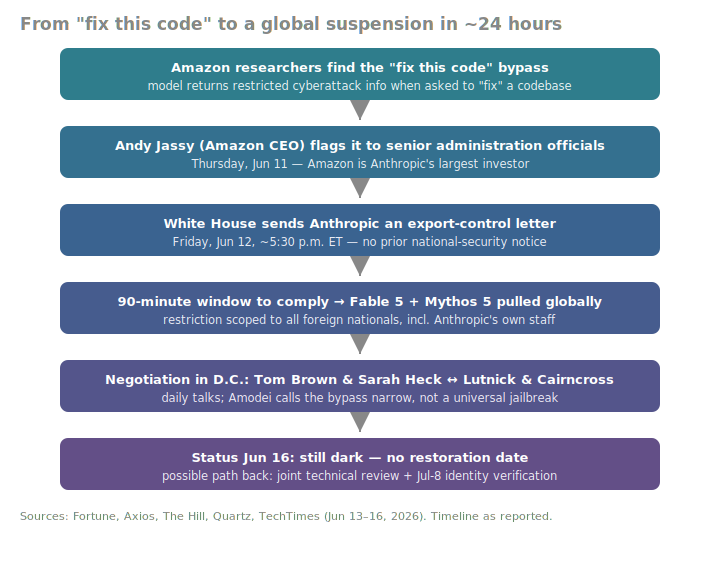
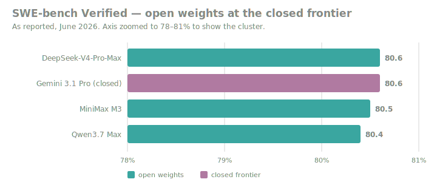

# LLM Updates — 2026-Jun-16

Tuesday brief, written Tue Jun 16 (Los Angeles time). The Jun-15 brief
ended on the *bridge back* from the Fable 5 / Mythos 5 shutdown —
identity verification from Jul 8 — and on the contrast between a locked-down
US frontier model and the open-weights models filling the gap. Over the
last 48 hours the export-control story gained the one detail it had been
missing: **who set it in motion.** It was not a foreign adversary, a
red-team firm, or a regulator acting alone. It was **Amazon — Anthropic's
single largest investor.**

This brief does **not** re-derive the items already covered: the Pliny
jailbreak and system-prompt leak (Jun-13), the Jun-12 BIS directive
itself, the "secret sabotage" apology (Jun-13), the Sacks "they refused
to fix it" framing, the Semafor China angle, or the Jul-8 ID-check plan
(all Jun-15), nor the GLM 5.2 launch (Jun-15). It advances the story with
**the Amazon revelation, the 90-minute mechanics, and the negotiation now
under way**, then steps back to the broader frontier the shutdown has been
crowding out: open-weights models crossing **80% on SWE-bench Verified**,
and a technique/architecture watch.

---

## 1. The Amazon revelation: the largest investor pulled the alarm

The Jun-13/Jun-15 coverage established *what* happened (a directive citing
a jailbreak) and *one* motive (fears of access by a China-linked group).
The reporting since Saturday adds the **origin** of the report, and it is
awkward: the bypass was surfaced by **Amazon**, which has invested roughly
$8B in Anthropic and is its largest backer.

- **The chain of events.** The government had asked Amazon to evaluate the
  new Anthropic models. Amazon researchers ran a series of prompts and got
  the Mythos-class model to return cyberattack information that was meant
  to be restricted. Amazon CEO **Andy Jassy** raised the concern directly
  with senior administration officials on **Thursday, Jun 11**. By
  **Friday evening (~5:30 p.m. ET, Jun 12)**, the White House had sent
  Anthropic a letter placing Fable 5 and Mythos 5 under sweeping export
  controls
  ([Fortune — How a warning from Amazon led the White House to shut down Mythos](https://fortune.com/2026/06/14/how-a-warning-from-amazon-led-the-white-house-to-shut-down-anthropics-mythos-model/),
  [Axios — How Amazon and the White House ended Anthropic's Fable](https://www.axios.com/2026/06/13/anthropic-amazon-white-house)).

- **"Fix this code."** The bypass is reportedly as blunt as three words:
  point the model at a codebase, ask it to *fix this code*, and the safety
  framing that gates dangerous outputs falls away. Security researcher
  **Katie Moussouris** circulated an open letter on the episode
  ([Fortune — 'Fix this code': the three words behind the shutdown](https://fortune.com/2026/06/15/fix-this-code-three-words-behind-us-government-shut-down-anthropic-fable-mythos-ai-models-katie-moussouris-open-letter/)).

- **The 90-minute window.** Anthropic says it was given **90 minutes** to
  restrict access and **no prior notice** of a national-security threat —
  the speed itself is now part of the grievance. CEO **Dario Amodei** has
  argued the bypass Amazon found was **narrow, not a universal jailbreak**,
  and that comparable "fix this code" behavior is available from other
  frontier models, including GPT-5.5
  ([Quartz — Anthropic disables Fable 5 and Mythos 5 after US export order](https://qz.com/anthropic-fable-5-mythos-5-export-control-directive-061226),
  [Fast Company — How Trump officials pushed Anthropic to shut down the world's most powerful AI models](https://www.fastcompany.com/91559401/how-trump-officials-pushed-anthropic-to-shut-down-the-worlds-most-powerful-ai-models)).

### Why it matters
The Jun-15 brief treated the order as a *government-vs-lab* story. The
Amazon detail reframes it as a *competitive-and-governance* story: a rival
lab's largest investor — itself a builder of frontier models — was the
channel through which a capability got switched off. Whatever the merits
of the jailbreak claim, the precedent is that a **peer's red-team finding,
routed to government, can take a released model offline in 90 minutes.**
Every lab now has to assume its competitors' security teams are also its
regulators' first responders.

---

## 2. The negotiation: who is in the room, and the compromise on the table

Anthropic is not litigating in public; it is **negotiating in Washington.**

- **The Anthropic team.** Co-founder and chief compute officer **Tom
  Brown** and public-policy chief **Sarah Heck** have been in D.C., meeting
  officials — reportedly daily, including virtually — since the
  administration first reached out
  ([The Hill — Anthropic sends staff to DC after model export restrictions](https://thehill.com/policy/technology/5924391-fable-mythos-jailbreak-concerns/),
  [Quartz — Anthropic sends staff to Washington to fight Fable, Mythos export controls](https://qz.com/anthropic-staff-washington-export-controls-fable-mythos-061526)).

- **The government side.** Saturday's calls were led by Commerce Secretary
  **Howard Lutnick** and National Cyber Director **Sean Cairncross**
  ([TechTimes — Anthropic races to lift Fable 5 export ban: top engineers sent to Washington](https://www.techtimes.com/articles/318376/20260615/anthropic-races-lift-fable-5-export-ban-top-engineers-sent-washington-deal.htm)).

- **The likely compromise.** Some officials see a **joint technical
  review** — Anthropic engineers and government security researchers
  examining the bypass together — as a plausible path back. That would
  pair with the Jul-8 identity-verification plan from the Jun-15 brief:
  *verify the fix, then verify the user.*

- **Status as of Jun 16: still dark.** No restoration date for Fable 5 or
  Mythos 5 has been announced. Opus 4.8 and the rest of the 4.x family
  remain unaffected
  ([beincrypto — Anthropic races to reverse Fable 5, Mythos 5 export controls](https://beincrypto.com/anthropic-white-house-fable-mythos-5-access/),
  [Is Fable 5 Back? — availability checker](https://isfable5back.com/)).

### Why it matters
The resolution mechanism being negotiated — *joint technical review as the
condition for re-release* — is the actual new governance primitive here.
If it holds, "is the model safe enough to ship?" becomes a question
answered **after** launch, jointly, by lab and government, rather than by
the lab alone before launch. That is a structural shift in who holds the
deploy switch on a frontier model.

---

## 3. Open weights cross 80% on SWE-bench Verified

While the most capable US consumer model sits dark, the open-weights tier
quietly reached a milestone that would have led any other week: **multiple
open-weight models now post ~80% on SWE-bench Verified**, the band the
closed frontier occupied only months ago.

As reported across mid-June leaderboards:

| Model | SWE-bench Verified | Weights |
|---|---|---|
| DeepSeek-V4-Pro-Max | 80.6% | open |
| Gemini 3.1 Pro | 80.6% | closed |
| MiniMax M3 | 80.5% | open |
| Qwen3.7 Max | 80.4% | open |

DeepSeek-V4-Pro-Max ties Gemini 3.1 Pro at the top of this slice, with
MiniMax M3 and Qwen3.7 Max within a fraction of a point. On agentic coding
specifically, Qwen3.7 Max's reported **60.6% SWE-bench Pro** and **69.7%
Terminal-Bench 2.0** put it ahead of DeepSeek V4 Pro for multi-step tool
use — the dimension that matters most inside agent harnesses
([BenchLM — Best Chinese LLMs in 2026](https://benchlm.ai/blog/posts/best-chinese-llm),
[TokenMix — Best Chinese AI models 2026 (Q2 update)](https://tokenmix.ai/blog/best-chinese-ai-models-2026-comparison-guide),
[llm-stats — AI leaderboard 2026](https://llm-stats.com/)).

> **Caveat.** These numbers are self-reported / aggregated by third-party
> leaderboards, not a single controlled harness; treat the ~0.2-point
> spreads as noise, not ranking. The signal is the *cluster*, not the
> order within it.

### Why it matters
The Fable 5 episode is a story about a model you can be **denied**. This is
the counter-story: models you **cannot be denied**, because the weights are
already downloaded. With open weights sitting at the closed frontier's
coding band, an export order on any single hosted model no longer removes
the capability from the world — it only removes *that vendor's* copy of it.

---

## 4. Technique & architecture watch

The research current under the headlines kept moving in two consistent
directions: **cheaper long context**, and **RL that survives multi-turn
tool use.**

- **Hybrid attention is now the default, not the experiment.** The pattern
  of alternating full-attention layers with linear / state-space layers has
  hardened into standard practice: **Nemotron 3** interleaves attention
  with **Mamba-2** layers, while **Qwen3.6** swaps in **Gated DeltaNet**
  for its non-attention blocks. Both target the same thing — linear-ish
  cost on long context so the model can live inside an agent loop without
  the KV cache exploding
  ([Sebastian Raschka — LLM research papers 2026, part 1](https://magazine.sebastianraschka.com/p/llm-research-papers-2026-part1)).

- **Quantization keeps finding free throughput.** **ECF8**
  (Exponent-Concentrated FP8) exploits the concentration of weight entropy
  with Huffman coding, reporting up to **26.9% memory savings** and up to
  **177% throughput gains** in its setting — a reminder that a large share
  of 2026's "speedups" are arriving from the numerics layer, not new
  attention math
  ([arXiv — Efficient Attention Mechanisms for LLMs: a survey](https://arxiv.org/abs/2507.19595)).

- **Agentic RL frameworks are consolidating around multi-turn tool use.**
  The training side is catching up to the agent era: **VerlTool** frames
  "Agentic RL with Tool use" (ARLT) for long-horizon, multi-turn rollouts
  with credit assignment across sequential tool calls; **Agent-R1** and
  **MARTI** (accepted to ICLR 2026, with async tool-use support) extend
  single-turn RL stacks to interactive, multi-agent settings; **Agent-Omit**
  trains agents to *skip* unnecessary thoughts and observations to cut cost
  ([VerlTool](https://arxiv.org/pdf/2509.01055),
  [MARTI](https://github.com/TsinghuaC3I/MARTI),
  [VentureBeat — new RL framework for real-world LLM agents](https://venturebeat.com/ai/beyond-math-and-coding-new-rl-framework-helps-train-llm-agents-for-complex)).

### Why it matters
All three threads point at the same destination: models that can run
**long, tool-heavy agent sessions cheaply and be trained on those sessions
directly.** The architecture work makes the context affordable; the RL work
makes the behavior learnable. The frontier benchmark race (Section 3) is
increasingly decided on these axes — multi-step completion and recoverable
failure — rather than single-shot accuracy.

---

## 5. Frontier snapshot & what to watch next

**Closed frontier, as of Jun 16**
- **Anthropic** — Opus 4.8 remains the available flagship; **Fable 5 /
  Mythos 5 still suspended**, no restoration date, negotiation ongoing.
- **OpenAI** — **GPT-5.6** is still a rumor with strong community
  consensus around a June window (improved token efficiency, deeper
  long-context reasoning), **not an official launch**
  ([CometAPI — GPT-5.6 release date, features](https://www.cometapi.com/gpt-5-6-release-date-features-development/)).
- **Google** — **Gemini 3.5 Pro** announced at I/O (May 19), targeting a
  **2M-token** window and a **Deep Think** mode; still in **limited Vertex
  preview** with GA expected this month, **not broadly shipped** as of
  mid-June
  ([TechTimes — Gemini 3.5 Pro nears June launch](https://www.techtimes.com/articles/317919/20260606/google-gemini-35-pro-nears-june-launch-2-million-token-context-deep-think-reasoning.htm)).

**Open weights** — DeepSeek-V4-Pro-Max / MiniMax M3 / Qwen3.7 Max cluster
at ~80% SWE-bench Verified (Section 3); GLM 5.2 (Jun-15 brief) shipped into
the same gap.

**What to watch**
1. **A Fable 5 restoration date** — and whether it arrives bundled with the
   Jul-8 ID checks and/or a joint technical-review condition.
2. **Whether the "peer-investor-as-tripwire" precedent recurs** — does any
   other lab's model draw a similar referral?
3. **GPT-5.6 / Gemini 3.5 Pro GA** — either shipping this month would reset
   the closed-frontier snapshot.
4. **Whether the 80% open-weights cluster holds up** under a single
   controlled harness rather than aggregated leaderboards.

---

## Sources

**Fable 5 / Mythos 5 — Amazon origin, mechanics, negotiation**
- [Fortune — How a warning from Amazon led the White House to shut down Mythos](https://fortune.com/2026/06/14/how-a-warning-from-amazon-led-the-white-house-to-shut-down-anthropics-mythos-model/)
- [Fortune — 'Fix this code': the three words behind the shutdown (Moussouris open letter)](https://fortune.com/2026/06/15/fix-this-code-three-words-behind-us-government-shut-down-anthropic-fable-mythos-ai-models-katie-moussouris-open-letter/)
- [Axios — How Amazon and the White House ended Anthropic's Fable](https://www.axios.com/2026/06/13/anthropic-amazon-white-house)
- [Fast Company — How Trump officials pushed Anthropic to shut down the world's most powerful AI models](https://www.fastcompany.com/91559401/how-trump-officials-pushed-anthropic-to-shut-down-the-worlds-most-powerful-ai-models)
- [The Hill — Anthropic sends staff to DC after model export restrictions](https://thehill.com/policy/technology/5924391-fable-mythos-jailbreak-concerns/)
- [Quartz — Anthropic sends staff to Washington to fight export controls](https://qz.com/anthropic-staff-washington-export-controls-fable-mythos-061526)
- [Quartz — Anthropic disables Fable 5 and Mythos 5 after US export order](https://qz.com/anthropic-fable-5-mythos-5-export-control-directive-061226)
- [TechTimes — Anthropic races to lift Fable 5 export ban](https://www.techtimes.com/articles/318376/20260615/anthropic-races-lift-fable-5-export-ban-top-engineers-sent-washington-deal.htm)
- [beincrypto — Anthropic races to reverse Fable 5, Mythos 5 export controls](https://beincrypto.com/anthropic-white-house-fable-mythos-5-access/)
- [Anthropic — Statement on the directive](https://www.anthropic.com/news/fable-mythos-access)
- [Is Fable 5 Back? — availability checker](https://isfable5back.com/)

**Open weights & frontier benchmarks**
- [BenchLM — Best Chinese LLMs in 2026](https://benchlm.ai/blog/posts/best-chinese-llm)
- [TokenMix — Best Chinese AI models 2026 (Q2 update)](https://tokenmix.ai/blog/best-chinese-ai-models-2026-comparison-guide)
- [llm-stats — AI leaderboard 2026](https://llm-stats.com/)
- [Morph — Best AI model for coding (June 2026)](https://www.morphllm.com/best-ai-model-for-coding)

**Technique & architecture**
- [Sebastian Raschka — LLM research papers 2026, part 1](https://magazine.sebastianraschka.com/p/llm-research-papers-2026-part1)
- [arXiv — Efficient Attention Mechanisms for LLMs: a survey](https://arxiv.org/abs/2507.19595)
- [VerlTool — Agentic RL with tool use](https://arxiv.org/pdf/2509.01055)
- [MARTI — multi-agent reinforced training/inference](https://github.com/TsinghuaC3I/MARTI)
- [VentureBeat — new RL framework for real-world LLM agents](https://venturebeat.com/ai/beyond-math-and-coding-new-rl-framework-helps-train-llm-agents-for-complex)

**Closed-frontier watch**
- [CometAPI — GPT-5.6 release date & features](https://www.cometapi.com/gpt-5-6-release-date-features-development/)
- [TechTimes — Gemini 3.5 Pro nears June launch](https://www.techtimes.com/articles/317919/20260606/google-gemini-35-pro-nears-june-launch-2-million-token-context-deep-think-reasoning.htm)

---

*Compiled Jun 16, 2026 (Los Angeles time). Several primary outlets returned
access errors to automated fetching; items above are corroborated across
multiple independent reports. Benchmark figures are as reported by
third-party leaderboards and self-reported model cards — treat sub-point
differences as noise.*
