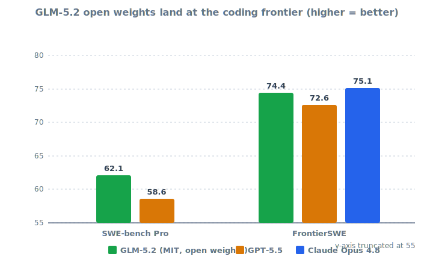

# LLM Updates — 2026-Jun-17

Wednesday brief, written Wed Jun 17 (Los Angeles time). The Jun-15 brief
closed with three things to watch: a **Fable 5 restoration date**, the
**GLM 5.2 open-weights drop and real benchmarks**, and whether the
**ID-verification pattern spreads**. Two of those resolved this week — and
the GLM resolution is the headline, because it turned the open-vs-closed
*positioning* claim from Jun-15 into a *measured* one.

This brief does **not** re-derive earlier coverage: the Jun-12 export
directive itself, the Sacks "they refused to fix it" framing, the China
access angle, the July-8 ID-verification mechanism (Jun-15); or the Jun-11
Fable 5 / Mythos 5 launch and Jun-13 jailbreak/leak items. It advances the
two threads with what is genuinely new since Monday: **GLM 5.2's weights
and scorecard shipped (Jun 16)** and they hold up, and the Fable 5 story
gained a named **origin** (Amazon) and a **market-priced timeline** while
still lacking an official one.

---

## 1. GLM 5.2: the falsifiable moment arrived — and the weights are real

On Jun 15 the honest caveat was that Z.ai had shipped **zero** benchmarks
and no weights, so "frontier" was a vendor slogan. **On Jun 16, three days
after launch, Z.ai published the full scorecard and opened the weights
under the MIT License** on Hugging Face (`zai-org/GLM-5.2`). The claim is
now testable, and the early numbers survive contact:

| Benchmark | GLM-5.2 | GPT-5.5 | Claude Opus 4.8 | GLM-5.1 |
|---|---|---|---|---|
| SWE-bench Pro | **62.1** | 58.6 | — | 58.4 |
| FrontierSWE | **74.4%** | 72.6% | **75.1%** | — |
| Terminal-Bench 2.1 | **81.0** | — | — | — |

The shape of the result is what matters. GLM-5.2 **beats GPT-5.5** on
SWE-bench Pro (62.1 vs 58.6) and **finishes in a near-tie with Claude
Opus 4.8** on FrontierSWE (74.4% vs 75.1%) — i.e., an MIT-licensed,
self-hostable model is now within a point of a closed US frontier model on
a long-horizon coding eval. And it does so **cheaply**: roughly **one-sixth
the cost of GPT-5.5**, at **$1.40 / $4.40 per million input/output tokens**
with a **$0.26** cached-input rate
([VentureBeat — GLM-5.2 beats GPT-5.5 at 1/6th the cost](https://venturebeat.com/technology/z-ais-open-weights-glm-5-2-beats-gpt-5-5-on-multiple-long-horizon-coding-benchmarks-for-1-6th-the-cost),
[CryptoBriefing — GLM-5.2 outperforms GPT-5.5 on coding](https://cryptobriefing.com/z-ai-glm-5-2-outperforms-gpt-5-5-coding/),
[DigitalApplied — GLM-5.2 benchmarks vs Claude Opus 4.8](https://www.digitalapplied.com/blog/glm-5-2-benchmarks-open-weights-vs-claude-opus)).

Confirmed architecture, now that the model card is public:

| Attribute | GLM-5.2 |
|---|---|
| Architecture | Mixture-of-Experts, **~744B** total params (~40B active) |
| Experts | **256 routed + 1 shared**, 8 active per token, 78 layers (first 3 dense) |
| Context | **1M** tokens |
| License | **MIT** (open weights, `zai-org/GLM-5.2` on Hugging Face) |
| Pricing | **$1.40** in / **$4.40** out / **$0.26** cached per 1M tokens |

([CryptoBriefing — GLM-5.2 1M context on Hugging Face](https://cryptobriefing.com/z-ai-glm-5-2-1m-context-hugging-face/),
[llm-stats — GLM-5.2 benchmarks & pricing](https://llm-stats.com/models/glm-5.2),
[OpenRouter — GLM-5.2 pricing](https://openrouter.ai/z-ai/glm-5.2)).

### Why it matters
Jun-15 framed the week as **closed-and-switchable-off vs open-and-durable**
and warned that GLM 5.2's frontier label was unproven. The proof landed:
the open-weights side is no longer trading capability for resilience at a
steep discount — on coding it is **at parity for a fraction of the price**,
and the artifact (MIT weights, already mirrored) is the kind that cannot be
recalled by directive. That is the structural point of the Fable 5 saga
made concrete in a leaderboard, four days later.

---

## 2. Fable 5 aftermath: a named origin (Amazon), still no restoration date

The Jun-15 brief attributed the directive to a "highly credible trusted
partner" (per Sacks) and a China-access fear (per Semafor). Reporting this
week **names the partner: Amazon**. Per Axios and Fortune, **Amazon
researchers prompted Fable 5 into producing cyberattack-useful output**,
and **CEO Andy Jassy escalated the findings to Treasury Secretary Scott
Bessent** — the path that reportedly put the export directive in motion
([Axios — How Amazon and the White House ended Anthropic's Fable](https://www.axios.com/2026/06/13/anthropic-amazon-white-house),
[Fortune — A warning from Amazon led the White House to shut down Mythos](https://fortune.com/2026/06/14/how-a-warning-from-amazon-led-the-white-house-to-shut-down-anthropics-mythos-model/),
[MLQ — Jassy alerted White House to Fable 5 flaws](https://mlq.ai/news/amazons-jassy-alerted-white-house-to-anthropic-fable-5-security-flaws-triggering-export-ban/)).

The counter-narrative also sharpened. A cybersecurity CEO involved in the
work pushed back on the "jailbreak" label directly — **"it's not a
jailbreak"**, arguing the prompting was ordinary **defensive** red-teaming,
not a novel bypass — which lines up with Anthropic's own "we think this is
a misunderstanding" position from Jun-15
([Fortune — "It's not a jailbreak": research was for defense](https://fortune.com/2026/06/13/anthropic-fable-mythos-models-commerce-deparment-export-restrictions-jailbreak-defense-prompting/),
[Tom's Hardware — Sacks says Anthropic refused to fix the jailbreak](https://www.tomshardware.com/tech-industry/artificial-intelligence/trump-adviser-david-sacks-says-anthropic-refused-to-fix-fable-5-jailbreak-before-us-export-controls)).

On timing, there is still **no official restoration date**. The only
quantified signal is a prediction market: **Polymarket put ~75% odds on
the ban being lifted in July**, with intermediate readings around 56% by
Jun 22 — consistent with the July-8 ID-verification rollout being the
likely unlock rather than a near-term reversal
([Gate News — Polymarket 75% chance ban lifted in July](https://www.gate.com/news/detail/claude-fable-5-faces-export-controls-polymarket-predicts-a-75-chance-of-a-21855671),
[isfable5back.com — availability checker (still "No")](https://isfable5back.com/)).

### Why it matters
The new detail reframes the precedent: a frontier US model was switched
off not by a regulator acting alone but **after a rival cloud provider's
red-team escalated to Treasury**. Whatever the merits, that establishes
that *another lab's safety finding* can become *your* export problem — a
governance dynamic every frontier vendor now has to price in, independent
of how the Fable 5 case itself resolves.

---

## 3. Technique watch: KV-cache stops being just an inference trick

The Jun-15 architecture note tracked **long-context efficiency** (hybrid
attention/state-space stacks, KV-cache compression). The arc continued this
week with a small but pointed shift: treating the **KV cache as a
reasoning substrate**, not only a speed optimization.

- **"Beyond Speedup — Utilizing KV Cache for Sampling and Reasoning"**
  reframes the cache as a free, reusable representation for adaptive
  reasoning. Its **Fast/Slow Thinking Switching** cuts token generation by
  **up to 5.7×** with minimal accuracy loss on Qwen3-8B and
  DeepSeek-R1-Distill-Qwen-14B — i.e., spend reasoning tokens only when the
  cache says the problem is hard
  ([arXiv — Beyond Speedup: KV Cache for Sampling and Reasoning](https://arxiv.org/html/2601.20326v1)).
- **Raschka's mid-2026 architecture survey** ("KV Sharing, mHC, and
  Compressed Attention") frames the year's through-line as **KV-cache size
  reduction** — the binding constraint once reasoning models and agents
  keep many tokens resident for long horizons
  ([Sebastian Raschka — Recent developments in LLM architectures](https://magazine.sebastianraschka.com/p/recent-developments-in-llm-architectures)).

### Why it matters
This connects directly to §1: GLM-5.2's headline asset is a **usable 1M
context at one-sixth the cost**. That economics is downstream of exactly
this research — cheaper, smaller, smarter KV caches are what make a long
agent loop affordable. Parameter count is no longer the contested frontier;
**cost-per-resident-token** is.

---

## What to watch next

1. **A Fable 5 restoration date vs the July-8 ID gate.** Polymarket's July
   skew and the ID-verification rollout point at the same window — watch
   whether restoration is explicitly gated on identity verification, and
   whether the order is narrowed or litigated rather than simply expiring.
2. **Independent GLM-5.2 reproductions.** Vendor scorecards (Jun 16) now
   exist; the next check is third-party SWE-bench Pro / Terminal-Bench runs
   on the open weights, and whether the **1M context is recall-usable** or
   just advertised.
3. **Does "another lab's red-team can get you banned" generalize?** The
   Amazon→Treasury path is a new escalation channel; watch whether any
   frontier vendor formalizes shared red-team / disclosure norms in
   response.

---

## Sources

GLM 5.2 — weights + benchmarks (Jun 16)
- [VentureBeat — Z.ai's open-weights GLM-5.2 beats GPT-5.5 for 1/6th the cost](https://venturebeat.com/technology/z-ais-open-weights-glm-5-2-beats-gpt-5-5-on-multiple-long-horizon-coding-benchmarks-for-1-6th-the-cost)
- [CryptoBriefing — GLM-5.2 outperforms GPT-5.5 on coding benchmarks](https://cryptobriefing.com/z-ai-glm-5-2-outperforms-gpt-5-5-coding/)
- [CryptoBriefing — GLM-5.2 with 1M context window on Hugging Face](https://cryptobriefing.com/z-ai-glm-5-2-1m-context-hugging-face/)
- [DigitalApplied — GLM-5.2 benchmarks: open weights vs Claude Opus 4.8](https://www.digitalapplied.com/blog/glm-5-2-benchmarks-open-weights-vs-claude-opus)
- [llm-stats — GLM-5.2 benchmarks, pricing & context window](https://llm-stats.com/models/glm-5.2)
- [OpenRouter — GLM-5.2 API pricing & benchmarks](https://openrouter.ai/z-ai/glm-5.2)
- [Hugging Face — zai-org/GLM-5.2 (MIT weights)](https://huggingface.co/zai-org/GLM-5.2)

Fable 5 aftermath — Amazon origin & restoration odds
- [Axios — How Amazon and the White House ended Anthropic's Fable](https://www.axios.com/2026/06/13/anthropic-amazon-white-house)
- [Fortune — A warning from Amazon led the White House to shut down Mythos](https://fortune.com/2026/06/14/how-a-warning-from-amazon-led-the-white-house-to-shut-down-anthropics-mythos-model/)
- [Fortune — "It's not a jailbreak": research was for defense, CEO says](https://fortune.com/2026/06/13/anthropic-fable-mythos-models-commerce-deparment-export-restrictions-jailbreak-defense-prompting/)
- [MLQ — Amazon's Jassy alerted White House to Fable 5 flaws](https://mlq.ai/news/amazons-jassy-alerted-white-house-to-anthropic-fable-5-security-flaws-triggering-export-ban/)
- [Tom's Hardware — Sacks says Anthropic refused to fix the jailbreak](https://www.tomshardware.com/tech-industry/artificial-intelligence/trump-adviser-david-sacks-says-anthropic-refused-to-fix-fable-5-jailbreak-before-us-export-controls)
- [Gate News — Polymarket predicts 75% chance ban lifted in July](https://www.gate.com/news/detail/claude-fable-5-faces-export-controls-polymarket-predicts-a-75-chance-of-a-21855671)
- [isfable5back.com — availability checker](https://isfable5back.com/)

Technique watch — KV cache for reasoning
- [arXiv — Beyond Speedup: Utilizing KV Cache for Sampling and Reasoning](https://arxiv.org/html/2601.20326v1)
- [Sebastian Raschka — Recent developments in LLM architectures (KV sharing, mHC, compressed attention)](https://magazine.sebastianraschka.com/p/recent-developments-in-llm-architectures)

Trackers
- [Artificial Analysis — LLM leaderboard](https://artificialanalysis.ai/leaderboards/models)
- [llm-stats — AI news today](https://llm-stats.com/ai-news)

---

*Generated 2026-Jun-17 (Los Angeles time). Continues the Jun-11 → Jun-15
Fable 5 / open-weights thread without re-deriving prior coverage. GLM-5.2
scores are vendor-published (Jun 16) and not yet independently reproduced;
treated as such above. Several primary pages (VentureBeat, Hugging Face,
the Raschka post) blocked automated fetching, so figures are cross-checked
across multiple independent secondary reports.*
