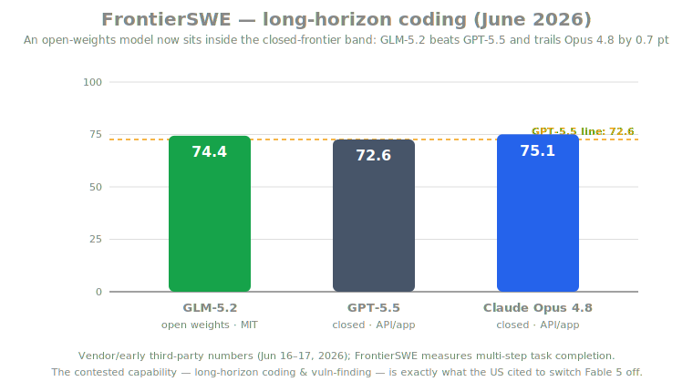
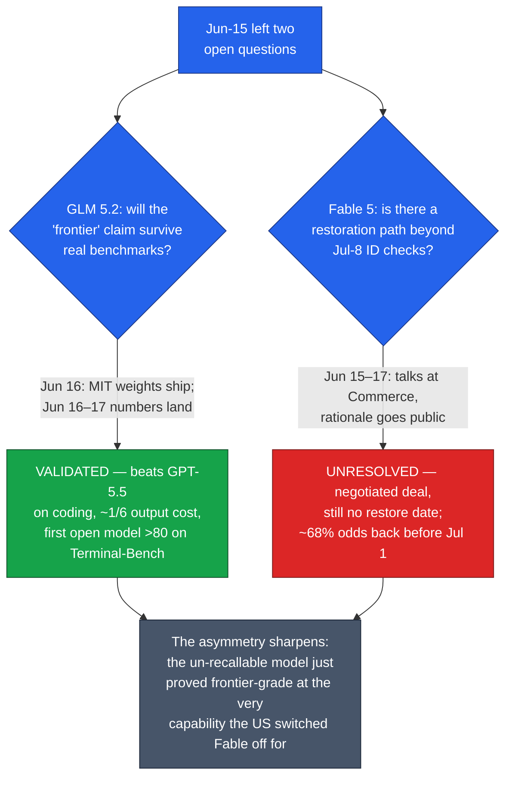

# LLM Updates — 2026-Jun-18

Thursday brief, written Thu Jun 18 (Los Angeles time). The Jun-15 brief
closed on two open questions. First: **would GLM 5.2's "frontier" claim
survive once the open weights dropped and third parties could measure
it?** Second: **would Fable 5 get a restoration path, and was
ID-verification the whole answer?** Both questions resolved between
Jun 16 and Jun 17 — and they resolved in *opposite* directions, which
is the point of this brief.

This report does **not** re-derive the prior thread: the Jun-12 BIS/
Commerce shutdown, the Pliny jailbreak, the system-prompt leak, the
Jul-8 ID-verification rollout, GLM 5.2's launch positioning, Meta's
Muse Spark, or Project Glasswing are all covered in the Jun-11 → Jun-15
briefs. Here we advance only what is new since Monday: **GLM 5.2's
open weights landed and the benchmarks validated the claim**, and the
**Fable 5 endgame became a negotiation** — with a public rationale, an
industry counter-letter, and prediction markets pricing a return.

---

## The split verdict in one picture

---

## 1. GLM 5.2: the open weights landed — and the claim held

Jun-15 flagged the conspicuous gap in Z.ai's launch: **zero benchmarks
published**, so "frontier" was a positioning claim, not a measured fact.
That gap closed fast. The full weights shipped on **Hugging Face under an
MIT license on Jun 16** (`zai-org/GLM-5.2`), and within a day vendor and
early third-party numbers were out. They back the claim — at least on
long-horizon coding.

| Benchmark | GLM-5.2 (open) | GPT-5.5 | Claude Opus 4.8 | Note |
|---|---|---|---|---|
| **SWE-bench Pro** | **62.1** | 58.6 | — | up from GLM-5.1's 58.4 |
| **FrontierSWE** (long-horizon) | 74.4 | 72.6 | **75.1** | GLM beats GPT-5.5, trails Opus by 0.7 |
| **Terminal-Bench** | **81.0** | — | — | first open-weights model to cross 80 |
| Context window | **1M tokens** | — | — | up from GLM-5.1's ~200K |
| Params | ~**744–753B** MoE (~40B active) | — | — | text-only |
| API price (out / in per 1M) | **$4.40 / $1.40** | $30 / $5 | — | ~6.8× cheaper output |

Simon Willison's read — **"probably the most powerful text-only
open-weights LLM"** — is the fair summary: it leads the *open* field
decisively and sits inside the *closed* frontier band rather than at the
top of it. VentureBeat's "beats GPT-5.5 at ~1/6 the cost" headline
bundles capability with price; at the per-token level the honest figure
is roughly **6.8× cheaper on output, ~3.6× on input**, so "1/6" tracks
the output rate, not a single blended ratio
([Simon Willison — GLM-5.2](https://simonwillison.net/2026/Jun/17/glm-52/),
[VentureBeat — GLM-5.2 beats GPT-5.5 at 1/6 the cost](https://venturebeat.com/technology/z-ais-open-weights-glm-5-2-beats-gpt-5-5-on-multiple-long-horizon-coding-benchmarks-for-1-6th-the-cost),
[llm-stats — GLM-5.2 specs & pricing](https://llm-stats.com/models/glm-5.2),
[Artificial Analysis — GLM-5.2](https://artificialanalysis.ai/models/glm-5-2)).

**The one real caveat is sourcing, not capability.** The numbers are
vendor and early-third-party, not yet a settled independent consensus —
treat the exact decimals as provisional. And there are now *two* GLM 5.2s
in practice: the **MIT weights you run yourself** (no data leaves your
infra) and **Z.ai's hosted API**, where reporting flags **China data
risk** — prompts and code transit a PRC-jurisdiction service. For the
open/closed-resilience argument that's been the throughline of the week,
that distinction matters: the *durability* benefit (can't be recalled)
only fully accrues if you run the weights, not the API
([TechTimes — GLM-5.2 open weights live, API carries China data risk](https://www.techtimes.com/articles/318543/20260617/glm-52-open-weights-live-top-coding-benchmark-api-use-carries-china-data-risk.htm)).

### Why it matters
Jun-15 said to "treat 'frontier' as a positioning claim until the open
weights land and third parties measure them." They landed; the claim
held for coding. An **un-recallable, MIT-licensed** model now matches the
closed US frontier on **long-horizon coding and terminal/agent tasks** —
the exact capability cluster the US government cited to switch Fable 5
off. That is the week's irony stated as a benchmark.

---

## 2. Fable 5: the shutdown became a negotiation

The bigger movement since Monday is that the export action stopped being
an unexplained directive and became a **bargaining process** with a
visible rationale and an organized industry pushback.

**The rationale is now on the record.** Commerce Secretary **Howard
Lutnick** is the named decision-maker: he ordered the worldwide
suspension and the foreign-national block because officials feared the
models could be **diverted to military-intelligence users in China,
Russia, or other countries of concern**. That confirms and sharpens the
Jun-14 Semafor "China angle" — the worry is *diversion to adversary
state users*, which is why the order is scoped to foreign nationals
rather than a blanket capability recall
([Axios — Trump admin blocks foreign access to Anthropic's most powerful AI](https://www.axios.com/2026/06/12/anthropic-trump-mythos-fable-national-security),
[Yahoo/Reuters — US saw risk of models being diverted to foreign military intelligence](https://www.yahoo.com/news/politics/articles/anthropic-us-officials-meeting-monday-151958785.html)).

**The talks are concrete.** Senior Anthropic technical staff met
officials at the **Department of Commerce** on Monday (Jun 15); **National
Cyber Director Sean Cairncross** joined the working-level meeting. The
government wants **assurances the models can't be used to harm the US**;
Anthropic is pushing to restore access, arguing a *narrow* jailbreak
shouldn't justify recalling a model already deployed to hundreds of
millions. Multiple outlets describe the two sides as "working toward a
deal"
([CNBC — Anthropic to meet with Trump administration over Mythos dispute](https://www.cnbc.com/2026/06/15/anthropic-mythos-trump-ai.html),
[IBTimes — Anthropic seeks deal after Fable 5 shutdown](https://www.ibtimes.com/anthropic-seeks-deal-trump-administration-after-fable-5-model-shutdown-3804162)).

**Industry organized against the order — awkwardly.** **~80 cybersecurity
executives and experts** — including leaders at firms such as **Nvidia
and Adobe** — signed an open letter to Lutnick and Cairncross asking them
to lift the restrictions and "commit to an open, scientific and
transparent process" for future AI risk assessments. Their core argument
is a capability-substitution one: Anthropic's models are "quite good at
finding flaws" but **"not uniquely good"**, since many models are used
for security audits and red-teaming daily — so gating one vendor buys
little security. The wrinkle, noted by reporters: **some signatories
spent April warning how dangerous these very capabilities were**
([PYMNTS — cybersecurity experts ask feds to lift Mythos restrictions](https://www.pymnts.com/news/artificial-intelligence/2026/cybersecurity-experts-ask-feds-to-lift-restrictions-on-mythos/),
[Eastern Herald — security executives tell Lutnick to free Fable](https://easternherald.com/2026/06/15/security-executives-free-fable-anthropic-export-controls-lutnick-june-2026/)).

**Markets are pricing a quick return.** As of Jun 16–17, **Kalshi** put
**~68%** on restoration before **Jul 1** and **~74%** by mid-July;
**Polymarket** showed ~67% by Jul 1, with "July 1" the single most-likely
dated outcome. As of this writing there is **still no official
restoration date** — the markets are betting on the negotiation, not on
an announcement
([CNBC — Kalshi traders think Anthropic will restore access quickly](https://www.cnbc.com/2026/06/16/kalshi-traders-think-anthropic-will-restore-access-to-ai-model-quickly.html),
[Yellow.com — traders give Fable 5 a 74% shot by mid-July](https://yellow.com/news/fable-5-traders-74-shot-mid-july-return)).

### Why it matters
Jun-15 framed **ID verification** (Jul 8) as "the bridge back." It now
looks like one *component*, not the whole answer: the real bridge is a
**negotiated assurance package** with Commerce, of which identity/KYC
gating is the enforcement mechanism. The precedent is hardening exactly
as flagged — the lever the US reached for is **access control plus
deal-making**, not weights — but the new data point is that **industry
will publicly contest a national-security AI order**, and that the
contest centers on a falsifiable claim: *is this capability actually
unique?* GLM 5.2's benchmarks (§1) are, inconveniently for the order,
direct evidence that it is not.

---

## 3. Technique watch: the long-context squeeze continues

No new flagship architecture shipped this week, but the research arc
underneath GLM 5.2's headline **1M-token window** kept moving, and it's
the same pressure the Jun-15 brief named: **cheap long context, not raw
parameter count, is the contested frontier.** The active vein is
**sparse attention + KV-cache compression** — exploiting that during
decoding only a small fraction (often ~5%) of KV entries materially
affect the output:

- **Self-Indexing KVCache** — treats compressed keys as a self-indexing
  structure via a sign-based **1-bit vector quantization** scheme,
  predicting sparse attention with no external index or learned
  predictor; a lightweight fit for memory-constrained inference
  ([arXiv 2603.14224](https://arxiv.org/html/2603.14224v1)).
- **LongSight** — algorithm/hardware co-design that offloads KV storage
  to **compute-enabled CXL memory**, running dense attention on a
  sliding window and pushing sparse attention to the memory device
  ([MICRO '25 / ACM](https://dl.acm.org/doi/10.1145/3725843.3756062)).
- **SpecAttn** — co-designs sparse attention with **self-speculative
  decoding**, attacking the KV-access bottleneck and decode latency
  together ([arXiv 2602.07223](https://arxiv.org/pdf/2602.07223)).

These are the productization pipeline behind "1M context for $1.40 /
1M input tokens." The takeaway is unchanged but reinforced: the
economically decisive battle is in the **attention/KV layer**, and it's
what lets an open-weights MoE advertise — and increasingly *deliver* —
context windows that used to be a closed-frontier differentiator
([Sebastian Raschka — LLM research papers 2026, part 1](https://magazine.sebastianraschka.com/p/llm-research-papers-2026-part1)).

---

## What to watch next

1. **A Fable 5 / Mythos 5 restoration announcement.** Markets say
   late-June to mid-July. Watch whether the deal narrows the order
   (foreign-national scope only), pairs restoration with the Jul-8 ID
   gate, or attaches new monitoring/assurance terms — and whether Mythos
   (the GA, vuln-finding sibling) returns on the same timeline as Fable.
2. **Independent GLM 5.2 numbers.** The vendor/early figures need to
   settle into an Artificial Analysis / third-party consensus. Watch
   especially whether the **1M context is *usable* (recall) or merely
   advertised**, and whether non-coding evals (reasoning, multilingual)
   keep pace with the coding scores.
3. **Does the "not uniquely good" argument stick?** If Commerce accepts
   capability-substitution (many models find vulns) as grounds to lift,
   single-vendor export controls on a capability look unworkable. If it
   doesn't, expect the same lever pointed at the next lab that ships a
   strong security-reasoning model.

---

## Sources

GLM 5.2 — open weights & benchmarks
- [Simon Willison — GLM-5.2 is probably the most powerful text-only open-weights LLM](https://simonwillison.net/2026/Jun/17/glm-52/)
- [VentureBeat — Z.ai's open-weights GLM-5.2 beats GPT-5.5 on long-horizon coding for 1/6th the cost](https://venturebeat.com/technology/z-ais-open-weights-glm-5-2-beats-gpt-5-5-on-multiple-long-horizon-coding-benchmarks-for-1-6th-the-cost)
- [TechTimes — GLM-5.2 open weights live; top coding benchmark, API use carries China data risk](https://www.techtimes.com/articles/318543/20260617/glm-52-open-weights-live-top-coding-benchmark-api-use-carries-china-data-risk.htm)
- [llm-stats — GLM-5.2 benchmarks, pricing & context window](https://llm-stats.com/models/glm-5.2)
- [Artificial Analysis — GLM-5.2 intelligence, performance & price](https://artificialanalysis.ai/models/glm-5-2)
- [DigitalApplied — GLM-5.2 benchmarks: open weights vs Claude Opus 4.8](https://www.digitalapplied.com/blog/glm-5-2-benchmarks-open-weights-vs-claude-opus)
- [Cryptobriefing — Z.AI's GLM-5.2 outperforms GPT-5.5 at one-sixth the cost](https://cryptobriefing.com/z-ai-glm-5-2-outperforms-gpt-5-5-coding/)

Fable 5 / Mythos 5 — negotiation, rationale, industry letter
- [Axios — Trump admin blocks foreign access to Anthropic's most powerful AI](https://www.axios.com/2026/06/12/anthropic-trump-mythos-fable-national-security)
- [CNBC — Anthropic to meet with Trump administration over Mythos dispute](https://www.cnbc.com/2026/06/15/anthropic-mythos-trump-ai.html)
- [The Globe and Mail — Anthropic, Trump officials working toward deal to restore Fable 5 and Mythos 5](https://www.theglobeandmail.com/business/article-anthropic-trump-officials-deal-restore-fable-5-mythos-5/)
- [IBTimes — Anthropic seeks deal with Trump administration after Fable 5 shutdown](https://www.ibtimes.com/anthropic-seeks-deal-trump-administration-after-fable-5-model-shutdown-3804162)
- [Yahoo/Reuters — US saw risk of Anthropic models being diverted to foreign military intelligence](https://www.yahoo.com/news/politics/articles/anthropic-us-officials-meeting-monday-151958785.html)
- [PYMNTS — Cybersecurity experts ask feds to lift restrictions on Mythos](https://www.pymnts.com/news/artificial-intelligence/2026/cybersecurity-experts-ask-feds-to-lift-restrictions-on-mythos/)
- [Eastern Herald — Security executives tell Lutnick to free Fable](https://easternherald.com/2026/06/15/security-executives-free-fable-anthropic-export-controls-lutnick-june-2026/)
- [IAPP — The global implications of the White House's export controls on Anthropic](https://iapp.org/news/a/the-global-implications-of-the-white-houses-export-controls-on-anthropic)

Prediction markets
- [CNBC — Prediction-market traders think Anthropic will restore access quickly](https://www.cnbc.com/2026/06/16/kalshi-traders-think-anthropic-will-restore-access-to-ai-model-quickly.html)
- [Yellow.com — Traders give Fable 5 a 74% shot at returning by mid-July](https://yellow.com/news/fable-5-traders-74-shot-mid-july-return)
- [Polymarket — Claude Fable 5 restored for US customers by…?](https://polymarket.com/event/claude-fable-5-restored-for-us-customers-by-20260613193753196)

Technique watch (long-context / KV-cache efficiency)
- [arXiv — Self-Indexing KVCache: predicting sparse attention from compressed keys](https://arxiv.org/html/2603.14224v1)
- [ACM/MICRO '25 — LongSight: compute-enabled memory for large-context LLMs](https://dl.acm.org/doi/10.1145/3725843.3756062)
- [arXiv — SpecAttn: co-designing sparse attention with self-speculative decoding](https://arxiv.org/pdf/2602.07223)
- [Sebastian Raschka — LLM research papers 2026, part 1](https://magazine.sebastianraschka.com/p/llm-research-papers-2026-part1)

---

*Generated 2026-Jun-18 (Los Angeles time). This brief continues the
Jun-11 → Jun-15 Fable 5 / open-weights thread and does not re-derive
prior coverage. Several figures (GLM 5.2 benchmark decimals, prediction-
market odds, the "deal" status) are vendor-stated, early-third-party, or
fast-moving as of Jun 17–18 and are flagged as such above; no official
Fable 5 restoration date had been announced at the time of writing. Some
sources could not be fetched directly due to access restrictions and are
cited from corroborated search summaries.*
