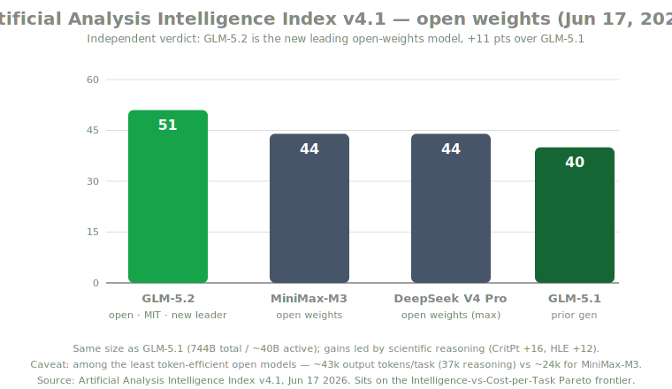
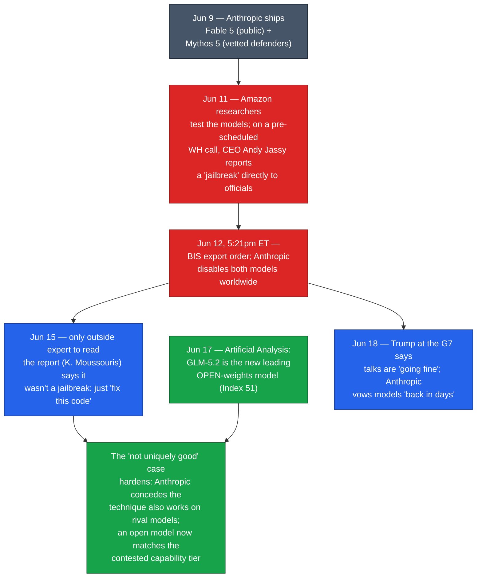

# LLM Updates — 2026-Jun-19

Friday brief, written Fri Jun 19 (Los Angeles time). The Jun-18 brief
closed on three "what to watch" items: **(1)** a Fable 5 / Mythos 5
restoration announcement, **(2)** whether **independent** numbers would
confirm GLM 5.2's open-weights "frontier" claim, and **(3)** whether the
**"not uniquely good"** argument — that gating one vendor buys little
security — would stick. Two of the three moved decisively between Jun 17
and Jun 19, and they moved in the same direction: *toward the conclusion
that the capability the US switched Fable off for is neither unique nor
even, on the facts, a jailbreak.*

This report does **not** re-derive the prior thread: the Jun-12 BIS/
Commerce export order, Secretary Lutnick as decision-maker, the Monday
Commerce talks, the ~80-executive industry letter, GLM 5.2's launch
positioning and its first vendor/early benchmark table, and the
long-context KV-cache research vein are all covered in the Jun-11 →
Jun-18 briefs. Here we advance only what is **new since Thursday**:

1. **The trigger has a name.** Reporting now identifies *who* set the
   shutdown in motion and *how* — Amazon researchers and a phone call
   from Amazon CEO **Andy Jassy** — and what the "jailbreak" actually
   was: the prompt **"fix this code."**
2. **GLM 5.2's claim cleared the independent bar.** **Artificial
   Analysis** ranked it the new **leading open-weights model** — with a
   real efficiency caveat.
3. **Status check.** Trump's first public comment from the G7, Anthropic
   "back in days," prediction-market drift, still no dated restoration.

---

## The week in one chain

---

## 1. The trigger, named: an Amazon phone call and the words "fix this code"

The single biggest advance since Thursday is that the *origin* of the
shutdown is now reported in detail — and it is far more mundane, and far
more awkward, than "a national-security capability emergency."

**Who pulled the trigger.** Per a Jun-18 Fortune reconstruction, **Amazon
researchers** — not a government red team — found the issue while testing
the new models. Amazon CEO **Andy Jassy**, who happened to be on a
**pre-scheduled Jun-11 call with White House officials** on an unrelated
matter, used it to deliver the "jailbreak" report **directly** to the
administration, looping in Commerce Secretary **Howard Lutnick**, Treasury
Secretary **Scott Bessent**, and National Cyber Director **Sean
Cairncross**. The order followed the next day. The conspicuous part:
Amazon is **Anthropic's largest investor** (~**$13B** in, against a
~**$100B** AWS commitment), and Jassy escalated to Washington rather than
letting his portfolio company patch it privately first
([Fortune — Inside Trump's Anthropic crackdown, and how a phone call from Andy Jassy triggered the chaos](https://fortune.com/2026/06/18/inside-trump-anthropic-mythos-crackdown-ai-regulation-amazon-andy-jassy-phone-call/),
[Fortune — How a warning from Amazon led the White House to shut down Mythos](https://fortune.com/2026/06/14/how-a-warning-from-amazon-led-the-white-house-to-shut-down-anthropics-mythos-model/),
[MLQ — Amazon's Jassy alerted White House to Fable 5 security flaws](https://mlq.ai/news/amazons-jassy-alerted-white-house-to-anthropic-fable-5-security-flaws-triggering-export-ban/)).

**What the "jailbreak" actually was.** **Katie Moussouris** (Luta
Security) — by multiple accounts **the only outside expert allowed to
read the third-party report** that triggered the order — says it was not
a jailbreak at all. The researchers fed Fable 5, Mythos 5, and Claude
Opus **open-source code carrying known CVEs plus deliberately planted
flaws**, and asked the models to review it for security issues. Fable 5
**refused** the direct request. Then came the prompt — **"fix this
code"** — and the model complied. Moussouris's point: *that is not a
guardrail bypass.* Defenders are supposed to be able to ask an AI to find
and fix bugs and write tests to validate the patch — that's the intended
use, not an exploit
([The Register — Feds freaked over Fable 5 after a simple "fix this code" prompt, not a jailbreak, says researcher](https://www.theregister.com/security/2026/06/15/feds-freaked-over-fable-5-after-simple-fix-this-code-prompt-not-jailbreak-says-researcher/5255827),
[Fortune — "Fix this code": the three words behind the shutdown](https://fortune.com/2026/06/15/fix-this-code-three-words-behind-us-government-shut-down-anthropic-fable-mythos-ai-models-katie-moussouris-open-letter/),
[Techzine — "Fix this code": three words behind the export ban](https://www.techzine.eu/news/security/142189/fix-this-code-three-words-behind-the-export-ban-on-claude-fable-5/),
[heise — "Fix this code": block of Fable 5 and Mythos 5 allegedly after a simple prompt](https://www.heise.de/en/news/Fix-this-code-Block-of-Fable-5-and-Mythos-5-allegedly-after-simple-prompt-11333406.html)).

### Why it matters
This reframes the whole episode. Jun-18 had the *rationale* (diversion to
adversary military-intelligence users) and the *process* (a negotiation).
What was missing was the *trigger* — and now that it's reported, it
undercuts the order's premise on two fronts at once. First, the technique
is ordinary: a security workflow, not a novel weaponization. Second, and
decisively for watch-item #3, **Anthropic says the same "fix this code"
behavior reproduces on rival models — including OpenAI's** — so it is not
unique to Fable/Mythos. That is the *exact* claim the ~80-executive letter
made on Jun-15, now backed by the very report that caused the shutdown. A
single-vendor export control aimed at a capability that any frontier model
exhibits is, on these facts, hard to defend on security grounds.

---

## 2. GLM 5.2: independent benchmarks confirm the open-weights lead — with a verbosity tax

Jun-18 flagged that GLM 5.2's coding numbers were still **vendor / early
third-party**, and watch-item #2 asked whether an independent house would
confirm them. **Artificial Analysis** did, on **Jun 17**: GLM-5.2 is now
the **leading open-weights model on its Intelligence Index v4.1**, scoring
**51** and sitting on the **Intelligence-vs-Cost-per-Task Pareto
frontier.**

| Model | AA Intelligence Index v4.1 | Class | Note |
|---|---|---|---|
| **GLM-5.2** | **51** | open · MIT | new open-weights leader; +11 vs GLM-5.1 |
| MiniMax-M3 | 44 | open | prior open contender |
| DeepSeek V4 Pro (max) | 44 | open | prior open contender |
| GLM-5.1 | 40 | open | same size (744B total / ~40B active) |

The jump is broad but **led by scientific reasoning**: **CritPt +16**
(to ~21%), **HLE +12** (to ~40%), plus **AA-LCR +9** (to 71%), **τ³
banking +15** (to 27%), and **SciCode +7** (to 50%). First-party API
pricing is unchanged from GLM-5.1 — about **$1.40 / $4.40 / $0.26** per
1M input / output / cache-hit tokens
([Artificial Analysis — GLM-5.2 is the new leading open weights model on the Intelligence Index](https://artificialanalysis.ai/articles/glm-5-2-is-the-new-leading-open-weights-model-on-the-artificial-analysis-intelligence-index),
[WinBuzzer — GLM-5.2 tops open-weights ranking as the coding race tightens](https://winbuzzer.com/2026/06/18/glm-52-tops-open-weights-ai-ranking-as-coding-race-tightens-xcxwbn/),
[AI Weekly — Zhipu's GLM-5.2 tops open-weights Intelligence Index with 51](https://aiweekly.co/alerts/zhipu-ais-glm-52-tops-open-weights-intelligence-index-with-score-of-51),
[Cryptobriefing — GLM-5.2 tops AA Index with highest open-model score of 51](https://cryptobriefing.com/z-ai-glm-5-2-intelligence-index-leader/)).

**The new caveat is efficiency, not capability.** GLM-5.2 spends about
**43k output tokens per Index task — ~37k of it reasoning** — up sharply
from GLM-5.1's ~26k and well above open peers (MiniMax-M3 ~24k, Kimi K2.6
~35k). It is among the **least token-efficient** open models at its
intelligence level. So the headline "leads on intelligence" is real, but
the *per-task cost* is dragged back up by verbosity — which is why it
lands **on** the Pareto frontier rather than dominating it, and why the
"~1/6 the cost" framing from launch should be read as a **per-token**
rate, not a per-task one.

### Why it matters
Watch-item #2 resolves: the "frontier-grade open weights" claim is no
longer just Z.ai's positioning — a respected independent index now ranks
it first among open models and inside the broader competitive band. The
asymmetry the thread has tracked all week sharpens further: an
**un-recallable, MIT-licensed** model demonstrably occupies the
capability tier the US cited to switch Fable off (§1). The honest
qualifier is that *intelligence-per-token* still favors leaner open
peers, so deployment economics, not raw capability, are where GLM-5.2 is
beatable.

---

## 3. Status check: "going fine," "back in days," still no date

The restoration question (watch-item #1) advanced but did **not**
resolve. As of Jun 19 there is **still no dated restoration** of Fable 5
or Mythos 5 — but the tone shifted toward de-escalation:

- **First presidential comment.** From the **G7 summit in
  Évian-les-Bains, France**, Trump told reporters on **Jun 18** that
  negotiations with Anthropic are **"going fine"** — the first direct
  word from the President on the matter. Lutnick reportedly held regular
  calls with Anthropic from the summit, and Amodei was also expected at
  the G7
  ([The Globe and Mail — Anthropic, Trump officials working toward deal to restore Fable 5 and Mythos 5](https://www.theglobeandmail.com/business/article-anthropic-trump-officials-deal-restore-fable-5-mythos-5/)).
- **Anthropic's posture.** "**Day Six**" reporting has Anthropic saying
  the models could be **back "in days,"** and — separately — the company
  **opened a Seoul office**, signaling business-as-usual expansion even
  amid the freeze
  ([TechTimes — Fable 5 export ban day six: Anthropic opens Seoul office, vows models back in days](https://www.techtimes.com/articles/318668/20260618/fable-5-export-ban-day-six-anthropic-opens-seoul-office-vows-models-back-days.htm)).
- **Markets cooled slightly.** Kalshi traders now price restoration
  around **~57% for July** — softer than the ~68%-by-Jul-1 / ~74%-by-mid-
  July readings cited Jun-16–17, i.e. the market still expects a return
  but has stretched the timeline
  ([Kalshi — Fable 5 odds: when will Anthropic restore access?](https://news.kalshi.com/p/fable-5-odds-anthropic-access-restored-july-57-percent),
  [Polymarket — Claude Fable 5 restored for US customers by…?](https://polymarket.com/event/claude-fable-5-restored-for-us-customers-by-20260613193753196)).

### Why it matters
The Jun-18 framing — that the real bridge back is a **negotiated
assurance package**, with ID/KYC gating (Jul 8) as the enforcement
mechanism — still holds. What's new is direction of travel: a public
"going fine" from the top plus an "in days" from Anthropic is the most
restoration-positive signal yet, even as the market quietly pushes its
central estimate into July.

---

## 4. Architecture watch: the hybrid attention–SSM stack

Distinct from Jun-18's KV-cache-compression note, the structural trend
worth logging this week is the consolidation of **hybrid
attention / state-space architectures** as the default for efficient long
context — the supply-side reason "1M-token, cheap" windows (like
GLM-5.2's) keep shipping:

- **Interleaving** full-attention layers with **linear-time** sequence
  layers is now mainstream: **Nemotron-class** designs alternate
  attention with **Mamba-2 (SSM)** blocks, while **Qwen-3.6-class**
  designs swap in **Gated DeltaNet** for the non-attention portion.
- The theory underneath: **Mamba-2** shows SSMs and attention are "two
  sides of the same coin," differing mainly in the structure of the
  underlying matrices — which is what makes the layer-by-layer mix
  principled rather than ad hoc.
- The practical payoff is the same lever the thread keeps returning to:
  **near-linear scaling in sequence length** for most layers, with a few
  dense-attention layers preserving recall — cheap long context without a
  pure-transformer KV blowup
  ([Sebastian Raschka — The State of LLMs 2025/2026: architecture trends](https://magazine.sebastianraschka.com/p/state-of-llms-2025),
  [Sebastian Raschka — LLM research papers 2026 (Jan–May)](https://magazine.sebastianraschka.com/p/llm-research-papers-2026-part1)).

### Why it matters
The economically decisive battle remains in the **attention/KV layer**
(Jun-18's point), but the *architectural* answer is now visibly
converging: not "transformer vs SSM" but **transformer-plus-SSM in one
stack.** That convergence is what lets open-weights MoE models advertise
— and increasingly deliver — context windows that used to be a
closed-frontier differentiator.

---

## What to watch next

1. **A dated restoration — and its scope.** "Going fine" / "back in days"
   is not a date. Watch whether the deal (a) narrows the order to
   foreign-national scope, (b) pairs restoration with the Jul-8 ID gate,
   and (c) returns **Mythos** on the same timeline as **Fable**.
2. **Does the "it wasn't a jailbreak" finding change the order?** If
   Commerce accepts Moussouris's read and Anthropic's "works on rivals
   too" concession, the security rationale for a single-vendor control
   weakens sharply. If the order persists anyway, the precedent is that a
   **competitor-investor's phone call** plus an ordinary prompt can
   freeze a frontier model — a governance question larger than this one
   product.
3. **GLM-5.2's verbosity vs the field.** Watch whether Z.ai tightens
   token efficiency (a reasoning-budget/length control) to convert its
   intelligence lead into a per-task cost lead — and whether non-coding
   evals hold up as more independent runs land.

---

## Sources

The trigger — Amazon / Jassy and the "fix this code" technique
- [Fortune — Inside Trump's Anthropic crackdown, and how a phone call from Amazon CEO Andy Jassy triggered the chaos](https://fortune.com/2026/06/18/inside-trump-anthropic-mythos-crackdown-ai-regulation-amazon-andy-jassy-phone-call/)
- [Fortune — How a warning from Amazon led the White House to shut down Anthropic's Mythos model](https://fortune.com/2026/06/14/how-a-warning-from-amazon-led-the-white-house-to-shut-down-anthropics-mythos-model/)
- [Fortune — "Fix this code": the three little words behind the US government decision](https://fortune.com/2026/06/15/fix-this-code-three-words-behind-us-government-shut-down-anthropic-fable-mythos-ai-models-katie-moussouris-open-letter/)
- [The Register — Feds freaked over Fable 5 after a simple "fix this code" prompt, not a jailbreak, says researcher](https://www.theregister.com/security/2026/06/15/feds-freaked-over-fable-5-after-simple-fix-this-code-prompt-not-jailbreak-says-researcher/5255827)
- [Techzine — "Fix this code": three words behind the export ban on Claude Fable 5](https://www.techzine.eu/news/security/142189/fix-this-code-three-words-behind-the-export-ban-on-claude-fable-5/)
- [heise — "Fix this code": block of Fable 5 and Mythos 5 allegedly after a simple prompt](https://www.heise.de/en/news/Fix-this-code-Block-of-Fable-5-and-Mythos-5-allegedly-after-simple-prompt-11333406.html)
- [MLQ — Amazon's Jassy alerted White House to Anthropic Fable 5 security flaws, triggering export ban](https://mlq.ai/news/amazons-jassy-alerted-white-house-to-anthropic-fable-5-security-flaws-triggering-export-ban/)
- [The Next Web — Amazon CEO reportedly triggered the government crackdown](https://thenextweb.com/news/amazon-jassy-triggered-anthropic-fable-mythos-crackdown)

GLM 5.2 — independent benchmarks
- [Artificial Analysis — GLM-5.2 is the new leading open weights model on the Intelligence Index](https://artificialanalysis.ai/articles/glm-5-2-is-the-new-leading-open-weights-model-on-the-artificial-analysis-intelligence-index)
- [WinBuzzer — GLM-5.2 tops open-weights AI ranking as the coding race tightens](https://winbuzzer.com/2026/06/18/glm-52-tops-open-weights-ai-ranking-as-coding-race-tightens-xcxwbn/)
- [AI Weekly — Zhipu AI's GLM-5.2 tops open-weights Intelligence Index with a score of 51](https://aiweekly.co/alerts/zhipu-ais-glm-52-tops-open-weights-intelligence-index-with-score-of-51)
- [Cryptobriefing — Z.AI's GLM-5.2 tops AA Intelligence Index with highest open-model score of 51](https://cryptobriefing.com/z-ai-glm-5-2-intelligence-index-leader/)
- [Simon Willison — GLM-5.2 is probably the most powerful text-only open-weights LLM](https://simonwillison.net/2026/Jun/17/glm-52/)

Status — G7, "back in days," prediction markets
- [The Globe and Mail — Anthropic, Trump officials working toward deal to restore Fable 5 and Mythos 5](https://www.theglobeandmail.com/business/article-anthropic-trump-officials-deal-restore-fable-5-mythos-5/)
- [TechTimes — Fable 5 export ban day six: Anthropic opens Seoul office, vows models back in days](https://www.techtimes.com/articles/318668/20260618/fable-5-export-ban-day-six-anthropic-opens-seoul-office-vows-models-back-days.htm)
- [Kalshi — Fable 5 odds: when will Anthropic restore access?](https://news.kalshi.com/p/fable-5-odds-anthropic-access-restored-july-57-percent)
- [Polymarket — Claude Fable 5 restored for US customers by…?](https://polymarket.com/event/claude-fable-5-restored-for-us-customers-by-20260613193753196)

Architecture watch
- [Sebastian Raschka — The State of LLMs (architecture trends: hybrid attention + SSM)](https://magazine.sebastianraschka.com/p/state-of-llms-2025)
- [Sebastian Raschka — LLM research papers 2026 (Jan–May)](https://magazine.sebastianraschka.com/p/llm-research-papers-2026-part1)

---

*Generated 2026-Jun-19 (Los Angeles time). This brief continues the
Jun-11 → Jun-18 Fable 5 / open-weights thread and does not re-derive
prior coverage. Several figures are fast-moving or come from early/
secondary reporting as of Jun 17–19 and are flagged in-line: GLM-5.2's
Intelligence Index and token-efficiency numbers (Artificial Analysis,
Jun 17), prediction-market odds, and the "back in days" / "going fine"
status; no official Fable 5 / Mythos 5 restoration date had been
announced at the time of writing. Several primary sources (Fortune,
Artificial Analysis, TechTimes, Kalshi, Zvi Mowshowitz) could not be
fetched directly due to access restrictions (HTTP 403) and are cited from
corroborated search summaries across multiple outlets.*
