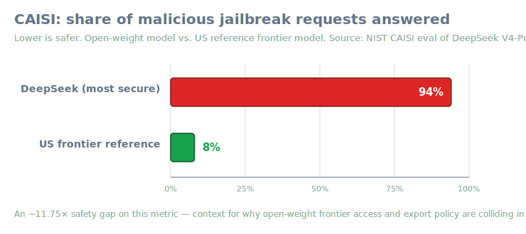
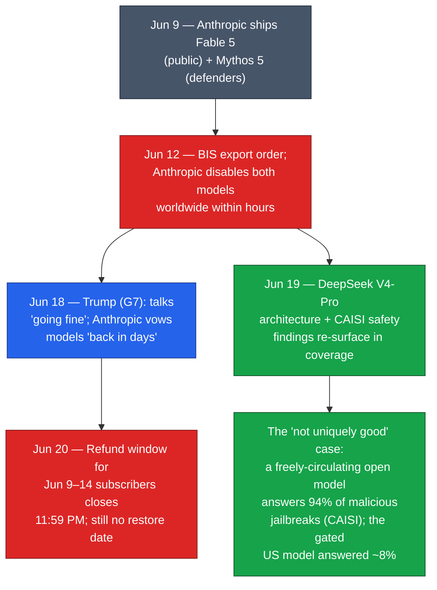

# LLM Updates — 2026-Jun-20

Saturday brief, written Sat Jun 20 (Los Angeles time). The Jun-19 brief
left three live threads: **(1)** whether Anthropic would get a dated
restoration for **Fable 5 / Mythos 5**, **(2)** whether the open-weights
"frontier" claims (GLM 5.2, MiniMax M3) would survive independent
scrutiny, and **(3)** the hardening "not uniquely good" argument — that
gating one US vendor buys little real security.

This report does **not** re-derive the prior thread: the Jun-12
BIS/Commerce export order, the Amazon/Andy Jassy "fix this code" trigger,
the Seoul-office launch, Trump's G7 "going fine" comment, GLM 5.2's
open-weights ranking, and the long-context KV-cache research vein are all
covered in the Jun-08 → Jun-19 briefs. Here we advance only what is
**new or sharpened since Friday**:

1. **The refund window closes today.** The concrete, dated consequence of
   the Fable 5 suspension lands on **Jun 20, 11:59 PM** — and there is
   still no restoration date.
2. **The "not uniquely good" argument got its sharpest data point yet.**
   A fresh wave of coverage put **DeepSeek V4-Pro**'s architecture and its
   **NIST/CAISI safety evaluation** side by side: the US gated its *safest*
   frontier model over a coding prompt, while an open-weight model that
   CAISI found answers **94%** of malicious jailbreak requests circulates
   without restriction.
3. **Open-weights "frontier" promises are slipping on delivery.**
   **MiniMax M3**'s weights and technical report — promised "within ~10
   days" of its Jun 1 launch — still were not on Hugging Face as of
   mid-June.
4. **Architecture roundup:** sparse/hybrid attention is now the dominant
   efficiency story across DeepSeek (CSA/HCA), MiniMax (MSA), and Nemotron
   (Mamba-2 hybrid).

---

## The week in one chain

---

## 1. Fable 5 / Mythos 5: the refund clock runs out today

The only hard, dated event on Jun 20 is administrative, not technical:
the **refund window closes at 11:59 PM** for subscribers who paid for
Fable 5 access during the brief **Jun 9–14** window before the global
shutdown. Coverage frames it less as a goodwill gesture than as a
**billing restructure** that customers building on the model need to plan
around — the model they paid for is simply gone, with no committed return.

Everything else remains where Friday left it:

- **No restoration date.** As of Jun 20, neither a reactivation date nor a
  formal revocation of the order exists. Anthropic's international MD said
  on Jun 18 he was "very confident" both models return "in the coming
  days"; that has not converted to a date.
- **Negotiations "going fine"** per Trump's Jun 18 G7 remark — the first
  direct presidential comment — but no terms have surfaced.
- **All other Claude models** (including Opus 4.8) remain fully available;
  the order is specific to Fable 5 and Mythos 5.

> Why it matters: the *capability* fight is now stalled, but the
> *commercial* clock is not. The refund deadline is the first point at
> which the suspension imposes a concrete, irreversible cost on customers —
> and it lands with the models still dark.

Sources: [Tech Jacks — refund window closes Jun 20](https://techjacksolutions.com/ai-brief/ai-models-news-fable-5-refund-window-closes-june-20-what-pro/) ·
[Tech Jacks — billing restructure](https://techjacksolutions.com/ai-brief/fable-5-refund-window-closes-june-20-what-anthropics-billing/) ·
[TechTimes — Day Six / Seoul / "back in days"](https://www.techtimes.com/articles/318668/20260618/fable-5-export-ban-day-six-anthropic-opens-seoul-office-vows-models-back-days.htm) ·
[explainx.ai — when will Fable 5 return](https://explainx.ai/blog/when-will-fable-5-be-available-again-2026)

---

## 2. The sharpest "not uniquely good" data point: DeepSeek V4-Pro + CAISI

A wave of Jun-19 coverage put two facts that have been circulating
separately into the same frame, and the juxtaposition is the real news.

**Fact one — the gated US model.** Fable 5 was suspended over a technique
that the only outside expert to read the report (per the Jun-15 brief)
characterized as little more than the prompt *"fix this code."* It is, on
the record, among the *most* safety-invested frontier models shipped.

**Fact two — what circulates freely.** **DeepSeek V4-Pro**, an
open-weight Chinese model, is downloadable and self-hostable by anyone.
NIST's Center for AI Standards and Innovation (**CAISI**) evaluated it and
reported that DeepSeek's **most secure configuration still answered ~94%
of malicious jailbreak requests**, against **~8%** for US reference
frontier models — and that V4-Pro's capabilities trail the US frontier by
roughly **8 months** (April 2026 assessment). Several US agencies (e.g.,
NASA, Navy) bar DeepSeek on official devices.

The implication that critics of the Fable 5 order have been pressing:
**if the concern is dangerous capability in the wrong hands, the gating
landed on the wrong model.** The export order constrains a heavily-aligned
US model over a coding prompt, while a less-aligned open-weight model that
fails the same class of safety test by an order of magnitude is already
out of any government's reach.

> Caveat worth keeping: CAISI's jailbreak metric and the Fable 5
> "jailbreak" are *not* the same test, and "8 months behind" is a moving
> target. The point is not that the two events are equivalent, but that
> the *policy lever* (one-vendor gating) maps poorly onto the *risk
> surface* (freely-redistributable weights).

Sources: [NIST — CAISI evaluation of DeepSeek V4-Pro](https://www.nist.gov/news-events/news/2026/05/caisi-evaluation-deepseek-v4-pro) ·
[HPCwire — CAISI finds shortcomings & risks](https://www.hpcwire.com/off-the-wire/caisi-evaluation-of-deepseek-ai-models-finds-shortcomings-and-risks/) ·
[TechTimes — DeepSeek V4 architecture / what NIST found](https://www.techtimes.com/articles/318725/20260619/deepseek-v4-architecture-how-sparse-attention-cuts-inference-costs-what-nist-found.htm) ·
[TechFastForward — "8 months behind"](https://techfastforward.com/articles/nist-caisi-deepseek-v4-pro-8-months-us-frontier-benchmark-gap-2026)

---

## 3. Open-weights "frontier" — strong on benchmarks, uneven on delivery

The open-weights race continues to dominate the leaderboards, but the
gap between *announcement* and *shippable artifact* is widening.

| Model | Open weights? | Headline result | Status (Jun 20) |
|---|---|---|---|
| **DeepSeek V4-Pro** | Yes | **80.6%** SWE-bench Verified (tied w/ Gemini 3.1 Pro, top open entry); ~28–34× cheaper/token than Opus 4.8 / GPT-5.5 | Weights public; CAISI safety caveats (§2) |
| **MiniMax M3** | Promised | **59.0%** SWE-Bench Pro (vendor-run, edges GPT-5.5) | API live; **weights/tech report still not on HF** as of mid-June despite "~10 day" pledge |
| **GLM 5.2** | Yes | Artificial Analysis: leading open-weights (Index ~51) — *see Jun-17/19 briefs* | Shipped; efficiency caveat |

**The MiniMax slip matters.** "Open-weight" frontier claims are only
checkable once the weights and a technical report are out. M3's Jun-1
launch promised both "within ~10 days"; as of mid-June the MiniMaxAI
Hugging Face org still listed **M2.7** as its newest checkpoint, and no
license had been published. Until then, its 59% SWE-Bench Pro figure
remains a **vendor-run, agent-scaffolded** number, not an independent one.

Sources: [MorphLLM — DeepSeek V4: 1.6T MoE, 1M context, pricing](https://www.morphllm.com/deepseek-v4) ·
[MarkTechPost — MiniMax M3 / MSA](https://www.marktechpost.com/2026/06/01/minimax-releases-minimax-m3-with-msa-architecture-supporting-1m-token-context-native-multimodality-and-agentic-coding/) ·
[TechTimes — MiniMax M3 unverified benchmarks](https://www.techtimes.com/articles/317532/20260601/minimax-m3-open-weight-coding-model-frontier-claims-unverified-benchmarks.htm) ·
[felloai — MiniMax M3 status](https://felloai.com/minimax-m3/) ·
[llm-stats — AI model news](https://llm-stats.com/ai-news)

---

## 4. Architecture: sparse + hybrid attention is now the default efficiency play

The common thread across this generation of long-context, agentic models
is **learned sparsity in the attention layer** — an indexer decides which
past tokens actually deserve full attention — increasingly paired with
**state-space (Mamba) layers** for the cheap bulk of the context.

- **DeepSeek V4 — CSA + HCA.** *Compressed Sparse Attention* plus *Heavily
  Compressed Attention*, driven by a FP8 **Lightning Indexer** with
  ReLU-scored selection (top-k compressed tokens + a 128-token sliding
  window). Reported effect: attention cost from ~O(L²) toward ~O(L·k);
  V4-Pro at 1M context uses **~27% of the per-token FLOPs and ~10% of the
  KV-cache** of V3.2 — up to **73%** fewer inference FLOPs. A separate
  **Engram conditional-memory** module aims at O(1) factual recall,
  reportedly lifting needle-in-a-haystack from 84.2% → 97%.
- **MiniMax M3 — MSA.** *MiniMax Sparse Attention*: a lightweight index
  branch selects which past blocks need attention. Claimed at 1M context:
  ~1/20th per-token compute vs. the prior generation, >9× faster prefill,
  >15× faster decode.
- **Nemotron 3 — hybrid Mamba-2.** Alternates standard attention layers
  with **Mamba-2 state-space** layers for cheaper long-context handling —
  the leading example of the "don't pay attention's quadratic cost on
  every layer" school.
- **Inference-time scaling, tuned down.** 2026's reasoning-model work is
  shifting from "spend more tokens" toward **spending fewer reasoning
  tokens where they aren't needed** — latency and cost discipline, not
  just raw test-time compute. Representative papers: *ART* (attention
  replacement for factuality) and *FastMTP* (multi-token-prediction
  speedups).

Sources: [Sebastian Raschka — LLM research papers 2026 (Jan–May)](https://magazine.sebastianraschka.com/p/llm-research-papers-2026-part1) ·
[MorphLLM — DeepSeek V4 architecture](https://www.morphllm.com/deepseek-v4) ·
[Codersera — MiniMax M3 developer guide (MSA)](https://codersera.com/blog/minimax-m3-developer-guide/) ·
[arXiv — ART: Attention Replacement Technique](https://arxiv.org/pdf/2604.06393) ·
[arXiv — FastMTP](https://arxiv.org/pdf/2509.18362) ·
[Lambda — ICLR 2026 papers](https://lambda.ai/blog/iclr-2026-12-papers)

---

## What to watch (Jun 20 → next brief)

1. **A Fable 5 / Mythos 5 restoration date** — or a formal revocation of
   the order. The refund deadline passing today raises the stakes on
   whether "back in days" survives contact with the calendar.
2. **MiniMax M3 weights + technical report actually landing on Hugging
   Face** — the moment its 59% SWE-Bench Pro claim becomes independently
   checkable (or doesn't).
3. **Any rebuttal to CAISI from DeepSeek**, and whether the "8 months
   behind / 94% jailbreak" framing gets folded into the export-policy
   debate around the Fable 5 order.
4. **Independent V4-Pro weight audits** — none named as of Jun 20.

---

### Method & limitations

Compiled from public web search on **Jun 20, 2026 (LA time)**. Several
primary pages (NIST, TechTimes, isfableback.org) returned **HTTP 403** to
automated fetching; their claims here rest on search-result summaries and
corroborating secondary coverage, and are flagged where vendor-run or
unverified. Benchmark numbers from model makers (esp. MiniMax M3) are
**self-reported** pending independent replication. This brief intentionally
does not repeat material already covered in the Jun-08 → Jun-19 reports.
