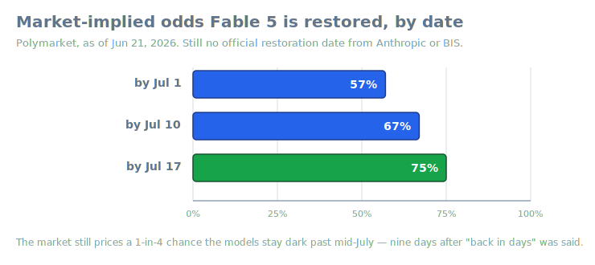
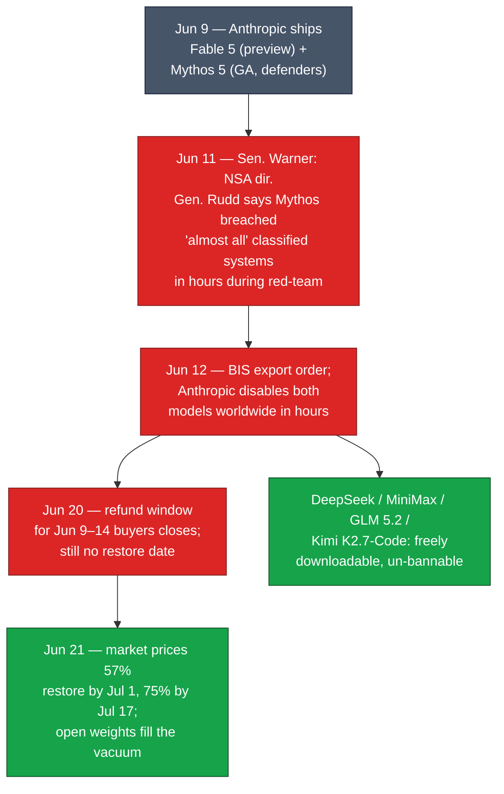
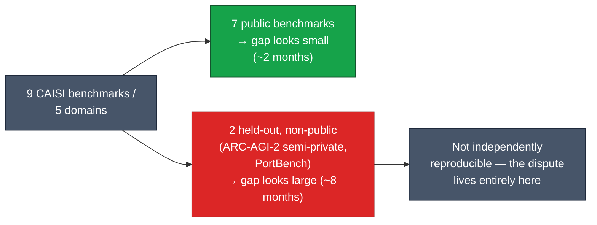
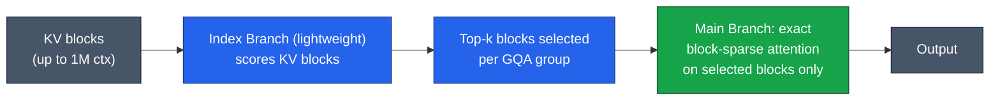

# LLM Updates — 2026-Jun-21

Sunday brief, written Sun Jun 21 (Los Angeles time). The Jun-20 report
closed with four live threads: **(1)** a Fable 5 / Mythos 5 restoration
date, **(2)** whether MiniMax M3's weights and technical report would
actually land so its benchmark claims become checkable, **(3)** any
rebuttal to CAISI from DeepSeek, and **(4)** independent V4-Pro weight
audits. Three of those moved this weekend — and one of them forces a
**correction to the prior brief**.

This report does **not** re-derive the established thread — the Jun-12
BIS/Commerce export order, the "fix this code" Fable jailbreak, the Seoul
office, Trump's G7 "going fine" remark, the refund window closing Jun 20,
the CAISI 94%-jailbreak gap, and the sparse/hybrid-attention research vein
are all covered in the Jun-08 → Jun-20 briefs. Here we advance only what
is **new or sharpened since Saturday**:

1. **The strongest "why" yet behind the ban surfaces — and it isn't
   Fable.** Coverage this weekend put the NSA director's Senate testimony
   at the center of the export story: **Mythos 5**, in a red-team
   exercise, reportedly **breached almost all of the NSA's classified
   systems "not in weeks, but in hours."** This is a materially different
   justification than the Fable "fix this code" framing — and it
   complicates last week's "not uniquely good" argument.
2. **Correction + thread resolved: MiniMax M3's weights are out, and the
   architecture is independently verified.** The Jun-20 brief flagged the
   weights as missing from Hugging Face "as of mid-June." That was stale:
   the weights have been live since ~Jun 7 and the **MSA technical report
   (arXiv:2606.13392)** is public. M3's claims are now checkable.
3. **DeepSeek's CAISI rebuttal got concrete — and partly fair.** The
   "8 months behind" gap rests on **two non-public benchmarks**
   (ARC-AGI-2 semi-private, CAISI's in-house **PortBench**), so it is
   **not independently reproducible**. DeepSeek and outside experts dispute
   the framing; the honest read is "both are right."
4. **The open-weights ecosystem has already routed around the ban.** As of
   this week the **top four models on OpenRouter are all from Chinese
   labs** (DeepSeek, MiniMax, Tencent, Xiaomi), and two labs shipped
   Fable-alternative open models within ~24h of the suspension.

---

## The export story, recompiled

---

## 1. The real trigger may be Mythos, not Fable

Last week's briefs framed the export order around **Fable 5** and a
jailbreak that an outside expert reduced to little more than the prompt
*"fix this code."* That framing powered the Jun-20 "not uniquely good"
argument: the US gated a heavily-aligned model over a coding prompt while
far less-aligned open weights circulate freely.

Weekend coverage sharpens the picture with a second, far heavier fact that
the prior briefs did **not** carry. On **Jun 11**, the day before the
order, Senate Intelligence Committee vice-chair **Mark Warner** said that
**Gen. Joshua Rudd** — head of the **NSA and US Cyber Command** — reported
that **Mythos**, in a red-team exercise, **"broke into almost all of our
classified systems, not in weeks, but in hours."** That is an
autonomous-offensive-cyber capability claim, not a content-jailbreak claim.

> Why it matters: it reframes the whole order. If the binding concern was
> **Mythos's autonomous intrusion capability** — demonstrated against the
> NSA's own systems — then "they banned a US model over *fix this code*"
> is, at best, half the story. The export action plausibly targets a
> genuinely **uniquely-capable offensive model**, which is a much stronger
> footing than the Fable framing alone.

This does **not** dissolve last week's critique — a freely-downloadable
open model that answers 94% of malicious jailbreaks (CAISI, §3) is still
outside any government's reach, so one-vendor gating still maps imperfectly
onto the risk surface. But the two facts now sit in tension: the policy
lever looks better-aimed against *Mythos's* capability than the *Fable*
coverage implied.

Caveats worth keeping: this rests on a **paraphrase of classified
testimony** relayed by a senator, not on a published technical report; the
"almost all … in hours" figure is **uncorroborated** by primary documents;
and the red-team conditions (access level, scaffolding, time budget) are
unknown. Treat it as the strongest *stated* rationale, not a verified one.

Sources:
[Senate Intel — Rudd NSA nomination hearing](https://www.intelligence.senate.gov/2026/01/20/open-hearing-nomination-of-lieutenant-general-joshua-m-rudd-to-be-director-of-the-national-security-agency/) ·
[Digg — Warner says Mythos breached classified systems](https://digg.com/tech/mno1ygvv) ·
[Inshorts — "Mythos broke into all NSA classified systems in hours"](https://inshorts.com/en/amp_news/mythos-broke-into-all-us-nsa-classified-systems-in-hours--report-1782032738742) ·
[Anthropic — statement on the suspension](https://www.anthropic.com/news/fable-mythos-access)

---

## 2. Restoration: still no date, but a market view

There is still **no official reactivation date and no formal revocation**
of the order as of Jun 21. The refund window for Jun 9–14 buyers closed
last night. What is new is a cleaner read on *expectations*: prediction
markets now price Fable 5 restoration for US customers at roughly **57% by
Jul 1, 67% by Jul 10, and 75% by Jul 17** (see chart above). The market
still assigns a **1-in-4 chance the models stay dark past mid-July** — well
past the "very confident … in the coming days" line from Anthropic's
managing director on Jun 18.

All other Claude models (including Opus 4.8) remain fully available; the
order is specific to Fable 5 and Mythos 5.

Sources:
[Polymarket — Fable 5 restored for US customers by…?](https://polymarket.com/event/claude-fable-5-restored-for-us-customers-by-20260613193753196) ·
[explainx.ai — when will Fable 5 return](https://explainx.ai/blog/when-will-fable-5-be-available-again-2026) ·
[TechTimes — "back in days"](https://www.techtimes.com/articles/318668/20260618/fable-5-export-ban-day-six-anthropic-opens-seoul-office-vows-models-back-days.htm)

---

## 3. CAISI vs DeepSeek: the "8 months behind" gap isn't reproducible

The Jun-20 brief leaned on CAISI's DeepSeek V4-Pro evaluation (94%
jailbreak compliance; ~8 months behind the US frontier). The weekend's
addition is the **rebuttal**, and it is partly legitimate.

CAISI ran V4-Pro through **nine benchmarks across five domains**. The
headline capability gap is concentrated in **two held-out benchmarks that
are not public**:

- **ARC-AGI-2 (semi-private split)** — a reasoning set whose held-out items
  are not released.
- **PortBench** — CAISI's **internally built** software-engineering eval,
  designed specifically to resist contamination from models trained
  against public benchmarks.

Because two of the nine are non-public, **the gap cannot be independently
reproduced**, and it is precisely on those two that the gap is widest. On
DeepSeek's own public evals, V4-Pro looks roughly **Opus-4.6 / GPT-5.4
class** (~2 months back); on CAISI's held-out set it looks more like
**GPT-5** class (~8 months back). CAISI itself flagged methodological
caveats (PortBench not yet in its cost methodology; ARC-AGI-2 had technical
issues scoring GPT-5.4 mini). Outside experts have pushed back on treating
"8 months" as settled fact.

> The honest synthesis (per TechFastForward's framing): **both are right.**
> A contamination-resistant, held-out benchmark is exactly what you'd trust
> *most* — and exactly what no one outside CAISI can verify. The gap is
> real on the tests that resist gaming and unverifiable to everyone else.

Sources:
[NIST — CAISI evaluation of DeepSeek V4 Pro](https://www.nist.gov/news-events/news/2026/05/caisi-evaluation-deepseek-v4-pro) ·
[Yahoo/Tech — experts dispute the 8-month claim](https://tech.yahoo.com/ai/articles/us-government-says-chinas-best-185845088.html) ·
[TechFastForward — "both are right"](https://techfastforward.com/articles/nist-caisi-deepseek-v4-pro-8-months-us-frontier-benchmark-gap-2026) ·
[Digital Watch — CAISI/NIST evaluation](https://dig.watch/updates/deepseek-v4-pro-caisi-us-nist-evaluation)

---

## 4. Correction: MiniMax M3 weights are out — and MSA is verified

The Jun-20 brief stated M3's weights and technical report "still were not
on Hugging Face as of mid-June." **That was wrong**, and the record should
be corrected: the **weights have been live on `MiniMaxAI/MiniMax-M3` since
~Jun 7**, the **MSA technical report posted to arXiv (2606.13392) on
~Jun 11**, and by Jun 18 secondary coverage was describing the architecture
as **independently verified**. M3's 59.0% SWE-Bench Pro figure remains a
**vendor-run** number, but the *model* is now fully checkable.

**What M3 actually is:** a ~**428B**-parameter (≈**23B** active) open-weight
MoE with **native multimodality** and a **1M-token** context, deployable on
SGLang / vLLM / Transformers.

**MiniMax Sparse Attention (MSA), from the report:** a **blockwise sparse
attention built on GQA**. A lightweight **Index Branch** scores key-value
blocks and independently selects a **Top-k** subset *per GQA group*, while
the **Main Branch** runs exact block-sparse attention over only the
selected blocks. Reported on a 109B research config with native multimodal
training: **on par with GQA quality** while cutting **per-token attention
compute by 28.4× at 1M context**, with co-designed kernels delivering
**14.2× prefill** and **7.6× decode** wall-clock speedups on H800.

This slots directly into the Jun-20 architecture thesis (learned sparsity
in the attention layer is the default efficiency play), and now has a
**public, peer-readable report** behind it rather than a marketing diagram.

Sources:
[arXiv:2606.13392 — MiniMax Sparse Attention](https://arxiv.org/abs/2606.13392) ·
[Hugging Face — MiniMaxAI/MiniMax-M3](https://huggingface.co/MiniMaxAI/MiniMax-M3) ·
[GitHub — MiniMax-AI/MiniMax-M3](https://github.com/MiniMax-AI/MiniMax-M3/) ·
[TechTimes — "architecture now verified"](https://www.techtimes.com/articles/318622/20260618/minimax-m3-takes-open-weight-ai-lead-sparse-attention-architecture-now-verified.htm)

---

## 5. The vacuum is already filled

The clearest second-order effect of the ban is structural, not temporary.
As of this week, **the four most-used models on OpenRouter are all from
Chinese labs** — **DeepSeek, MiniMax, Tencent, Xiaomi** — and the
open-weights ecosystem moved on the Fable gap within a day:

| Model | Lab | Open weights? | Role in the post-ban week |
|---|---|---|---|
| **GLM 5.2** | Zhipu | Yes | Explicitly positioned as a Fable alternative; tops the reasoning leaderboard US labs compete on (see Jun-17/19 briefs) |
| **Kimi K2.7-Code** | Moonshot | Yes | Coding-focused; shipped ~same day as the suspension |
| **DeepSeek V4-Pro** | DeepSeek | Yes | Top open SWE-bench entry; CAISI safety/capability dispute (§3) |
| **MiniMax M3** | MiniMax | Yes | 1M-ctx multimodal; MSA report now public (§4) |

> Why it matters: a one-vendor, US-scoped export order cannot constrain
> redistributable weights. The ban's measurable effect so far has been to
> **accelerate substitution toward open Chinese models**, not to remove the
> capability class from circulation — which is the core of the "not
> uniquely good" critique, even as §1 complicates *which* model the order
> was really aimed at.

Sources:
[The New Stack — 4 open models responded before Anthropic could restore](https://thenewstack.io/fable-ban-open-weights/) ·
[Fortune — Fable fiasco leaves the door open for open-source / Chinese AI](https://fortune.com/2026/06/16/us-anthropic-ban-open-source-ai-deepseek-zai/) ·
[explainx.ai — GLM-5.2 as China's response to the ban](https://www.explainx.ai/blog/glm-5-2-zhipu-china-ai-response-fable-5-ban-2026)

---

## What to watch (Jun 21 → next brief)

1. **A Fable 5 / Mythos 5 restoration date** — or order revocation. The
   market's 75%-by-Jul-17 line is the number to test against reality.
2. **Any primary document on the Mythos NSA red-team claim** (§1) — a
   declassified summary, an Anthropic system card addendum, or on-record
   corroboration would move it from "stated rationale" to "verified."
3. **An independent run of MiniMax M3's 59% SWE-Bench Pro** now that the
   weights are public — vendor number → reproduced number (or not).
4. **CAISI publishing reproducible methodology** for ARC-AGI-2 / PortBench,
   or a formal DeepSeek technical reply — the only way the "8 months"
   dispute (§3) gets settled rather than asserted.

---

### Method & limitations

Compiled from public web search on **Jun 21, 2026 (LA time)**. Multiple
primary pages (Hugging Face, NIST, Yahoo, The New Stack, dig.watch,
TechFastForward) returned **HTTP 403** to automated fetching; their claims
here rest on search-result summaries and corroborating secondary coverage,
and are flagged where vendor-run, paraphrased, or unverified. The **Mythos
NSA-breach** figure (§1) is a paraphrase of classified testimony relayed by
a senator and is **not independently verified**. The **MiniMax-weights
correction** (§4) revises an error in the Jun-20 brief. This report
intentionally does not repeat material already covered in the Jun-08 →
Jun-20 reports.
