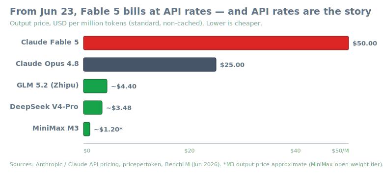
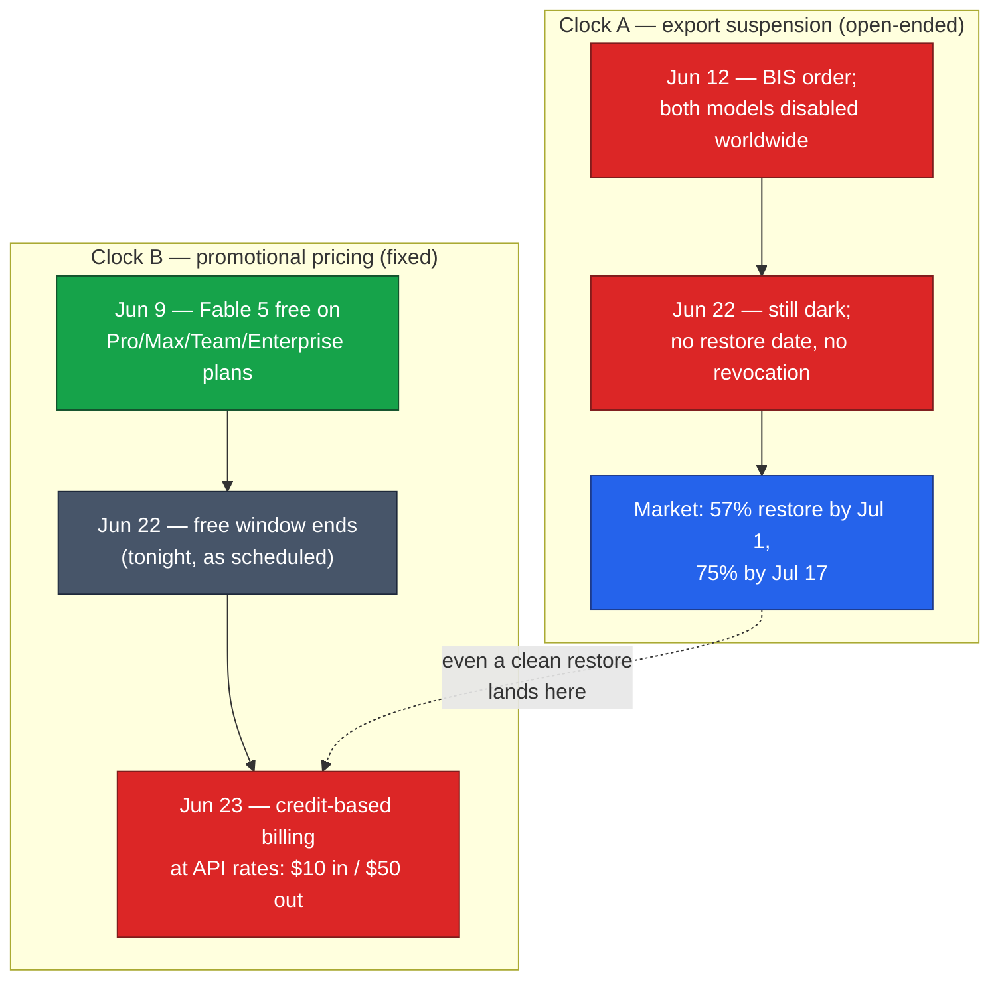
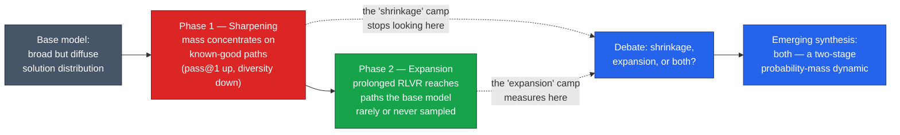

# LLM Updates — 2026-Jun-22

Monday brief, written Mon Jun 22 (Los Angeles time). The Jun-21 report
closed with four watch items: **(1)** a Fable 5 / Mythos 5 restoration date,
**(2)** a primary document on the Mythos NSA red-team claim, **(3)** an
independent run of MiniMax M3's 59% SWE-Bench Pro, and **(4)** reproducible
CAISI methodology or a formal DeepSeek reply. None of those four resolved
over the last 24 hours — but a **fifth clock**, one the prior briefs noted
only in passing, runs out **tonight**, and it changes what "restoration"
will actually mean for users.

This report does **not** re-derive the established thread — the Jun-12
BIS/Commerce export order, the Mythos NSA-breach testimony (Jun-21 §1), the
MiniMax Sparse Attention report (Jun-20/21 §4), the CAISI "8-months-behind"
dispute (Jun-20/21 §3), and the OpenRouter open-weights takeover (Jun-21 §5)
are all covered in the Jun-08 → Jun-21 briefs. Here we advance only what is
**new or sharpened since Sunday**:

1. **The free window ends tonight; the credit cliff is Jun 23.** Separate
   from the export suspension, Fable 5's *promotional* free-on-plans window
   was always scheduled to close **Jun 22**. From **Jun 23** continued use
   bills against **usage credits at full API rates** — **$10 / $50 per
   million tokens**, the most expensive generally-available model Anthropic
   ships and **2× Opus 4.8**. "Restored" will not mean "free again."
2. **Two clocks, not one.** The suspension (no restore date, no revocation)
   and the free→credit transition are independent. Even a clean restoration
   lands users on the paid tier, not back where they were on Jun 9.
3. **The price gap is the real substitution pressure.** At $50/M output,
   Fable 5 is roughly **10–40× the leading open-weight models** that filled
   the vacuum — the cost reality underneath last week's "open weights routed
   around the ban" structural story.
4. **A genuinely new technical vein: the RLVR capability-boundary debate.**
   Distinct from the sparse-attention efficiency thread the prior briefs
   tracked, 2026's sharpest open question in reasoning research is whether
   reinforcement learning with verifiable rewards **expands** what a model
   can do or only **sharpens** what it already could — with a "**both, in
   two phases**" synthesis now emerging, plus a fast-growing efficiency
   sub-line on *knowing when to stop thinking*.

---

## 1. Two clocks: the suspension, and the credit cliff

The single most useful thing to get straight today is that **two different
deadlines** are being collapsed into one in most coverage:

**Clock A** is the export order. As of Jun 22 the models remain disabled
worldwide, there is **no official restoration date and no formal
revocation**, and prediction markets are essentially unchanged from
Sunday (~57% restored by Jul 1, ~75% by Jul 17 — see the Jun-21 chart).

**Clock B** is the promotional pricing schedule, and it was set before the
ban. Fable 5 was free on Pro, Max, Team, and seat-based Enterprise plans
**only through Jun 22**. On **Jun 23**, Anthropic removes it from plan
limits; continued use draws down **usage credits billed at standard API
rates** — **$10 per million input tokens and $50 per million output
tokens**. That is double Opus 4.8 ($5 / $25) and makes Fable 5 the most
expensive generally-available model Anthropic sells.

The practical upshot: the two clocks are independent, and the one most users
will feel first is Clock B. Even if the export order lifts cleanly,
**restoration ≠ return to free** — users come back to a metered, premium
tier. Anthropic frames the credit model as a temporary **capacity**
decision, stating intent to "restore Fable 5 as a standard part of
subscription plans" once compute allows; that intent is real but undated,
and it sits behind Clock A, not in front of it.

> Why it matters: the headline question "when does Fable 5 come back?"
> quietly has two answers. The *availability* answer is gated by the export
> order (undated). The *affordability* answer flips **tomorrow**, and not in
> users' favor.

Sources:
[Anthropic — Claude Fable 5 and Mythos 5](https://www.anthropic.com/news/claude-fable-5-mythos-5) ·
[Developers Digest — Fable 5 leaves your plan Jun 22](https://www.developersdigest.tech/blog/claude-fable-5-june-22-deadline) ·
[claudefa.st — Fable 5 usage credits explained](https://claudefa.st/blog/guide/development/fable-5-usage-credits) ·
[Finout — Fable 5 / Mythos 5 pricing](https://www.finout.io/blog/claude-fable-5-mythos-5-pricing-benchmarks) ·
[Anthropic — statement on the suspension](https://www.anthropic.com/news/fable-mythos-access)

---

## 2. The price gap is the substitution engine

Last week's structural finding (Jun-21 §5) was that the ban *accelerated
substitution* toward open Chinese models — the top four on OpenRouter. The
Jun-23 credit cliff exposes the mechanism: **price**. Measured on output
tokens (the dominant cost in agentic and reasoning workloads), the standard
rates line up roughly as:

| Model | $/M input | $/M output | vs Fable 5 output |
|---|---|---|---|
| **Claude Fable 5** | $10.00 | $50.00 | 1× |
| **Claude Opus 4.8** | $5.00 | $25.00 | 0.5× |
| **GLM 5.2** (Zhipu) | ~$1.40 | ~$4.40 | ~0.09× |
| **DeepSeek V4-Pro** | ~$1.74 | ~$3.48 | ~0.07× |
| **MiniMax M3** | low | ~$1.20* | ~0.02× |

\* M3 output price approximate (open-weight tier; vendor/proxy figure).

The open-weight frontier now delivers near-Opus-class capability (per the
Jun-17/19 GLM 5.2 validations and the Jun-20/21 V4-Pro/M3 entries) at
**roughly one-tenth to one-fortieth** of Fable 5's metered output cost — and
those models are *downloadable*, so the export order cannot reach them. The
credit cliff doesn't create that gap, but it makes it visible to exactly the
plan users who got 13 free days and now face an API meter.

> Why it matters: a US-scoped, single-vendor export order plus a premium
> metered fallback is, jointly, a pricing argument *for* the substitutes it
> was meant to disadvantage. The cheapest way to keep doing the work after
> Jun 23 is, for many users, an open Chinese model — which is the "not
> uniquely good / un-bannable" critique restated in dollars.

Sources:
[Claude API pricing](https://platform.claude.com/docs/en/about-claude/pricing) ·
[pricepertoken — Opus 4.8 pricing](https://pricepertoken.com/pricing-page/model/anthropic-claude-opus-4.8) ·
[BenchLM — LLM API pricing comparison](https://benchlm.ai/llm-pricing) ·
[pricepertoken — DeepSeek V4-Pro pricing](https://pricepertoken.com/pricing-page/model/deepseek-deepseek-v4-pro) ·
[The New Stack — open models filled the gap](https://thenewstack.io/fable-ban-open-weights/)

---

## 3. New technical vein: does RLVR expand reasoning, or just sharpen it?

The prior briefs tracked efficiency at the **attention layer** (sparse /
hybrid attention, MSA). The freshest live debate in *reasoning* research is
at the **training-objective layer**: when you post-train a model with
**reinforcement learning from verifiable rewards (RLVR)** — the GRPO/GSPO
recipe behind the R1-style reasoners — does it add genuinely new reasoning
ability, or merely raise the probability of solutions the base model could
already reach?

Two camps had been talking past each other. The **shrinkage** camp shows
RLVR mainly improves *sampling efficiency* (higher pass@1) while **reducing
diversity** — i.e., it sharpens existing primitives rather than inventing
new ones; on this view RLVR's gains live inside the base model's reachable
set. The **expansion** camp shows that *prolonged* RLVR can discover
strategies the base model essentially never sampled, extending the
capability boundary.

The 2026 synthesis worth flagging is the **two-stage dynamic view**: both
are right, in sequence. Early training **concentrates** probability mass on
known-good reasoning paths (looks like shrinkage); sustained training can
then **redistribute** mass toward genuinely new paths (looks like
expansion). A complementary "**Multiplicative Barrier**" framing explains
*why* this is hard — success probability decays roughly exponentially with
chain length, so RLVR's job is as much about not compounding errors over a
long chain as about any single step.

Riding alongside is a fast-growing **efficiency** sub-line — *adaptive
reasoning length*: teaching models to spend tokens in proportion to problem
difficulty and to **stop thinking when they implicitly already know the
answer**, via length penalties and reward shaping (e.g. Leash) or
stop-aware sampling. This is the reasoning-time analogue of sparse
attention: same capability, fewer tokens — and it bears directly on why
Kimi K2.7-Code (Jun-21 §5) advertised ~30% fewer thinking tokens.

> Why it matters for readers of this series: it reframes "is the model
> smarter?" as two measurable questions — *did the reachable set grow* (the
> boundary debate) and *did it get cheaper to reach* (adaptive length). Both
> are now things you can benchmark, not vibes.

Caveats: these are research-paper findings, several on smaller/open models;
the "two-stage" synthesis is a recent framing, not settled consensus, and
results vary by base model and task. Treat the diagram as the *shape* of the
debate, not a proven mechanism.

Sources:
[arXiv:2602.08281 — New Skills or Sharper Primitives? (RLVR emergence)](https://arxiv.org/pdf/2602.08281) ·
[arXiv:2510.04028 — The Debate on RLVR Reasoning Capability Boundary: shrinkage, expansion, or both?](https://arxiv.org/pdf/2510.04028) ·
[arXiv:2602.08354 — Does your reasoning model know when to stop thinking?](https://arxiv.org/pdf/2602.08354) ·
[arXiv:2512.21540 — Leash: adaptive length penalty for efficient reasoning](https://arxiv.org/pdf/2512.21540) ·
[Sebastian Raschka — LLM research papers 2026 (Jan–May)](https://magazine.sebastianraschka.com/p/llm-research-papers-2026-part1)

---

## 4. Watch-item status since Jun-21

| Jun-21 watch item | Movement by Jun-22 |
|---|---|
| Fable 5 / Mythos 5 restoration date | **No** — still dark, no revocation; market ~unchanged (57% Jul 1 / 75% Jul 17) |
| Primary doc on Mythos NSA red-team claim | **No** — still a paraphrase of classified testimony |
| Independent run of M3's 59% SWE-Bench Pro | **No** — all figures still vendor-run; not on independent boards |
| Reproducible CAISI methodology / DeepSeek reply | **No** — ARC-AGI-2 / PortBench still non-public |
| *(new)* Fable 5 free→credit transition | **Yes** — free window ends Jun 22; API-rate billing from Jun 23 |

---

## What to watch (Jun 22 → next brief)

1. **Whether the Jun-23 credit cliff actually triggers, or gets paused.**
   While the models are suspended there is nothing to bill; if restoration
   slips, Anthropic may quietly extend the free terms. Watch for a pricing
   clarification alongside any restore announcement.
2. **A restoration date or order revocation** (Clock A) — still the market's
   75%-by-Jul-17 line to test against reality.
3. **The first independent third-party run** of any frontier open-weight
   coding claim (M3's 59% SWE-Bench Pro, GLM 5.2's leaderboard position) now
   that weights are public — vendor number → reproduced number.
4. **Any new model drop** breaking the current cadence (GLM 5.2, Kimi
   K2.7-Code, M3 all landed mid-June); the open-weight release tempo is the
   real frontier signal while US frontier access is gated.
5. **Whether the "two-stage" RLVR framing (§3) gets a clean empirical test**
   on a frontier-scale model rather than research configs.

---

### Method & limitations

Compiled from public web search on **Jun 22, 2026 (LA time)**. Several
primary pages (Developers Digest, llm-stats, multiple arXiv PDFs) returned
**HTTP 403** to automated fetching; their claims here rest on search-result
summaries and corroborating secondary coverage, and are flagged where
vendor-run or approximate. **Pricing** figures are standard
(non-cached/non-promotional) API rates and move frequently; the MiniMax M3
output price is approximate. The **export-suspension status** is current as
of Jun 22 with no official restoration date. The **RLVR section (§3)**
summarizes an active research debate, not settled consensus. This report
intentionally does not repeat material already covered in the Jun-08 →
Jun-21 reports.
