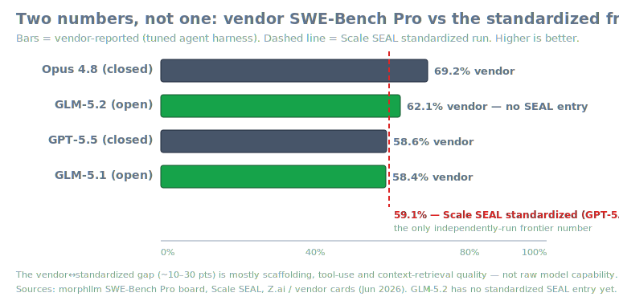
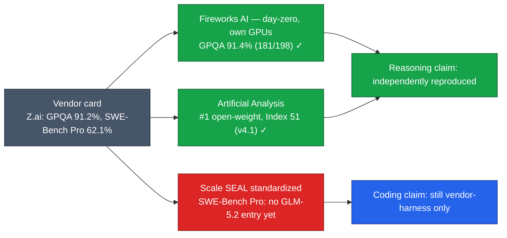
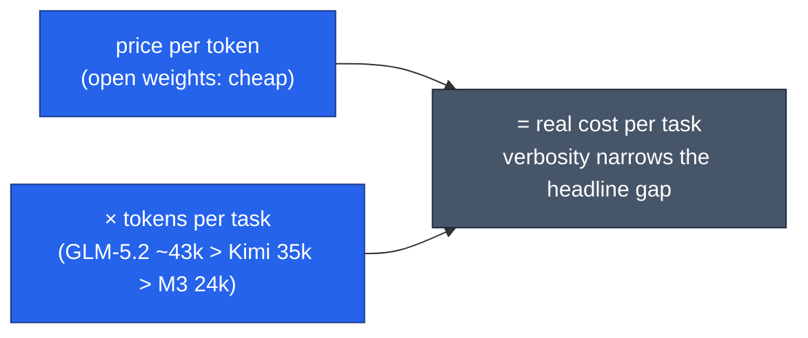
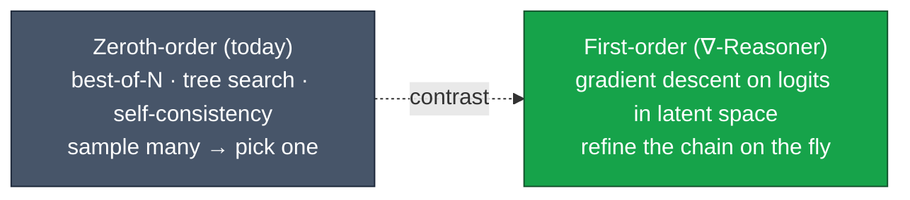

# LLM Updates — 2026-Jun-23

Tuesday brief, written Tue Jun 23 (Los Angeles time). For the last several
days every brief has carried the same unresolved line item: the open-weight
"frontier" — GLM-5.2, MiniMax M3, Kimi K2.6 — was leading the boards on
**vendor-run numbers only**. Nobody outside the labs had reproduced them.
The Jun-22 report listed "the first independent third-party run of any
frontier open-weight coding claim" as watch item **#3**, still flagged
**No**.

As of today, that item finally moves — and the way it moves is the most
useful thing to understand this week. Independent reproduction has arrived
for **GLM-5.2**, and in arriving it splits the open-weight "lead" into **two
different numbers** that the headline rankings have been quietly merging.

This report does **not** re-derive the established thread — the Jun-12
BIS/Commerce export order and Fable 5 / Mythos 5 suspension (Jun-18→22), the
Mythos NSA-breach testimony (Jun-21 §1), the MiniMax Sparse Attention report
(Jun-20/21 §4), the CAISI "8-months-behind" dispute (Jun-20/21 §3), the
two-clocks pricing framing (Jun-22 §1–2), and the RLVR
expand-vs-sharpen debate (Jun-22 §3) are all covered in the Jun-08 → Jun-22
briefs. Here we advance only what is **new or sharpened since Monday**:

1. **Verification landed for GLM-5.2.** Fireworks AI ran the open weights on
   its own infrastructure day-zero and reproduced **GPQA-Diamond 91.4%**
   (181/198) against Z.ai's vendor **91.2%**; Artificial Analysis
   independently placed GLM-5.2 **#1 among open-weight models** on its
   Intelligence Index (51 on v4.1, Jun 16). Watch item #3 → **partially
   resolved**.
2. **But verification reframes the "lead" as two numbers.** On the
   *standardized* SWE-Bench Pro board (Scale SEAL, identical scaffolding for
   every model), **GPT-5.4 leads at 59.1%** — while the vendor-harness
   numbers that crown GLM-5.2 (62.1%) and Opus 4.8 (69.2%) **sit above that
   line**, and GLM-5.2 has **no standardized SEAL entry at all yet**.
3. **The hidden cost variable is tokens-per-task, not price-per-token.**
   GLM-5.2 burns **~43k output tokens per Intelligence-Index task** vs
   MiniMax-M3's 24k and Kimi K2.6's 35k. The Jun-22 price chart said open
   weights are 10–40× cheaper per token; the verbosity tax narrows that on a
   per-*task* basis.
4. **A genuinely new technique vein: test-time gradient descent.**
   ∇-Reasoner moves inference-time scaling from discrete search to
   *first-order* optimization in latent space — distinct from both the RLVR
   *training* debate (Jun-22 §3) and the sparse-attention *efficiency* line
   (Jun-20 §4).

---

## 1. Verification finally arrives — for GLM-5.2

The change since Monday is concrete. Two independent parties — not Z.ai —
put GLM-5.2 through their own pipelines:

- **Fireworks AI** brought GLM-5.2 up on its own GPU stack **the moment
  Z.ai opened the weights** ("day zero") and re-ran the headline reasoning
  benchmark itself: **GPQA-Diamond 91.4% (181/198)**, essentially matching
  Z.ai's reported **91.2%**. Fireworks states these were "not numbers
  forwarded from someone else's endpoint" — its own infrastructure,
  reproduced independently — and that it also re-validated SWE-bench,
  Terminal-Bench and AIME on the same stack.
- **Artificial Analysis** independently scored GLM-5.2 at **51 on its
  Intelligence Index v4.1** (Jun 16), naming it the **leading open-weight
  model**, ahead of MiniMax-M3 (44), DeepSeek V4 Pro (44) and Kimi K2.6
  (43) — an **+11-point** jump over GLM-5.1.

This is the qualitative shift the prior briefs were waiting for: the
open-weight lead is no longer *only* a vendor claim. Open weights make
exactly this possible — once the weights ship under an MIT license, anyone
with GPUs can reproduce the number rather than trust a leaderboard
screenshot. That is the structural advantage the export-suspension era keeps
surfacing: a suspended closed model cannot be independently re-verified at
all; an open one is verified within hours.

Sources: [Fireworks AI blog](https://fireworks.ai/blog/glm-5p2),
[Fireworks on X](https://x.com/FireworksAI_HQ/status/2067007200426680509),
[Artificial Analysis — GLM-5.2](https://artificialanalysis.ai/articles/glm-5-2-is-the-new-leading-open-weights-model-on-the-artificial-analysis-intelligence-index),
[implicator.ai](https://www.implicator.ai/glm-5-2-becomes-the-top-open-weight-model-on-artificial-analysis/),
[Simon Willison](https://simonwillison.net/2026/Jun/17/glm-52/).

---

## 2. The vendor ↔ standardized gap is the real lesson

Reproduction is good news, but it comes with a caveat that reframes the
whole open-weight-leadership story. **Reasoning** benchmarks (GPQA, AIME)
reproduced cleanly because they are largely model-intrinsic. **Coding**
benchmarks did not get the same treatment, because SWE-Bench Pro scores
depend heavily on the *agent harness* wrapped around the model.

The morphllm SWE-Bench Pro board makes the split explicit by running **two
columns**:

| Score type | Who runs it | Headline | What it measures |
|---|---|---|---|
| **Standardized (Scale SEAL)** | Scale, identical scaffolding for all models | **GPT-5.4 (xHigh) 59.1%** | model capability under a fixed harness |
| **Vendor-reported** | each lab, tuned harness | Opus 4.8 **69.2%**, GLM-5.2 **62.1%**, GLM-5.1 58.4% | model **+** the lab's best scaffolding |

The vendor↔standardized gap runs **~10–30 points**, and per Scale it is
"mostly context retrieval and tool-use quality, **not** model capability."
Two things follow:

1. **The open-weight coding "lead" is still the unverified half.** GLM-5.2's
   62.1% is a *vendor* number; it has **no standardized SEAL entry yet**. The
   reasoning crown is reproduced; the coding crown is not.
2. **Apples-to-apples, the standardized frontier is GPT-5.4 at 59.1%** —
   *below* several vendor bars, including GLM-5.2's. When you read "X beats
   Opus on SWE-Bench Pro," check which column it's in. (See the SVG above:
   every bar is a vendor number; only the dashed line is standardized.)

This is the natural follow-on to the Jun-21/22 framing that "all figures are
still vendor-run." The fix isn't to distrust the labs — it's to read the two
numbers as answering two different questions.

Sources: [morphllm — SWE-Bench Pro board](https://www.morphllm.com/swe-bench-pro),
[CodingFleet — SWE-Bench Pro explained](https://codingfleet.com/blog/swe-bench-pro-explained-the-new-standard-for-ai-coding-benchmarks-2026/),
[llm-stats — GLM-5.2](https://llm-stats.com/models/glm-5.2).

---

## 3. The verbosity tax: tokens-per-task vs price-per-token

The Jun-22 brief's price chart established that open weights are roughly
10–40× cheaper *per token* than Fable 5's new API rates. The verification
data adds the missing variable: **how many tokens each model spends to finish
a task.**

Artificial Analysis reports GLM-5.2 consuming **~43k output tokens per
Intelligence-Index task** — up sharply from GLM-5.1 (26k) and **higher than
its open-weight peers**: MiniMax-M3 ~24k, Kimi K2.6 ~35k. So the real
end-cost comparison isn't `price/token` — it's `price/token × tokens/task`,
and GLM-5.2's intelligence gain is partly *bought with tokens*.

Takeaway: GLM-5.2 is still cheap in absolute terms, but the per-task
arithmetic — not the per-token sticker — is what decides substitution
economics for an agent loop that runs thousands of tasks.

Sources: [Artificial Analysis — GLM-5.2](https://artificialanalysis.ai/articles/glm-5-2-is-the-new-leading-open-weights-model-on-the-artificial-analysis-intelligence-index),
[implicator.ai](https://www.implicator.ai/glm-5-2-becomes-the-top-open-weight-model-on-artificial-analysis/).

---

## 4. New technique vein: ∇-Reasoner (test-time gradient descent)

Distinct from the two technique threads the prior briefs tracked — RLVR
*training* (Jun-22 §3) and sparse/hybrid *attention efficiency* (Jun-20 §4)
— a third line is worth naming: **first-order optimization at inference
time.**

**∇-Reasoner** (arXiv 2603.04948) reframes inference-time scaling. Today's
test-time methods (best-of-N, beam/tree search, self-consistency) are
**zeroth-order**: they sample many discrete candidates and pick. ∇-Reasoner
instead does **Differentiable Textual Optimization (DTO)** — it folds a
differentiable step over token *logits* into the decoding loop, using
gradients from both the model's likelihood and a reward model to **refine
the reasoning chain on the fly**, with bidirectional information flow rather
than one-shot left-to-right sampling. Gradient caching + rejection sampling
keep the backprop cost bounded.

Reported results: **+20.6% on MATH-500** and SOTA on AIME-class problems,
with **~10–40% fewer model calls** than strong search baselines — i.e. it
buys accuracy *and* saves calls, the opposite of the usual test-time-compute
trade. It is research-scale, not yet a frontier-model feature, but it points
at where inference-time compute may go next: optimize the trajectory, don't
just sample more of them.

Source: [∇-Reasoner — arXiv abstract](https://arxiv.org/abs/2603.04948),
[HTML](https://arxiv.org/html/2603.04948v1),
[HuggingFace paper page](https://huggingface.co/papers/2603.04948).

---

## 5. Watch-item status since Jun-22

| Jun-22 watch item | Movement by Jun-23 |
|---|---|
| Jun-23 credit cliff triggers, or gets paused | **Moot for now** — Day 11, models still dark; nothing to bill while suspended. No pricing clarification issued. |
| Restoration date / order revocation (Clock A) | **No** — still suspended, no date, no revocation; market view ~unchanged (57% Jul 1 / 75% Jul 17). |
| First independent third-party run of an open-weight claim | **Partially YES** — GLM-5.2 *reasoning* (GPQA) reproduced by Fireworks + Artificial Analysis; *coding* (SWE-Bench Pro) still vendor-harness only. |
| New model drop breaking the cadence | **No** — no new frontier drop since GLM-5.2 / Kimi K2.7-Code / M3 (mid-June). |
| Clean empirical test of two-stage RLVR | **No** — still research configs, no frontier-scale test. |

---

## What to watch (Jun 23 → next brief)

1. **A standardized SWE-Bench Pro entry for GLM-5.2** (Scale SEAL). Until it
   lands, the open-weight *coding* lead remains the unverified column. This
   is the single cleanest test of §2.
2. **Whether the credit cliff is formally addressed.** With the models still
   suspended on Day 11, the Jun-23 free→credit transition is academic; watch
   for a pricing note bundled with any restoration announcement.
3. **A restoration date or order revocation** (Clock A) — still the market's
   75%-by-Jul-17 line to test.
4. **Independent reproduction of MiniMax M3's 59% SWE-Bench Pro** the way
   GLM-5.2's GPQA just got reproduced — now that M3 weights are public.
5. **Any frontier model adopting test-time first-order optimization** (§4)
   in production, vs. it staying a research-scale result.

---

### Method & limitations

Compiled from public web search on **Jun 23, 2026 (LA time)**. Several
primary pages — morphllm, Fireworks blog, arXiv (2603.04948), llm-stats —
returned **HTTP 403** to automated fetching; their figures here rest on
search-result summaries and corroborating secondary coverage, and are
flagged where vendor-run or approximate. **Benchmark numbers** mix
standardized (Scale SEAL) and vendor-reported sources and are labeled as
such; the standardized/vendor split is itself the subject of §2. The
**export-suspension status** is current as of Jun 23 with no official
restoration date. **∇-Reasoner (§4)** is a research result, not a shipped
product feature. This report intentionally does not repeat material already
covered in the Jun-08 → Jun-22 reports.
