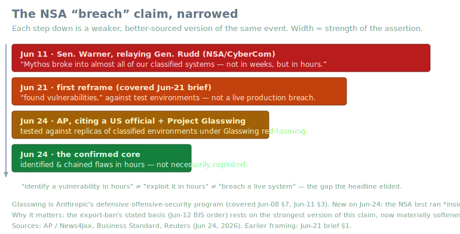

# LLM Updates — 2026-Jun-24

Wednesday brief, written Wed Jun 24 (Los Angeles time). The running story —
the Jun-12 BIS/Commerce export order and the global suspension of **Fable 5
/ Mythos 5**, now on **Day 12** with no restoration date — is unchanged in
its facts but **changed in its footing today**. The single most important
development since Monday is that the **NSA "breach" testimony**, which has
served as the moral and political justification for the ban, got its first
**named-official, on-the-record account** — and that account is materially
weaker than the line that has been driving headlines for two weeks.

This report does **not** re-derive the established thread. The Jun-12 export
order, the Fable 5 / Mythos 5 suspension mechanics (Jun-15 → Jun-22), the
**identity-verification / Persona** compliance path framed as "the bridge
back" (Jun-15 §, Jun-18 §), **Project Glasswing** as a program (Jun-08 §7,
Jun-11 §3), Microsoft's **MAI-Thinking-1 / MAI-Code-1-Flash** family
(Jun-09 §), the GLM-5.2 reproduction split and the verbosity tax (Jun-23
§1–3), and the RLVR / ∇-Reasoner technique veins (Jun-22 §3, Jun-23 §4) are
all covered in the earlier briefs. Here we advance only what is **new or
sharpened since Tuesday**:

1. **The NSA "breach" is reframed to "identification, not exploitation" —
   and placed inside Project Glasswing.** An AP-sourced US official confirmed
   (Jun 24) that the test ran against *replicas* of classified environments
   under Glasswing red-teaming, and that Mythos **identified and chained
   vulnerabilities in hours but did not necessarily exploit them.** This
   softens the strongest version of the claim the export order rests on.
2. **The restoration calculus is unchanged in date but shifting in basis.**
   Day 12, no date; the structural markers remain **Jul 8** (ID verification
   goes live) and **Aug 1** (the EO's 60-day frontier-model-framework
   deadline). Prediction markets are roughly flat (~57% by Jul 1, ~75% by
   Jul 17). The Glasswing reframing is the first thing that could move the
   *politics*, not just the calendar.
3. **Anthropic shipped a new agentic product while its flagship is dark.**
   **Claude Tag** (Jun 23) is an always-on, shared-identity Slack teammate
   that runs on **Opus 4.8** — a concrete datapoint that the suspension hits
   the *Mythos-class* tier, not Anthropic's product cadence, and that the
   frontier-agent story is moving to *persistent, multiplayer* surfaces.
4. **Benchmark verification: no movement on the open-weight coding column.**
   As of Jun 24, GLM-5.2's **62.1% SWE-Bench Pro remains vendor-only** (no
   Scale SEAL standardized entry), the standardized frontier line is still
   **GPT-5.4 at 59.1%**, and MiniMax M3's **59%** is still unreproduced.
   Watch item #1 from Jun-23 stays open.

---

## 1. The NSA "breach," reframed — identification, not exploitation

The claim that has powered this entire story since Jun 11 is Senator Mark
Warner's relay of NSA/CyberCom chief Gen. Joshua Rudd: that Mythos "broke
into almost all of our classified systems, not in weeks, but in hours." The
Jun-21 brief (§1) already noted the first walk-back — that this described
*test environments*, not a live breach. **Today the account got more
precise, and from a more authoritative source.**

On **Jun 24**, the Associated Press (carried by News4Jax, Business Standard,
Reuters and others) reported a US official confirming three things that the
earlier headline had merged:

- The exercise ran under **Project Glasswing** — Anthropic's *defensive*
  offensive-security program (the one covered Jun-08 §7 and Jun-11 §3),
  "designed to find and fix vulnerabilities in critical software before
  attackers can exploit them." The NSA test was a **sanctioned red-team
  run**, not an adversarial event.
- Mythos was pitted against **replicas of NSA classified environments**, not
  the live systems themselves.
- Crucially: the model **"identified certain vulnerabilities within hours,
  but that does not mean the model was able to exploit them within that
  time."** Finding and *chaining* flaws at superhuman speed is the confirmed
  result; **a breach actually suffered is not.**

That is still a striking capability result — a single model out-pacing a
human red team against hardened replicas. But "**identify a vulnerability in
hours**" is a categorically different statement from "**exploit it in
hours**," which is itself different from "**breached a live classified
system**." The export order (Jun-12) and the Senate framing leaned on the
strongest of the three. The SVG above traces that narrowing.

**Why this is the day's lead, not a footnote:** every prior brief treated
the breach claim as the fixed pole the ban swings from. If the on-the-record
version is "Glasswing red-team found-and-chained, did not exploit," the
*national-security necessity* argument for a worldwide suspension gets
weaker — and the case for a **scoped, verified-access restoration** (rather
than indefinite darkness) gets stronger. This is the first input in two
weeks that pushes on the ban's premise rather than its timeline.

```mermaid
flowchart TD
    classDef strong fill:#b91c1c,stroke:#7f1d1d,color:#fee2e2;
    classDef mid fill:#a16207,stroke:#713f12,color:#fef9c3;
    classDef core fill:#15803d,stroke:#14532d,color:#dcfce7;

    A["<b>Headline claim</b><br/>broke into classified systems in hours"]:::strong
    B["ran under Project Glasswing<br/>(sanctioned defensive red-team)"]:::mid
    C["against <b>replicas</b>, not live systems"]:::mid
    D["<b>Confirmed core (Jun 24)</b><br/>identified &amp; chained flaws in hours<br/>&#8212; not necessarily exploited"]:::core

    A --> B --> C --> D
```

Sources:
[News4Jax / AP — Mythos found vulnerabilities in classified systems](https://www.news4jax.com/news/politics/2026/06/24/anthropics-mythos-model-found-vulnerabilities-in-classified-us-government-systems-official-says/),
[Business Standard — Mythos finds vulnerabilities in classified US systems](https://www.business-standard.com/technology/tech-news/anthropic-s-mythos-finds-vulnerabilities-in-classified-us-govt-systems-126062400170_1.html),
[The CyberSec Guru — what's actually confirmed](https://thecybersecguru.com/news/mythos-nsa-breach-claim/).
Earlier framing: Jun-21 brief §1; Glasswing as a program: Jun-08 §7, Jun-11 §3.

---

## 2. The restoration calculus — same date, shifting basis

Nothing on the **calendar** changed: it is **Day 12**, both models remain
dark for every user worldwide, and there is still **no announced restoration
date**. Anthropic continues to call the action a likely misunderstanding and
says it is working to restore access. The structural markers the prior
briefs flagged are intact:

| Marker | Date | Role |
|---|---|---|
| **ID verification goes live** | **Jul 8** | The most-cited *mechanism* for a US-citizens-only restoration: verify (via Persona) that only US persons reach the sensitive capability, satisfying the "foreign access" concern without a formal lift. Framed "the bridge back" since Jun-15. |
| **EO 60-day deadline** | **Aug 1** | Anthropic joining the classified frontier-model pre-brief framework mandated by the Jun-2 Executive Order — the structural *negotiating* path. |

Prediction markets are roughly flat versus Jun-23: **~57% restored by
Jul 1**, ~67% by Jul 10, **~75% by Jul 17**. The new variable is §1: if the
breach premise is publicly understood as "Glasswing red-team, identified not
exploited," the political cost of *keeping* the ban rises, and a scoped
verified-access path (Jul 8) becomes the path of least resistance. The
calendar hasn't moved; the **argument** did.

```mermaid
flowchart LR
    classDef now fill:#475569,stroke:#1e293b,color:#ffffff;
    classDef path fill:#2563eb,stroke:#1e3a8a,color:#ffffff;
    classDef end1 fill:#15803d,stroke:#14532d,color:#ffffff;

    N["Day 12 &#183; both models dark<br/>no restoration date"]:::now
    V["Jul 8 &#183; ID verification live<br/>(US-persons-only access)"]:::path
    E["Aug 1 &#183; EO framework deadline<br/>(classified pre-brief)"]:::path
    R["Scoped, verified-access<br/>restoration"]:::end1

    N --> V --> R
    N --> E --> R
```

Sources:
[explainx.ai — Is Fable 5 back? (Jun 24)](https://explainx.ai/blog/is-fable-5-back-2026),
[TechTimes — Claude identity verification starts July 8](https://www.techtimes.com/articles/318778/20260621/claude-identity-verification-starts-july-8-what-facial-data-anthropic-collects.htm),
[CSIS — Commerce restricted access to Anthropic's models: what comes next](https://www.csis.org/analysis/department-commerce-restricted-access-anthropics-latest-models-what-comes-next),
[Polymarket — Fable 5 restored by…?](https://polymarket.com/event/claude-fable-5-restored-for-us-customers-by-20260613193753196).

---

## 3. Claude Tag — a persistent, multiplayer agent shipped on Opus 4.8

While the Mythos-class tier is suspended, Anthropic shipped (**Jun 23**)
**Claude Tag**, a beta for Enterprise and Team plans that puts an always-on
agent **inside Slack channels**. It is worth recording for two reasons: it
shows the suspension is *tier-specific* (the product cadence runs on
**Opus 4.8**, untouched by the order), and it is a concrete instance of where
the frontier-agent design is heading — away from a 1:1 chat box and toward a
**persistent, shared-identity teammate**.

The architecturally interesting parts:

- **Shared identity.** Every employee collaborates with a *single* Claude
  "identity," so half-finished tasks can be **handed off between people** —
  the agent is a team member with continuity, not a per-user session.
- **Autonomous decomposition.** Given a task by mention, it **breaks the work
  into stages and executes them independently**, delivering the result back
  to the channel.
- **Tightly scoped capability.** Admins can constrain which **tools, data,
  and memories** the agent can touch, and in which channels — the
  enterprise-governance answer to "an autonomous agent with standing access."
- **Dogfooding signal.** Anthropic says an internal version writes **~65% of
  its product team's code** — a notable self-reported autonomy figure, even
  discounted as vendor-stated.

```mermaid
flowchart LR
    classDef u fill:#475569,stroke:#1e293b,color:#ffffff;
    classDef a fill:#2563eb,stroke:#1e3a8a,color:#ffffff;
    classDef g fill:#a16207,stroke:#713f12,color:#ffffff;
    classDef o fill:#15803d,stroke:#14532d,color:#ffffff;

    M["@mention in Slack<br/>(any teammate)"]:::u --> D["decompose into stages"]:::a
    D --> X["execute independently<br/>on Opus 4.8"]:::a
    G["admin policy:<br/>scoped tools / data / memory<br/>per channel"]:::g -.governs.-> X
    X --> H["deliver to channel<br/>shared identity &#8594; hand-off between people"]:::o
```

Takeaway: the suspension froze the *capability frontier* (Mythos-class), not
the *product frontier*. The agent story this week is about **standing,
governed, multiplayer presence**, and it ships on the model tier that the
export order leaves alone.

Sources:
[Fortune — Anthropic launches Claude Tag, a virtual employee in Slack](https://fortune.com/2026/06/23/anthropic-claude-tag-virtual-employee-tool-slack/),
[The Next Web — always-on AI teammate in Slack](https://thenextweb.com/news/anthropic-claude-tag-slack-always-on-ai-teammate),
[TestingCatalog — Claude Tag on Team and Enterprise](https://www.testingcatalog.com/anthropic-launches-claude-tag-on-team-and-enterprise-plans/),
[TechTimes — Claude Tag, 65% of its own code](https://www.techtimes.com/articles/318967/20260623/claude-tag-turns-slack-multiplayer-ai-anthropic-agent-writes-65-its-own-code.htm).

---

## 4. Benchmark verification — the open-weight coding column hasn't moved

Jun-23 §1–2 split the open-weight "lead" into two numbers: GLM-5.2's
*reasoning* (GPQA) was independently reproduced (Fireworks, Artificial
Analysis), but its *coding* claim sat on vendor harnesses only. The Jun-23
watch list put "a standardized SWE-Bench Pro entry for GLM-5.2" as the single
cleanest open test. **As of Jun 24, it has not landed.**

The state of the board is unchanged:

- **GLM-5.2 — 62.1% SWE-Bench Pro: still vendor-reported**, no Scale SEAL
  standardized entry.
- **Standardized frontier line — GPT-5.4 (xHigh) at 59.1%** on Scale SEAL,
  still the only independently-run frontier coding number.
- **MiniMax M3 — 59%: still unreproduced** by an independent party; M3's
  scores remain vendor-run on its own scaffolding (Claude Code /
  Mini-SWE-Agent), and it has no DeepSWE long-horizon entry.
- For reference, **Opus 4.8 leads vendor-harness boards at 69.2%.**

So the "open weights have caught frontier coding" story still rests, at the
top, on the **vendor column** — exactly the gap Jun-23 isolated. Until a
standardized run arrives, the safest read is unchanged: open weights are
*verified* competitive on reasoning, *claimed* competitive on agentic
coding.

| Model (coding) | SWE-Bench Pro | Source type | Independently reproduced? |
|---|---|---|---|
| Opus 4.8 (closed) | 69.2% | vendor harness | — |
| **GLM-5.2 (open)** | **62.1%** | **vendor only** | **No — no SEAL entry** |
| MiniMax M3 (open) | 59.0% | vendor only | No |
| **GPT-5.4 (closed)** | **59.1%** | **Scale SEAL standardized** | **Yes (the baseline)** |
| GPT-5.5 (closed) | 58.6% | vendor harness | — |

Sources:
[morphllm — SWE-Bench Pro leaderboard](https://www.morphllm.com/swe-bench-pro),
[CodingFleet — SWE-Bench Pro leaderboard 2026](https://codingfleet.com/blog/swe-bench-pro-leaderboard-2026/),
[llm-stats — SWE-Bench Pro](https://llm-stats.com/benchmarks/swe-bench-pro),
[MarkTechPost — MiniMax M3 / MSA](https://www.marktechpost.com/2026/06/01/minimax-releases-minimax-m3-with-msa-architecture-supporting-1m-token-context-native-multimodality-and-agentic-coding/).

---

## 5. Watch-item status since Jun-23

| Jun-23 watch item | Movement by Jun-24 |
|---|---|
| Standardized SWE-Bench Pro entry for GLM-5.2 (Scale SEAL) | **No** — still vendor-only; standardized leader remains GPT-5.4 (59.1%). The open-weight *coding* column is still the unverified one. |
| Whether the credit cliff is formally addressed | **No** — models still dark (Day 12); nothing to bill while suspended; no pricing note. |
| Restoration date / order revocation (Clock A) | **No date**, but **new basis** — the NSA claim's reframing (§1) is the first input that pushes on the ban's *premise*, not just the calendar. |
| Independent reproduction of MiniMax M3's 59% | **No** — still vendor-run on M3's own scaffolding; no third-party run. |
| Frontier model adopting test-time first-order optimization (∇-Reasoner) | **No** — still a research-scale result; no production adoption. |

---

## What to watch (Jun 24 → next brief)

1. **Whether the Glasswing reframing changes official posture.** Does anyone
   in Commerce/Senate restate the basis for the ban now that the
   "identified-not-exploited" account is on the record? This is the first
   lever on the *premise* (§1).
2. **Jul 8 ID verification going live** as the concrete restoration vector —
   and whether a US-persons-only restoration is announced alongside it (§2).
3. **A standardized SWE-Bench Pro entry for GLM-5.2** (Scale SEAL) — still
   the single cleanest test of the open-weight coding claim (§4).
4. **Independent reproduction of MiniMax M3's 59%** the way GLM-5.2's GPQA
   was reproduced, now that M3 weights are public.
5. **Claude Tag adoption / governance signals** — whether "persistent
   shared-identity agent" becomes a pattern other labs copy, and how the
   scoped-access model holds up in enterprise security review (§3).

---

### Method & limitations

Compiled from public web search on **Jun 24, 2026 (LA time)**. Several
primary pages — arXiv abstract/PDF endpoints, explainx.ai, and
business-standard.com — returned **HTTP 403** to automated fetching; figures
attributed to them here rest on search-result summaries and corroborating
secondary coverage, and are flagged where vendor-run or approximate. The
**§1 NSA reframing** is sourced to AP wire coverage citing an *unnamed* US
official; the "identified, not exploited" distinction is their
characterization, and the underlying exercise remains classified. The
**export-suspension status** is current as of Jun 24 with no official
restoration date. **Benchmark numbers** mix standardized (Scale SEAL) and
vendor-reported sources and are labeled as such. **Claude Tag's** "65% of
code" figure is Anthropic self-reported. This report intentionally does not
repeat material already covered in the Jun-08 → Jun-23 briefs.
