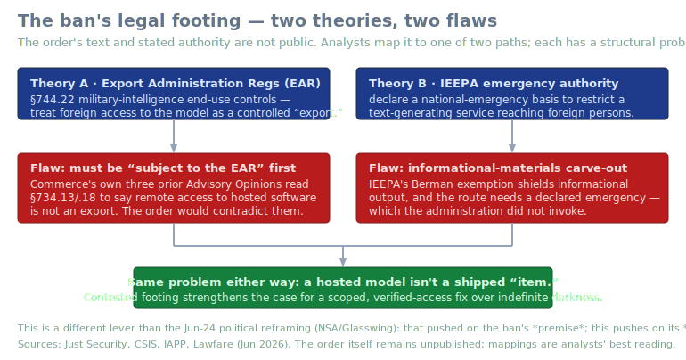

# LLM Updates — 2026-Jun-25

Thursday brief, written Thu Jun 25 (Los Angeles time). The running story —
the Jun-12 BIS/Commerce export order and the global suspension of **Fable 5
/ Mythos 5**, now on **Day 13** with no restoration date — is unchanged in
its facts again today. But the conversation around it has split into two new
veins worth recording, and one of them is a genuine **architecture** story,
not a policy one.

The single most important *technical* development this week is the general
availability of **Sakana Fugu** and a new **Fugu Ultra** tier (Jun 22): a
learned model that *orchestrates other models*, pitched explicitly as the
market's structural answer to the export wall. The most important *policy*
development since Wednesday is narrower but sharper — the ban's **legal
basis itself is now under expert scrutiny**, a different lever than the
Jun-24 political reframing.

This report does **not** re-derive the established thread. The Jun-12 export
order mechanics and the Fable 5 / Mythos 5 suspension (Jun-15 → Jun-24), the
**NSA "breach" → Glasswing "identify-not-exploit" reframing** (Jun-24 §1),
the **Jul 8 ID-verification / Aug 1 EO** restoration markers (Jun-24 §2),
**Claude Tag** (Jun-24 §3), the **GLM-5.2 two-numbers / vendor-vs-
standardized** split (Jun-23 §1–2), the **∇-Reasoner** test-time-gradient
vein (Jun-23 §4), MiniMax M3's **MSA** report (Jun-20/21 §4), and — crucially
for §1 below — the original **Sakana Fugu *beta*** writeup (May-16 §5.4,
May-17) are all covered earlier. Here we advance only what is **new or
sharpened since Wednesday**:

1. **Sakana Fugu ships GA with a Fugu Ultra tier — "a model that
   orchestrates models," positioned as the hedge against the Fable 5 wall.**
   The May beta (7B RL Conductor + frontier workers, May-16 §5.4) is now a
   production product built on the **TRINITY + Conductor** (ICLR 2026) line.
   Fugu Ultra's headline is **SWE-Bench Pro 73.7%** — *above* Opus 4.8's
   vendor 69.2% — but the number is **Sakana-run and unreproduced**, the same
   verification gap §4 has tracked all week.
2. **The export order's legal footing is now contested by name.** Just
   Security, CSIS, IAPP and Lawfare converge on a structural problem: whether
   the directive rests on **EAR §744.22** or on **IEEPA**, remote access to a
   hosted model is hard to fit either authority — and the EAR path appears to
   **contradict Commerce's own prior Advisory Opinions** on remote access.
   This pushes on the ban's *legality*, where Jun-24 pushed on its *premise*.
3. **Status: Day 13, no new date.** No official movement since the Jun-17
   Ciauri "coming days" remark (already logged Jun-18); the calendar markers
   and prediction-market odds are essentially flat versus Jun-24 §2. Recorded
   here only to keep the clock honest.

---

## 1. Sakana Fugu goes GA — orchestration as a product, and as an export hedge

Sakana Fugu first appeared here as a **beta** on May 16 (§5.4): a 7B "RL
Conductor" that called a pool of frontier workers behind an OpenAI-compatible
API, with the architectural read that "orchestrator-as-a-model-class" was
becoming a real tier. On **Jun 22** that beta became a **general-availability
product** with a new high-end **Fugu Ultra** tier — and the framing changed.
The pitch is no longer just "cheaper frontier performance"; it is now an
explicit **hedge against access disruption**, with Anthropic's export
suspension named as the motivating case.

What is actually new since the May writeup:

- **It is a model that calls models — including itself.** Fugu is a language
  model trained to route a request across a *swappable pool* of frontier
  LLMs. A small coordinator decides per-request whether to answer directly or
  to assemble a team of specialists, hand them focused sub-tasks, check their
  work, and synthesize one answer. The pool can include **recursive calls to
  Fugu instances**. Sakana grounds this in two **ICLR 2026** papers,
  **TRINITY** and **the Conductor** — the lineage of the May beta's "RL
  Conductor," now named and productized.
- **Fugu Ultra's headline number is 73.7% on SWE-Bench Pro** — *above* Opus
  4.8's vendor-harness 69.2%, and well above GPT-5.5 (58.6%) and Gemini 3.1
  Pro (54.2%). Sakana claims Fugu Ultra **matches Fable 5 and Mythos Preview**
  across coding, science, reasoning and agent suites *without access to
  either model*. **Every one of these figures is Sakana-run and not yet
  independently reproduced** — exactly the vendor-vs-standardized gap that
  §4 (and the Jun-23/24 briefs) have been tracking for GLM-5.2 and MiniMax M3.
- **The cost model has a catch.** Fugu Ultra lists at **$5 / $30 per million
  input/output tokens** (rising to $10 / $45 above a 272K context; cached
  input $0.50). But **orchestration tokens — the hidden coordinator/worker
  traffic behind the final answer — count toward billed usage.** That is the
  same "tokens-per-task, not price-per-token" caveat the Jun-23 brief raised
  for verbose open-weight models (§3), now applied to a system whose entire
  value proposition is *spending extra tokens on coordination*.
- **The strategic claim:** CEO David Ha frames routing across a pool as more
  reliable for enterprises than any single provider, "in the wake of" the
  Fable 5 / Mythos suspension. Whether that is "AI sovereignty" is debatable;
  the operational logic — if one provider goes dark, route around it — is the
  cleanest market response yet to a model going offline by government order.

```mermaid
flowchart TD
    classDef u fill:#475569,stroke:#1e293b,color:#ffffff;
    classDef c fill:#2563eb,stroke:#1e3a8a,color:#ffffff;
    classDef w fill:#a16207,stroke:#713f12,color:#fef9c3;
    classDef o fill:#15803d,stroke:#14532d,color:#dcfce7;

    Q["one request &#183; one OpenAI-compatible endpoint"]:::u --> C["Fugu coordinator<br/>(learned router &#8212; TRINITY + Conductor)"]:::c
    C -->|simple| A["answer directly"]:::o
    C -->|complex| P["assemble specialist team<br/>+ recursive Fugu calls"]:::w
    P --> V["check work &#183; synthesize one answer"]:::c
    V --> A
    POOL["swappable pool:<br/>frontier + open-weight workers"]:::w -. routed over .-> P
    A --> R["single response<br/>(orchestration tokens billed)"]:::o
```

**Why this is the technical lead:** the most-watched LLM advances this week
are not a bigger pretrained model — they are *systems* that get frontier-
level results from a portfolio. That reframes "which model is best" into
"which router + pool is best," and it gives the export-control story a
market-structural counterweight: capability that does not live in any single
restricted artifact. The open question is the same one §4 keeps flagging —
**none of Fugu Ultra's numbers have been reproduced off Sakana's harness.**

Sources:
[MarkTechPost — Sakana Fugu routes tasks across a swappable pool](https://www.marktechpost.com/2026/06/22/sakana-ai-launches-sakana-fugu-an-orchestration-model-that-routes-tasks-across-a-swappable-pool-of-frontier-llms/),
[VentureBeat — Sakana achieves frontier performance with Fugu](https://venturebeat.com/orchestration/no-claude-fable-5-no-problem-sakana-achieves-frontier-performance-with-new-fugu-multi-model-auto-synthesis-system),
[The Decoder — Fugu orchestrates multiple LLMs to match Fable/Mythos](https://the-decoder.com/sakana-ais-fugu-orchestrates-multiple-llms-to-match-anthropics-fable-and-mythos-benchmarks/),
[DataCamp — Sakana Fugu: features, benchmarks, how it works](https://www.datacamp.com/blog/sakana-fugu),
[BankInfoSecurity — Sakana bets on orchestration over frontier models](https://www.bankinfosecurity.com/sakana-ai-bets-on-agent-orchestration-over-frontier-models-a-32043).
Prior beta coverage: May-16 §5.4, May-17.

---

## 2. The ban's legal footing is now contested — a different lever than the premise

Jun-24 §1 logged the first input that pushed on the export ban's *premise*:
the NSA "breach" reframed as Glasswing "identify-not-exploit." What's new
since Wednesday is a second, independent line of pressure — on the ban's
**legal authority**. With the directive's text and stated basis still
**unpublished**, legal analysts (Just Security, CSIS, IAPP, Lawfare) have
mapped it to one of two statutory paths, and both have a structural problem.

| Theory | The route | The flaw analysts flag |
|---|---|---|
| **EAR §744.22** | Treat foreign access to the model as a controlled "export" under military-intelligence end-use rules. | For §744.22 to bite, the thing must be **"subject to the EAR"** in the first place. Commerce's **own three prior Advisory Opinions** read §734.13/.18 to say **remote access to hosted software is not an export** — so the order would have to contradict the agency's own precedent. |
| **IEEPA** | Declare an emergency basis to restrict a text-generating service reaching foreign persons. | IEEPA's **informational-materials (Berman) carve-out** cuts against banning a text service, and the route requires a **conspicuously declared national emergency** — which the administration **did not invoke**. |

The throughline is the same either way: a **hosted, remotely-accessed model
is hard to characterize as a shipped "item,"** which is the category export
law is built around. The SVG above lays out both theories and their flaws.

Why it matters for the timeline: this is a *different lever* than §1's
political reframing. The Glasswing story pressures the **necessity** of the
ban; the legal analysis pressures its **authority**. Both point the same
direction — toward a **scoped, verified-access resolution** (the Jul 8
ID-verification path, Jun-24 §2) rather than indefinite darkness or a
litigated showdown — because contested footing raises the cost of *holding*
the ban as-is. None of this is a court ruling; it is expert commentary on an
order no one outside government has seen in full. But it is the first week
the *legality*, not just the politics, became a live question.

```mermaid
flowchart LR
    classDef p fill:#7f1d1d,stroke:#450a0a,color:#fee2e2;
    classDef l fill:#1e3a8a,stroke:#1e293b,color:#dbeafe;
    classDef r fill:#15803d,stroke:#14532d,color:#dcfce7;

    A["Jun-24 lever:<br/>premise<br/>(NSA &#8594; Glasswing)"]:::p --> X["pressure to resolve"]:::r
    B["Jun-25 lever:<br/>legal authority<br/>(EAR / IEEPA fit)"]:::l --> X
    X --> Y["scoped, verified-access fix<br/>(Jul 8 path) > indefinite darkness"]:::r
```

Sources:
[Just Security — legal considerations on the Anthropic export directive](https://www.justsecurity.org/142745/law-anthropic-export-controls/),
[CSIS — Commerce restricted access to Anthropic's models: what comes next](https://www.csis.org/analysis/department-commerce-restricted-access-anthropics-latest-models-what-comes-next),
[IAPP — global implications of the export controls on Anthropic](https://iapp.org/news/a/the-global-implications-of-the-white-houses-export-controls-on-anthropic),
[Lawfare — a kill switch for frontier AI](https://www.lawfaremedia.org/article/a-kill-switch-for-frontier-ai),
[TechPolicy.Press — did the US set an AI export precedent by blocking Mythos?](https://www.techpolicy.press/did-the-us-government-just-set-an-ai-export-precedent-by-blocking-mythos/).
Premise lever: Jun-24 §1. Restoration markers: Jun-24 §2.

---

## 3. Restoration status — Day 13, no new date

Nothing on the calendar changed. It is **Day 13**; both models remain dark
for every user worldwide; there is **no announced restoration date**. The
most optimistic public statement remains MD-International **Chris Ciauri's**
"very confident… in the coming days" from the **Jun 17** Seoul press
conference — already logged in the Jun-18 brief, not new today. Anthropic
continues to call the action a likely misunderstanding and says senior staff
are in Washington negotiating the return.

The structural markers and odds are flat versus Jun-24 §2:

| Marker | Date | Status |
|---|---|---|
| ID verification (Persona) goes live | **Jul 8** | unchanged — the most-cited mechanism for a US-persons-only restoration |
| EO 60-day frontier-framework deadline | **Aug 1** | unchanged — the structural negotiating path |
| Prediction markets (restored by Jul 1 / Jul 17) | — | ~57% / ~75%, roughly flat |

This section exists only to keep the clock honest: the *facts* of the
suspension did not move on Jun 25. What moved is the **argument around it**
(§1 gives the market a route around the wall; §2 puts the wall's legality in
question).

Sources:
[Korea JoongAng Daily — Anthropic confident of re-enabling access in coming days](https://www.koreajoongangdaily.com/business/anthropic-confident-of-reenabling-mythos-fable-5-access-in-coming-days-executive/12727522),
[Android Authority — models could be restored shortly](https://www.androidauthority.com/anthropic-fable-5-ai-models-optimistic-return-3679377/),
[explainx.ai — Is Fable 5 back? (Jun 24, "No")](https://explainx.ai/blog/is-fable-5-back-2026).

---

## 4. Watch-item status since Jun-24

| Jun-24 watch item | Movement by Jun-25 |
|---|---|
| Whether the Glasswing reframing changes official posture | **No** — no Commerce/Senate restatement of the ban's basis. But a *second* pressure line opened: the **legal-authority** question (§2). |
| Jul 8 ID verification as the concrete restoration vector | **No change** — still the marker; no US-persons-only restoration announced (§3). |
| Standardized SWE-Bench Pro entry for GLM-5.2 (Scale SEAL) | **Still No** — GLM-5.2 sits on the **vendor** board at 62.1%; the standardized leader is still **GPT-5.4 at 59.1%**. New twist: **Fugu Ultra's vendor 73.7% (§1) joins the same unreproduced column.** |
| Independent reproduction of MiniMax M3's 59% | **No** — still vendor-run on M3's own scaffolding; long-horizon "ICLR-paper reproduction" demos are autonomy showcases, not standardized evals. |
| Claude Tag adoption / governance signals | **No new data** since the Jun-23 launch. |

---

## What to watch (Jun 25 → next brief)

1. **Independent reproduction of Fugu Ultra's 73.7%.** The cleanest test of
   the orchestration-beats-single-model claim is a third-party SWE-Bench Pro
   run that *counts orchestration tokens* in the cost column (§1). Until then,
   "a router matches Fable 5" is a vendor assertion.
2. **Any official restatement of the ban's legal basis** — or the order's
   text becoming public. That would let analysts replace "EAR §744.22 *or*
   IEEPA, both flawed" (§2) with a concrete read.
3. **Jul 8 ID verification going live** as the restoration vector, and
   whether a US-persons-only lift is announced with it (§3).
4. **A standardized SEAL entry for GLM-5.2** — still the single cleanest test
   of the open-weight *coding* claim (§4).
5. **Whether other labs copy the orchestration-product tier** the way Fugu
   has productized it — the architecture story to watch if frontier weights
   keep getting access-gated.

---

### Method & limitations

Compiled from public web search on **Jun 25, 2026 (LA time)**. Consistent
with prior briefs, automated fetching hit **widespread HTTP 403** —
MarkTechPost, The Decoder, VentureBeat, Just Security, the Cloud Security
Alliance lab page and llm-stats all blocked direct retrieval — so figures
here rest on **search-result summaries and corroborating secondary
coverage**, and are flagged where vendor-run, approximate, or analyst-
inferred. **Fugu Ultra's benchmark and pricing figures are Sakana-reported
and unreproduced** (§1). The **export order's text and legal basis remain
unpublished**; the EAR-vs-IEEPA mapping in §2 is analysts' best reading of an
order no one outside government has seen in full, not a court finding.
**Restoration status** is current as of Jun 25 with no official date. This
report intentionally does not repeat material already covered in the Jun-08 →
Jun-24 briefs (notably the Sakana Fugu *beta*, May-16 §5.4) and advances only
what is new or sharpened since Jun 24.
