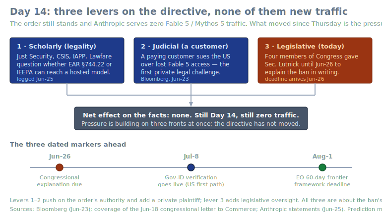

# LLM Updates — 2026-Jun-26

Friday brief, written Fri Jun 26 (Los Angeles time). The running story —
the Jun-12 BIS/Commerce export order and the global suspension of **Fable 5
/ Mythos 5**, now on **Day 14** with no restoration date — is, in its *facts*,
unchanged again: Anthropic is still serving **zero** Fable/Mythos traffic.
But three things moved *around* the directive since Thursday, and together
they make today the most procedurally crowded day of the suspension so far.

The single most important development since the Jun-25 brief is that the
ban's **legal contest stopped being purely academic.** Thursday's story was
scholars questioning the order's *statutory footing* (EAR §744.22 vs IEEPA).
Since then, two harder levers have attached to that same question: a **paying
customer is suing the US government** over lost Fable 5 access (the first
*private* legal challenge), and **Congress's written-explanation deadline for
Commerce Secretary Lutnick arrives today, Jun 26.** Scholarly doubt,
a judicial plaintiff, and legislative oversight are now pushing on the
directive's *basis* simultaneously — while the directive itself has not budged.

This report does **not** re-derive the established thread. The Jun-12 export
order mechanics and the Fable 5 / Mythos 5 suspension (Jun-15 → Jun-25), the
**Sakana Fugu GA / Fugu Ultra orchestration** product (Jun-25 §1), the
**EAR-vs-IEEPA legality contest** (Jun-25 §2), the **NSA "breach" → Glasswing
"identify-not-exploit" reframing** (Jun-24 §1), the **Jul 8 ID-verification /
Aug 1 EO** restoration markers (Jun-24 §2), **Claude Tag** (Jun-24 §3), the
**GLM-5.2 two-numbers / vendor-vs-standardized** split (Jun-23 §1–2), the
**∇-Reasoner** test-time-gradient vein (Jun-23 §4), the **RLVR
expand-vs-sharpen** debate (Jun-22 §3), MiniMax M3's **MSA** report
(Jun-20/21 §4), the **CAISI jailbreak gap** (Jun-20 §2), and the
**sparse/hybrid-attention efficiency** line (Jun-20 §4) are all covered
earlier. Here we advance only what is **new or sharpened since Thursday**:

1. **The legal fight got a plaintiff and a deadline.** A Fable 5 *customer*
   has sued the US government over the loss of access (Bloomberg, Jun 23) —
   the first private suit — and **four members of Congress gave Secretary
   Lutnick until today, Jun 26, to explain the ban in writing.** This turns
   Thursday's scholarly legality question (§2 then) into an active
   *judicial + legislative* contest. It pushes on the order's *basis*, not
   its facts.
2. **A false-restoration rumor cycle — and a flat denial worth recording.**
   Viral posts this week claimed Fable 5 was quietly back for **Claude Code
   v2.1.190** users. Anthropic staff debunked it categorically: *"We are
   currently serving exactly 0 traffic to Fable 5."* Logged here to keep the
   clock honest — "is it back?" is now generating noise, and the answer is
   still measurably no.
3. **Status: Day 14, no new date.** No official restoration movement; the
   structural markers (**Jul 8** gov-ID verification, **Aug 1** EO framework
   deadline) and prediction-market odds are essentially flat versus Jun-24
   §2. Recorded only to keep the clock honest.
4. **Architecture explainer the briefs haven't done: residual-stream
   stability.** All month the efficiency story here has been about *attention*
   (CSA/HCA, MSA, Mamba-2 hybrids — Jun-20 §4). The complementary axis —
   keeping the **residual stream** stable as models get deeper — is having a
   moment via DeepSeek's **Manifold-Constrained Hyper-Connections (mHC)** line
   and its fresh follow-on work. This is a *deeper-explainer* section, clearly
   dated, not breaking news.

---

## 1. The legal contest gets a plaintiff and a clock

Thursday's brief (§2) recorded that the ban's *statutory footing* was under
expert scrutiny — whether the directive can rest on **EAR §744.22** or on
**IEEPA**, given that remote access to a hosted model fits neither authority
cleanly. That was scholars writing analyses. Since then the same question
acquired two sharper instruments:

- **A private plaintiff.** Per Bloomberg (Jun 23), an Anthropic *customer*
  has sued the US government over losing access to Fable 5. This is
  categorically different from a think-tank critique: it puts the order in
  front of a court with a party that has concrete, monetizable harm
  (a business that built on `claude-fable-5` and lost it overnight). Whatever
  the merits, it forces the government to *defend* the directive's authority
  rather than simply assert it.
- **A congressional deadline that lands today.** Four members of Congress
  sent Commerce Secretary **Howard Lutnick** a letter (dated Jun 18)
  demanding a **written explanation of the ban by Jun 26** — i.e., today.
  This is legislative oversight, a third lever distinct from the courts and
  from the academy.

The throughline: the *premise* of the ban was reframed on Jun-24 (NSA
"breach" → Glasswing "identification, not exploitation"); the *legality* was
contested on Jun-25; and now the *basis* is being tested through formal
channels — a lawsuit and a congressional demand — on Jun-26. None of this has
changed the operational fact (zero traffic), but it changes the *cost* of
keeping the directive in place indefinitely. The structural read from
Thursday holds and arguably strengthens: contested footing plus a plaintiff
plus an oversight deadline all point toward a **scoped, verified-access
resolution** (the Jul 8 gov-ID path) being cheaper for the government than
defending indefinite darkness.

> Caveat: the underlying export order's text and stated authority are still
> not public. The lawsuit and the congressional letter are reported via
> secondary coverage; treat the precise statutory characterization as
> analysts' best reading, exactly as in the Jun-25 §2 note.

## 2. The "is Fable 5 back?" rumor cycle — and why the denial matters

A genuinely new *information-environment* datapoint: this week a wave of posts
claimed Fable 5 had quietly returned for users on **Claude Code v2.1.190**,
with screenshots and version-string sleuthing making the rounds. Anthropic
staff debunked the reports **categorically**, with the cleanest possible
metric:

> *"We are currently serving exactly 0 traffic to Fable 5."*

Anthropic's Head of Growth separately called the "it's accessible again"
reports **"categorically false."** Why record a debunked rumor? Two reasons:

1. **It keeps the clock honest.** Fourteen days in, "is it back yet?" has
   enough demand that false positives now spread faster than the answer. A
   `claude-fable-5` API call still errors out; a model string surviving in a
   client build is not the model being served.
2. **It is a leading indicator of restoration pressure, not restoration.**
   The same code-spelunking that produced false alarms also surfaces the
   *mechanism* everyone expects — a **US-first, gov-ID-verified** return,
   possibly rate-limited — which maps onto the **Jul 8** verification date,
   not onto today. The rumor is best read as the market pricing in *how*
   restoration will arrive, ahead of *whether* it has.

Net for the status line: **Day 14, zero traffic, no dated restoration**, with
prediction-market odds roughly flat versus the Jun-24 brief.

## 3. Architecture explainer: the residual-stream-stability axis (mHC)

This is the section the daily briefs keep gesturing at but haven't actually
written. All month the *efficiency* story has been about **attention** —
DeepSeek's sparse variants, MiniMax's **MSA** (Jun-20/21 §4), Mamba-2 hybrids.
But there's a second, complementary axis of architecture work that decides
whether you can *stack the depth* in the first place: the stability of the
**residual stream** — the running sum that carries information past every
layer since ResNets and the original Transformer.

**The setup.** "Hyper-Connections" (HC) generalize the single residual
stream into *several* parallel streams with learned routing matrices that mix
them between layers. Empirically HC buys real quality gains — but the
diversification **breaks the identity-mapping property** that made plain
residual connections so trainable. Once the routing matrices can scale and
recombine streams arbitrarily, signal can blow up or wash out across depth,
and training gets **unstable and hard to scale**.

**DeepSeek's fix — mHC (Manifold-Constrained Hyper-Connections,
arXiv:2512.24880).** Instead of letting the routing matrices be arbitrary,
mHC **constrains them to a manifold** that preserves the identity-like
behavior:

- the residual-mixing matrix `H_res` is forced to be **doubly stochastic**
  (every row and column sums to 1, all entries ≥ 0) — i.e., a point on the
  **Birkhoff polytope** — enforced with the classic **Sinkhorn–Knopp**
  normalization;
- the pre/post mixing maps are kept **non-negative**.

Geometrically, a doubly-stochastic matrix *averages* streams rather than
amplifying them, so it cannot inflate the residual norm — which is exactly
the property that keeps very deep stacks stable. DeepSeek reports that across
**3B / 9B / 27B** models, mHC trains smoothly where unconstrained HC often
diverges, recovering HC's quality gains **without** its instability.

```mermaid
flowchart TD
    classDef base fill:#475569,stroke:#1e293b,color:#ffffff;
    classDef bad fill:#9a3412,stroke:#7c2d12,color:#fed7aa;
    classDef fix fill:#1e3a8a,stroke:#1e293b,color:#dbeafe;
    classDef good fill:#15803d,stroke:#14532d,color:#dcfce7;

    R["Plain residual stream<br/>x&#8345;&#8331;&#8321; = x&#8345; + F(x&#8345;)<br/><i>identity mapping &#8594; trainable, stable</i>"]:::base
    H["Hyper-Connections (HC)<br/>several streams + learned routing matrices<br/><i>quality &#8593; &#8230; but identity property broken</i>"]:::bad
    P["Problem: arbitrary routing scales / mixes streams<br/>residual norm can blow up or wash out across depth<br/><i>training unstable, scaling restricted</i>"]:::bad
    M["mHC fix: constrain the routing to a manifold<br/>H&#8345;&#7387;&#8345; &#8594; doubly stochastic (Birkhoff polytope, Sinkhorn&#8211;Knopp)<br/>pre/post maps &#8594; non-negative"]:::fix
    G["Identity-like behavior restored<br/>averaging, not amplifying &#8594; norm preserved<br/><i>stable at 3B / 9B / 27B; HC's gains without HC's instability</i>"]:::good

    R --> H --> P --> M --> G
```

**Why it belongs in this series.** Two reasons. First, it is *complementary*
to the attention-efficiency thread: sparse attention cuts the cost *per
layer*; residual-stability work like mHC is about being able to *add layers
at all*. Second, the line is visibly active — the core paper is **DeepSeek,
early Jan 2026**, but follow-on work has been accumulating since
(**mHC-GNN**, arXiv:2601.02451, porting the idea to graph networks; **KromHC**,
arXiv:2601.21579, a Kronecker-product variant), with explainer coverage
(IBM's *Think*) landing this month. It is the clearest current example of the
"make depth trainable" axis that the efficiency-focused briefs have
under-weighted.

> Honesty note: unlike §§1–2, this is **not** a since-yesterday development —
> the mHC paper predates this brief. It is included as the architecture
> explainer the series owed, scoped and dated so it isn't mistaken for
> breaking news. The headline numbers (3B/9B/27B stability, HC-quality-without-
> instability) are **DeepSeek-reported**; independent large-scale reproduction
> is the open item, the same vendor-vs-verified caveat the briefs apply to
> benchmark claims.

---

## Watch items into the weekend

| # | Item | Status |
|---|------|--------|
| 1 | Lutnick's written explanation to Congress (due Jun 26) | **Due today** — not yet public |
| 2 | First ruling/response in the customer suit vs. the US (Bloomberg, Jun 23) | Open |
| 3 | A dated Fable 5 / Mythos 5 restoration | **No** — Day 14, zero traffic |
| 4 | Gov-ID verification path (Jul 8) — does it become the US-first restore mechanism? | Watch |
| 5 | Independent large-scale reproduction of mHC's stability/quality claims | Open |
| 6 | Standardized (Scale SEAL) entry for GLM-5.2's coding number | Still vendor-only (carried from Jun-23/24) |

---

### Sources

- LLM release/news trackers (Jun 2026): [llm-stats.com — AI news](https://llm-stats.com/ai-news), [llm-stats.com — LLM updates](https://llm-stats.com/llm-updates), [pricepertoken — model releases](https://pricepertoken.com/news/model-releases)
- Fable 5 / Mythos 5 suspension and legal/political contest: [Anthropic statement](https://www.anthropic.com/news/fable-mythos-access), [Bloomberg — customer sues US over Fable access (Jun 23)](https://www.bloomberg.com/news/articles/2026-06-23/anthropic-customer-sues-us-over-losing-access-to-fable-ai-model), [The New Stack — "the ball is in Anthropic's court"](https://thenewstack.io/fable-5-and-mythos-5-remain-suspended-the-ball-is-in-anthropics-court/), [AI Weekly — Tom Brown leads White House talks](https://aiweekly.co/alerts/anthropics-tom-brown-leads-white-house-talks-as-trump-tone-shifts), [Reuters/Yahoo — talks shift to setting AI security rules](https://www.yahoo.com/news/politics/articles/white-house-talks-anthropic-shift-193717371.html)
- "Is Fable 5 back?" rumor cycle and zero-traffic denial: [explainx.ai — Anthropic says zero traffic (Jun 25)](https://explainx.ai/blog/is-fable-5-back-2026), [isfable5back.com](https://isfable5back.com/), [explainx.ai — when will Fable 5 be available again](https://explainx.ai/blog/when-will-fable-5-be-available-again-2026)
- mHC architecture: [arXiv:2512.24880 — mHC: Manifold-Constrained Hyper-Connections](https://arxiv.org/abs/2512.24880), [Hugging Face paper page](https://huggingface.co/papers/2512.24880), [reference implementation (tokenbender)](https://github.com/tokenbender/mHC-manifold-constrained-hyper-connections), [IBM Think — DeepSeek's new architecture](https://www.ibm.com/think/news/deepseek-mhc-new-architecture); follow-ons [mHC-GNN (arXiv:2601.02451)](https://arxiv.org/abs/2601.02451), [KromHC (arXiv:2601.21579)](https://arxiv.org/abs/2601.21579)
- Open-weight / market context: [The New Stack — open models responded before restore](https://thenewstack.io/fable-ban-open-weights/), [Nex-N2-Pro on OpenRouter](https://openrouter.ai/nex-agi/nex-n2-pro:free)

Compiled Fri 2026-Jun-26 (Los Angeles time). Some primary sources (the export order text, the lawsuit filing, the congressional letter) are not public; characterizations rely on secondary coverage and are flagged as such. Several vendor/blog domains rejected automated fetches during compilation — items were corroborated across multiple search results where possible, per the resilience requirement.
