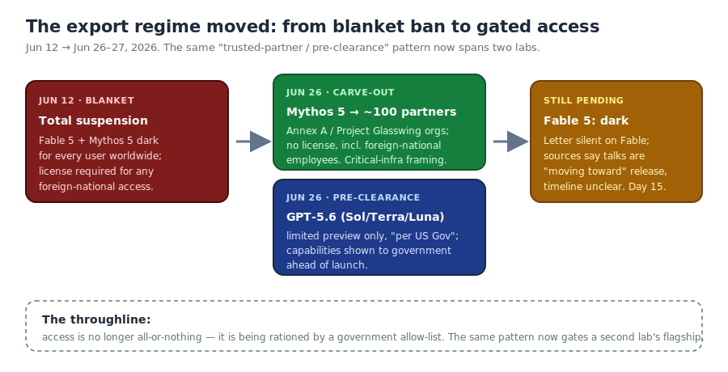

# LLM Updates — 2026-Jun-27

Saturday brief, written Sat Jun 27 (Los Angeles time). After two weeks of a
flat policy clock — the Jun-12 BIS/Commerce export order, the global
suspension of **Fable 5 / Mythos 5**, no restoration date through Jun-25 —
**the ban finally moved**, and it moved in the most consequential way yet:
not a blanket lift, but a **government allow-list**. On **Jun 26** Commerce
cleared **Mythos 5** for ~100 named US "trusted partners," and — the same day
— OpenAI shipped **GPT-5.6** under the *same* limited-preview, cleared-with-
government-first structure. The story this weekend is no longer "when does
the ban end"; it is "**access is now rationed by a federal allow-list, and
the pattern just generalized to a second lab.**"

This report does **not** re-derive the established thread. The Jun-12 export
order mechanics and the Fable 5 / Mythos 5 suspension (Jun-15 → Jun-25), the
**NSA "breach" → Glasswing "identify-not-exploit"** reframing (Jun-24 §1),
the **EAR §744.22-vs-IEEPA legal-footing** debate (Jun-25 §2), **Sakana Fugu
GA / Fugu Ultra** orchestration (Jun-25 §1), the **GLM-5.2 vendor-vs-
standardized** split (Jun-23 §1–2), MiniMax M3's **MSA** report (Jun-20/21
§4), and **Claude Tag** (Jun-24 §3) are all covered earlier. Here we advance
only what is **new or sharpened since Thursday**:

1. **The ban's first real reversal: Mythos 5 is cleared for ~100 named US
   "trusted partners."** Commerce Secretary Lutnick's **Jun 26** letter to
   Anthropic's Tom Brown drops the license requirement for **Annex A**
   entities (largely the **Project Glasswing** cohort — Fortune 500 firms +
   federal agencies that run/defend critical infrastructure) **and their
   foreign-national employees.** This is a *carve-out*, not a lift.
2. **The same regime just generalized to OpenAI.** Also **Jun 26**, OpenAI
   launched **GPT-5.6 (Sol / Terra / Luna)** — but **limited-preview only,
   "per US Gov,"** with capabilities **previewed to the government ahead of
   launch.** **GPT-5.6 Sol set a Terminal-Bench 2.1 record at 91.9%, beating
   Mythos 5** (vendor-reported). Pre-clearance is becoming the launch default.
3. **Fable 5 stays dark — Day 15.** The letter is **silent on Fable 5**;
   people close to the talks say they are "moving toward" releasing it,
   timeline unclear. Prediction markets firmed to **~68–71%** for restoration
   before **Jul 1**.
4. **A political counter-current: the "Mythos irony."** On **Jun 27** Rep.
   Andrew Garbarino described an Anthropic **Fly-Out-Day demo** in which
   Mythos was told to find a bank vulnerability and drain accounts — the exact
   capability that triggered the ban, surfacing the same week Mythos was
   partially cleared. Analysts caution the "drain live accounts" retelling is
   overstated.

---

## 1. The ban's first reversal — Mythos 5 cleared for ~100 named "trusted partners"

For 14 days the facts of the suspension did not move (Jun-25 §3 logged "Day
13, no new date"). On **Jun 26** they did. Commerce Secretary **Howard
Lutnick** wrote to Anthropic co-founder **Tom Brown**: *"I have determined
that appropriate safeguards are in place to permit certain trusted partners
to access the Claude Mythos 5 Model."* The operative language drops the
licensing barrier for a named list:

> *"a license will no longer be required to export, reexport, or in-country
> transfer (including deemed exports and reexports) the Claude Mythos 5 Model
> to entities identified in Annex A to this letter and their foreign national
> employees, or to Anthropic's foreign national employees."*

What is actually new, and what it is **not**:

- **It is a carve-out, not a lift.** Access is granted to **Annex A** — a
  non-public list of **100+ US organizations**, described as largely the
  **Project Glasswing** cohort (the ~100 well-known firms and institutions
  already in Anthropic's critical-infrastructure program; Jun-24 §1 logged
  Glasswing as the NSA-reframing vehicle). The framing is **defense of
  critical infrastructure** — Mythos, Anthropic's strongest cybersecurity
  model, redeployed to the organizations that *defend* networks.
- **The foreign-national clause is the legally interesting part.** The Jun-12
  order's signature feature was blocking **deemed exports** — access by
  foreign nationals *inside* the US, including Anthropic's own staff (Jun-24
  §2 context). The Jun-26 letter explicitly **re-opens** that for Annex A
  entities' foreign employees *and* Anthropic's own foreign-national
  employees. That is the single most concrete softening of the original
  order's reach.
- **It does not resolve the legal-footing question (Jun-25 §2).** A
  discretionary, entity-list-style permission is *consistent with* an EAR
  framing — Commerce granting case-by-case access to a controlled "item" —
  but it still does not publish the order's text or its statutory basis. The
  EAR-vs-IEEPA ambiguity Jun-25 flagged is **unchanged**; what changed is that
  Commerce is now exercising the discretion the EAR theory would imply.

**Why this is the lead:** the most-watched LLM "advance" this week is not a
capability — it is a **distribution mechanism**. A frontier model's
availability is now set by a **federal allow-list**, the first time a US
commercial model's reach has been administered this way. That reframes
"access" from a product decision into an export-licensing decision, applied
per-organization.

Sources:
[Semafor — US releases Mythos to some US companies (exclusive)](https://www.semafor.com/article/06/27/2026/us-releases-powerful-anthropic-model-mythos-to-some-us-companies),
[CNBC — Trump admin allows Anthropic to release Mythos to some companies, agencies](https://www.cnbc.com/2026/06/26/us-government-anthropic-claude-mythos5-ai.html),
[TechCrunch — Mythos to be used by more than 100 US companies, agencies](https://techcrunch.com/2026/06/26/trump-admin-releases-anthropic-mythos-to-be-used-by-more-than-100-us-companies-agencies/),
[CNN Business — US allows limited release of model that sparked cybersecurity concerns](https://www.cnn.com/2026/06/26/tech/anthropic-mythos-release),
[9to5Mac — Anthropic cleared to release Mythos 5 to over 100 US institutions](https://9to5mac.com/2026/06/26/anthropic-cleared-to-release-claude-mythos-5-to-over-100-us-institutions/),
[Bloomberg — Mythos 5 cleared for wider use](https://www.bloomberg.com/news/articles/2026-06-26/us-allows-trusted-partners-to-use-anthropic-s-mythos-5-ai-model).
Prior: Glasswing (Jun-24 §1); legal footing (Jun-25 §2).

---

## 2. The same gate just appeared at OpenAI — GPT-5.6 ships "limited preview, per US Gov"

The carve-out would be an Anthropic-specific footnote if it stopped there. It
didn't. **Also on Jun 26**, OpenAI launched its next flagship line, **GPT-5.6**
— in three classes, **Sol** (flagship), **Terra** (balanced), **Luna**
(cheap/fast) — and, breaking from every prior OpenAI launch, **only to a small
group of trusted preview partners**, explicitly **"per US Gov,"** after
OpenAI **previewed the models' plans and capabilities to the government ahead
of launch.**

That is the Jun-26 Mythos arrangement arriving at a second lab the same day,
from the other direction: Anthropic was *let back in* under a trusted-partner
list; OpenAI *launched into* a trusted-partner list. Either way, the frontier
now debuts behind a government-vetted gate.

The capability numbers (all **vendor-reported**, the same verification caveat
Jun-23/24/25 tracked for GLM-5.2, MiniMax M3 and Fugu Ultra):

| GPT-5.6 class | Positioning | Vendor claim on **Terminal-Bench 2.1** | Price (in / out per Mtok) |
|---|---|---|---|
| **Sol** (+ Ultra mode) | flagship / agentic coding, bio, cyber | **91.9% — new record, beats Mythos 5** | (premium tier; not detailed) |
| **Terra** | balanced everyday | "competitive with GPT-5.5" | **$2.50 / $15** |
| **Luna** | cheapest/fastest | surpasses Opus 4.8 | **$1 / $6** |

Two reads worth recording:

- **The pre-clearance norm is the actual story, not the benchmark.** A new SOTA
  on Terminal-Bench is routine; a flagship that *cannot launch broadly until
  the government has seen it* is not. If both leading US labs now gate frontier
  releases on a federal preview, the Jun-12 order has effectively become
  **template, not exception** — the thing Jun-25 §2's analysts and TechPolicy
  worried about ("did the US set an AI export precedent").
- **The verification gap is unchanged.** "Sol beats Mythos at 91.9%" is
  OpenAI's own number on OpenAI's harness. With *both* frontier lines now
  behind preview gates, **independent, standardized reproduction is harder, not
  easier** — the leaderboards that would adjudicate these claims can't run
  models they can't access.

```mermaid
flowchart LR
    classDef g fill:#1e3a8a,stroke:#1e293b,color:#dbeafe;
    classDef a fill:#15803d,stroke:#14532d,color:#dcfce7;
    classDef o fill:#7c3aed,stroke:#4c1d95,color:#ede9fe;
    classDef n fill:#475569,stroke:#1e293b,color:#ffffff;

    G["US government<br/>(Commerce / pre-launch review)"]:::g
    G -->|"Jun 26: clears Annex A list"| A["Anthropic Mythos 5<br/>&#8594; ~100 trusted partners"]:::a
    G -->|"Jun 26: gates launch"| O["OpenAI GPT-5.6<br/>&#8594; limited preview partners"]:::o
    A --> N["frontier access = federal allow-list<br/>(same pattern, two labs, one day)"]:::n
    O --> N
```

Sources:
[VentureBeat — OpenAI unveils GPT-5.6 Sol/Terra/Luna, limited preview per US Gov](https://venturebeat.com/technology/openai-unveils-gpt-5-6-sol-terra-and-luna-models-but-only-accessible-to-limited-preview-partners-for-now-per-us-gov),
[Neowin — GPT-5.6 Sol beats Claude Mythos 5](https://www.neowin.net/news/openai-announces-gpt56-sol-its-next-generation-flagship-model-beating-claude-mythos-5/),
[The Deep View — how GPT-5.6 edged past Mythos](https://www.thedeepview.com/articles/how-openai-s-gpt-5-6-just-edged-past-mythos),
[explainx.ai — GPT-5.6 vs Fable 5 (Terminal-Bench & benchmarks)](https://explainx.ai/blog/gpt-5-6-vs-claude-fable-5-comparison-2026).
Precedent worry: Jun-25 §2 (TechPolicy.Press).

---

## 3. Fable 5 stays dark — Day 15, and a sharper "weaker-model" puzzle

The Jun-26 letter **does not mention Fable 5.** It is **Day 15**, and the
consumer-facing model — briefly the most powerful one widely available — is
still suspended for everyone. People close to the talks told Semafor they are
"moving toward" releasing Fable too, but **no timeline** was given.

The ordering is the interesting part, and it sharpens a puzzle from earlier
briefs. The government cleared **Mythos first** — the **stronger
cybersecurity** model, the one whose jailbreak triggered the whole episode —
while the **weaker** Fable stays blocked. That is only coherent under the
allow-list logic of §1: Mythos went to a **vetted, defensive, critical-
infrastructure** cohort (controlled distribution), whereas Fable's value is
**broad consumer/developer** access — exactly the population an export
control is built to gate. The capability ranking and the access ranking point
opposite directions because the policy is sorting on *who gets it*, not *how
strong it is*.

The restoration clock, updated from Jun-25 §3:

| Marker | Status on Jun 27 |
|---|---|
| Mythos 5 broad restoration | **Partial — Annex A only** (§1); not general |
| Fable 5 restoration | **Still dark, Day 15**; talks "moving toward" release, no date |
| Jul 8 ID verification (Persona) | unchanged — still the cited US-persons-only mechanism |
| Aug 1 EO 60-day frontier-framework deadline | unchanged — structural negotiating path |
| Prediction markets (restored by Jul 1) | firmed to **~68–71%** (was ~57% on Jun-25) |

Sources:
[explainx.ai — Is Fable 5 Back? No, Day 15 (Jun 27)](https://explainx.ai/blog/is-fable-5-back-2026),
[explainx.ai — When will Fable 5 return? Day 15 Garbarino update](https://explainx.ai/blog/when-will-fable-5-be-available-again-2026),
[Benzinga — green light for Mythos, Fable still blocked](https://www.benzinga.com/markets/tech/26/06/60144514/anthropic-gets-us-green-light-to-deploy-claude-mythos-5-to-trusted-partners-but-fable-5-access-still-blocked-report),
[Anthropic — statement on the directive](https://www.anthropic.com/news/fable-mythos-access).

---

## 4. The "Mythos irony" — a congressional demo cuts against the clearance

The same day's counter-current: on **Jun 27**, Rep. **Andrew Garbarino** told
Punchbowl News about an Anthropic **Fly-Out-Day** session in which **Mythos**
was instructed to find a vulnerability in a bank and drain accounts in a
demo environment. He called it alarming and argued for **federal pre-release
access** to frontier models — i.e., *more* gating, not less, even as Mythos
was being partially cleared (§1). Hence the irony: the model just let back in
(to defenders) is the one being cited (by a legislator) as the reason to keep
the gate tight.

Two caveats keep this honest:

- **The retelling is likely overstated.** Security analysts note that
  autonomous *vulnerability discovery* is well-documented in industry red
  teams, but "autonomously draining arbitrary **live** bank accounts" is the
  kind of claim that grows in political retelling. Treat the demo as a
  capability **demonstration in a sandbox**, not evidence of an in-the-wild
  exploit.
- **It points the timeline both ways.** §1–2 show the executive branch
  *loosening* (Mythos carve-out) and *institutionalizing* (GPT-5.6 pre-
  clearance) at once; §4 shows the legislative branch pushing for *more*
  pre-release control. The net vector is toward a **permanent vetting regime**
  — looser than a blanket ban, tighter than open release — which is the same
  destination §1's allow-list and §2's preview gate imply.

Sources:
[explainx.ai — Day 15, Garbarino demo & Mythos irony (Jun 27)](https://explainx.ai/blog/is-fable-5-back-2026),
[Fortune — Anthropic disables Fable/Mythos over national-security threat (background)](https://fortune.com/2026/06/13/anthropic-disables-fable-mythos-export-controls-national-security-threat/).

---

## 5. Watch-item status since Jun-25

| Jun-25 watch item | Movement by Jun-27 |
|---|---|
| Independent reproduction of **Fugu Ultra's 73.7%** (SWE-Bench Pro, with orchestration tokens counted) | **No** — still Sakana-run and unreproduced (Jun-25 §1). The verification gap now widens: GPT-5.6's numbers (§2) are also vendor-only, and the model is *preview-gated*, so a standardized run is blocked on access. |
| Any official restatement of the ban's **legal basis** / the order's text | **Partial** — Commerce is now *acting* under an EAR-style discretionary carve-out (§1), consistent with the EAR theory, but the **text and statutory basis remain unpublished** (Jun-25 §2 unchanged). |
| **Jul 8** ID verification as the restoration vector | **No change** — still the marker; the Jun-26 carve-out used an entity allow-list, not the US-persons ID path (§3). |
| Standardized **SEAL / SWE-Bench Pro** entry for **GLM-5.2** | **Still No** — no new standardized entry; the open-weight coding claim remains vendor-only. |
| Whether other labs **copy the orchestration tier** (Fugu) | **No new data** on Fugu copycats — but the bigger structural copy this week was the **pre-clearance launch model** (§2), not orchestration. |

---

## What to watch (Jun 27 → next brief)

1. **Fable 5's restoration mechanism.** Does it come back via the **same
   Annex-A allow-list** (controlled), via the **Jul 8 US-persons ID path**
   (§3), or broadly? The mechanism will tell you whether the consumer
   frontier is being permanently gated or merely delayed.
2. **Whether GPT-5.6 pre-clearance becomes the stated norm.** If OpenAI (or
   Commerce) confirms a standing "preview-to-government-before-launch"
   process, the Jun-12 order has become permanent template (§2) — the single
   most important structural shift to confirm.
3. **Any standardized, third-party benchmark** that can run *either* Mythos 5
   (now that ~100 partners have it) *or* GPT-5.6. With both frontier lines
   gated, independent reproduction is the scarce commodity (§2, §5).
4. **The Annex A list going public**, or its size/composition leaking — it
   defines who actually holds frontier cyber capability now (§1).
5. **Congressional follow-through** on Garbarino's pre-release-access demand
   (§4): a hearing or bill would convert an executive-branch order into a
   legislated vetting regime.

---

### Method & limitations

Compiled from public web search on **Jun 27, 2026 (LA time)**. Consistent
with prior briefs, automated fetching hit **widespread HTTP 403** — CNBC,
9to5Mac, the 36Kr explainers and others blocked direct retrieval — so figures
here rest on **search-result summaries and corroborating secondary coverage**
across multiple outlets (Semafor broke the Mythos story; CNBC, TechCrunch,
CNN, Bloomberg, 9to5Mac corroborate). The **Jun-26 Lutnick letter and its
Annex A are not public**; the entity count (~100) and the Glasswing overlap
are reported, not verified against the annex. **GPT-5.6's class structure and
Terminal-Bench 2.1 figures are OpenAI-reported and unreproduced** (§2) — and,
because the model is preview-gated, are unusually hard to reproduce. The
**Garbarino demo** (§4) is a legislator's secondhand account of a sandbox
session; the "drain live accounts" framing is flagged as likely overstated.
The **export order's full text and statutory basis remain unpublished**
(Jun-25 §2). **Restoration status** is current as of Jun 27: **Mythos 5
partially cleared (Annex A only), Fable 5 still dark, Day 15, no general date.**
This report intentionally does not repeat material already covered in the
Jun-08 → Jun-25 briefs and advances only what is new or sharpened since Jun 25.
