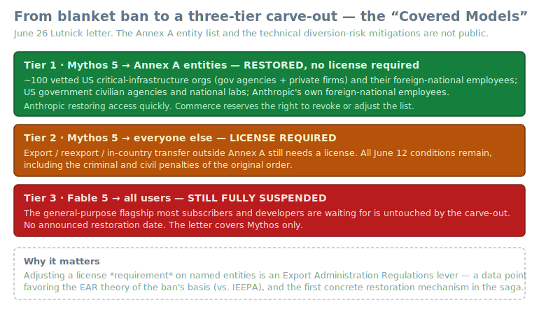
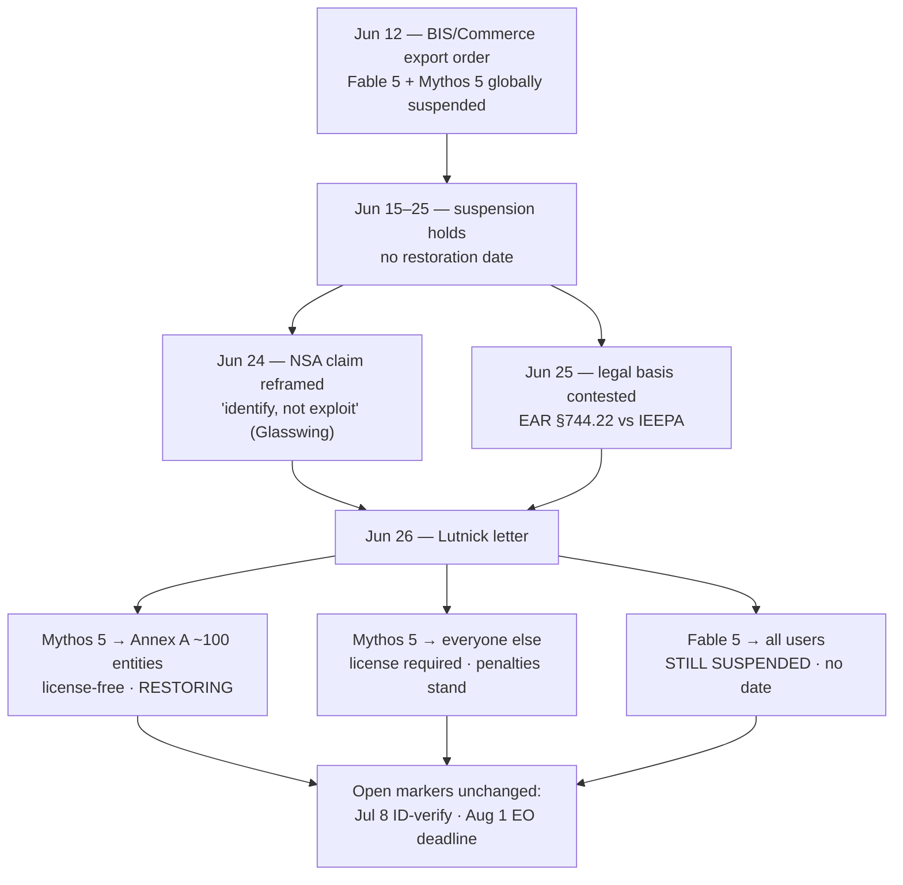

# LLM Updates — 2026-Jun-28

Sunday brief, written Sun Jun 28 (Los Angeles time). The running story — the
Jun-12 BIS/Commerce export order and the global suspension of **Fable 5 /
Mythos 5** — **moved for the first time in real terms this weekend.** After
two weeks in which every brief had to record "no new date," there is now a
concrete, dated, officially-signed restoration step: the **Jun 26 Lutnick
letter**, which brings **Mythos 5 back — but only for a vetted list of about
100 critical-infrastructure entities, and not Fable 5 at all.**

This is the single most important development since Thursday, and it is a
*policy/governance* development, not an architecture one. There was no new
frontier-model drop in the Jun 26–28 window; the story is the **mechanism**
by which a suspended model comes back, and what that mechanism reveals.

This report does **not** re-derive the established thread. The Jun-12 export
order mechanics and the Fable 5 / Mythos 5 suspension (Jun-15 → Jun-25), the
**NSA "breach" → Glasswing "identify-not-exploit"** reframing (Jun-24 §1),
the **Jul 8 ID-verification / Aug 1 EO** restoration markers (Jun-24 §2), the
**EAR §744.22 vs IEEPA legal-basis contest** (Jun-25 §2), **Claude Tag** on
Opus 4.8 (Jun-24 §3), **Sakana Fugu GA / Fugu Ultra** as an export hedge
(Jun-25 §1), the **GLM-5.2 vendor-vs-standardized** benchmark split (Jun-23
§1–2, Jun-24 §4), and the **RLVR / ∇-Reasoner** technique veins (Jun-22 §3,
Jun-23 §4) are all covered earlier. Here we advance only what is **new or
sharpened since Thursday**:

1. **Mythos 5 is partially restored.** The Jun 26 Lutnick letter removes the
   license requirement for exporting Mythos 5 to ~100 named **Annex A**
   critical-infrastructure organizations (plus US civilian agencies, national
   labs, and Anthropic's foreign-national employees). Anthropic is restoring
   access "quickly." This is the **first concrete restoration** since Jun 12.
2. **The carve-out is a data point on the legal-basis question.** Adjusting a
   *license requirement* on *named entities* is squarely an **Export
   Administration Regulations** action — evidence the order leans on the EAR
   §744.22 theory the Jun-25 brief laid out, not the IEEPA one. It also
   introduces a new regulatory category, **"Covered Models,"** with Commerce
   reserving the right to revoke or adjust the list.
3. **Fable 5 — the model people actually wait for — is untouched.** The
   general-purpose flagship remains fully suspended with no date. The
   restoration is sector-specific (defensive cyber for critical infra), which
   keeps the access-hedge thread (Sakana Fugu, GLM-5.2 open weights) live for
   everyone outside Annex A. The restoration calendar (Jul 8 / Aug 1) is
   otherwise unchanged.
4. **Research radar (context, not a new drop): RLVR minimalism.** The
   capability-boundary debate tracked Jun-22/23 has a clean illustrative
   line — **ROVER** (random-policy valuation, ICLR 2026) and its newer
   **Policy Improvement RL** follow-up — worth recording as the technique
   direction while the policy story dominates the headlines.

---

## 1. Mythos 5 is partially restored — the first real movement in the ban

For sixteen days the honest answer to "when does it come back" was *no date*.
That changed on **Jun 26**, when Commerce Secretary **Howard Lutnick** sent
Anthropic a letter authorizing a **limited restoration of Mythos 5**, the
company's cybersecurity-focused model. The operative language, as reported:
"a license will no longer be required to export, reexport, or in-country
transfer the Claude Mythos 5 Model to entities identified in **Annex A** to
this letter and their foreign national employees, or to Anthropic's foreign
national employees."

Who is covered:

- **~100 vetted US critical-infrastructure organizations** — a mix of
  government agencies and private firms — per multiple outlets (CNN, Axios,
  NBC, TechCrunch, Engadget).
- **US government civilian agencies and national labs.**
- **Anthropic's own foreign-national employees** (a practical fix to an
  internal-compliance problem the blanket order had created).

Anthropic, in its statement, said the government notified it that **Mythos 5
can be redeployed to US organizations that operate and defend critical
infrastructure**, and that it is **restoring access for these organizations
quickly** while continuing to work toward broader Mythos availability and,
eventually, Fable 5 for general use. The letter frames the engagement as
having "yielded significant progress," and notes Anthropic has **committed to
work with the government on protocols, standards, and releases for the
"Covered Models."**

This is narrower than a reinstatement and wider than nothing. It is the first
time the order has been *modified* rather than merely *defended*.

## 2. What the carve-out tells us — legal basis, and a new transparency gap

Two things follow from the *form* of the restoration.

**It is an EAR-shaped move.** The Jun-25 brief (§2) laid out the open
question of whether the order rests on **EAR §744.22** (military-intelligence
end-use export controls) or on **IEEPA** emergency authority — and noted the
EAR path's awkward fit with Commerce's own prior Advisory Opinions on remote
access. The Jun-26 letter does not resolve that fight, but it tilts it:
*selectively lifting a license requirement for a named annex of entities* is
the native vocabulary of the **Export Administration Regulations**, not of an
IEEPA emergency declaration. Lutnick also explicitly **reserved the right to
"reevaluate and adjust the scope of license requirements on the Covered
Models, should circumstances change"** — again, license-scope language. The
mechanism the government chose to *undo* part of the ban is the strongest
public signal yet about the authority it believes it is acting under.

**It opens a fresh transparency gap.** Two of the most load-bearing facts are
not public:

- **The Annex A list itself is unpublished.** "About 100 entities" is the
  reported figure; which 100 is not disclosed.
- **The technical mitigations are undisclosed.** Anthropic reportedly
  satisfied a government **diversion-risk assessment** to get the carve-out,
  but what those mitigations are — model-level guardrails, deployment
  controls, monitoring, access attestation — has not been described.

That matters because **"Covered Models" is now effectively a new regulatory
category**: a class of model whose distribution is governed by a per-entity
annex plus an undisclosed mitigation bar. For anyone tracking how frontier
models get governed (not just this one), the precedent is the story —
sector-permissioned, entity-listed, mitigation-gated access is a very
different regime from open weights or an open API.

## 3. Fable 5 is still dark — the hedge thread stays live

The carve-out is **Mythos-only**. Fable 5, the **general-purpose flagship**
that most subscribers and developers are actually waiting for, remains
**fully suspended with no announced date**. The restoration is scoped to
*defensive cybersecurity for critical infrastructure* — exactly the use case
the NSA/Glasswing narrative (Jun-24 §1) centered on — which is internally
consistent but does nothing for the broad developer base.

So the practical picture for everyone outside Annex A is unchanged, and the
**access-hedge dynamic this series has tracked stays live**:

- **Sakana Fugu / Fugu Ultra** (Jun-25 §1) — orchestration-as-a-product,
  pitched explicitly against the export wall.
- **GLM-5.2** MIT-licensed open weights with a 1M-token, repo-scale coding
  profile (Jun-23 §1) — the open-weight substitute story.
- Broadly, the **1M-context open-weight tier** (MiniMax M3 / MSA, GLM-5.2)
  remains the fallback for teams that cannot wait on a US licensing process.

**Restoration calendar:** the structural markers from Jun-24 §2 — **Jul 8**
(ID-verification path goes live) and **Aug 1** (the EO's 60-day
frontier-model-framework deadline) — are unchanged. What Jun 26 adds is the
first *proof of concept* that restoration happens **in tranches, by entity
class**, rather than as a single switch — which is the most useful thing to
update a prediction on.

## 4. Research radar — RLVR minimalism (context, not a June drop)

No new frontier model shipped in the Jun 26–28 window, so the technical note
here is a *direction*, flagged honestly as background rather than a fresh
release. The **RLVR capability-boundary debate** (does reinforcement learning
with verifiable rewards *expand* a model's reasoning set or merely *sharpen*
the base policy?) tracked in Jun-22 §3 and Jun-23 §4 has a clean illustrative
line worth recording:

- **ROVER — "Random Policy Valuation is Enough for LLM Reasoning with
  Verifiable Rewards"** (ICLR 2026). It formalizes RLVR math reasoning as a
  finite-horizon MDP with deterministic transitions, tree-structured
  dynamics, and binary terminal rewards, and shows the optimal action can be
  recovered from the **Q-function of a *fixed uniformly-random policy***,
  bypassing the usual generalized-policy-iteration loop (PPO/GRPO). Reported
  gains: **+8.2 pass@1** and **+16.8 pass@256** on AIME24/AIME25/HMMT25, while
  **maintaining policy entropy** (i.e., avoiding the diversity collapse that
  plagues GRPO) and surfacing reasoning strategies absent from the base model.
- A newer **Policy Improvement Reinforcement Learning** follow-up extends the
  "you don't need the full policy-iteration machinery" thesis.

The point for this series: the *expansion-vs-sharpening* question is being
attacked from the **algorithmic-minimalism** side — strip RLVR down, and the
"novel strategies emerge / entropy is preserved" evidence leans toward the
**expansion** camp. This is consistent with, but independent of, the
∇-Reasoner test-time-gradient vein. Treat as a watch-item, not a result that
moved a leaderboard this week.

---

## What's unchanged (so the clock stays honest)

- **Fable 5: no restoration date.** The Jun 26 letter does not touch it.
- **Out-of-Annex-A Mythos 5: license required**, all Jun-12 penalties intact.
- **Calendar markers**: Jul 8 (ID verification) and Aug 1 (EO 60-day
  framework deadline) unchanged.
- **Benchmark column**: no new standardized open-weight coding result since
  Jun-24 §4 (GLM-5.2 still vendor-only on SWE-Bench Pro; GPT-5.4 ~59.1% the
  standardized frontier line; MiniMax M3 ~59% unreproduced).

## Watch items into next week

1. **Is the Annex A list ever published**, and does Tier 2 (license-required
   Mythos) see any general loosening before Jul 8?
2. **Does a Fable 5 tranche appear** on the same entity-listed model, or does
   Fable wait for the broader Jul 8 / Aug 1 process?
3. **Do the undisclosed diversion-risk mitigations** become a template other
   labs/regulators reference for "Covered Models."

---

## Sources

**Mythos 5 partial restoration (Jun 26–27, 2026)**

- CNN Business — [US government allows Anthropic limited release of AI model that sparked cybersecurity concerns](https://www.cnn.com/2026/06/26/tech/anthropic-mythos-release)
- Axios — [Anthropic's Mythos is coming back for a select group of entities approved by the U.S. government](https://www.axios.com/2026/06/27/commerce-anthropic-mythos-restrictions-lift)
- NBC News — [U.S. government gives Anthropic green light for limited re-release of Mythos 5](https://www.nbcnews.com/tech/tech-news/us-government-gives-anthropic-green-light-limited-re-release-mythos-5-rcna352018)
- TechCrunch — [Trump Admin releases Anthropic Mythos to be used by more than 100 US companies, agencies](https://techcrunch.com/2026/06/26/trump-admin-releases-anthropic-mythos-to-be-used-by-more-than-100-us-companies-agencies/)
- Engadget — [Anthropic gets US government's permission to redeploy its Mythos cybersecurity AI model](https://www.engadget.com/2203088/anthropic-redeploy-mythos-cybersecurity-ai-model/)
- Anthropic — [Statement on the US government directive to suspend access to Fable 5 and Mythos 5](https://www.anthropic.com/news/fable-mythos-access)
- explainx.ai — [Is Fable 5 Back? Mythos Annex A Only — June 27 Update](https://explainx.ai/blog/is-fable-5-back-2026)

**Legal-basis / export-control background**

- explainx.ai — [Why Did the US Gov Ban Fable 5? The Full Anthropic Story](https://www.explainx.ai/blog/us-government-bans-fable-5-mythos-5-anthropic-export-control-2026)

**Research radar — RLVR minimalism**

- arXiv:2509.24981 — [Random Policy Valuation is Enough for LLM Reasoning with Verifiable Rewards (ROVER)](https://arxiv.org/abs/2509.24981)
- arXiv:2604.00860 — [Policy Improvement Reinforcement Learning](https://arxiv.org/pdf/2604.00860)

**Market / model context**

- Morph — [LLM Context Window Comparison (2026)](https://www.morphllm.com/llm-context-window-comparison)
- SWE-bench Verified (Agentic Coding) leaderboard — [llm-stats.com](https://llm-stats.com/benchmarks/swe-bench-verified-(agentic-coding))

*Note: several primary trackers (llm-stats, pricepertoken, Anthropic's own
page) returned 403s to automated fetches this run; the above reflects details
corroborated across multiple independent outlets per the brief's
continue-with-available-data policy. The Annex A entity list and the
diversion-risk mitigations remain undisclosed as of writing.*
