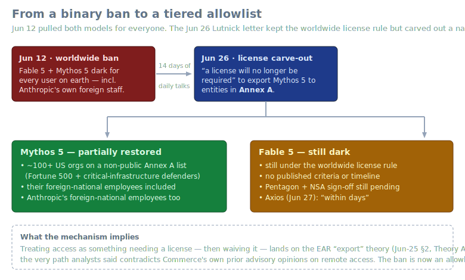

# LLM Updates — 2026-Jun-29

Monday brief, written Mon Jun 29 (Los Angeles time). The running story —
the Jun-12 BIS/Commerce export order and the worldwide suspension of
**Fable 5 / Mythos 5** — **moved for the first time since the order took
effect.** Over the weekend the action stopped being a binary "both models
dark for everyone" and became something structurally different: a **tiered
access regime**. On **Jun 26**, Commerce Secretary Howard Lutnick wrote to
Anthropic clearing **Mythos 5** for a named **"Annex A"** allowlist of
~100+ US institutions; on **Jun 27**, Axios reported **Fable 5** is on track
to return "within days." As of this morning (**Day 17**) Fable 5 is still
fully dark for general users, and Mythos 5 is restored only to the allowlist.

The single most important development since Thursday is therefore not a new
model — it is the **mechanism** by which the ban partially lifted. It
resolves the Jun-25 §2 legal-basis question in a concrete and contested way:
Commerce treated remote access as something requiring a **license** and then
**waived** that license for Annex A. That lands squarely on the **EAR
"export" theory** (Jun-25 §2, *Theory A*) — the very path analysts said
**contradicts Commerce's own prior advisory opinions** on remote access. The
"kill switch" framing of last week is now an operating **gatekeeping
allowlist**.

This report does **not** re-derive the established thread. The Jun-12 export
order mechanics and the Fable 5 / Mythos 5 suspension (Jun-15 → Jun-25), the
**NSA "breach" → Glasswing "identify-not-exploit"** reframing (Jun-24 §1),
the **EAR §744.22 vs IEEPA** legal-basis split (Jun-25 §2), the **Jul 8
ID-verification / Aug 1 EO** restoration markers (Jun-24 §2), the **Sakana
Fugu GA + Fugu Ultra** orchestration story (Jun-25 §1), **Claude Tag**
(Jun-24 §3), and the **GLM-5.2 / MiniMax M3 vendor-vs-standardized** benchmark
split (Jun-23/24 §4) are all covered earlier. Here we advance only what is
**new or sharpened since Thursday**:

1. **The ban partially lifted — as a tiered allowlist, not a binary
   restoration.** The Jun-26 Lutnick letter restores **Mythos 5** to
   ~100+ US "Annex A" entities (and their foreign-national employees, and
   Anthropic's) via a **license carve-out**. **Fable 5 stays dark**, awaiting
   Pentagon/NSA sign-off (§1).
2. **The mechanism picks — and exposes — the contested legal path.** By
   framing access as license-required-then-waived, Commerce operationalized
   the EAR theory Jun-25 §2 flagged as self-contradicting. New objections
   center on **opacity** (who's on Annex A, and why everyone else is off) and
   on a **standing "trusted-partner" tiering regime** (§2).
3. **Markets and calendar: front-end odds *fell* despite the progress.** A
   partial, allowlist-only lift is not the "restored for US customers"
   event the prediction markets price — so near-term odds dropped while
   long-horizon confidence stayed high (§3).
4. **Technical watch-items are flat.** No new frontier pretrained model since
   Thursday; **Fugu Ultra's 73.7% SWE-Bench Pro remains vendor-only and
   unreproduced** (§4).

---

## 1. The ban moved — Mythos 5 to an "Annex A" allowlist, Fable 5 still dark

For 14 days the export action had exactly two states in public discussion:
**held** or **lifted**. The weekend introduced a third. On **Friday Jun 26**,
Commerce Secretary **Howard Lutnick** wrote to Anthropic (the letter is
addressed to chief compute officer **Tom Brown**) stating that he had
"determined that appropriate safeguards are in place to permit certain
trusted partners to access the Claude Mythos 5 Model," and that — in the
operative line —

> "a license will no longer be required to export, reexport, or in-country
> transfer … the Claude Mythos 5 Model to entities identified in **Annex A**
> to this letter and their foreign national employees, or to Anthropic's
> foreign national employees."

What is concretely new since Thursday:

- **Mythos 5 is partially back — for a named list.** Annex A is a **non-public**
  roster of **~100+ US institutions**, reported to include several **Fortune
  500 firms** and government agencies, and described by Anthropic as
  organizations that **operate and defend critical infrastructure**. Lutnick
  cited "**significant progress**" in the daily talks since the block, and
  said Anthropic has **committed to work with the government on protocols,
  standards, and releases** for its models. First reported by **Semafor**
  (Jun 26), then widely corroborated.
- **Mythos, not Fable, went first — and that inverts the original premise.**
  The Jun-12 order's stated trigger was a **Fable 5 jailbreak** (Jun-24 §1's
  "identify-not-exploit" thread). Yet the model cleared first is **Mythos 5**,
  the *more* capable cyber model — restored specifically *to* critical-
  infrastructure defenders. The logic is defensive-deployment, not
  capability-tiering, but it is worth recording that the restoration order is
  the reverse of the threat order.
- **Fable 5 remains fully suspended.** Anthropic's Jun-26 statement says it is
  "continuing to work with the government to expand access to Mythos 5 and to
  make Fable 5 available for general use again." Per **Axios** (Jun 27), other
  agencies have determined Fable 5 can safely return, but the **Pentagon and
  NSA still have to give it the green light**; insiders expect limits "could
  be lifted as soon as the coming week." As of this morning (**Day 17**),
  Fable 5 is dark for consumers, API, Claude Code, and all international
  subscribers.

```mermaid
flowchart LR
    classDef ban fill:#7f1d1d,stroke:#450a0a,color:#fee2e2;
    classDef ok fill:#15803d,stroke:#14532d,color:#dcfce7;
    classDef wait fill:#a16207,stroke:#713f12,color:#fef9c3;
    classDef gov fill:#1e3a8a,stroke:#1e293b,color:#dbeafe;

    B["Jun 12 &#183; both models dark worldwide"]:::ban --> L["Jun 26 &#183; Lutnick letter to Tom Brown<br/>license carve-out for Annex A"]:::gov
    L --> M["Mythos 5 &#8594; ~100+ Annex A US orgs<br/>+ their foreign-national staff<br/>+ Anthropic's foreign-national staff"]:::ok
    L --> F["Fable 5 &#8594; still worldwide-licensed<br/>awaiting Pentagon + NSA"]:::wait
    F -->|Axios: &#8220;within days&#8221;| F2["Jun 29 &#183; Day 17, still dark"]:::ban
```

**Why this is the lead:** for two weeks the only question was *when* the ban
lifts. The answer turned out to change the *kind* of thing the ban is. A
binary suspension became a **standing allowlist** that Commerce can expand
entity-by-entity — a structure that outlives this episode (§2).

Sources:
[Semafor — US releases powerful Anthropic model Mythos to some US companies](https://www.semafor.com/article/06/27/2026/us-releases-powerful-anthropic-model-mythos-to-some-us-companies),
[9to5Mac — Anthropic cleared to release Mythos 5 to over 100 US institutions](https://9to5mac.com/2026/06/26/anthropic-cleared-to-release-claude-mythos-5-to-over-100-us-institutions/),
[CNN Business — US allows Anthropic limited release of Mythos](https://www.cnn.com/2026/06/26/tech/anthropic-mythos-release),
[Axios — Scoop: Fable 5 on track to return soon](https://www.axios.com/2026/06/27/anthropic-fable-5-return-soon),
[Neowin — US partially reverses ban for Mythos but keeps Fable 5 off](https://www.neowin.net/news/us-partially-reverses-anthropic-ai-ban-for-mythos-but-keeps-fable-5-off-the-market/),
[US News / Reuters — US releases Mythos to some US companies](https://money.usnews.com/investing/news/articles/2026-06-26/us-releases-anthropic-model-mythos-to-some-us-companies-semafor-reports).
Prior: Jun-24 §1, Jun-25 §3.

---

## 2. The carve-out picks the contested legal path — and adds an opacity problem

Jun-25 §2 mapped the order to two possible statutory homes and noted each had
a structural flaw: the **EAR §744.22** "export" theory contradicts Commerce's
own advisory opinions that remote access to hosted software is **not** an
export, while the **IEEPA** route runs into the Berman informational-materials
carve-out and a missing emergency declaration. The Jun-26 letter effectively
**chooses Theory A in public**: it speaks of a **license** that is "**no
longer required**" for Annex A — language only coherent if access *was* an
"export" requiring a license to begin with. So the mechanism that lifted the
ban for Mythos is built on the same EAR footing analysts had already called
internally inconsistent. Commentators (TechPolicy.Press) put it directly:
whether "existing authorities clearly support such an interpretation remains
subject to debate," and the debate's mere existence shows "how far regulators
and regulated firms have moved beyond the assumptions embedded in traditional
export-control frameworks."

The carve-out also opened a **second, new** line of objection that did not
exist last week — **selection opacity**:

- **Annex A is secret.** No public criteria explain who is on it. **John
  Coleman**, legislative counsel at the Foundation for Individual Rights and
  Expression (FIRE), framed the problem: "**No one knows how these companies
  are chosen and why everyone else is excluded.**"
- **It institutionalizes a "trusted-partner" tier.** Lutnick has separately
  pitched giving "trusted partners" privileged access to frontier models
  (raised at the G7). European analysts (CEPA, AI Frontiers) read Annex A as
  the first concrete instance of a regime where **access to the US AI stack
  becomes a privilege Washington grants or revokes** — with allies, and now
  individual firms, "scrambling for a place on the trusted list."
- **Fable 5 is the control case.** It remains under the **original worldwide
  license rule with no published criteria or timeline** — so the same opacity
  applies to what an *approved* Fable transfer will even look like.

```mermaid
flowchart TD
    classDef q fill:#7f1d1d,stroke:#450a0a,color:#fee2e2;
    classDef m fill:#1e3a8a,stroke:#1e293b,color:#dbeafe;
    classDef r fill:#15803d,stroke:#14532d,color:#dcfce7;

    M["Jun-26 carve-out:<br/>&#8220;license no longer required&#8221;"]:::m --> A["implies access WAS<br/>a licensable export<br/>= EAR Theory A"]:::m
    A --> Q1["but EAR Theory A contradicts<br/>Commerce's own advisory opinions<br/>(Jun-25 &#167;2)"]:::q
    M --> Q2["new: Annex A is secret &#8212;<br/>no criteria for who's in/out (FIRE)"]:::q
    M --> Q3["new: a standing &#8220;trusted-partner&#8221;<br/>tier Washington can grant/revoke"]:::q
    Q1 --> R["resolution leaves the<br/>authority MORE contested,<br/>not less"]:::r
    Q2 --> R
    Q3 --> R
```

Why it matters: last week the legal question was *which* theory the ban
rested on. This week the government **acted on one of them**, which both
narrows the question (it's the EAR path) and sharpens the objection (that's
the self-contradicting path) — and layers a governance problem (opacity)
on top. The episode is becoming a **template** for how frontier-model access
is gated, not a one-off.

Sources:
[TechPolicy.Press — Commerce eased its block on Mythos, but major questions remain](https://www.techpolicy.press/commerce-eased-its-block-on-anthropics-mythos-but-major-questions-remain/),
[CEPA — US AI export controls cause furor](https://cepa.org/article/us-ai-export-controls-cause-furor/),
[AI Frontiers — what the export controls on Anthropic's models mean for Europe](https://ai-frontiers.org/articles/what-export-controls-on-anthropics-most-advanced-models-mean-for-europe),
[Volkov Law — when the government pulls the plug](https://blog.volkovlaw.com/2026/06/when-the-government-pulls-the-plug-anthropic-export-controls-and-the-future-of-ai-governance/).
Legal-basis origin: Jun-25 §2.

---

## 3. Markets and calendar — front-end odds fell on a partial lift

Counter-intuitively, the partial restoration **lowered** near-term
prediction-market odds rather than raising them. The reason is definitional:
the tracked market resolves on **"Fable 5 restored for US customers,"** and
an **Annex-A-only Mythos lift is not that event** — so progress on Mythos did
not move the Fable contract, while the *absence* of a general Fable lift by
the weekend bled out the front end.

| Marker | Jun-25 §3 | Jun-29 |
|---|---|---|
| Restored by **Jul 1** | ~57% | **~43%** (down) |
| Restored by **Jul 17 / 31** | ~75% (Jul 17) | **~90%** (Jul 31) |
| Restored by **Dec 31** | — | **~97%** |
| Today's bucket | — | **~34.5%** |
| Jul 8 ID verification (Persona) | unchanged | unchanged — still the most-cited US-persons mechanism |
| Aug 1 EO 60-day framework deadline | unchanged | unchanged |

The shape is "**timing problem, not existential one**": traders give little
room for an *immediate* general restart but high confidence in eventual
repair (~$3.4M traded). That is consistent with §1's facts — Mythos moved,
Fable is "within days" but gated on Pentagon/NSA, and there is still **no
official Fable restoration date**.

Sources:
[Polymarket — Claude Fable 5 restored for US customers](https://polymarket.com/event/claude-fable-5-restored-for-us-customers-by-20260613193753196),
[Yahoo Finance — prediction market bets Fable 5 stays dark, restoration barely a coin toss by July](https://finance.yahoo.com/markets/crypto/articles/prediction-market-bets-fable-5-102900668.html),
[explainx.ai — Is Fable 5 back? Mythos Annex A only (Jun 27 update)](https://explainx.ai/blog/is-fable-5-back-2026).
Calendar markers: Jun-24 §2.

---

## 4. Technical watch-items — flat since Thursday

No new frontier *pretrained* model shipped over the weekend; the technical
picture is unchanged from the Jun-25 brief.

| Watch item | Movement by Jun-29 |
|---|---|
| Independent reproduction of **Fugu Ultra's 73.7%** SWE-Bench Pro (Jun-25 §1) | **Still No** — figures remain **Sakana-run on the mini-swe-agent harness**, with competitor baselines provider-reported rather than re-run in an identical environment. No third-party leaderboard entry has appeared. The honest read remains "strong, pending reproduction." |
| Standardized **SEAL** entry for **GLM-5.2** coding (Jun-24 §4) | **No** — open-weight coding leaders (DeepSeek V4-Pro, MiniMax M3, Qwen 3.7) still cluster on **vendor** boards; the open-vs-closed gap continues to narrow but the standardized-coding claim is unsettled. |
| Open-weight "fallback" cluster (the Jun-9 wave: Cohere North Mini Code, Kimi K2.7-Code, GLM-5.2) | **Stable** — still the practical non-US hedge while Fable is dark; no new entrant since Thursday. |
| Claude Tag adoption (Jun-24 §3) | **No new data.** |

The structural point from Jun-25 §1 still holds: this week's most-watched
*advances* are **systems and access regimes**, not a bigger base model. The
orchestration story (Fugu) and the allowlist story (§1–2) are both answers to
the same question — how to get frontier capability when a single artifact can
be switched off by order.

Sources:
[VentureBeat — Sakana achieves frontier performance with Fugu](https://venturebeat.com/orchestration/no-claude-fable-5-no-problem-sakana-achieves-frontier-performance-with-new-fugu-multi-model-auto-synthesis-system),
[Verdent — Fugu Ultra for coding agents: reading the benchmarks](https://www.verdent.ai/guides/devtools/fugu-ultra-coding-agents),
[The New Stack — Fable 5 ban: 4 open models responded before Anthropic could restore access](https://thenewstack.io/fable-ban-open-weights/),
[Morph — best AI model for coding (June 2026)](https://www.morphllm.com/best-ai-model-for-coding).
Prior: Jun-25 §1, Jun-24 §4.

---

## What to watch (Jun 29 → next brief)

1. **A general Fable 5 restoration** — specifically the **Pentagon/NSA
   sign-off** Axios named as the last gate, and whether it arrives as a
   general lift or as Fable's own **Annex A**. The prediction-market front end
   (~43% by Jul 1) is the cleanest live read (§3).
2. **The Annex A criteria becoming public** — or staying secret. FIRE's
   selection-opacity objection (§2) is the governance story if the list
   remains non-public while it grows.
3. **Whether "trusted-partner" tiering becomes formal policy** beyond this
   one letter — the Aug 1 EO framework deadline (§3) is where an ad-hoc
   allowlist could harden into a regime.
4. **Any litigation or published order text** that would let analysts replace
   "EAR Theory A, self-contradicting" (§2) with a tested legal read.
5. **Independent Fugu Ultra reproduction** — still the single cleanest test of
   the orchestration-beats-single-model claim (§4).

---

### Method & limitations

Compiled from public web search on **Jun 29, 2026 (LA time)**. Consistent
with every prior brief, automated fetching hit **widespread HTTP 403** — the
Anthropic statement page and TechPolicy.Press both blocked direct retrieval —
so figures here rest on **search-result summaries and corroborating secondary
coverage**, cross-checked across outlets and flagged where vendor-run,
approximate, or analyst-inferred. The **Annex A list is non-public**; the
"~100+ entities / Fortune 500" characterization is from reporting on the
Lutnick letter, not the list itself. The **letter's full text and the order's
underlying legal basis remain unpublished**; the EAR-path reading in §2 is
analysts' best interpretation of the mechanism, not a court finding.
**Fugu Ultra's benchmark figures are Sakana-reported and unreproduced** (§4).
Prediction-market odds are point-in-time and move intraday. **Fable 5
restoration status** is current as of the morning of Jun 29 with **no official
date**. This report intentionally does not repeat material already covered in
the Jun-08 → Jun-25 briefs and advances only what is new or sharpened since
Jun 25.
