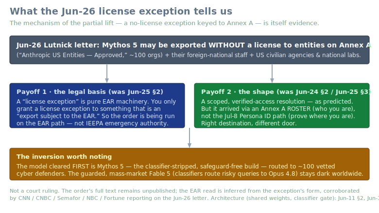

# LLM Updates — 2026-Jun-30

Tuesday brief, written Tue Jun 30 (Los Angeles time). The running story — the
Jun-12 BIS/Commerce export order and the global suspension of **Fable 5 /
Mythos 5** — moved for the first time in two weeks. It is now **Day 18**, and
as of last Thursday's brief the only honest line was "no restoration date."
That line is now obsolete: on **Jun 26** the government issued the **first
partial lift**, and the shape of that lift is the whole story today.

The single most important development since Wednesday is policy, not
architecture: a **Jun-26 letter from Commerce Secretary Howard Lutnick**
cleared **Mythos 5** — the *classifier-stripped, safeguard-free* build — for
redeployment **without an export license** to a defined roster of roughly
**100 US critical-infrastructure organizations** (Annex A). **Fable 5, the
guarded model millions actually used, stays dark worldwide.** That ordering
is an inversion worth sitting with, and the *mechanism* of the lift quietly
answers a question the Jun-25 brief had to leave open.

This report does **not** re-derive the established thread. The Jun-12 export
order, the Fable 5 / Mythos 5 suspension timeline (Jun-15 → Jun-25), the
**shared-weights + cyber/bio/distillation classifier-gate architecture that
routes flagged queries to Opus 4.8** (Jun-11 §2, Jun-13), **Project
Glasswing** as a defensive program and the original "Mythos 5 for ~150
defenders" *intention* (Jun-08 §7, Jun-11 §3), the **NSA "breach" → Glasswing
identify-not-exploit** reframing (Jun-24 §1), the **EAR §744.22 vs IEEPA**
legal-basis debate (Jun-25 §2), and the **Sakana Fugu / Fugu Ultra**
orchestration story (Jun-25 §1, May-16 §5.4) are all covered earlier. Here we
advance only what is **new or sharpened since Wednesday**:

1. **The first partial lift: Mythos 5 cleared for ~100 critical-infrastructure
   orgs via an Annex A license exception (Jun 26).** What was Anthropic's
   *intention* on Jun-11 is now a *government-authorized, license-free export
   pathway* — and it is the **safeguard-free** model that returned first.
2. **The lift's mechanism answers the Jun-25 legal-basis question.** A BIS
   **license exception** is EAR machinery; you only except something that is
   an "export subject to the EAR." That points to the **EAR path, not IEEPA**
   — and it lands the resolution where the briefs predicted (scoped, verified
   access), but through an **Annex A roster**, not the Jul-8 Persona ID door.
3. **Fable 5 status: Day 18, "this week," gated on Pentagon + NSA.** Axios
   (Jun 27) and Forbes (Jun 29) report Fable 5 "on track to return soon,"
   with **Pentagon and NSA sign-off still outstanding**. Not back as of today.
4. **Technical sharpening — Fugu Ultra's "matches Fable 5" claim has an
   asterisk.** Fable 5 itself scores **80.0** on SWE-Bench Pro vs Fugu Ultra's
   vendor-reported **73.7**, and **Fable 5 is not in Fugu's routable pool** —
   so the orchestrator both trails the model it invokes and cannot call it.

---

## 1. The first partial lift — Mythos 5 returns to ~100 defenders, safeguard-free, license-free

For 14 days the suspension was binary: both models dark for everyone. On
**Jun 26** that broke. Commerce Secretary **Howard Lutnick** sent Anthropic a
letter concluding that *"appropriate safeguards are in place to permit certain
trusted partners to access the Claude Mythos 5 model."* Anthropic confirmed it
publicly the same day: *"the government notified us that Mythos 5, our
strongest cybersecurity model, can be redeployed to a set of US organizations
that operate and defend critical infrastructure."*

What is actually new since the Jun-11 brief flagged "Mythos 5 for defenders"
as Anthropic's *plan*:

- **It is now a government-authorized export pathway, not a vendor intention.**
  Under the revised terms, Mythos 5 may be **exported, re-exported, or
  transferred without a license** to entities on **Annex A** ("Anthropic US
  Entities — Approved") and their foreign-national employees, to Anthropic's
  own foreign-national staff, and to **US-government civilian agencies and
  national laboratories**. The Jun-11 plan was Anthropic saying what it would
  do; this is Commerce saying what is now *permitted*.
- **The roster is ~100 orgs and overlaps Project Glasswing.** Reporting puts
  the count at "roughly 100 companies and federal agencies," many of them
  Fortune 500, cleared for **defensive cybersecurity** use. Several sources
  note the approved list draws heavily on **Project Glasswing** participants —
  tying the Jun-26 roster directly back to the Jun-24 §1 Glasswing thread.
  Lutnick **explicitly reserves the right to re-evaluate the list at any time**.
- **The safeguard-free model is the one that came back first.** This is the
  inversion. Mythos 5 is the build with the **cyber/bio/distillation
  classifiers removed** — the *unguarded* artifact. Fable 5 is the guarded
  product that, per Anthropic, falls back to Opus 4.8 on **fewer than 5% of
  sessions** when a classifier trips (architecture: Jun-11 §2, Jun-13). The
  government's resolution restores the *more* capable, *less* safeguarded model
  to a vetted few, while the safety-wrapped consumer model stays off — the
  logic being that defenders need the unblunted tool and can be trusted with
  it, where the open public could not.

```mermaid
flowchart TD
    classDef base fill:#475569,stroke:#1e293b,color:#ffffff;
    classDef open fill:#a16207,stroke:#713f12,color:#fef9c3;
    classDef guard fill:#1e3a8a,stroke:#1e293b,color:#dbeafe;
    classDef ok fill:#15803d,stroke:#14532d,color:#dcfce7;
    classDef dark fill:#7f1d1d,stroke:#450a0a,color:#fee2e2;

    W["shared model weights"]:::base --> M["Mythos 5<br/>(classifiers stripped &#8212; safeguard-free)"]:::open
    W --> F["Fable 5<br/>(cyber / bio / distillation gate<br/>&#8594; routes risky queries to Opus 4.8)"]:::guard
    M --> L["Jun-26 Annex A license exception<br/>(no export license required)"]:::ok
    L --> D["~100 critical-infra orgs (Glasswing)<br/>+ foreign-national staff<br/>+ US civilian agencies &amp; national labs"]:::ok
    F --> X["still suspended WORLDWIDE<br/>(Pentagon + NSA sign-off pending)"]:::dark
```

**Why this leads:** for two weeks the only question was *when* the wall comes
down. The Jun-26 letter reframes it to *for whom, and which model* — and the
answer (unguarded model, vetted roster, defensive use) is a far more granular
outcome than "ban" or "no ban." It also makes the **export control look
durable as a shape**, not a temporary error: Commerce did not lift the order,
it *carved an exception into it*.

Sources:
[CNBC — Trump admin allows Anthropic to release Mythos to some companies/agencies](https://www.cnbc.com/2026/06/26/us-government-anthropic-claude-mythos5-ai.html),
[CNN Business — US allows Anthropic limited release of Mythos](https://www.cnn.com/2026/06/26/tech/anthropic-mythos-release),
[Semafor — US releases powerful Anthropic model Mythos to some US companies](https://www.semafor.com/article/06/27/2026/us-releases-powerful-anthropic-model-mythos-to-some-us-companies),
[NBC News — green light for limited re-release of Mythos 5](https://www.nbcnews.com/tech/tech-news/us-government-gives-anthropic-green-light-limited-re-release-mythos-5-rcna352018),
[Fortune — Mythos 5 cleared by US for wider use](https://fortune.com/2026/06/27/anthropic-mythos-5-ai-model-us-commerce-department-clearance-fable/),
[TechTimes — Fable 5 still offline as US clears Mythos 5 for critical infrastructure](https://www.techtimes.com/articles/319213/20260628/claude-fable-5-still-offline-us-clears-mythos-5-critical-infrastructure.htm),
[CBC — Mythos released to 'trusted' US organizations](https://www.cbc.ca/news/world/united-states-anthropic-artificial-intelligence-mythos-ai-9.7251397),
[Anthropic (X) — statement on Mythos 5 redeployment](https://x.com/AnthropicAI/status/2070665903440871779).
Prior intention / architecture: Jun-11 §2–3, Jun-13. Glasswing: Jun-24 §1.

---

## 2. The mechanism answers the legal-basis question — it's the EAR path

The Jun-25 brief (§2) had to leave the ban's statutory footing as an open
either/or: **EAR §744.22** military-intelligence end-use controls, or **IEEPA**
emergency authority — with the order's text unpublished, analysts could only
map both and flag a flaw in each. The Jun-26 lift's *form* now tips it.

- **A "license exception" is EAR vocabulary.** Lutnick's letter authorizes
  export of Mythos 5 to Annex A entities **"without a license."** You can only
  *except* from licensing something that would otherwise *require* an export
  license — i.e., an **"export subject to the EAR."** Granting a license
  exception is therefore an admission, in the administrative grammar, that the
  order is being administered on the **EAR path**, not as an IEEPA emergency
  declaration (which the administration never conspicuously invoked, per
  Jun-25 §2). The SVG above lays this out.
- **It does not erase the Jun-25 flaw — it sharpens it.** If this is EAR, then
  the structural objection analysts raised (Commerce's own prior Advisory
  Opinions read remote access to hosted software as *not* an export) is now
  the **live** objection, not a hypothetical one. The exception presumes the
  thing is an export; the prior AOs say it isn't. That tension is now load-
  bearing rather than academic.
- **The resolution arrived where predicted, by a different door.** Jun-24 §2
  and Jun-25 §3 argued the contested footing pushed toward a **scoped,
  verified-access** outcome over indefinite darkness. That is exactly what
  Jun-26 is. But the briefs expected the vehicle to be the **Jul-8 Persona ID
  verification** path (prove *where* a user is). Instead it came through an
  **Annex A roster** (prove *who* an organization is). Right destination,
  different mechanism — the entity-list door opened before the user-ID door.

**Why it matters:** this is the first week the legal-basis question stopped
being purely theoretical. We still do not have the order's text, and this is
not a court ruling — it is an inference from the *shape* of the relief. But
"the relief is a BIS license exception" is a concrete data point that the
Jun-25 brief did not have, and it favors the EAR reading.

Sources:
[Semafor — terms of the Mythos release (license, Annex A)](https://www.semafor.com/article/06/27/2026/us-releases-powerful-anthropic-model-mythos-to-some-us-companies),
[GovConWire — Mythos 5 access restored for select US orgs](https://www.govconwire.com/articles/anthropic-mythos-5-access-restored-select-us-orgs),
[SecureWorld — Mythos export ban signals new rules for AI vulnerability tools](https://www.secureworld.io/industry-news/mythos-export-ban-ai-vulnerability-tools),
[Bloomberg — read the Lutnick letter that led Anthropic to disable Mythos](https://www.bloomberg.com/news/articles/2026-06-16/read-the-lutnick-letter-that-led-anthropic-to-disable-mythos).
Legal-basis framing: Jun-25 §2. Restoration markers: Jun-24 §2.

---

## 3. Fable 5 — Day 18, "this week," gated on Pentagon + NSA

The consumer/developer model is **still dark worldwide**, and all criminal and
civil penalties from the Jun-12 directive remain in force for it. What changed
is the *signal*, not the status:

- **Axios (Jun 27)** reported Fable 5 "on track to return soon," with the
  administration's limits possibly lifted "as soon as this coming week," after
  negotiations progressed.
- **Forbes (Jun 29, Day 17)** framed it as "coming back this week?" — still
  unconfirmed, with the explicit caveat that **the Pentagon and the National
  Security Agency have yet to formally clear Fable 5.** Other civilian agencies
  reportedly concluded it could safely return; the security agencies are the
  remaining gate.

| Marker | Date | Status as of Jun 30 |
|---|---|---|
| Mythos 5 to Annex A (~100 orgs) | **Jun 26** | **DONE** — first partial lift (§1) |
| Fable 5 general restoration | "this week" | pending **Pentagon + NSA** sign-off; not back today |
| Persona ID verification goes live | **Jul 8** | unchanged — now looks like the *user-level* door, after the *entity-level* Annex A door (§2) |
| EO 60-day frontier-framework deadline | **Aug 1** | unchanged — structural negotiating path |

This section keeps the clock honest: the **facts for Fable 5 did not change**
on Jun 30 (still suspended), but the **trajectory** did — a near-term return is
now the reported base case rather than an open-ended wait, contingent on two
named approvers.

Sources:
[Axios — Fable 5 on track to return soon](https://www.axios.com/2026/06/27/anthropic-fable-5-return-soon),
[Forbes (Schmelzer) — is Anthropic's Fable 5 coming back this week?](https://www.forbes.com/sites/ronschmelzer/2026/06/29/is-anthropics-fable-5-coming-back-this-week/),
[SFG Media — Trump administration close to restoring Fable 5 (Pentagon/NSA)](https://sfg.media/en/a/trump-administration-anthropic-fable-5-pentagon-nsa/),
[Blockonomi — Fable 5 poised for comeback following security assessment](https://blockonomi.com/anthropics-fable-5-ai-system-poised-for-comeback-following-security-assessment/).
Restoration-markers history: Jun-24 §2, Jun-25 §3.

---

## 4. Technical sharpening — Fugu Ultra's "matches Fable 5" claim, re-examined

The Jun-25 brief (§1) logged Sakana **Fugu Ultra**'s headline — **SWE-Bench Pro
73.7%**, *above* Opus 4.8's vendor 69.2% — and flagged that **every figure is
Sakana-run and unreproduced**. A week of follow-on coverage doesn't reproduce
the numbers, but it sharpens the *interpretation* in two ways the Jun-25 brief
did not have:

- **Fugu Ultra trails the model it claims to match.** **Fable 5 itself scores
  ~80.0 on SWE-Bench Pro** — comfortably above Fugu Ultra's **73.7**. So "Fugu
  Ultra matches Fable 5" is, on this benchmark, an *overstatement*: the
  orchestrator lands ~6 points short of the frontier model it is positioned
  against.
- **And it cannot route to Fable 5 anyway.** Fable 5 is **not in Fugu's
  swappable pool** (it is export-suspended). So Fugu's claim rests on
  assembling *other* workers — Opus 4.8, GPT-5.5, Gemini 3.1 Pro and open
  weights — to *approximate* a model it has no access to. That is a more
  impressive systems result than the "matches Fable 5" line implies, and a
  weaker capability claim — both at once.
- **The methodology caveat compounds the gap.** Fugu's 73.7 is reported on a
  specific scaffold (the `mini-swe-agent` harness), while the competitor
  baselines are each vendor's *own* reported numbers, not re-run in Fugu's
  environment. Apples-to-apples reproduction — the Jun-25 §1 watch item — is
  still outstanding.

This is the same orchestration-as-a-product trend the academic literature is
now formalizing (e.g. runtime "Mixture-of-Models" deliberation and training-
time multi-agent-orchestration-as-RL work surfacing in mid-2026 paper lists) —
the research backbone under the Fugu product story. The technical takeaway is
unchanged from Jun-25 and now better quantified: **a learned router can get
*close* to a frontier model from a portfolio, but "close" here is measurably
below the model it names, and the headline still hasn't been reproduced off
Sakana's harness.**

Sources:
[Kingy AI — Sakana Fugu benchmarks vs open-source models (Fable 5 = 80.0; Fable not in pool)](https://kingy.ai/ai/sakana-fugu-benchmarks-open-source-models/),
[Lushbinary — Fugu Ultra benchmarks explained (SWE-Bench & GPQA)](https://lushbinary.com/blog/fugu-ultra-benchmarks-explained-swe-bench-gpqa/),
[Verdent — Sakana Fugu Ultra for coding agents: reading the benchmarks](https://www.verdent.ai/guides/devtools/fugu-ultra-coding-agents),
[paddo.dev — a multi-agent system sold as a model: Sakana's Fugu](https://paddo.dev/blog/sakana-fugu-orchestration-model/),
[Sebastian Raschka — LLM research papers 2026 (orchestration / multi-agent reasoning)](https://magazine.sebastianraschka.com/p/llm-research-papers-2026-part1).
Prior Fugu coverage: Jun-25 §1, May-16 §5.4.

---

## 5. Watch-item status since Jun-25

| Jun-25 watch item | Movement by Jun-30 |
|---|---|
| Any official restatement of the ban's legal basis / order text public | **Indirect yes.** Text still unpublished, but the Jun-26 lift's **license-exception form points to the EAR path** (§2). |
| Jul-8 ID verification as the concrete restoration vector | **Superseded as the *first* door.** The **Annex A entity roster** (§1) opened before Persona ID; Jul-8 now reads as the user-level step (§3). |
| Independent reproduction of Fugu Ultra's 73.7% | **Still No.** Plus new context: Fable 5's own **80.0** sits above it, and Fable isn't in Fugu's pool (§4). |
| Standardized SEAL entry for GLM-5.2 coding | **No change** — still vendor-board only; no new standardized run surfaced this week. |
| Whether other labs copy the orchestration-product tier | **No new product** — but the academic line (Mixture-of-Models / multi-agent-orchestration-as-RL) keeps building (§4). |

---

## What to watch (Jun 30 → next brief)

1. **Fable 5's actual return and its terms.** The reported base case is "this
   week," gated on **Pentagon + NSA** (§3). The terms matter as much as the
   date: does it come back globally, US-persons-only via Jul-8 Persona ID, or
   on its own scoped roster like Mythos?
2. **The order's text, now that EAR is the likely frame.** If §2's inference is
   right, the live question becomes whether Commerce reconciles the exception
   with its own prior Advisory Opinions on remote access — or whether anyone
   litigates that gap.
3. **The Annex A roster's contents and how it grows.** Lutnick reserved the
   right to revise it "at any time"; who is added/removed is now a governance
   signal in its own right.
4. **Independent SWE-Bench Pro reproduction of Fugu Ultra** that *counts
   orchestration tokens* — still the cleanest test of orchestration-beats-
   single-model, now with the Fable-5-at-80.0 yardstick in view (§4).
5. **A standardized SEAL entry for GLM-5.2** — still the cleanest test of the
   open-weight coding claim.

---

### Method & limitations

Compiled from public web search on **Jun 30, 2026 (LA time)**. Consistent with
prior briefs, automated fetching hit **widespread HTTP 403** (Forbes, CNBC,
TechTimes, Kingy AI and others blocked direct retrieval), so figures here rest
on **search-result summaries and corroborating secondary coverage**, and are
flagged where vendor-run, approximate, or analyst-inferred. The **Jun-26
partial lift** (§1) is corroborated across CNN, CNBC, Semafor, NBC, Fortune,
CBC and Anthropic's own statement; the **~100-org** count and Glasswing overlap
are as reported, not an official published roster. The **EAR-vs-IEEPA reading**
(§2) is an **inference from the license-exception form**, not a court finding;
the order's full text remains unpublished. **Fable 5's return** (§3) is
reported as imminent but was **not confirmed as of this writing** and is gated
on Pentagon/NSA sign-off. **Fugu Ultra's 73.7 and Fable 5's 80.0 on SWE-Bench
Pro** (§4) are vendor-reported and not independently reproduced on a common
harness. This report intentionally does not repeat material already covered in
the Jun-08 → Jun-25 briefs (notably the shared-weights/classifier architecture
and the Sakana Fugu GA writeup) and advances only what is new or sharpened
since Jun 25.
