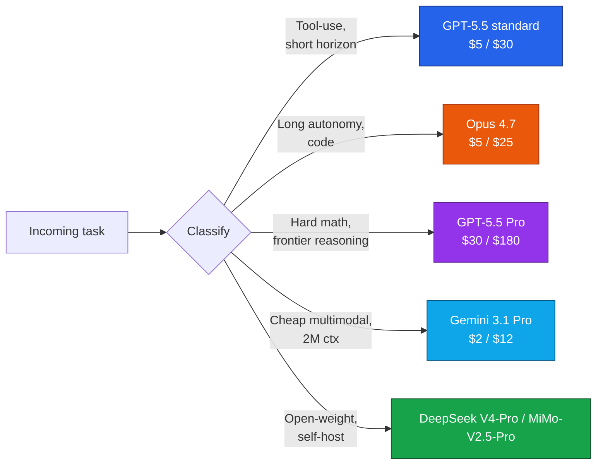
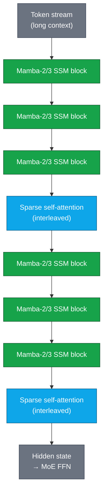
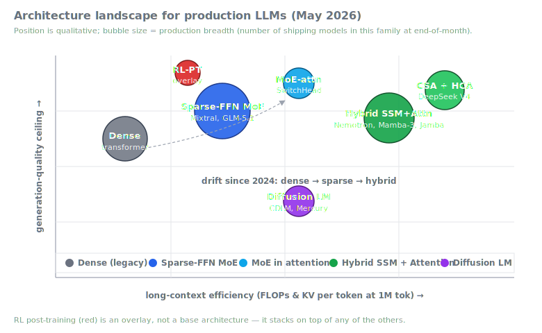
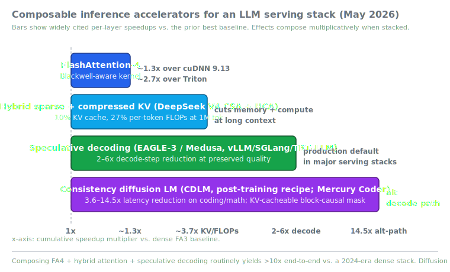
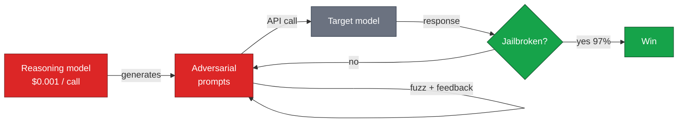
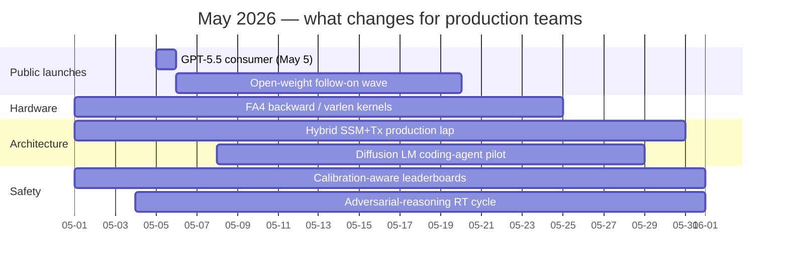

# LLM Updates — 2026-May-01

First-of-the-month brief, written Friday May 1 (LA time). The goal here
is to **roll the calendar forward**: April 30's end-of-month synthesis
covered agent reliability vocabulary, calibration scoring, and MoE
moving into the attention block. May 1 is a different beat — it is the
last working day before **GPT-5.5's public consumer launch** (May 5),
the first quarter where **hybrid SSM-Transformer** architectures are
shipping in production at multiple labs, and the first month where
**diffusion language models** have a credible inference-speed argument
against autoregressive transformers.

The themes in this note that were *not* the focus of the April 30
passes:

1. **GPT-5.5's actual numbers** (now disclosed in the API and system
   card) and what they imply for production routing.
2. **The SSM-Transformer hybrid is now production-validated**, not just
   research — Mamba-3 (ICLR 2026 oral), NVIDIA Nemotron 3 Nano Omni,
   Jamba, IBM Granite 4 are all shipping.
3. **Diffusion language models** as a real alternative decode path
   after CDLM showed 14.5x latency reductions with KV-cache
   compatibility.
4. **The inference stack is stratifying** into composable layers
   (FlashAttention-4 → hybrid sparse/compressed KV → speculative
   decoding → optional diffusion path) that yield >10x end-to-end vs.
   2024 stacks.
5. **Adversarial reasoning models autonomously jailbreak peer
   models** at 97%+ success rates — a red-team cost-curve collapse
   that is the most important alignment story of the month.

The frontier table is refreshed with disclosed pricing and benchmarks
for GPT-5.5 / 5.5 Pro, which were API-only on April 23–24 and become
public on May 5. Material already covered in the April 30 passes
(reliability decay curves, AA-Omniscience calibration scoring, MoE in
attention) is referenced briefly, not re-derived.

---

## 1. GPT-5.5: the actual numbers, and what they change

GPT-5.5 was released to the API on April 23–24, 2026; public consumer
availability is May 5. With the system card and pricing now public,
this is the first day-zero we have a clean cross-vendor comparison.
The disclosed benchmark numbers:

| Benchmark              | GPT-5.5         | What it measures                              |
|------------------------|-----------------|-----------------------------------------------|
| GDPval                 | 84.9%           | Real-world economically valuable tasks        |
| OSWorld-Verified       | 78.7%           | Computer-use / desktop agent reliability      |
| Tau2-bench Telecom     | 98.0%           | Tool-use, no prompt tuning                    |
| Terminal-Bench 2.0     | 82.7%           | Long-horizon shell-agent autonomy             |
| FrontierMath (1–3)     | 51.7%           | Frontier math tier 1–3                        |
| FrontierMath (4)       | 35.4%           | Hardest tier of FrontierMath                  |

Operationally interesting points, not headline ones:

- **Tau2 telecom 98% without prompt tuning** is the headline that's
  easiest to under-rate. It says the model is at the saturation
  ceiling on a popular tool-use benchmark even *before* you spend
  engineering effort on the prompt — which means Tau2 is now a
  retired benchmark for routing decisions and you need a harder
  internal eval.
- **GPT-5.5 Pro is the same underlying model** with extra parallel
  test-time compute on harder questions. Pricing therefore is not
  paying for a different model — it is paying for *configurable
  test-time scale*. This is a regime shift that earlier April-30
  passes flagged but is now concretely priced.
- **400K context as the new default for Codex** with GPT-5.5 lands at
  the same time as **Claude Opus 4.7's task budgets** (April 16).
  Both vendors are converging on "agent loop is the unit of
  pricing/compute, not the prompt" — see §6.

Routing implication: if your workflow is dominated by classical
tool-use (Tau2-shaped) you can ship on standard-tier GPT-5.5 without
prompt engineering. If your workflow has long-horizon reasoning over
hard math (FrontierMath-shaped) you are paying real money for the Pro
test-time-compute uplift, and that uplift is **roughly 10–15
percentage points** on the hardest tier. Neither vendor is dominant
across the board: Claude Opus 4.7 still leads on `xhigh`-effort coding
tasks (SWE-Bench Pro 64.3%, multi-hour autonomy), GPT-5.5 leads on
desktop-agent and telecom-tool benchmarks.

Sources:
- [Introducing GPT-5.5 — OpenAI](https://openai.com/index/introducing-gpt-5-5/)
- [GPT-5.5 System Card — OpenAI](https://openai.com/index/gpt-5-5-system-card/)
- [GPT-5.5: Pricing, Benchmarks & Performance — llm-stats](https://llm-stats.com/models/gpt-5.5)
- [OpenAI announces GPT-5.5 — CNBC](https://www.cnbc.com/2026/04/23/openai-announces-latest-artificial-intelligence-model.html)
- [OpenAI releases GPT-5.5 — TechCrunch](https://techcrunch.com/2026/04/23/openai-chatgpt-gpt-5-5-ai-model-superapp/)
- [OpenAI's GPT-5.5 Powers Codex on NVIDIA — NVIDIA blog](https://blogs.nvidia.com/blog/openai-codex-gpt-5-5-ai-agents/)

---

## 2. The SSM-Transformer hybrid, in production

The architectural story of May 1 is that **state-space models are no
longer a research story**. Three datapoints land within April:

- **Mamba-3** (ICLR 2026, oral). CMU + Princeton + Cartesia + Together
  ship the third-generation Mamba with three substantive changes: a
  more expressive recurrence from exponential-trapezoidal SSM
  discretisation, a complex-valued state update rule that recovers
  state-tracking, and a multi-input multi-output (MIMO) formulation
  that raises arithmetic intensity without increasing decode latency.
  Reported headline: ~4% better than dense Transformers on language
  modelling, up to 7× faster decode.
- **NVIDIA Nemotron 3 Nano Omni** (Apr 28). 30B total / 3B active,
  hybrid Mamba-Transformer MoE, omni-modal (text + vision + audio +
  video) in a single architecture. The architectural read is that
  **NVIDIA is now shipping hybrid SSM-Transformer in a flagship**, not
  in a research artefact — Ampere/Hopper/Blackwell-portable, on
  Hugging Face, OpenRouter, and `build.nvidia.com` from launch day.
- **Nemotron 3 Super** (NVIDIA's enterprise tier). 120B-parameter
  hybrid Mamba-Transformer-MoE that delegates the majority of sequence
  processing to Mamba-2 layers with sparse Transformer attention
  layers interleaved at fixed intervals. 1M token context comes from
  SSM efficiency; retrieval quality comes from the interleaved
  attention. This is the architectural pattern the Mamba-3 paper
  explicitly recommends.

The pattern is the same: **Mamba layers carry the bulk of sequence
processing; attention layers are interleaved at fixed intervals to
preserve retrieval and in-context quality.** AI21 Labs' Jamba and
IBM Granite 4 use the same recipe with different layer ratios. The
practical claim that has now been validated three times independently
is that the hybrid outperforms a pure Transformer at fixed FLOPs *and*
beats pure SSMs on retrieval-heavy tasks.

Two implications for systems engineers:

- **At long context the Mamba layer is the cost-dominant block, not
  the attention layer.** Profile-guided optimisation that targets
  attention exclusively is now mis-allocated — Mamba kernel
  performance is the lever.
- **Retrieval quality is set by the attention layer count and
  spacing, not the total layer count.** When you cut SSM layers to
  shrink a hybrid, you get speed cheaply; cutting attention layers
  trashes retrieval quickly. The two knobs are not symmetric.

Sources:
- [MAMBA-3: Improved Sequence Modeling — ICLR 2026](https://openreview.net/forum?id=HwCvaJOiCj)
- [Open-source Mamba-3 arrives to surpass Transformers — VentureBeat](https://venturebeat.com/technology/open-source-mamba-3-arrives-to-surpass-transformer-architecture-with-nearly)
- [Mamba-3 deployment guide on GPU cloud — Spheron](https://www.spheron.network/blog/mamba-3-state-space-model-gpu-cloud-deployment/)
- [NVIDIA Nemotron 3 Nano Omni — NVIDIA blog](https://blogs.nvidia.com/blog/nemotron-3-nano-omni-multimodal-ai-agents/)
- [Nemotron 3 Nano Omni technical deep dive — NVIDIA Developer](https://developer.nvidia.com/blog/nvidia-nemotron-3-nano-omni-powers-multimodal-agent-reasoning-in-a-single-efficient-open-model/)
- [SSM and SSM-Transformer Hybrid LM Performance with Long Context — arXiv](https://arxiv.org/html/2507.12442v2)

---

## 3. Diffusion language models cross the latency threshold

The diffusion-LM literature has spent two years in the "interesting
but slow" regime. The post-April 30 update is that the latency
argument has flipped:

- **CDLM (Consistency Diffusion Language Models)** from Together AI
  reports **3.6–14.5× latency reductions** on math and coding
  benchmarks vs. the prior best diffusion baseline, with no quality
  loss. The recipe is purely *post-training*: it can be applied to
  any block-diffusion model. The two bottlenecks it removes:
  (a) bidirectional attention's KV-cache incompatibility — fixed by
  enforcing a block-wise causal attention mask during fine-tuning,
  (b) the high step count — fixed by consistency-style multi-token
  finalisation distilled from a teacher trajectory.
- **Mercury Coder** demonstrates >1100 tokens/second on coding tasks
  while remaining competitive with autoregressive baselines on
  HumanEval-class benchmarks. This is roughly an order of magnitude
  faster than a comparable autoregressive decode path on the same
  hardware.

The conceptual interest here: a diffusion LM is **not memory-bandwidth
bound the way an autoregressive transformer is**. Autoregressive
decode is dominated by KV cache reads per step; diffusion decode
finalises multiple tokens per refinement step, so the bandwidth wall
sits in a different place. On bandwidth-constrained hardware (most
production inference), the diffusion path can win even at lower peak
FLOPs utilisation.

What this does *not* mean:

- Diffusion LMs are not a drop-in replacement for autoregressive
  models. They have weaker chain-of-thought characteristics and are
  not currently competitive on long-horizon reasoning benchmarks.
- The 14.5× number is on coding (MBPP) and math (GSM8K-CoT). It is
  smaller (3–5×) on more open-ended generation.
- The KV-cache compatibility is a *block-wise* property — within a
  block, attention is causal and cacheable; across blocks the model
  still has to commit before moving on.

The right read for production teams: **diffusion is an alternative
decode path for high-throughput, structured generation** (code,
templated data, math). It will sit alongside autoregressive serving,
not replace it.

Sources:
- [CDLM: Consistency Diffusion Language Models For Faster Sampling — arXiv 2511.19269](https://arxiv.org/abs/2511.19269)
- [Consistency diffusion LMs blog — Together AI](https://www.together.ai/blog/consistency-diffusion-language-models)
- [Beyond the next token: why diffusion LLMs are changing the game — Red Hat Developer](https://developers.redhat.com/articles/2026/04/28/beyond-next-token-why-diffusion-llms-are-changing-game)
- [CDLM repository — GitHub](https://github.com/SqueezeAILab/CDLM)
- [Awesome Diffusion Language Models — VILA Lab](https://github.com/VILA-Lab/Awesome-DLMs)

---

## 4. FlashAttention-4 and the Blackwell-aware decode kernel

The kernel underneath every transformer LLM is now Blackwell-aware:

- **FlashAttention-4** ships March 2026 with a Blackwell-tuned forward
  kernel. Reported numbers: **~1.3× over cuDNN 9.13** and **~2.7× over
  Triton** on B200 with BF16, peak ~1613 TFLOPs/s (71% utilisation).
  An additional ~20% headroom is reported over the previous SOTA
  attention kernel on Blackwell.
- The structural shift is *asymmetric hardware scaling*: tensor-core
  throughput on Blackwell roughly doubles, but shared-memory
  bandwidth and exponential-unit throughput scale much less. FA4's
  algorithm/kernel co-design pipelines the high-throughput tensor
  cores against the lower-throughput specials, instead of treating
  attention as a uniform compute graph.
- Caveats: FA4 is **forward-first**. The backward pass, varlen, and
  GQA/MQA implementations are not landed in the initial release, so
  it is a serving-time win, not (yet) a training-time one.

Stacked together with the other accelerators in §3, the inference
stack is now **stratified into composable layers** rather than one
monolithic optimisation:

1. Kernel (FlashAttention-4, Blackwell-aware).
2. Attention pattern (DeepSeek V4-class CSA + HCA — 27% per-token
   FLOPs and 10% KV cache at 1M tokens).
3. Decode loop (EAGLE-3 / Medusa speculative decoding — 2–6× decode
   speedup, now production-default in vLLM, SGLang, TensorRT-LLM).
4. (Optional, alt path) Diffusion sampling for structured generation.

Each layer composes multiplicatively against the others. A 2024-era
dense FA3 stack reaches >10× end-to-end speedup once all four are
in place.

Sources:
- [FlashAttention-4 paper — arXiv 2603.05451](https://arxiv.org/abs/2603.05451)
- [FlashAttention 4: Faster, Memory-Efficient Attention for LLMs — DigitalOcean](https://www.digitalocean.com/community/tutorials/flashattention-4-llm-inference-optimization)
- [Reverse-engineering Flash Attention 4 — Modal blog](https://modal.com/blog/reverse-engineer-flash-attention-4)
- [The evolution of FlashAttention — ICLR 2026 blogposts](https://iclr-blogposts.github.io/2026/blog/2026/the-evolution-of-flashattention/)
- [DeepSeek V4: Compressed Sparse Attention enables 1M-token contexts — MarkTechPost](https://www.marktechpost.com/2026/04/24/deepseek-ai-releases-deepseek-v4-compressed-sparse-attention-and-heavily-compressed-attention-enable-one-million-token-contexts/)
- [Inside DeepSeek V4: Hybrid attention for massive contexts — DasRoot](https://dasroot.net/posts/2026/04/deepseek-v4-hybrid-attention-massive-contexts/)
- [Speculative Decoding 2-3x Faster LLM Inference 2026 — PremAI](https://blog.premai.io/speculative-decoding-2-3x-faster-llm-inference-2026/)
- [EAGLE-3 Speculative Decoding — E2E Networks](https://www.e2enetworks.com/blog/Accelerating_LLM_Inference_with_EAGLE)

---

## 5. Adversarial reasoning: 97% jailbreak rates, fractional-cent attacks

The most important alignment story of the month is methodological,
not capability. A *Nature Communications* paper this April demonstrates
that **frontier reasoning models can autonomously jailbreak peer
models at 97.14% overall success rate**. The attackers tested
included DeepSeek-R1, Gemini 2.5 Flash, Grok 3 Mini, and Qwen3.

The economic shape of this is the dangerous part:

- A single API call to DeepSeek-R1 costs fractions of a cent.
- An automated pipeline can attempt thousands of jailbreaks per hour.
- The persuasive capability of reasoning models simplifies and
  scales jailbreaking, making it accessible to non-experts.

`JBFuzz` (March 2026) makes this concrete by treating the LLM input
space like a binary format to be fuzzed, using feedback to evolve
more effective prompts. The adversarial side is now an automated
search problem with a nearly-free oracle.

The defensive picture is strong but uneven:

- **Anthropic's Claude 4 Sonnet has a 2.86% harm score** vs. DeepSeek
  V3's ~90% on a comparable evaluation. Constitutional AI scaled up
  to 200+ principles (vs. ~50 in earlier versions), with a feedback
  loop where the model proposes amendments to constitutional
  ambiguities, has reduced alignment failures by ~40% relative to a
  static constitution.
- **The arms race is not symmetric.** Defensive evals run weekly to
  monthly; adversarial automation can run continuously and adapt
  prompt distributions in real time.

Operational read for a deployed system:

- Treat any user-controlled prompt as a vector for **automated
  multi-turn adversarial search**, not a single attempt. Rate-limit
  by *prompt similarity*, not just per-key.
- A single layer of refusal training is no longer sufficient.
  Constitutional AI plus retrieval-grounded verification (the K2V
  pattern from April 30) plus output-side classifiers is the
  defensive pattern that holds.
- Internal red-team budgets need to scale linearly with adversarial
  cost — meaning roughly 1000× larger than two years ago, in raw
  prompt count.

Sources:
- [LLM Jailbreaking in 2026: 97% Success Rates — redteams.ai](https://redteams.ai/blog/llm-jailbreaking-2026)
- [Jailbreaking LLMs: Attacks, Defenses, Evaluation — TechRxiv](https://www.techrxiv.org/users/1011181/articles/1373070/master/file/data/Jailbreaking_LLMs_2026/Jailbreaking_LLMs_2026.pdf)
- [Logic Jailbreak: Formal Logical Expressions — arXiv 2505.13527](https://arxiv.org/html/2505.13527)
- [AI Safety 2026: Alignment Progress and Open Challenges — Claude5](https://claude5.com/news/ai-safety-2026-alignment-progress-and-open-challenges)
- [Anthropic Alignment Science Blog](https://alignment.anthropic.com/)
- [Unraveling LLM Jailbreaks Through Safety Knowledge — EACL 2026](https://aclanthology.org/2026.eacl-long.83.pdf)

---

## 6. Open-weight frontier: MiMo-V2.5 and the cost-per-trajectory metric

The open-weight story this month is **Xiaomi's MiMo-V2.5 family**
(MIT-licensed). The headline numbers:

- **MiMo-V2.5**: 310B-parameter sparse MoE, 15B active, trained on
  48T tokens.
- **MiMo-V2.5-Pro**: 1.02T total / 42B active. Flagship for coding
  agents, complex SE, long-horizon tool use. Up to **1M token context**.
- The Pro model leads the open-source field on agentic coding with a
  reported **63.8% success rate** consuming **~70K tokens per
  trajectory** — that is **40–60% fewer tokens** than Claude Opus 4.6
  / Gemini 3.1 Pro / GPT-5.4 use to reach comparable success.

The interesting metric there is the second one. **Tokens per
trajectory** is a cost-of-success metric that earlier benchmarks
under-weighted: a model that wins at the same rate using 40% fewer
tokens has a 40% better cost profile *and* makes long-horizon work
mechanically tractable (because each trajectory uses less of the
context budget). For agentic workflows this is the right
production-ranking metric — pass@1 alone hides the cost dimension.

Other open-weight signal in the same window:

- **DeepSeek V4-Pro** (Apr 24, MIT license) — 1.6T total / 49B active
  MoE, hybrid CSA + HCA attention, 1M token context, 27% per-token
  FLOPs and 10% KV cache vs. V3.2 at long context.
- **GLM-5.1** — first open-weight model to top SWE-Bench Pro in any
  category.
- **Mistral Medium 3.5** (Apr 28) — 128B dense, 256K context,
  $1.5 / $7.5 per M tokens (best dense-class price/performance).

The pattern: **open-weight models are now competitive on cost-per-
success even where they trail on pass@1**, because they hold the cost
axis. A routing layer that scores models on `(quality, cost,
tokens-per-trajectory)` — not just quality — increasingly favours
open-weight options for agentic work.

Sources:
- [MiMo-V2.5 model page — Xiaomi](https://mimo.xiaomi.com/mimo-v2-5)
- [MiMo-V2.5-Pro model page — Xiaomi](https://mimo.xiaomi.com/mimo-v2-5-pro/)
- [Open-source Xiaomi MiMo-V2.5 efficient agentic — VentureBeat](https://venturebeat.com/ai/open-source-xiaomi-mimo-v2-5-and-v2-5-pro-are-among-the-most-efficient-and-affordable-at-agentic-claw-tasks)
- [Xiaomi MiMo-V2.5 on Hugging Face](https://huggingface.co/XiaomiMiMo/MiMo-V2.5)
- [DeepSeek V4-Pro on Hugging Face](https://huggingface.co/deepseek-ai/DeepSeek-V4-Pro)
- [DeepSeek V4 complete guide 2026 — codersera](https://codersera.com/blog/deepseek-v4-complete-guide-2026/)

---

## 7. Frontier snapshot, May 1

End-of-day snapshot reflecting GPT-5.5's API-tier numbers,
Opus 4.7's first-week verdict, DeepSeek V4-Pro disclosed pricing,
and the late-April open-weight wave.

| Model               | Released   | Strength                       | Notable                              | $ in/out (per M tok) |
|---------------------|------------|--------------------------------|--------------------------------------|----------------------|
| GPT-5.5             | Apr 23 API | Tool-use, desktop agent        | OSWorld 78.7%, Tau2 98%, Codex def.  | $5 / $30             |
| GPT-5.5 Pro         | Apr 24 API | Hardest reasoning              | FrontierMath-4 35.4%, parallel TTC   | $30 / $180           |
| Claude Opus 4.7     | Apr 16     | Coding, multi-hour autonomy    | xhigh effort, task budgets, /ultrareview | $5 / $25         |
| Claude Mythos       | Apr 7      | Reasoning ceiling              | Glasswing-only consortium            | $25 / $125 (gated)   |
| Gemini 3.1 Pro      | rolling    | Cheap multimodal, 1M ctx       | ARC-AGI-2 77.1% (vs 31.1% on G3 Pro) | $2 / $12             |
| DeepSeek V4-Pro     | Apr 24     | Open-weight frontier, 1M ctx   | CSA + HCA hybrid attention, MIT      | self-host            |
| MiMo-V2.5-Pro       | Apr        | Open-weight agent coder        | 1.02T/42B active, 70K tok/traj       | self-host (MIT)      |
| Nemotron 3 Nano Omni | Apr 28    | Hybrid Mamba-Tx omni-modal    | 30B/3B active, ~9× agent throughput  | self-host / OpenRouter |
| GLM-5.1 (open)      | Apr 7      | Open-weight coding             | First open #1 on SWE-Bench Pro       | self-host            |
| Mistral Medium 3.5  | Apr 28     | Best dense price/perf          | 128B dense, 256K ctx                 | $1.5 / $7.5          |
| Qwen 3.6-35B-A3B    | Apr 14     | Compute-efficient              | 3B active / 35B total                | self-host            |

Two reads on the table:

- **Cost-axis stratification.** GPT-5.5 Pro at $30/$180 is the
  highest list price at any major lab. Mistral Medium 3.5 at
  $1.5/$7.5 is the cheapest dense-class API. The price spread is now
  20× across the frontier — and routing decisions that ignore this
  are expensive.
- **The open-weight tier closed the cost-per-trajectory gap.** MiMo-
  V2.5-Pro and DeepSeek V4-Pro both hit competitive success rates at
  fewer tokens than the proprietary frontier. For high-volume agent
  work that means open-weight self-hosting now wins on TCO even when
  it loses on pass@1.

Sources:
- [GPT-5.5 review benchmarks pricing — buildfastwithai](https://www.buildfastwithai.com/blogs/gpt-5-5-review-2026)
- [Claude Opus 4.7 release tracker — findskill.ai](https://findskill.ai/blog/claude-opus-4-7-release-tracker/)
- [Introducing Claude Opus 4.7 — Anthropic](https://www.anthropic.com/news/claude-opus-4-7)
- [Gemini 3.1 Pro model card — DeepMind](https://deepmind.google/models/model-cards/gemini-3-1-pro/)
- [DeepSeek V4-Pro review — buildfastwithai](https://www.buildfastwithai.com/blogs/deepseek-v4-pro-review-2026)
- [LLM News Today — llm-stats](https://llm-stats.com/ai-news)
- [New LLM Releases April 2026 — Fazm](https://fazm.ai/blog/new-llm-releases-april-2026)

---

## 8. May calendar: what to plan around

Five things that materially shift production planning in the next
two weeks:

1. **GPT-5.5 public availability (May 5).** The API tier has had a
   week of public benchmark numbers; the consumer launch is when
   routing decisions for non-API products land. Re-test the day it
   ships.
2. **FA4 backward / varlen / GQA support.** The forward-first release
   is a serving win; the training-time win is gated on the missing
   kernels. If your training pipeline targets Blackwell, this is the
   single biggest pending unblock.
3. **First production trial of hybrid SSM-Transformer in a
   non-NVIDIA shop.** Nemotron 3 Nano Omni is the obvious template;
   Jamba and IBM Granite 4 are the alternatives. Expect one or two
   non-Nvidia labs to ship a hybrid in May.
4. **Diffusion LM in coding agents.** CDLM's coding-task speedups are
   the most credible production signal; expect a major coding-agent
   vendor to pilot a diffusion path for code completion in the
   second half of May.
5. **Adversarial-reasoning red-team cycle.** Internal security teams
   should run a fresh adversarial-reasoning sweep on production
   models; the methodology in §5 is now public and the cost barrier
   to attack has collapsed.

---

## 9. Action set, May 1

Six items, pruned to the ones that are different from April 30's
end-of-month list:

1. **Recompute your routing table this week.** GPT-5.5 standard at
   $5/$30 displaces some Opus 4.7 routes; GPT-5.5 Pro at $30/$180
   displaces some hardest-reasoning routes. Tau2-tier tool-use is now
   saturated — drop it from internal evals.
2. **Pilot a hybrid SSM-Transformer model on a long-context
   workload.** Nemotron 3 Nano Omni is the lowest-friction option
   (Hugging Face, OpenRouter, NIM). The win is on **memory cost at
   long context**, not raw quality — measure that axis.
3. **Run a CDLM-style diffusion path on a structured-generation
   workload** (code completion, templated data extraction, math
   solver). Don't expect chain-of-thought wins; expect 5–10×
   throughput improvements where the workload fits.
4. **Stack the inference accelerators** end-to-end: FA4 → hybrid
   sparse attention → speculative decoding → optional diffusion. Most
   teams have one or two of these; few have all of them. The
   end-to-end multiplier matters more than any single layer.
5. **Run an adversarial-reasoning sweep on your deployed
   surface area.** Use a cheap reasoning model as the attacker,
   feedback-loop the prompts, measure jailbreak rates and time-to-
   first-success. Expect to find gaps; budget for monthly sweeps.
6. **Track tokens-per-trajectory, not just pass@1, as your agent
   ranking metric.** MiMo-V2.5-Pro vs. proprietary frontier is the
   sharpest demonstration of why this metric matters; it generalises
   to every long-horizon agent comparison.

---

*Generated 2026-05-01 (America/Los_Angeles). Mermaid diagrams are
theme-adaptive; the two SVGs use mid-saturation fills with white text
on filled bars and a neutral-gray axis treatment that renders legibly
against both light and dark backgrounds. Where source pages were
unavailable or rate-limited during research, table values reflect
publicly disclosed numbers in the linked sources as of end-of-day
April 30 / start-of-day May 1.*
