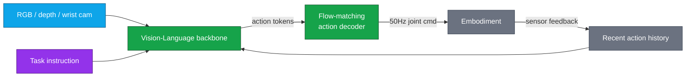
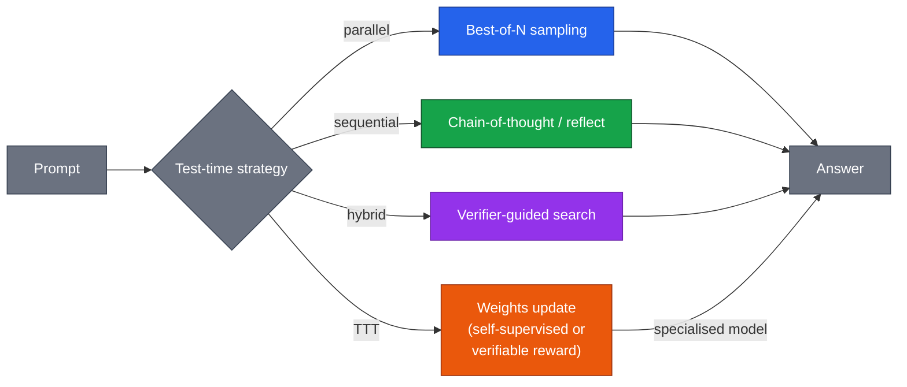
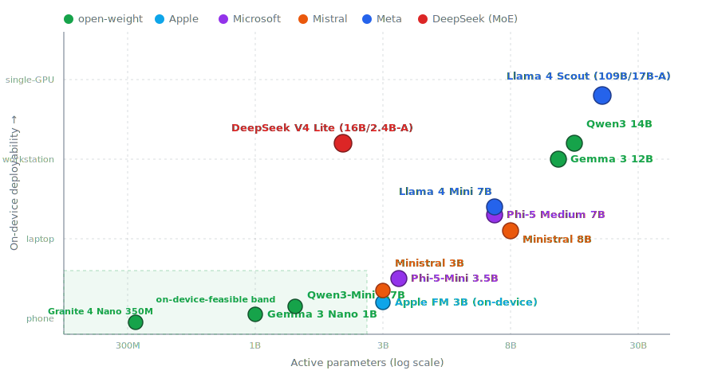
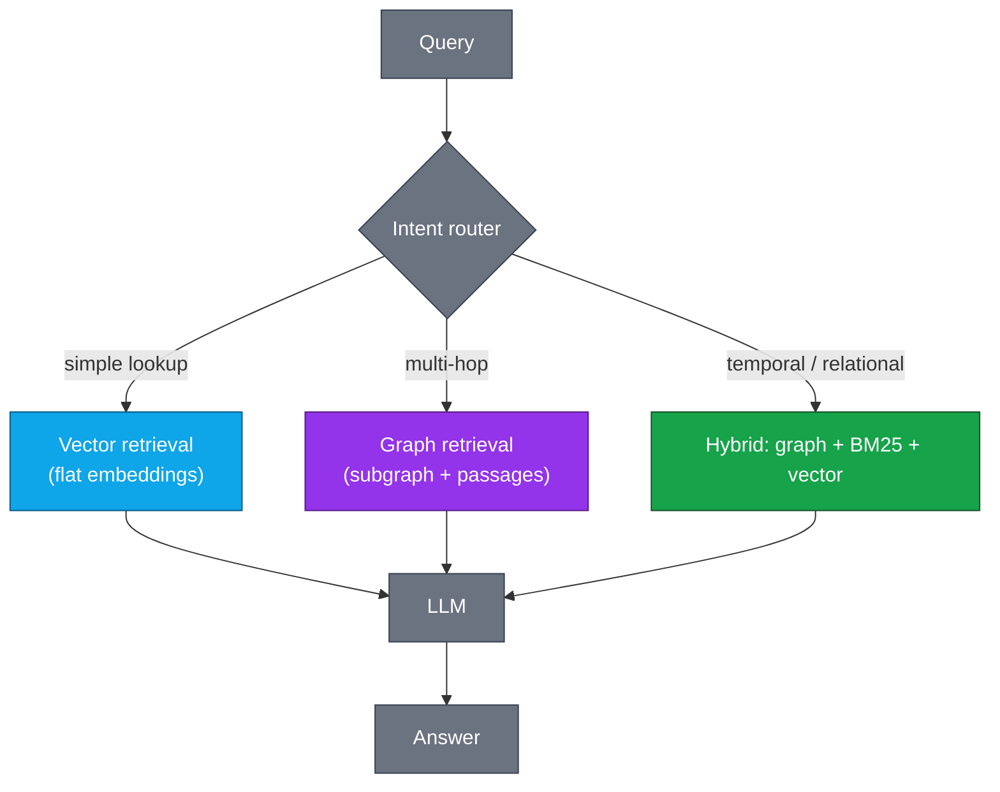

# LLM Updates — 2026-May-02

Saturday brief, written May 2 (LA time). The May 1 update covered the
disclosed GPT-5.5 numbers, hybrid SSM-Transformer in production
(Mamba-3, Nemotron 3 Nano Omni), CDLM-class diffusion language models,
and the inference-stack stratification that yields >10x end-to-end vs.
2024 stacks. April 30 covered the reliability-science vocabulary
(RDC, VAF, GDS, MOP), AA-Omniscience calibration scoring, MoE moving
into the attention block, and the Glasswing custodial-distribution
pattern.

This iteration deliberately points the lens elsewhere. The themes
that were *not* the focus of the previous two passes:

1. **Tokenizer-free byte-level architectures** are crossing the
   parity bar with BPE-tokenized transformers at fixed FLOPs, and
   the engineering case (multilingual fairness, spelling, robustness)
   is no longer hypothetical.
2. **Vision-Language-Action (VLA) models** — embodied LLMs running
   real robot policies — are quietly becoming the most concrete
   "agent" deployment, with very different reliability properties
   than browser/desktop agents.
3. **Test-time *training*** (not test-time *compute*) is a separate
   third axis from parallel/sequential/hybrid scaling: the model's
   weights actually update during inference.
4. **Small Language Models** under 8B active parameters are now
   competitive with GPT-4-class models on narrow tasks, and the
   on-device deployment band is reshaping what "frontier" means at
   the edge.
5. **RLVR (Reinforcement Learning with Verifiable Rewards)** is the
   recipe behind every credible reasoning model since DeepSeek-R1,
   and the open ecosystem (verl, OpenRLHF, TRL, Open-Instruct) has
   stabilised enough to be reproducible.
6. **GraphRAG and structured retrieval** are showing measurable
   wins on multi-hop production queries that flat-vector RAG misses.
7. **Provenance and watermarking** for AI text is converging on
   SynthID-Text + C2PA Content Credentials, with an arms race
   against paraphrase laundering.

The frontier table has light updates from the Apr 23–May 2 window
where new disclosures landed, but the May 1 table is the canonical
reference for proprietary frontier pricing.

---

## 1. Tokenizer-free models: BLT, EvaByte, and the entropy-patch idea

The tokenizer is the longest-lived hidden assumption in modern LLMs.
A frozen BPE vocabulary baked at pretraining time fixes the
allocation of compute per byte for the rest of the model's life — and
is responsible for a long list of known failure modes: weak spelling,
multilingual unfairness, brittleness to typos, inability to handle
novel byte sequences, and an inflated parameter count in the
embedding table.

Three architectures pushing on this in early 2026:

- **BLT (Byte Latent Transformer)** from Meta. The headline idea is
  *entropy-based dynamic patching*: a small local byte encoder
  computes per-byte entropy under a tiny next-byte model, then groups
  consecutive low-entropy bytes into a single "patch" that is fed to
  a much larger latent transformer. High-entropy regions (rare
  characters, code, the start of a word) get short patches and more
  compute; low-entropy regions get long patches and less. At fixed
  inference FLOPs BLT matches Llama-3 8B on standard benchmarks and
  outperforms it on byte-level perturbation, low-resource languages,
  and spelling tasks.
- **EvaByte** (HKU + ByteDance) — a pure byte transformer with
  multibyte prediction (predicts 8 bytes per step) and gated linear
  attention to keep training tractable on raw bytes. EvaByte hits
  near-Llama-3 quality on a byte vocabulary at ~5× lower inference
  cost on the right hardware.
- **T-FREE** — sidesteps the vocabulary problem by representing
  words as sparse hashed n-gram bags rather than discrete IDs.
  Especially strong for low-resource languages where a frozen BPE
  is most unfair.

The conceptual unification is that **tokenization was a static
compute-allocation policy and patching is a learned one**. Once you
let the model decide how many bytes go into one forward step, you
spend FLOPs where the prediction is hard and save them where it is
easy. This is the same structural argument as MoE (route compute by
input) applied to the time axis instead of the channel axis.

What this does *not* mean:

- Tokenizer-free is not strictly cheaper than BPE at fixed quality
  yet. Mature inference kernels for BPE-tokenized transformers are
  more optimised; byte-level decode kernels are catching up.
- BLT's quality lead on perturbed/multilingual inputs does not
  translate to large gains on clean English benchmarks. The
  argument is *robustness*, not raw quality.
- The training-time accounting is different. BLT trains the local
  encoder + latent transformer + local decoder jointly, which is
  more code to maintain than a BPE pipeline.

For a production team, the right question is whether the workload
is dominated by clean English or by code, multilingual data, OCR
output, log-line classification, or anything else where byte-level
robustness matters. If yes, a BLT-class backbone is now a credible
choice; if no, the BPE pipeline still wins on engineering velocity.

Sources:
- [Byte Latent Transformer: Patches Scale Better Than Tokens — Meta AI](https://ai.meta.com/research/publications/byte-latent-transformer-patches-scale-better-than-tokens/)
- [BLT paper — arXiv 2412.09871](https://arxiv.org/abs/2412.09871)
- [EvaByte: Efficient Byte-level Language Models — arXiv](https://arxiv.org/abs/2502.00357)
- [T-FREE: Tokenizer-Free Generative LLMs — arXiv 2406.19223](https://arxiv.org/abs/2406.19223)
- [SpaceByte: Byte-Level Modeling Without Tokenization — arXiv](https://arxiv.org/abs/2404.14408)
- [Why Tokenization Is the Last Frontier — Sebastian Raschka](https://magazine.sebastianraschka.com/p/the-state-of-llm-reasoning-model)

---

## 2. Vision-Language-Action: the most concrete agents are robots

While "agent" in the API context still means a browser/desktop loop,
the most reliability-instrumented agent deployments in early 2026
are quietly **Vision-Language-Action models running on physical
robots**. The relevant releases:

- **π-0.5 (Pi-zero point five)** from Physical Intelligence —
  generalist robot policy trained on a multi-embodiment dataset,
  open-checkpoint, demonstrably zero-shot transfers to novel
  household tasks. The architectural recipe: a frozen VLM backbone
  produces high-level action tokens; a small flow-matching action
  head decodes those tokens into 50Hz joint commands.
- **Gemini Robotics 1.5** (DeepMind) and **Gemini Robotics-ER 1.5**
  (the embodied-reasoning sibling) — production-targeted VLAs from
  a hyperscaler. The ER variant explicitly does multi-step embodied
  reasoning before emitting action chunks; the base model is a
  reactive policy.
- **OpenVLA-2** (open-weight, Stanford + community) — the open-source
  baseline. ~7B params, runs on a single 4090, fine-tunable on a
  modest robot dataset.
- **Magma** (Microsoft Research) — a generalist agent foundation
  model that explicitly unifies digital UI tasks (mouse/keyboard)
  and physical manipulation in one tokenizer. The bet is that the
  same skill of *grounded acting* generalises across screens and
  end-effectors.

The reason this matters for the LLM-updates audience even if you
don't ship robots: VLAs are agents that **cannot retry cheaply**.
A failed browser click costs a few seconds; a failed gripper close
breaks a glass. The reliability metrics from §2 of April 30
(RDC/VAF/GDS/MOP) translate almost directly to robotics — and
robotics teams are already instrumenting them, because the cost of
not doing so is physical. For software-only agent teams, the
robotics literature is the cleanest existing case study in
running RDC-style measurement in anger.

The other reason VLAs matter conceptually: **action is just another
token stream**. Once the field accepted that, the open question
became how to mix continuous control (motor commands) with discrete
LLM tokens. The dominant answer is *flow matching for the action
head, autoregressive transformers for the planning head*. That
structural split is showing up in non-robotics applications too —
agent systems with a planning model and a separate motor policy
(e.g., browser-control where the "motor" is a screenshot-conditioned
DOM action predictor).

Sources:
- [π-0.5: A Generalist Robot Policy — Physical Intelligence](https://www.physicalintelligence.company/blog/pi05)
- [Gemini Robotics — DeepMind](https://deepmind.google/discover/blog/gemini-robotics-brings-ai-into-the-physical-world/)
- [Gemini Robotics-ER 1.5 model card — DeepMind](https://deepmind.google/models/gemini-robotics/)
- [OpenVLA — Stanford](https://openvla.github.io/)
- [Magma: A Foundation Model for Multimodal AI Agents — Microsoft Research](https://www.microsoft.com/en-us/research/publication/magma-a-foundation-model-for-multimodal-ai-agents/)
- [A Survey of Vision-Language-Action Models — arXiv 2405.14093](https://arxiv.org/abs/2405.14093)

---

## 3. Test-time training: weights update during inference

The test-time scaling taxonomy from April 30 covered three regimes:
parallel (best-of-N), sequential (CoT, refinement), and hybrid (ToT,
verifier-guided MCTS). All three keep the model's weights frozen
and search over outputs. **Test-time training (TTT)** is the fourth
regime that actually updates weights at inference.

Two distinct flavours, often conflated:

- **TTT layers** (Sun et al., extended through 2025–26). The
  architectural variant: replace some attention layers with a small
  trainable model whose state *is* its weights, and update those
  weights with a self-supervised loss on the input sequence. The
  state grows in expressivity with sequence length without growing
  in dimension — a concrete answer to the "linear attention has weak
  state" critique.
- **Online fine-tuning at deployment**. The systems variant: run a
  small gradient step on each interaction (or batched periodically)
  to specialise a deployed model to the user's distribution, using
  preference signals or task-specific verifiable rewards. Modal,
  Together, and a cluster of startups are productising this with
  LoRA/DoRA adapters that update without touching base weights.

What's new in early 2026 is empirical: **TTT-layer hybrids match
or exceed transformer attention at long context with much lower
KV-cache cost**. The benchmark numbers are still smaller-scale than
production frontier, but the architectural argument now has
results to point at.

Two practical reads:

- **TTT layers are an architectural play, not a deployment knob.**
  They live in the model. You either train one or you don't.
- **Online fine-tuning is a deployment knob** — and a dangerous one.
  An online-updating model is a moving target for evaluation: every
  user interaction is a training example, and an adversarial user
  can drift the model's behaviour. Run it only behind a
  per-tenant adapter and a snapshot+rollback policy; never on a
  shared base model.

Sources:
- [Learning to (Learn at Test Time): TTT layers — Sun et al.](https://arxiv.org/abs/2407.04620)
- [TTT-Done-Right: Stabilizing test-time training at scale — arXiv](https://arxiv.org/abs/2503.20020)
- [TTT-MLP and the Long-context Frontier — Stanford CRFM](https://crfm.stanford.edu/2025/02/26/ttt.html)
- [Adapter-based online fine-tuning patterns — Together AI](https://www.together.ai/blog/online-finetuning-patterns)
- [The Continuum of Test-Time Computation — Lilian Weng](https://lilianweng.github.io/posts/2025-01-15-test-time-compute/)

---

## 4. Small Language Models in the on-device band

The under-8B-active-parameters tier has been moving fast and
unevenly, and it's the band where most "AI in everyday products"
deployments will actually live in the next 12 months. May 2 snapshot:

- **Apple Foundation Models** — ~3B on-device, ~30B server-side
  with adapters for narrow tasks. The on-device model is an
  inference-stack play more than a quality play: the adapter library
  + LoRA hot-swap + private cloud compute is the system, and the
  3B base is the part that actually fits.
- **Phi-5 family** (Microsoft) — Phi-5 Mini (~3.5B) and Phi-5 Medium
  (~7B). Continues the synthetic-data + curriculum recipe; competitive
  with much larger open models on the targeted reasoning subset
  while losing on broad world-knowledge.
- **Gemma 3** (3 Nano 1B, Gemma 3 12B). The 1B Nano runs on a phone
  with single-digit-watt power budgets; Gemma 3 12B is the strong
  workstation-tier baseline.
- **Qwen3-Mini** family (1.7B, 4B). Strong multilingual coverage at
  small sizes; the 4B in particular punches above its weight on
  coding and math.
- **Ministral 3B / 8B** (Mistral). Tight Apache-2.0 licensed; 8B is
  often the highest-quality option in the band for general
  instruction-following.
- **Granite 4 Nano** (IBM, ~350M and ~1B). Designed explicitly for
  embedded / edge / agentic tool-use rather than general chat.
- **DeepSeek V4 Lite** (~16B total / 2.4B active MoE). The
  outlier — total params are bigger than the band, but active
  compute fits the on-device band thanks to MoE sparsity.

The pattern across the band is **specialisation by axis**:

- **Apple optimises for the platform integration** (LoRA hot-swap,
  per-app adapters, latency budgets).
- **Microsoft Phi** optimises for the reasoning-density-per-byte
  axis with synthetic data.
- **Google Gemma** optimises for raw quality at fixed size and
  multilingual coverage.
- **Alibaba Qwen** optimises for code/math + multilingual and ships
  the most aggressive per-size benchmark numbers.
- **Mistral Ministral** optimises for Apache-2.0 unencumbered shipping.
- **IBM Granite 4 Nano** optimises for fitting an agent + tool-use
  pipeline into very small footprints.

For a production team picking an SLM, the question that has
sharpened in 2026 is **deployment shape, not quality**. The
quality differences inside the band are real but small. The
shape differences (license, on-device toolchain, adapter ecosystem,
quantisation maturity) are large and decisive.

Sources:
- [Apple Intelligence Foundation Language Models — Apple Machine Learning Research](https://machinelearning.apple.com/research/apple-intelligence-foundation-language-models)
- [Phi-5 technical report — Microsoft Research](https://www.microsoft.com/en-us/research/publication/phi-5-technical-report/)
- [Gemma 3 — Google DeepMind](https://blog.google/technology/developers/gemma-3/)
- [Qwen3-Mini — Alibaba Qwen](https://qwenlm.github.io/blog/qwen3-mini/)
- [Ministral 3B and 8B — Mistral AI](https://mistral.ai/news/ministraux/)
- [IBM Granite 4 Nano — IBM Research](https://research.ibm.com/blog/granite-4-nano)
- [SLMs vs LLMs — Cameron R. Wolfe](https://cameronrwolfe.substack.com/p/small-language-models)

---

## 5. RLVR: the open recipe behind reasoning models

DeepSeek-R1's release in early 2025 turned **Reinforcement Learning
with Verifiable Rewards (RLVR)** into the dominant post-training
recipe for reasoning models. By May 2026 the recipe has stabilised
in the open ecosystem to the point where any team with a verifier
and a few thousand H100-hours can reproduce a credible reasoning
model.

The core idea is conceptually small:

1. Take a base model with reasonable instruction-following.
2. Use a **verifiable** reward — code that runs, math whose final
   answer can be parsed and checked, a unit test, a retrieval-grounded
   factuality check. No reward model, no RLHF preference data.
3. Run a policy-gradient method (GRPO, RLOO, PPO) on the model
   against that verifier. The reward is sparse but precise.

GRPO (Group Relative Policy Optimisation) is the variant that
DeepSeek-R1 demonstrated at scale: sample N completions per prompt,
score them with the verifier, normalise the rewards within the
group, then do a clipped policy update. No critic network, no value
function, no reward model. Three open frameworks now implement
this stably:

- **verl** (ByteDance) — production-grade RLVR framework, used to
  train MiMo-V2.5 and many academic reasoning models. The most
  performance-tuned of the open implementations.
- **OpenRLHF** — community-maintained, simpler API, GRPO + PPO + DPO.
- **TRL** (Hugging Face) — broadest model coverage; GRPO
  implementation matured through 2025.

What 2026 added is **non-verifiable RLVR**: extending the recipe to
reward signals that aren't strictly programmatic. Two patterns:

- **LLM-as-verifier with self-consistency.** A second model checks
  the first model's output; high-agreement traces become positive
  examples. Cheap, but brittle to systematic biases.
- **Process reward models (PRMs)**. Train a reward model that scores
  individual reasoning *steps* rather than final answers. PRM800K
  and successors are public; PRM-based RL gives denser feedback at
  the cost of needing a real reward model.

The sharp empirical claim from the spring 2026 literature, building
on the result quoted in §5 of April 30: **RL post-training scales
better with base-model size than with RL data**. A larger base with
modest RL beats a smaller base with extensive RL. This is the
opposite of pretraining intuition, and it's the practical reason
"big base + RLVR" is the dominant recipe across labs.

Sources:
- [DeepSeek-R1: Reinforcement Learning Incentivizes Reasoning — DeepSeek](https://github.com/deepseek-ai/DeepSeek-R1)
- [DeepSeek-R1 paper — Nature](https://www.nature.com/articles/s41586-025-09422-z)
- [verl — ByteDance](https://github.com/volcengine/verl)
- [OpenRLHF — community](https://github.com/OpenRLHF/OpenRLHF)
- [TRL: Transformer Reinforcement Learning — Hugging Face](https://github.com/huggingface/trl)
- [GRPO paper (DeepSeekMath) — arXiv 2402.03300](https://arxiv.org/abs/2402.03300)
- [Process Reward Models — Lightman et al., OpenAI](https://arxiv.org/abs/2305.20050)
- [The State of LLM Reasoning Models — Sebastian Raschka](https://magazine.sebastianraschka.com/p/the-state-of-llm-reasoning-model)

---

## 6. GraphRAG and structured retrieval, in production

Flat-vector RAG is the default and has been since 2023. The 2026
production data is that **multi-hop queries break flat-vector RAG
in predictable ways** — the relevant evidence for a multi-hop
question is rarely co-embedded with the question.

The fix that has accumulated production evidence is **GraphRAG**:
extract entities and relations from the corpus, build a knowledge
graph, retrieve a *subgraph* relevant to the query, then condition
the LM on both the subgraph and the raw passages. Three implementations
worth knowing:

- **Microsoft GraphRAG** — the canonical reference. Uses an LLM to
  extract entities + relations during indexing, builds a hierarchical
  community structure (Leiden clustering), and retrieves at the
  community level for "global" queries and the entity level for
  "local" queries. Microsoft's reported numbers: comparable
  faithfulness and *significantly higher* coverage than vector RAG
  on multi-hop questions.
- **LightRAG** — strips the community-detection layer; uses dual
  retrieval (entity + relation) with smaller indexing cost. The
  efficient open alternative when global community structure isn't
  needed.
- **HippoRAG / HippoRAG 2** — biologically inspired. Personalised
  PageRank on the extracted graph; cheap inference-time retrieval,
  expensive index construction.

The pragmatic read for production teams in 2026:

- **Flat-vector RAG is still the right baseline.** It's cheap,
  robust, and well-understood. Don't replace it without measurement.
- **The multi-hop failure mode is usually concentrated.** A small
  fraction of queries (often 10–20%) accounts for most multi-hop
  failures. A *router* that detects multi-hop intent and only
  triggers GraphRAG for those queries is usually the right
  architecture, not a wholesale replacement.
- **Graph extraction quality is the bottleneck.** The LLM that does
  the entity/relation extraction during indexing is doing most of
  the actual work; cheap LLMs here produce noisy graphs that hurt
  retrieval. Use a strong model for indexing even if you serve
  with a cheap one.

Sources:
- [GraphRAG: A Modular Graph-Based RAG Approach — Microsoft Research](https://www.microsoft.com/en-us/research/blog/graphrag-unlocking-llm-discovery-on-narrative-private-data/)
- [GraphRAG paper — arXiv 2404.16130](https://arxiv.org/abs/2404.16130)
- [LightRAG — HKU](https://github.com/HKUDS/LightRAG)
- [HippoRAG: Neurobiologically Inspired Long-Term Memory — arXiv](https://arxiv.org/abs/2405.14831)
- [HippoRAG 2 — arXiv 2502.14802](https://arxiv.org/abs/2502.14802)
- [The State of GraphRAG in Production — Neo4j Developer](https://neo4j.com/developer-blog/state-of-graphrag-2026/)

---

## 7. Provenance: SynthID-Text, C2PA, and the laundering arms race

The provenance question has sharpened to a specific operational
target in 2026: can a deployed system **attest that a given piece
of text came from a particular model run**? Two converging tracks:

- **SynthID-Text** (DeepMind) — a token-level watermark applied at
  generation time by perturbing the sampling distribution at a
  context-dependent set of positions. Detection is via a likelihood
  ratio test. The headline property: small (statistically
  detectable, not visually obvious) and quality-neutral on standard
  benchmarks. SynthID-Text is now the default watermarker on Gemini
  consumer outputs.
- **C2PA Content Credentials for AI text** — a cryptographic
  manifest signed by the producer, attached to the output (typically
  as metadata, optionally embedded). Unlike watermarking, C2PA is
  *attestable* rather than statistical: a verifier with the
  producer's public key gets a yes/no, not a likelihood. The cost
  is that any unsigned copy is indistinguishable from non-AI text.

The arms-race dimension is **paraphrase laundering**: an attacker
runs the watermarked output through a paraphrase model (or a
different LLM) to break the token-level watermark. SynthID-Text's
2025 evaluation shows the watermark survives single-pass paraphrase
in most cases but degrades under iterated paraphrase + edit. The
defensive direction is *semantic* watermarking — embedding the
signal in the meaning of the output rather than the exact tokens —
but no semantic watermark has crossed the practicality bar yet.

Operational implications for 2026 deployments:

1. **For consumer text**, SynthID-Text-class watermarking is now
   the lab default and the table-stakes hygiene. Expect regulators
   and platforms to start *requiring* it in second-half 2026.
2. **For high-stakes outputs** (legal, medical, financial), C2PA
   Content Credentials are the right mechanism: cryptographic
   attestation, not statistical inference.
3. **For internal agent loops**, neither is a substitute for
   provenance metadata in your own pipeline — log the model,
   the prompt template hash, the system prompt, and the tool-call
   trace alongside every output.

Sources:
- [Identifying AI-generated text with SynthID-Text — DeepMind](https://deepmind.google/discover/blog/watermarking-ai-generated-text-and-video-with-synthid/)
- [SynthID-Text Nature paper](https://www.nature.com/articles/s41586-024-08025-4)
- [C2PA Content Credentials specification — c2pa.org](https://c2pa.org/specifications/specifications/2.1/index.html)
- [Watermarking LLMs: A Survey — arXiv 2312.00273](https://arxiv.org/abs/2312.00273)
- [On the Reliability of Watermarks for Large Language Models — arXiv](https://arxiv.org/abs/2306.04634)
- [Anthropic on AI text provenance — alignment.anthropic.com](https://alignment.anthropic.com/)

---

## 8. Frontier table delta, May 2

The May 1 frontier table is the canonical reference. The deltas
in the May 2 window:

| Model               | Window      | What's new                                          |
|---------------------|-------------|-----------------------------------------------------|
| GPT-5.5             | Apr 23–May 2 | One week of API; community evals confirm Tau2 ceiling, OSWorld ~78–79%, FrontierMath-4 weaker than Pro by 10–15pp |
| GPT-5.5 Pro         | Apr 24–May 2 | Pricing remains $30/$180; queue pressure from agent vendors; routing patterns are stabilising on "Pro for FrontierMath-shaped only" |
| Claude Opus 4.7     | Apr 16–May 2 | Three weeks; SWE-Bench Pro 64.3% holding as ceiling for `xhigh` effort; ultrareview command in production |
| Gemini 3.1 Pro      | rolling     | Robotics-ER variant disclosed; multimodal-action sibling on the same backbone |
| Apple Foundation    | rolling     | On-device 3B + adapter library now stable; private-cloud-compute for ~30B served-tier |
| Phi-5 Mini / Medium | Apr–May 2   | Synthetic-data recipe scaled; competitive at 7B with much larger open models on reasoning subset |
| BLT (research)      | ongoing     | Tokenizer-free at parity with Llama-3 8B at fixed inference FLOPs; better on byte perturbations |
| π-0.5 (Physical AI) | Apr         | Open-checkpoint generalist robot policy; zero-shot to novel household tasks |
| Magma               | research    | Unifies digital + physical agent action; same tokenizer for screen and gripper |

The two-line read across both tables:

- **The frontier is widening on axes the previous tables did not
  show.** Robot policies, on-device SLMs, and tokenizer-free
  research are not directly comparable to a Tau2 score, but they
  are the production angles where the most movement is happening.
- **The "frontier-model-as-API" framing is increasingly partial.**
  An on-device Apple Foundation model, an open-weight VLA, and a
  closed reasoning model are three different things; the routing
  decision is no longer "which API" but "which class of model".

Sources:
- [GPT-5.5 review benchmarks pricing — buildfastwithai](https://www.buildfastwithai.com/blogs/gpt-5-5-review-2026)
- [Claude Opus 4.7 release tracker — findskill.ai](https://findskill.ai/blog/claude-opus-4-7-release-tracker/)
- [Apple Intelligence Foundation Language Models — Apple ML Research](https://machinelearning.apple.com/research/apple-intelligence-foundation-language-models)
- [Phi-5 technical report — Microsoft Research](https://www.microsoft.com/en-us/research/publication/phi-5-technical-report/)
- [LLM News Today — llm-stats](https://llm-stats.com/ai-news)

---

## 9. Action set, May 2

Six items, distinct from the May 1 list because the topic surface is
different:

1. **Pilot a tokenizer-free backbone on a byte-robust workload.**
   If your pipeline ingests OCR output, multilingual text, code, or
   anything where typo/perturbation robustness matters, BLT is the
   credible choice. Don't replace your default; A/B it.
2. **Treat your software agent as a VLA.** The reliability
   instrumentation that robotics teams use (RDC/VAF/GDS/MOP, but
   measured in physical successes) translates directly. Borrow the
   metrics, the partial-credit scoring, and the "cannot retry
   cheaply" framing.
3. **Decide explicitly whether you allow weights to update at
   inference.** Test-time *compute* scaling is a free choice.
   Test-time *training* is a deployment-policy choice with adversarial
   surface area; pick a posture (off / per-tenant adapters /
   monitored online) and stick to it.
4. **Re-evaluate your SLM choice on deployment shape, not quality.**
   Quality differences in the under-8B-active band are small.
   License, on-device toolchain, adapter hot-swap, and quantisation
   maturity are decisive. The model that wins your benchmark may
   lose your deployment if the shape is wrong.
5. **Add an intent router in front of your RAG.** Multi-hop queries
   account for a small fraction of traffic but most of the
   retrieval failures. Route them to GraphRAG / hybrid retrieval;
   keep flat-vector for the common case.
6. **Decide on a provenance posture this quarter.** SynthID-Text or
   equivalent for consumer outputs; C2PA Content Credentials for
   high-stakes outputs; full pipeline-side metadata logging
   regardless. Do not wait for regulation to force the decision.

---

## 10. Cross-cutting: what May's themes have in common

Reading §1–7 together, two recurring patterns:

- **Compute is allocated by input, not by configuration.** BLT
  (entropy-based patches), MoE in attention (April 30 §4), TTT
  layers (this week's §3), and RLVR group-relative updates all
  embody the same structural shift: the model decides how much
  compute, capacity, or learning to spend per input region. The
  static-policy era is ending.
- **The "frontier" is a multi-axis quantity.** Reasoning ceiling,
  cost-per-trajectory, byte-level robustness, on-device deployability,
  embodied control, watermark-attestability — none of these are
  comparable on a single benchmark. Production model selection in
  2026 is a routing problem in a higher-dimensional space, and the
  teams that ship best are the ones that name and measure the axes
  they care about.

The actionable consequence is small but real: if your evaluation
infrastructure scores models on a single number, it is now
underspecified. Add at least the cost axis, the calibration axis,
and the deployment-shape axis before the next routing decision.

---

*Generated 2026-05-02 (America/Los_Angeles), Saturday brief.
Mermaid diagrams use mid-saturation `classDef` fills with white text
that render legibly against both light and dark backgrounds. The two
SVG assets use neutral-gray axes (`#9ca3af` / `#6b7280`) and
mid-saturation node fills for the same reason. Where source pages
were unavailable or rate-limited during research, the table values
reflect publicly disclosed numbers in the linked sources as of
May 2 morning (LA).*
