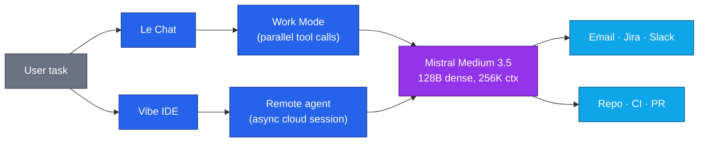
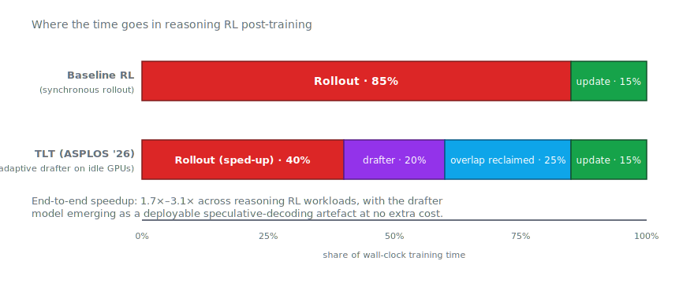
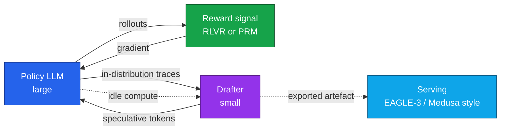
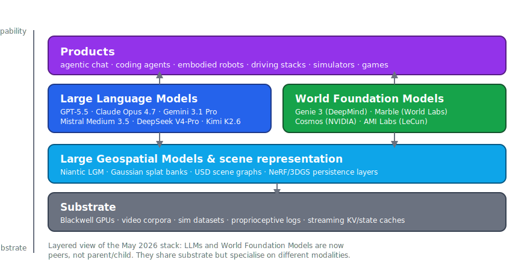
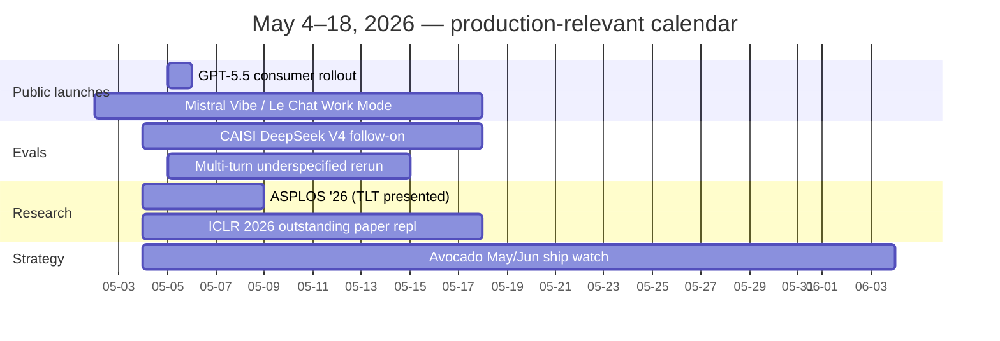

# LLM Updates — 2026-May-04

Post-weekend brief, written Monday May 4 (LA time), the day before
**GPT-5.5's public consumer rollout** and three days after the **first
real-world frontier release of the month** — Mistral Medium 3.5 + Vibe
+ Le Chat Work Mode (May 2). The May 1 brief in this repo focused on
the GPT-5.5 API tier, hybrid SSM-Transformer in production, diffusion
LMs, FlashAttention-4, adversarial-reasoning red teaming, and MiMo-V2.5.
This note rolls forward to the signal that landed over the weekend and
in the first half of the week:

1. **Mistral Medium 3.5** as the first frontier-tier release of May —
   a single-model unification of chat / reasoning / code with cloud
   remote agents (Vibe) and an agentic Work Mode in Le Chat.
2. **NIST CAISI's first formal evaluation of DeepSeek V4-Pro** — the
   first government benchmark to put a numerical "frontier gap" on a
   PRC model, and the first to surface a 94% hallucination rate on a
   widely-deployed open-weight model.
3. **TLT (Taming the Long-Tail)** — the ASPLOS '26 system that turns
   the 85% rollout slice of reasoning RL post-training into a 1.7–3.1×
   end-to-end speedup, by training an adaptive drafter on idle compute.
4. **World models become a peer layer of the AI stack**, not a
   sub-routine of an LLM. Genie 3's January 2026 public rollout, World
   Labs' Marble, NVIDIA Cosmos's 2M downloads, and AMI Labs' €500M
   raise mean the architecture diagram now has three top-level boxes,
   not one.
5. **Meta's Avocado pivot** — a closed-weight successor to Llama,
   delayed again to May/June after internal benchmarks placed it
   between Gemini 2.5 and 3.0. Strategic signal: even Meta is closing
   weights at the frontier.
6. **ICLR 2026 outstanding-paper signal**: the multi-turn /
   under-specified-instruction regime is where current LLMs degrade
   most, and *Transformers are Inherently Succinct* is the year's
   cleanest theoretical result on why the architecture works.

Material already covered in the April 30 / May 1 passes (Mamba-3,
Nemotron 3, CDLM diffusion, FlashAttention-4, jailbreak economics,
MiMo-V2.5, DeepSeek V4-Pro architecture) is referenced briefly and not
re-derived.

---

## 1. Mistral Medium 3.5 + Vibe + Le Chat Work Mode

The most concrete release of the May 2–4 window is **Mistral Medium
3.5** (May 2), shipped together with two product surfaces that are
more interesting than the model card itself:

- **The model.** 128B dense, 256K context, modified-MIT open weights,
  $1.5 / $7.5 per M tokens. Mistral's pitch is that one set of weights
  handles instruction-following, reasoning, and code without the
  vendor having to maintain a "reasoning" SKU and a "chat" SKU.
  Reported headline numbers: **77.6% on SWE-Bench Verified** (above
  Devstral 2 and Qwen 3.5 397B-A17B) and **91.4% on τ³-Telecom**.
- **Vibe**, Mistral's *remote agents* surface. Vibe's distinguishing
  feature is **asynchronous cloud coding sessions**: the user dispatches
  a task, the agent runs in the cloud while the user goes elsewhere, and
  the result lands minutes or hours later as a PR. This is the first
  hyperscaler-independent take on the "background coding agent" pattern
  that Anthropic Claude Code, OpenAI Codex, and Google Jules have been
  iterating on; Mistral's variant is interesting because the underlying
  model is open-weight and the agent loop is hostable.
- **Work Mode in Le Chat**, currently in preview. A multi-step agent
  on top of Medium 3.5, calling tools in parallel — email triage, Jira
  issue creation, Slack summary, cross-tool research synthesis. This
  is Mistral's first credible agent loop in a consumer product and the
  feature parity target is Anthropic's Claude apps + tools, not
  OpenAI's "operator" stack.

The architectural read on the model itself is the unification claim.
Through 2025 the field bifurcated: a "reasoning" model (paid
test-time compute, slow, expensive) and a "chat" model (cheap, fast,
no chain of thought). Mistral Medium 3.5 follows GPT-5.5 and
Claude Opus 4.7 in collapsing the two SKUs back into one. The
operational implication is that **per-model routing tables can shrink**:
one Mistral entry replaces two from Q4 2025.

Two routing implications worth committing to a table this week:

- For workloads that fit `(SWE-Bench Verified ≤ 78%, τ³-Telecom ≤ 91%,
  256K context)`, **Mistral Medium 3.5 is the cheapest competent
  option** at $1.5/$7.5 per M tokens, beating Gemini 3.1 Pro on price
  while landing within 5–10 points of GPT-5.5 standard on coding.
- Vibe's *async cloud session* model is a different procurement
  pattern — you pay for completed work, not for prompt latency. If
  your team has been bottlenecked on synchronous chat-window
  interaction, the right pilot is one Vibe session per engineer for a
  week, scored on PRs merged.

Sources:
- [Remote agents in Vibe. Powered by Mistral Medium 3.5 — Mistral AI](https://mistral.ai/news/vibe-remote-agents-mistral-medium-3-5)
- [Mistral AI Launches Remote Agents in Vibe and Mistral Medium 3.5 — MarkTechPost](https://www.marktechpost.com/2026/05/02/mistral-ai-launches-remote-agents-in-vibe-and-mistral-medium-3-5-with-77-6-swe-bench-verified-score/)
- [Mistral Medium 3.5 Folds Chat, Reasoning, and Code Into One 128B AI Model — winbuzzer](https://winbuzzer.com/2026/05/02/mistral-medium-3-5-unified-flagship-chat-reasoning-code-xcxwbn/)
- [Mistral AI unveils Medium 3.5 model and Work Mode for Le Chat — testingcatalog](https://www.testingcatalog.com/mistral-ai-unveils-medium-3-5-model-and-work-mode-for-le-chat/)
- [mistralai/Mistral-Medium-3.5-128B — Hugging Face](https://huggingface.co/mistralai/Mistral-Medium-3.5-128B)

---

## 2. NIST CAISI puts a number on the US–PRC frontier gap

On May 1, NIST's **Center for AI Standards and Innovation (CAISI)**
published its evaluation of **DeepSeek V4-Pro** — the first US
government benchmark of a Chinese frontier-tier model since the 2025
DeepSeek V3.1 study. Three findings worth pulling out:

| Finding                         | Number                                       |
|---------------------------------|----------------------------------------------|
| Capability gap vs. US frontier  | ~8 months behind                             |
| Position vs. PRC peers          | #1 PRC model evaluated to date               |
| Hallucination rate on V4-Pro    | ~94% on out-of-knowledge prompts             |
| Cost efficiency vs. GPT-5.4 mini| Better on 5/7 benchmarks                     |
| Self-reported vs. CAISI delta   | DeepSeek over-reports against private evals  |

The methodology is the most interesting piece. CAISI's evaluations
include **two held-out, uncontaminated benchmarks**: ARC-AGI-2's
semi-private split and **PortBench**, an internally-built software
engineering eval. The hold-out is the point — DeepSeek's self-reported
numbers place V4-Pro in the same tier as Opus 4.6 and GPT-5.4 (released
two months ago); CAISI's numbers put it at the GPT-5 (~8 months ago)
level. The delta is consistent with **benchmark contamination on
public eval sets**, which is now operationally the rule for any model
training pipeline that crawls the open web.

The 94% hallucination number is the harder finding. V4-Pro's failure
mode when it doesn't know an answer is **answer-anyway**, not
abstention. That has direct deployment consequences:

- For RAG-shaped workloads (the most common production use), V4-Pro's
  failure mode is corrigible: the retrieved context dominates and the
  hallucination rate collapses. The 94% number is a *no-context
  prompt* failure rate, not a deployed-app failure rate.
- For agent loops where the model is asked to *decide whether to use a
  tool*, the 94% number is a meaningful liability. An over-confident
  model will skip retrieval when it should have queried. That is the
  exact failure mode that drives the long-horizon reliability decay
  documented in April 30's RDC discussion.

The geopolitical framing in the press around the report (8-month gap,
"China falling behind") is largely beside the point for production
teams. The actionable read is that **CAISI is now a credible third
party for adversarial evaluation** — the held-out benchmarks are the
right antidote to the leaderboard-overfitting that has been
eviscerating eval credibility through Q1.

Sources:
- [CAISI Evaluation of DeepSeek V4 Pro — NIST](https://www.nist.gov/news-events/news/2026/05/caisi-evaluation-deepseek-v4-pro)
- [DeepSeek V4 trails US frontier by eight months — Digital Watch Observatory](https://dig.watch/updates/deepseek-v4-pro-caisi-us-nist-evaluation)
- [China is falling behind in the AI race — the-decoder](https://the-decoder.com/china-is-falling-behind-in-the-ai-race-according-to-a-us-government-benchmark/)
- [DeepSeek V4 Pro Intelligence, Performance & Price Analysis — Artificial Analysis](https://artificialanalysis.ai/models/deepseek-v4-pro)
- [DeepSeek V4 Pro Max Benchmarks — llm-stats](https://llm-stats.com/models/deepseek-v4-pro-max)

---

## 3. TLT and the rollout-bottleneck story for RL post-training

The most important *systems-research* drop of the window is **TLT
(Taming the Long-Tail)** from MIT's Han Lab + NVIDIA, accepted to
**ASPLOS '26** and headlined on MIT News in February but with the
deployable artefacts now landing in the lead-up to the conference.

The premise:

- Modern reasoning post-training is **on-policy RL**: the model
  generates rollouts, a reward signal is computed (RLVR for verifiable
  tasks, preference models for open-ended), gradients update the
  weights.
- Empirically, **rollout consumes ~85% of wall-clock training
  time**; the gradient update is a rounding error.
- Rollout latency is dominated by the long-tail of slow trajectories —
  the model occasionally produces a 50K-token reasoning trace on a
  hard problem and the whole step waits for it.

TLT's recipe is two coupled components:

1. **Adaptive drafter trainer.** A *small* drafter model is trained
   on-the-fly during the idle GPU windows that exist while the main
   model is rolling out. The drafter stays aligned with the policy
   without consuming extra compute.
2. **Adaptive rollout engine.** Speculative decoding using the drafter
   accelerates rollout. The strategy (token-level vs. sequence-level
   speculation, depth, batch composition) is auto-tuned per batch.

The reported result: **70–210% end-to-end speedup** on reasoning RL
training, with the drafter model emerging as a *free deployment
artefact* — the same drafter is the one you use for speculative
decoding at serving time.

The conceptual interest is that this collapses two pipeline stages
that the field had been building separately:

- *Training-time speculative decoding for rollout efficiency* (a
  systems concern; previously hand-tuned per workload).
- *Inference-time speculative decoding for serving efficiency* (also
  a systems concern; EAGLE-3 / Medusa).

TLT trains the drafter once, in idle compute, on the in-distribution
data the policy is producing — and then ships the drafter forward into
serving. The systems-engineering pattern now is to **treat the drafter
as a deployable byproduct of training**, not a separate engineering
project. That is the right read for any team running its own RLVR
pipeline.

Sources:
- [Taming the Long-Tail: Efficient Reasoning RL Training with Adaptive Drafter — arXiv](https://arxiv.org/html/2511.16665v1)
- [TLT — NVIDIA Efficient AI Lab project page](https://research.nvidia.com/labs/eai/publication/tlt/)
- [mit-han-lab/fastrl — GitHub](https://github.com/mit-han-lab/fastrl)
- [New method could increase LLM training efficiency — MIT News](https://news.mit.edu/2026/new-method-could-increase-llm-training-efficiency-0226)
- [Adaptive drafter model uses downtime to double LLM training speed — TechXplore](https://techxplore.com/news/2026-02-drafter-downtime-llm.html)

---

## 4. World models become a peer layer, not a sub-routine

The structural reframing that the May 1 report flagged in passing now
deserves its own section. Through 2025, "world model" was a label
attached to *pieces of an LLM* — DeepMind's Gemini was sometimes
described as "a world model with a language head," and the discourse
treated world-modeling as a property of frontier LLMs.

In the May 2026 layout that framing is gone. There are now three
visible top-level layers in production AI architectures:

- **LLMs** (GPT-5.5, Claude Opus 4.7, Gemini 3.1 Pro, Mistral Medium
  3.5, DeepSeek V4-Pro, Kimi K2.6).
- **World Foundation Models** (Genie 3 from DeepMind, Marble from Fei-
  Fei Li's World Labs, NVIDIA Cosmos, AMI Labs' in-development model
  under Yann LeCun).
- **Large Geospatial Models** (Niantic's LGM, Gaussian-splat asset
  banks, USD scene graphs).

What changed since Q4 2025:

- **Genie 3** — DeepMind's January 2026 web rollout to Google AI Ultra
  subscribers — produces text-prompted, navigable 3D environments at
  720p / 24 fps with persistent visual memory of about one minute. The
  "interactive" qualifier is doing the work: the user navigates,
  Genie 3 generates the next state in real time. This is the first
  WFM that ships as a consumer product.
- **World Labs Marble** (commercial since Nov 2025, expanded through
  2026) ships *persistent, downloadable 3D environments* — the inverse
  of Genie 3's stream-as-you-go pattern. Pricing tops out at $95/month
  (Max tier). This is the first WFM with an enterprise procurement
  surface.
- **NVIDIA Cosmos** crossed **2M downloads** as robotics and AV
  developers adopt synthetic physics-aware training data — the
  industrial-data backbone of the layer.
- **Yann LeCun's AMI Labs** launched at €3B valuation with €500M
  raised, explicitly to build "AI that understands physics rather
  than just predicting text" — a major frontier-lab restructuring,
  pulling LeCun out of Meta into a pure-play WFM company.

The systems-engineering implication is that **the LLM is no longer the
backbone of every AI product**. For embodied applications (robotics,
driving, simulation), the WFM is the backbone and the LLM is the
language interface. For knowledge work, the LLM is the backbone and
the WFM is irrelevant. The procurement question for a 2026 product
team is now: *which layer carries the dominant cost?*

Caveats worth keeping in mind:

- WFMs are **expensive to serve** — Genie 3 reportedly costs ~$100/hr
  per active user, because each user requires an effectively dedicated
  GPU pipeline to maintain real-time stream generation. The cost
  curve has not inflected; this is still a research-grade serving
  cost.
- The **language-to-world bridge is unsolved**. Today's WFMs accept a
  text prompt for world *initialisation* but the in-session
  interaction is non-linguistic (movement, action). LLM-WFM
  integration that lets the user *talk* to a generated world while
  navigating it is the obvious near-term research target.

Sources:
- [Genie 3: A new frontier for world models — Google DeepMind](https://deepmind.google/blog/genie-3-a-new-frontier-for-world-models/)
- [Project Genie: AI world model now available for Ultra users — Google blog](https://blog.google/innovation-and-ai/models-and-research/google-deepmind/project-genie/)
- [Fei-Fei Li's World Labs launches Marble — TechCrunch](https://techcrunch.com/2025/11/12/fei-fei-lis-world-labs-speeds-up-the-world-model-race-with-marble-its-first-commercial-product/)
- [World models could unlock the next revolution — Scientific American](https://www.scientificamerican.com/article/world-models-could-unlock-the-next-revolution-in-artificial-intelligence/)
- [World Models Race 2026 — Introl](https://introl.com/blog/world-models-race-agi-2026)
- [Can world models unlock general purpose robotics? — Bessemer Venture Partners](https://www.bvp.com/atlas/can-world-models-unlock-general-purpose-robotics)

---

## 5. Meta's Avocado pivot: closed weights at the frontier

Meta's frontier successor to Llama, codenamed **Avocado**, has slipped
again — current internal target is May/June 2026, after an originally
late-2025 plan and a March 2026 miss. Two strategic signals matter
more than the slip itself:

- **Avocado is expected to be closed-weight** — not just delayed
  releases or commercial-only licensing, but no public weights at
  all. This breaks Meta's six-year open-weights posture. Internal
  framing reportedly cites foreign-lab copying (DeepSeek being the
  named example) as the security rationale.
- **Internal benchmarks placed Avocado between Gemini 2.5 and 3.0** —
  a tier behind GPT-5.5, Opus 4.7, Gemini 3.1 Pro. Meta has explored
  *licensing Gemini* as a stop-gap for its consumer products while
  Avocado retrains. This is the most consequential admission of
  frontier-tier difficulty from a major US lab in 18 months.
- **Pre-training claims**: the leaked memo reports Avocado is **10×
  more compute-efficient than Llama 4 Maverick** on text and >100× vs.
  the unreleased Llama 4 Behemoth. The text-compute number is
  plausible — most US labs reported 5–10× efficiency gains in 2026
  vs. their late-2024 pipelines. The deployment number is the harder
  one and is what the May/June ship will validate.

The structural read on the open-weights ecosystem:

- The **open-weight frontier is now Chinese-led**: DeepSeek V4-Pro
  (1.6T MoE), MiMo-V2.5-Pro (1.02T MoE), Qwen 3.6, Kimi K2.6 (1T).
- The **open-weight Western frontier is increasingly mid-tier**:
  Mistral Medium 3.5 (128B dense), the older Llama 3.x lineage. Meta's
  exit from open-weights at the top ends the "Llama vs. closed" framing
  that defined 2023–2025.
- For procurement, this means **self-hosted frontier-tier models are
  Chinese-supplied for the foreseeable future**, with the policy and
  evaluation overhead that implies (CAISI-style holdouts; export-
  control review of supply chains; provenance audits).

Sources:
- [Meta postpones Avocado AI model launch to May — mlq.ai](https://mlq.ai/news/meta-postpones-avocado-ai-model-launch-to-may-amid-performance-gaps-with-competitors/)
- ['Avocado' Marks Meta's Pivot From Open Source — eWeek](https://www.eweek.com/news/meta-new-avocado-model/)
- [LLAMA 5 Leak: Meta Avocado AI Model — Geeky Gadgets](https://www.geeky-gadgets.com/meta-llama-5-leak/)
- [Meta's Avocado AI Model Delayed as Internal Tensions Rise — TechBuzz](https://www.techbuzz.ai/articles/meta-s-avocado-ai-model-delayed-as-internal-tensions-rise)
- [Meta's next AI model 'Avocado' signals shift to closed development — Digitimes](https://www.digitimes.com/news/a20251215PD230/meta-ai-llm-llama-development.html)

---

## 6. ICLR 2026 outstanding papers: where the field's research consensus is

ICLR 2026 ran April 23 in Vienna; the outstanding-paper announcements
landed the same week. Two of the recognised papers are directly
relevant to LLM production teams:

- **"Evaluating LLM Multi-Turn Aptitude Under Underspecified
  Instructions"** (committee citation: *exceptional experimental
  design and methodology, fresh and interesting findings*).
  The empirical claim: LLMs degrade *significantly* in the regime
  where (a) the user provides instructions over multiple turns, and
  (b) the instructions are under-specified (the user has not yet
  decided some of the details). This is the dominant regime in real
  agent traffic. The decay is not a chain-of-thought issue; it is a
  *grounding* issue — the model commits to an interpretation early
  and the multi-turn dialogue fails to surface that the
  interpretation was wrong.
- **"Transformers are Inherently Succinct"** (Bergsträßer, Cotterell,
  Widjaja Lin). A theoretical result: certain function classes that
  require exponentially-large boolean circuits or finite-state
  automata can be represented by *polynomially-sized* transformers.
  The succinctness gap is the architectural reason transformers
  out-perform recurrent baselines on long-range dependency benchmarks
  even when both are at the same parameter count. This is the
  cleanest theoretical justification yet for the architectural
  preference.

The first paper is operational signal — it says the multi-turn
underspecified regime is *the* regime where current models fail, and
that internal evals should weight it heavily. The second is the right
mental model for why hybrid SSM-Transformer architectures (Mamba-3,
Nemotron 3 Super, Jamba) keep attention layers in the stack rather
than going pure-SSM: the attention layers are doing succinctness work
that the SSM layers cannot.

Two consequences for teams:

- **Internal evals should oversample multi-turn underspecified
  prompts.** Most existing evals are single-turn or fully-specified;
  the failure modes that surface in production live in the gap.
- **Architecture decisions about SSM/attention ratios are now
  theoretically grounded**, not just empirical. The right framing is
  that **attention layers are the succinctness budget** of a hybrid
  architecture; SSM layers are the bulk-throughput budget.

Sources:
- [Announcing the ICLR 2026 Outstanding Papers — ICLR Blog](https://blog.iclr.cc/2026/04/23/announcing-the-iclr-2026-outstanding-papers/)
- [ICLR 2026 Papers — iclr.cc](https://iclr.cc/virtual/2026/papers.html)
- [ICLR 2026: 12 papers on making AI systems reliable, efficient, and secure — Lambda](https://lambda.ai/blog/iclr-2026-12-papers)
- [Scaling Behaviors of LLM Reinforcement Learning Post-Training — arXiv](https://arxiv.org/html/2509.25300v4)

---

## 7. Frontier snapshot, May 4

| Model                  | Release / status   | Strength                          | Net-new vs. May 1                        | $ in/out (per M tok) |
|------------------------|--------------------|-----------------------------------|------------------------------------------|----------------------|
| GPT-5.5                | API Apr 23 → consumer May 5 | Tool-use, desktop agent | Public consumer launch tomorrow          | $5 / $30             |
| GPT-5.5 Pro            | API Apr 24         | Hardest reasoning, parallel TTC   | —                                        | $30 / $180           |
| Claude Opus 4.7        | Apr 16             | Coding, multi-hour autonomy       | —                                        | $5 / $25             |
| Gemini 3.1 Pro         | rolling            | Cheap multimodal, 1M ctx          | —                                        | $2 / $12             |
| **Mistral Medium 3.5** | **May 2**          | Unified chat/reasoning/code, Vibe remote agents | **Net-new this brief**         | $1.5 / $7.5          |
| Kimi K2.6              | Apr 20             | Open-weight agent swarm (300 sub-agents, 4000 steps) | Newly leaderboard-validated | self-host (open)     |
| DeepSeek V4-Pro        | Apr 24             | Open-weight 1M ctx, MoE 1.6T/49B  | **CAISI eval published May 1**           | self-host (MIT)      |
| MiMo-V2.5-Pro          | Apr                | Open-weight 1.02T agentic coder   | —                                        | self-host (MIT)      |
| Nemotron 3 Nano Omni   | Apr 28             | Hybrid Mamba-Tx omni-modal        | —                                        | self-host / OpenRouter|
| GLM-5.1 (open)         | Apr 7              | Open-weight coding                | —                                        | self-host            |
| Avocado (Meta)         | May/Jun (delayed)  | Reasoning + multimodal, closed    | **Closed-weight pivot confirmed**        | TBD                  |
| Genie 3 (WFM)          | Jan 2026 → ongoing | Real-time interactive 3D world    | **Now a peer layer of the AI stack**     | $20–95 / mo (Marble) |

Two new reads on the table this week, both about *layering* rather
than ranking:

- **GPT-5.5's consumer launch (tomorrow) closes the API/consumer
  parity gap to ~12 days**, the shortest of any frontier launch since
  GPT-4. Vendors are clearly converging on simultaneous API-and-
  consumer rollouts; the API-first, consumer-later pattern from 2024–
  2025 is dead.
- **Routing now has a third axis** beyond `(quality, cost)`:
  *modality of the workload*. For embodied / spatial tasks the right
  primary model may be a WFM, with an LLM as the language wrapper.
  Procurement teams that score every workload on language benchmarks
  alone will mis-spec spatial workloads.

Sources:
- [GPT-5.5 — Wikipedia](https://en.wikipedia.org/wiki/GPT-5.5)
- [Introducing GPT-5.5 — OpenAI](https://openai.com/index/introducing-gpt-5-5/)
- [Kimi K2.6 Tech Blog — Moonshot AI](https://www.kimi.com/blog/kimi-k2-6)
- [Kimi K2.6 — Artificial Analysis](https://artificialanalysis.ai/models/kimi-k2-6)
- [DeepSeek V4 Pro on Hugging Face](https://huggingface.co/deepseek-ai/DeepSeek-V4-Pro)
- [LLM News Today — llm-stats](https://llm-stats.com/ai-news)

---

## 8. The week ahead

Six items on the immediate calendar that move production planning:

1. **GPT-5.5 consumer launch (May 5).** Re-test routing the morning
   of the rollout. Consumer-tier behaviour can differ from API-tier
   behaviour in subtle ways (refusal posture, system-prompt
   semantics) — measure on your evals, don't trust the system card
   alone.
2. **Mistral Vibe pilot.** Pick one engineer, give them Vibe for a
   week, score on PRs merged. The async cloud agent pattern is the
   procurement variable, not the model card.
3. **TLT in your RL pipeline.** If your team runs RLVR or RLHF
   internally, the `mit-han-lab/fastrl` repo is the lowest-friction
   way to pick up the rollout-overlap pattern. The drafter byproduct
   is the win even if you do not adopt the rollout engine.
4. **CAISI-style holdout evaluation.** If your internal eval is
   dominated by public benchmarks, replicate one CAISI design choice
   this week: keep one held-out task that *never leaves your
   organisation*. The contamination story will only get worse.
5. **Multi-turn underspecified eval.** Add ICLR's regime to your
   internal eval suite: 5+ turns, ambiguous instructions, the user
   reveals constraints late. This is the gap where current models
   degrade and where the easiest reliability wins live.
6. **WFM pilot for spatial workloads.** If any product surface is
   embodied or spatial — driving, robotics, simulation, training-data
   generation — the right pilot this month is Cosmos for synthetic
   data and Marble for downloadable environments, scored against your
   in-house data pipeline.

---

## 9. Action set, May 4

Six items, all genuinely different from the May 1 list:

1. **Add Mistral Medium 3.5 to your routing table** at $1.5/$7.5
   per M tokens. For workloads with `(SWE-Bench ≤ 78%, 256K ctx)`
   it is the cheapest competent option. Drop the lowest-tier
   GPT-5.5 / Gemini 3.1 Pro routes that overlap with it.
2. **Run a CAISI-style held-out eval** on every model in your
   routing table. Keep at least one task internal-only; treat
   leaderboard numbers as a prior, not as ground truth.
3. **Adopt TLT's drafter-as-byproduct pattern** if you operate any
   RLVR/RLHF training. Free 70–210% throughput on training and a
   serving-time speculative-decoding artefact at no extra cost.
4. **Add a WFM line item** to the next procurement review. Even if
   you do not currently ship spatial product, the cross-vendor
   stack diagram (LLM + WFM + LGM) is the right framework for the
   next 12 months — knowing your dependency graph is cheap.
5. **Score the multi-turn under-specified regime.** Build 50–100
   internal eval items in this regime; this is where production
   complaints land and where ICLR 2026 says the field is weakest.
6. **Treat Meta's Avocado as a probe of the closed-vs-open
   equilibrium.** If it ships May/June and is closed-weight, the
   open-weight Western frontier is now Mistral-led only; if it
   ships open or partially open, the open-weights consensus
   survives. Adjust supply-chain assumptions accordingly.

---

*Generated 2026-05-04 (America/Los_Angeles). Mermaid diagrams use
mid-saturation fills with white text and render legibly against both
light and dark backgrounds; the two SVGs use the same palette with a
neutral-gray axis treatment. Where a primary source was unavailable
or rate-limited during research, table values reflect publicly
disclosed numbers in the linked secondary sources as of end-of-day
May 3 / start-of-day May 4. This brief overwrites any earlier May 4
draft and is non-overlapping with the April 30 and May 1 reports in
this repository.*
