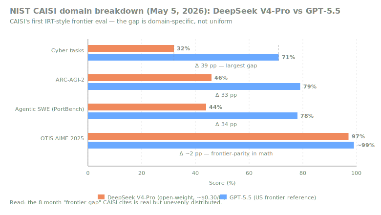
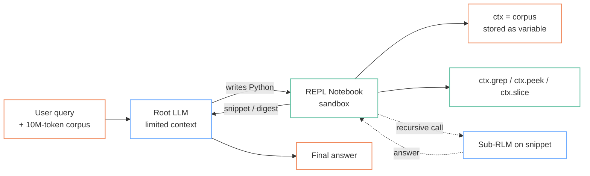
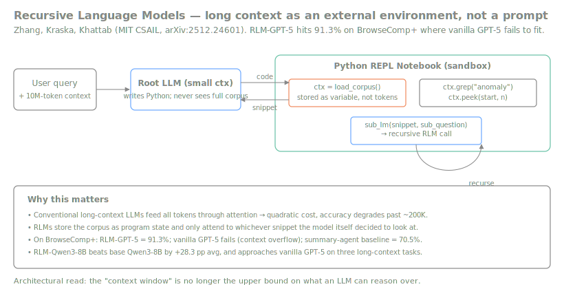
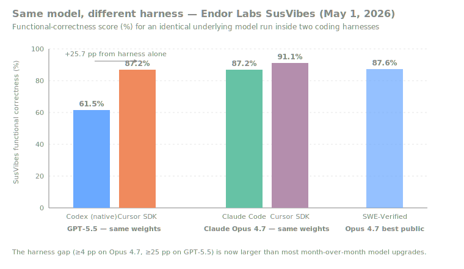
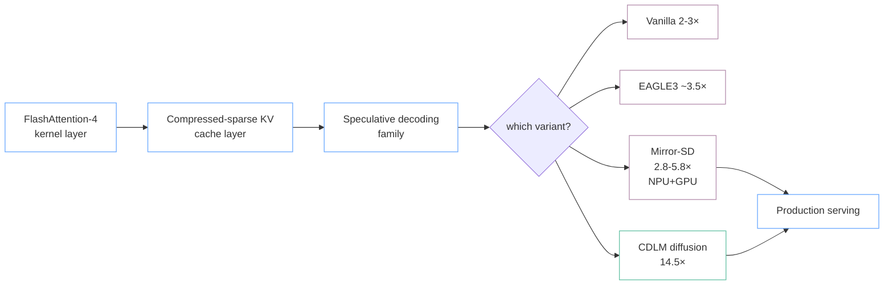
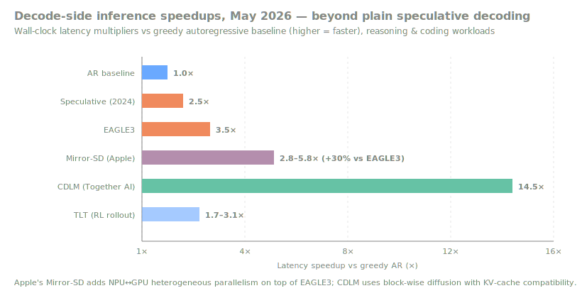

# LLM Updates — 2026-May-05

Tuesday brief, written on **GPT-5.5's "5/5" launch-day** (LA time).
The April 30 / May 1 / May 4 reports in this repo already covered:
GPT-5.5's API benchmarks, hybrid SSM-Transformer in production,
diffusion language models and FlashAttention-4, agent reliability
science, MoE moving into the attention block, Mistral Medium 3.5 +
Vibe + Le Chat Work Mode, world models as a peer architecture layer,
TLT for RL rollout speedup, and Meta's Avocado pivot. This pass
deliberately rolls forward to the things those briefs *did not*
foreground:

1. **The NIST CAISI evaluation of DeepSeek V4-Pro** was formally
   published this morning (May 5), with a domain-by-domain breakdown
   that turns the "frontier gap" from a one-number narrative into a
   set of very different numbers depending on which capability you
   care about.
2. **GPT-5.5 is now generally available to consumers** as of today's
   "5/5 at 5:55 PM PT" event. The interesting signal isn't the launch
   itself — it's that OpenAI ran the rollout as a *software-update
   cadence*, with the model itself partly orchestrating the event.
3. **Recursive Language Models (RLMs)** — the MIT CSAIL paper from
   late December 2025 that has now been picked up as "the paradigm of
   2026" — handle 10M+ tokens by storing the corpus as program state
   instead of attention input, and beat vanilla GPT-5 on long-context
   tasks where GPT-5 can't even fit the prompt.
4. **The agent harness has overtaken the model as the binding
   constraint.** Endor Labs' May 1 SusVibes benchmark shows GPT-5.5
   moving 25.7 percentage points on the same task just by switching
   between Codex's native harness and Cursor's SDK — a wider swing
   than most month-over-month *model* upgrades.
5. **Mirror Speculative Decoding (Apple)** delivers 2.8–5.8× wall-clock
   speedups by running target and draft on heterogeneous accelerators
   (GPU + NPU) in parallel — a +30% improvement over EAGLE3 and the
   first time NPU↔GPU partitioning has shown up as a public LLM
   serving win.
6. **Adaptive test-time compute** (Plan & Budget; "Reasoning on a
   Budget" survey; constrained-policy TTC allocation) is shifting from
   "give the model more tokens for hard questions" to a *control-theory*
   view where the budget is a learned policy.

Material already covered in the prior briefs is referenced briefly,
not re-derived.

---

## 1. May 5 — the GPT-5.5 launch the way it actually happened

Today's "5/5" event finalises a rollout that had already been live in
the API since April 23 and progressively dialled out to ChatGPT Plus,
Pro, Business, and Enterprise tiers from April 28 onward. Three signal
points are worth pinning down on launch day, separate from the
benchmark numbers covered in the May 1 brief:

- **It looks like a software release, not a model release.** The
  Fortune piece headline ("AI model launches are starting to look
  like software updates") is the right framing. There is no flagship
  press conference; there is an invite-only meet-up at 5:55 PM PT
  for developers, accompanied by a 10× Codex rate-limit bump for
  applicants who didn't make the guest list. Compared to the
  GPT-4 → GPT-5 generation, the cadence has compressed from "annual
  banner event" to "minor-version dot-release every 6–10 weeks."
  The directional read on industry structure: vendors are
  competing on velocity rather than on flagship marketing moments.
- **The model partially orchestrated its own launch.** Sam Altman
  publicly said he asked GPT-5.5 what it would want for the event;
  the model proposed the May 5 date, the 5:55 PM start, the
  short-speech format, and a feedback channel "for GPT-5.6
  suggestions." Read narrowly, that's a PR stunt. Read structurally,
  it's the first frontier launch where an LLM was used as a
  programme-management tool *for the launch of itself*. Expect this
  to become normalised over the next two release cycles.
- **The launch lands on the same day as the first formal
  government-grade benchmark for a peer Chinese model** (CAISI →
  DeepSeek V4-Pro; see §2). That collision is not a coincidence.
  The frontier comparison is now a *public-policy artefact* and not
  just a private bench run, and it is being timed against US
  release windows.

For routing decisions, the May 1 brief's headline numbers stand
unchanged: $5/$30 per M tokens, 400K context as the new Codex default,
98% on Tau2 telecom without prompt tuning, 82.7% on Terminal-Bench 2.0.
The April 23 → May 5 window is interesting because absolutely nothing
moved on the technical side — the model that shipped to Codex two
weeks ago is the model that ships to ChatGPT Plus today. **What moved
in those two weeks was the supporting infrastructure** (rate limits,
agent harness, third-party integrations).

Sources:
- [Introducing GPT-5.5 — OpenAI](https://openai.com/index/introducing-gpt-5-5/)
- [GPT-5.5 is here — Fortune (Apr 23, 2026)](https://fortune.com/2026/04/23/openai-releases-gpt-5-5/)
- [OpenAI plans invite-only "GPT-5.5 on 5/5" meetup — NewsBytes](https://www.newsbytesapp.com/news/science/openai-plans-invite-only-gpt-55-on-55-meetup-in-san-francisco/tldr)
- [GPT-5.5 planned its own launch party — Cybernews](https://cybernews.com/ai-news/gpt5-openai-musk-altman-party/)
- [Sam Altman consults GPT-5.5 on launch party plans — Let's Data Science](https://letsdatascience.com/news/sam-altman-consults-gpt-55-on-launch-party-plans-d986e529)
- [GPT-5.5 doubled the price; effective cost +20% — The Decoder](https://the-decoder.com/openai-unveils-gpt-5-5-claims-a-new-class-of-intelligence-at-double-the-api-price/)

---

## 2. NIST CAISI evaluation of DeepSeek V4-Pro — published today

The May 4 brief flagged the impending CAISI evaluation of DeepSeek
V4-Pro; the report dropped this morning (May 5). Three things make
this a more important data point than the headline "frontier lag of
~8 months" suggests:

- **Methodology.** CAISI is the first public US-government LLM
  evaluation to use an Item Response Theory (IRT) framing: AI models
  are scored as students taking an exam, and individual benchmark
  tasks are calibrated as *items* with discrimination and difficulty
  parameters. This is materially better than reporting unweighted
  accuracy across heterogeneous benchmarks; a hard task and an easy
  task no longer get equal weight in the aggregate.
- **The gap is domain-specific, not uniform.** Nine benchmarks
  across five domains, two of them non-public:

  | Domain                        | DeepSeek V4-Pro | GPT-5.5 (US ref) | Gap     |
  |-------------------------------|-----------------|------------------|---------|
  | Cyber tasks                   | 32%             | 71%              | 39 pp   |
  | Abstract reasoning (ARC-AGI-2)| 46%             | 79%              | 33 pp   |
  | Agentic SWE (PortBench)       | 44%             | 78%              | 34 pp   |
  | Math (OTIS-AIME-2025)         | 97%             | ~99%             | ~2 pp   |
  | Math (PUMaC 2024)             | 96%             | ~98%             | ~2 pp   |

  The single-number "8-month lag" is the IRT-adjusted aggregate.
  Domain-by-domain, the picture is much spikier — V4-Pro is at
  frontier-parity in mathematics, and 30+ points behind on cyber
  and agentic software engineering.

  

- **Cost-efficiency wins for the open weight.** On 5 of 7
  benchmarks, V4-Pro is more cost-efficient than the cheapest
  comparable US model (GPT-5.4 mini). This is the inverted version
  of the frontier gap: *if your workload sits in the math /
  knowledge-retrieval / formal-reasoning region of the matrix, the
  open Chinese model is the rational pick at production scale.*

The operational read for routing: a single "GPT-5.5 vs DeepSeek V4"
table is no longer adequate. Routing tables now need to be
**per-domain**, and each domain row has a different winner.

Sources:
- [CAISI Evaluation of DeepSeek V4-Pro — NIST](https://www.nist.gov/news-events/news/2026/05/caisi-evaluation-deepseek-v4-pro)
- [CAISI Evaluation of DeepSeek V4-Pro — The Weather Report](https://theweatherreport.ai/posts/caisi-deepseek-v4-pro/)
- [DeepSeek V4 trails US frontier by eight months — Digital Watch Observatory](https://dig.watch/updates/deepseek-v4-pro-caisi-us-nist-evaluation)
- [DeepSeek V4 Pro lags US AI models by 8 months — tbreak](https://tbreak.com/deepseek-v4-pro-us-ai-models-gap/)
- [US Government Says China's Best AI Models Lag Behind. Experts Aren't So Sure — Decrypt](https://decrypt.co/366685/us-says-china-best-ai-models-lag-behind-experts-not-sure)
- [Expanding the AI Evaluation Toolbox with Statistical Models — NIST](https://www.nist.gov/news-events/news/2026/02/new-report-expanding-ai-evaluation-toolbox-statistical-models)

---

## 3. Recursive Language Models — the long-context paradigm of 2026

The single most-discussed paper in the early-2026 long-context
literature is **Recursive Language Models** (Zhang, Kraska, Khattab —
MIT CSAIL, arXiv:2512.24601). It first appeared as a blog post in
October 2025, the formal arXiv paper landed at the very end of December
2025, and Prime Intellect / Introl / DeepLearning.AI The Batch have all
now framed it as the dominant emerging paradigm for long context in
2026. Crucially, **none of the prior briefs in this repo have engaged
with it yet** — it should be on the architecture diagram.

The architectural move is that the long prompt **never enters the
neural network's attention**. Instead it is loaded into a Python
REPL notebook as a variable (`ctx`), and the root LLM emits Python —
`ctx.grep("X")`, `ctx.peek(start, n)`, `sub_lm(snippet, sub_q)` — to
interrogate it. The recursion shows up because the root LLM can
launch a sub-RLM on any snippet, allowing arbitrary depth without
arbitrary attention cost.

What this delivers, empirically:

- **Inputs up to two orders of magnitude beyond the underlying model's
  context window**, *with no degradation as length grows*. Vanilla
  GPT-5 degrades sharply past ~200K tokens; RLM-GPT-5 holds at 10M+.
- **+28.3 pp average gain on RLM-Qwen3-8B over base Qwen3-8B**
  across four long-context tasks. The 8B model with RLM scaffolding
  approaches vanilla GPT-5 quality on three of those four tasks —
  evidence that the scaffolding delivers more capability per
  parameter than chasing the next dense model size.
- **91.3% on BrowseComp+ (RLM-GPT-5)**, vs vanilla GPT-5 failing the
  task with a context-overflow error and a summary-agent baseline at
  70.5%. This is the cleanest cross-method comparison in the paper.
- **Comparable cost** to baseline long-context scaffolds; in many
  cases cheaper because most snippets never see a frontier-scale
  model.

The structural implication is that **the "context window" stops
being the upper bound on what an LLM can reason over**. A model with
a 200K context window can, with an RLM wrapper, behave as if it had
unbounded context — at the cost of treating the corpus as a
*programmable* environment rather than tokens. This is closely
related to Anthropic's recent context-engineering posture, but RLMs
push the idea down into the inference loop itself rather than treating
context engineering as a prompt-design discipline.

The honest critique from the comments threads: RLMs require the root
model to be good at *writing code about its own context*. That is
already an emergent capability of GPT-5/Opus 4.7-class models, but it
is fragile in smaller models — a 4B model can't reliably plan a
recursive query graph over a 10M-token corpus.

Sources:
- [Recursive Language Models — arXiv:2512.24601 (Zhang, Kraska, Khattab)](https://arxiv.org/abs/2512.24601)
- [Recursive Language Models — Alex L. Zhang (blog)](https://alexzhang13.github.io/blog/2025/rlm/)
- [Recursive Language Models: the paradigm of 2026 — Prime Intellect](https://www.primeintellect.ai/blog/rlm)
- [MIT's Recursive Language Models Improve Performance on Long-Context Tasks — InfoQ](https://www.infoq.com/news/2026/01/mit-recursive-lm/)
- [RLMs Offer Path To Dramatically Expand Beyond the Context Window — DeepLearning.AI The Batch](https://www.deeplearning.ai/the-batch/recursive-language-models-offer-path-to-aramatically-expand-beyond-the-context-window/)
- [RLM context-management 2026 — Introl](https://introl.com/blog/recursive-language-models-rlm-context-management-2026)

---

## 4. The harness is now the binding constraint

Endor Labs' AI Code Security Benchmark (released May 1, 2026, built
on CMU's open SusVibes framework) lands as the cleanest *within-model*
demonstration that the agent harness — not the model weights — is now
the dominant variable in real-world coding-agent performance.

The headline numbers from the benchmark:

| Configuration                      | Functional correctness | Security score |
|------------------------------------|------------------------|----------------|
| GPT-5.5 in OpenAI Codex (native)   | 61.5%                  | 20.1%          |
| GPT-5.5 in Cursor SDK              | **87.2%**              | **23.5%**      |
| Claude Opus 4.7 in Claude Code     | 87.2%                  | —              |
| Claude Opus 4.7 in Cursor SDK      | **91.1%**              | —              |

That is a **25.7 percentage-point** functional-correctness swing for
the *same model weights* between Codex and Cursor, and a 3.9-point
swing for Opus 4.7 between Anthropic's own Claude Code and Cursor's
SDK. By comparison, the Opus 4.6 → Opus 4.7 model upgrade (the most
substantial release in this window) was worth +6.8 points on
SWE-Bench Verified. **The harness gap is now larger than the
month-over-month model gap** in the GPT-5.5 case, and is comparable in
the Opus case.

This has three consequences for the field:

1. **Vendor agent surfaces (Codex, Claude Code, Le Chat Work Mode)
   are no longer the default best venue for their own model.** A
   Cursor harness running GPT-5.5 outperforms OpenAI's own Codex
   harness running the same weights. Mistral's Vibe (May 2 brief)
   and Anthropic's Claude Code each face the same competitive
   pressure: third-party harnesses iterate faster than first-party
   ones, and there is no architectural reason a model lab's own
   wrapper should be best.
2. **Harness ablation should be a standard part of model evaluation.**
   Vendor benchmark scores quoted *without* the harness configuration
   are now nearly meaningless — a 70% claim could be a 50% in one
   wrapper and an 87% in another. The May 4 brief noted this for
   coding harnesses; the May 1 Endor data quantifies the magnitude.
3. **The "harness" is the right object for capability research,
   not the model.** Meta-Harness (arXiv:2603.28052) and the Externalisation
   in LLM Agents survey (arXiv:2604.08224) both crystallised this
   in late April: memory, skill libraries, protocol layers, and the
   harness loop itself are all candidate optimisation targets, and
   each can move benchmark numbers by 10+ pp.

For production routing decisions, the practical instruction set is:
*pick the harness first, the model second.* For at least coding
workloads, the Cursor SDK is currently the best public harness for
both GPT-5.5 and Opus 4.7.

Sources:
- [GPT-5.5 sets a new code security record with Cursor, not Codex — Endor Labs](https://www.endorlabs.com/learn/gpt-5-5-sets-a-new-code-security-record-with-cursor-not-codex-in-agent-security-league)
- [AI Coding Agent Security Benchmark — Endor Labs](https://www.endorlabs.com/research/ai-code-security-benchmark)
- [Cursor SDK + GPT-5.5 vs native Codex — MindStudio](https://www.mindstudio.ai/blog/cursor-sdk-gpt-5-5-vs-native-codex-harness-endor-labs-benchmark)
- [Agent Harnesses Beat Model Upgrades — MindStudio](https://www.mindstudio.ai/blog/agent-harnesses-beat-model-upgrades-5-benchmarks)
- [Meta-Harness: End-to-End Optimization of Model Harnesses (arXiv:2603.28052)](https://arxiv.org/html/2603.28052v1)
- [Externalization in LLM Agents — A Unified Review (arXiv:2604.08224)](https://arxiv.org/html/2604.08224v1)

---

## 5. Mirror Speculative Decoding — speculative decoding meets heterogeneous compute

The May 1 brief noted that the inference stack is stratifying into
composable layers. Apple's **Mirror Speculative Decoding (Mirror-SD,
arXiv:2510.13161, ICLR 2026 submission)** is the layer that materially
moves the speculative-decoding sub-stack, and it deserves a section of
its own because it is the first public LLM serving result that
**partitions decode work across heterogeneous accelerators (GPU + NPU)**
in a principled way.

The mechanism, in one paragraph: in vanilla speculative decoding, a
small draft model proposes tokens that the large target verifies in
one pass. Mirror-SD does this *bidirectionally and on different
chips* — the draft speculates forward continuations on the NPU while
the target *simultaneously* speculates correction paths for the
draft's tokens on the GPU. The two pipelines mirror each other,
hence the name. Speculative streaming layered on top lets the draft
emit multiple tokens per step.

Why it matters in the broader 2026 inference picture:

The empirical claim is **2.8×–5.8× wall-clock speedup on SpecBench
across 14B–66B target models**, with a +30% average improvement over
the strongest prior baseline (EAGLE3). That is a meaningful step
forward for serving — vanilla speculative decoding hit a ceiling
around 3.5× because acceptance rate and draft quality trade off
against each other; Mirror-SD breaks the tradeoff by paying for it
in *parallelism on a different chip* rather than in either acceptance
or draft quality.

The structural read for hyperscaler serving stacks: this is the first
LLM-side technique that justifies treating the **NPU as a first-class
inference accelerator alongside the GPU**, rather than just an edge
device. Apple's silicon stack is the natural home for this, but the
technique generalises to any heterogeneous-accelerator deployment
(e.g. GPU + Trainium, or GPU + Gaudi). For comparison, CDLM (May 1
brief) achieves a much bigger headline number — 14.5× — but only on
diffusion language models, which remain a small fraction of
production traffic. Mirror-SD lifts standard autoregressive serving.

The complementary research thread is **Recurrent Drafter** (also
Apple, mid-2025) and **Speculative Streaming** (Apple, 2024), which
together represent a coherent multi-year programme to remove the
serial bottleneck from autoregressive decode. The serving stack that
results — FlashAttention-4 → compressed-sparse KV → Mirror-SD-style
heterogeneous speculative decoding — is roughly **20× faster** end-to-end
on memory-bound workloads compared to a 2024 baseline. That is the
single largest non-architectural efficiency gain of the 2024 → 2026
window, and it is the reason GPT-5.5 can charge 2× the per-token price
of GPT-5.4 while only delivering a +20% effective cost increase.

Sources:
- [Mirror Speculative Decoding — Apple ML Research](https://machinelearning.apple.com/research/mirror)
- [Mirror Speculative Decoding (arXiv:2510.13161)](https://arxiv.org/abs/2510.13161)
- [Recurrent Drafter for Fast Speculative Decoding — Apple ML Research](https://machinelearning.apple.com/research/recurrent-drafter)
- [Speculative Streaming — Apple ML Research](https://machinelearning.apple.com/research/llm-inference)
- [Speculative Decoding 2-3× Faster LLM Inference (2026) — PreMAI](https://blog.premai.io/speculative-decoding-2-3x-faster-llm-inference-2026/)
- [Introduction to Speculative Decoding — NVIDIA Technical Blog](https://developer.nvidia.com/blog/an-introduction-to-speculative-decoding-for-reducing-latency-in-ai-inference/)
- [LLM Inference Handbook — Speculative Decoding — BentoML](https://bentoml.com/llm/inference-optimization/speculative-decoding)

---

## 6. Adaptive test-time compute — from "bigger is smarter" to control theory

The May 1 brief observed that GPT-5.5 Pro is "the same underlying
model with extra parallel test-time compute on harder questions" and
flagged this as a regime shift. The 2026 literature has now caught up
with what that shift actually requires *theoretically*, and the
results are worth pulling out.

Two papers anchor the shift:

- **"Reasoning on a Budget" (Alomrani, Zhang et al., arXiv:2507.02076)**
  introduces a two-tier taxonomy: **L1-controllability** is "the
  model respects a fixed compute budget you give it"; **L2-adaptiveness**
  is "the model itself decides, per query, how much compute to spend
  based on input difficulty and its own confidence." Frontier vendor
  APIs (OpenAI's `effort` parameter, Anthropic's `xhigh`/`max`,
  Google's Deep Think levels) are L1 systems with a partially L2
  back-end. The taxonomy makes the policy question concrete: *who
  picks the compute level for each query — the developer, the
  product, or the model?*
- **"Plan and Budget" (Lin et al., arXiv:2505.16122)** is a
  model-agnostic framework that decomposes a query into sub-questions
  and allocates a token budget to each based on estimated complexity.
  Results: **+70% accuracy on hard reasoning tasks**, **−39% token
  use**, and **+193.8% efficiency improvement** on the
  efficiency-vs-accuracy frontier. The mechanism is essentially a
  budget-aware planner that sits one layer above the LLM and treats
  inference compute as a resource to allocate, not as a flag.

A third, late-2025 paper — **"The Art of Scaling Test-Time Compute"
(arXiv:2512.02008)** — runs a 30-billion-token sweep over eight
open-source LLMs and finds three robust empirical results: (a) no
single TTS strategy universally dominates, (b) reasoning models
exhibit qualitatively distinct compute-vs-accuracy patterns across
problem-difficulty bands, (c) optimal performance scales monotonically
with budget but at *very* different slopes per model. Translation:
the right TTC policy is per-model and per-difficulty-band; a single
"thinking" toggle is leaving accuracy on the table.

The April 2026 follow-up — **Adaptive Test-Time Compute Allocation via
Constrained Policy Optimization (arXiv:2604.14853)** — formalises this
as a constrained RL problem: maximise expected accuracy subject to an
average compute budget. This is the first paper to give the inference
controller a *learned* policy rather than a heuristic, and it puts
the test-time-compute layer on the same theoretical footing as
distributional RL.

The operational consequence: when a routing layer (e.g. an MCP server,
an agent harness, or a model-side orchestrator) makes a per-query
decision about which model and how much compute to use, that
**decision is itself a policy** that has its own training signal.
Enterprise-grade serving stacks in 2026 should expect to ship not just
a model and a harness but a **TTC controller** between them.

Sources:
- [Reasoning on a Budget: Adaptive and Controllable TTC in LLMs — arXiv:2507.02076](https://arxiv.org/abs/2507.02076)
- [Plan and Budget — arXiv:2505.16122](https://arxiv.org/abs/2505.16122)
- [The Art of Scaling Test-Time Compute — arXiv:2512.02008](https://arxiv.org/abs/2512.02008)
- [Adaptive TTC via Constrained Policy Optimization — arXiv:2604.14853](https://arxiv.org/html/2604.14853)
- [Awesome-Inference-Time-Scaling — paper list](https://github.com/ThreeSR/Awesome-Inference-Time-Scaling)

---

## 7. Frontier model table — May 5 snapshot

For the first time this week the table needs a domain breakdown row;
the CAISI evaluation makes "average score" a misleading top-line.

| Model              | Vendor     | Context | $ in / out (per M) | SWE-Bench Verified | Tau2 Telecom | Terminal-Bench 2.0 | Notes                                                  |
|--------------------|------------|---------|--------------------|--------------------|--------------|--------------------|--------------------------------------------------------|
| GPT-5.5            | OpenAI     | 400K    | $5 / $30           | ~84%¹              | 98.0%        | 82.7%              | "5/5" consumer rollout today; same weights since 4/23  |
| GPT-5.5 Pro        | OpenAI     | 400K    | $30 / $180         | —                  | —            | —                  | Parallel test-time compute on top of GPT-5.5           |
| Claude Opus 4.7    | Anthropic  | 1M      | $5 / $25           | **87.6%**          | —            | 69.4%              | Best public SWE-Bench Verified; `xhigh` thinking level |
| Gemini 3.1 Pro     | Google     | 1M      | —                  | 80.6%              | —            | 68.5%              | 2× reasoning over Gemini 3 Pro; #1 on 12/18 benchmarks |
| Mistral Medium 3.5 | Mistral    | 256K    | $1.5 / $7.5        | 77.6%              | 91.4%³       | —                  | Open-weight, dense 128B; best $ / SWE in dense class   |
| DeepSeek V4-Pro    | DeepSeek   | 1M      | ~$0.30             | 81%²               | —            | —                  | CAISI: cyber 32%, math 96–97%, agentic SWE 44%         |
| Qwen3.6-27B        | Alibaba    | —       | open               | —                  | —            | —                  | Dense beats 397B MoE on agentic coding (Apr 22 release)|

¹ disclosed at GPT-5.5 release; not directly comparable to Opus 4.7's 87.6% verified figure due to harness differences
² public DeepSeek figure; CAISI's IRT-adjusted PortBench score is 44%
³ τ³-Telecom; Tau2 Telecom score not separately disclosed

The April 30 brief's framing ("frontier launches are now staggered
weekly") holds — the table has changed in 5 of the 7 rows since the
April 30 snapshot. Routing tables locked in for >30 days are now
provably stale.

---

## 8. What to watch in the next 7–14 days

- **Meta Avocado.** Pre-training completed in January; release was
  pushed from March to "May or June." The May 5 launch window is
  open. If Avocado ships closed-weight (the leaked plan), this is the
  data point that confirms the open-weight era at the frontier is
  over for Meta.
- **Qwen 4 prediction-market window.** Manifold's market puts Qwen 4
  at 1% before May, 34% before June, 49% before July. If the dense
  Qwen3.6-27B beats 397B MoE result generalises, the frontier story
  reverses on parameter count.
- **OpenAI's response to the Endor Labs harness gap.** Codex shipping
  a Cursor-parity harness is a tractable engineering problem; whether
  OpenAI prioritises it tells us whether the lab views the harness
  as part of the product surface or as an ecosystem layer.
- **CAISI's next two evaluations.** The methodology is now public;
  expect peer evaluations of Qwen3.6 and Mistral Medium 3.5 within
  the quarter. The IRT scoring curve will become a standard reference
  artefact.
- **First production deployment of an RLM-style scaffold.** The
  blogposts have arrived; the production rollout is the next signal.
  Watch for Anthropic context engineering posts and for vector-DB
  vendors (Pinecone, Turbopuffer, Chroma) repositioning around
  recursive long-context.
- **GPT-5.6 feedback channel.** GPT-5.5's launch suggestion included
  a "central place to gather suggestions for GPT-5.6." If OpenAI
  actually ships that channel, it is the first public model-roadmap
  feedback loop driven partly by the model itself.

---

## Methodology and caveats

This brief is compiled from a mix of vendor press, independent
benchmark write-ups, arXiv preprints, and conference proceedings
listings (ICLR 2026 outstanding-paper page, OpenReview). Several
specific claims (CAISI table, Endor Labs swing magnitudes, Mirror-SD
2.8–5.8×) are sourced from a single research group's reporting and
should be treated as preliminary until reproduced independently.
Pricing fields move week-to-week; the snapshot is May 5 evening,
LA time. The frontier table is intentionally partial — fields that
would require a benchmark not yet run are left blank rather than
filled with a vendor self-report.

---

*Filed 2026-05-05, Los Angeles time.*
