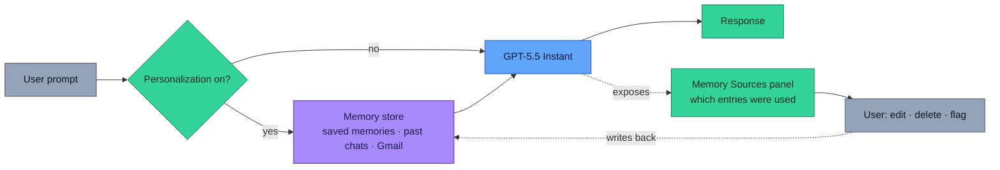
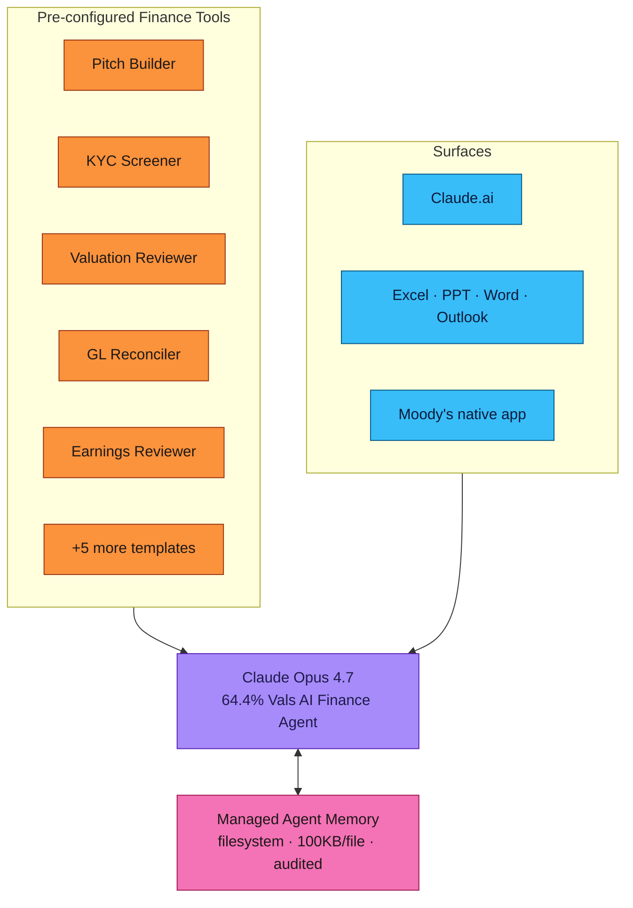
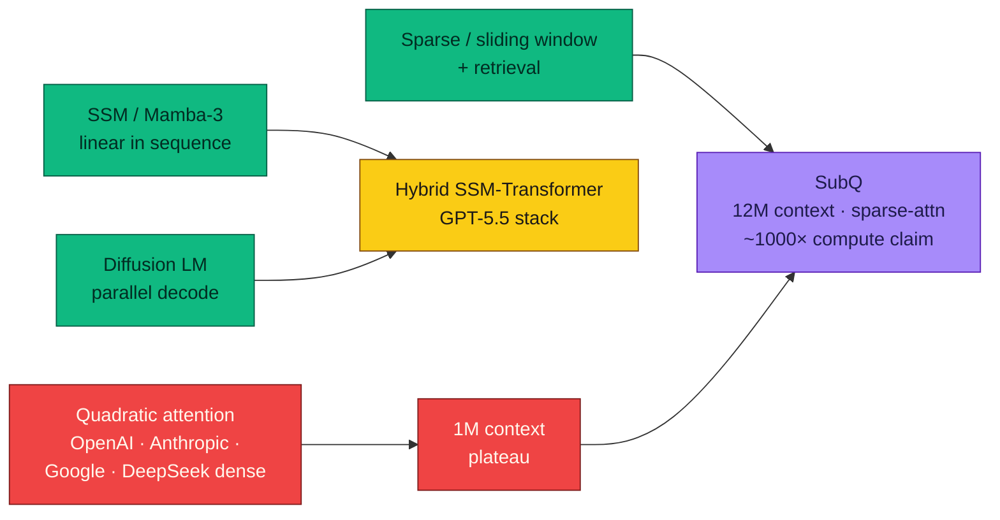
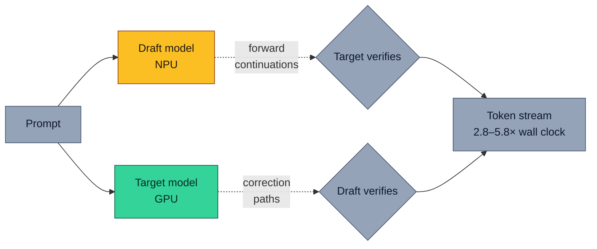

# LLM Updates — 2026-May-06

Mid-week brief, written Wednesday May 6 (Los Angeles time), two days
after the May 4 report. The newsworthy moves since Monday have been
**default-tier and enterprise-tier**, not new flagship releases:

1. **GPT-5.5 Instant** silently replaced GPT-5.3 Instant as the default
   ChatGPT model on May 5, with a 52.5% reduction in hallucinations on
   high-stakes prompts and a new **memory source transparency** UI.
   In the API it lands as `chat-latest`.
2. **Anthropic's financial-services push** the same day: ten preconfigured
   Claude agents for banking / asset management / insurance, full
   Microsoft 365 integration (Excel, PowerPoint, Word, Outlook), and
   Moody's-as-a-native-app via MCP. Opus 4.7 took the top of the Vals AI
   Finance Agent benchmark at 64.4%.
3. **Subquadratic** ("SubQ") came out of stealth on May 5 with $29M
   seed and a fully-subquadratic sparse-attention architecture that
   claims a **12M-token** context window at ~1000× lower compute than
   quadratic-attention frontier models. The independent-evaluation
   community is asking for proof; the architectural claim is real
   regardless of whether the numbers hold.
4. **Apple at ICLR 2026** has shipped the most concrete architecture
   research of the past two weeks: **ParaRNN** (665× parallel-training
   speedup for nonlinear RNNs, Oral), **Manzano** (hybrid vision
   tokenizer that resolves the understanding/generation tradeoff in
   unified multimodal), and **Mirror Speculative Decoding** (2.8–5.8×
   wall-clock by mapping draft + target across GPU/NPU heterogeneous
   silicon).
5. **Memory for Managed Agents** (Anthropic, public beta) — Claude
   agents now get filesystem-based cross-session memory with audit
   logs, 100KB/file caps, and a portable store format. Combined with
   Opus 4.7's improved memory-writing behavior, this is the first
   credible enterprise answer to the "agent forgetting" problem.
6. **Apple's iOS 27 multi-provider rumor** (Bloomberg, May 6) — Siri
   and system-level writing/voice/image features may become routable
   to OpenAI / Anthropic / Google models. If it ships, it's the first
   OS-level abstraction over frontier model choice.

Items already in the April 30 / May 1 / May 4 reports — Mistral Medium
3.5 + Vibe, NIST CAISI's DeepSeek V4 evaluation, world models as a
peer layer, ICLR's *Transformers are Inherently Succinct*, FlashAttention-4,
Mamba-3, the long-tail RL rollout work — are referenced briefly here
where the May 5–6 news intersects them, and not re-derived.

---

## 1. GPT-5.5 Instant: the default tier moves

The single most-deployed change in the past 48 hours is that **the
default model behind ChatGPT is no longer GPT-5.3 Instant**. As of
May 5, ChatGPT's free, Plus, Pro, Business and Enterprise tiers all
route to GPT-5.5 Instant by default, with the older model retained
under the model-picker for paying users for **three months** before
retirement. In the API, the new model is exposed as the
`chat-latest` alias (Source: [TechCrunch](https://techcrunch.com/2026/05/05/openai-releases-gpt-5-5-instant-a-new-default-model-for-chatgpt/),
[Axios](https://www.axios.com/2026/05/05/openai-chatgpt-update-default-model),
[The AI Insider](https://theaiinsider.tech/2026/05/06/openai-launches-gpt-5-5-instant-as-default-chatgpt-model-with-reduced-hallucinations-and-deeper-memory/)).

The headline numbers worth committing to memory:

| Metric                           | GPT-5.3 Instant | GPT-5.5 Instant | Δ        |
| -------------------------------- | --------------- | --------------- | -------- |
| AIME 2025                        | 65.4            | **81.2**        | +15.8 pt |
| MMMU-Pro (multimodal reasoning)  | n/r             | **76.0**        | —        |
| Terminal-Bench 2.0               | 75.1            | **82.7**        | +7.6 pt  |
| Hallucinated claims, high-stakes |  baseline       | **−52.5%**      | halved   |
| Inaccurate claims, user-flagged  |  baseline       | **−37.3%**      |          |

(Sources: [Decrypt](https://decrypt.co/366842/openai-upgraded-chatgpt-default-model-what-gpt-5-5-instant-does),
[NewsBytes](https://www.newsbytesapp.com/news/science/openai-releases-gpt-5-5-instant-as-chatgpt-default-model/story),
[Rolling Out](https://rollingout.com/2026/05/05/openais-gpt-5-5-instant-reduces/).)

Two things are interesting about this beyond the benchmark deltas:

**(a) "High-stakes hallucination" as a first-class metric.** The
52.5% reduction is reported specifically against prompts in medicine,
law, and finance — the domains where hallucinations carry real
liability. This is the first OpenAI release where the dominant
training-and-eval target was *factual reliability under domain
pressure*, not raw capability gains. It tracks the late-April /
ICLR result that multi-turn under-specified prompts are where
contemporary LLMs degrade most (covered in the May 4 brief).

**(b) Memory source transparency** lands at the same time. When
ChatGPT's reply is shaped by saved memories, prior chats, or Gmail
context, users can now see exactly **which memory entries were used**
to construct that response, edit or delete them, and flag them as
relevant or irrelevant. Memory sources also stay private when a chat
is shared. This is the first time a hyperscaler-tier consumer LLM has
exposed its memory store as a viewable, auditable, first-class object
([iClarified](https://www.iclarified.com/100766/openai-releases-gpt55-instant-for-chatgpt-with-improved-accuracy-and-memory-controls),
[The Decoder](https://the-decoder.com/chatgpt-update-rolls-out-gpt-5-5-instant-with-fewer-hallucinations-and-more-personalized-answers/)).

The combination of (a) and (b) is the operational story: the default
tier is now (i) substantially less likely to fabricate in high-stakes
domains and (ii) accountable about *why* it answered the way it did.
For consumer trust this is the most consequential ChatGPT update of
2026 to date, even though the model name only ticks one decimal.

---

## 2. Anthropic's financial-services unbundle (May 5)

The other May 5 announcement of comparable weight is **Anthropic's
push into financial services**, which arrived as three coordinated
pieces ([Fortune](https://fortune.com/2026/05/05/anthropic-wall-street-financial-services-agents-jamie-dimon/),
[Bloomberg](https://www.bloomberg.com/news/articles/2026-05-05/anthropic-unveils-ai-agents-to-field-financial-services-tasks),
[The Register](https://www.theregister.com/2026/05/05/anthropic_unleashes_finance_agents_claude/),
[Anthropic](https://www.anthropic.com/news/finance-agents)):

- **Ten preconfigured "Claude for Finance" agents**: pitch builder,
  meeting preparer, earnings reviewer, model builder, market researcher,
  KYC screener, valuation reviewer, GL reconciler, month-end closer,
  statement auditor. Each is a pre-configured Claude Managed Agent
  with task-specific tools and prompts.
- **Microsoft 365 GA**: the Excel / PowerPoint / Word / Outlook
  add-ins are now generally available, and they share state — Claude
  carries context across all four applications as a single agent,
  not four siloed copilots.
- **Moody's-as-MCP-app**: Moody's full credit/risk dataset is
  embedded in Claude as a native MCP application, enabling rating
  and risk lookups on 600M+ companies without leaving Claude.
- Opus 4.7 now leads **Vals AI's Finance Agent benchmark at 64.4%**,
  and tops GDPval-AA for "economically valuable knowledge work."

The strategic read is that Anthropic is no longer competing with
OpenAI on default-tier consumer experience (where OpenAI just made
the hallucination move above) — it is competing on **vertical depth
inside enterprise workflows**, with named enterprise deployments at
JPMorganChase, Goldman Sachs, Citi, AIG, and Visa. The 10-template
shape of the launch is the same product pattern as Salesforce's
Industry Clouds: don't sell a model, sell pre-fitted workflows.

The architecturally interesting layer below the templates is that
**Memory for Managed Agents** went into public beta on the same
release rhythm. Agents now get filesystem-based memory stores with:

- 100 KB/file cap (~25K tokens)
- API-controlled writes / reads / portability
- Audit logs of memory accesses
- Per-store and per-org isolation
- Pairs with Opus 4.7's improved memory-writing behavior — the model
  writes more discerning, well-structured memories than 4.6
  ([Build Fast With AI](https://www.buildfastwithai.com/blogs/claude-managed-agents-memory-2026),
  [Caylent](https://caylent.com/blog/claude-opus-4-7-deep-dive-capabilities-migration-and-the-new-economics-of-long-running-agents)).

Memory + verticalization are a single product story. A finance agent
that re-runs month-end close every period needs (a) state across
sessions and (b) a domain ontology — Anthropic just shipped both.

---

## 3. Subquadratic ("SubQ"): 12M context, with a caveat

A Miami-based startup named **Subquadratic** came out of stealth on
May 5 with a $29M seed round and a model called **SubQ** that claims
a **12M-token context window** built on a **fully subquadratic sparse
attention** architecture (Sources:
[SiliconANGLE](https://siliconangle.com/2026/05/05/subquadratic-launches-29m-bring-12m-token-context-windows-ai/),
[The New Stack](https://thenewstack.io/subquadratic-12-million-context-window/),
[VentureBeat](https://venturebeat.com/technology/miami-startup-subquadratic-claims-1-000x-ai-efficiency-gain-with-subq-model-researchers-demand-independent-proof),
[SubQ blog](https://subq.ai/introducing-subq)).

Reported numbers:

- **12M tokens** advertised context, vs. 1M for the current frontier
  default (GPT-5.5, Claude Opus 4.7, Qwen 3.6 Plus, Gemini 3.1 Pro,
  Llama 4 Maverick).
- **~50× faster, ~50× cheaper** than quadratic-attention frontier
  models at the 1M-token mark.
- **~1000× lower compute** at full 12M.
- Two beta products: a hosted API at the full 12M window, and **SubQ
  Code**, a CLI agent built on the same model.

The architectural family this fits into is the *non-attention or
sub-quadratic-attention frontier*, which already includes:
Mamba-3 (SSM, ICLR 2026 covered in May 4 brief), the GPT-5.5 hybrid
SSM-Transformer (May 1 brief), FlashAttention-4 (May 1, *quadratic
but cheaper*), and the diffusion LM front (May 1). SubQ adds a
**sparse attention** variant — one that the company claims is
*subquadratic in tokens read*, not just in FLOPs spent.

Two things to note:

- **Independent verification has not landed.** Researchers cited in
  VentureBeat's coverage explicitly want to see effective-recall and
  needle-in-haystack numbers across the full 12M window before
  treating the claims as decided. Effective-recall degrades sharply
  past 1M on the published frontier today; whether SubQ holds up at
  3M or 7M or 12M is exactly the question that will define the model.
- **The architectural genre is real even if the numbers shrink.** The
  field was already converging on subquadratic mechanisms (SSM
  hybrids, Mamba-3, diffusion-LM, sliding-window + retrieval, etc.)
  to break the *N²* attention scaling barrier. SubQ being the first
  to ship a frontier-positioned model at this design is the
  significant signal — even if Anthropic / OpenAI / Google's first
  publicly-confirmed 10M+ window is what closes the conversation.

---

## 4. Apple at ICLR 2026: three architecture results worth knowing

ICLR 2026 (Rio de Janeiro, April 23–27) is now the most concentrated
single signal of where academic LLM research is going. Apple in
particular published three results that have direct production
implications, all surfaced or finalised in the past two weeks
([Apple ML at ICLR 2026](https://machinelearning.apple.com/research/iclr-2026),
[9to5Mac](https://9to5mac.com/2026/04/27/heres-what-apple-showcased-at-iclr-2026-one-of-the-worlds-biggest-ai-conferences/)).

### 4.1 ParaRNN — 665× parallel training of nonlinear RNNs (Oral)

Until now, the reason RNNs were uncompetitive at scale was *training*,
not inference: linear SSMs (Mamba) parallelise via structured
recurrences, but **nonlinear** RNNs (LSTM, GRU and their successors)
seemed to require sequential training over the time axis, locking
out big-batch GPU utilisation.

ParaRNN reformulates the nonlinear recurrence as a single system of
equations and **solves it in parallel via Newton iterations + custom
parallel reductions**. Reported speedups of up to **665× over naive
sequential training**, and 7B-parameter LSTM/GRU adaptations whose
perplexity is comparable to similarly-sized Transformers and Mamba-2
([paper](https://arxiv.org/abs/2510.21450),
[Apple ML](https://machinelearning.apple.com/research/pararnn)).

The strategic implication is the same one Mamba-3 forced in the May 1
brief: the **set of architecture choices** for a frontier-class LLM
just got bigger again. We now have, as defensible options at 7B+
scale: dense Transformer, sparse-MoE Transformer, SSM (Mamba-2/3),
SSM-Transformer hybrid (GPT-5.5), diffusion LM (CDLM), and now
**parallel-trainable nonlinear RNN**. The codebase is publicly
released for use as a generic training-parallelisation framework.

### 4.2 Manzano — unified multimodal without the understanding/generation tradeoff

The standing tradeoff in unified multimodal models has been: optimise
for image-to-text understanding and you lose image generation
fidelity; optimise for image generation and you lose visual reasoning.
**Manzano** introduces a **hybrid vision tokenizer** with two
adapters off a single shared encoder — one producing **continuous
embeddings** for understanding, the other producing **discrete
tokens** for generation, in a common semantic space. A single
autoregressive LLM predicts both text and image tokens; an auxiliary
diffusion decoder turns the image tokens into pixels
([paper](https://arxiv.org/html/2509.16197v1),
[Apple ML](https://machinelearning.apple.com/research/manzano),
[OpenReview](https://openreview.net/forum?id=FIXPFUeO9Z)).

State-of-the-art among unified models, competitive with specialist
models on text-rich evaluation, with minimal observed conflict
between the two heads. This is the first credible path off the
"separate pipelines for vision-in vs. vision-out" pattern that has
defined the omni-modal stack since 2024.

### 4.3 Mirror Speculative Decoding — 2.8–5.8× wall clock, GPU + NPU

Speculative decoding is by now standard in production serving stacks
(vLLM, SGLang, TensorRT-LLM); the question for 2026 is whether the
draft model can be made fast enough to keep up. **Mirror-SD**'s
answer is heterogeneous-silicon parallelism: **the draft and the
target run on different accelerators** (GPU + NPU on a typical
modern SoC) and the speculation goes both ways — the draft proposes
forward continuations for the target to verify, while the target
**simultaneously proposes correction paths for the draft**. Both
pipelines use multi-token streaming
([paper](https://arxiv.org/abs/2510.13161),
[Apple ML](https://machinelearning.apple.com/research/mirror)).

On SpecBench at 14B–66B parameters: **2.8–5.8× wall-clock speedup**,
**+30% relative** vs. EAGLE3, the prior strongest baseline. This is
the current state-of-the-art number for speculative decoding.

The combined Apple-at-ICLR signal is that **inference, training, and
the multimodal stack each have a credible new mechanism in 2026**. None
of them require a frontier-scale lab to reproduce; ParaRNN's code is
public, Mirror-SD targets commodity GPU+NPU silicon, and Manzano's
hybrid-tokenizer recipe is described in full.

---

## 5. Gemini 3.2 Flash spotted in Arena (May 5)

**Gemini 3.2 Flash** appeared on May 5 as silent benchmark traffic
on the Eleuther AI Arena and was simultaneously found in iOS app
builds and Google AI Studio strings ([Build Fast With AI](https://www.buildfastwithai.com/blogs/gemini-3-2-flash-release-2026),
[Let's Data Science](https://letsdatascience.com/news/google-spots-gemini-32-flash-naming-strategy-shifts-84dcf430)).
This is Google's standard pre-release pattern, so an official launch
between now and Google I/O (May 19–20) is the working assumption.

Two pieces of leaked data are worth recording:

- **Pricing.** $0.25 / 1M input, $2.00 / 1M output — **half the input
  price** and ~33% lower output price than Gemini 3 Flash ($0.50 /
  $3.00). This is a meaningful step down in the cost floor for a
  frontier-grade Flash-tier model.
- **Position.** Slots between 3.1 Flash-Lite and 3.1 Pro on Google's
  internal hierarchy; the company's framing in the leaked strings is
  a **near-Pro performance / Flash-tier latency** mid-point.

For comparison the current public 3-Flash is already shipping
strong numbers on PhD-level reasoning (90.4% GPQA Diamond, 78%
SWE-bench Verified, 81.2% MMMU Pro), so 3.2 Flash matters less for
new capability and more for **the cost/latency band at which a
"good enough" frontier-grade model becomes operationally cheap to
default to** — particularly for batched agent workloads.

Plan around Google I/O (May 19–20) for the official announcement;
related leaks suggest the AI control center for admins (rolled out
May 4) and Workspace conversational doc/sheet/slide generation are
companion launches.

---

## 6. Apple iOS 27: multi-provider AI as an OS abstraction (rumor)

**The Tech Portal** and Bloomberg reported on May 6 that Apple is
preparing iOS 27 to let users **switch between OpenAI, Google, and
Anthropic models** as the backend for system features — system
writing assistance, voice (Siri), image generation
([source](https://thetechportal.com/2026/05/06/apple-could-allow-users-to-switch-between-ai-providers-like-openai-google-and-anthropic-in-ios-27-features)).
This is rumor, not announcement, but it has two strong confirmations:
the existing ChatGPT integration in iOS 18+, and the Gemini
integration that shipped late 2025.

If it lands, it's the first **OS-level abstraction over frontier
model choice**, with three knock-on effects worth noting now:

1. **Model identity becomes configurable, not branded.** Today the
   user "uses ChatGPT" or "uses Gemini." Under this design, the user
   uses *iOS Writing*, which is backed by a model they chose — the
   way they choose a default browser. The model becomes a substitutable
   component, not a product surface.
2. **Per-feature routing** is the natural next step. Different models
   are good at different things; Apple has no incentive to pick one
   per device when each feature has a different optimal backend.
3. **The on-device model question gets sharper.** Apple's 3B on-device
   foundation model and PT-MoE server model
   ([tech report](https://machinelearning.apple.com/research/apple-foundation-models-tech-report-2025))
   would coexist with the third-party options. This is consistent with
   Apple's preferred architecture: on-device by default, cloud (theirs
   or someone else's) for harder queries.

Worth tracking through WWDC (June) and the iOS 27 developer beta.

---

## 7. Frontier snapshot, May 6

The default-tier and enterprise-tier moves of the past 48 hours
slightly redraw the May 4 frontier snapshot:

| Slot                      | Top model (May 6)              | Comment                             |
| ------------------------- | ------------------------------ | ----------------------------------- |
| Frontier reasoning        | Claude Opus 4.7                | Vals AI Finance Agent #1, 64.4%     |
| Frontier coding           | GPT-5.5 Pro / Claude Opus 4.7  | T-Bench 2.0 82.7% (5.5 Instant)     |
| Default consumer chat     | **GPT-5.5 Instant**            | replaces 5.3 as ChatGPT default     |
| Open-weight frontier      | DeepSeek V4-Pro / Mistral Med 3.5 | unchanged                        |
| On-device flagship        | Apple PT-MoE server + 3B local | iOS 27 multi-provider routing pending |
| Multimodal unified        | Manzano (research) / GPT-5.5  | hybrid tokenizer = production path  |
| Subquadratic / long-context | **SubQ (claims) · Mamba-3 · GPT-5.5 hybrid** | SubQ 12M unverified |
| Enterprise vertical       | **Claude for Finance + M365** | new this cycle                      |
| Reasoning-from-internal   | INTUITOR / RLIF                | research, not product               |

What changed in two days:

- The **default consumer slot** flipped to GPT-5.5 Instant — the one
  most users will actually encounter.
- A **new long-context contender** (SubQ) is on the board, modulo
  independent verification.
- The **enterprise vertical slot** got its first explicitly-named
  template family (Claude for Finance × 10).
- **Apple at ICLR** restocked the architecture menu (RNN, multimodal,
  inference) at the same time.

---

## 8. Forward signals into the next week

Calendar items and watch-list, dated for the week of May 6–13:

- **Google I/O 2026 (May 19–20).** Expect Gemini 3.2 Flash GA,
  Workspace agent expansion, and likely an Android XR + Gemini
  hardware story. The pre-release Arena traffic and AI Studio strings
  make 3.2 Flash near-certain for the keynote.
- **GPT-5.5 Instant mobile rollout.** Web first, mobile second is
  OpenAI's standard rollout shape for memory-source UI. Expect mobile
  to land within the same week.
- **Independent SubQ benchmarks.** Researchers asking for proof on
  the 12M-token claims have ~5–10 days to publish needle-in-haystack
  numbers via the open API. Watch lmsys / Artificial Analysis /
  Arena-style independent boards.
- **Anthropic Mythos Preview.** Currently gated for defensive-cyber
  research. Watch for either capability disclosures or limit-loosening
  beyond Project Glasswing
  ([Mythos preview page](https://red.anthropic.com/2026/mythos-preview/)).
- **iOS 27 developer beta** is a WWDC story (June), but multi-provider
  routing leaks may pre-empt — track Bloomberg / 9to5Mac.
- **ICLR 2026 video sessions** continue rolling out after the
  in-person conference. ParaRNN's code is now public; expect
  community reproductions inside two weeks.
- **Subscale models on AI PCs.** Gartner's 143M AI-PC shipment
  forecast for 2026 (54.7% of the worldwide PC market) means SLM
  default-on-device behaviour is a measurable consumer trend by
  end-of-year, not a forecast
  ([source](https://www.knolli.ai/post/small-language-models)).

---

## 9. Action set, May 6

For teams operating production LLM stacks this week:

**Default-tier**
- If you're on `gpt-5.3` or the previous `chat-latest`, **regress your
  domain evals against `gpt-5.5` / `chat-latest`** before the auto-route
  takes effect. The hallucination-reduction is real but the change in
  refusal behaviour and tone is also real.
- If you depend on memory shape, **read the new Memory Sources spec**
  — saved memories are now an exposed object with a defined edit /
  delete / flag API surface.

**Enterprise / vertical**
- If you're in financial services, **the Claude template set is a
  free baseline** to evaluate your in-house agents against.
- For long-running agents on Anthropic, **upgrade managed agents to
  the `managed-agents-2026-04-01` header** to enable the Memory beta;
  audit the 100KB/file behaviour against your retention policy.

**Long-context**
- Don't migrate to SubQ yet. **Wait for independent eval at 5M and
  10M tokens.** The architectural class is real; the specific model's
  recall numbers are not yet falsifiable from outside.

**Inference**
- If your serving stack is on EAGLE3, **profile against a Mirror-SD
  reference implementation on a heterogeneous GPU+NPU box.** The 30%
  relative gain over EAGLE3 is the cleanest reported speedup of 2026.
- Track ParaRNN's released code; if your sequence model is GRU/LSTM
  for *non-attention* reasons (low-latency on-device, audio, time
  series), the parallel-training option is now real for 7B.

**Multimodal**
- For unified vision-in/vision-out, **prefer the Manzano-style
  hybrid-tokenizer recipe** over single-tokenizer designs the next
  time you're rebuilding a multimodal stack from scratch.

---

## Sources

Primary releases and product pages
- [TechCrunch — OpenAI releases GPT-5.5 Instant](https://techcrunch.com/2026/05/05/openai-releases-gpt-5-5-instant-a-new-default-model-for-chatgpt/)
- [Decrypt — What GPT-5.5 Instant actually does](https://decrypt.co/366842/openai-upgraded-chatgpt-default-model-what-gpt-5-5-instant-does)
- [The AI Insider — GPT-5.5 Instant launches as default](https://theaiinsider.tech/2026/05/06/openai-launches-gpt-5-5-instant-as-default-chatgpt-model-with-reduced-hallucinations-and-deeper-memory/)
- [Axios — OpenAI updates ChatGPT Instant](https://www.axios.com/2026/05/05/openai-chatgpt-update-default-model)
- [The Decoder — GPT-5.5 Instant rollout](https://the-decoder.com/chatgpt-update-rolls-out-gpt-5-5-instant-with-fewer-hallucinations-and-more-personalized-answers/)
- [iClarified — Memory controls](https://www.iclarified.com/100766/openai-releases-gpt55-instant-for-chatgpt-with-improved-accuracy-and-memory-controls)
- [Rolling Out — 52.5% hallucination reduction](https://rollingout.com/2026/05/05/openais-gpt-5-5-instant-reduces/)
- [NewsBytes — Hallucination reduction](https://www.newsbytesapp.com/news/science/openai-releases-gpt-5-5-instant-as-chatgpt-default-model/story)
- [Fortune — Anthropic's Wall Street push](https://fortune.com/2026/05/05/anthropic-wall-street-financial-services-agents-jamie-dimon/)
- [Bloomberg — Anthropic finance agents](https://www.bloomberg.com/news/articles/2026-05-05/anthropic-unveils-ai-agents-to-field-financial-services-tasks)
- [The Register — Claude finance agents](https://www.theregister.com/2026/05/05/anthropic_unleashes_finance_agents_claude/)
- [Anthropic — Agents for financial services and insurance](https://www.anthropic.com/news/finance-agents)
- [Build Fast With AI — Claude Managed Agents Memory](https://www.buildfastwithai.com/blogs/claude-managed-agents-memory-2026)
- [Caylent — Claude Opus 4.7 Deep Dive](https://caylent.com/blog/claude-opus-4-7-deep-dive-capabilities-migration-and-the-new-economics-of-long-running-agents)
- [Anthropic — Introducing Claude Opus 4.7](https://www.anthropic.com/news/claude-opus-4-7)
- [Releasebot — Anthropic May 2026 updates](https://releasebot.io/updates/anthropic/claude)

Long-context / SubQ
- [SiliconANGLE — Subquadratic launches with $29M](https://siliconangle.com/2026/05/05/subquadratic-launches-29m-bring-12m-token-context-windows-ai/)
- [The New Stack — 12M context window](https://thenewstack.io/subquadratic-12-million-context-window/)
- [VentureBeat — researchers demand independent proof](https://venturebeat.com/technology/miami-startup-subquadratic-claims-1-000x-ai-efficiency-gain-with-subq-model-researchers-demand-independent-proof)
- [SubQ — Introducing SubQ](https://subq.ai/introducing-subq)
- [Glitchwire — SubQ analysis](https://glitchwire.com/news/subq-claims-first-fully-subquadratic-frontier-model-with-12-million-token-contex/)
- [Digital Applied — AI context window comparison 2026](https://www.digitalapplied.com/blog/ai-context-window-comparison-2026-1m-to-10m-tokens)

ICLR 2026 / Apple research
- [Apple ML at ICLR 2026 (overview)](https://machinelearning.apple.com/research/iclr-2026)
- [Apple ML — ICLR 2026 update](https://machinelearning.apple.com/updates/apple-at-iclr-2026)
- [9to5Mac — what Apple showcased at ICLR 2026](https://9to5mac.com/2026/04/27/heres-what-apple-showcased-at-iclr-2026-one-of-the-worlds-biggest-ai-conferences/)
- [arXiv — ParaRNN: Unlocking Parallel Training of Nonlinear RNNs](https://arxiv.org/abs/2510.21450)
- [Apple ML — ParaRNN](https://machinelearning.apple.com/research/pararnn)
- [Apple ML — Manzano](https://machinelearning.apple.com/research/manzano)
- [arXiv — Manzano (HTML)](https://arxiv.org/html/2509.16197v1)
- [OpenReview — Manzano](https://openreview.net/forum?id=FIXPFUeO9Z)
- [Apple ML — Mirror Speculative Decoding](https://machinelearning.apple.com/research/mirror)
- [arXiv — Mirror-SD](https://arxiv.org/abs/2510.13161)
- [Apple ML — Apple Foundation Models tech report 2025](https://machinelearning.apple.com/research/apple-foundation-models-tech-report-2025)
- [ICLR 2026 outstanding papers](https://blog.iclr.cc/2026/04/23/announcing-the-iclr-2026-outstanding-papers/)

Gemini / iOS / ecosystem
- [Build Fast With AI — Gemini 3.2 Flash before I/O 2026](https://www.buildfastwithai.com/blogs/gemini-3-2-flash-release-2026)
- [Let's Data Science — Gemini 3.2 Flash spotted](https://letsdatascience.com/news/google-spots-gemini-32-flash-naming-strategy-shifts-84dcf430)
- [Releasebot — Gemini May 2026 updates](https://releasebot.io/updates/google/gemini)
- [The Tech Portal — Apple iOS 27 multi-provider AI](https://thetechportal.com/2026/05/06/apple-could-allow-users-to-switch-between-ai-providers-like-openai-google-and-anthropic-in-ios-27-features)
- [llm-stats.com — LLM news, May 2026](https://llm-stats.com/ai-news)
- [llm-stats.com — Latest AI model releases](https://llm-stats.com/llm-updates)

Other research / reference
- [Anthropic — Claude Mythos Preview (red.anthropic.com)](https://red.anthropic.com/2026/mythos-preview/)
- [Knolli — Small Language Models 2026](https://www.knolli.ai/post/small-language-models)
- [BentoML — Open-source LLMs 2026](https://www.bentoml.com/blog/navigating-the-world-of-open-source-large-language-models)
- [Codersera — Open-source LLM landscape 2026](https://codersera.com/blog/open-source-llms-landscape-2026/)
