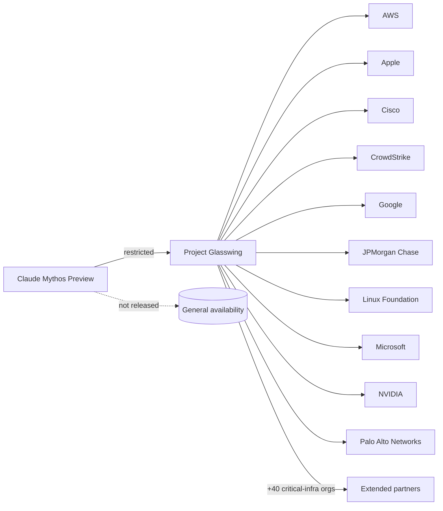
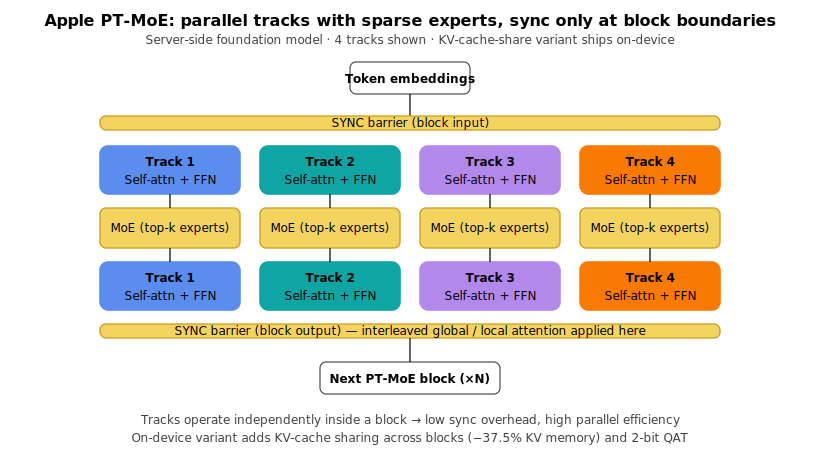
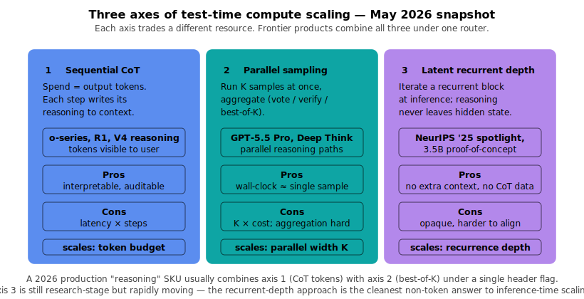
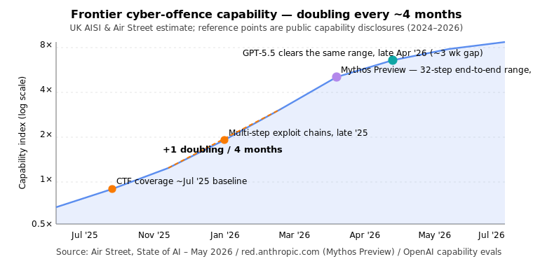

# LLM Updates — 2026-May-07

Mid-week brief, written Thursday May 7 (Los Angeles time), one day after
the May 6 report. The 24-hour news window is genuinely thin — the next
big inflection is **Google I/O 2026 on May 19–20** — so this brief
takes the chance to cover the *step-changes that landed in the last
30 days but haven't yet had room to breathe*: the official **NIST CAISI
evaluation of DeepSeek V4 Pro** as a numerical "frontier-gap"
benchmark, **Project Glasswing + Claude Mythos Preview** as the first
restricted-class frontier release, **Apple's Parallel-Track Mixture-of-Experts**
as the architectural next step beyond plain MoE, the **latent
recurrent-depth** line of work as a third axis of test-time compute,
and the **OpenAI Workspace Agents credit-pricing flip** that quietly
took effect May 6.

The headline items, ranked by how durable they're likely to look six
months from now:

1. **OpenAI Workspace Agents enter paid pricing** (May 6). Free
   research preview ended; credit-based pricing is now live for
   ChatGPT Business, Enterprise, Edu, and Teachers tiers. This is
   the moment the "agent at work" SKU stops being a free demo and
   starts producing per-task ROI math.
2. **NIST CAISI's DeepSeek V4 Pro evaluation** (May 3). First U.S.
   government evaluation to put a numerical lag on a frontier PRC
   model — *"about eight months"* — and the first to include
   **ARC-AGI-2** in a federal benchmark suite. Hallucination rate
   when uncertain is the headline practitioner risk: **94 %** on
   AA-Omniscience.
3. **Project Glasswing + Claude Mythos Preview** (Apr 7, with
   ongoing partner expansion). Anthropic's first **Restricted Use**
   frontier model — ten launch-partner industries, $100 M in usage
   credits, and a public capability disclosure naming a 27-year-old
   OpenBSD vuln. The category "frontier model the lab will not
   sell to the public" is now real.
4. **Apple's PT-MoE** (Apple Foundation Models tech report 2025 → May
   2025 updates referenced again at ICLR 2026). Parallel tracks of
   sparse MoE blocks that synchronise only at block boundaries — a
   meaningful step beyond expert-only sparsity, and a clean
   architectural answer to multi-track wafer-scale silicon.
5. **Latent recurrent-depth reasoning** (NeurIPS 2025 spotlight, code
   public). A 3.5 B proof-of-concept that scales test-time compute by
   iterating a recurrent block in latent space rather than emitting
   more CoT tokens — a third axis of inference-time scaling that
   doesn't appear on most product roadmaps.
6. **Air Street's State of AI: May 2026** (May 6). The cleanest
   single-page macro-read of the cycle. Headline: **frontier
   cyber-offence capability is doubling every ~4 months**, and
   *"China is six to nine months behind"* no longer holds for
   agentic coding.
7. **Gemma 4 under Apache 2.0** (Apr 2). Often missed in the
   April news cycle: Google's open-weights line dropped its custom
   "Gemma Terms" for a real OSS license, with native audio on small
   models and a 26 B MoE / 31 B Dense pair as the new top end.
8. **Gemini 3.2 Flash spotted in iOS + AI Studio** (May 5). Quiet
   surfacing two weeks before I/O 2026, leaked pricing
   ($0.25 / $2.00 per M tokens) significantly under the Pro tier,
   coding numbers reportedly above 3 Flash and near 3.1 Pro.
9. **Cloudflare's Infire inference engine** going public-document
   (May 5). Rust-based, 7 % faster than vLLM 0.10.0 with **82 % less
   CPU overhead** on the same GPU footprint — the cleanest production
   number for "vLLM is no longer the only optimised path."

Material already in the April 30 / May 1 / May 4 / May 6 reports — GPT-5.5
Instant routing, Mistral Medium 3.5 + Vibe, SubQ's 12 M context claim,
Apple's ParaRNN / Manzano / Mirror Speculative Decoding, Mamba-3 in
production, FlashAttention-4, world models as a peer layer — is referenced
briefly here where today's items intersect them, and is not re-derived.

---

## 1. Workspace Agents flip to paid pricing (May 6)

The single most-deployed change in the last 24 hours is operational, not
architectural: **OpenAI's Workspace Agents stopped being free**. The
research preview that opened in late April for ChatGPT Business,
Enterprise, Edu, and Teachers tiers transitioned to **credit-based
billing on May 6**. OpenAI hasn't disclosed credit cost or per-run
consumption; the practical signal is that every business-tier ChatGPT
seat ($20/mo and up) can now run an agent end-to-end across Slack,
Salesforce, Google Drive, Microsoft 365, and Notion connectors —
inside a per-tenant credit envelope (Source: [OpenAI — Introducing
Workspace Agents in ChatGPT](https://openai.com/index/introducing-workspace-agents-in-chatgpt/),
[VentureBeat](https://venturebeat.com/orchestration/openai-unveils-workspace-agents-a-successor-to-custom-gpts-for-enterprises-that-can-plug-directly-into-slack-salesforce-and-more), [Decrypt](https://decrypt.co/365220/openai-workspace-agents-feature-chatgpt)).

The architectural points worth holding onto:

- **Agents are Codex-powered, not chat-powered.** Workspace Agents
  inherit the Codex sandbox + tool stack, not the ChatGPT
  conversational stack. The implication is that the agent loop is the
  same one running 4M+ Codex developers, with enterprise connectors
  layered on top instead of a terminal harness ([source](https://www.bighatgroup.com/blog/codex-weekly-2026-04-24/)).
- **Templates ship with the launch.** Pre-built agent templates cover
  email triage, meeting follow-up, CRM update, and research
  summarisation. Templates are forkable per-tenant, which makes them a
  useful baseline to evaluate in-house agents against — closer to a
  reference implementation than a marketing demo.
- **Credit-based pricing changes the planning surface.** A credit
  envelope per seat means **per-agent budget caps become a first-class
  admin policy**, not an after-the-fact cost-control hack. This is the
  first frontier vendor to expose agent compute as a quota that admins
  can shape.

Practical read: if your enterprise rolled out workspace agents last
week to dozens of teams on the assumption that "preview = unmetered,"
**the May 6 cut-over is when the bills start.** Admin policy needs to
specify per-seat credit caps before the next billing cycle closes.

The broader pattern is that the May 2026 frontier vendor stack is
quietly converging on the same enterprise SKU shape:

| Vendor    | Agent surface             | Connectors live                                 | Memory                         |
| --------- | ------------------------- | ----------------------------------------------- | ------------------------------ |
| OpenAI    | Workspace Agents (Codex)  | Slack, Salesforce, M365, Drive, Notion          | per-thread, no cross-session   |
| Anthropic | Claude apps + Managed Agents | M365 (Excel/PPT/Word/Outlook), Moody's via MCP  | filesystem, **cross-session beta** |
| Google    | Gemini Workspace agents   | Workspace, Drive, Calendar, Docs, Vertex        | Project Memory (limited)       |
| Mistral   | Le Chat Work Mode + Vibe  | Email, Slack, Jira (preview)                    | per-session                    |

(Sources: [OpenAI](https://openai.com/index/introducing-workspace-agents-in-chatgpt/),
[Anthropic finance agents](https://www.anthropic.com/news/finance-agents),
[Build Fast With AI — Claude Managed Agents Memory](https://www.buildfastwithai.com/blogs/claude-managed-agents-memory-2026),
[Mistral / Vibe coverage](https://www.bighatgroup.com/blog/codex-weekly-2026-04-24/).)

---

## 2. NIST CAISI's DeepSeek V4 Pro evaluation: an official frontier-gap number

The May 3 NIST release ([CAISI Evaluation of DeepSeek V4 Pro](https://www.nist.gov/news-events/news/2026/05/caisi-evaluation-deepseek-v4-pro))
is the first U.S. government evaluation to put a single sentence on a
frontier PRC model: **"DeepSeek V4 Pro lags behind leading U.S. AI
models by approximately eight months."** Three things make this
durable beyond the headline:

**(a) ARC-AGI-2 in a federal benchmark suite.**
This is the first time the Center for AI Standards and Innovation has
included **ARC-AGI-2** as a reference benchmark for abstract
reasoning. The eval covered nine benchmarks across five domains —
cybersecurity, software engineering, natural sciences, abstract
reasoning, and mathematics — and ARC-AGI-2 anchored the
abstract-reasoning column ([Lauren Wagner / X](https://x.com/typewriters/status/2050376049171780038)).

**(b) Hallucination calibration is the practitioner risk, not raw capability.**
The capability gap is real but bounded: V4 Pro is described as the
**most capable PRC model evaluated to date**. The deployment-relevant
finding is the **94 % hallucination rate on AA-Omniscience when the
model is uncertain** — i.e., V4 Pro almost never says "I don't know,"
it answers ([TechFastForward](https://techfastforward.com/articles/nist-caisi-deepseek-v4-pro-8-months-us-frontier-benchmark-gap-2026),
[Digital Watch](https://dig.watch/updates/deepseek-v4-pro-caisi-us-nist-evaluation),
[Techmeme summary](https://www.techmeme.com/260503/p5)).
For production deployments where confidence calibration matters
(legal, medical, regulated finance), this is a more important number
than the eight-month gap.

**(c) Cost-per-capability still wins on the open-weight side.**
Independent reviews place V4 Pro at **near-frontier capability for
roughly one-seventh the inference cost** of the closed Western
frontier on common workloads ([AI2 Work review](https://ai2.work/blog/deepseek-v4-pro-delivers-near-frontier-performance-at-one-seventh-the-cost),
[Thomas Wiegold real-code review](https://thomas-wiegold.com/blog/deepseek-v4-review/)).
The CAISI framing is "behind on capability"; the operator framing
remains "ahead on $/quality."

Compatible with the longer-running pattern from the April 30 brief:
the Chinese open-weights coding stack — V4 Pro, GLM-5.1, Kimi K2.6,
MiniMax M2.7, Qwen 3.6 — is now serving customers in production at
~⅓ the cost of Opus 4.7-class models, and the *"China is six to nine
months behind"* framing for **agentic coding specifically** has stopped
holding (see §6, Air Street).

---

## 3. Project Glasswing + Claude Mythos Preview: the first Restricted Use frontier release

The most architecturally consequential release of April 2026 is the
one that *did not happen*: Anthropic announced **Claude Mythos
Preview** on April 7 alongside **Project Glasswing**, but **chose not
to ship it as a public model**. Mythos is described as a frontier
model so capable at finding and exploiting software vulnerabilities
that Anthropic considers it too risky for general availability
([Anthropic — Project Glasswing](https://www.anthropic.com/glasswing),
[red.anthropic.com — Claude Mythos Preview](https://red.anthropic.com/2026/mythos-preview/),
[Fortune coverage](https://fortune.com/2026/04/07/anthropic-claude-mythos-model-project-glasswing-cybersecurity/),
[InfoQ](https://www.infoq.com/news/2026/04/anthropic-claude-mythos/)).

The numbers Anthropic *has* published are concrete enough to act on:

- Mythos Preview discovered **thousands of zero-day vulnerabilities**
  across every major operating system, every major web browser, and a
  large set of widely-deployed open-source software, mostly with
  *no human steering*.
- It identified **a 27-year-old vulnerability in OpenBSD**, an OS
  with one of the strongest security-hardening reputations in the
  industry.
- It chained four independent bugs into a single end-to-end exploit
  that bypassed both browser-renderer and OS sandboxing.
- It built a **20-gadget ROP chain remote-code-execution exploit
  for FreeBSD's NFS server**, distributed across packets ([Anthropic glasswing](https://www.anthropic.com/glasswing),
  [The National](https://www.thenationalnews.com/news/us/2026/04/29/what-is-mythos-cybersecurity-vulnerabilities/)).

**Project Glasswing** is the deployment vehicle: rather than a public
release, Anthropic has invited a defender-side coalition — AWS,
Apple, Broadcom, Cisco, CrowdStrike, Google, JPMorgan Chase, the Linux
Foundation, Microsoft, NVIDIA, Palo Alto Networks — to use Mythos
Preview against critical infrastructure code, with Anthropic
contributing **$100 M in usage credits**. Access has since extended to
40+ additional organisations that maintain critical software
infrastructure ([Anthropic glasswing](https://www.anthropic.com/glasswing),
[HPCWire](https://www.hpcwire.com/aiwire/2026/04/09/anthropic-unveils-project-glasswing-as-claude-mythos-targets-software-vulnerabilities/),
[Forrester](https://www.forrester.com/blogs/project-glasswing-the-10-consequences-nobodys-writing-about-yet/)).

Why this matters beyond the headline:

- **A new SKU class.** Mythos Preview is the first publicly-acknowledged
  *Restricted Use frontier model*. The category — "trained, aligned,
  evaluated, and never sold to the public" — was previously a
  hypothetical in policy papers; Anthropic just made it a product
  fact. Future labs will need a position on it.
- **Defender-first asymmetry by deliberate design.** Anthropic is
  releasing the model only to organisations whose role is to *patch*,
  not exploit, on the bet that the dual-use math tilts the right way
  if defenders move first by months, not weeks. The Air Street May
  2026 framing of *"4-month doubling"* (§6) suggests that lead is
  measured in single-digit months at most.
- **GPT-5.5 cleared the same range three weeks later.** Air Street
  reports that the same 32-step end-to-end cyber-attack range Mythos
  Preview cleared was also cleared by GPT-5.5 about three weeks after
  Mythos. Frontier offensive capability is now a category, not a
  single-vendor anomaly ([Air Street State of AI: May 2026](https://press.airstreet.com/p/state-of-ai-may-2026)).

For practitioners: the **immediate take-away is on the eval side, not
the deployment side.** Internal red-team budgets should now include a
Mythos-class threat model — not because Mythos itself is reachable,
but because GPT-5.5 and the next round of Chinese open-weight coders
have published cyber-attack capability that requires a peer-class
defensive plan.

---

## 4. Apple PT-MoE: parallel tracks of sparse experts, sync only at block boundaries

The Apple Intelligence Foundation Models tech report 2025 ([Apple ML
research](https://machinelearning.apple.com/research/apple-foundation-models-tech-report-2025))
introduced **PT-MoE** — Parallel-Track Mixture-of-Experts — as the
production architecture for Apple's server-side foundation model.
The 2025 update plus April 2026 ICLR session attention have made
PT-MoE the cleanest deployed example of an architecture where
*model parallelism shape* and *expert sparsity* are orthogonal axes,
not stacked layers.

The shape:

The mechanics worth pulling out:

- **Tracks process tokens independently inside a block.** The model
  is split into multiple smaller transformers (tracks), each with its
  own self-attention + FFN + MoE stack. Synchronisation across
  tracks happens only at block input and block output boundaries.
- **Each track has its own MoE layer.** Sparsity is *per-track*, not
  shared across the model — so a routing decision on track 2 can't
  monopolise expert capacity that track 4 needs in the same step.
- **Sync barriers do the work classical MoE puts inside an
  all-to-all.** Because cross-track communication is amortised over
  the block, the classical MoE bottleneck — all-to-all expert routing
  every layer — is replaced by a coarser sync that's friendlier to
  multi-die / multi-host topology.
- **The on-device sibling adds KV-cache sharing.** Apple's ~3 B
  on-device model directly shares KV caches between non-adjacent
  blocks, cutting KV memory **37.5 %** and shrinking time-to-first-token
  (Source: [arXiv 2507.13575](https://arxiv.org/abs/2507.13575),
  [Fred Hohman summary](https://fredhohman.com/papers/afm-2025)).

**Why the architecture matters more than the benchmarks.** PT-MoE is
the cleanest deployed example of *track-parallelism as a first-class
axis* — not a tensor-parallelism shim over a single dense model.
Combined with the **2-bit quantisation-aware training** and
**interleaved global / local attention** Apple ships in the same
foundation-model stack, the design is well-matched to the multi-die,
multi-host accelerators that NVIDIA Blackwell-Ultra and Apple's M5 Ultra
both expose. Track-parallel layouts are also the natural shape for
hybrid GPU + NPU silicon, which is the same constraint Mirror
Speculative Decoding solves at the inference boundary (covered in the
May 6 brief, [Apple ML — Mirror](https://machinelearning.apple.com/research/mirror)).

Combined with the architectural shifts already in production — Mamba-2
sequence layers in Nemotron 3 Super (NVIDIA's hybrid Mamba-Transformer
MoE, 23 Mamba-2 layers + GQA + MoE, [VentureBeat](https://venturebeat.com/technology/nvidia-debuts-nemotron-3-with-hybrid-moe-and-mamba-transformer-to-drive),
[NVIDIA](https://developer.nvidia.com/blog/introducing-nemotron-3-super-an-open-hybrid-mamba-transformer-moe-for-agentic-reasoning/))
— the takeaway is that **"Transformer + softmax attention only"** is
no longer the dominant production architecture at the frontier.
Hybrid SSM-Transformer is shipping at NVIDIA scale; track-parallel
sparse experts are shipping at Apple scale; both will pull the
field forward through 2026.

---

## 5. Latent recurrent-depth: a third axis of test-time compute

Most product-side discussion of "thinking longer" reduces to two
axes: **more chain-of-thought tokens** (sequential test-time compute,
o-series / R1 / V4-reasoning) or **more parallel samples + verifier**
(GPT-5.5 Pro, Deep Think, Best-of-K). The NeurIPS 2025 spotlight
**"Scaling up Test-Time Compute with Latent Reasoning: A Recurrent
Depth Approach"** ([arXiv 2502.05171](https://arxiv.org/abs/2502.05171),
[OpenReview](https://openreview.net/forum?id=S3GhJooWIC),
[NeurIPS poster page](https://neurips.cc/virtual/2025/loc/san-diego/poster/117966))
is a clean third axis that almost no production roadmap names:

The architectural claim, in one paragraph: a transformer block is
wrapped as a *recurrent block*; at test time the block is iterated
*K* times in latent space before the token decoder runs. Reasoning
happens entirely in hidden state, never as text. The 3.5 B-parameter
proof-of-concept (trained on 800 B tokens) shows real gains on math
and code reasoning with additional test-time compute, **without**
specialised CoT training data and **without** a longer context window
(Source: [ResearchGate PDF abstract](https://www.researchgate.net/publication/388848202_Scaling_up_Test-Time_Compute_with_Latent_Reasoning_A_Recurrent_Depth_Approach),
[Sebastian Raschka — Beyond Standard LLMs](https://magazine.sebastianraschka.com/p/beyond-standard-llms)).

Implications worth thinking about:

- **The third axis composes with the other two.** Production reasoning
  models can in principle stack: K parallel samples × L latent depth
  steps × M emitted tokens. Most current deployments stack only the
  first and third (parallel × tokens). Latent-depth-as-an-axis is
  unexplored at frontier scale.
- **It captures reasoning that doesn't fit into words.** The
  practitioner intuition is that some kinds of search / planning have
  no natural token serialisation; latent recurrent depth lets a model
  spend compute on those without forcing them through a chain-of-thought
  bottleneck.
- **Alignment becomes harder, not easier.** An interpretable token
  CoT is what Anthropic's Mythos disclosures and NIST's V4 Pro
  evaluation rely on for safety inspection. A pure latent-depth model
  has no inspection surface analogous to "read the chain of thought."
  Expect this to slow adoption at the frontier even as it clears the
  capability bar.

A complementary line — *"Hybrid Latent Reasoning via Reinforcement
Learning"*, NeurIPS 2025 ([poster](https://neurips.cc/virtual/2025/poster/118535)) — and
*"System-1.5 Reasoning"* ([poster](https://neurips.cc/virtual/2025/poster/118475))
— suggest the field is converging on a hybrid: a small explicit-CoT
prefix that triggers a longer latent-reasoning core. That's the most
likely shape of a 2026 production reasoning SKU.

---

## 6. Air Street's State of AI: May 2026 — the macro read

The **State of AI: May 2026** brief from Air Street ([press.airstreet.com](https://press.airstreet.com/p/state-of-ai-may-2026))
landed on May 6 and is the cleanest single-page macro-read of the
cycle. The four numbers worth committing to memory:

**(a) Frontier cyber-offence is doubling every ~4 months.**
The headline metric Air Street pulls from the UK's AI Security Institute
is that **frontier cyber-offence capability is doubling every four
months**. Mythos Preview cleared a 32-step end-to-end cyber-attack
range first; GPT-5.5 cleared the same range about **three weeks
later**. The narrow gap between vendors at the frontier is now the
operating-policy frame for defenders.

**(b) Capital is concentrating at a previously-unseen scale.**
The May 2026 capital movements:
- **OpenAI** raised **$122 B at an $852 B valuation**, anchored by
  Amazon, NVIDIA, SoftBank, and Microsoft.
- **Anthropic** took **$40 B from Google** and **$5 B from Amazon**
  (packaged with **$100 B of AWS spend**), and signed chip deals
  with Google and Broadcom reportedly worth hundreds of billions.

The implication is that "frontier AI as an infrastructure business"
is no longer a metaphor — single-vendor capital flows are in the same
order of magnitude as hyperscaler CapEx.

**(c) "China is 6–9 months behind" is no longer true for agentic coding.**
Air Street's framing matches the NIST CAISI eval (§2): the lag is
real on aggregate cross-domain benchmarks, but for **agentic coding
specifically**, GLM-5.1, Kimi K2.6, MiniMax M2.7, and DeepSeek V4 are
inside the Western frontier's capability envelope at meaningfully
lower cost ([BenchLM Chinese leaderboard](https://benchlm.ai/blog/posts/best-chinese-llm),
[Atlas Cloud comparison](https://www.atlascloud.ai/blog/guides/kimi-k2-6-vs-glm-5-1-vs-qwen-3-6-plus-vs-minimax-m2-7-coding-2026)).

**(d) Bio + embodied are the next deployment beachheads.**
Profluent's $2.25 B partnership with Lilly for **large-gene insertion
therapeutics** and Sereact's $110 M Series B in **embodied AI** are
flagged as the two non-LLM frontiers absorbing the most capital this
quarter. Both are "frontier-AI in non-text domains" stories — relevant
because they pull GPU supply and engineering talent away from the
text-LLM stack.

---

## 7. Gemma 4 — Apache 2.0 finally arrives for Google open weights

Quietly released April 2 and only fully digested in the past two
weeks: **Gemma 4** moves Google's open-weights line from the custom
"Gemma Terms of Use" to a real **Apache 2.0** license. For enterprise
legal review, this is the single largest unblock of 2026 Q2 ([blog.google
— Gemma 4](https://blog.google/innovation-and-ai/technology/developers-tools/gemma-4/),
[InfoQ](https://www.infoq.com/news/2026/04/google-gemm4/),
[Codersera guide](https://codersera.com/blog/gemma-4-complete-guide-2026/),
[Cloud Blog](https://cloud.google.com/blog/products/ai-machine-learning/gemma-4-available-on-google-cloud)).

The model line-up and shape:

| Variant     | Params (active) | Type   | Notable                                     |
| ----------- | --------------- | ------ | ------------------------------------------- |
| Gemma 4 2B  | 2B              | Dense  | On-device target; native audio in           |
| Gemma 4 4B  | 4B              | Dense  | On-device, native audio in                  |
| Gemma 4 26B | 26B (3.8B active) | MoE  | Latency-tier, single 80 GB H100             |
| Gemma 4 31B | 31B             | Dense  | Quality-tier, single 80 GB H100             |

(Sources: [labellerr](https://www.labellerr.com/blog/gemma-4-open-weight-ai-model-overview/),
[mindstudio](https://www.mindstudio.ai/blog/what-is-gemma-4-google-apache-open-weight-model),
[ai.google.dev — Gemma 4 overview](https://ai.google.dev/gemma/docs/core).)

Three details that make Gemma 4 the most practical open-weight
download of Q2 2026:

- **Multimodal input on small models.** The 2B and 4B variants accept
  **native audio** in addition to text and image — making them the
  first Apache-2.0-licensed audio-in models at this size.
- **256 K context as a base feature, not a long-context SKU.** The
  context window is uniform across the line; there is no separate
  "long-context Gemma 4."
- **The MoE / Dense pair at the same size is a design statement.**
  The 26 B MoE (3.8 B active) and 31 B Dense are explicitly positioned
  as a *latency vs. quality* choice on the same H100 footprint. The
  open-weights field finally has a within-family A/B pair to evaluate.

For practitioners replacing Llama 3 / Llama 4 fine-tunes that are
blocked by license review, Gemma 4 31 B Dense is now the strongest
*permissive-license* option in the open ecosystem.

---

## 8. Gemini 3.2 Flash spotted ahead of I/O 2026 (May 5)

On May 5, **Gemini 3.2 Flash** quietly appeared inside the iOS
Gemini app and AI Studio metadata — no press release, no keynote ([Build
Fast With AI](https://www.buildfastwithai.com/blogs/gemini-3-2-flash-release-2026),
[geeky-gadgets](https://www.geeky-gadgets.com/google-gemini-flash-leak-lm-arena/),
[Let's Data Science](https://letsdatascience.com/news/google-spots-gemini-32-flash-naming-strategy-shifts-84dcf430),
[NPowerUser](https://nokiapoweruser.com/gemini-3-2-flash-ios-app-leak/)).

The leaked specifics that matter:

- **Coding above Gemini 3 Flash, near or at Gemini 3.1 Pro** on community
  benchmarks.
- **Leaked pricing:** **$0.25 / $2.00 per M tokens** (input/output) —
  significantly under the Pro tier and competitive with Gemma 4 hosted
  pricing.
- **Most likely formal reveal: Google I/O 2026, May 19–20**
  ([Google I/O 2026](https://io.google/2026/)).

The strategic read is that Google is positioning the Flash tier as the
*default* coding model — one tier down in price, within reach of Pro
on coding workloads, deployed before competitors get their Pro-tier
discount cycles in. If the leaked pricing holds, Gemini 3.2 Flash will
be the cheapest production-grade coding model from a Western frontier
vendor.

For routing tables: hold the migration until I/O reveals the formal
context window, function-calling shape, and agent integration. The
leaks describe a model, not an SDK.

---

## 9. Cloudflare Infire: the cleanest production "vLLM is not the only path" number

The detail-deep Cloudflare engineering post ([Cloudflare blog —
how we built the most efficient inference engine](https://blog.cloudflare.com/cloudflares-most-efficient-ai-inference-engine/),
[InfoQ summary](https://www.infoq.com/news/2026/05/cloudflare-llm-infrastructure/),
[high-performance LLMs follow-up](https://blog.cloudflare.com/high-performance-llms/))
made the rounds again on May 5–6 because it includes the cleanest
production-scale comparison number we have for a non-vLLM serving
stack:

> **Infire is 7 % faster than vLLM 0.10.0 on unloaded machines and
> uses ~25 % CPU vs. vLLM's >140 % — an 82 % CPU-overhead reduction.**

The architectural points:

- **Rust, not Python.** Infire is written in Rust end-to-end, which is
  what enables the CPU-overhead reduction; Python's GIL is a real cost
  at the request-routing tier even with an async runtime.
- **Multi-GPU with explicit policy choice.** Pipeline-parallel,
  tensor-parallel, and expert-parallel are all first-class deployment
  modes.
- **It's not open source.** Infire is internal to Cloudflare's Workers
  AI platform. The 7 % / 82 % number is the *target* the open-source
  inference stack now has to match.

Combined with **FlashAttention-4** (covered in the May 1 brief),
**EAGLE3 / Mirror Speculative Decoding** (May 6), and the **FP4
training** path that NVIDIA Nemotron 3 Super demonstrated at frontier
scale, the inference-side improvement axes of 2026 — kernel,
quantisation, decoding speculation, runtime — are all moving
simultaneously. The composite practitioner gain is now best measured
in *2–5× wall-clock at iso-quality*, not single-axis percentages.

---

## 10. NVIDIA Nemotron 3 — hybrid Mamba-Transformer at production scale

For completeness, a closer look at the architecture that's already
shipping at the largest scale of any non-pure-Transformer frontier
model, **Nemotron 3 Super 120 B** ([NVIDIA — Nemotron 3 Super](https://developer.nvidia.com/blog/introducing-nemotron-3-super-an-open-hybrid-mamba-transformer-moe-for-agentic-reasoning/),
[VentureBeat](https://venturebeat.com/technology/nvidia-debuts-nemotron-3-with-hybrid-moe-and-mamba-transformer-to-drive),
[Stellitron Nemotron 3 Nano review](https://stellitron.com/blog/nemotron-3-nano-analysis),
[Educative — what Nemotron 3 reveals](https://www.educative.io/newsletter/artificial-intelligence/nvidia-nemotron3)):

- **23 Mamba-2 layers interleaved with GQA Transformer attention layers
  and MoE.** Mamba-2 carries the bulk of sequence processing; attention
  is preserved at key depths to keep precise associative recall (the
  "needle in haystack" property).
- **First open model natively pre-trained in 4-bit (NVFP4) at 120 B
  scale.** The combination of FP4 training + hybrid SSM/attention is
  the single biggest mid-stack architectural update of 2026 Q1.
- **The line ships in three tiers:** Nemotron 3 Nano (30 B, edge),
  Super (~100 B, multi-agent), and Ultra (~500 B, deep reasoning).

Read alongside Apple's PT-MoE (§4): the production frontier in 2026
is no longer a homogeneous stack of softmax-attention transformer
blocks. The two largest deployed non-pure-Transformer models —
Nemotron 3 Super and the Apple foundation server model — both bet on
*hybrid* designs, with sparsity and recurrence mixed at the layer
level rather than swapped wholesale.

---

## 11. What's worth tracking through May 19 (Google I/O 2026)

For teams operating production LLM stacks, the 11 days between this
brief and Google I/O 2026 are about getting ready for the next news
window without over-committing.

**Procurement / billing**
- If your org rolled out OpenAI Workspace Agents in the late-April
  preview, **set per-seat credit caps before next billing cycle**.
  The May 6 cut-over makes admin-side budget policy a hard prerequisite,
  not a nice-to-have.
- If you're on a paid Anthropic financial-services template, the
  **Memory beta** still requires the `managed-agents-2026-04-01`
  header — audit the 100 KB / file behaviour against retention policy.

**Architecture**
- Prefer **Gemma 4 31 B Dense** as the new open-weights baseline if
  you need permissive licensing. The Apache 2.0 move makes it the
  cleanest first-party Google option.
- For non-attention-only architectures, the production picks are
  **Nemotron 3 Super (hybrid Mamba-Transformer + MoE)** and Apple's
  **PT-MoE** server foundation model. Both are real, both ship.
- Keep **latent recurrent-depth** on the research watchlist; it's the
  third axis of test-time compute and the cleanest non-token answer
  to inference-time scaling.

**Eval / safety**
- Add **AA-Omniscience hallucination-when-uncertain** to your domain
  eval. NIST CAISI's 94 % number on V4 Pro is the calibrated point at
  the open-weight frontier, and any Western-frontier swap should
  beat it materially.
- Add an **ARC-AGI-2** column to abstract-reasoning evals if you
  haven't. CAISI's inclusion is the federal signal that this is the
  reference benchmark for the rest of 2026.
- Run a **Mythos-class** internal red-team on the assumption that a
  GPT-5.5 / Mythos-tier offensive capability is reachable to motivated
  threat actors within months, not years (Air Street's 4-month
  doubling).

**Inference**
- The combined 2–5× wall-clock gain over a Q4 2025 vLLM baseline is
  realistic if you compose **FA-4 + EAGLE3/Mirror-SD + FP4** — track
  the open-source equivalents of Cloudflare Infire's 82 % CPU
  reduction as they appear.

---

## Sources

OpenAI Workspace Agents
- [OpenAI — Introducing Workspace Agents in ChatGPT](https://openai.com/index/introducing-workspace-agents-in-chatgpt/)
- [VentureBeat — OpenAI unveils Workspace Agents](https://venturebeat.com/orchestration/openai-unveils-workspace-agents-a-successor-to-custom-gpts-for-enterprises-that-can-plug-directly-into-slack-salesforce-and-more)
- [Decrypt — OpenAI launches Workspace Agents](https://decrypt.co/365220/openai-workspace-agents-feature-chatgpt)
- [OpenAI Academy — Workspace agents](https://openai.com/academy/workspace-agents/)
- [Big Hat Group — Codex Weekly 2026-04-24](https://www.bighatgroup.com/blog/codex-weekly-2026-04-24/)
- [Marketing Code — Workspace Agents survival guide](https://www.marketingcode.com/chatgpt-workspace-agents-contractor-industry-shift-may-2026/)
- [Releasebot — OpenAI updates May 2026](https://releasebot.io/updates/openai)

NIST CAISI / DeepSeek V4 Pro
- [NIST — CAISI Evaluation of DeepSeek V4 Pro](https://www.nist.gov/news-events/news/2026/05/caisi-evaluation-deepseek-v4-pro)
- [Digital Watch — DeepSeek V4 trails US frontier by 8 months](https://dig.watch/updates/deepseek-v4-pro-caisi-us-nist-evaluation)
- [TechFastForward — NIST CAISI deep-dive](https://techfastforward.com/articles/nist-caisi-deepseek-v4-pro-8-months-us-frontier-benchmark-gap-2026)
- [The Weather Report — CAISI DeepSeek V4 Pro](https://theweatherreport.ai/posts/caisi-deepseek-v4-pro/)
- [AI2 Work — DeepSeek V4 Pro near-frontier at 1/7 cost](https://ai2.work/blog/deepseek-v4-pro-delivers-near-frontier-performance-at-one-seventh-the-cost)
- [Thomas Wiegold — DeepSeek V4 real-code review](https://thomas-wiegold.com/blog/deepseek-v4-review/)
- [Techmeme — CAISI summary](https://www.techmeme.com/260503/p5)
- [Lauren Wagner / X — first ARC-AGI-2 inclusion in CAISI](https://x.com/typewriters/status/2050376049171780038)

Anthropic / Mythos / Project Glasswing
- [Anthropic — Project Glasswing](https://www.anthropic.com/glasswing)
- [Anthropic — Project Glasswing (project page)](https://www.anthropic.com/project/glasswing)
- [red.anthropic.com — Claude Mythos Preview](https://red.anthropic.com/2026/mythos-preview/)
- [Fortune — Anthropic gives firms early access to Mythos](https://fortune.com/2026/04/07/anthropic-claude-mythos-model-project-glasswing-cybersecurity/)
- [Fortune — Mythos data leak coverage](https://fortune.com/2026/03/26/anthropic-says-testing-mythos-powerful-new-ai-model-after-data-leak-reveals-its-existence-step-change-in-capabilities/)
- [InfoQ — Claude Mythos preview, withholding public access](https://www.infoq.com/news/2026/04/anthropic-claude-mythos/)
- [HPCWire — Project Glasswing announcement](https://www.hpcwire.com/aiwire/2026/04/09/anthropic-unveils-project-glasswing-as-claude-mythos-targets-software-vulnerabilities/)
- [The National — what is Mythos?](https://www.thenationalnews.com/news/us/2026/04/29/what-is-mythos-cybersecurity-vulnerabilities/)
- [WEF — Mythos and AI cybersecurity](https://www.weforum.org/stories/2026/04/anthropic-mythos-ai-cybersecurity/)
- [Forrester — 10 consequences of Glasswing](https://www.forrester.com/blogs/project-glasswing-the-10-consequences-nobodys-writing-about-yet/)
- [Arctic Wolf — Glasswing turning point for cyber](https://arcticwolf.com/resources/blog/project-glasswing-marks-a-turning-point-for-cybersecurity/)
- [CETaS — Mythos and the future of cybersecurity](https://cetas.turing.ac.uk/publications/claude-mythos-future-cybersecurity)
- [The Zvi — Mythos #2 (Glasswing)](https://thezvi.substack.com/p/claude-mythos-2-cybersecurity-and)
- [SiliconANGLE — unauthorized access investigation](https://siliconangle.com/2026/04/22/anthropic-investigates-unauthorized-access-restricted-claude-mythos-ai-model/)
- [CNBC — Pentagon stance on Mythos](https://www.cnbc.com/2026/05/01/pentagon-anthropic-blacklist-mythos-michael.html)

Apple PT-MoE
- [Apple ML — Apple Foundation Models tech report 2025](https://machinelearning.apple.com/research/apple-foundation-models-tech-report-2025)
- [Apple ML — On-device & server foundation language model updates](https://machinelearning.apple.com/research/apple-foundation-models-2025-updates)
- [arXiv 2507.13575 — Apple Intelligence Foundation Models tech report](https://arxiv.org/abs/2507.13575)
- [Fred Hohman — AFM 2025 paper page](https://fredhohman.com/papers/afm-2025)
- [Royfactory — AFM 2025 architecture overview](https://royfactory.net/posts/ai/202512/apple-intelligence-tech-report-2025/)
- [Libertify — Apple Intelligence Foundation Models 2025 explained](https://www.libertify.com/interactive-library/apple-intelligence-foundation-models-2025/)

Latent reasoning / test-time compute
- [arXiv 2502.05171 — Scaling up Test-Time Compute with Latent Reasoning](https://arxiv.org/abs/2502.05171)
- [OpenReview — Recurrent depth approach](https://openreview.net/forum?id=S3GhJooWIC)
- [NeurIPS 2025 poster](https://neurips.cc/virtual/2025/loc/san-diego/poster/117966)
- [NeurIPS 2025 — Hybrid Latent Reasoning via RL](https://neurips.cc/virtual/2025/poster/118535)
- [NeurIPS 2025 — System-1.5 Reasoning](https://neurips.cc/virtual/2025/poster/118475)
- [arXiv 2512.02008 — The Art of Scaling Test-Time Compute for LLMs](https://arxiv.org/abs/2512.02008)
- [Awesome-Inference-Time-Scaling repo](https://github.com/ThreeSR/Awesome-Inference-Time-Scaling)
- [Sebastian Raschka — Beyond Standard LLMs](https://magazine.sebastianraschka.com/p/beyond-standard-llms)

Air Street / macro
- [Air Street — State of AI: May 2026](https://press.airstreet.com/p/state-of-ai-may-2026)
- [Air Street — AI progress after 2025](https://press.airstreet.com/p/ai-progress-after-2025)
- [Stanford HAI — AI Index 2026 takeaways](https://hai.stanford.edu/news/inside-the-ai-index-12-takeaways-from-the-2026-report)
- [State of AI Report 2025](https://www.stateof.ai/)

Gemma 4
- [Google blog — Gemma 4](https://blog.google/innovation-and-ai/technology/developers-tools/gemma-4/)
- [InfoQ — Gemma 4 under Apache 2.0](https://www.infoq.com/news/2026/04/google-gemm4/)
- [Codersera — Gemma 4 complete guide 2026](https://codersera.com/blog/gemma-4-complete-guide-2026/)
- [Cloud Blog — Gemma 4 on Google Cloud](https://cloud.google.com/blog/products/ai-machine-learning/gemma-4-available-on-google-cloud)
- [ai.google.dev — Gemma 4 model overview](https://ai.google.dev/gemma/docs/core)
- [Labellerr — Gemma 4 technical overview](https://www.labellerr.com/blog/gemma-4-open-weight-ai-model-overview/)
- [MindStudio — Gemma 4 explained](https://www.mindstudio.ai/blog/what-is-gemma-4-google-apache-open-weight-model)

Gemini 3.2 Flash
- [Build Fast With AI — Gemini 3.2 Flash before I/O 2026](https://www.buildfastwithai.com/blogs/gemini-3-2-flash-release-2026)
- [Geeky Gadgets — unreleased Gemini 3.2 Flash surfaces](https://www.geeky-gadgets.com/google-gemini-flash-leak-lm-arena/)
- [Let's Data Science — Gemini 3.2 Flash spotted](https://letsdatascience.com/news/google-spots-gemini-32-flash-naming-strategy-shifts-84dcf430)
- [NPowerUser — leaked iOS app build](https://nokiapoweruser.com/gemini-3-2-flash-ios-app-leak/)
- [Pasquale Pillitteri — leak in iOS / AI Studio](https://pasqualepillitteri.it/en/news/2013/gemini-3-2-flash-leak-ios-ai-studio-2026-en)
- [io.google/2026 — Google I/O 2026 page](https://io.google/2026/)
- [TestingCatalog — Flash model upgrades](https://www.testingcatalog.com/google-prepares-new-upgrades-for-gemini-flash-model/)

Cloudflare Infire
- [Cloudflare blog — most efficient AI inference engine](https://blog.cloudflare.com/cloudflares-most-efficient-ai-inference-engine/)
- [Cloudflare blog — high-performance LLMs](https://blog.cloudflare.com/high-performance-llms/)
- [Cloudflare blog — Workers AI large models](https://blog.cloudflare.com/workers-ai-large-models/)
- [InfoQ — Cloudflare LLM infrastructure](https://www.infoq.com/news/2026/05/cloudflare-llm-infrastructure/)
- [MarkTechPost — Cloudflare Agents SDK v0.5.0 + Infire](https://www.marktechpost.com/2026/02/17/cloudflare-releases-agents-sdk-v0-5-0-with-rewritten-cloudflare-ai-chat-and-new-rust-powered-infire-engine-for-optimized-edge-inference-performance/)
- [Forge / Ataraxy-Labs — Infire-inspired Candle engine](https://github.com/Ataraxy-Labs/forge)

NVIDIA Nemotron 3
- [NVIDIA — Introducing Nemotron 3 Super](https://developer.nvidia.com/blog/introducing-nemotron-3-super-an-open-hybrid-mamba-transformer-moe-for-agentic-reasoning/)
- [VentureBeat — Nemotron 3 hybrid MoE / Mamba-Transformer](https://venturebeat.com/technology/nvidia-debuts-nemotron-3-with-hybrid-moe-and-mamba-transformer-to-drive)
- [Stellitron — Nemotron 3 Nano analysis](https://stellitron.com/blog/nemotron-3-nano-analysis)
- [Skrew News — Nemotron 3 Nano 4B for edge](https://news.skrew.ai/nvidia-nemotron-3-nano-4b-hybrid-architecture-edge-ai/)
- [Educative — What Nemotron 3 reveals](https://www.educative.io/newsletter/artificial-intelligence/nvidia-nemotron3)

Chinese open-weights frontier
- [BenchLM — Best Chinese LLMs in 2026](https://benchlm.ai/blog/posts/best-chinese-llm)
- [Atlas Cloud — Kimi K2.6 vs GLM-5.1 vs Qwen 3.6 vs MiniMax M2.7](https://www.atlascloud.ai/blog/guides/kimi-k2-6-vs-glm-5-1-vs-qwen-3-6-plus-vs-minimax-m2-7-coding-2026)
- [DEV — Late-April 2026 Chinese LLM stack](https://dev.to/bean_bean/the-late-april-2026-chinese-llm-stack-qwen-36-deepseek-v4plus-kimi-k26-minimax-m27-glm-51-2bif)
- [BentoML — Open-source LLMs 2026](https://www.bentoml.com/blog/navigating-the-world-of-open-source-large-language-models)
- [MyWrittenWord — open-weight LLM rankings April 2026](https://mywrittenword.com/2026/04/26/open-source-llm-rankings-april-2026-deepseek-qwen-glm-kimi-benchmarks/)
- [AkitaOnRails — LLM coding benchmark April 2026](https://akitaonrails.com/en/2026/04/24/llm-benchmarks-parte-3-deepseek-kimi-mimo/)
- [MerchMind — Why China's open-model pace is slowing](https://merchmindai.net/blog/en/post/glm-5-1-minimax-m2-7-open-model-shift)
- [Latent Space — MiniMax 2.7 newsletter](https://www.latent.space/p/ainews-minimax-27-glm-5-at-13-cost)

Survey / reference
- [arXiv — Efficient Attention Mechanisms for LLMs (survey)](https://arxiv.org/abs/2507.19595)
- [Attention-Survey site](https://attention-survey.github.io/)
- [llm-stats.com — LLM news May 2026](https://llm-stats.com/ai-news)
- [llm-stats.com — latest model releases](https://llm-stats.com/llm-updates)
- [Price Per Token — model releases last 24 hours](https://pricepertoken.com/news/model-releases)
- [DeepLearning.AI — The Batch issue 351](https://www.deeplearning.ai/the-batch/issue-351/)
- [Knolli — Small Language Models 2026](https://www.knolli.ai/post/small-language-models)
