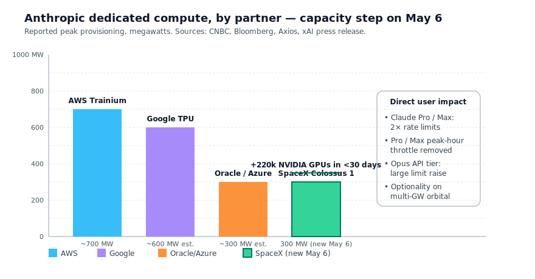
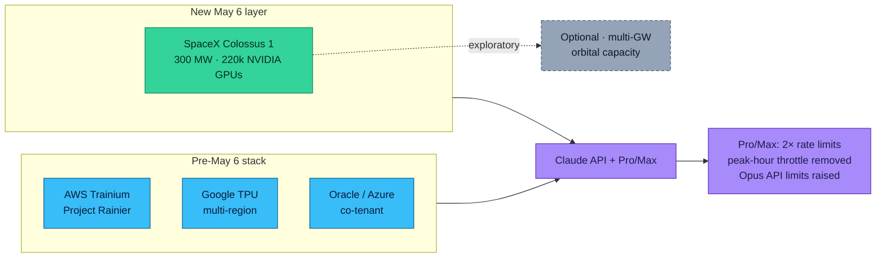
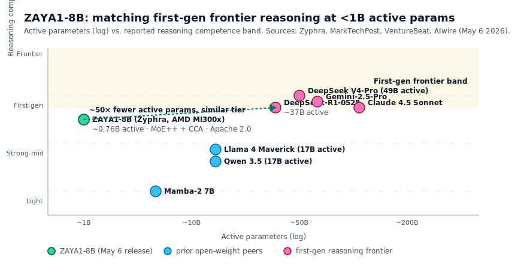
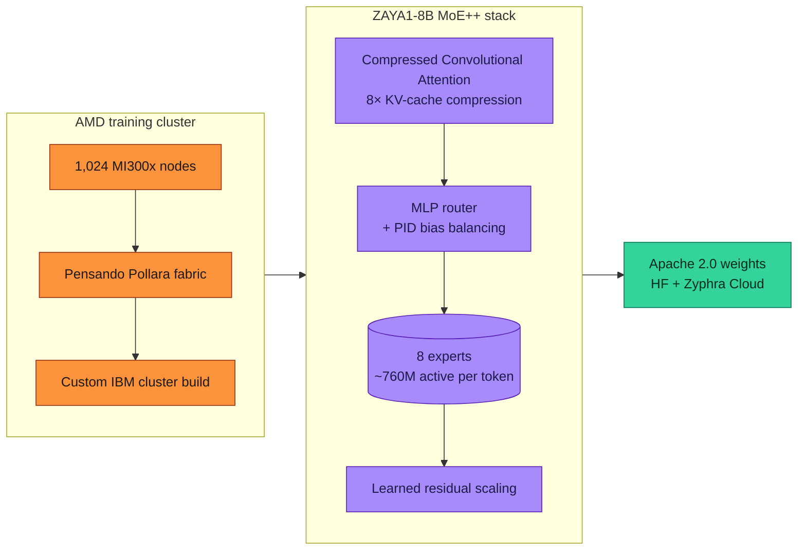
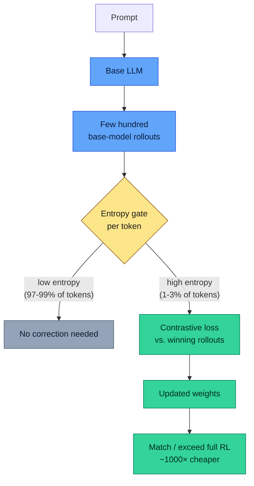

# LLM Updates — 2026-May-08

End-of-week brief, written Friday May 8 (Los Angeles time). The May 6
report covered the GPT-5.5 Instant default-tier flip, Anthropic's
Claude-for-Finance verticalization, SubQ's 12M-context claim, Apple's
ICLR 2026 architecture trifecta, and the iOS 27 multi-provider rumor.
The 48 hours since have been **infrastructure, voice, and efficiency**,
not new flagship releases:

1. **Anthropic × SpaceX Colossus 1** (May 6 evening) — Anthropic
   secured the entire >300 MW / ~220k-NVIDIA-GPU footprint of SpaceX's
   Memphis data center, doubled Pro/Max rate limits, removed peak-hour
   throttles, and signaled interest in *orbital* multi-GW capacity. The
   most material capacity story of 2026 to date.
2. **OpenAI Realtime-2 + Translate + Whisper** (May 7) — three new
   audio-native models in the API. GPT-Realtime-2 is the first
   GPT-5-class voice model, 128K context, parallel tool calls, and
   audible mid-response narration. Translate covers 70 → 13 languages
   live; Whisper streams transcription as the speaker talks.
3. **OpenAI ChatGPT product surface (May 7)** — three coordinated
   moves: **Trusted Contact** opt-in safety alerts, **CPC bidding
   + self-serve Ads Manager** for ChatGPT ads, and a **$4B raise to
   spin up "The Deployment Company"** to acquire AI-services firms.
4. **Zyphra ZAYA1-8B** (May 6) — Apache-2.0 reasoning MoE with
   <1B active parameters, trained end-to-end on 1,024 AMD MI300x
   nodes via Pollara interconnect, hitting first-generation frontier
   reasoning (DeepSeek-R1-0528 / Gemini 2.5 Pro / Claude 4.5 Sonnet
   tier) on math. The architecture introduces **Compressed
   Convolutional Attention** (8× KV-cache compression) and a
   PID-stabilized MLP router.
5. **ReasonMaxxer / sparse policy selection** (arXiv, May 7) —
   Akgül et al. show that RL post-training on math reasoning is a
   *1–3%-of-tokens* correction concentrated at high-entropy decision
   points, and that a few hundred base-model rollouts plus a
   contrastive loss at those points (no online RL) match full RL
   performance, ~1000× cheaper.
6. **ServiceNow × Anthropic re-up** (May 7) — Claude is now the
   *default* Build Agent model on the ServiceNow AI Platform, paired
   with Action Fabric's MCP server going GA. Plus Cognizant's
   Secure AI Services and Perplexity's Finance Search-in-API round
   out the agent-governance and finance-tooling layer.
7. **iOS 27 Extensions confirmed for WWDC** (June 8–12) — what was
   a Bloomberg rumor on May 6 has firmed into multiple-source
   reporting that iOS 27 / iPadOS 27 / macOS 27 will let users pick
   Claude / Gemini / ChatGPT (and likely Grok) per Siri, Writing
   Tools, and Image Playground feature.

Items already covered in the April 30 / May 1 / May 4 / May 6 briefs —
GPT-5.5 Instant default rollout, Claude for Finance × M365 + Moody's,
SubQ 12M context, Apple ParaRNN/Manzano/Mirror-SD, Mistral Medium 3.5,
NIST CAISI's DeepSeek V4-Pro evaluation, FlashAttention-4, Mamba-3,
DLM, Genie 3 / world models — are referenced briefly here where the
May 7–8 news intersects them, and not re-derived.

---

## 1. Anthropic × SpaceX Colossus 1: the capacity step

The most consequential announcement since the May 6 brief is
**Anthropic taking the full capacity of SpaceX's Colossus 1 data
center in Memphis** ([CNBC](https://www.cnbc.com/2026/05/06/anthropic-spacex-data-center-capacity.html),
[Bloomberg](https://www.bloomberg.com/news/articles/2026-05-06/anthropic-inks-computing-deal-with-spacex-to-meet-ai-demand),
[Axios](https://www.axios.com/2026/05/06/anthropic-spacex-elon-musk-compute),
[xAI press release](https://x.ai/news/anthropic-compute-partnership),
[Capacity](https://capacityglobal.com/news/anthropic-secures-full-capacity-of-spacex-data-centre/)).

The headline figures:

| Item                                   | Value                            |
| -------------------------------------- | -------------------------------- |
| Capacity secured                       | **>300 MW**                      |
| GPU count (NVIDIA, mostly H200/B200)   | **~220,000**                     |
| Time to bring online                   | **<30 days**                     |
| Pro / Max rate-limit change            | **2×** + peak-hour throttle gone |
| Opus API rate-limit change             | sharp upward step                |
| Forward signal                         | Anthropic-SpaceX **multi-GW orbital** capacity exploration |

Three operationally interesting things about the deal beyond the
megawatts:

**(a) Anthropic is now polyglot on hardware.** Through 2025 Anthropic's
production stack split between AWS Trainium (Project Rainier) and
Google TPU. With Colossus 1 it adds an **NVIDIA H200/B200 fleet at
hyperscaler scale** as a third leg. The strategic read is the same
one that has driven every capacity move at this lab: **buy
optionality, not tonnage**. Anthropic wants to be able to route
training and serving across silicon vendors.

**(b) The deal is structured as Anthropic-rents-everything, not
xAI-rents-some.** Colossus 1 was originally built for Grok training.
The deal signs over the *entire* facility's compute output to
Anthropic, with xAI keeping operational responsibility. xAI
positions this as data-center revenue diversification; Anthropic
positions it as latency-routable serving capacity for Pro / Max /
Opus API.

**(c) Orbital compute is named explicitly.** Anthropic's release
language references "interest in working with SpaceX to develop
multiple gigawatts of compute capacity in space." This is the first
time a frontier lab has put orbital data-center scale on the public
record. Treat it as an *option*, not a roadmap — but the option
matters because it's the only frontier lab move on a power source
that doesn't compete with terrestrial grid build-out.

The rate-limit knock-on hit production users **the same week**: Pro
and Max plans had peak-hour throttles removed and rate caps doubled,
and Opus API tier limits were raised. For teams running Claude Code
or Claude-as-coding-agent in CI, this is the first time in 2026 that
the rate-limit headroom got *better*, not stricter, on an Anthropic
release rhythm ([Releasebot](https://releasebot.io/updates/anthropic)).





---

## 2. OpenAI's voice frontier: GPT-Realtime-2 + Translate + Whisper

Voice is the one product surface where OpenAI has consistently led
through 2025 / 2026, and on **May 7** OpenAI published three new
audio models in the API that materially extend the lead
([OpenAI blog](https://openai.com/index/advancing-voice-intelligence-with-new-models-in-the-api/),
[9to5Mac](https://9to5mac.com/2026/05/07/openai-has-new-voice-models-that-reason-translate-and-transcribe-as-you-speak/),
[Latent Space AINews](https://www.latent.space/p/ainews-gpt-realtime-2-translate-and),
[Neowin](https://www.neowin.net/news/openai-unveils-trio-of-realtime-audio-models-to-power-next-gen-voice-agents/)).

| Model                  | Job                                       | Headline spec                                  | Pricing                          |
| ---------------------- | ----------------------------------------- | ---------------------------------------------- | -------------------------------- |
| **gpt-realtime-2**     | Live conversational reasoning + tool use  | GPT-5-class reasoning · 128K ctx · multi-tool  | $32 / $64 per 1M audio tokens (cached input $0.40) |
| **gpt-realtime-translate** | Live S2S translation                  | 70 input langs → 13 output langs               | $0.034 / minute                  |
| **gpt-realtime-whisper**   | Streaming live transcription          | per-utterance partials, sub-second latency     | $0.017 / minute                  |

Three things make the **Realtime-2** drop architecturally
significant rather than incremental:

**(a) "Reason while talking" is now first-class.** Realtime-2 can
emit short audible fillers ("checking your calendar...", "let me
look that up...") while it is still composing the substantive
response. The previous voice generation made the user wait silently
through reasoning latency. The new model separates *reasoning
latency* from *acoustic latency*, which is the right architectural
move for any telephony-grade voice agent.

**(b) Multi-tool calls in parallel, with audible narration of each.**
Where Realtime-1 serialized tool calls and went silent during
each, Realtime-2 issues the calls in parallel and narrates them as
they fly. Combined with the 128K context window (up from 32K), this
is the first voice API where you can run an *agent loop* — not a
single Q&A — without the conversation feeling staged.

**(c) Failure modes are now graceful.** Realtime-2 will say "I'm
having trouble with that right now, can we try again?" when a
tool call errors, instead of falling silent. This is small but
matters operationally: every voice production deployment has had
to write fallback prompts to recover from silence; Realtime-2
handles it natively.

The pricing is the headline read. **GPT-Realtime-2 at $32 / $64 per
1M audio tokens** vs. Realtime-1's $40 / $80 is a ~20% cut on a
materially better model, and the cached-input rate of **$0.40 / 1M**
is 80× cheaper than non-cached input — which is the rate that
matters once a voice agent is in steady-state with a long-lived
session. Translate at $0.034/min and Whisper at $0.017/min undercut
the previous specialist endpoints (Realtime-Whisper-v2 was $0.024/min)
and will collapse the licensed-translation business model where
that hasn't already happened.

```mermaid
flowchart LR
    Mic[User audio] --> R2[gpt-realtime-2<br/>GPT-5-class reasoning<br/>128K ctx]
    R2 -. while reasoning .-> Filler[Audible filler<br/>"checking your calendar…"]
    R2 --> P[Parallel tool calls]
    P --> Cal[Calendar]
    P --> CRM[CRM]
    P --> KB[Knowledge base]
    Cal --> R2
    CRM --> R2
    KB --> R2
    R2 --> Out[Substantive response<br/>+ recovery on failure]
    Filler --> Out

    classDef io fill:#94a3b8,stroke:#475569,color:#0f172a
    classDef model fill:#60a5fa,stroke:#1d4ed8,color:#0c1a3a
    classDef tool fill:#fb923c,stroke:#9a3412,color:#1c1917
    classDef ack  fill:#fde68a,stroke:#854d0e,color:#1c1917
    class Mic,Out io
    class R2 model
    class Cal,CRM,KB,P tool
    class Filler ack
```

---

## 3. OpenAI's three coordinated product moves (May 7)

The same day Realtime-2 dropped, OpenAI also shipped three product
moves that are individually small but jointly redraw the ChatGPT
surface:

### 3.1 Trusted Contact (safety)

ChatGPT got a new **Trusted Contact** opt-in: an adult user (18+
globally, 19+ in South Korea) can nominate a person who may receive
a notification if automated systems plus trained reviewers detect
explicit discussion of self-harm or suicide
([OpenAI](https://openai.com/news/),
[gHacks](https://www.ghacks.net/2026/05/08/openai-adds-trusted-contact-safety-feature-to-chatgpt-for-self-harm-risk-notifications/),
[Gizmodo](https://gizmodo.com/chatgpt-adds-trusted-contact-feature-to-send-alerts-when-conversations-get-dangerous-2000755887)).
Notifications are deliberately limited — no chat transcripts, no
conversation history. The contact must accept an invite within seven
days for the link to activate. The product context is the
suite of self-harm-risk lawsuits OpenAI has been navigating; the
feature is the most concrete *non-refusal* mitigation any frontier
lab has shipped on this question.

### 3.2 CPC ads + Ads Manager (commercial)

**Cost-per-click bidding** lands as the headline change to the
ChatGPT ads pilot, alongside a **self-serve Ads Manager** in beta
and expanded measurement reporting
([OpenAI — New ways to buy ChatGPT ads](https://openai.com/index/new-ways-to-buy-chatgpt-ads/)).
The architecture decision worth tracking is that ads remain
separated from ChatGPT's substantive answer — the model output
is not the ad surface; only the surrounding UI is. Whether that
firewall holds under commercial pressure is the open question of
the year for OpenAI consumer.

### 3.3 The Deployment Company (services)

OpenAI is **raising ~$4B from 19 investors** to spin up a
joint-venture vehicle named **The Deployment Company**, with three
acquisitions of AI-services firms reportedly in advanced talks
([PYMNTS](https://www.pymnts.com/artificial-intelligence-2/2026/openai-venture-in-talks-to-buy-ai-services-firms/),
[CIO](https://www.cio.com/article/4167787/openai-anthropic-expand-services-push-signaling-new-phase-in-enterprise-ai-race.html)).
The strategic read is the same one Anthropic showed with Claude for
Finance on May 5: **frontier labs have stopped competing on consumer
chat alone and started competing on the services layer that gets
the model into enterprise workflows**. OpenAI's bet is to *acquire*
the SI capacity rather than build it (the Anthropic + ServiceNow
shape, see §6).

---

## 4. ZAYA1-8B: Apache-2.0 reasoning at <1B active params, on AMD

**Zyphra** released **ZAYA1-8B** on May 6 — an Apache-2.0
reasoning-MoE model with ~760M active parameters out of 8B total,
trained pre-train through SFT on **1,024 AMD MI300x nodes** linked
by AMD Pensando Pollara interconnect on a custom IBM-built cluster
(Sources: [Zyphra blog](https://www.zyphra.com/post/zaya1-8b),
[MarkTechPost](https://www.marktechpost.com/2026/05/06/zyphra-releases-zaya1-8b-a-reasoning-moe-trained-on-amd-hardware-that-punches-far-above-its-weight-class/),
[VentureBeat](https://venturebeat.com/technology/meet-zaya1-8b-a-super-efficient-open-reasoning-model-trained-on-amd-instinct-mi300-gpus),
[PRNewswire](https://www.prnewswire.com/news-releases/zyphra-releases-zaya1-8b-a-reasoning-model-trained-on-amd-and-optimized-for-maximum-intelligence-density-per-parameter-302764700.html),
[HPCwire](https://www.hpcwire.com/aiwire/2026/05/07/zyphra-releases-zaya1-8b-reasoning-model/),
[Build Fast With AI](https://www.buildfastwithai.com/blogs/zaya1-8b-reasoning-model-2026)).

There are two stories here, and both are interesting:

### 4.1 The MoE++ architecture

Zyphra's "MoE++" stack changes three things in standard MoE design:

- **Compressed Convolutional Attention (CCA)**, the *attention*
  block. Queries, keys, and values are down-projected into a shared
  latent space, attention is performed there, and the output is
  up-projected back. The compression is parameterised; at the
  ZAYA1-8B configuration this gets **8× KV-cache compression**
  vs. standard attention, with no quality drop on math or code.
  CCA also reduces *prefill latency* by ~1.7× at 16K sequence on
  H100 in the published kernel
  ([CCA paper, arXiv 2510.04476](https://arxiv.org/abs/2510.04476)).
- **MLP-based expert router with PID-controller bias balancing.**
  Standard MoE routers use a softmax over a linear projection;
  Zyphra replaces it with a small MLP and adds a PID controller
  on the per-expert utilisation signal, actively driving the
  load distribution to the target. Result: routing stability
  through training and inference, no expert collapse.
- **Learned residual scaling.** A scalar (or tiny vector) per
  residual stream that the model learns, controlling residual-norm
  growth through depth. Costs almost no parameters and almost no
  FLOPs, and stabilizes training of very deep MoE.

The combined claim — call it the **intelligence-density argument** —
is that you can match first-generation frontier reasoning models
(DeepSeek-R1-0528, Gemini-2.5-Pro, Claude 4.5 Sonnet) on math and
challenging reasoning at *one to two orders of magnitude fewer
active parameters*, because the prior generation was wasting
parameters on KV cache and on routing instability, not on actual
reasoning capacity.

If reproducible, this changes the inference economics of
on-device-class reasoning models materially: an 8B-total / <1B-active
model fits in a consumer laptop's GPU memory, and the 8× KV-cache
compression means context doesn't push it out.



### 4.2 Trained entirely on AMD

The second story is that this is the **first frontier-class reasoning
model trained end-to-end on AMD hardware**. The published cluster
spec — 1,024 MI300x nodes, AMD Pensando Pollara fabric, a custom
training stack co-built with IBM — is the first time a non-NVIDIA
silicon-and-fabric stack has been demonstrated at full pretrain +
midtrain + SFT scale on a model whose results are competitive with
the open-weight frontier.

The production implication is small for now (most labs still train
on NVIDIA), but the *strategic* implication is large: AMD's
MI300x → MI355x roadmap was missing a public reference customer
at meaningful scale. ZAYA1-8B fills that slot, and the cluster spec
is now the closest thing to a public reproduction recipe for an
NVIDIA-free frontier training stack.



---

## 5. ReasonMaxxer: RL is sparse policy selection, not capability learning

Of the May 7 arXiv drops, the most consequential is **"Rethinking RL
for LLM Reasoning: It's Sparse Policy Selection, Not Capability
Learning"** by Akgül et al. ([arXiv 2605.06241](https://arxiv.org/abs/2605.06241)).
The paper challenges the prevailing assumption that RL post-training
*teaches* reasoning skills, and argues instead that it **redistributes
probability mass over solutions the base model already contains**.

The empirical work is what makes the claim sticky:

- **Token-level analysis.** Across multiple model families (Llama 3,
  Qwen 2.5, Gemma 3) and multiple RL algorithms (PPO, GRPO, RLOO,
  REINFORCE++), only **1–3% of token positions** are altered by RL
  vs. the base model.
- **Top-5 always.** When RL changes a token, the new token is
  *always* within the base model's pre-RL top-5 alternatives at that
  position. RL never invents tokens; it re-ranks them.
- **Concentration at high-entropy points.** The 1–3% of altered
  tokens cluster at the *high-entropy* decision points — exactly the
  branch points where the base model is uncertain which reasoning
  path to commit to.

The constructive contribution is **ReasonMaxxer**, a minimal RL-free
method that:

1. Generates a few hundred rollouts from the base model on a small
   problem set.
2. Applies a contrastive loss **only at entropy-gated decision
   points** (token positions where base-model entropy exceeds a
   threshold).
3. Uses *tens* of problems and *minutes* of single-GPU training.

Across three model families × six scales × six math reasoning
benchmarks, ReasonMaxxer **matches or exceeds full RL post-training**
at a reported ~1000× lower compute cost. If the result generalises,
the implication for the RL-for-reasoning training-stack
infrastructure that ICLR 2026 / NeurIPS 2025 was largely about (TLT,
Sparse-RL, GRPO descendants — see April 30 / May 4 briefs) is
material: **you don't need the rollout machinery if you can identify
the entropy-gated decision points and correct them**.

What the paper *doesn't* claim — and shouldn't be over-extrapolated
to — is that RL is useless. The 1–3% of corrected tokens are
load-bearing for downstream accuracy; the question is whether you
need full PPO-with-rollouts to find them, or whether
entropy-gating + contrastive-loss is enough. ReasonMaxxer's bet is
the latter; expect 4–6 weeks of replications before the field
decides.



---

## 6. Enterprise plumbing: ServiceNow, Cognizant, Perplexity finance

Three enterprise-tier announcements landed in the May 6–7 window
that re-shape the layer between frontier model and production
workflow:

### 6.1 ServiceNow × Anthropic, expanded

**Claude is now the default Build Agent model on ServiceNow's AI
Platform**, paired with the GA of **Action Fabric's MCP Server** —
a generally-available MCP endpoint that any agent (Claude, OpenAI,
Gemini) can call to read/write into ServiceNow's full system of
record ([ServiceNow newsroom](https://newsroom.servicenow.com/press-releases/details/2026/ServiceNow-and-Anthropic-partner-to-help-customers-build-AI-powered-applications-accelerate-time-to-value-and-apply-trusted-AI-to-critical-industries/default.aspx),
[CIO](https://www.cio.com/article/4124222/servicenow-embeds-anthropic-claude-as-its-default-build-agent-model.html),
[Cloud Wars](https://cloudwars.com/cloud-wars-minute/servicenow-expands-ai-strategy-with-anthropic-claude-integration-for-agentic-workflows/)).

ServiceNow is also rolling Claude + Claude Code across its own
29,000-employee workforce, citing 95% reductions in seller
preparation time. The deal target — stated explicitly — is a
**50% reduction in time-to-implement** for customers, from initial
sales conversation through autonomous deployment.

The strategic read sits alongside §3.3 (OpenAI's Deployment
Company): **Anthropic gets distribution by embedding inside
existing SI surface area** (ServiceNow), where OpenAI is buying
the SI capacity directly. Both bets converge on the same
recognition: enterprise model adoption gets bottlenecked at
deployment, not at model capability.

### 6.2 Cognizant Secure AI Services (May 7)

Cognizant's **Secure AI Services** launch is the most concrete
enterprise *governance* product to land this cycle
([Cognizant newsroom](https://news.cognizant.com/2026-05-07-Cognizant-Launches-Secure-AI-Services-to-Help-Enterprises-Safely-Scale-Agentic-Systems),
[CIO Influence](https://cioinfluence.com/security/cognizant-launches-secure-ai-services-to-help-enterprises-safely-scale-agentic-systems/)).
Three pillars:

- **Agent Development Lifecycle (ADLC)** — security embedded across
  design / build / test / deploy / change.
- **Cognizant Neuro Cybersecurity** — a control plane unifying AI
  signals with the existing enterprise SIEM/SOAR stack, with audit
  evidence as a first-class output.
- **Responsible AI / Cognizant Trust** — traceability, policy
  enforcement, and compliance alignment as a continuous service.

The signal worth recording is that **deepfake-driven fraud, model
tampering, and runaway autonomous agents** are now in the same
control-plane category as the SIEM/SOAR / DLP problems that
existed five years ago. The category is real, and it has its first
named platform from a top-tier SI.

### 6.3 Perplexity Finance Search in the Agent API (May 6/7)

**Perplexity's Agent API got a `finance_search` tool** — one tool
call to retrieve licensed financial datasets, real-time market
data, fundamentals, transcripts, estimates, and cited web sources
in a single consistent schema
([Perplexity blog](https://www.perplexity.ai/hub/blog/introducing-finance-search-in-the-agent-api),
[Perplexity API community](https://community.perplexity.ai/t/finance-search-is-now-live-in-the-perplexity-agent-api/5083)).

Perplexity's claim is **#1 on FinSearchComp T1**, the open
benchmark for real-time financial search, on the
accuracy / latency / cost-per-correct-answer triple. The product
shape is the deeper signal: `finance_search` is **one tool**, not
a vendor-by-vendor shim. The licensed-data abstraction is the
closest analogue we have to what Bloomberg's terminal does, but
exposed as an API tool an agent can call directly.

Together with Anthropic's Moody's-as-MCP-app (May 5, covered in
the May 6 brief), this is the second finance-tooling layer in a
week that abstracts away the per-vendor-license integration that
historically gates fintech LLM agents.

---

## 7. iOS 27 Extensions: confirmed for WWDC June 8–12

The May 6 multi-provider iOS 27 *rumor* has firmed into multi-source
confirmation that **iOS 27, iPadOS 27, and macOS 27** will introduce
**Extensions** — a system framework letting users select Claude /
Gemini / ChatGPT (and reportedly Grok) as the backend for Siri,
Writing Tools, and Image Playground per-feature
([Tom's Guide](https://www.tomsguide.com/phones/iphones/wwdc-2026),
[Fello AI](https://felloai.com/wwdc-2026-preview/),
[Nerd Level Tech](https://nerdleveltech.com/ios-27-extensions-third-party-ai-models-apple-intelligence)).

WWDC dates are firm: **June 8–12, 2026**, keynote Monday June 8 at
10am Pacific.

The architectural framing is now clear, and worth saying plainly:
**iOS 27 turns frontier model choice into a substitutable extension,
not a built-in product surface**. The iOS 18 ChatGPT integration was
a special case; iOS 27 generalises it into a per-feature routing
table the user controls, the way they choose a default browser. The
on-device model (Apple's 3B foundation model + PT-MoE server) sits
under the same routing layer.

The forward signal that matters in May / June is whether each
provider exposes **per-feature pricing** or **per-user-month
flat-rate** through the Extensions framework. The first determines
whether iOS Writing-Tools-via-Claude is cheap by default; the
second determines whether Apple takes a margin on the routing.

---

## 8. Frontier snapshot, May 8

The May 6 frontier table holds, with three lines updated:

| Slot                         | Top model (May 8)                  | Comment                                                |
| ---------------------------- | ---------------------------------- | ------------------------------------------------------ |
| Frontier reasoning           | Claude Opus 4.7                    | unchanged                                              |
| Frontier coding              | GPT-5.5 Pro / Claude Opus 4.7      | unchanged                                              |
| Default consumer chat        | GPT-5.5 Instant                    | unchanged                                              |
| **Voice / realtime**         | **GPT-Realtime-2 (May 7)**         | first GPT-5-class voice model · 128K ctx · multi-tool  |
| Open-weight frontier         | DeepSeek V4-Pro / Mistral Med 3.5  | unchanged                                              |
| **Open-weight efficient**    | **ZAYA1-8B (Apache-2.0, May 6)**   | <1B active · MoE++ + CCA · trained on AMD              |
| On-device flagship           | Apple PT-MoE + 3B local            | iOS 27 Extensions confirmed for WWDC                   |
| Multimodal unified           | Manzano (research) / GPT-5.5       | unchanged                                              |
| Subquadratic / long-context  | SubQ (claims) · Mamba-3 · GPT-5.5  | independent SubQ verification still pending            |
| Enterprise vertical (finance) | Claude for Finance + Perplexity Finance Search | Moody's MCP + Perplexity finance_search complementary  |
| **Capacity / infra**         | **Anthropic ↔ SpaceX Colossus 1**  | 300 MW / 220k NVIDIA GPUs / orbital optionality        |
| RL-for-reasoning              | **ReasonMaxxer (research)**       | sparse-policy-selection thesis; ~1000× cheaper claim   |
| Agent governance              | Cognizant Secure AI / ServiceNow Action Fabric MCP | first-named platforms in their category   |

---

## 9. Forward signals into the week of May 11–17

Calendar items and watch-list dated for the next seven days:

- **Independent SubQ benchmarks** — researchers asking for proof on
  the 12M-context claims are now ~7 days into their measurement
  window. Expect needle-in-haystack and effective-recall numbers
  on lmsys / Artificial Analysis or via the open SubQ API.
- **ReasonMaxxer replications** — code is in the arXiv companion;
  expect at least two third-party replications inside 10 days, and
  one *failure-to-replicate* that will define the limits of the
  sparse-policy-selection thesis.
- **Google I/O 2026 (May 19–20)** — Gemini 3.2 Flash GA almost
  certain (pricing leaked at $0.25 / $2.00 per 1M input/output —
  see May 6 brief); Workspace agent expansion and Android XR likely
  on the keynote.
- **Anthropic Mythos Preview** — gated for defensive-cyber. May
  see broadening of the access list now that Pro/Max rate limits
  are 2× higher and capacity is no longer the bottleneck.
- **OpenAI Deployment Company acquisitions** — three reportedly in
  advanced talks. Expect at least one to be announced this week.
- **iOS 27 developer beta** — WWDC is June 8 but Apple's pattern is
  to seed signals in the second week of May. Watch 9to5Mac /
  Bloomberg for Extensions API stub references in beta strings.
- **AMD MI355x customer announcements** — ZAYA1-8B is the first
  big-name MI300x reference. Expect AMD to capitalize.

---

## 10. Action set, May 8

For teams operating production LLM stacks this week:

**Voice / agentic voice**
- If you ship voice agents on OpenAI Realtime-1, **regress your
  evals against gpt-realtime-2** before migrating; the parallel
  tool-call shape and the audible-filler behavior change the
  prompt surface materially. The 80× cached-input rate is large
  enough to redo your cost models from scratch.
- If you license a separate translation provider for on-call
  scenarios, **price gpt-realtime-translate at $0.034/min** against
  your contract.

**Capacity / Anthropic**
- Pro and Max plans are 2× the rate limit they were on May 5.
  **Audit your retry/backoff config** — clients written against
  the old rate caps may now under-utilise the new ceiling.
- Opus API users: re-run your throughput projections; the limit
  raise is sharp enough to change your serving topology.

**Open-weight efficient**
- If you self-host a sub-frontier reasoning model on a single GPU,
  **try ZAYA1-8B against your current Mamba-3 / Llama-Scout / Qwen
  3.5-7B baseline**. The intelligence-density claim is reproducible
  from HF weights; the 8× KV-cache compression is the part that
  changes context-window economics.
- If your training stack is NVIDIA-only and you've been waiting
  for a non-NVIDIA reference, the 1,024-node MI300x recipe is the
  closest public template to date.

**RL post-training**
- If you're spending six figures of GPU-hours on rollout-based RL
  for reasoning, **read the ReasonMaxxer paper before scheduling
  the next run**. Even if the 1000× claim doesn't hold cleanly,
  the entropy-gated-correction insight is likely worth a
  half-cost-cut experiment.

**Enterprise plumbing**
- If you build on ServiceNow, **the Action Fabric MCP server is
  GA** — connect your existing Claude / OpenAI / Gemini agents
  to it before evaluating any in-platform-only Build Agent option.
- If you're a regulated-industry buyer, **the Cognizant Secure AI
  Services contract is the first named alternative** to building
  your AI-governance plane in-house.

**Finance tooling**
- If your fintech agent needs licensed data, **prototype against
  Perplexity's `finance_search` tool** — single tool call, single
  schema, FinSearchComp T1 leadership. Costs nothing to evaluate;
  cuts a per-vendor-license integration matrix to one call.

---

## Sources

Anthropic / SpaceX / capacity
- [CNBC — Anthropic, SpaceX announce compute deal](https://www.cnbc.com/2026/05/06/anthropic-spacex-data-center-capacity.html)
- [Bloomberg — Anthropic, SpaceX sign deal to boost AI compute](https://www.bloomberg.com/news/articles/2026-05-06/anthropic-inks-computing-deal-with-spacex-to-meet-ai-demand)
- [Axios — Anthropic will get compute capacity from SpaceX](https://www.axios.com/2026/05/06/anthropic-spacex-elon-musk-compute)
- [xAI — New compute partnership with Anthropic](https://x.ai/news/anthropic-compute-partnership)
- [Capacity — Anthropic secures full capacity of Colossus 1](https://capacityglobal.com/news/anthropic-secures-full-capacity-of-spacex-data-centre/)
- [Yahoo Finance — Anthropic to rent all AI capacity at Colossus](https://finance.yahoo.com/news/anthropic-to-rent-all-ai-capacity-at-spacexs-colossus-data-center-180327774.html)
- [Briefs.co — Anthropic's 300 MW from SpaceX](https://www.briefs.co/news/anthropic-just-bought-300-megawatts-from-spacex-to-keep-up-with-claude/)
- [Silicon Republic — Anthropic Colossus capacity](https://www.siliconrepublic.com/business/anthropic-joins-forces-with-spacex-for-colossus-capacity)
- [Releasebot — Anthropic May 2026 updates](https://releasebot.io/updates/anthropic)
- [Bloomberg — Anthropic's capacity pinch cracks the door for OpenAI](https://www.bloomberg.com/opinion/articles/2026-05-07/anthropic-s-capacity-pinch-cracks-the-door-for-openai)

OpenAI Realtime-2 / voice / product
- [OpenAI — Advancing voice intelligence with new models in the API](https://openai.com/index/advancing-voice-intelligence-with-new-models-in-the-api/)
- [9to5Mac — OpenAI's new voice models that reason, translate, transcribe](https://9to5mac.com/2026/05/07/openai-has-new-voice-models-that-reason-translate-and-transcribe-as-you-speak/)
- [Latent Space AINews — GPT-Realtime-2, -Translate, -Whisper](https://www.latent.space/p/ainews-gpt-realtime-2-translate-and)
- [Neowin — OpenAI unveils trio of realtime audio models](https://www.neowin.net/news/openai-unveils-trio-of-realtime-audio-models-to-power-next-gen-voice-agents/)
- [Interesting Engineering — gpt-realtime-2 launch](https://interestingengineering.com/ai-robotics/openai-gpt-realtime-2-voice-ai-models)
- [Fonearena — GPT-Realtime-2 and Translate / Whisper](https://www.fonearena.com/blog/482182/openai-gpt-realtime-2-translate-whisper-features.html)
- [Heyloha — GPT-Realtime-2 voice models for AI agents](https://www.heyloha.ai/en/blog/openai-gpt-realtime-2)
- [OpenAI — New ways to buy ChatGPT ads](https://openai.com/index/new-ways-to-buy-chatgpt-ads/)
- [gHacks — OpenAI's Trusted Contact safety feature](https://www.ghacks.net/2026/05/08/openai-adds-trusted-contact-safety-feature-to-chatgpt-for-self-harm-risk-notifications/)
- [Gizmodo — ChatGPT adds Trusted Contact](https://gizmodo.com/chatgpt-adds-trusted-contact-feature-to-send-alerts-when-conversations-get-dangerous-2000755887)
- [Let's Data Science — OpenAI adds Trusted Contact alert](https://letsdatascience.com/news/openai-adds-trusted-contact-alert-to-chatgpt-99945e78)
- [PYMNTS — OpenAI venture in talks to buy AI services firms](https://www.pymnts.com/artificial-intelligence-2/2026/openai-venture-in-talks-to-buy-ai-services-firms/)
- [CIO — OpenAI, Anthropic expand services push](https://www.cio.com/article/4167787/openai-anthropic-expand-services-push-signaling-new-phase-in-enterprise-ai-race.html)

Zyphra ZAYA1-8B and Compressed Convolutional Attention
- [Zyphra — ZAYA1-8B blog post](https://www.zyphra.com/post/zaya1-8b)
- [Zyphra — Technology page (ZAYA1)](https://www.zyphra.com/post/zaya1)
- [MarkTechPost — Zyphra releases ZAYA1-8B (AMD)](https://www.marktechpost.com/2026/05/06/zyphra-releases-zaya1-8b-a-reasoning-moe-trained-on-amd-hardware-that-punches-far-above-its-weight-class/)
- [VentureBeat — Meet ZAYA1-8B trained on MI300](https://venturebeat.com/technology/meet-zaya1-8b-a-super-efficient-open-reasoning-model-trained-on-amd-instinct-mi300-gpus)
- [PRNewswire — Zyphra ZAYA1-8B announcement](https://www.prnewswire.com/news-releases/zyphra-releases-zaya1-8b-a-reasoning-model-trained-on-amd-and-optimized-for-maximum-intelligence-density-per-parameter-302764700.html)
- [HPCwire / AIwire — Zyphra releases ZAYA1-8B](https://www.hpcwire.com/aiwire/2026/05/07/zyphra-releases-zaya1-8b-reasoning-model/)
- [HotHardware — AMD Zyphra GPU cluster ZAYA1](https://hothardware.com/news/amd-zyphra-gpu-cluster-gives-birth-zaya-1-moe-ai-model)
- [Build Fast With AI — ZAYA1-8B explainer](https://www.buildfastwithai.com/blogs/zaya1-8b-reasoning-model-2026)
- [arXiv 2510.04476 — Compressed Convolutional Attention](https://arxiv.org/abs/2510.04476)
- [Emergent Mind — CCA topic](https://www.emergentmind.com/topics/compressed-convolutional-attention-cca)

ReasonMaxxer / RL research
- [arXiv 2605.06241 — Rethinking RL for LLM Reasoning](https://arxiv.org/abs/2605.06241)
- [arXiv 2605.06241 (HTML)](https://arxiv.org/html/2605.06241)

ServiceNow / Cognizant / Perplexity / enterprise plumbing
- [ServiceNow newsroom — ServiceNow and Anthropic partner](https://newsroom.servicenow.com/press-releases/details/2026/ServiceNow-and-Anthropic-partner-to-help-customers-build-AI-powered-applications-accelerate-time-to-value-and-apply-trusted-AI-to-critical-industries/default.aspx)
- [ServiceNow — Action Fabric opens to every AI agent](https://newsroom.servicenow.com/press-releases/details/2026/ServiceNow-opens-its-full-system-of-action-to-every-AI-Agent-in-the-enterprise/default.aspx)
- [CIO — ServiceNow embeds Claude as default Build Agent](https://www.cio.com/article/4124222/servicenow-embeds-anthropic-claude-as-its-default-build-agent-model.html)
- [Cloud Wars — ServiceNow + Claude integration](https://cloudwars.com/cloud-wars-minute/servicenow-expands-ai-strategy-with-anthropic-claude-integration-for-agentic-workflows/)
- [Anthropic — ServiceNow chooses Claude](https://www.anthropic.com/news/servicenow-anthropic-claude)
- [Cognizant — Secure AI Services launch](https://news.cognizant.com/2026-05-07-Cognizant-Launches-Secure-AI-Services-to-Help-Enterprises-Safely-Scale-Agentic-Systems)
- [CIO Influence — Cognizant Secure AI Services](https://cioinfluence.com/security/cognizant-launches-secure-ai-services-to-help-enterprises-safely-scale-agentic-systems/)
- [PRNewswire — Cognizant Secure AI Services](https://www.prnewswire.com/news-releases/cognizant-launches-secure-ai-services-to-help-enterprises-safely-scale-agentic-systems-302765310.html)
- [Perplexity — Introducing Finance Search in the Agent API](https://www.perplexity.ai/hub/blog/introducing-finance-search-in-the-agent-api)
- [Perplexity API community — Finance Search live](https://community.perplexity.ai/t/finance-search-is-now-live-in-the-perplexity-agent-api/5083)

iOS 27 / WWDC 2026
- [Tom's Guide — WWDC 2026 preview](https://www.tomsguide.com/phones/iphones/wwdc-2026)
- [Fello AI — WWDC 2026 preview](https://felloai.com/wwdc-2026-preview/)
- [Nerd Level Tech — iOS 27 Extensions](https://nerdleveltech.com/ios-27-extensions-third-party-ai-models-apple-intelligence)
- [Yahoo Tech — WWDC 2026 preview](https://tech.yahoo.com/ai/apple-intelligence/articles/wwdc-2026-preview-ios-27-043000444.html)

General trackers
- [llm-stats.com — Latest AI model releases](https://llm-stats.com/llm-updates)
- [llm-stats.com — LLM news May 2026](https://llm-stats.com/ai-news)
- [Crescendo — Latest AI news and updates](https://www.crescendo.ai/news/latest-ai-news-and-updates)
- [Air Street Press — State of AI May 2026](https://press.airstreet.com/p/state-of-ai-may-2026)
- [Hipther — AI Dispatch May 7 2026](https://hipther.com/latest-news/2026/05/07/111398/ai-dispatch-daily-trends-and-innovations-may-7-2026-anthropic-apple-tesla-epson-and-inmobi/)
- [Crypto Integrated — AI News May 7 2026](https://www.cryptointegrat.com/p/ai-news-may-7-2026)
