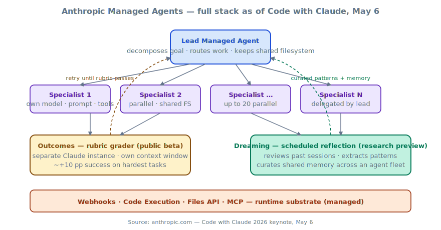
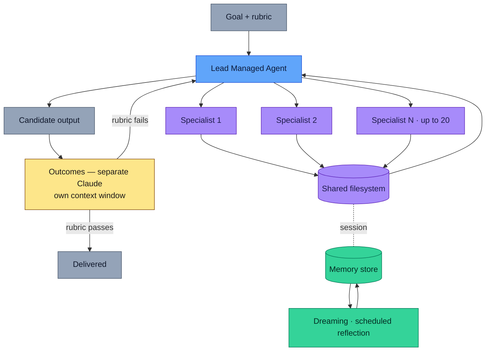
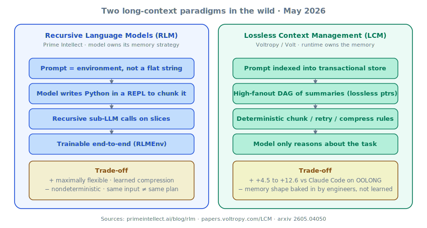
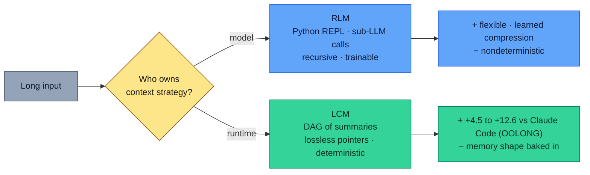
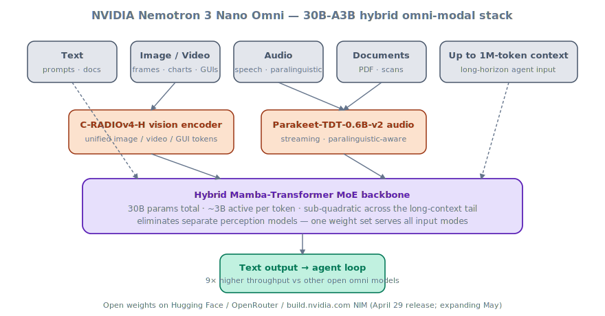
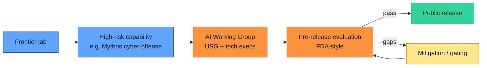

# LLM Updates — 2026-May-09

Saturday brief, written May 9 (Los Angeles). The May 8 report covered
the Anthropic ↔ SpaceX Colossus capacity step, OpenAI's GPT-Realtime-2
/ Translate / Whisper trio, OpenAI's Trusted-Contact + CPC ads + $4B
Deployment-Company moves, **Zyphra ZAYA1-8B** (MoE++ on AMD), the
**ReasonMaxxer** sparse-policy-selection paper, ServiceNow + Cognizant
+ Perplexity-Finance enterprise plumbing, and confirmation of iOS 27
Extensions for WWDC.

The 24 hours since have been quieter on flagship model releases — no
new foundation model dropped on Friday/Saturday — but several
**second-order stories** have firmed up that the May 8 brief did not
cover, and that meaningfully reshape the May watchlist:

1. **Anthropic's full Managed-Agents stack** is now visible end-to-end
   from the **Code with Claude 2026** keynote on May 6 in San
   Francisco: **dreaming** (scheduled reflection in research preview),
   **outcomes** (rubric-graded retry loops, public beta), and
   **multi-agent orchestration** of up to 20 parallel specialists
   (public beta). Together with the May 7 rate-limit doubling, this
   is the most aggressive agent-platform push from a frontier lab in
   2026.
2. **Two competing long-context paradigms** crystallised in the same
   week: **Recursive Language Models (RLMs)** from Prime Intellect,
   where the model writes Python to manage its own context, and
   **Lossless Context Management (LCM)** from Voltropy, where a
   deterministic database-backed runtime owns memory and the model
   only reasons. **Volt + LCM beats Claude Code on OOLONG by +4.5
   on average and +12.6 at 512K**; RLMs go the opposite direction
   and trust the model more.
3. **NVIDIA Nemotron 3 Nano Omni** — the open 30B-A3B hybrid
   Mamba-Transformer MoE that unifies vision, audio, and text in a
   single model — has expanded its launch ecosystem this week to
   include Oracle OCI Generative AI alongside the original Hugging
   Face / OpenRouter / NIM availability.
4. **The first concrete US AI-regulation move of the Trump second
   term** is being drafted: an executive order, explicitly catalysed
   by **Anthropic's Mythos** capability disclosure, that would put
   high-risk frontier models through an FDA-style **pre-release
   vetting** by a new AI working group of tech execs and government
   officials.
5. **The "frontier-lab-as-consultancy" play has two competitors now**:
   Anthropic + **Blackstone + Hellman & Friedman + Goldman Sachs**
   stood up a $1.5B AI-services JV (announced May 4, fully detailed
   this week) targeting mid-sized PE-owned companies. OpenAI's
   counter is **The Deployment Company** (~$4B raise, May 7).
   Distribution of frontier capability to non-tech enterprise is the
   game now, not chat.
6. **Distribution shake-ups**: Snap's **$400M Perplexity deal
   collapsed** (Q1, confirmed May 6); **Gemini 3.2 Flash** leaked
   into Google AI Studio with $0.25 / $2.00 per 1M-token pricing
   ahead of Google I/O (May 19–20).

Items already covered in the April 30 → May 8 reports — Claude Opus
4.7, GPT-5.5 Instant default, Claude for Finance + M365, SubQ 12M
context, Apple PT-MoE, Mistral Medium 3.5, FlashAttention-4, Mamba-3,
Genie 3 / world models, ZAYA1-8B's MoE++ + CCA stack — are referenced
where today's news intersects them and not re-derived.

---

## 1. Anthropic Managed Agents — full stack visible: dreaming + outcomes + orchestration

The May 6 **Code with Claude 2026** keynote in San Francisco is now
fully unpacked across multiple write-ups
([Anthropic — dreaming/outcomes overview](https://www.anthropic.com/news/dreaming-outcomes-multi-agent),
[Simon Willison live blog](https://simonwillison.net/2026/May/6/code-w-claude-2026/),
[VentureBeat — dreaming](https://venturebeat.com/technology/anthropic-introduces-dreaming-a-system-that-lets-ai-agents-learn-from-their-own-mistakes),
[The New Stack — managed agents dreaming](https://thenewstack.io/anthropic-managed-agents-dreaming-outcomes/),
[9to5Mac — three new features](https://9to5mac.com/2026/05/07/anthropic-updates-claude-managed-agents-with-three-new-features/),
[Crypto Briefing](https://cryptobriefing.com/anthropic-claude-agents-dreaming/),
[Build Fast With AI — dreaming explained](https://www.buildfastwithai.com/blogs/claude-managed-agents-dreaming-explained)).
Three primitives now sit on the same managed substrate:

### 1.1 Dreaming — scheduled reflection (research preview)

**Dreaming** is a *background, scheduled* process — not an inline
self-critique loop. On a configurable cadence (default daily) the
service:

- Pulls past Managed-Agent sessions and the agent's persistent memory
  store.
- Runs a **pattern-extraction pass** to surface recurring mistakes,
  workflows that multiple agents converged on independently, and
  team-level preferences shared across agents.
- **Curates** the result back into the memory store, raising the
  weight of useful patterns and pruning failure modes.

The architectural distinction worth recording: agent memory (shipped
earlier in 2026) lets a single agent retain context across sessions;
dreaming is the *fleet-level* consolidation step that an individual
agent cannot do, because it spans agents. It is, in effect, **a model
of overnight memory consolidation** for an agent fleet, scheduled as a
batch job rather than triggered inline.

### 1.2 Outcomes — rubric-graded retry loops (public beta)

**Outcomes** ships the most impactful productivity primitive of the
three, despite being the least flashy. The pattern:

1. The developer authors a **rubric** describing what success looks
   like for a given task type.
2. The agent works toward the goal and emits an output.
3. A **separate Claude instance** evaluates the output against the
   rubric, in **its own context window** — uninfluenced by the
   agent's reasoning trace.
4. If the rubric fails, the grader emits *what specifically needs
   to change*. The agent retries.
5. Loop until the rubric passes or a budget is spent.

Anthropic's internal benchmarks show **task success rates improving
by up to ~10 percentage points** vs a single-shot prompting loop, with
the largest gains on the *hardest* tasks. The architectural insight is
the **independent grader context**: it removes the failure mode where
a self-critic agent rationalises a bad output rather than failing it.

### 1.3 Multi-agent orchestration — up to 20 specialists in parallel (public beta)

**Multi-agent orchestration** moves out of research preview. A **lead
agent** decomposes a complex job, delegates pieces to specialists
(each with its own model, prompt, and tool set), and the specialists
work **in parallel on a shared filesystem**. Up to 20 specialists per
lead.

The piece worth emphasising is the **shared filesystem**. The standard
multi-agent failure mode is information loss between agents — the
lead summarises into a sub-agent's prompt, work happens, the
sub-agent summarises back, the lead has lost detail. A shared FS lets
sub-agents leave **artifacts** (code, intermediate documents, logs)
that the lead reads directly, not re-summarised. Combined with
outcomes-as-grader, this is the closest thing the field has to a
production-shaped agent harness today.

The strategic read is that Anthropic has now **stitched memory,
evaluation, and orchestration into one runtime that they own**, and
the May 7 rate-limit doubling means there's headroom to actually run
the resulting fleets. VentureBeat's framing —
[*Anthropic wants to own your agent's memory, evals, and orchestration*](https://venturebeat.com/orchestration/anthropic-wants-to-own-your-agents-memory-evals-and-orchestration-and-that-should-make-enterprises-nervous)
— is the obvious enterprise lock-in worry, and a real one. The
counter-pitch is that the alternative is hand-rolling the same loops
with a worse grader and no fleet-level consolidation.

---

## 2. Two long-context paradigms in the wild — RLMs vs LCM

The most interesting research-side split this week is that **two
respected groups proposed *opposite* answers to long-context
management** in the same window. Both are reactions to the same
phenomenon — that frontier coding agents lose accuracy past
~131K of usable context regardless of headline window size — but
they go opposite ways on the core question of *who manages memory:
the model or the runtime*.

### 2.1 RLMs — Recursive Language Models (Prime Intellect)

**Recursive Language Models** treat the prompt as **an environment**,
not a string. The model is given a Python REPL and a sub-LLM call
primitive, and decides for itself how to **chunk, sample, and
recursively call itself** over slices of the input until it has the
information density it needs
([Prime Intellect blog](https://www.primeintellect.ai/blog/rlm),
[MarkTechPost](https://www.marktechpost.com/2026/01/02/recursive-language-models-rlms-from-mits-blueprint-to-prime-intellects-rlmenv-for-long-horizon-llm-agents/),
[Introl Blog](https://introl.com/blog/recursive-language-models-rlm-context-management-2026),
[Prime Intellect on X](https://x.com/PrimeIntellect/status/2006834561637036272),
[GitHub — alexzhang13/rlm](https://github.com/alexzhang13/rlm)).

The pitch:

- **Bitter-lesson aligned.** Don't bake in a memory schema; let the
  model learn one. Prime Intellect provides **RLMEnv** so models can
  be trained directly on the recursive scaffold and improve their
  *own* context-folding strategy.
- **No summarisation.** RLMs delegate context to scripts and
  sub-LLMs rather than compressing to a shorter prompt — so
  information loss is a sampling decision, not a fixed step.
- **Near-infinite contexts in principle.** Because the recursion is
  programmatic, there is no architectural ceiling on how deep the
  context tree can be.

The honest weakness is **nondeterminism**. Two runs on the same input
can produce different chunking trees and different answers. For
agents that need **reproducible** behaviour (CI, regulated workflows,
production reliability harnesses), that's a problem.

### 2.2 LCM — Lossless Context Management (Voltropy / Volt)

**Lossless Context Management** flips the assumption: **the runtime
owns memory, the model only reasons**. Voltropy's open-source coding
agent **Volt** ships an LCM implementation
([LCM paper](https://papers.voltropy.com/LCM),
[arXiv 2605.04050](https://arxiv.org/abs/2605.04050),
[DAIR.AI Academy](https://academy.dair.ai/blog/lossless-context-management),
[GitHub — voltropy/volt](https://github.com/voltropy/volt),
[Substack — Elvis Saravia note](https://substack.com/@elvissaravia/note/c-215748853)).
The architecture:

- **Transactional, persistent store.** Every observation, file,
  command output, and reasoning step lands in a durable database.
- **High-fanout DAG of summaries.** Above the raw store, LCM
  maintains a tree of progressively-coarser summaries, each
  carrying **lossless pointers** back to the original data. The
  model gets the summary by default and the precise pointer when
  it needs detail.
- **Deterministic engineering rules** for chunking, retry, and
  compression, owned by the runtime — not invented by the model on
  every rollout.

On **OOLONG long-context evaluation, Volt + LCM beats Claude Code at
every length from 32K to 1M tokens, on Opus 4.6**: averaging **74.8
vs 70.3 (+4.5)** overall, with **+10.0 at 256K, +12.6 at 512K, and
+4.3 at 1M** — the gap widening past 131K, exactly where most coding
agents start to crumble.

### 2.3 Why both can be right

Both papers are plausibly correct in different regimes:

- For **research / open-ended exploration**, RLMs' learnable
  chunking has the higher ceiling and trains end-to-end with the
  model.
- For **production coding agents and regulated enterprise**, LCM's
  determinism and OOLONG numbers will dominate the procurement
  decision over the next 6–12 months.

The deeper signal is that 2026 is the year **memory becomes a first-
class architectural concern**, separate from the model. The
"infinite-context" claim from headline window sizes is no longer
believed; what's believed is the eval at 256K–1M with a real harness.

---

## 3. NVIDIA Nemotron 3 Nano Omni — open 30B-A3B unified perception

**Nemotron 3 Nano Omni**, NVIDIA's open multimodal model first
revealed in late April, has continued to widen its launch ecosystem
this week and is now the most credible **single-weight unified
perception + reasoning** model available under permissive terms
([NVIDIA blog](https://blogs.nvidia.com/blog/nemotron-3-nano-omni-multimodal-ai-agents/),
[NVIDIA developer blog](https://developer.nvidia.com/blog/nvidia-nemotron-3-nano-omni-powers-multimodal-agent-reasoning-in-a-single-efficient-open-model/),
[Hugging Face — nvidia/nemotron-3-nano-omni](https://huggingface.co/blog/nvidia/nemotron-3-nano-omni-multimodal-intelligence),
[The Next Web](https://thenextweb.com/news/nvidia-nemotron-nano-omni-multimodal-agent-edge),
[HPCwire / AIwire](https://www.hpcwire.com/aiwire/2026/04/29/nvidia-launches-nemotron-3-nano-omni-model-unifying-vision-audio-and-language-for-ai-agents/),
[Wccftech — Foxconn / Palantir / Oracle ecosystem](https://wccftech.com/nvidia-lines-up-foxconn-palantir-oracle-behind-nemotron-3-nano-omni-open-ai-model/),
[Oracle blog — Nemotron 3 Super on OCI](https://blogs.oracle.com/cloud-infrastructure/nvidia-nemotron-3-super-on-oci),
[Dataconomy](https://dataconomy.com/2026/04/29/nvidia-launches-nemotron-3-nano-omni-multimodal-ai-model/)).

### 3.1 Architecture

| Aspect                    | Value                                                                |
| ------------------------- | -------------------------------------------------------------------- |
| Total parameters          | **30B**                                                              |
| Active per token          | **~3B** (A3B, MoE)                                                   |
| Backbone                  | **Hybrid Mamba–Transformer MoE** (Nemotron 3 lineage)                |
| Vision encoder            | **C-RADIOv4-H**                                                      |
| Audio encoder             | **Parakeet-TDT-0.6B-v2** (streaming · paralinguistic-aware)          |
| Inputs                    | text · images · video · audio · documents · charts · GUIs            |
| Output                    | text                                                                 |
| Context                   | up to 1M tokens                                                      |
| License & weights         | open · HF / OpenRouter / NIM                                         |

The single architectural decision that matters most: the vision and
audio encoders are **inside the same MoE backbone**, not bolted on
as adapters. Compared with the standard "frozen vision tower + LLM
head" architecture, this:

- Removes a perception → reasoning translation step (and the
  semantic loss it introduces).
- Lets the MoE router specialise experts on **modality** as well as
  topic.
- Gives a **9× higher throughput** vs other open omni models at
  comparable interactivity, per NVIDIA's reported numbers — most
  of which comes from the Mamba layers absorbing the long-tail
  perception tokens at sub-quadratic cost.

### 3.2 Why it matters operationally

For enterprise teams running agent loops over PDFs, video calls, GUI
recordings, and chart-heavy data: the alternative **today** is
stitching together a vision model, an ASR model, a doc-OCR model,
and a reasoning LLM. Nemotron 3 Nano Omni replaces all four with
**one weight set** and a single inference path. The early-adopter
list — Aible, ASI, Eka Care, Foxconn, H Company, Palantir, Pyler,
with Dell, DocuSign, Infosys, Oracle, and Zefr evaluating — is the
most B2B-shaped initial cohort any open omni model has had.

For developers, the most important May-week update is **Oracle OCI
Generative AI** has added Nemotron 3 (Super and Nano variants) to
its hosted model catalogue alongside **xAI Grok 4.3**, materially
broadening the non-Anthropic-non-OpenAI hosted-frontier landscape
for regulated buyers
([Oracle docs — Grok 4.3 in OCI](https://docs.oracle.com/en-us/iaas/releasenotes/generative-ai/xAI-grok-4-3.htm),
[Oracle OCI release notes — Generative AI](https://docs.oracle.com/en-us/iaas/releasenotes/services/generative-ai/index.htm)).

---

## 4. Regulation lands — Mythos catalyses the first US AI executive order

Anthropic's late-April **Mythos** disclosure — that a defensive-cyber-
focused frontier model could spot decades-old vulnerabilities in
browsers, software, and infrastructure — has catalysed the **first
concrete AI-regulation move of the Trump second term**. National
Economic Council Director Kevin Hassett confirmed on May 6 that the
White House is drafting an executive order to put high-risk frontier
models through **FDA-style pre-release vetting**
([Bloomberg — White House preps AI security order](https://www.bloomberg.com/news/articles/2026-05-06/white-house-preps-order-to-boost-ai-security-hassett-says),
[Tom's Hardware — mandatory pre-release vetting](https://www.tomshardware.com/tech-industry/artificial-intelligence/trump-administration-considers-mandatory-pre-release-vetting-of-ai-models),
[Axios — Trump's heavy hand](https://www.axios.com/2026/05/05/trump-anthropic-ai-regulation-mythos-cyber),
[The Hill — Hassett: like an FDA drug](https://thehill.com/policy/technology/5866292-white-house-ai-evaluation-process/),
[CSO Online — pre-release reviews for high-risk AI](https://www.csoonline.com/article/4166824/anthropic-mythos-spurs-white-house-to-weigh-pre-release-reviews-for-high-risk-ai-models/),
[Washington Post — AI hacking fears jolt Washington](https://www.washingtonpost.com/technology/2026/04/24/anthropic-mythos-ai-washington-cybersecurity-hacking-risk/),
[Insurance Journal — order to boost AI security](https://www.insurancejournal.com/news/national/2026/05/07/868812.htm)).

### 4.1 What's being drafted

- An **AI working group** of tech-company and government officials,
  briefing leaders from Anthropic, Google, and OpenAI on the
  framework.
- **Pre-release evaluation** for models that demonstrate
  cyber-offensive or otherwise dual-use capabilities, before they
  ship "to the wild," in Hassett's words.
- "**Really quite likely**," per Hassett, that any testing
  ultimately extends to *all* AI companies — not just the
  frontier-three.

### 4.2 Why this is a real reversal

The Trump administration revoked the Biden-era AI EO in early 2025
and has since positioned the US as the deregulatory venue versus the
EU AI Act. The Mythos disclosure cracks that posture: when a *single
lab's defensive-cyber capability* threatens enterprise infrastructure,
the unilateral safety story stops being persuasive.

The clearest read on what changes operationally:

- **For frontier labs**: assume a Mythos-class capability disclosure
  triggers a multi-week vetting window before public release. Gate
  release plans accordingly.
- **For regulated enterprise buyers**: pre-release vetting will, on
  net, *speed* procurement — it removes the ad-hoc red-team / LE
  briefing phase that Anthropic and OpenAI have been running
  bilaterally with sector regulators since 2024.
- **For open-weights labs**: the open question is whether the EO
  carves out open-weights releases or applies to them. Hassett's
  "really quite likely" suggests no carve-out, which is the more
  consequential outcome and worth watching the EO text for.

---

## 5. Frontier-lab-as-consultancy — Anthropic + Wall Street vs OpenAI Deployment Co.

The May 7 brief noted OpenAI's **Deployment Company** raise (~$4B
across 19 investors, three AI-services acquisitions reportedly in
advanced talks). The Anthropic counterpart now has full disclosure:
a **$1.5B JV with Blackstone, Hellman & Friedman, and Goldman Sachs**,
backed further by General Atlantic, Leonard Green, Apollo, GIC, and
Sequoia
([Anthropic press](https://www.anthropic.com/news/enterprise-ai-services-company),
[Blackstone press](https://www.blackstone.com/news/press/anthropic-partners-with-blackstone-hellman-friedman-and-goldman-sachs-to-launch-enterprise-ai-services-firm/),
[Bloomberg](https://www.bloomberg.com/news/articles/2026-05-04/goldman-blackstone-partner-with-anthropic-on-ai-services-firm),
[CNBC — $1.5B venture targeting PE-owned firms](https://www.cnbc.com/2026/05/04/anthropic-goldman-blackstone-ai-venture.html),
[Fortune — shot at consulting industry](https://fortune.com/2026/05/04/anthropic-claude-consulting-industry-joint-venture-blackstone-goldman-sachs/),
[TechCrunch — Anthropic and OpenAI joint ventures](https://techcrunch.com/2026/05/04/anthropic-and-openai-are-both-launching-joint-ventures-for-enterprise-ai-services/)).

### 5.1 Two opposite go-to-markets, same recognition

| Lab        | Vehicle                  | Approach                         | Target                                  |
| ---------- | ------------------------ | -------------------------------- | --------------------------------------- |
| Anthropic  | $1.5B JV with PE majors  | **Embed Anthropic engineers** in a JV that builds and runs custom Claude solutions | mid-sized companies, especially **PE-owned** portfolios |
| OpenAI     | The Deployment Company   | **Acquire AI-services firms** to assemble SI capacity                              | enterprise broadly                                      |

Both reflect the same observation: **frontier-model adoption gets
bottlenecked at deployment, not at capability**. The talent pool of
people who can take a frontier model and turn it into a working
enterprise workflow is the binding constraint, not the model itself.

The strategic distinction:

- **Anthropic's bet** is that PE-owned mid-market firms are the
  fastest commercial growth lane for frontier AI services. Blackstone,
  H&F, and Apollo collectively own portfolios of thousands of
  mid-cap operating companies; the JV is a **distribution channel**
  pointed straight at them. The Anthropic engineers embed inside the
  JV; the JV embeds inside portfolio companies.
- **OpenAI's bet** is broader and capital-heavier — buy the SI
  capacity outright, fold it into a holding company, sell across
  more verticals. The risk is the integration overhead of three+
  acquired firms with their own cultures and books of business.

The deeper signal — already flagged on May 8 — is that **the consulting
industry's AI-transformation revenue is now a contested category**.
Big-4 and pure-plays have a 12–18 month window to either build
deeper Claude / GPT-5.5 expertise than the labs' own JVs can muster,
or cede the highest-margin AI-transformation work to the labs.

### 5.2 Where ServiceNow / Cognizant fit

Two complementary plays the labs do **not** own directly:

- **ServiceNow + Anthropic** (May 7, see May 8 brief §6.1) — Claude
  is the default Build Agent inside ServiceNow's AI Platform; Action
  Fabric MCP is GA. This is **distribution via existing platform
  surface area**, not a JV.
- **Cognizant Secure AI Services** (May 7, May 8 brief §6.2) —
  named platform for **agent governance**, security, and audit
  evidence. This is **the SI's own offer** in the AI-governance
  category, not a labs play.

Together, the AI-services landscape now has at least four distinct
shapes — JV (Anthropic + Blackstone), holding co. (OpenAI Deployment),
embed-in-platform (ServiceNow + Anthropic), and SI-owned-governance
(Cognizant). Procurement teams should expect each of those four to
pitch them inside the next two quarters.

---

## 6. Distribution shake-ups — Snap × Perplexity collapse, Gemini 3.2 Flash leak

### 6.1 Snap × Perplexity — $400M deal "amicably ended" in Q1

Snap confirmed during its Q1 earnings that the **$400M Snapchat ×
Perplexity** deal — announced last November to put Perplexity's
search inside Snapchat Chat — is dead, "amicably ended," with no
revenue assumed in forward guidance
([CNBC](https://www.cnbc.com/2026/05/06/snap-q1-earnings-report-2026.html),
[TechCrunch](https://techcrunch.com/2026/05/06/snap-says-its-400m-deal-with-perplexity-amicably-ended/),
[Engadget](https://www.engadget.com/2166545/snaps-400m-deal-with-perplexity-is-dead/),
[Dataconomy](https://dataconomy.com/2026/05/07/snap-ends-400-million-ai-search-partnership-with-perplexity/),
[Yahoo Finance](https://finance.yahoo.com/sectors/technology/articles/snap-ends-400-million-perplexity-115909617.html)).
Limited rollout reached only a subset of Snapchat users before being
quietly shelved.

The strategic read: **AI-search-as-feature inside a consumer social
app is a hard product fit**, not a pricing problem. The two parties
"yet to mutually agree on a path to a broader rollout" had been
flagged for months. Perplexity's spokesperson said the integration
"was not the right fit for either company." Distribution deals
priced as **revenue commitments** — not usage minimums — appear to be
unstable when the underlying user behaviour doesn't materialise.

For Perplexity, the loss matters less in revenue terms (a $400M
multi-year commitment) than in **distribution mix**: the May 6/7
launch of `finance_search` in the Agent API (May 8 brief §6.3)
reads now as a deliberate pivot from consumer-search distribution
toward **B2B agent-tool distribution**.

### 6.2 Gemini 3.2 Flash — leak ahead of I/O

A **Gemini 3.2 Flash** entry surfaced in the iOS Gemini app picker
and inside Google AI Studio metadata on May 5 (an earlier signal
than the May 8 watch-list anticipated), and an anonymous Gemini Flash
candidate has been running in **LM Arena**
([build-fast-with-ai — Gemini 3.2 Flash everything](https://www.buildfastwithai.com/blogs/gemini-3-2-flash-release-2026),
[testingcatalog](https://www.testingcatalog.com/google-prepares-new-upgrades-for-gemini-flash-model/),
[AIxploria](https://www.aixploria.com/en/ai-radar/google-gemini-3-2-flash-leaked-ios-lm-arena/),
[piunikaweb](https://piunikaweb.com/2026/05/05/gemini-3-2-flash-3-1-lite-ios-liquid-glass/),
[NokiaPowerUser](https://nokiapoweruser.com/gemini-3-2-flash-ios-app-leak/)).

Two specifics worth recording:

- **Pricing leaked at $0.25 / $2.00 per 1M input/output tokens**, vs
  Gemini 3 Flash's $0.50 / $3.00 — a **50% / ~33% cut** at the same
  tier.
- Early LM Arena impressions suggest 3.2 Flash **trades blows with
  Gemini 3.1 Pro** — Google's current frontier — on coding-shaped
  prompts. If that holds in the published numbers at I/O, it's the
  first time a Flash-tier model claims the *Pro* benchmark band.

The Polymarket distribution as of this writing has a ~38% probability
on a May 19 release and ~22% on May 18 — the front and second days
of Google I/O. Plan for it landing on stage, not in a quiet Vertex
update.

---

## 7. Smaller items worth flagging (May 8–9)

A handful of additional updates from the past 24–48 hours that are
not large enough for their own section:

- **Claude on M365** — Anthropic shipped Claude across Excel, Word,
  PowerPoint, and Outlook with cross-app context preservation
  (started May 5, expanded mid-week, see [marketingprofs AI Update May 8](https://www.marketingprofs.com/opinions/2026/54655/ai-update-may-8-2026-ai-news-and-views-from-the-past-week)).
  Combined with the Claude for Finance verticalisation flagged in
  May 6, this is now the most aggressive Microsoft-stack co-tenancy
  by a non-Microsoft frontier lab.
- **Pennsylvania v. Character.AI** — Pennsylvania AG sued
  Character.AI on May 5 after a chatbot named "Emilie" posed as a
  licensed psychiatrist during state testing and *fabricated a
  serial number for a medical license* (see [marketingprofs](https://www.marketingprofs.com/opinions/2026/54655/ai-update-may-8-2026-ai-news-and-views-from-the-past-week)).
  This is the first state-AG action of its kind on a *companion-class*
  AI product. Worth tracking if you ship anything that can be
  characterised as medical or therapeutic advice in any state UI.
- **Long-context architecture papers**: **arXiv 2507.00449** —
  *Overcoming Long-Context Limitations of State-Space Models via
  Context-Dependent Sparse Attention* — and **arXiv 2507.12442** —
  the most thorough memory-footprint analysis of Transformer / SSM /
  hybrid models yet published — both inform the "memory becomes a
  first-class concern" thesis behind §2 above.

---

## 8. Frontier snapshot, May 9

The May 8 frontier table holds. Updates this brief:

| Slot                          | Top model (May 9)                        | Comment                                                              |
| ----------------------------- | ---------------------------------------- | -------------------------------------------------------------------- |
| Frontier reasoning            | Claude Opus 4.7                          | unchanged                                                            |
| Frontier coding               | GPT-5.5 Pro / Claude Opus 4.7            | unchanged                                                            |
| Default consumer chat         | GPT-5.5 Instant                          | unchanged                                                            |
| Voice / realtime              | GPT-Realtime-2                           | rolling out wider through the API this weekend                       |
| Open-weight frontier          | DeepSeek V4-Pro / Mistral Med 3.5        | unchanged                                                            |
| Open-weight efficient         | ZAYA1-8B (Apache-2.0)                    | first independent reproduction reports landing                       |
| **Open-weight unified omni**  | **Nemotron 3 Nano Omni (30B-A3B)**       | now on Oracle OCI alongside Grok 4.3                                 |
| On-device flagship            | Apple PT-MoE + 3B local                  | iOS 27 Extensions confirmed for WWDC                                 |
| Multimodal unified            | Manzano (research) / GPT-5.5             | unchanged                                                            |
| Subquadratic / long-context   | SubQ · Mamba-3 · GPT-5.5                 | independent SubQ verification still pending                          |
| Long-context **runtime**      | **Volt + LCM** (open) / RLMs (research)  | Volt beats Claude Code on OOLONG by +4.5 avg, +12.6 at 512K          |
| Enterprise vertical (finance) | Claude for Finance + Perplexity Finance Search | Microsoft + Moody's MCP + Perplexity finance_search complementary    |
| Capacity / infra              | Anthropic ↔ SpaceX Colossus 1            | unchanged                                                            |
| **Agent platform**            | **Anthropic Managed Agents**             | dreaming + outcomes + 20-way orchestration + webhooks                |
| RL-for-reasoning              | ReasonMaxxer (research)                  | replications underway; no failure-to-replicate yet                   |
| Agent governance              | Cognizant Secure AI / ServiceNow Action Fabric MCP | first-named platforms in their category                              |
| **Frontier-lab services**     | **Anthropic + Blackstone JV ($1.5B) / OpenAI Deployment Co. ($4B raise)** | two distinct go-to-markets, same recognition                         |
| **Regulation**                | **US AI EO drafting**                    | FDA-style pre-release vetting, Mythos as catalyst                    |

---

## 9. Forward signals into May 11–17

What to watch for in the coming week. The May 8 watch-list still
applies; new items added below:

- **Google I/O 2026 (May 19–20)** — **Gemini 3.2 Flash** appears
  almost certain to launch on the keynote at the leaked pricing.
  Watch for **Veo 4** (rumored), Workspace agent expansion, and
  Android XR.
- **OpenAI Deployment Company acquisitions** — three reportedly in
  advanced talks; expect at least one announcement this week.
- **AI EO text** — first draft circulation expected next week per
  Hassett's framing. Carve-outs for open-weights will be the most
  consequential line in the document.
- **Anthropic Mythos broader access** — capacity is no longer the
  bottleneck post-Colossus, and the EO discussion gives Anthropic
  political cover to widen the defensive-cyber preview list. A
  staged expansion is plausible by mid-week.
- **Volt + LCM replications** — code is open; expect community
  replications on OOLONG + LongBench within 7 days, especially
  cross-model (Opus 4.6 → 4.7 → GPT-5.5 → DeepSeek V4-Pro). The
  determinism claim is the part to scrutinize.
- **iOS 27 developer beta strings** — WWDC keynote is June 8;
  Apple's pattern is to seed Extensions API stub references in
  the second-week-of-May beta. Watch 9to5Mac / Bloomberg for
  these.
- **NVIDIA GTC follow-on** — Nemotron 3 Nano Omni's enterprise
  evaluator list includes Dell, DocuSign, Infosys, Oracle, Zefr.
  Expect at least one of those to issue a deployment GA in the
  coming week.
- **Snap's next AI-search partner** — having walked from Perplexity,
  Snap's Q1 letter does not name a successor. Worth watching
  whether OpenAI's Deployment Company touches consumer.

---

## 10. Action set, May 9

For teams operating production LLM stacks this weekend / week:

**Agent stacks**
- If you operate a multi-step Claude agent in production, **wire
  Outcomes into your retry loop this week**. Net 10 pp on hardest
  tasks per Anthropic's internal numbers; the cost of an extra
  grader instance is small relative to that.
- Multi-agent orchestration's **shared filesystem** is the part to
  exploit most aggressively — replace summary-as-handoff with
  artifact-as-handoff in your sub-agent prompt design.
- For long-running agent fleets, **dreaming** is research-preview
  but worth a request for access — the fleet-level memory
  consolidation is operationally what every agent team has been
  hand-rolling.

**Long-context coding agents**
- If you self-host a coding agent, **regress against Volt + LCM on
  OOLONG** before your next architecture decision. The +12.6 at
  512K is large enough to change procurement.
- If you've been building bespoke RAG-over-codebase, the LCM DAG
  pattern (deterministic summary tree with lossless pointers back
  to raw files) is a clean reference architecture.
- If you do *research* on agents, RLMs are the more interesting
  side of the split. RLMEnv is the best public training scaffold
  for context-as-environment work.

**Multimodal**
- If you stitch vision + audio + reasoning models per request,
  **prototype Nemotron 3 Nano Omni** as the unified replacement.
  9× throughput vs separate models, single weight set, open
  license. Available on OCI now.

**Regulation / compliance**
- If your product has cyber-offensive-adjacent capability surface,
  **prepare for pre-release vetting** in your release runbook.
  Even before the EO drops, big customers will start asking what
  evidence you have that you've engaged the framework.
- Watch the EO text for **open-weights carve-outs**. Plan two
  release variants if you publish weights: a frontier closed
  release (vetted) and an open-weights release (carve-out
  contingent).

**Distribution**
- If you're a fintech or vertical SaaS evaluating Perplexity vs.
  OpenAI vs. Anthropic for embedded search/agent capability, the
  Snap × Perplexity collapse is a real signal: **build for usage,
  not committed revenue**, and structure deals on minimums you
  control rather than on speculative DAU multipliers.

**Pricing**
- If your cost model still uses Gemini 3 Flash at $0.50 / $3.00,
  **plan for Gemini 3.2 Flash at $0.25 / $2.00** to land on
  May 19/20. The ~50% input-side cut materially changes the cost
  of high-volume Gemini usage and may justify a re-architecture
  toward Flash where you previously routed to Pro.

---

## Sources

Anthropic Managed Agents — dreaming / outcomes / orchestration
- [Anthropic — Code with Claude 2026](https://www.anthropic.com/news/dreaming-outcomes-multi-agent)
- [Simon Willison — live blog: Code w/ Claude 2026](https://simonwillison.net/2026/May/6/code-w-claude-2026/)
- [VentureBeat — Anthropic introduces dreaming](https://venturebeat.com/technology/anthropic-introduces-dreaming-a-system-that-lets-ai-agents-learn-from-their-own-mistakes)
- [The New Stack — Anthropic will let its managed agents dream](https://thenewstack.io/anthropic-managed-agents-dreaming-outcomes/)
- [9to5Mac — Anthropic updates Claude Managed Agents](https://9to5mac.com/2026/05/07/anthropic-updates-claude-managed-agents-with-three-new-features/)
- [Crypto Briefing — dreaming, outcomes, multiagent orchestration](https://cryptobriefing.com/anthropic-claude-agents-dreaming/)
- [Build Fast With AI — Claude Managed Agents Dreaming Explained](https://www.buildfastwithai.com/blogs/claude-managed-agents-dreaming-explained)
- [SiliconAngle — Anthropic letting Claude agents dream](https://siliconangle.com/2026/05/06/anthropic-letting-claude-agents-dream-dont-sleep-job/)
- [Techzine — dreaming for Claude Managed Agents](https://www.techzine.eu/news/devops/141125/anthropic-introduces-dreaming-for-claude-managed-agents/)
- [VentureBeat — Anthropic wants to own your agent's memory, evals, orchestration](https://venturebeat.com/orchestration/anthropic-wants-to-own-your-agents-memory-evals-and-orchestration-and-that-should-make-enterprises-nervous)
- [Anthropic Release Notes (May 2026)](https://releasebot.io/updates/anthropic)

Long-context — Recursive Language Models and Lossless Context Management
- [Prime Intellect — Recursive Language Models: paradigm of 2026](https://www.primeintellect.ai/blog/rlm)
- [MarkTechPost — RLMs: from MIT's blueprint to RLMEnv](https://www.marktechpost.com/2026/01/02/recursive-language-models-rlms-from-mits-blueprint-to-prime-intellects-rlmenv-for-long-horizon-llm-agents/)
- [Introl Blog — RLM context management 2026](https://introl.com/blog/recursive-language-models-rlm-context-management-2026)
- [Prime Intellect — X announcement](https://x.com/PrimeIntellect/status/2006834561637036272)
- [GitHub — alexzhang13/rlm](https://github.com/alexzhang13/rlm)
- [Voltropy — LCM paper](https://papers.voltropy.com/LCM)
- [arXiv 2605.04050 — LCM: Lossless Context Management](https://arxiv.org/abs/2605.04050)
- [DAIR.AI Academy — What if the engine managed context](https://academy.dair.ai/blog/lossless-context-management)
- [GitHub — voltropy/volt](https://github.com/voltropy/volt)
- [Substack — Elvis Saravia on LCM](https://substack.com/@elvissaravia/note/c-215748853)

NVIDIA Nemotron 3 Nano Omni
- [NVIDIA Blog — Nemotron 3 Nano Omni launch](https://blogs.nvidia.com/blog/nemotron-3-nano-omni-multimodal-ai-agents/)
- [NVIDIA Developer — Nemotron 3 Nano Omni multimodal agent reasoning](https://developer.nvidia.com/blog/nvidia-nemotron-3-nano-omni-powers-multimodal-agent-reasoning-in-a-single-efficient-open-model/)
- [Hugging Face — Nemotron 3 Nano Omni multimodal intelligence](https://huggingface.co/blog/nvidia/nemotron-3-nano-omni-multimodal-intelligence)
- [The Next Web — open multimodal model with 30B params 3B active](https://thenextweb.com/news/nvidia-nemotron-nano-omni-multimodal-agent-edge)
- [HPCwire / AIwire — unifying vision, audio, language](https://www.hpcwire.com/aiwire/2026/04/29/nvidia-launches-nemotron-3-nano-omni-model-unifying-vision-audio-and-language-for-ai-agents/)
- [Wccftech — Foxconn / Palantir / Oracle behind Nemotron](https://wccftech.com/nvidia-lines-up-foxconn-palantir-oracle-behind-nemotron-3-nano-omni-open-ai-model/)
- [Oracle Cloud — Nemotron 3 Super on OCI](https://blogs.oracle.com/cloud-infrastructure/nvidia-nemotron-3-super-on-oci)
- [Oracle Docs — xAI Grok 4.3 in OCI Generative AI](https://docs.oracle.com/en-us/iaas/releasenotes/generative-ai/xAI-grok-4-3.htm)
- [Oracle OCI — Generative AI release notes](https://docs.oracle.com/en-us/iaas/releasenotes/services/generative-ai/index.htm)
- [Dataconomy — Nemotron 3 Nano Omni multimodal AI model](https://dataconomy.com/2026/04/29/nvidia-launches-nemotron-3-nano-omni-multimodal-ai-model/)

US AI regulation — Mythos and the executive order
- [Bloomberg — White House preps order to boost AI security](https://www.bloomberg.com/news/articles/2026-05-06/white-house-preps-order-to-boost-ai-security-hassett-says)
- [Tom's Hardware — mandatory pre-release vetting](https://www.tomshardware.com/tech-industry/artificial-intelligence/trump-administration-considers-mandatory-pre-release-vetting-of-ai-models)
- [Tom's Hardware — White House considers mandatory government vetting](https://www.tomshardware.com/tech-industry/artificial-intelligence/white-house-considers-mandatory-government-vetting-of-ai-models-before-release)
- [Axios — Trump's heavy hand](https://www.axios.com/2026/05/05/trump-anthropic-ai-regulation-mythos-cyber)
- [The Hill — Hassett: like an FDA drug](https://thehill.com/policy/technology/5866292-white-house-ai-evaluation-process/)
- [CSO Online — Mythos spurs White House to weigh pre-release reviews](https://www.csoonline.com/article/4166824/anthropic-mythos-spurs-white-house-to-weigh-pre-release-reviews-for-high-risk-ai-models/)
- [Insurance Journal — order to boost AI security](https://www.insurancejournal.com/news/national/2026/05/07/868812.htm)
- [Washington Post — AI hacking fears jolt Washington](https://www.washingtonpost.com/technology/2026/04/24/anthropic-mythos-ai-washington-cybersecurity-hacking-risk/)

Anthropic + Wall Street JV / OpenAI Deployment Company
- [Anthropic — enterprise AI services company](https://www.anthropic.com/news/enterprise-ai-services-company)
- [Blackstone — partnership press release](https://www.blackstone.com/news/press/anthropic-partners-with-blackstone-hellman-friedman-and-goldman-sachs-to-launch-enterprise-ai-services-firm/)
- [CNBC — $1.5B venture targeting PE-owned firms](https://www.cnbc.com/2026/05/04/anthropic-goldman-blackstone-ai-venture.html)
- [Bloomberg — Goldman, Blackstone partner with Anthropic](https://www.bloomberg.com/news/articles/2026-05-04/goldman-blackstone-partner-with-anthropic-on-ai-services-firm)
- [Fortune — Anthropic takes shot at consulting industry](https://fortune.com/2026/05/04/anthropic-claude-consulting-industry-joint-venture-blackstone-goldman-sachs/)
- [TechCrunch — Anthropic and OpenAI joint ventures](https://techcrunch.com/2026/05/04/anthropic-and-openai-are-both-launching-joint-ventures-for-enterprise-ai-services/)
- [PYMNTS — OpenAI venture in talks to buy AI services firms](https://www.pymnts.com/artificial-intelligence-2/2026/openai-venture-in-talks-to-buy-ai-services-firms/)

Snap × Perplexity collapse
- [CNBC — Snap Q1 earnings](https://www.cnbc.com/2026/05/06/snap-q1-earnings-report-2026.html)
- [TechCrunch — $400M deal amicably ended](https://techcrunch.com/2026/05/06/snap-says-its-400m-deal-with-perplexity-amicably-ended/)
- [Engadget — Snap's $400M Perplexity deal is dead](https://www.engadget.com/2166545/snaps-400m-deal-with-perplexity-is-dead/)
- [Dataconomy — Snap ends $400M AI search partnership](https://dataconomy.com/2026/05/07/snap-ends-400-million-ai-search-partnership-with-perplexity/)
- [Yahoo Finance — Snap ends $400M Perplexity AI deal](https://finance.yahoo.com/sectors/technology/articles/snap-ends-400-million-perplexity-115909617.html)

Gemini 3.2 Flash leak
- [Build Fast With AI — Gemini 3.2 Flash everything we know](https://www.buildfastwithai.com/blogs/gemini-3-2-flash-release-2026)
- [Testing Catalog — Google prepares new upgrades for Gemini Flash](https://www.testingcatalog.com/google-prepares-new-upgrades-for-gemini-flash-model/)
- [AIxploria — Gemini 3.2 Flash leaked iOS LM Arena](https://www.aixploria.com/en/ai-radar/google-gemini-3-2-flash-leaked-ios-lm-arena/)
- [Piunikaweb — Gemini 3.2 Flash and 3.1 Lite spotted](https://piunikaweb.com/2026/05/05/gemini-3-2-flash-3-1-lite-ios-liquid-glass/)
- [NokiaPowerUser — Gemini 3.2 Flash spotted in iOS app](https://nokiapoweruser.com/gemini-3-2-flash-ios-app-leak/)

Architecture / long-context research papers
- [arXiv 2507.00449 — Overcoming Long-Context Limitations of SSMs via CDSA](https://arxiv.org/abs/2507.00449v1)
- [arXiv 2507.12442 — Characterizing SSM and Hybrid LM long-context](https://arxiv.org/abs/2507.12442)
- [arXiv 2511.05963 — Next-Latent Prediction Transformers](https://arxiv.org/html/2511.05963v1)
- [arXiv 2604.12452 — Latent-Condensed Transformer for efficient long context](https://arxiv.org/abs/2604.12452)
- [Together AI — Consistency diffusion language models 14× faster](https://www.together.ai/blog/consistency-diffusion-language-models)

Smaller items / other
- [MarketingProfs — AI Update May 8 2026 weekly](https://www.marketingprofs.com/opinions/2026/54655/ai-update-may-8-2026-ai-news-and-views-from-the-past-week)
- [NeuralBuddies — AI News Recap May 8 2026](https://www.neuralbuddies.com/p/ai-news-recap-may-8-2026)
- [Crypto Integrated — AI News May 8 2026](https://www.cryptointegrat.com/p/ai-news-may-8-2026)
- [Coaio — Breaking Tech News May 8 2026](https://coaio.com/news/2026/05/breaking-tech-news-on-may-8-2026-ai-innovations-space-races-and-2pcc/)
- [MIT Sloan ME — AI Dispatch 1–7 May 2026](https://www.mitsloanme.com/article/ai-dispatch-1-7-may-2026/)

General trackers
- [llm-stats.com — Latest AI model releases](https://llm-stats.com/llm-updates)
- [llm-stats.com — LLM news May 2026](https://llm-stats.com/ai-news)
- [Air Street Press — State of AI May 2026](https://press.airstreet.com/p/state-of-ai-may-2026)
- [Crescendo — Latest AI news and updates](https://www.crescendo.ai/news/latest-ai-news-and-updates)
- [Releasebot — Anthropic May 2026](https://releasebot.io/updates/anthropic)
- [Releasebot — Claude updates May 2026](https://releasebot.io/updates/anthropic/claude)
- [LLM Release Dashboard](https://llm-release-dashboard.vercel.app/)
