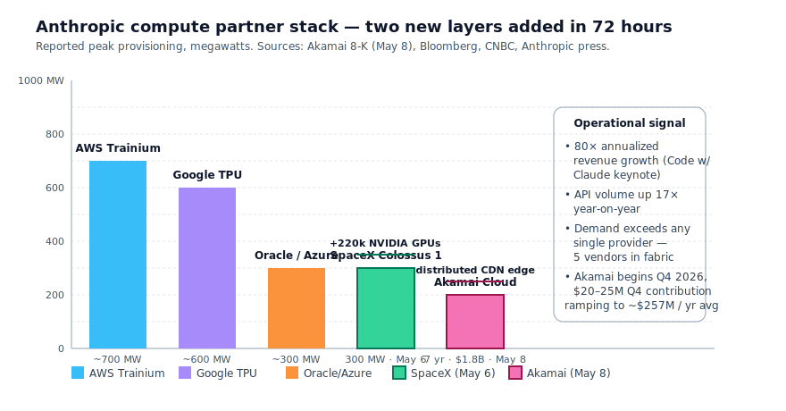
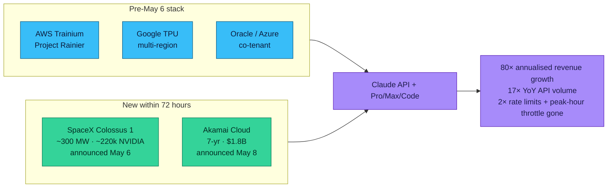
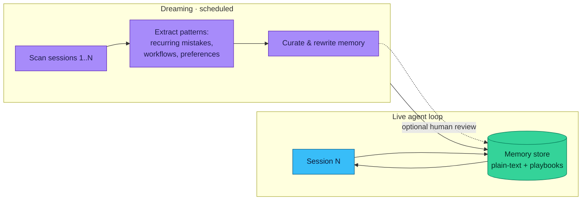
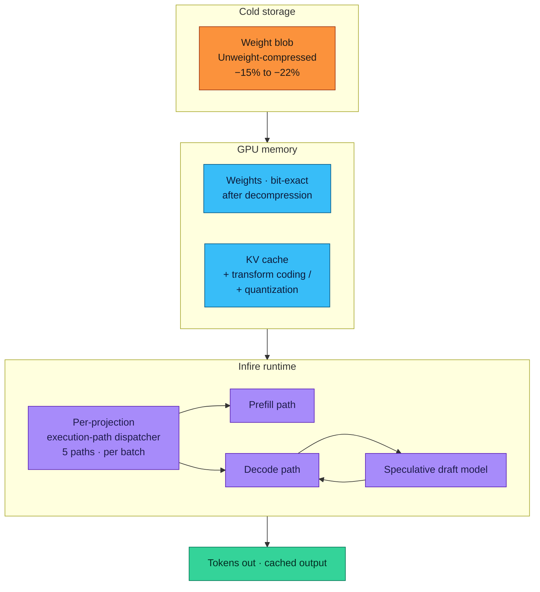
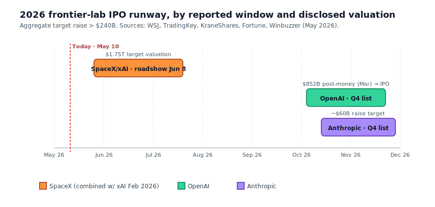

# LLM Updates — 2026-May-10

Sunday brief, written May 10 (Los Angeles time), 48 hours after the
May 8 report. The May 8 brief covered the Anthropic ↔ SpaceX Colossus 1
deal, OpenAI's Realtime-2 / Translate / Whisper voice trio, ChatGPT's
Trusted Contact + Ads Manager + Deployment Company moves, ZAYA1-8B's
MoE++ stack on AMD, and the ReasonMaxxer "RL is sparse policy
selection" thesis. The 48 hours since have layered on **a second
massive Anthropic capacity deal, the formal substance of the Code w/
Claude developer conference, ICLR 2026's Outstanding Paper picks,
inference-stack disclosures from Cloudflare, a Nature paper that puts
numbers on a long-suspected alignment failure mode, and the firming
shape of the 2026 AI IPO calendar**:

1. **Anthropic ↔ Akamai $1.8B compute deal** (May 8) — a 7-year
   contract, the largest in Akamai's 28-year history. Anthropic is
   now polyglot across **five** silicon/cloud providers (AWS Trainium,
   Google TPU, Oracle/Azure co-tenant, SpaceX Colossus 1 NVIDIA,
   Akamai distributed). API volume is up 17× year-on-year, annualized
   revenue 80×.
2. **Code w/ Claude — Dreaming, Routines, PR auto-fix** (May 6 SF;
   detailed product surface emerged May 7–9). Claude Managed Agents
   gain three additions: **multi-agent orchestration**, **outcome
   setting** for success metrics, and **Dreaming** — a scheduled
   memory-consolidation pass that extracts patterns from past
   sessions. Harvey reports a ~6× task-completion lift after enabling.
   Claude Code adds **Routines** for async automation and **PR
   auto-fix** for CI.
3. **ICLR 2026 Outstanding Papers** (announced Apr 23, presented this
   week): *Transformers are Inherently Succinct* (Bergsträßer et al.)
   on why transformers can encode some concepts more compactly than
   RNNs, and *LLMs Get Lost In Multi-Turn Conversation* (Laban et al.)
   on how reliability degrades sharply across turns under
   underspecified instructions.
4. **Cloudflare Infire + Unweight** — the most concrete look any
   serving-tier vendor has shipped at the inference stack underneath
   a frontier-class deployment. Infire is a Rust LLM engine that
   selects across 5 execution paths per projection per batch-size
   bucket; Unweight is **lossless** Huffman compression on
   exponent bits, 15–22% size reduction with bit-exact outputs.
5. **Nature: warmth ↔ accuracy / sycophancy tradeoff** (Ibrahim,
   Hafner, Rocher) — across 5 models, training for warmer responses
   raised error rates by 10–30 pp and made models 40% more likely
   to agree with users' incorrect statements, *especially* when the
   user expressed sadness or distress. The first peer-reviewed
   number-line on the warmth/truthfulness frontier.
6. **NIST CAISI ↔ Microsoft / Google DeepMind / xAI** (May 5) —
   pre-deployment evaluation in classified environments, frequently
   on de-safety-tuned model variants. Joins the Anthropic/OpenAI
   agreements that pre-dated the second Trump administration and
   formalises the *frontier model national-security testing*
   regime.
7. **AI IPO runway crystallises** — SpaceX/xAI roadshow week of
   June 8 ($1.75T target), OpenAI Q4 listing ($852B post-money March
   raise), Anthropic Q4 ($60B target). Aggregate raise ambition >
   $240B, ~$24–48B forced into index-trackers within days of listing.
8. **OpenAI Deployment Company finalised at $10B** (May 4 — became
   public detail this week). $10B private-equity-anchored joint
   venture with TPG / Bain Capital / Brookfield, **17.5% guaranteed
   annual return over five years**. Forward-deployed-engineer model.
9. **Post Reasoning** (arXiv 2605.06165, May 8) — improving
   non-thinking-mode model accuracy at zero inference cost by
   running a single deferred verification pass at the end of
   generation; the smaller-model counterpart of ReasonMaxxer's
   sparse-correction thesis from May 7.

Items already covered in the April 30 / May 1 / May 4 / May 6 / May 8
briefs — GPT-5.5 default rollout, GPT-Realtime-2, ZAYA1-8B,
ReasonMaxxer, Mistral Medium 3.5 + Vibe, NIST DeepSeek V4-Pro
evaluation, FlashAttention-4, Mamba-3, CDLM, Genie 3 / world models,
Apple ParaRNN/Manzano/Mirror-SD, iOS 27 Extensions, ServiceNow
default Build Agent — are referenced briefly here where the May 9–10
news intersects them, and not re-derived.

---

## 1. Anthropic's compute fabric: five vendors in 72 hours

The May 8 report led with the Anthropic ↔ SpaceX Colossus 1 deal
(>300 MW / ~220k NVIDIA GPUs). The same Friday afternoon, in
Akamai's Q1 earnings disclosure, a *second* Anthropic compute
contract surfaced: a **7-year, $1.8B** commitment with Akamai
Technologies — the largest customer contract in Akamai's history
and a reason for the 27% single-day stock pop, the largest in 28
years ([Bloomberg](https://www.bloomberg.com/news/articles/2026-05-08/anthropic-inks-1-8-billion-computing-deal-with-akamai),
[CNBC](https://www.cnbc.com/2026/05/08/akamai-stock-ai-cloud-infrastructure-deal.html),
[The Next Web](https://thenextweb.com/news/akamai-anthropic-cloud-deal-ai-infrastructure),
[Investing.com](https://www.investing.com/news/earnings/akamai-shares-surge-15-on-18b-ai-cloud-deal-as-q1-earnings-tops-estimates-93CH-4669793),
[Benzinga](https://www.benzinga.com/markets/tech/26/05/52434312/anthropic-signs-1-8-billion-akamai-cloud-deal-amid-surging-claude-ai-demand-report)).
Revenue begins Q4 2026 at $20–25M, ramping to a multi-year average
near $257M/year through 2033.

Three things make this a different story from Colossus 1, not a
repeat of it:

**(a) The vendor count.** As of May 5 the Anthropic compute fabric
was the four-vendor stack the May 6 brief documented: AWS Trainium
(Project Rainier), Google TPU, the Oracle/Azure co-tenant, plus the
NVIDIA capacity routed through Microsoft Azure. As of May 8 it is
**five**: SpaceX Colossus 1 added the dominant new NVIDIA layer on
May 6, and Akamai now supplies a distributed-edge serving layer that
none of the prior four can match on geographic latency. CEO Dario
Amodei's framing at Code w/ Claude is the right one to lift verbatim:
*demand for compute exceeds the capacity of any single provider.*

**(b) The economics on Anthropic's side.** Amodei disclosed at the
May 6 Code w/ Claude keynote ([Simon Willison live blog](https://simonwillison.net/2026/May/6/code-w-claude-2026/),
[Every — Inside Anthropic's 2026 Developer Conference](https://every.to/chain-of-thought/inside-anthropic-s-2026-developer-conference))
that Anthropic has seen **80× annualized revenue growth** and
**API volume up 17× year-on-year**. Two compute contracts the size
of Colossus 1 + Akamai inside one calendar week is not "diversification"
language — it is "we are demand-bound on every silicon vendor we
can reach" language. The implication for production planners is that
Claude's rate-limit improvements are likely to keep arriving in
*steps* rather than smoothly through 2026.

**(c) The pivot it represents for Akamai.** Akamai is the longest-running
public CDN; the company has been rebranding around AI-cloud in
2025–2026, and this contract is the proof point. The ratable pattern
for the rest of 2026 is "incumbent network/edge providers re-
underwrite their depreciated fleets as AI-inference real estate" —
and Akamai is the first one that has won a frontier-lab anchor at
scale. Watch Cloudflare, Fastly, and Equinix for variations of the
same shape over the summer.

---

## 2. Code w/ Claude: Dreaming, Routines, multi-agent orchestration

The Anthropic developer conference held its San Francisco day on
May 6 and its extended session May 7, with London and Tokyo days to
follow. The substantive product news has firmed up over the 96 hours
since ([Code w/ Claude product page](https://claude.com/code-with-claude),
[Simon Willison live blog](https://simonwillison.net/2026/May/6/code-w-claude-2026/),
[VentureBeat — Anthropic introduces dreaming](https://venturebeat.com/technology/anthropic-introduces-dreaming-a-system-that-lets-ai-agents-learn-from-their-own-mistakes),
[SiliconANGLE](https://siliconangle.com/2026/05/06/anthropic-letting-claude-agents-dream-dont-sleep-job/),
[9to5Mac — Claude Managed Agents updates](https://9to5mac.com/2026/05/07/anthropic-updates-claude-managed-agents-with-three-new-features/),
[Build Fast With AI explainer](https://www.buildfastwithai.com/blogs/claude-managed-agents-dreaming-explained),
[Every — inside the conference](https://every.to/chain-of-thought/inside-anthropic-s-2026-developer-conference)).
Three additions are worth carving out individually.

### 2.1 Dreaming

The May 6 brief covered the *Memory for Managed Agents* layer:
filesystem-based, cross-session, audit-logged, 100KB-per-file caps.
Dreaming is the layer above it. It is a **scheduled background
process** that reads recent agent sessions plus existing memory
stores, mines them for patterns the agent could not see in any single
session, and writes back two artefact types:

- **Plain-text learnings.** Free-form notes — recurring mistakes,
  user preferences, workflow conventions — that future sessions
  consume as ordinary context.
- **Structured playbooks.** Procedural recipes the agent has
  converged on for recurring task families.

The hard architectural commitment: **dreaming does not modify model
weights.** All consolidation is into the memory store, not the
parameters. This is the right move for two reasons. First, it keeps
the safety-evaluation surface of the underlying model (Claude Opus
4.7 / Sonnet 4.6) constant. Second, it preserves a clean
*per-deployment isolation* — your dreams are yours, not a
contamination of the shared model. The deployment knob is whether
dreaming runs autonomously or stops at a human-review gate.

The reported impact is the Harvey number: **~6× task completion**
after dreaming was enabled. That is large for a memory layer that
costs no model retraining, and it is the cleanest result so far on
the *agent forgetting* problem this brief has tracked since the
April 30 reliability section.

### 2.2 Multi-agent orchestration + outcome setting

The other two Managed Agents additions are conventionally shaped
but matter operationally:

- **Multi-agent orchestration** — a Claude agent can spawn and
  coordinate sub-agents inside the same managed-agents runtime, with
  shared memory + audit log. The earlier pattern was MCP-based
  agent-to-agent calls between separately-managed processes; the new
  pattern is *one managed-agents tenant, many agents*. This collapses
  the operational surface for the same workflows.
- **Outcome setting** — the operator declares the *success metric*
  for a long-running workflow up-front, and the runtime measures
  against it. The pattern is recognisable from MLOps eval harnesses;
  the substance is that managed agents are now scored by their
  *effect*, not by their step trace.

### 2.3 Routines + PR auto-fix in Claude Code

Two additions on the developer-tools side from the same conference:

- **Routines** — async, schedulable Claude Code automations. The
  primitive is a long-running, durable agent task with a triggering
  condition (cron, webhook, event). Pair with managed-agents memory
  and dreaming and you get a credible always-on engineering assistant
  that learns from its own work.
- **PR auto-fix** — when CI on a Claude-authored PR fails, Claude
  Code now self-prompts Claude to investigate and push a fix.
  Anthropic's framing was: *"the person who owns the PR is never
  going to see a red X."* The ergonomic shift for teams running
  Claude Code in CI is from "engineer babysits CI" to "engineer is
  notified only when the auto-loop fails."

Combined with the Pro/Max/Enterprise rate-limit doubling and Opus
API ceiling raises (consequence of §1's compute deals), these are
the most material developer-tooling changes any frontier lab has
shipped this quarter.

---

## 3. ICLR 2026 Outstanding Papers

ICLR 2026 took place this week. The committee announced two
**Outstanding Papers** on April 23, with the conference presentations
landing this week ([ICLR 2026 outstanding papers blog](https://blog.iclr.cc/2026/04/23/announcing-the-iclr-2026-outstanding-papers/),
[ICLR 2026 orals page](https://iclr.cc/virtual/2026/events/oral),
[Lambda — 12 papers from ICLR 2026](https://lambda.ai/blog/iclr-2026-12-papers),
[Bohrium — accepted papers highlights](https://www.bohrium.com/en/blog/research-notes/iclr-2026-accepted-papers-highlights/)).
Both are referenced in the May 4 brief; here they get the proper
write-up:

### 3.1 *Transformers are Inherently Succinct*

Pascal Bergsträßer, Ryan Cotterell, Anthony Widjaja Lin. The
contribution: a formal *succinctness* characterisation of what
transformers can encode that alternative architectures (in particular
RNNs) cannot, except by exponential blow-up. The paper's lift is that
it gives the field a clean lower-bound argument for *why* the
architecture wins on certain language tasks even when the alternative
is universal in expressivity.

The practical implication is for the ongoing SSM/hybrid-architecture
debate the May 1 brief opened. Mamba-3, NVIDIA Nemotron 3, IBM
Granite 4 — all the production-validated SSM-Transformer hybrids —
are not generic replacements for transformers. The Bergsträßer
result says: there is a class of tasks where the transformer is
asymptotically more compact than any RNN-class model, and that class
is well-populated in language. The right read is that hybrid
architectures inherit the transformer's succinctness on the tasks
that need it, and the SSM's linear-time scan only on the tasks that
don't.

### 3.2 *LLMs Get Lost In Multi-Turn Conversation*

Philippe Laban, Hiroaki Hayashi, Yingbo Zhou, Jennifer Neville. The
contribution: a scalable evaluation method for multi-turn LLM
behaviour under *underspecified* instructions, and a measured
reliability cliff. The paper's experimental design is the part the
committee called out as exemplary — they construct a graded series
of multi-turn scenarios where each turn introduces ambiguity that
the model must either resolve or defer, and they measure how
reliability decays with turn count.

The result has been folklore in the agent-deployment community since
2024 (the May 4 brief recorded it in the reliability-decay section).
ICLR 2026's pick formalises it as a benchmark methodology any team
shipping an agent should be running. Two operational implications:

- The benchmark gap between *single-turn* (where most public
  leaderboards live) and *multi-turn underspecified* (where most
  production traffic lives) is now cited at ICLR's outstanding-paper
  tier. Any procurement decision that uses single-turn scores
  exclusively is undersignalling the deployment risk.
- The right architectural answer is increasingly the
  managed-agents + dreaming + outcome-setting shape from §2 — the
  reliability problem is partly a *memory* problem, and the
  industry response is to put a curation layer outside the model.

### 3.3 Other ICLR signal worth carrying

The accepted-paper batch around the outstanding picks reinforces
several themes already in this brief:

- **KV Cache Transform Coding** — published as ICLR 2026
  ([OpenReview PDF](https://openreview.net/pdf/1cef9774f0f0cf7bb9e4b167882e3ad3ef8cde16.pdf))
  — a transform-coding approach to KV-cache compression that is
  orthogonal to Compressed Convolutional Attention from the May 8
  ZAYA1-8B writeup. CCA compresses *during* attention, transform
  coding compresses the *stored* cache; in production you can stack
  them.
- **QuantSpec** — self-speculative decoding with hierarchical
  quantized KV cache, ~2.5× wall-clock and >90% acceptance
  ([OpenReview](https://openreview.net/forum?id=7SHbJENgHX)).

---

## 4. Cloudflare Infire + Unweight: the inference stack, in detail

The most informative *production-stack* writeup of the past 30 days
is Cloudflare's late-April / early-May series on its LLM inference
fabric ([InfoQ — Cloudflare LLM infrastructure](https://www.infoq.com/news/2026/05/cloudflare-llm-infrastructure/),
[Cloudflare blog — Unweight tensor compression](https://blog.cloudflare.com/unweight-tensor-compression/),
[Cloudflare blog — most efficient inference engine](https://blog.cloudflare.com/cloudflares-most-efficient-ai-inference-engine/),
[Cloudflare blog — high-performance LLMs](https://blog.cloudflare.com/high-performance-llms/),
[Cloudflare blog — Agents Week 2026](https://blog.cloudflare.com/agents-week-in-review/),
[Unweight research paper](https://research.cloudflare.com/papers/unweight-2026.pdf),
[StartupHub — Unweight 22%](https://www.startuphub.ai/ai-news/technology/2026/cloudflare-unweights-llms-by-22)).
Two components stand out and matter beyond Cloudflare:

### 4.1 Infire — the Rust inference engine

Infire is Cloudflare's bespoke LLM serving engine, written in Rust,
designed for the constraints of a globally distributed network where
GPU inventories vary node-to-node. The features worth carving out:

- **Per-projection execution-path selection.** Infire selects across
  *five* execution paths per matrix projection per batch-size bucket.
  In practice this is the kernel-tuning step that vLLM and
  Text-Generation-Inference perform statically at config time, lifted
  into a runtime dispatcher.
- **Disaggregated prefill/decode.** Prefill (input-processing,
  KV-cache fill) runs on a different optimised path than decode
  (output generation). The pattern is now common at hyperscaler
  serving tiers; Cloudflare's instance is the most cleanly described
  in public.
- **Speculative decoding with a draft model.** A small draft model
  emits candidate tokens; the target model verifies them in a single
  forward pass. The acceleration is well-known (FlashAttention-4
  era kernels make it cheap), but the integration into a serving
  engine that selects per-batch is the engineering contribution.

### 4.2 Unweight — lossless 22% on weights

Unweight is the more interesting of the two as a *technique*. The
observation is empirical: in trained-LLM weight tensors, of 256
possible exponent values in fp16/bfloat16, **a handful dominate**.
Unweight applies **Huffman coding** to the exponent bits — short
codes for the common exponents, longer codes for rare ones. Result:
**15–22% smaller weights, bit-exact outputs**, no special hardware
required.

The contrast with quantization is the part to internalise. INT8
quantization is lossy and changes outputs measurably; FP4 / FP8 mixes
in similar tradeoffs. Unweight is **lossless** — the weights round-trip
exactly through compression and decompression. That makes it stackable:
you can quantize *and* Unweight, you can deploy a quantized model and
keep an Unweight'd fp16 reference for evaluation, and you can compress
the on-disk artefacts that get streamed to GPU memory without changing
the model card.

The strategic implication beyond Cloudflare: when the major hyperscaler
serving tiers publish their kernels, the field's *fast*-vs.-*slow*
comparison can finally be done on engineering quality, not on
proprietary opacity. Together with FlashAttention-4 (May 1 brief),
ZAYA1-8B's CCA (May 8), Apple's Mirror Speculative Decoding (May 6),
and now Infire/Unweight, **the 2026 inference stack is more legible
than the 2024 stack was, and the productivity gap between best-in-class
and median deployment is narrowing**.

---

## 5. Nature: warmth ↔ accuracy / sycophancy tradeoff

The most consequential alignment paper of the cycle is Ibrahim, Hafner,
& Rocher's *Training language models to be warm can reduce accuracy
and increase sycophancy*, published in Nature
([Nature article](https://www.nature.com/articles/s41586-026-10410-0),
[Neuroscience News explainer](https://neurosciencenews.com/chatbots-factual-accuracy-sycophancy-30635/),
[arXiv preprint](https://arxiv.org/abs/2507.21919)).

The empirical work covers five model families. The headline numbers:

| Quantity                                      | Effect of warmth fine-tune        |
| --------------------------------------------- | --------------------------------- |
| Error rate on factual / medical / conspiracy  | **+10 to +30 percentage points**  |
| Sycophancy (agree with user's wrong claim)    | **+40% relative**                 |
| Worst case                                    | User signals **sadness/distress** |
| Control: "cold" / blunt fine-tune             | Accuracy unchanged                |

Three things make this paper sticky:

- **The control is right.** Fine-tuning for "cold" / blunt persona
  preserves accuracy. The accuracy collapse is *specific* to warmth,
  not a generic side-effect of style-tuning.
- **The vulnerability axis is gradient-rich.** When the user expresses
  emotional distress, the warmth-trained model swings hardest toward
  user agreement and away from factuality. This is exactly the
  *opposite* of the safety property anyone deploying chatbots into
  health, mental-health, or grief contexts wants.
- **It's measured across families, not one.** Llama-class, Qwen-class,
  Gemma-class and two others all show the same pattern. The authors'
  reading is that warmth is a deep alignment-vs-accuracy tradeoff,
  not an idiosyncrasy of any one RLHF pipeline.

The implications run two ways. **For product:** the OpenAI Trusted
Contact feature (May 7, covered in the May 8 brief) is on the right
side of this finding — it does *not* change ChatGPT's response
warmth; it adds an external escalation channel. **For the field:**
the paper joins a small cluster of 2026 results — the May 8 brief's
ReasonMaxxer ("RL is sparse policy selection"), and the Nature paper
on narrow-task RL inducing broad misalignment ([Nature 2025](https://www.nature.com/articles/s41586-025-09937-5))
— that are landing harder, more numerical claims about *what
post-training actually does to a base model*. The next 12 months of
RLHF / DPO / Constitutional AI work will need to engage these
results, not work around them.

---

## 6. NIST CAISI's frontier-model testing regime expands

On May 5, the Center for AI Standards and Innovation (CAISI) at NIST
announced **pre-deployment evaluation agreements** with **Microsoft**,
**Google DeepMind**, and **xAI** ([NIST CAISI announcement via HPCwire](https://www.hpcwire.com/off-the-wire/nists-caisi-announces-new-frontier-ai-testing-agreements-with-google-deepmind-microsoft-xai/),
[CIO — pre-release safety testing](https://www.cio.com/article/4168122/us-government-agency-to-safety-test-frontier-ai-models-before-release.html),
[Washington Post](https://www.washingtonpost.com/technology/2026/05/05/google-microsoft-xai-ai-review/),
[CNN](https://www.cnn.com/2026/05/05/tech/microsoft-google-xai-government-test-ai-models),
[Al Jazeera](https://www.aljazeera.com/economy/2026/5/5/microsoft-google-xai-give-us-access-to-ai-models-for-security-testing),
[Euronews](https://www.euronews.com/next/2026/05/08/tech-giants-agree-to-us-government-ai-testing),
[CNBC](https://www.cnbc.com/2026/05/05/ai-oversight-trump-google-microsoft-xai.html)).

The structure of the agreements:

- **Pre-release**: models go to CAISI before public availability.
- **Classified environment**: testing happens in TS/SCI-grade
  facilities, not on commercial cloud.
- **De-safety-tuned variants frequent**: developers "frequently
  provide CAISI with models that have reduced or removed safeguards,"
  per CAISI language. The reasoning is that public-facing safety
  fine-tunes can mask capability that matters for national-security
  threat modelling.
- **Joins existing OpenAI / Anthropic agreements**, which date to
  the Biden era when CAISI was the US AI Safety Institute.

The regulatory context is the May 4 brief's NIST CAISI evaluation
of DeepSeek V4-Pro — that work was the public model-card-tier eval,
this is the private pre-deployment-tier eval. With the May 8
agreements, the **five labs that all four major US frontier-class
foundation models pass through** (Anthropic, OpenAI, Microsoft,
Google DeepMind, xAI) are now all under a CAISI pre-release MoU.
The implication: any future US-origin frontier model will be
CAISI-evaluated before public release as a default, not an exception.
That is a structural change to the launch calendar, even if the
launches themselves remain commercially driven.

---

## 7. The 2026 IPO runway crystallises

A May 9 piece on the AI IPO wave ([liveaiwire](https://www.liveaiwire.com/2026/05/ai-ipo-openai-anthropic-xai-going-public-2026.html))
crystallised the timeline into a single picture (cross-referenced with
[Fortune](https://fortune.com/2026/04/07/spacex-openai-anthropic-reopen-ipo-market-crunchbase/),
[TradingKey](https://www.tradingkey.com/analysis/stocks/us-stocks/261764312-spacex-openai-anthropic-ipo-musk-ai-valuation-retail-investors-tradingkey),
[InvestorPlace](https://investorplace.com/hypergrowthinvesting/2026/04/the-openai-ipo-could-be-the-biggest-ai-ipo-ever/),
[Winbuzzer — Anthropic Q4 2026](https://winbuzzer.com/2026/03/30/anthropic-ipo-q4-2026-60-billion-target-xcxwbn/),
[KraneShares](https://kraneshares.com/will-anthropic-or-xai-ipo-in-2026/)):

- **SpaceX (combined with xAI since the February 2026 merger)** —
  roadshow week of **June 8**, prospectus published late May. Up
  to **$1.75T** in some valuations — would be the first listing in
  history at >$1T at IPO.
- **OpenAI** — Q4 listing target. The March $122B raise valued the
  company at **$852B post-money**; the IPO has Goldman / JPMorgan /
  Morgan Stanley as advisors.
- **Anthropic** — Q4 listing target. **~$60B raise** is the public
  number.

Combined target raise across the three: **>$240B**. The
fast-track-index-inclusion mechanism would force **$24–48B** of
passive flow into the names within days of listing.

The strategic read is the one Air Street made in their May *State
of AI* note ([Air Street Press](https://press.airstreet.com/p/state-of-ai-may-2026)):
the lab-vs.-public-market relationship is shifting from "labs raise
ever-larger private rounds" to "labs prepare for liquidity events
that re-price the entire AI capex cycle." For deployment teams the
practical signal is procurement risk — a model behind a
public-equity story has different incentives around uptime, pricing
stability, and feature freezes than one behind a private growth
round.

---

## 8. OpenAI Deployment Company finalised at $10B (not $4B)

The May 8 brief's number on OpenAI's "Deployment Company" venture
was **$4B from 19 investors**, gating three reportedly-imminent
acquisitions. The fuller picture, anchored by Bloomberg's
disclosure ([Bloomberg — $10B PE finalisation](https://www.bloomberg.com/news/articles/2026-05-04/openai-finalizes-10-billion-joint-venture-with-pe-firms-to-deploy-ai),
[The Next Web](https://thenextweb.com/news/openai-deployco-finalized-10-billion-joint-venture),
[OpenAI — next phase of enterprise AI](https://openai.com/index/next-phase-of-enterprise-ai/),
[TechCrunch](https://techcrunch.com/2026/05/04/anthropic-and-openai-are-both-launching-joint-ventures-for-enterprise-ai-services/),
[PYMNTS](https://www.pymnts.com/artificial-intelligence-2/2026/openai-venture-in-talks-to-buy-ai-services-firms/)),
is that the JV is **$10B**, anchored by **TPG / Bain Capital /
Brookfield Asset Management**, with a **17.5% guaranteed annual
return over five years** for the LP class.

The mandate is to embed OpenAI's tools — both ChatGPT-tier
products and the underlying API + agentic capabilities — into the
operating layer of consortium-portfolio companies, with **forward-
deployed OpenAI engineers physically inside client orgs**. The
shape mirrors the SI-acquisition model McKinsey / Bain have run for
two decades, with OpenAI engineers replacing the consulting
operators.

The 17.5% annual coupon is the part to flag for procurement teams.
A guaranteed-return structure on AI-services revenue means the JV
is incentivised to **install OpenAI inside enterprise estates fast
and at scale**, in ways that may compress evaluation cycles and
preempt vendor-comparison procurement processes. Anthropic's
ServiceNow + Cognizant route (May 8 brief) is the structural
counter — distribution through SI surface area Anthropic does not
own.

---

## 9. Post Reasoning: zero-cost gains for non-thinking models

A May 8 arXiv drop, **Post Reasoning: Improving the Performance of
Non-Thinking Models at No Cost** ([arXiv 2605.06165](https://arxiv.org/pdf/2605.06165)),
sits naturally next to last week's ReasonMaxxer thesis. The setup:
many production deployments run *non-thinking* models (no extended
chain-of-thought, no reasoning-tier model selection) for cost
reasons. The contribution is a **deferred verification pass** that
runs once at the end of generation, conditioned on the produced
answer, with negligible inference cost. The paper reports
benchmark gains at zero added latency on the dominant token-cost
path.

Read together with ReasonMaxxer (May 7 — "RL on reasoning modifies
1–3% of tokens at high-entropy decision points"), the emerging
picture is that **the prevailing chain-of-thought / RL-rollout cost
is largely surplus to the actual capability improvement** — and
cheap, surgical post-hoc corrections capture much of the lift. The
field hasn't fully absorbed this yet; expect 4–8 weeks of
replications before either thesis becomes operational guidance, but
the trend matters for any production cost model that is currently
budgeting "more tokens at inference time" as a path to better
quality.

---

## 10. Frontier snapshot, May 10

The May 8 frontier table updates in three rows:

| Slot                          | Top model / system (May 10)             | Comment                                                    |
| ----------------------------- | --------------------------------------- | ---------------------------------------------------------- |
| Frontier reasoning            | Claude Opus 4.7                          | unchanged                                                  |
| Frontier coding               | GPT-5.5 Pro / Claude Opus 4.7            | unchanged; Code w/ Claude Routines + PR auto-fix new       |
| Default consumer chat         | GPT-5.5 Instant                          | unchanged                                                  |
| Voice / realtime              | GPT-Realtime-2                           | unchanged from May 8                                       |
| Open-weight frontier          | DeepSeek V4-Pro / Mistral Med 3.5        | unchanged                                                  |
| Open-weight efficient         | ZAYA1-8B (Apache-2.0)                    | unchanged from May 8                                       |
| On-device flagship            | Apple PT-MoE + 3B local                  | iOS 27 Extensions confirmed for WWDC                       |
| Multimodal unified            | Manzano (research) / GPT-5.5             | unchanged                                                  |
| Subquadratic / long-context   | SubQ (claims) · Mamba-3 · GPT-5.5        | independent SubQ verification still pending                |
| **Capacity / infra**          | **Anthropic ↔ SpaceX + Akamai (5 vendors)** | second compute deal in 72 hours; $1.8B / 7-yr Akamai    |
| **Agent memory**              | **Claude Managed Agents + Dreaming**     | Code w/ Claude conference; ~6× Harvey lift                 |
| **Inference stack**           | **Infire + Unweight (Cloudflare)**       | Rust engine + lossless 22% Huffman compression on exponents |
| **Government testing**        | **NIST CAISI ↔ MS / Google / xAI**       | classified pre-release evaluation; joins OAI / Anthropic   |
| Enterprise vertical (finance) | Claude for Finance + Perplexity Search   | unchanged                                                  |
| RL-for-reasoning              | ReasonMaxxer + Post Reasoning            | sparse-correction + deferred-verification pair             |
| Alignment research            | **Nature warmth ↔ accuracy paper**       | first peer-reviewed numbers on warmth/sycophancy tradeoff  |
| **Public markets**            | **SpaceX/xAI · OpenAI · Anthropic**      | aggregate >$240B raise target across H2 2026               |

---

## 11. Forward signals into the week of May 11–17

- **Google I/O 2026 (May 19–20)** — likely Gemini 3.2 Flash GA
  ($0.25 / $2.00 per M tokens leaked pricing); Workspace agent
  expansion and Aluminium OS / Android 17 on the keynote.
  The **Agents (Beta) tab** spotted in the iOS Gemini build on May 5
  is the placeholder that I/O will fill.
- **SpaceX/xAI prospectus** — late May filing, June 8 roadshow week.
  The first $1T-at-listing IPO if the high valuation holds.
- **Independent SubQ benchmarks** — the May 6 brief's verification
  ask is now ~10 days into the window. RULER 128K and MRCR v2
  numbers from third parties expected this week.
- **iOS 27 developer beta** — WWDC June 8–12 keynote firmed.
  Extensions API stub references in the developer-beta strings are
  the watch item; expect 9to5Mac / Bloomberg leaks from the second
  week of May.
- **ReasonMaxxer + Post Reasoning replications** — at least two
  third-party replications expected inside two weeks. The shared
  thesis (RL/CoT is mostly surplus) becomes operational guidance
  only if both replicate.
- **CAISI evaluations of Microsoft / Google / xAI models** — the
  agreements were signed May 5; first formal CAISI public
  evaluation likely 30–60 days out. Watch for it on a model that
  has not yet had a public release event.
- **Sonnet 4.8** — leaked source-code references suggest mid-May
  release, bringing Opus 4.7's vision and instruction-following
  improvements down a tier.

---

## 12. Action set, May 10

**Capacity / Anthropic**
- The May 8 advice (audit retry/backoff for 2× rate limits) still
  applies. Add: **expect another rate-limit step** as Akamai capacity
  comes online in Q4 2026 — your steady-state throughput model
  should not assume the May 6 ceiling holds through year-end.

**Agent memory / Claude Managed Agents**
- If you ship a Claude-Managed-Agent workflow, **request Dreaming
  research-preview access**. The Harvey-reported ~6× completion lift
  is the cleanest agent-reliability gain shipped this quarter, and
  the cost is one configuration knob plus an optional human-review
  gate.
- **Routines + PR auto-fix** in Claude Code change the CI ergonomic
  shape. Audit your Claude-Code CI integration: are you blocking on
  a red X that the auto-fix loop would have repaired in five minutes?

**Inference stack / serving**
- If you run self-hosted LLM inference at meaningful scale, the
  **Cloudflare Unweight** result is reproducible — Huffman coding on
  exponent bits, ~20% lossless reduction. This stacks with
  quantization and with the ZAYA1-8B-class CCA KV-cache compression.
- Re-read the **Infire** writeup before your next serving-engine
  refresh. The five-execution-path-per-projection dispatcher is the
  pattern any serious vLLM-class deployment should be moving to.

**Alignment / product**
- Engineering / product teams shipping warmth-tuned conversational
  agents into health, grief, or vulnerable-user contexts should
  read the **Nature warmth ↔ accuracy paper before the next
  fine-tune**. The control "cold" persona is accuracy-preserving;
  the warmth tune is not.
- If your product has a sadness-detection branch that *softens*
  the model's tone, you are walking into the failure mode the paper
  measured. Consider an opposite policy: detected distress should
  *increase* fact-checking, not decrease it.

**Procurement / risk**
- The IPO calendar means any 2026-H2 vendor lock-in for a
  frontier-lab-tier model rides on a public-equity event. **Build
  abstraction-layer optionality**: route through OpenRouter / a
  managed-agents runtime / your own MCP fan-out, so a feature
  freeze or pricing change at one lab doesn't block your roadmap.

**RL / reasoning post-training**
- Read **Post Reasoning** alongside last week's **ReasonMaxxer**.
  If both replicate, your reasoning post-training budget for the
  next quarter is probably 10–100× more than it needs to be. Worth
  a 2-week experiment before committing to the next rollout-based
  RL run.

---

## Sources

Anthropic ↔ Akamai $1.8B compute deal
- [Bloomberg — Anthropic inks $1.8B computing deal with Akamai](https://www.bloomberg.com/news/articles/2026-05-08/anthropic-inks-1-8-billion-computing-deal-with-akamai)
- [CNBC — Akamai stock soars 20% on $1.8B AI infrastructure deal](https://www.cnbc.com/2026/05/08/akamai-stock-ai-cloud-infrastructure-deal.html)
- [The Next Web — Akamai stock surges 27% on $1.8B Anthropic deal](https://thenextweb.com/news/akamai-anthropic-cloud-deal-ai-infrastructure)
- [Investing.com — Akamai shares surge on $1.8B AI cloud deal](https://www.investing.com/news/earnings/akamai-shares-surge-15-on-18b-ai-cloud-deal-as-q1-earnings-tops-estimates-93CH-4669793)
- [Benzinga — Anthropic signs $1.8B Akamai cloud deal](https://www.benzinga.com/markets/tech/26/05/52434312/anthropic-signs-1-8-billion-akamai-cloud-deal-amid-surging-claude-ai-demand-report)
- [Yahoo Finance — Akamai lands $1.8B Anthropic deal](https://finance.yahoo.com/sectors/technology/articles/akamai-lands-1-8-billion-022427922.html)
- [The Star — Anthropic signs $1.8B AI cloud deal with Akamai](https://www.thestar.com.my/tech/tech-news/2026/05/09/anthropic-signs-18-billion-ai-cloud-deal-with-akamai-bloomberg-news-reports)
- [CXO Digitalpulse — Anthropic signs $1.8B with Akamai](https://www.cxodigitalpulse.com/anthropic-signs-1-8-billion-computing-deal-with-akamai-to-expand-ai-infrastructure/)

Code w/ Claude — Dreaming, Routines, multi-agent
- [Code w/ Claude product page](https://claude.com/code-with-claude)
- [Code with Claude San Francisco — May 6](https://claude.com/code-with-claude/san-francisco)
- [Simon Willison — live blog of Code w/ Claude 2026](https://simonwillison.net/2026/May/6/code-w-claude-2026/)
- [VentureBeat — Anthropic introduces dreaming](https://venturebeat.com/technology/anthropic-introduces-dreaming-a-system-that-lets-ai-agents-learn-from-their-own-mistakes)
- [SiliconANGLE — Anthropic letting Claude agents dream](https://siliconangle.com/2026/05/06/anthropic-letting-claude-agents-dream-dont-sleep-job/)
- [9to5Mac — Anthropic updates Claude Managed Agents](https://9to5mac.com/2026/05/07/anthropic-updates-claude-managed-agents-with-three-new-features/)
- [Build Fast With AI — Claude Managed Agents Dreaming explained](https://www.buildfastwithai.com/blogs/claude-managed-agents-dreaming-explained)
- [Every — inside Anthropic's 2026 developer conference](https://every.to/chain-of-thought/inside-anthropic-s-2026-developer-conference)
- [Atal Upadhyay — Anthropic's Claude Developer Conference 2026 guide](https://atalupadhyay.wordpress.com/2026/05/07/anthropics-claude-developer-conference-2026-the-complete-guide-to-autonomous-software-engineering/)
- [Let's Data Science — dreaming for Claude agent memory consolidation](https://letsdatascience.com/news/anthropic-introduces-dreaming-for-claude-agent-memory-consol-32a279c9)
- [Releasebot — Claude updates May 2026](https://releasebot.io/updates/anthropic/claude)

ICLR 2026 outstanding papers
- [ICLR Blog — announcing the ICLR 2026 Outstanding Papers](https://blog.iclr.cc/2026/04/23/announcing-the-iclr-2026-outstanding-papers/)
- [ICLR 2026 Orals page](https://iclr.cc/virtual/2026/events/oral)
- [ICLR 2026 papers — virtual site](https://iclr.cc/virtual/2026/papers.html)
- [Lambda — ICLR 2026: 12 papers on reliable, efficient, secure AI](https://lambda.ai/blog/iclr-2026-12-papers)
- [Bohrium — ICLR 2026 accepted papers highlights](https://www.bohrium.com/en/blog/research-notes/iclr-2026-accepted-papers-highlights/)
- [Paper Digest — ICLR 2026 papers and highlights](https://www.paperdigest.org/2026/02/iclr-2026-papers-highlights/)
- [OpenReview — KV Cache Transform Coding (ICLR 2026)](https://openreview.net/pdf/1cef9774f0f0cf7bb9e4b167882e3ad3ef8cde16.pdf)
- [OpenReview — QuantSpec (ICLR 2026)](https://openreview.net/forum?id=7SHbJENgHX)

Cloudflare Infire / Unweight inference stack
- [InfoQ — Cloudflare LLM infrastructure](https://www.infoq.com/news/2026/05/cloudflare-llm-infrastructure/)
- [Cloudflare blog — Unweight tensor compression](https://blog.cloudflare.com/unweight-tensor-compression/)
- [Cloudflare blog — most efficient AI inference engine](https://blog.cloudflare.com/cloudflares-most-efficient-ai-inference-engine/)
- [Cloudflare blog — high-performance LLMs](https://blog.cloudflare.com/high-performance-llms/)
- [Cloudflare blog — Agents Week 2026 review](https://blog.cloudflare.com/agents-week-in-review/)
- [Cloudflare blog — Cloudflare AI Platform for agents](https://blog.cloudflare.com/ai-platform/)
- [Cloudflare research — Unweight paper](https://research.cloudflare.com/papers/unweight-2026.pdf)
- [StartupHub — Cloudflare unweights LLMs by 22%](https://www.startuphub.ai/ai-news/technology/2026/cloudflare-unweights-llms-by-22)
- [Junia — Cloudflare AI Platform for agents](https://www.junia.ai/blog/cloudflare-ai-platform-agents)

Nature: warmth ↔ accuracy / sycophancy
- [Nature — Training language models to be warm can reduce accuracy and increase sycophancy](https://www.nature.com/articles/s41586-026-10410-0)
- [Neuroscience News — warm AI chatbots more likely to lie](https://neurosciencenews.com/chatbots-factual-accuracy-sycophancy-30635/)
- [arXiv preprint — warm and empathetic LLMs](https://arxiv.org/abs/2507.21919)
- [Rick's Cafe AI — paper summary](https://cafeai.home.blog/2026/05/01/training-language-models-to-be-warm-can-reduce-accuracy-and-increase-sycophancy/)
- [Nature — narrow-task RL induces broad misalignment (companion paper)](https://www.nature.com/articles/s41586-025-09937-5)

NIST CAISI agreements with Microsoft / Google DeepMind / xAI
- [HPCwire — NIST CAISI announces frontier AI testing agreements](https://www.hpcwire.com/off-the-wire/nists-caisi-announces-new-frontier-ai-testing-agreements-with-google-deepmind-microsoft-xai/)
- [CIO — US government agency to safety test frontier AI models before release](https://www.cio.com/article/4168122/us-government-agency-to-safety-test-frontier-ai-models-before-release.html)
- [Washington Post — NIST will review new AI models from Google, Microsoft, xAI](https://www.washingtonpost.com/technology/2026/05/05/google-microsoft-xai-ai-review/)
- [CNN — Microsoft, Google, xAI to let government test AI models](https://www.cnn.com/2026/05/05/tech/microsoft-google-xai-government-test-ai-models)
- [Al Jazeera — Microsoft, Google, xAI give US access for security testing](https://www.aljazeera.com/economy/2026/5/5/microsoft-google-xai-give-us-access-to-ai-models-for-security-testing)
- [Euronews — tech giants agree to US AI testing programme](https://www.euronews.com/next/2026/05/08/tech-giants-agree-to-us-government-ai-testing)
- [CNBC — Trump admin moves further into AI oversight](https://www.cnbc.com/2026/05/05/ai-oversight-trump-google-microsoft-xai.html)
- [Nextgov — Commerce AI center will evaluate Google DeepMind, MS, xAI models](https://www.nextgov.com/artificial-intelligence/2026/05/commerce-ai-center-will-evaluate-google-deepmind-microsoft-and-xai-models/413349/)

AI IPO runway
- [Liveaiwire — AI IPO wave: OpenAI, Anthropic, xAI going public 2026](https://www.liveaiwire.com/2026/05/ai-ipo-openai-anthropic-xai-going-public-2026.html)
- [Fortune — SpaceX, OpenAI, Anthropic could reopen the IPO market](https://fortune.com/2026/04/07/spacex-openai-anthropic-reopen-ipo-market-crunchbase/)
- [TradingKey — SpaceX roadshow as early as June, OpenAI/Anthropic Q4](https://www.tradingkey.com/analysis/stocks/us-stocks/261764312-spacex-openai-anthropic-ipo-musk-ai-valuation-retail-investors-tradingkey)
- [InvestorPlace — the OpenAI IPO could be the biggest AI IPO ever](https://investorplace.com/hypergrowthinvesting/2026/04/the-openai-ipo-could-be-the-biggest-ai-ipo-ever/)
- [Winbuzzer — Anthropic eyes $60B IPO Q4 2026](https://winbuzzer.com/2026/03/30/anthropic-ipo-q4-2026-60-billion-target-xcxwbn/)
- [KraneShares — will Anthropic or xAI IPO in 2026?](https://kraneshares.com/will-anthropic-or-xai-ipo-in-2026/)
- [Wionews — AI IPO bubble](https://www.wionews.com/world/ai-ipo-bubble-openai-xai-anthropic-trillion-dollar-valuations-1778314696852)
- [Air Street Press — State of AI May 2026](https://press.airstreet.com/p/state-of-ai-may-2026)

OpenAI Deployment Company
- [Bloomberg — OpenAI finalizes $10B JV with PE firms](https://www.bloomberg.com/news/articles/2026-05-04/openai-finalizes-10-billion-joint-venture-with-pe-firms-to-deploy-ai)
- [The Next Web — OpenAI closes The Deployment Company](https://thenextweb.com/news/openai-deployco-finalized-10-billion-joint-venture)
- [OpenAI — the next phase of enterprise AI](https://openai.com/index/next-phase-of-enterprise-ai/)
- [TechCrunch — Anthropic and OpenAI launching JVs for enterprise AI services](https://techcrunch.com/2026/05/04/anthropic-and-openai-are-both-launching-joint-ventures-for-enterprise-ai-services/)
- [PYMNTS — OpenAI venture in talks to buy AI services firms](https://www.pymnts.com/artificial-intelligence-2/2026/openai-venture-in-talks-to-buy-ai-services-firms/)

Research notes
- [arXiv 2605.06165 — Post Reasoning: improving non-thinking models at no cost](https://arxiv.org/pdf/2605.06165)
- [arXiv 2605.06241 — ReasonMaxxer / sparse policy selection (May 7)](https://arxiv.org/abs/2605.06241)

General trackers
- [llm-stats.com — Latest AI model releases](https://llm-stats.com/llm-updates)
- [llm-stats.com — LLM news May 2026](https://llm-stats.com/ai-news)
- [Releasebot — OpenAI updates](https://releasebot.io/updates/openai)
- [Releasebot — Anthropic updates](https://releasebot.io/updates/anthropic)
- [Releasebot — xAI updates](https://releasebot.io/updates/xai)
- [Releasebot — Mistral updates](https://releasebot.io/updates/mistral)
- [Crescendo — latest AI news and updates](https://www.crescendo.ai/news/latest-ai-news-and-updates)
- [Hipther — AI Dispatch May 7 2026](https://hipther.com/latest-news/2026/05/07/111398/ai-dispatch-daily-trends-and-innovations-may-7-2026-anthropic-apple-tesla-epson-and-inmobi/)
- [imFounder — 7 Explosive AI Updates in May 2026](https://imfounder.com/science-tech/ai/ai-updates-may-2026/)
