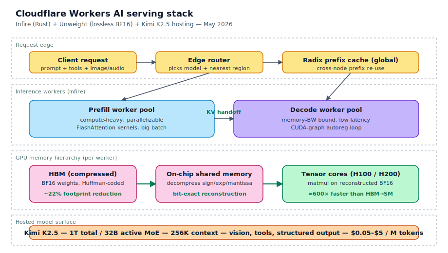
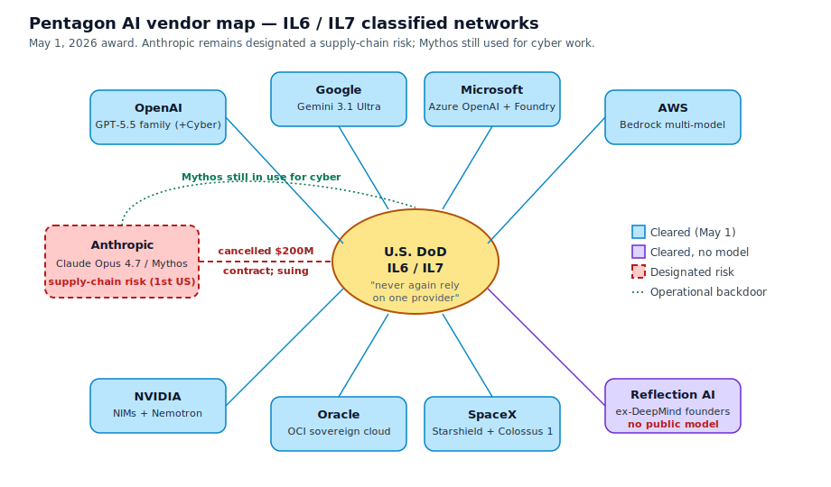
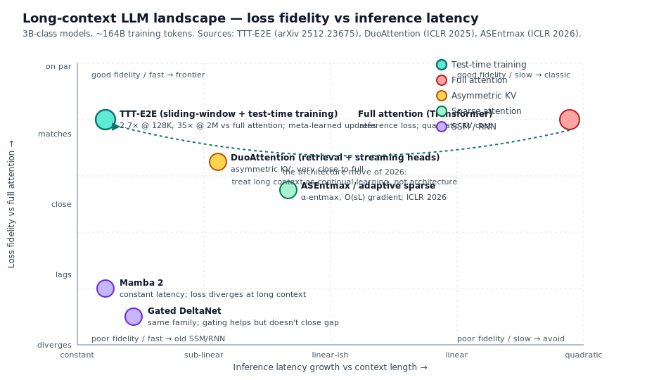
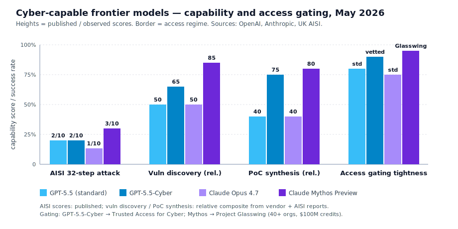

# LLM Updates — 2026-May-11

Monday brief, written May 11 (Los Angeles time). The May 8 report
covered the **Anthropic × SpaceX Colossus 1** capacity step, OpenAI's
voice-stack refresh (Realtime-2 / Translate / Whisper), ChatGPT's
trust-and-revenue surface (Trusted Contact, CPC ads, Deployment
Company), **Zyphra ZAYA1-8B** on AMD MI300x, the *ReasonMaxxer*
entropy-gated-RL paper, and the ServiceNow / Cognizant / Perplexity
plumbing layer. The 72 hours since have been almost entirely about
**cyber-permissive models, inference-engine economics, and the
Pentagon's deliberate de-Anthropic-ization** — plus the first of
two big calendar tent-poles (Google I/O, May 19–20) coming
visibly into view.

Five things to take away today:

1. **GPT-5.5-Cyber expanded preview (May 7–10)** — OpenAI shipped a
   *deliberately more permissive* security variant of GPT-5.5 to
   vetted defenders, alongside a new "Trusted Access for Cyber"
   gating regime. UK AISI's published evaluation puts GPT-5.5 at
   2/10 on a 32-step simulated corporate cyberattack vs Anthropic
   Claude Mythos Preview at 3/10 — the first head-to-head, both
   models red-team-grade, both behind heavy access controls.
2. **Cloudflare *Infire* + *Unweight* + Kimi K2.5 on Workers AI** —
   Cloudflare published the technical write-up of a Rust-based
   inference engine that disaggregates prefill from decode and a
   **lossless BF16 compressor** that cuts MLP weight footprint by
   ~22% with bit-exact reconstruction (no quantization quality loss).
   They're now hosting **Kimi K2.5** with a 256K context as a
   first-class Workers AI model. The serving-stack frontier moved.
3. **Pentagon's "never-again single-vendor" doctrine (May 1 → May 7)**
   — DoD's published rationale for the eight-vendor IL6/IL7 award
   crystallized this week: AI provider concentration is now an
   explicitly disqualifying procurement risk, **Anthropic remains
   designated a supply-chain risk** despite the appeals court
   declining to lift it, and the DoD is still using Claude Mythos
   Preview for cyber work even while procurement is frozen. The
   policy posture matters more than the contracts.
4. **End-to-End Test-Time Training (TTT-E2E)** is the long-context
   architecture paper getting reread this week — a 3B model with
   sliding-window attention plus end-to-end meta-learned test-time
   updates matches full-attention loss scaling, runs at **constant
   latency vs context length**, and shows 2.7× speedup at 128K /
   **35× at 2M context** on H100. Pairs naturally with **Cloudflare
   Unweight** and the long-context attention-benchmark work
   accepted at ICLR 2026.
5. **Anthropic Q1 financials surfaced (May 9–10)** — $30B
   annualized run rate, ~80× YoY, **Claude Code at $1B ARR in
   under six months**, board still deciding on the $50B at $900B+
   round. The IPO clock is now plausibly October 2026; the revenue
   delta on Pentagon exclusion looks like noise.

Items already covered in the April 30 / May 1 / May 4 / May 6 /
May 8 reports — GPT-5.5 Instant default rollout, Claude for Finance,
SubQ 12M context, Apple ParaRNN / Manzano / Mirror-SD, ZAYA1-8B,
Mistral Medium 3.5, DeepSeek V4 Pro/Flash, GLM-5.1, Kimi K2.6,
Anthropic × SpaceX Colossus, OpenAI Realtime-2 — are referenced
briefly here where the May 9–11 news intersects them, not re-derived.

---

## 1. GPT-5.5-Cyber: the first deliberate cyber-permissive frontier model

The single most consequential model-policy event of the past 72
hours is **GPT-5.5-Cyber** moving from internal pilot to a limited
preview for vetted external defenders
([OpenAI](https://openai.com/index/gpt-5-5-with-trusted-access-for-cyber/),
[Axios](https://www.axios.com/2026/05/07/openai-gpt-55-cybersecurity-model),
[CNBC](https://www.cnbc.com/2026/05/07/openai-rolls-out-new-gpt-5point5-cyber-to-vetted-cybersecurity-teams.html),
[Help Net Security](https://www.helpnetsecurity.com/2026/05/08/openai-gpt-5-5-cyber-model/),
[Winbuzzer](https://winbuzzer.com/2026/05/10/openai-opens-gpt-5-5-cyber-to-vetted-security-researchers-xcxwbn/)).

The model itself is **not a new training run**. OpenAI is explicit:
the cyber-permissive variant is the same GPT-5.5 weights, with a
relaxed refusal policy on a tightly defined set of offensive-security
tasks — vulnerability proof-of-concept synthesis, exploit
simulation, posture-testing against an organization's own infra.
What's actually new is the *access regime*:

| Layer                            | Mechanism                                                |
| -------------------------------- | -------------------------------------------------------- |
| Eligibility                      | "Trusted Access for Cyber" program (vetted org + named individuals) |
| Identity                         | Mandatory Advanced Account Security from **June 1, 2026** |
| Hosting                          | Same OpenAI API surface, separate model ID, audit logging |
| Tier ceiling                     | Highest-tier members get the permissive variant; lower tiers only see GPT-5.5 standard |
| Public model card                | [GPT-5.5 system card](https://openai.com/index/gpt-5-5-system-card/) — preparedness-framework Critical on cyber capabilities |

The UK AI Security Institute's [public evaluation](https://www.aisi.gov.uk/blog/our-evaluation-of-openais-gpt-5-5-cyber-capabilities)
is the more important document. The headline numbers:

| Capability test                            | GPT-5.5 (incl. Cyber) | Claude Mythos Preview |
| ------------------------------------------ | --------------------- | --------------------- |
| 32-step simulated corporate cyberattack    | **2 / 10 runs**       | **3 / 10 runs**       |
| Autonomous CVE-class vuln discovery        | Yes, partial          | Yes, *thousands found in major OSS*  |
| End-to-end exploit chain on N-day kernel CVE | Demonstrated        | Demonstrated          |
| Real 17-yr-old RCE in production OSS       | —                     | FreeBSD NFS, root     |

This is the first time the two top labs have **published**
head-to-head numbers on offensive cyber capability with a third-party
methodology. Two things to take from it:

- The capability gap is small (Mythos 3/10 vs GPT-5.5 2/10) and
  *both* are clearly above the "agent can run a corporate-scale
  attack" threshold the AISI uses as a Preparedness Framework
  Critical trigger. Neither model is being held back because it
  *can't*; both are being held back because the labs and AISI have
  decided distribution is the lever.
- The differentiator is no longer raw model strength. It's the
  **gating regime**: who gets in, how identity is verified, how
  use is logged, what counts as a defender. OpenAI's
  Trusted-Access-for-Cyber program is the first publicly
  documented end-to-end version of that regime; Anthropic's
  Project Glasswing (40+ orgs, $100M credits, $4M to OSS security)
  is the comparable Claude Mythos rail.

What changes for buyers this week:

- If you run a **security operations center or vuln-research
  team**, both vendors will now talk to you about a permissive-
  variant agreement under NDA. The model card and the AISI
  evaluation are public; the gating contract is private.
- If you're a **safety / preparedness officer**, the AISI's
  32-step simulated-attack methodology is now the most-cited
  external red-team benchmark. Expect it to start appearing in
  procurement RFP language.
- If you build **defender tools**, you can pre-prototype against
  unrestricted (non-cyber) GPT-5.5 today; the cyber variant
  unlocks the specific *write the PoC for me* workflow.

---

## 2. Cloudflare's serving stack: Infire, Unweight, and Kimi K2.5 at the edge

The serving-stack story is the other genuinely new item this week.
Cloudflare published three coordinated pieces of work
([Cloudflare blog — high-performance LLMs](https://blog.cloudflare.com/high-performance-llms/),
[Cloudflare blog — Infire engine](https://blog.cloudflare.com/cloudflares-most-efficient-ai-inference-engine/),
[Cloudflare blog — Unweight](https://blog.cloudflare.com/unweight-tensor-compression/),
[Cloudflare blog — large models on Workers AI](https://blog.cloudflare.com/workers-ai-large-models/),
[InfoQ](https://www.infoq.com/news/2026/05/cloudflare-llm-infrastructure/)):

### Infire — a Rust-native, prefill/decode-disaggregated inference engine

Existing OSS engines (vLLM, TGI, SGLang) were built around
single-machine GPU pools. Cloudflare's deployment topology is the
inverse: many small GPU pods, globally, each handling a slice of
the request stream, with strict tail-latency targets. They
rewrote the engine in Rust around three primitives:

- **Prefill/decode disaggregation** as a *deployment-level*, not
  scheduling-level, separation: separate worker pools, separate
  GPU configurations, separate scaling curves. Prefill is
  compute-heavy and parallelizable; decode is memory-bandwidth-
  bound and latency-critical. Running them on the same hardware
  wastes both.
- **Tensor-core-direct decompression** — weights are streamed into
  shared memory in compressed form and decompressed on-chip,
  feeding tensor cores without a round-trip through HBM.
- **CUDA-graph capture** for the autoregressive loop, plus
  per-step prefix-reuse via a global radix tree across nodes.

### Unweight — lossless BF16 compression that you actually want to use

[Unweight paper (Cloudflare Research)](https://research.cloudflare.com/papers/unweight-2026.pdf)
([blog](https://blog.cloudflare.com/unweight-tensor-compression/),
[StartupHub](https://www.startuphub.ai/ai-news/technology/2026/cloudflare-unweights-llms-by-22)).
The observation: in a BF16 MLP weight tensor, the **exponent byte**
is highly redundant — 99% of weights use 16 distinct exponent
values, while the sign and mantissa are essentially random. Huffman-
code the exponents only; leave sign / mantissa untouched.

| Item                              | Value                                |
| --------------------------------- | ------------------------------------ |
| Compression ratio (MLP weights)   | **1.44× (≈22% footprint reduction)** |
| Lossiness                         | **Bit-exact** (numerically identical)|
| Decompression locale              | On-chip shared memory → tensor cores |
| Target HW                         | NVIDIA Hopper (H100 / H200)          |
| Bottleneck addressed              | HBM → SM bandwidth, not compute      |

The mental model: H100 tensor cores can consume data **~600×**
faster than HBM can deliver it for large dense matmuls.
Quantization helps but degrades quality unpredictably; Unweight
removes a fifth of the bandwidth pressure with zero quality
delta. The trick generalizes — anyone publishing BF16 OSS weights
can ship a `.uw` variant.

### Kimi K2.5 as Workers AI's first frontier-class hosted model

[Kimi K2.5 on Workers AI](https://blog.cloudflare.com/workers-ai-large-models/):
1 T total / 32 B active MoE, 256 K context, multi-turn tool calls,
vision input, structured output. This is what Infire + Unweight
were built to host. The pricing band is **$0.05–$5 / M tokens**
depending on plan, which sits below DeepSeek-V4-Flash and below
Workers AI's own Llama-3.3-70B price point — the first time the
edge-CDN-tier and the frontier-OSS-tier are price-aligned.

The Cloudflare serving stack is laid out in `cloudflare_serving_stack.svg`
in this folder.

---

## 3. Pentagon doctrine: "never again rely on a single provider"

The May 1 announcement of eight-vendor IL6/IL7 awards was covered
upstream of this brief. What's new since is the *doctrine* —
multiple senior DoD officials saying on the record this week that
single-vendor reliance is now an explicitly disqualifying risk
([Government Executive](https://www.govexec.com/technology/2026/05/pentagon-will-never-again-rely-single-ai-provider-official-says/413432/),
[Nextgov / FCW](https://www.nextgov.com/artificial-intelligence/2026/05/pentagon-will-never-again-rely-single-ai-provider-official-says/413399/),
[CNBC](https://www.cnbc.com/2026/05/01/pentagon-anthropic-blacklist-mythos-michael.html),
[Breaking Defense](https://breakingdefense.com/2026/05/pentagon-clears-7-tech-firms-to-deploy-their-ai-on-its-classified-networks/),
[Wikipedia — Anthropic–DoD dispute](https://en.wikipedia.org/wiki/Anthropic%E2%80%93United_States_Department_of_Defense_dispute)).

The eight cleared vendors and their lanes:

| Vendor          | Notes                                                       |
| --------------- | ----------------------------------------------------------- |
| OpenAI          | GPT-5.5 family, including cyber variant pending review      |
| Google          | Gemini 3.1 Ultra, expanded after Anthropic refusal in April |
| Microsoft       | Azure OpenAI + Phi family + custom Foundry                  |
| AWS             | Bedrock multi-model (incl. third-party hosting)             |
| NVIDIA          | NIMs + Nemotron family, infra prime                         |
| Oracle          | OCI sovereign-cloud lane                                    |
| SpaceX          | Starshield + Colossus capacity (now also Anthropic landlord) |
| Reflection      | New entrant, ex-DeepMind founders, no public model yet      |

Anthropic remains the **only US-based company ever designated a
supply-chain risk** ([CNN](https://www.cnn.com/2026/05/01/tech/pentagon-ai-anthropic),
[Defense News](https://www.defensenews.com/news/pentagon-congress/2026/05/01/pentagon-freezes-out-anthropic-as-it-signs-deals-with-ai-rivals/),
[Resultsense](https://www.resultsense.com/news/2026-05-07-pentagon-ai-defence-suppliers-anthropic/)).
The DC Circuit declined to lift the designation in April. Two
unstable pieces remain:

- The Pentagon **is still using Claude Mythos Preview for
  cybersecurity work** despite the procurement ban
  ([CNBC](https://www.cnbc.com/2026/05/01/pentagon-anthropic-blacklist-mythos-michael.html)).
  DoD's tech chief told reporters Mythos is "a separate issue."
- Anthropic's lawsuit over the cancelled $200M contract is
  proceeding. A board decision on the $50B / $900B round is
  expected this month, with IPO talk pointing at October 2026
  ([TechCrunch](https://techcrunch.com/2026/04/30/anthropic-potential-900b-valuation-round-could-happen-within-two-weeks/),
  [Bloomberg](https://www.bloomberg.com/news/articles/2026-04-29/anthropic-considering-funding-offers-at-over-900-billion-value)).

The procurement landscape is laid out in
`pentagon_ai_vendor_map.svg`.

What buyers should take from this:

- "Sovereign / multi-model" is no longer a marketing slogan; it's
  the procurement floor for federal civilian and defense AI work.
- The same RFP language is starting to show up in regulated
  industries (banking, healthcare). Expect "show me your two
  independent frontier vendors" to become a routine line item.
- Anthropic's commercial trajectory continues to grow through
  this exclusion — the **80× YoY revenue print** below is the
  data point that says the Pentagon contract loss is, for now,
  not a material commercial event.

---

## 4. Test-Time Training (TTT-E2E): long context as a continual-learning problem

The long-context architecture paper getting reread this week is
**End-to-End Test-Time Training for Long Context**
([arXiv 2512.23675](https://arxiv.org/abs/2512.23675),
[HTML](https://arxiv.org/html/2512.23675),
[code (JAX)](https://github.com/test-time-training/e2e),
[author site](https://test-time-training.github.io/e2e.pdf),
[HuggingFace](https://huggingface.co/papers/2512.23675)).
The premise: **long-context language modeling is a continual-learning
problem, not an architecture problem**. The headline result for
a 3B model trained on 164B tokens:

| Method                  | Loss scaling vs full attention | Inference latency at 2M ctx |
| ----------------------- | ------------------------------ | --------------------------- |
| Transformer + full attn | Reference                      | 1× (linear in context)      |
| Mamba 2                 | Diverges                       | Constant                    |
| Gated DeltaNet          | Diverges                       | Constant                    |
| **TTT-E2E**             | **Matches full attention**     | **Constant (35× faster at 2M)** |

The model is a vanilla transformer with **sliding-window
attention**. The novelty is that the model continues training at
test time — for each new chunk of context, the parameters are
updated with a few next-token-prediction steps before the next
token is emitted. Meta-learning at training time makes those
test-time updates the right magnitude and direction. The context
is *compressed into the weights*, not into a KV cache.

The "test-time training" frame is now a small genre:

- [NVIDIA — context-as-training-data](https://developer.nvidia.com/blog/reimagining-llm-memory-using-context-as-training-data-unlocks-models-that-learn-at-test-time/)
- [In-Place Test-Time Training (OpenReview)](https://openreview.net/forum?id=dTWfCLSoyl)
- [Test-Time Learning for LLMs (arXiv 2505.20633)](https://arxiv.org/abs/2505.20633)
- [Sebastian Raschka — State of LLMs 2025](https://magazine.sebastianraschka.com/p/state-of-llms-2025)

The architecture landscape it sits inside is shown in
`long_context_landscape.svg`.

Adjacent ICLR 2026 work worth bookmarking now that the camera-
ready PDFs are appearing:

- **Long-Context Attention Benchmark** —
  [OpenReview](https://openreview.net/pdf?id=W7sVYFJAEp) —
  the first sparse-attention benchmark with kernel-level
  flexibility across block sizes.
- **Long-Context Generalization with Sparse Attention** /
  ASEntmax —
  [arXiv 2506.16640](https://arxiv.org/html/2506.16640v2) —
  adaptive α-entmax that prevents representational collapse and
  reduces over-squashing gradient paths from O(nL) to O(sL).
- **Gated Attention for LLMs** — NeurIPS 2025 best paper, now
  cited everywhere; head-specific sigmoid gates after SDPA
  ([NeurIPS blog](https://blog.neurips.cc/2025/11/26/announcing-the-neurips-2025-best-paper-awards/)).
- **DuoAttention** (ICLR 2025, still the most-implemented work)
  ([OpenReview](https://openreview.net/forum?id=cFu7ze7xUm)) —
  retrieval-heads vs streaming-heads asymmetric KV cache.

Practical reading order if you're picking *one* paper this week:
**TTT-E2E first**, then the Long-Context Attention Benchmark for
the kernel story, then DuoAttention if you haven't read it.

---

## 5. Federation of Experts: distributed MoE that doesn't choke on token shuffling

Stanford put out a new paper on May 7 on the communication side
of MoE inference — **Federation of Experts: Communication
Efficient Distributed Inference for Large Language Models**
([arXiv 2605.06206](https://arxiv.org/html/2605.06206v1)).

The problem is concrete: when you scale a MoE block across many
devices, each token gets routed to a few experts, and the
cluster spends most of its wall-clock shuffling token embeddings
between devices in `dispatch` / `combine` collectives. At
trillion-param scale, communication dominates compute.

FoE's structural change:

- Restructure a single MoE layer into **multiple MoE clusters**
  (groups of experts), each with its own router. Each token is
  routed to a cluster first, then to an expert within that
  cluster.
- Pin each cluster to a node. Cross-node communication is now
  cluster-granularity, not expert-granularity — the dispatch /
  combine becomes a 1-step routing problem per node, not an
  N-step one across the cluster.
- Reuses the same number of active params as the underlying MoE,
  so model quality is preserved; the change is purely topological.

The related stream of work is worth noting: ParallelKittens
([Stanford Hazy Research](https://hazyresearch.hazyresearch.stanford.edu/static/posts/2025-11-17-pk/ParallelKittens.pdf)),
FineMoE
([Hanfei et al., EuroSys '26](https://intellisys.haow.us/assets/pdf/Hanfei_FineMoE_EuroSys26.pdf)),
the [SC '25 MoE-Inference-Bench](https://dl.acm.org/doi/10.1145/3731599.3767706),
and the [Springer MoE inference survey](https://dl.acm.org/doi/10.1145/3794845)
all converged on the same observation in different ways: **the
binding constraint at scale is no longer FLOPs, it's the
all-to-all collectives in expert parallelism**.

This is the architecture-level twin of what Cloudflare's Infire
is doing at the serving-stack level: stop pretending the
inference graph is a single program on one device, and design
the *topology* around the actual cost curve.

---

## 6. Anthropic revenue trajectory and the $900B question

[Anthropic confirmed on May 9–10](https://venturebeat.com/technology/anthropic-says-it-hit-a-30-billion-revenue-run-rate-after-crazy-80x-growth)
its annual revenue run rate has crossed **$30B**, with sources
([Remio](https://www.remio.ai/post/anthropic-revenue-just-passed-openai-the-growth-rate-is-the-real-story),
[The AI Corner](https://www.the-ai-corner.com/p/anthropic-30b-arr-passed-openai-revenue-2026))
pointing to **$40B closer to true**. The compound revenue print:

| Period          | ARR        |
| --------------- | ---------- |
| Jan 2024        | $87 M      |
| Dec 2024        | $1.0 B     |
| Dec 2025        | $9 B       |
| Feb 2026        | $14 B      |
| Mar 2026        | $19 B      |
| **Apr 2026**    | **$30 B**  |
| **May 2026 est.** | **$40 B** |

The Claude Code line item is the single biggest contributor —
**$1B ARR within six months of public launch**, the fastest-
growing dev-tool product on record. OpenAI's comparable: hit
[$25B ARR in February 2026](https://sacra.com/c/openai/),
roughly **$2B / month** on the run-rate, with **enterprise at
~40% of revenue** approaching parity with consumer. ChatGPT ads
hit $100M annualized in under six weeks, with internal
projections going $2.5B / 11B / 25B / 53B / 100B over 2026–2030.

For the funding-round question: Anthropic's board is expected
to close on the $40–50B raise at a $850–900B+ post-money in May
([TechCrunch](https://techcrunch.com/2026/04/29/sources-anthropic-could-raise-a-new-50b-round-at-a-valuation-of-900b/),
[CNBC](https://www.cnbc.com/2026/04/29/anthropic-weighs-raising-funds-at-900b-valuation-topping-openai.html),
[Bloomberg](https://www.bloomberg.com/news/articles/2026-04-29/anthropic-considering-funding-offers-at-over-900-billion-value),
[StartupHub](https://www.startuphub.ai/ai-news/investors-news/2026/anthropic-explores-funding-at-900b-valuation)).
That valuation **eclipses OpenAI's $852B** February post-money
and puts Anthropic at the **first sub-$1T pre-IPO frontier lab**
with a credible October listing.

The contemporary financial backdrop:

- **Google × Anthropic, $200B compute pact** — disclosed alongside
  Alphabet's record quarter
  ([Ad-Hoc News](https://www.ad-hoc-news.de/boerse/news/ueberblick/google-s-200-billion-anthropic-pact-reshapes-the-cloud-economics-that/69285057)).
- **Oracle × OpenAI, $300B infrastructure deal** —
  ([IntuitionLabs](https://intuitionlabs.ai/articles/oracle-openai-300b-deal-analysis)).
- **OpenAI 2026 infrastructure spend ≈ $50B** per Greg Brockman's
  Senate testimony.

---

## 7. Smaller items worth a 30-second read

**Meta** — *Muse Spark* (April 8, mentioned in earlier briefs but
clarified this week) is now confirmed as the first model out of
Meta Superintelligence Labs under Alexandr Wang. Native multimodal,
262K context, AAII score 52, rolling onto WhatsApp / Instagram /
Facebook / Messenger / AI Glasses ([Meta blog](https://ai.meta.com/blog/introducing-muse-spark-msl/),
[About Meta](https://about.fb.com/news/2026/04/introducing-muse-spark-meta-superintelligence-labs/),
[Artificial Analysis](https://artificialanalysis.ai/models/muse-spark),
[TechCrunch](https://techcrunch.com/2026/04/08/meta-debuts-the-muse-spark-model-in-a-ground-up-overhaul-of-its-ai/)).
Larger models in the same family are in training.

**NVIDIA Blackwell Ultra (GB300) MLPerf v6.0 cycle** — first MLPerf
debut for Blackwell Ultra: **+45% per-GPU vs GB200 on the new
DeepSeek-R1 inference benchmark** in offline, **+25% in server**;
~**5× vs Hopper** at iso-GPU. Pretraining: Llama 3.1 405B time-to-
train down to **10 minutes** with 5,000+ Blackwell GPUs
([NVIDIA technical blog](https://developer.nvidia.com/blog/nvidia-blackwell-ultra-sets-new-inference-records-in-mlperf-debut/),
[NVIDIA Blogs — inference](https://blogs.nvidia.com/blog/mlperf-inference-blackwell-ultra/),
[NVIDIA Blogs — training](https://blogs.nvidia.com/blog/mlperf-training-benchmark-blackwell-ultra/),
[IEEE Spectrum](https://spectrum.ieee.org/mlperf-inference-51),
[Tom's Hardware](https://www.tomshardware.com/pc-components/gpus/nvidia-claims-software-and-hardware-upgrades-allow-blackwell-ultra-gb300-to-dominate-mlperf-benchmarks-touts-45-percent-deepseek-r-1-inference-throughput-increase-over-gb200)).

**Apple WWDC 2026 confirmed for June 8** with iOS 27 Extensions and
the Core ML → **Core AI** rename. Bloomberg now reports Google's
Gemini will power the new Siri ("comparable to Gemini 3"), ending
the two-year OpenAI exclusivity for the assistant tier
([AppleInsider — Core AI](https://appleinsider.com/articles/26/03/01/wwdc-2026-to-introduce-core-ai-as-replacement-for-core-ml),
[Analytics Insight](https://www.analyticsinsight.net/news/apple-eyes-siri-overhaul-ai-app-store-and-third-party-integrations-to-debut-at-wwdc-2026),
[Fello AI](https://felloai.com/wwdc-2026-preview/),
[Apple developer](https://developer.apple.com/wwdc26/)).

**Google I/O 2026** — confirmed **May 19–20** with a pre-keynote
"Android Show I/O Edition" on **May 12** (tomorrow)
([Google blog](https://blog.google/innovation-and-ai/technology/developers-tools/io-2026-save-the-date/),
[io.google/2026](https://io.google/2026/),
[Beebom Gadgets](https://gadgets.beebom.com/news/google-io-2026-dates-announced-gemini-and-next-gen-ai-to-lead-announcements),
[Yahoo / Engadget](https://tech.yahoo.com/ai/gemini/articles/google-o-2026-watch-know-162821211.html)).
Expected: **Gemini 4** preview, Android 17, Aluminium OS.

**Cybersecurity coverage of Mythos** — Two more readable reviews
landed: [Centre for Emerging Technology and Security (Alan Turing Institute)](https://cetas.turing.ac.uk/publications/claude-mythos-future-cybersecurity)
and [Armorcode](https://www.armorcode.com/blog/anthropics-claude-mythos-and-what-it-means-for-security).
Both converge on the same point: capability is now ahead of
defender tooling; the labs' gated-release regime is the practical
mitigation, not a permanent solution.

The cyber-model capability landscape is shown in
`cyber_model_capability.svg`.

---

## What to do this week

**Cyber + security teams**
- If you have a vetted SOC or vuln-research operation, *request
  access* to GPT-5.5-Cyber and/or Claude Mythos Preview Project
  Glasswing — the cap-table for those programs is filling.
- Re-read the [AISI evaluation](https://www.aisi.gov.uk/blog/our-evaluation-of-openais-gpt-5-5-cyber-capabilities)
  and the [Mythos AISI evaluation](https://www.aisi.gov.uk/blog/our-evaluation-of-claude-mythos-previews-cyber-capabilities)
  side-by-side; this is the closest thing to an external standard
  for offensive-capability disclosure today.

**Serving and infrastructure**
- If you run a cost-sensitive inference service on Hopper-class
  GPUs, run a [Cloudflare Unweight](https://blog.cloudflare.com/unweight-tensor-compression/)
  experiment on one of your BF16 OSS checkpoints — bit-exact 22%
  footprint reduction is free money on the bandwidth side.
- If your inference engine still runs prefill and decode on the
  same worker pool, **plan a separation**. Cloudflare's [Infire writeup](https://blog.cloudflare.com/cloudflares-most-efficient-ai-inference-engine/)
  is the cleanest open description of how to do it at scale.

**Architecture and research**
- **TTT-E2E** is the long-context paper to bring up at this week's
  reading-group. If your context > 1M token use-case is real,
  prototype it now — the [JAX implementation](https://github.com/test-time-training/e2e)
  is public.
- **Federation of Experts** belongs in the same MoE-bring-up
  discussion as ParallelKittens and FineMoE — they all converge on
  topology-first MoE inference.

**Procurement and compliance**
- Federal-or-FED-adjacent buyers: write "two independent frontier
  vendors with non-overlapping infrastructure" into your next RFP.
  That phrase is now the DoD's de-facto vendor floor.
- Banks, hospitals, insurers: ask your AI vendor for a
  **Preparedness-Framework-Critical disclosure** if they have one.
  The labs that ship cyber-permissive variants are now publishing
  these; the labs that don't, won't.

---

## Sources

GPT-5.5-Cyber / Trusted Access for Cyber / AISI
- [OpenAI — Scaling Trusted Access for Cyber with GPT-5.5](https://openai.com/index/gpt-5-5-with-trusted-access-for-cyber/)
- [Axios — OpenAI makes GPT-5.5 more widely available to cyber defenders](https://www.axios.com/2026/05/07/openai-gpt-55-cybersecurity-model)
- [CNBC — OpenAI rolls out new GPT-5.5-Cyber](https://www.cnbc.com/2026/05/07/openai-rolls-out-new-gpt-5point5-cyber-to-vetted-cybersecurity-teams.html)
- [Help Net Security — OpenAI tunes GPT-5.5-Cyber](https://www.helpnetsecurity.com/2026/05/08/openai-gpt-5-5-cyber-model/)
- [Winbuzzer — vetted security researchers](https://winbuzzer.com/2026/05/10/openai-opens-gpt-5-5-cyber-to-vetted-security-researchers-xcxwbn/)
- [OpenAI — GPT-5.5 system card](https://openai.com/index/gpt-5-5-system-card/)
- [OpenAI Deployment Safety — GPT-5.5](https://deploymentsafety.openai.com/gpt-5-5)
- [UK AISI — GPT-5.5 cyber capabilities evaluation](https://www.aisi.gov.uk/blog/our-evaluation-of-openais-gpt-5-5-cyber-capabilities)
- [UK AISI — Mythos Preview cyber capabilities evaluation](https://www.aisi.gov.uk/blog/our-evaluation-of-claude-mythos-previews-cyber-capabilities)
- [Anthropic — Project Glasswing](https://www.anthropic.com/glasswing)
- [Anthropic — Claude Mythos Preview](https://red.anthropic.com/2026/mythos-preview/)
- [Google Cloud Blog — Mythos Preview on Vertex AI](https://cloud.google.com/blog/products/ai-machine-learning/claude-mythos-preview-on-vertex-ai)
- [The Ringer — Could Claude Mythos destroy the internet?](https://www.theringer.com/2026/05/06/tech/claude-mythos-anthropic-project-glasswing-cybersecurity-threat-ai)
- [Alan Turing Institute (CETaS) — Mythos and the future of cybersecurity](https://cetas.turing.ac.uk/publications/claude-mythos-future-cybersecurity)
- [Pluralsight — What is Claude Mythos?](https://www.pluralsight.com/resources/blog/ai-and-data/what-is-claude-mythos)
- [Armorcode — What Mythos means for security](https://www.armorcode.com/blog/anthropics-claude-mythos-and-what-it-means-for-security)
- [Let's Data Science — Anthropic limits access to Mythos](https://letsdatascience.com/news/anthropic-limits-access-to-claude-mythos-model-d63cc2e0)

Cloudflare Infire / Unweight / Kimi K2.5
- [Cloudflare — Building the foundation for running extra-large language models](https://blog.cloudflare.com/high-performance-llms/)
- [Cloudflare — How we built the most efficient inference engine](https://blog.cloudflare.com/cloudflares-most-efficient-ai-inference-engine/)
- [Cloudflare — Unweight: how we compressed an LLM 22%](https://blog.cloudflare.com/unweight-tensor-compression/)
- [Cloudflare — Workers AI now runs large models, starting with Kimi K2.5](https://blog.cloudflare.com/workers-ai-large-models/)
- [Cloudflare Research — Unweight paper](https://research.cloudflare.com/papers/unweight-2026.pdf)
- [Cloudflare Research — Lossless MLP weight compression](https://research.cloudflare.com/nikulin2026/)
- [InfoQ — Cloudflare builds high-performance LLM infrastructure](https://www.infoq.com/news/2026/05/cloudflare-llm-infrastructure/)
- [StartupHub — Cloudflare's LLM infrastructure deep dive](https://www.startuphub.ai/ai-news/technology/2026/cloudflare-s-llm-infrastructure-deep-dive)
- [StartupHub — Cloudflare bets big on open-source LLMs](https://www.startuphub.ai/ai-news/technology/2026/cloudflare-bets-big-on-open-source-llms)
- [StartupHub — Cloudflare unweights LLMs by 22%](https://www.startuphub.ai/ai-news/technology/2026/cloudflare-unweights-llms-by-22)
- [Cloudflare Workers AI product page](https://workers.cloudflare.com/product/workers-ai)
- [Cloudflare Workers AI models docs](https://developers.cloudflare.com/workers-ai/models/)

Pentagon / DoD / AI procurement
- [CNN — Pentagon strikes deals with 8 Big Tech companies after shunning Anthropic](https://www.cnn.com/2026/05/01/tech/pentagon-ai-anthropic)
- [Breaking Defense — 8 firms cleared for IL6/IL7](https://breakingdefense.com/2026/05/pentagon-clears-7-tech-firms-to-deploy-their-ai-on-its-classified-networks/)
- [Defense News — Pentagon freezes out Anthropic](https://www.defensenews.com/news/pentagon-congress/2026/05/01/pentagon-freezes-out-anthropic-as-it-signs-deals-with-ai-rivals/)
- [Govt Executive — never again single AI provider](https://www.govexec.com/technology/2026/05/pentagon-will-never-again-rely-single-ai-provider-official-says/413432/)
- [Nextgov / FCW — single provider risk](https://www.nextgov.com/artificial-intelligence/2026/05/pentagon-will-never-again-rely-single-ai-provider-official-says/413399/)
- [Nextgov / FCW — agreements with 7 companies](https://www.nextgov.com/artificial-intelligence/2026/05/pentagon-makes-agreements-7-companies-add-ai-classified-networks/413264/)
- [Resultsense — Pentagon broadens AI defence suppliers](https://www.resultsense.com/news/2026-05-07-pentagon-ai-defence-suppliers-anthropic/)
- [CNBC — Anthropic blacklist vs Mythos](https://www.cnbc.com/2026/05/01/pentagon-anthropic-blacklist-mythos-michael.html)
- [CNBC — Pentagon AI chief on Google expansion](https://www.cnbc.com/2026/04/28/pentagon-ai-chief-confirms-work-with-google-after-anthropic-blacklist.html)
- [TechCrunch — Google expands Pentagon access after Anthropic refusal](https://techcrunch.com/2026/04/28/google-expands-pentagons-access-to-its-ai-after-anthropics-refusal/)
- [Wikipedia — Anthropic–DoD dispute](https://en.wikipedia.org/wiki/Anthropic%E2%80%93United_States_Department_of_Defense_dispute)
- [TNW — Pentagon classified deals](https://thenextweb.com/news/pentagon-ai-deals-anthropic-safety-limits)
- [Winbuzzer — IL6/IL7 classified networks](https://winbuzzer.com/2026/05/03/pentagon-classified-ai-agreements-nvidia-microsoft-aws-google-openai-spacex-oracle-reflection-xcxwbn/)
- [Let's Data Science — Anthropic excluded](https://letsdatascience.com/blog/pentagon-signs-eight-ai-companies-anthropic-excluded)

Test-Time Training / ICLR 2026 long context
- [arXiv 2512.23675 — End-to-End Test-Time Training for Long Context](https://arxiv.org/abs/2512.23675)
- [arXiv 2512.23675 HTML](https://arxiv.org/html/2512.23675)
- [TTT-E2E paper PDF (author site)](https://test-time-training.github.io/e2e.pdf)
- [GitHub — test-time-training/e2e](https://github.com/test-time-training/e2e)
- [HuggingFace — TTT-E2E paper page](https://huggingface.co/papers/2512.23675)
- [NVIDIA blog — context as training data](https://developer.nvidia.com/blog/reimagining-llm-memory-using-context-as-training-data-unlocks-models-that-learn-at-test-time/)
- [arXiv 2505.20633 — Test-Time Learning for LLMs](https://arxiv.org/abs/2505.20633)
- [OpenReview — In-Place Test-Time Training](https://openreview.net/forum?id=dTWfCLSoyl)
- [OpenReview — Long-Context Attention Benchmark](https://openreview.net/pdf?id=W7sVYFJAEp)
- [arXiv 2506.16640 — Long-Context Generalization with Sparse Attention](https://arxiv.org/html/2506.16640v2)
- [OpenReview — DuoAttention](https://openreview.net/forum?id=cFu7ze7xUm)
- [NeurIPS 2025 Best Paper Awards announcement](https://blog.neurips.cc/2025/11/26/announcing-the-neurips-2025-best-paper-awards/)
- [TechTalks — TTT for long documents](https://bdtechtalks.com/2026/01/12/nvidia-end-to-end-test-time-training/)
- [Sebastian Raschka — State of LLMs 2025](https://magazine.sebastianraschka.com/p/state-of-llms-2025)

MoE inference / Federation of Experts
- [arXiv 2605.06206 — Federation of Experts](https://arxiv.org/html/2605.06206v1)
- [Stanford Hazy Research — ParallelKittens](https://hazyresearch.stanford.edu/static/posts/2025-11-17-pk/ParallelKittens.pdf)
- [Hanfei et al. — FineMoE (EuroSys '26)](https://intellisys.haow.us/assets/pdf/Hanfei_FineMoE_EuroSys26.pdf)
- [SC '25 — MoE-Inference-Bench](https://dl.acm.org/doi/10.1145/3731599.3767706)
- [ACM Computing Surveys — MoE inference optimization survey](https://dl.acm.org/doi/10.1145/3794845)
- [Signal65 — Dense to MoE: new economics of AI inference](https://signal65.com/research/ai/from-dense-to-mixture-of-experts-the-new-economics-of-ai-inference/)

Anthropic financials and the $900B round
- [VentureBeat — Anthropic $30B run rate, 80× growth](https://venturebeat.com/technology/anthropic-says-it-hit-a-30-billion-revenue-run-rate-after-crazy-80x-growth)
- [Remio — Anthropic revenue passes OpenAI](https://www.remio.ai/post/anthropic-revenue-just-passed-openai-the-growth-rate-is-the-real-story)
- [The AI Corner — Anthropic $30B ARR](https://www.the-ai-corner.com/p/anthropic-30b-arr-passed-openai-revenue-2026)
- [TechCrunch — $50B round at $900B valuation possible](https://techcrunch.com/2026/04/29/sources-anthropic-could-raise-a-new-50b-round-at-a-valuation-of-900b/)
- [TechCrunch — round could happen within 2 weeks](https://techcrunch.com/2026/04/30/anthropic-potential-900b-valuation-round-could-happen-within-two-weeks/)
- [Bloomberg — Anthropic weighs funding at $900B](https://www.bloomberg.com/news/articles/2026-04-29/anthropic-considering-funding-offers-at-over-900-billion-value)
- [CNBC — Anthropic weighs $900B round, topping OpenAI](https://www.cnbc.com/2026/04/29/anthropic-weighs-raising-funds-at-900b-valuation-topping-openai.html)
- [TFN — Anthropic $380B → $900B](https://techfundingnews.com/anthropic-50b-round-900b-valuation-ipo-report/)
- [StartupHub — $900B+ valuation](https://www.startuphub.ai/ai-news/investors-news/2026/anthropic-explores-funding-at-900b-valuation)
- [Sacra — OpenAI revenue, valuation, funding](https://sacra.com/c/openai/)
- [Ad-Hoc News — Google × Anthropic $200B pact](https://www.ad-hoc-news.de/boerse/news/ueberblick/google-s-200-billion-anthropic-pact-reshapes-the-cloud-economics-that/69285057)
- [IntuitionLabs — Oracle × OpenAI $300B](https://intuitionlabs.ai/articles/oracle-openai-300b-deal-analysis)

Hardware: Blackwell Ultra / MLPerf v6.0
- [NVIDIA dev blog — Blackwell Ultra MLPerf inference debut](https://developer.nvidia.com/blog/nvidia-blackwell-ultra-sets-new-inference-records-in-mlperf-debut/)
- [NVIDIA blogs — MLPerf inference](https://blogs.nvidia.com/blog/mlperf-inference-blackwell-ultra/)
- [NVIDIA blogs — MLPerf training](https://blogs.nvidia.com/blog/mlperf-training-benchmark-blackwell-ultra/)
- [NVIDIA dev blog — inside Blackwell Ultra](https://developer.nvidia.com/blog/inside-nvidia-blackwell-ultra-the-chip-powering-the-ai-factory-era/)
- [NVIDIA — MLPerf AI benchmarks](https://www.nvidia.com/en-us/data-center/resources/mlperf-benchmarks/)
- [IEEE Spectrum — Blackwell Ultra dominates MLPerf](https://spectrum.ieee.org/mlperf-inference-51)
- [Tom's Hardware — GB300 dominates MLPerf](https://www.tomshardware.com/pc-components/gpus/nvidia-claims-software-and-hardware-upgrades-allow-blackwell-ultra-gb300-to-dominate-mlperf-benchmarks-touts-45-percent-deepseek-r-1-inference-throughput-increase-over-gb200)
- [Igor's Lab — GB300 long-context inference](https://www.igorslab.de/en/nvidias-blackwell-ultra-gb300-sets-new-standards-in-long-context-inference-and-significantly-outperforms-gb200/)
- [Spheron — B300 / Blackwell Ultra guide](https://www.spheron.network/blog/nvidia-b300-blackwell-ultra-guide/)
- [Nebius — MLPerf v6.0 results](https://nebius.com/blog/posts/mlperf-inference-v6-0-results)

Apple WWDC 2026 / Google I/O / Meta Muse Spark
- [AppleInsider — Core AI replaces Core ML](https://appleinsider.com/articles/26/03/01/wwdc-2026-to-introduce-core-ai-as-replacement-for-core-ml)
- [AppleInsider — Siri overhaul focus](https://appleinsider.com/articles/26/04/19/wwdc-2026s-focus-will-be-on-ios-27s-siri-overhaul)
- [Fello AI — WWDC 2026 preview](https://felloai.com/wwdc-2026-preview/)
- [Analytics Insight — AI App Store + third-party integrations](https://www.analyticsinsight.net/news/apple-eyes-siri-overhaul-ai-app-store-and-third-party-integrations-to-debut-at-wwdc-2026)
- [Apple Developer — WWDC26](https://developer.apple.com/wwdc26/)
- [Google blog — I/O 2026 May 19-20](https://blog.google/innovation-and-ai/technology/developers-tools/io-2026-save-the-date/)
- [io.google/2026](https://io.google/2026/)
- [Beebom — I/O 2026 dates announced](https://gadgets.beebom.com/news/google-io-2026-dates-announced-gemini-and-next-gen-ai-to-lead-announcements)
- [Yahoo Tech — I/O 2026: how to watch](https://tech.yahoo.com/ai/gemini/articles/google-o-2026-watch-know-162821211.html)
- [Android Authority — I/O 2026 expectations](https://www.androidauthority.com/what-to-expect-from-google-io-2026-3664979/)
- [Google Developers — Get ready for I/O 2026](https://developers.googleblog.com/get-ready-for-google-io-2026/)
- [Meta AI — Introducing Muse Spark](https://ai.meta.com/blog/introducing-muse-spark-msl/)
- [About Meta — Muse Spark](https://about.fb.com/news/2026/04/introducing-muse-spark-meta-superintelligence-labs/)
- [Artificial Analysis — Muse Spark](https://artificialanalysis.ai/models/muse-spark)
- [TechCrunch — Meta debuts Muse Spark](https://techcrunch.com/2026/04/08/meta-debuts-the-muse-spark-model-in-a-ground-up-overhaul-of-its-ai/)
- [Built In — Muse Spark features, risks, what's next](https://builtin.com/articles/meta-muse-spark-ai-model)

Benchmarks / leaderboards
- [Terminal-Bench 2.0 leaderboard](https://www.tbench.ai/leaderboard/terminal-bench/2.0)
- [SWE-Bench Pro public leaderboard (Scale)](https://labs.scale.com/leaderboard/swe_bench_pro_public)
- [SWE-Bench leaderboards](https://www.swebench.com/)
- [llm-stats — Terminal-Bench 2.0](https://llm-stats.com/benchmarks/terminal-bench-2)
- [llm-stats — SWE-Bench Pro](https://llm-stats.com/benchmarks/swe-bench-pro)
- [BenchLM — SWE-bench Pro](https://benchlm.ai/benchmarks/swePro)
- [Marc0.dev — SWE-bench May 2026](https://www.marc0.dev/en/leaderboard)
- [MorphLLM — SWE-Bench Pro 46% beats 81%](https://www.morphllm.com/swe-bench-pro)

General trackers
- [llm-stats.com — AI model releases](https://llm-stats.com/llm-updates)
- [llm-stats.com — AI news](https://llm-stats.com/ai-news)
- [Air Street Press — State of AI May 2026](https://press.airstreet.com/p/state-of-ai-may-2026)
- [AI Flash Report — model releases timeline](https://aiflashreport.com/model-releases.html)
- [Crescendo — Latest AI news](https://www.crescendo.ai/news/latest-ai-news-and-updates)
- [Build Fast With AI — Best AI models May 2026 leaderboard](https://www.buildfastwithai.com/blogs/best-ai-models-may-2026-leaderboard)
- [Greeden — Weekly summary Apr 30–May 7 2026](https://blog.greeden.me/en/2026/05/07/generative-ai-news-weekly-summary-april-30-may-7-2026-gpt-5-5-instant-claude-financial-agents-and-geminis-multimodal-rag-accelerate-practical-ai/)
