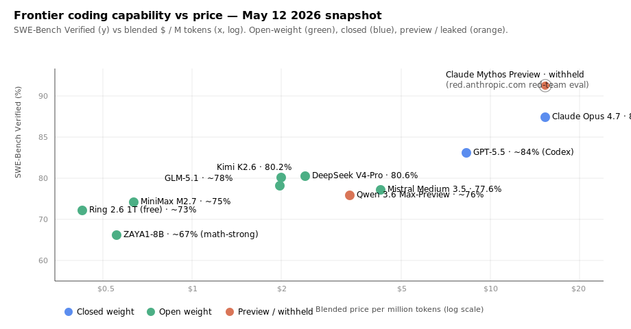
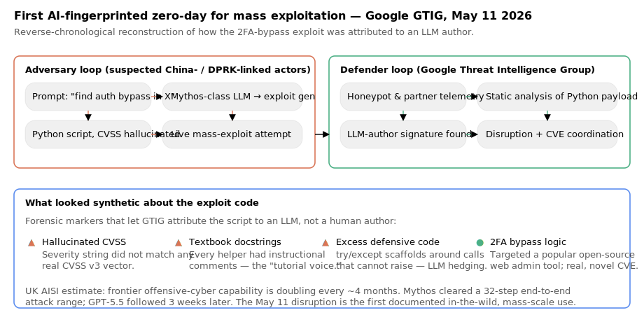
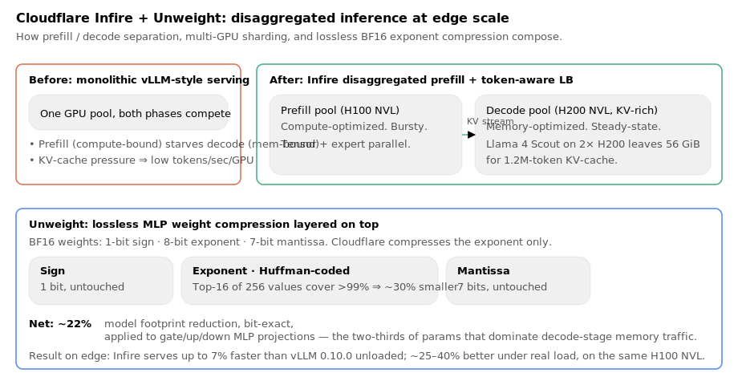
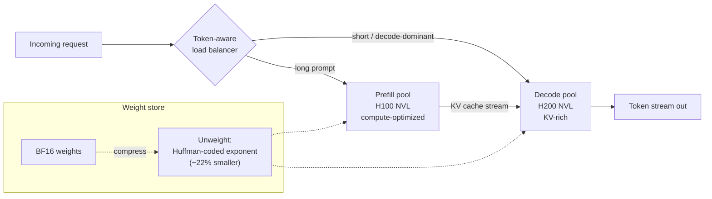
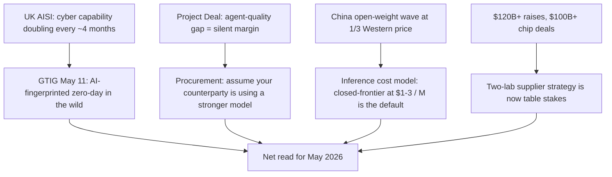

# LLM Updates — 2026-May-12

Tuesday brief, written from Los Angeles (PDT). Coverage window is the
**May 9–12** stretch since the [May 8 brief](../2026-May-08/2026-May-08_LLM_updates.md),
which covered Anthropic × SpaceX Colossus 1, OpenAI's Realtime-2 /
Translate / Whisper trio, Zyphra ZAYA1-8B, the ReasonMaxxer sparse-RL
result, ServiceNow's Claude default, and the iOS 27 multi-provider
WWDC rumor. The four days since have been **dominated by AI-enabled
offensive cyber crossing into the wild for the first time**, with
infrastructure and the I/O-week run-up filling the rest of the news:

1. **Google Threat Intelligence Group: first AI-fingerprinted
   mass-exploitation attempt disrupted** (May 11, with follow-up
   reporting through May 12) — GTIG attributes a novel 2FA-bypass
   zero-day in a popular open-source web admin tool to a
   Mythos-class LLM author. The Python payload carried a
   hallucinated CVSS string, textbook docstrings, and tutorial-style
   defensive scaffolding. China- and DPRK-linked groups were the
   suspected operators. The UK AI Security Institute's offensive-cyber
   doubling-time estimate is now **four months**.
2. **Gemini "Omni" video model surfaced in app builds** (May 11) —
   Google's first-party text-to-video model, sibling to (or
   successor of) Veo, leaked into Gemini app metadata with a
   "Create with Gemini Omni" entry point and in-chat editing
   ("remove watermarks, swap objects, rewrite scenes"). I/O 2026
   stage reveal is the obvious window — Android Show I/O Edition is
   pre-recorded for **May 12, 10am PT**; full keynote on May 19.
3. **InclusionAI Ring-2.6-1T released open-weight; OpenCode flips it
   free** (model May 8; OpenCode free-tier flip May 10) — a
   1T-parameter MoE *thinking* model with 63B active params, 262K
   context, 66K output tokens per response, function calling, and an
   MIT-style license. The free tier on OpenRouter via OpenCode is
   the first time a frontier-grade open-weight reasoning model has
   been zero-priced at API scale.
4. **Cloudflare full-stack inference disclosure** (May 8 / week of
   May 11 InfoQ writeup) — Infire (Rust inference engine) now does
   **disaggregated prefill** with token-aware load balancing and
   tensor / pipeline / expert parallelism, while the companion
   **Unweight** technique gives **lossless ~22% MLP-weight
   compression** by Huffman-coding the BF16 exponent. End-to-end
   ~7% faster than vLLM 0.10.0 unloaded, materially better under
   real load.
5. **Nous Research Hermes Agent v0.12 "Curator" + v2026.5.7
   point-release** (week of May 4 → May 7) — open-source desktop
   agent gets Kanban-style multi-agent collaboration, parallel task
   claiming, shared SQLite workspace, persistent personal memory.
6. **Air Street "State of AI: May 2026"** (May 11) — the most
   complete public synthesis since the April 30 brief. Headline
   findings: cyber-offense doubling every ~4 months; **Project Deal**
   showed that better-model agents systematically out-bargain
   worse-model agents without the losing side noticing; four Chinese
   labs (Z.ai GLM-5.1, MiniMax M2.7, Moonshot Kimi K2.6, DeepSeek V4)
   landed inside a 12-day window at roughly one-third of Claude Opus
   4.7's price.

Items already covered in earlier briefs — Claude Opus 4.7, Mythos
Preview / Project Glasswing background, Anthropic-SpaceX Colossus 1,
GPT-5.5 launch, DeepSeek V4 release, Mistral Medium 3.5, Apple
ParaRNN / Manzano / Mirror-SD, FlashAttention-4 — are referenced
briefly where the May 9–12 news intersects them, and not re-derived.

---

## 1. GTIG: AI-enabled mass exploitation is no longer hypothetical

The single most consequential story since the May 8 brief is Google
Threat Intelligence Group's May 11 disclosure that it disrupted an
in-the-wild operation in which a criminal threat actor used a
frontier-grade LLM to author a **novel 2FA-bypass zero-day** in a
popular open-source web-based system administration tool, then
attempted **mass exploitation** against deployments of that tool
across the internet
([CNBC](https://www.cnbc.com/2026/05/11/google-thwarts-effort-hacker-group-use-ai-mass-exploitation-event.html),
[Bloomberg](https://www.bloomberg.com/news/articles/2026-05-11/hackers-used-ai-to-build-zero-day-attack-google-researchers-say),
[Fortune](https://fortune.com/2026/05/11/google-catches-hackers-cybersecurity-warning-ai-anthropic-mythos/),
[BleepingComputer](https://www.bleepingcomputer.com/news/security/google-hackers-used-ai-to-develop-zero-day-exploit-for-web-admin-tool/),
[Axios follow-up May 12](https://www.axios.com/2026/05/12/ai-hacking-found-google-report),
[The Hacker News](https://thehackernews.com/2026/05/hackers-used-ai-to-develop-first-known.html),
[Google Cloud post](https://cloud.google.com/blog/topics/threat-intelligence/ai-vulnerability-exploitation-initial-access)).

What makes this different from prior "AI in cybercrime" stories is
that GTIG **forensically attributed the exploit code to an LLM
author**, not just to a human using AI for ideation. Three signatures
in the Python payload sold the attribution:

- A **hallucinated CVSS score** in the exploit's metadata — a
  severity string that did not parse as a real CVSS v3 vector.
- **Textbook docstrings** on every helper: instructional comments
  that read like a tutorial rather than a tool authored under
  operational secrecy.
- **Excess defensive scaffolding** — try/except blocks around calls
  that cannot raise, the classic LLM hedge.

The attack itself was not exotic. It was a 2FA bypass against an
open-source web admin tool, implemented as a Python script. What is
notable is that it was *generated by an LLM*, deployed as part of a
*mass exploitation campaign* (not a targeted intrusion), and *worked*
on a real vulnerability that was not previously public.

The threat-actor side is the same set of groups Google has called out
through 2026: **China-linked** and **DPRK-linked** clusters that have
been observed integrating commercial and self-hosted LLM endpoints
into their tooling. Google does not name the specific model and
deliberately did not say whether it was Mythos, GPT-5.5-Cyber, or a
fine-tune of an open-weight model — but the
[Bloomberg framing](https://www.bloomberg.com/news/articles/2026-05-11/hackers-used-ai-to-build-zero-day-attack-google-researchers-say)
calls it "Mythos-like," and *Fortune*'s coverage notes that the
capability profile is what Anthropic warned about when it withheld
Mythos Preview under
[Project Glasswing](https://www.anthropic.com/glasswing) in April.

Three operational implications worth flagging for engineering teams:

**(a) The Glasswing premise is empirically validated.** Anthropic's
April decision to gate Mythos Preview to a launch consortium (AWS,
Apple, Broadcom, Cisco, CrowdStrike, Google, JPMorganChase, Linux
Foundation, Microsoft, NVIDIA, Palo Alto Networks; $100M usage
credits + $4M to OSS security) was the first time a frontier lab
*withheld* general API access on offensive-cyber grounds. The May 11
event is the first public-record confirmation that a *different*
model — possibly an open-weight fine-tune — has now reached enough
of that capability surface to be operationally useful to a criminal
group. The "we can keep the dangerous version under lock and key"
argument now has a four-week shelf life.

**(b) Detection signatures shift to attribution, not anomaly.** GTIG
did not catch this with anomaly detection on the *exploit*. They
caught it by recognizing **LLM authorship** in the payload — the
same kind of style-classifier work that academic and CTI teams have
been doing on AI-written phishing since 2024, now applied to exploit
code. Expect to see this in commercial EDR / SOC tooling within a
quarter.

**(c) Frontier-cyber capability is on a four-month doubling.** The
[UK AI Security Institute's evaluation of Mythos
Preview](https://www.aisi.gov.uk/blog/our-evaluation-of-claude-mythos-previews-cyber-capabilities)
established the curve: Mythos cleared a 32-step end-to-end attack
range; GPT-5.5 cleared the same range three weeks later. Air Street's
[State of AI May 2026](https://press.airstreet.com/p/state-of-ai-may-2026)
report fits this to a **4-month doubling time** on cyber-offence.
If that holds through end-of-year, the open-weight frontier — which
trails closed by ~8 months on
[CAISI's DeepSeek V4 eval](https://www.nist.gov/news-events/news/2026/05/caisi-evaluation-deepseek-v4-pro)
— would converge to closed-frontier offensive-cyber capability some
time around Q1 2027.

The Schneier summary from April is the cleanest framing of the policy
problem: *the same model that can find every zero-day in your stack
can also be the one that writes the patches before the attackers
find them*
([Schneier on Security](https://www.schneier.com/blog/archives/2026/04/on-anthropics-mythos-preview-and-project-glasswing.html)).
May 11 just narrowed the gap between halves of that sentence.

---

## 2. Gemini "Omni" video model surfaces — I/O preview, week of

The second most-covered story of the four-day window is the
**Gemini Omni** leak on May 11
([9to5Google](https://9to5google.com/2026/05/11/gemini-omni-video-model-shows-up-with-some-early-demos/),
[Android Authority](https://www.androidauthority.com/google-gemini-omni-video-model-leak-3665801/),
[testingcatalog.com](https://www.testingcatalog.com/googles-gemini-omni-video-model-surfaces-ahead-of-i-o-debut/),
[Chrome Unboxed](https://chromeunboxed.com/an-impressive-new-gemini-omni-video-model-just-leaked-ahead-of-google-i-o/)).

Users in unreleased Gemini iOS app builds were prompted to *"Create
with Gemini Omni: meet our new video model. Remix your videos, edit
directly in chat, try a template, and more."* Early demo clips
suggest **two-clip-deep continuity, in-chat scene editing
(watermark removal, object swap, rewriting a scene with a text
instruction), and template-driven generation**. Cinematic quality
appears to **lag ByteDance Seedance 2** in the comparisons that
viewers have run, but the *editing* surface — the conversational
remix loop inside Gemini chat — is what's new.

The metadata trail suggests Omni is **an extension or successor of
Veo**, not a parallel product. Google has not confirmed any of this.
The natural reveal window is:

- **May 12 (today), 10am PT** — Android Show I/O Edition pre-record,
  YouTube-only ([io.google/2026](https://io.google/2026/),
  [Android Authority preview](https://www.androidauthority.com/what-to-expect-from-google-io-2026-3664979/)).
- **May 19, 10am PT** — full Google I/O 2026 keynote. Expected:
  Gemini 4 (or Gemini 3.x major refresh), Android 17, Android XR
  hardware, AI agent platform deepening, Aluminium OS rumor.

A non-leak but architecturally relevant item: **Gemini 3.2 Flash**
metadata also surfaced in the same iOS build sweep on May 5–11
([buildfastwithai](https://www.buildfastwithai.com/blogs/gemini-3-2-flash-release-2026)),
with leaked pricing at **$0.25 / M input, $2.00 / M output** —
output-cheaper than Gemini 3 Flash ($0.50 / $3.00) and matching
Gemini 3.1 Flash-Lite on input. If the leaked figures hold, 3.2
Flash slots in *above* 3.1 Pro on coding tasks at sub-Flash pricing,
which would make it the new throughput-tier default.

If you're a team running Gemini in production, the practical move
this week is to keep the **3.1 Flash-Lite GA**
([Google Cloud blog](https://cloud.google.com/blog/products/ai-machine-learning/gemini-3-1-flash-lite-is-now-generally-available))
default but reserve a small fraction of traffic for the I/O day to
re-benchmark — the price/perf landscape is likely to shift twice in
the next 7 days.

---

## 3. InclusionAI Ring-2.6-1T: a 1T-parameter open-weight *thinking*
model goes free

While the leaderboard contests get the headlines, the open-weight
shipping cadence has not slowed. The relevant event in the 9–12 window
is **InclusionAI's Ring-2.6-1T**, an MoE thinking model whose May 10
free-tier flip on OpenRouter via OpenCode is the most aggressive
distribution move on any frontier-grade open-weight model this year
([OpenCode tweet May 10](https://x.com/opencode/status/2053393732221739498),
[OpenRouter listing](https://openrouter.ai/inclusionai/ring-2.6-1t:free),
[Sulat model card](https://models.sulat.com/models/opencode-ring-26-1t-free-1e1bf584),
[Kilo metrics](https://kilo.ai/models/inclusionai-ring-2-6-1t-free)).

| Spec                       | Ring-2.6-1T                       |
| -------------------------- | --------------------------------- |
| Architecture               | MoE                               |
| Total params               | **~1T**                           |
| Active per token           | **~63B**                          |
| Context window             | **262K tokens**                   |
| Max output                 | **66K tokens / response**         |
| Reasoning / extended CoT   | Yes (thinking model)              |
| Tool / function calling    | Yes                               |
| Modalities                 | Text only                         |
| License                    | Modified MIT-style                |
| Price (OpenRouter via OpenCode) | **$0 for a limited time**     |

Two reasons this matters beyond the spec sheet:

**(a) The thinking-model open-weight frontier is now zero-priced.**
Through April, the open-weight reasoning tier was effectively
DeepSeek V4-Pro at ~$1.74 / $3.48 per million in/out, or Kimi K2.6 at
roughly similar levels. Ring-2.6-1T at *free* sets the floor for any
team running RAG or agent loops at scale. Even if the free tier
expires (it's promotional), the model card and weights are open, so
the *self-host* price is whatever your GPU bill is.

**(b) The 63B-active design hits a deployable sweet spot.** Two
H200 GPUs can serve it with room left for the KV cache — exactly the
Llama 4 Scout / Cloudflare Infire envelope discussed in Section 4.
"Frontier-grade reasoning on two-GPU edge nodes" is a real
deployment story for the first time.

A related distribution note: **Cloudflare Workers AI** now hosts
**Kimi K2.5** at edge scale ([Cloudflare blog](https://blog.cloudflare.com/workers-ai-large-models/)),
which means the same shape — 1T-param MoE reasoning, sub-100B active
— is being normalized as the *deployable open frontier*. Expect a
Workers AI listing for Ring-2.6-1T inside two weeks.

---

## 4. Cloudflare Infire + Unweight: the edge-inference stack is now
public

The week's clearest infrastructure story is Cloudflare publishing the
full design of its inference stack, which the InfoQ writeup
synthesizes into a single piece ([InfoQ May 2026](https://www.infoq.com/news/2026/05/cloudflare-llm-infrastructure/)).
Two named components: **Infire**, the Rust inference engine, and
**Unweight**, a lossless BF16 MLP compression technique.

### Disaggregated prefill (Infire)

Infire separates **prefill** (compute-bound, bursty) from **decode**
(memory-bound, steady-state) into different GPU pools, with
**token-aware load balancing** routing requests between them
([Cloudflare blog: efficient inference engine](https://blog.cloudflare.com/cloudflares-most-efficient-ai-inference-engine/)).
This is the same disaggregation pattern from
[DistServe / Sarathi / Mooncake](https://arxiv.org/abs/2401.09670)
academic work, now in a hyperscale production engine. Notable
extensions:

- **Multi-GPU**: tensor-parallel, pipeline-parallel, and
  expert-parallel modes are all first-class.
- **Llama 4 Scout on two H200 GPUs** with **56 GiB free for KV
  cache** — enough for **1.2M-token contexts** on a single inference
  node ([Cloudflare workers-ai post](https://blog.cloudflare.com/workers-ai-large-models/)).
- **~7% faster than vLLM 0.10.0** on H100 NVL when unloaded, with
  the gap widening "significantly" under real production load.

### Unweight (lossless MLP compression)

Unweight ([blog post](https://blog.cloudflare.com/unweight-tensor-compression/),
[research paper](https://research.cloudflare.com/papers/unweight-2026.pdf),
[kernels on GitHub](https://github.com/cloudflareresearch/unweight-kernels))
is a deceptively simple Huffman-coding trick on the **exponent** of
BF16 weights:

- BF16 = 1 sign bit + 8 exponent bits + 7 mantissa bits.
- Across trained LLMs, the exponent distribution is **wildly
  skewed**: the top 16 of 256 values cover >99% of weights in a
  given layer.
- Huffman code the exponent → **~30%** smaller on that stream.
- Sign + mantissa untouched → **bit-exact lossless**.
- Apply selectively to MLP gate / up / down projections (the
  ~⅔ of params that dominate decode memory traffic).
- **Net: ~22% model footprint reduction** on Llama 3.1 8B
  distribution bundles, or ~13% on inference-only bundles.

The numbers are not dramatic on their own, but the *combination*
with disaggregated prefill is where the system-level win lives:
smaller weights ⇒ better cache residency on the decode pool ⇒ more
KV-cache room ⇒ longer contexts per GPU. The whole stack is also
available open-source via the Unweight kernels repo, which is
unusual for hyperscaler infra work.

For teams running their own inference, the takeaway is that the
*architecture pattern* — disaggregate prefill, compress MLP exponents
losslessly, route by token-budget — is now well-enough understood
that it should be in your roadmap if you serve >1M tokens/day. The
open-source Unweight kernels make this concretely buildable on
Hopper-class GPUs.

---

## 5. Nous Research Hermes Agent v0.12 "Curator" + v2026.5.7 — multi-
agent Kanban

The open-source agent surface continues to consolidate. **Hermes
Agent** from Nous Research — which started in February 2026 as a
single-user "agent that grows with you" — shipped two material
updates in the past week:

- **v0.12 "Curator Release"** (week of May 4) added
  **multi-agent collaboration via Kanban-style task boards**:
  parallel work, agents that claim tasks from a shared queue,
  hand-off, shared workspaces, live dashboards, SQLite-backed
  persistence ([Proudfrog writeup](https://proudfrog.com/en/news/2026-05-04-nous-researchs-hermes-agent-adds-multi-agent),
  [GitHub releases](https://github.com/NousResearch/hermes-agent/releases)).
- **v2026.5.7** (May 7 point release;
  [newreleases.io](https://newreleases.io/project/github/NousResearch/hermes-agent/release/v2026.5.7))
  rolled in a native desktop app and tightened the persistent-memory
  loop. Companion projects this week: `hermes-desktop` (macOS,
  SSH-host-first model, beta), `hermes-workspace` (web-based, built
  during Nous Hackathon 2026).

Why it matters: **Kanban is the right primitive for
agent-to-agent coordination**, not a chat thread or a DAG. The
[Proudfrog summary](https://proudfrog.com/en/news/2026-05-04-nous-researchs-hermes-agent-adds-multi-agent)
makes the case: agents take work off a board, mark it
in-progress, hand off when blocked, and post results back —
exactly the workflow a human team uses when async-collaborating.
This is also how Anthropic's
[Project Deal](https://www.anthropic.com/features/project-deal)
marketplace agents coordinated. The pattern is converging: long-
running agents need a *shared, durable, queryable artifact* (board,
ledger, marketplace) more than they need clever inter-agent
protocols.

The Hermes home page ([hermes-agent.nousresearch.com](https://hermes-agent.nousresearch.com/))
positions the project as "the only agent with a built-in learning
loop." That's marketing — but the technical claim under it (skills
created from experience, improved during use, persisted across
sessions) is the same pattern MiniMax M2.7 used to autonomously
optimize its programming scaffold over 100+ rounds for a 30% perf
gain ([MarkTechPost on M2.7](https://www.marktechpost.com/2026/04/12/minimax-just-open-sourced-minimax-m2-7-a-self-evolving-agent-model-that-scores-56-22-on-swe-pro-and-57-0-on-terminal-bench-2/)).
Self-improving agent loops are stabilizing as a design pattern.

---

## 6. State of AI May 2026: synthesis

Air Street's twice-a-year *State of AI* report dropped on May 11
([Air Street Press](https://press.airstreet.com/p/state-of-ai-may-2026),
[Nathan Benaich's Substack version](https://nathanbenaich.substack.com/p/state-of-ai-may-2026)).
The four findings most relevant to engineering planning over the next
quarter:

| Finding | Implication |
| ------- | ----------- |
| **Cyber-offense capability is doubling every ~4 months** (UK AISI estimate). Mythos cleared a 32-step end-to-end attack range; GPT-5.5 followed 3 weeks later. | Threat model needs quarterly refresh, not annual. Patch SLA against post-disclosure exploits should target hours, not days. |
| **Agent-quality gaps compound silently in markets.** Project Deal: Opus-on-Opus deals averaged $18.63; Opus-seller vs Haiku-buyer averaged $24.18. Losing side did not detect the gap. | Heterogeneous-agent procurement (where one party uses a weaker model) is structurally disadvantaged. Counterparties will rationally mask which model they're using. |
| **Chinese open-weight coding models hit Western frontier capability at ~⅓ the price**, all in a 12-day window (GLM-5.1, MiniMax M2.7, Kimi K2.6, DeepSeek V4). | The right default for inference cost modeling in mid-2026 is to assume *closed-frontier capability at $1–3 / M output is buyable*. |
| **Capital & compute consolidation** — OpenAI raised $122B at $852B; Anthropic added $40B from Google + $5B from Amazon + $100B AWS spend; chip deals with Google and Broadcom "worth hundreds of billions." | Two-supplier model risk for application teams is now real. Either lab pausing for 6 weeks is a survivable event for everyone *except* you. |

---

## 7. Smaller items worth flagging

- **OpenAI GPT-5.5-Cyber preview** is rolling out in limited
  capacity to vetted cybersecurity teams (corroborating evidence
  that the Glasswing pattern is becoming the *default* for offensive-
  cyber-capable models, not the exception) — covered in
  [Dev Journal's weekly summary May 2–10](https://earezki.com/ai-news/weekly-summary-2026-05-10/).
- **Meta capex confirmed at $115–135B for 2026**, ~2× 2025.
  Internal "Avocado" flagship slipped from March to May; testing
  reportedly showed it trailing Google / OpenAI / Anthropic
  ([Understanding AI on Meta's LLM gap](https://www.understandingai.org/p/meta-is-back-in-the-llm-game-after)).
- **NIST / CAISI multi-lab test agreement**: Microsoft, Google, and
  xAI have agreed to share unreleased model versions with the
  government for pre-release evaluation
  ([CNN](https://www.cnn.com/2026/05/05/tech/microsoft-google-xai-government-test-ai-models)).
  Anthropic is already participating via the Mythos AISI evaluation.
- **Sakana AI KAME** (May 3, arXiv:2510.02327; resurfaced this week
  via [marktechpost](https://www.marktechpost.com/2026/05/03/sakana-ai-introduces-kame-a-tandem-speech-to-speech-architecture-that-injects-llm-knowledge-in-real-time/),
  [Sakana blog](https://sakana.ai/kame-icassp-2026/)) — a **tandem
  speech-to-speech architecture** that pairs a Moshi-style real-time
  S2S front end with a back-end LLM "oracle stream," boosting
  MT-Bench from 2.05 → 6.43 at near-zero added latency. The trick
  is **Simulated Oracle Augmentation**: synthetic interim-transcript
  training data so the front end learns to fold partial back-end
  responses smoothly. The back end is model-agnostic — swap
  GPT-4.1 / Claude Opus 4.1 / Gemini 2.5 Flash without retraining.
- **AsyncTLS** ([arXiv 2604.07815](https://arxiv.org/abs/2604.07815))
  — hierarchical sparse attention for generative LLM inference,
  coarse-block filter + fine token selection. **1.2–10.0× operator
  speedup, 1.3–4.7× end-to-end throughput** on 48K–96K contexts.
  Worth pairing with FlashAttention-4 in your inference roadmap.
- **CoreWeave #1 ranked** for Kimi K2.6 inference speed and
  price-performance in an independent benchmark
  ([CoreWeave investor release](https://investors.coreweave.com/news/news-details/2026/CoreWeave-Achieves-1-Ranking-for-Inference-Speed-and-Price-Performance-for-Moonshot-AIs-Kimi-K2-6-Model-in-Independent-Benchmark/default.aspx)).
  Open-weight + cloud serving is differentiating on inference engine
  and interconnect, not just chip count.

---

## 8. What to watch — week of May 12–19

Tightly scoped, since Google I/O will reshuffle the deck:

1. **May 12, 10am PT** — Android Show I/O Edition (YouTube pre-record).
   Watch for whether Gemini Omni gets a stage moment, and whether
   Android 17's on-device Gemini Nano gets a multi-modal upgrade.
2. **May 14–16** — Anthropic typically ships a release note bundle
   one week after a major capacity event. Colossus 1 was May 6;
   the second-week cadence has historically brought a Claude Code
   feature drop or a Sonnet refresh
   ([Releasebot](https://releasebot.io/updates/anthropic)).
3. **May 19, 10am PT** — Google I/O 2026 keynote. Single biggest
   set-piece event of the quarter: Gemini 4 / 3.x refresh, Gemini
   Omni reveal, Gemini Enterprise Agent Platform GA depth, possibly
   8th-gen TPU details ([Cloud Next 2026 recap](https://blog.google/innovation-and-ai/infrastructure-and-cloud/google-cloud/cloud-next-2026-sundar-pichai/)).
4. **Continuous** — GTIG and CISA bulletins on follow-on AI-authored
   exploit attempts. May 11 was the *first*; the second one is the
   one that tells us whether this is a one-shot or a steady stream.

---

## Sources

### Frontline AI-cyber (Section 1)
- [CNBC — Google thwarts effort by hacker group to use AI for 'mass exploitation event' (May 11)](https://www.cnbc.com/2026/05/11/google-thwarts-effort-hacker-group-use-ai-mass-exploitation-event.html)
- [Bloomberg — Google Says Hacker Used Mythos-Like AI for Software Tool Exploit](https://www.bloomberg.com/news/articles/2026-05-11/hackers-used-ai-to-build-zero-day-attack-google-researchers-say)
- [Fortune — 'It's here': Google issues dire warning](https://fortune.com/2026/05/11/google-catches-hackers-cybersecurity-warning-ai-anthropic-mythos/)
- [BleepingComputer — AI to develop zero-day exploit for web admin tool](https://www.bleepingcomputer.com/news/security/google-hackers-used-ai-to-develop-zero-day-exploit-for-web-admin-tool/)
- [Axios — AI-assisted hacking is already here (May 12)](https://www.axios.com/2026/05/12/ai-hacking-found-google-report)
- [Google Cloud — Adversaries Leverage AI for Vulnerability Exploitation](https://cloud.google.com/blog/topics/threat-intelligence/ai-vulnerability-exploitation-initial-access)
- [The Hacker News — First Known Zero-Day 2FA Bypass](https://thehackernews.com/2026/05/hackers-used-ai-to-develop-first-known.html)
- [Anthropic — Project Glasswing](https://www.anthropic.com/glasswing)
- [Anthropic / red — Mythos Preview](https://red.anthropic.com/2026/mythos-preview/)
- [AISI — Mythos Preview cyber evaluation](https://www.aisi.gov.uk/blog/our-evaluation-of-claude-mythos-previews-cyber-capabilities)
- [CNBC — Anthropic's Mythos set off a cybersecurity 'hysteria'](https://www.cnbc.com/2026/05/08/anthropic-mythos-ai-cybersecurity-banks.html)
- [Schneier — On Anthropic's Mythos Preview and Project Glasswing](https://www.schneier.com/blog/archives/2026/04/on-anthropics-mythos-preview-and-project-glasswing.html)

### Google Gemini & I/O preview (Section 2)
- [9to5Google — Gemini 'Omni' video model shows up](https://9to5google.com/2026/05/11/gemini-omni-video-model-shows-up-with-some-early-demos/)
- [Android Authority — Early look: Gemini Omni leak](https://www.androidauthority.com/google-gemini-omni-video-model-leak-3665801/)
- [testingcatalog — Gemini Omni surfaces ahead of I/O debut](https://www.testingcatalog.com/googles-gemini-omni-video-model-surfaces-ahead-of-i-o-debut/)
- [Chrome Unboxed — Gemini Omni leak](https://chromeunboxed.com/an-impressive-new-gemini-omni-video-model-just-leaked-ahead-of-google-i-o/)
- [Build Fast With AI — Gemini 3.2 Flash leak](https://www.buildfastwithai.com/blogs/gemini-3-2-flash-release-2026)
- [Google Cloud — Gemini 3.1 Flash-Lite GA](https://cloud.google.com/blog/products/ai-machine-learning/gemini-3-1-flash-lite-is-now-generally-available)
- [Android Authority — What to expect from Google I/O 2026](https://www.androidauthority.com/what-to-expect-from-google-io-2026-3664979/)
- [io.google/2026](https://io.google/2026/)
- [Google Cloud Next 2026 recap](https://blog.google/innovation-and-ai/infrastructure-and-cloud/google-cloud/cloud-next-2026-sundar-pichai/)
- [Google Cloud — Gemini Enterprise Agent Platform](https://cloud.google.com/blog/products/ai-machine-learning/introducing-gemini-enterprise-agent-platform)

### Open-weight reasoning (Section 3)
- [OpenCode tweet — Ring 2.6 1T free](https://x.com/opencode/status/2053393732221739498)
- [OpenRouter — Ring-2.6-1T (free)](https://openrouter.ai/inclusionai/ring-2.6-1t:free)
- [Sulat model card — Ring 2.6 1T](https://models.sulat.com/models/opencode-ring-26-1t-free-1e1bf584)
- [Kilo metrics — Ring 2.6 1T](https://kilo.ai/models/inclusionai-ring-2-6-1t-free)
- [Cloudflare — Workers AI Kimi K2.5 large-model serving](https://blog.cloudflare.com/workers-ai-large-models/)

### Infrastructure (Section 4)
- [Cloudflare — Building the foundation for extra-large LLMs](https://blog.cloudflare.com/high-performance-llms/)
- [Cloudflare — Most efficient AI inference engine](https://blog.cloudflare.com/cloudflares-most-efficient-ai-inference-engine/)
- [Cloudflare — Unweight tensor compression](https://blog.cloudflare.com/unweight-tensor-compression/)
- [Cloudflare Research — Unweight paper PDF](https://research.cloudflare.com/papers/unweight-2026.pdf)
- [GitHub — cloudflareresearch/unweight-kernels](https://github.com/cloudflareresearch/unweight-kernels)
- [InfoQ — Cloudflare LLM infrastructure (May 2026)](https://www.infoq.com/news/2026/05/cloudflare-llm-infrastructure/)

### Agent platforms (Section 5)
- [Hermes Agent homepage](https://hermes-agent.nousresearch.com/)
- [GitHub — NousResearch/hermes-agent releases](https://github.com/NousResearch/hermes-agent/releases)
- [Proudfrog — Hermes multi-agent Kanban](https://proudfrog.com/en/news/2026-05-04-nous-researchs-hermes-agent-adds-multi-agent)
- [newreleases.io — Hermes v2026.5.7](https://newreleases.io/project/github/NousResearch/hermes-agent/release/v2026.5.7)
- [Anthropic — Project Deal marketplace](https://www.anthropic.com/features/project-deal)
- [MarkTechPost — MiniMax M2.7 self-evolving](https://www.marktechpost.com/2026/04/12/minimax-just-open-sourced-minimax-m2-7-a-self-evolving-agent-model-that-scores-56-22-on-swe-pro-and-57-0-on-terminal-bench-2/)

### State of AI synthesis (Section 6)
- [Air Street Press — State of AI: May 2026](https://press.airstreet.com/p/state-of-ai-may-2026)
- [Nathan Benaich — State of AI May 2026](https://nathanbenaich.substack.com/p/state-of-ai-may-2026)
- [TechCrunch — Anthropic test marketplace for agent-on-agent commerce](https://techcrunch.com/2026/04/25/anthropic-created-a-test-marketplace-for-agent-on-agent-commerce/)
- [EdTech Innovation Hub — Project Deal model-quality result](https://www.edtechinnovationhub.com/news/anthropics-ai-agents-struck-186-deals-in-a-real-marketplace-and-the-stronger-model-won-every-time)
- [Semafor — Anthropic-SpaceX deal & tokens-as-economy](https://www.semafor.com/article/05/08/2026/anthropic-spacex-compute-deal-shows-how-tokens-are-taking-over-the-economy)
- [NIST CAISI — DeepSeek V4 Pro evaluation](https://www.nist.gov/news-events/news/2026/05/caisi-evaluation-deepseek-v4-pro)

### Smaller items (Section 7)
- [Dev Journal — AI News Weekly May 2–10, 2026](https://earezki.com/ai-news/weekly-summary-2026-05-10/)
- [Understanding AI — Meta's LLM gap](https://www.understandingai.org/p/meta-is-back-in-the-llm-game-after)
- [CNN — Government pre-release model testing agreement](https://www.cnn.com/2026/05/05/tech/microsoft-google-xai-government-test-ai-models)
- [Sakana — KAME tandem S2S](https://sakana.ai/kame-icassp-2026/)
- [MarkTechPost — Sakana KAME](https://www.marktechpost.com/2026/05/03/sakana-ai-introduces-kame-a-tandem-speech-to-speech-architecture-that-injects-llm-knowledge-in-real-time/)
- [arXiv 2510.02327 — KAME paper](https://arxiv.org/pdf/2510.02327)
- [arXiv 2604.07815 — AsyncTLS](https://arxiv.org/abs/2604.07815)
- [CoreWeave — #1 Kimi K2.6 inference benchmark](https://investors.coreweave.com/news/news-details/2026/CoreWeave-Achieves-1-Ranking-for-Inference-Speed-and-Price-Performance-for-Moonshot-AIs-Kimi-K2-6-Model-in-Independent-Benchmark/default.aspx)

### Reference (model facts, prior briefs)
- [Anthropic — Introducing Claude Opus 4.7](https://www.anthropic.com/news/claude-opus-4-7)
- [OpenAI — Introducing GPT-5.5](https://openai.com/index/introducing-gpt-5-5/)
- [DeepSeek API docs — V4 release](https://api-docs.deepseek.com/news/news260424)
- [Mistral — Medium 3.5 docs](https://docs.mistral.ai/models/model-cards/mistral-medium-3-5-26-04)
- [Mistral — Vibe remote agents](https://mistral.ai/news/vibe-remote-agents-mistral-medium-3-5)
- [Moonshot — Kimi K2.6 tech blog](https://www.kimi.com/blog/kimi-k2-6)
- [Z.ai — GLM-5.1 docs](https://docs.z.ai/guides/llm/glm-5.1)
- [MiniMax — M2.7 news](https://www.minimax.io/news/minimax-m27-en)
- [Qwen — Qwen 3.6 Max-Preview blog](https://qwen.ai/blog?id=qwen3.6-max-preview)
- [llm-stats — May 2026 AI updates](https://llm-stats.com/llm-updates)
- [AI Flash Report — model release timeline](https://aiflashreport.com/model-releases.html)
- [Releasebot — Anthropic / Google / OpenAI release notes](https://releasebot.io/updates/anthropic)
