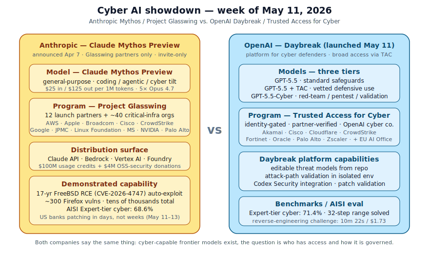
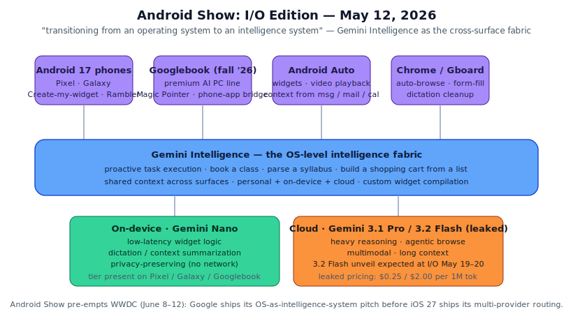
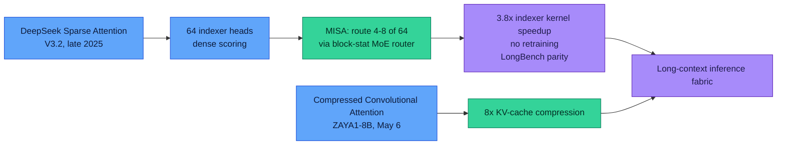

# LLM Updates — 2026-May-13

Mid-week brief, written Wednesday May 13 (Los Angeles time). The May 8
report ended with seven storylines (Anthropic × SpaceX Colossus 1, the
OpenAI Realtime-2/Translate/Whisper trio, Trusted-Contact + CPC ads +
The Deployment Company, ZAYA1-8B, ReasonMaxxer, ServiceNow / Cognizant
/ Perplexity Finance, and iOS 27 Extensions confirmed for WWDC). The
five days since have collapsed into a single dominant theme:

**Cyber-capable frontier models stopped being a research preview and
became a product category.** Anthropic Mythos went broad on its
Glasswing-partner exposure and U.S. banks started visibly scrambling.
OpenAI shipped its parallel response (**Daybreak**) on the **same
Monday** Google's Threat Intelligence Group disclosed it had caught
the first publicly-known **AI-generated zero-day** mass-exploitation
operation. The week ended with Google's **Android Show: I/O Edition**
re-pitching Android as an "intelligence system" and pre-positioning
Gemini 3.2 Flash for the I/O keynote on May 19.

Seven items, ordered by what changes for production teams this week:

1. **OpenAI Daybreak + GPT-5.5-Cyber + Trusted Access for Cyber**
   (May 11) — OpenAI's three-tier defensive cyber stack lands as a
   direct, structured response to Anthropic's Mythos / Glasswing.
   GPT-5.5-Cyber is the most permissive tier; AISI's eval put it at
   **71.4% Expert-tier**, 2.8pts above Mythos.
2. **Google Threat Intelligence: first AI-generated zero-day in the
   wild** (May 11) — GTIG documented a criminal threat actor using
   an LLM to author a 2FA-bypass zero-day intended for a mass
   exploitation event. The dual-use thesis has its first concrete
   adversarial data point.
3. **Mythos aftermath: US banks patching in days, not weeks**
   (May 11–13) — JPMC, Goldman, Citi, BofA, Morgan Stanley now
   working through hundreds-to-thousands of Mythos-flagged
   low/moderate vulns each. IMF officials publicly called Mythos a
   systemic risk.
4. **Anthropic Mythos / Project Glasswing — full picture** (April 7
   announce, May 8–13 broad coverage) — $25/$125 per 1M tokens, 12
   founding partners + 40 vetted critical-infra orgs, $100M usage
   credits, $4M to OSS-security. Frontier coding/agentic model, no
   GA path stated.
5. **Android Show: I/O Edition** (May 12) — Gemini Intelligence as
   the cross-surface fabric, the **Googlebook** premium AI PC line
   for fall, and a Create-My-Widget natural-language compiler. The
   I/O keynote on May 19–20 now has its product backdrop.
6. **Gemini 3.2 Flash — leak window** (May 5 → present) — Arena
   appearance, iOS-app and AI Studio strings; leaked pricing at
   **$0.25 in / $2.00 out per 1M tokens**, beating Gemini 3 Flash on
   output. Official reveal almost certain at I/O.
7. **MISA: Mixture-of-Indexer Sparse Attention** (arXiv 2605.07363,
   May 8) — drop-in replacement for DeepSeek Sparse Attention's
   token indexer using a router-over-heads MoE. Matches dense DSA
   on LongBench at **4–8× fewer active indexer heads**, ~3.8× kernel
   speedup, **no retraining**.

Items inherited from prior briefs — GPT-5.5 Instant default, Claude
for Finance, ServiceNow Action Fabric MCP, ZAYA1-8B, ReasonMaxxer,
Anthropic × SpaceX Colossus 1, iOS 27 Extensions, SubQ 12M context —
are referenced where May 9–13 news intersects them, and not re-derived.

---

## 1. The cyber-AI week, all at once

The single dominant fact about May 11 is that **three things happened
on the same Monday**: OpenAI launched **Daybreak**, Google's GTIG
disclosed it had **caught a real AI-built zero-day**, and U.S. banks
went public about what **Anthropic Mythos** has been doing inside
their networks. None of these is independent of the others. Together,
they redraw the cyber-AI map from "Anthropic has Mythos and everyone
else is watching" (May 8) to "every frontier lab has a defensive cyber
program with structured access tiers, and the adversary side is already
live in the wild."

### 1.1 OpenAI Daybreak + GPT-5.5-Cyber + Trusted Access for Cyber

OpenAI's response landed on **May 11** as a three-piece stack —
model tiers, access program, defender platform — that maps almost
one-for-one to Anthropic's Mythos / Glasswing structure
([OpenAI — Daybreak](https://openai.com/daybreak/),
[OpenAI — Scaling Trusted Access for Cyber](https://openai.com/index/gpt-5-5-with-trusted-access-for-cyber/),
[The Hacker News](https://thehackernews.com/2026/05/openai-launches-daybreak-for-ai-powered.html),
[Help Net Security](https://www.helpnetsecurity.com/2026/05/12/openai-daybreak-openai-daybreak-vulnerability-validation-initiative/),
[Business Standard](https://www.business-standard.com/technology/tech-news/openai-daybreak-cybersecurity-platform-find-fix-vulnerability-126051200897_1.html),
[PYMNTS](https://www.pymnts.com/artificial-intelligence-2/2026/openai-debuts-daybreak-to-counter-anthropics-mythos/),
[Dataconomy](https://dataconomy.com/2026/05/12/openai-daybreak-anthropic-ai-cybersecurity/),
[DevOps.com](https://devops.com/openais-daybreak-challenges-anthropic-in-ai-cybersecurity-race/),
[AndroidHeadlines](https://www.androidheadlines.com/2026/05/openai-daybreak-vs-anthropic-mythos-ai-cybersecurity-initiative.html)).

| Layer       | OpenAI                                            | Comment                                                  |
| ----------- | ------------------------------------------------- | -------------------------------------------------------- |
| Model       | **GPT-5.5** (standard) → **GPT-5.5 + TAC** (vetted defenders) → **GPT-5.5-Cyber** (red-team / pentest / validation) | three permissioning tiers, not one model |
| Access      | **Trusted Access for Cyber** — identity-gated      | partners: Akamai · Cisco · Cloudflare · CrowdStrike · Fortinet · Oracle · Palo Alto · Zscaler · + EU AI Office |
| Platform    | **Daybreak** — built on Codex Security             | threat models from repos · attack-path validation · patch validation |

Three things distinguish OpenAI's posture from Anthropic's:

**(a) Tiered, not gated.** Anthropic's Mythos is a *binary*: you're a
Glasswing partner or you don't have access. OpenAI's TAC framework is a
*graduated* identity-gated capability ladder — most enterprises get
GPT-5.5 with TAC (defensive-only safeguards); a smaller verified set
gets GPT-5.5-Cyber (red-team / pentest permissive). The architectural
difference matters: TAC is the first frontier-lab attempt at a
*per-customer capability surface* rather than a *per-model capability
surface*. ([Help Net Security on the GPT-5.5-Cyber model](https://www.helpnetsecurity.com/2026/05/08/openai-gpt-5-5-cyber-model/),
[Winbuzzer on TAC](https://winbuzzer.com/2026/05/10/openai-opens-gpt-5-5-cyber-to-vetted-security-researchers-xcxwbn/),
[Sophos — what GPT-5.5-Cyber means for defenders](https://www.sophos.com/en-us/blog/sophos-chatgpt-cyber)).

**(b) Platform, not just model.** Daybreak is a *product*, not a model
ID. It ingests a repo, builds an editable threat model, validates
attack paths against isolated runtimes, and helps teams prioritize
exploitable vulnerabilities over noisy alerts. Anthropic's
equivalent — Claude Mythos + Glasswing access — gives the partner a
model and an API, leaving the defender platform to the partner's own
internal tools and to ecosystem players (Cognizant Secure AI Services,
ServiceNow Action Fabric, etc., covered May 8). Daybreak is OpenAI's
bet that the *platform* is what defenders actually want to buy.

**(c) EU access, deliberately.** OpenAI explicitly granted access to
GPT-5.5-Cyber to **EU institutions including the EU AI Office** and
EU cybersecurity agencies ([CNBC — OpenAI to give EU access to new
cyber model](https://www.cnbc.com/2026/05/11/openai-eu-cyber-model-anthropic-mythos-gpt.html),
[Yahoo](https://www.yahoo.com/news/articles/openai-offers-eu-access-cybersecurity-120959802.html)).
Anthropic has so far refused similar EU-government access requests on
the Mythos preview. The contrast is the story: with the EU AI Act's
cyber-defense clauses kicking in, **frontier model access for
EU public-sector defenders is now a competitive lever, not a
compliance afterthought**.

### 1.2 The AISI eval — receipts, with a jailbreak

The UK AI Safety Institute published its evaluation of GPT-5.5's
cyber capabilities on the same window, and the numbers materially
back up OpenAI's positioning
([AISI — GPT-5.5 cyber evaluation](https://www.aisi.gov.uk/blog/our-evaluation-of-openais-gpt-5-5-cyber-capabilities),
[ResultSense summary](https://www.resultsense.com/news/2026-05-01-aisi-gpt-5-5-cyber-eval)).
The shape of the result:

| Model               | AISI Expert-tier cyber tasks | 32-step end-to-end attack range |
| ------------------- | ---------------------------- | ------------------------------- |
| **GPT-5.5**         | **71.4%**                    | 2/10 attempts, solved end-to-end |
| Claude Mythos       | 68.6%                        | 1st model to ever solve         |
| GPT-5.4             | 52.4%                        | n/a                             |
| Claude Opus 4.7     | 48.6%                        | n/a                             |

Concrete demonstration: GPT-5.5 solved a reverse-engineering challenge
(reconstruct a custom VM ISA, write a disassembler, recover a crypto
password via constraint solving) in **10 minutes 22 seconds, $1.73 of
API spend**; a human expert needed ~12 hours.

The asterisk that matters: AISI also documented a **universal jailbreak**
that elicited the model's full malicious-cyber capability across all
provided harmful queries, including multi-turn agentic settings. Six
hours of expert red-teaming to develop. **This is the first time
frontier-lab cyber capability and the *non-trivial-but-not-impossible*
jailbreak budget have been measured side-by-side and published.** Both
numbers belong in the same sentence: "GPT-5.5 is the strongest cyber
model AISI has tested *and* it has a known universal jailbreak."

### 1.3 Mythos in the field: banks patching in days, not weeks

Anthropic's Mythos — quietly in Glasswing preview since April 7 — went
public-impact this week. The headline:

> "U.S. banks are rushing to fix scores of IT system weaknesses
> flagged by Anthropic's powerful but costly Mythos AI tool, prompting
> urgent repairs, software upgrades and raising the possibility of
> disruption for customers."
> — Reuters / The Star, May 13
> ([The Star](https://www.thestar.com.my/tech/tech-news/2026/05/13/anthropic039s-mythos-sends-us-banks-rushing-to-plug-cyber-holes),
> [Yahoo Finance](https://finance.yahoo.com/sectors/technology/articles/anthropic-mythos-ai-sends-u-162226754.html),
> [PYMNTS](https://www.pymnts.com/cybersecurity/2026/banks-slash-patch-times-as-anthropics-mythos-exposes-security-gaps/),
> [Technology.org](https://www.technology.org/2026/05/13/mythos-banks-cyber-vulnerabilities/),
> [Techloy](https://www.techloy.com/claude-mythos-found-thousands-of-holes-in-u-s-bank-systems-now-wall-street-is-scrambling/)).

Operational shape:

- **Banks with direct access:** JPMorganChase, Goldman Sachs,
  Citigroup, Bank of America, Morgan Stanley. They are *also* relaying
  patch intelligence to smaller banks who lack Mythos access.
- **Speed delta:** patch cycles compressed from "weeks" to "days" for
  Mythos-flagged low/moderate findings. CISO teams are running
  emergency change windows.
- **Backstop:** IMF officials have publicly characterized Mythos as
  a **systemic risk vector** — not because Mythos is itself an
  attacker, but because the *asymmetry* between Glasswing-access and
  non-access institutions creates a brittle transition window
  ([American Banker — IMF on Mythos](https://www.americanbanker.com/news/imf-calls-mythos-a-systemic-risk),
  [PYMNTS — financial officials sound alarm](https://www.pymnts.com/news/2026/financial-officials-sound-alarm-about-anthropics-banking-risk)).
- **Economics:** Mythos pricing at **$25 / $125 per 1M tokens** is
  5× Opus 4.7. Anthropic's $100M Glasswing-credits commitment is
  what makes the access program economically viable for the
  forty-some partners that aren't trillion-dollar banks
  ([Anthropic — Project Glasswing](https://www.anthropic.com/glasswing),
  [LLM-Stats — Mythos Preview spec](https://llm-stats.com/models/claude-mythos-preview)).

The shape that matters for production teams outside Glasswing: **the
non-public vulnerability surface of every major enterprise just got
much larger in the *known* sense and slightly smaller in the *exploited*
sense, simultaneously**. Glasswing has bought defenders ~6–12 months
(Anthropic CEO Dario Amodei's stated patch window, [CNBC May 5](https://www.cnbc.com/2026/05/05/anthropic-ceo-cyber-moment-of-danger-mythos-vulnerabilities.html))
before attacker tooling reaches parity.

### 1.4 Google Threat Intelligence: that 6–12 month window is shorter

The same Monday (**May 11**), Google's Threat Intelligence Group
published the strongest public evidence yet that the *attacker side*
of the curve is already non-trivial. GTIG documented a criminal threat
actor that **used an LLM to author a zero-day vulnerability and a
working exploit chain targeting two-factor-authentication bypass**,
intended for a mass-exploitation operation that GTIG's proactive
counter-discovery says it disrupted
([CNBC — Google thwarts AI mass-exploitation effort](https://www.cnbc.com/2026/05/11/google-thwarts-effort-hacker-group-use-ai-mass-exploitation-event.html),
[Google Cloud Threat Intelligence blog](https://cloud.google.com/blog/topics/threat-intelligence/ai-vulnerability-exploitation-initial-access),
[The Register](https://www.theregister.com/ai-ml/2026/05/11/google-says-criminals-used-ai-built-zero-day-in-planned-mass-hack-spree/5237982),
[The Hacker News](https://thehackernews.com/2026/05/hackers-used-ai-to-develop-first-known.html),
[Fortune — Google warning](https://fortune.com/2026/05/11/google-catches-hackers-cybersecurity-warning-ai-anthropic-mythos/),
[NBC News](https://www.nbcnews.com/tech/security/google-disrupts-hackers-using-ai-exploit-unknown-weakness-companys-dig-rcna344624),
[Axios — AI-assisted hacking is already here](https://www.axios.com/2026/05/12/ai-hacking-found-google-report)).

Three details from the GTIG report that anchor the policy
conversation:

- **Forensic fingerprint of LLM use.** The exploit's Python tooling had
  hallmarks GTIG associates with LLM-generated code. There is *no*
  evidence Gemini specifically was used; the attribution is "*an*
  LLM," not "*our* LLM."
- **State actor interest, separately.** Groups linked to China and
  North Korea "demonstrated significant interest in capitalizing on
  AI for vulnerability discovery." APT45 (North Korean military) was
  observed using AI to validate **thousands of exploits** against
  software flaws.
- **Hultquist quote, on the record.** "There's a misconception that
  the AI vulnerability race is imminent. The reality is that it's
  already begun." — John Hultquist, chief analyst, GTIG.

This is the bookend the Mythos / Daybreak announcements implicitly
needed: the *defender* side now has industrialized AI tooling, and so
does at least one *attacker* side, and they are racing in the same
calendar week. The "6–12 month patch window" framing was always going
to compress under contact with reality — the GTIG disclosure marks the
beginning of that compression.

---

## 2. Android Show: I/O Edition (May 12)

Google's pre-keynote opener for Google I/O 2026 (May 19–20) landed on
**Tuesday May 12** under the **Android Show: I/O Edition** branding,
and made the framing change as plain as it has ever been:

> "We're transitioning from an operating system to an intelligence
> system." — Sameer Samat, Google ([CNBC May 12](https://www.cnbc.com/2026/05/12/google-races-put-gemini-at-center-of-android-before-apples-ai-reboot.html))

The product announcements rolled up to three layers — surfaces, the
**Gemini Intelligence** fabric in the middle, and the model tier
underneath ([Android blog — Android Show I/O Edition 2026](https://blog.google/products-and-platforms/platforms/android/android-show-io-edition-2026/),
[android.com](https://www.android.com/new-features-on-android/io-2026/),
[TechCrunch](https://techcrunch.com/2026/05/12/everything-google-announced-at-its-android-show-from-googlebooks-to-vibe-coded-widgets/),
[Engadget](https://www.engadget.com/2171038/everything-announced-at-android-show-google-io-2026/),
[Tom's Guide live blog](https://www.tomsguide.com/phones/live/the-android-show-google-i-o-edition-live-all-the-latest-android-gemini-ai-and-android-xr-news-as-it-happens),
[TechRadar live blog](https://www.techradar.com/news/live/android-show-2026-live),
[Droid Life rundown](https://www.droid-life.com/2026/05/12/android-17-gemini-intelligence-custom-widgets-rambler/)).

The two announcements that change product surface area materially:

### 2.1 Gemini Intelligence as the OS-level fabric

Gemini Intelligence is no longer "an AI feature in Android"; in
Google's May 12 framing it's the cross-surface intelligence layer that
the rest of Android sits on top of. Concrete features rolled out as
proof-of-concept:

- **Chrome auto-browse.** Agentic browsing for low-stakes tasks
  (price-compare, fill forms, submit).
- **Gboard Rambler.** Speak-to-write dictation that cleans up
  ums / restarts / asides into clean text in-place.
- **Create-my-widget.** Natural-language widget compilation —
  describe what you want, the system emits a homescreen widget. The
  *vibe-coded widget* is now a system primitive.
- **Android Auto context.** Pulls context from messages, mail,
  calendar to answer driver voice queries and draft replies.

Roll-out begins on **Pixel + Samsung Galaxy this summer**. The Apple
parallel is too clean to miss: WWDC's iOS 27 keynote is **June 8**,
27 days after Android Show, and the iOS 27 Extensions framework (May
8 brief, §7) lets the user pick *which* frontier model backs each
Apple Intelligence feature. Google is shipping the **vertical
intelligence stack** before Apple ships the **horizontal extension
framework**. Both bets converge on the same point — that the model is
no longer the product surface — from opposite sides.

### 2.2 Googlebook: the AI PC line

The bigger surprise of the day: **Googlebook**, a Google-branded
premium AI PC line shipping in **fall 2026**, built around Gemini
Intelligence as a first-class design constraint, not a retrofitted
feature. Headline specs:

- **Magic Pointer.** A cursor with Gemini built into the pointer
  primitive — selection becomes a verb that the model interprets.
- **Phone-app bridge.** Run Android apps from a paired phone directly
  on the Googlebook surface, with the same Gemini context.
- **Custom widgets.** The same Create-my-widget primitive, on
  desktop.

This is Google's first hardware product *named* against ChromeOS in
years. The strategic read sits next to Apple's M-series Mac line:
Google is positioning Gemini-on-laptop as a *category* (AI PC) rather
than as a Chromebook refresh, and pricing accordingly.

### 2.3 The unlikely interestingly minor: Android Auto

Worth noting because it is the first concrete sign of Google's
**variable-screen Android** strategy at scale — Android Auto now adapts
to BMW, Lucid, Mini Cooper screens of different aspect ratios with the
*same widget system* used on Android 17 phones. The runtime model
matters for any team building agent UIs on Android: a widget that
ships once now renders into seven form factors.

---

## 3. Gemini 3.2 Flash: the leak surface ahead of I/O

By May 13, the **Gemini 3.2 Flash leak window** (open since May 5) has
firmed enough to treat as near-confirmed for the May 19 I/O keynote
([buildfastwithai](https://www.buildfastwithai.com/blogs/gemini-3-2-flash-release-2026),
[MSN summary](https://www.msn.com/en-us/news/other/gemini-32-flash-quietly-leaks-ahead-of-google-io-2026/gm-GM76BA32DD),
[Pasquale Pillitteri](https://pasqualepillitteri.it/en/news/2013/gemini-3-2-flash-leak-ios-ai-studio-2026-en)):

| Surface              | Leaked detail                              | Source                |
| -------------------- | ------------------------------------------ | --------------------- |
| iOS Gemini app       | model selector ID `gemini-3.2-flash`       | May 5 build           |
| Google AI Studio     | metadata + pricing strings                 | May 5–6 logs          |
| Eleuther AI Arena    | head-to-head matches                       | week of May 6         |
| Pricing (leaked)     | **$0.25 in / $2.00 out per 1M tok**        | AI Studio API logs    |
| Anecdotal capability | beats Gemini 3.1 Pro on selected coding (ASCII-animation case widely circulated); above Gemini 3 Flash on creative tasks | Arena matches |

If pricing holds at $0.25 / $2.00 per 1M, **Gemini 3.2 Flash undercuts
Gemini 3 Flash on output cost by 33%** ($3.00 → $2.00) and matches
Gemini 3.1 Flash-Lite on input. The competitive read is straight: at
Flash-tier pricing with claimed near-3.1-Pro capability on coding,
this is the model that puts pressure on **GPT-5.5 Instant** (the May 6
default-tier flip in the May 8 brief) and on **Claude Haiku 4.5** in
the API-cost-per-task race.

The thing to watch on May 19–20 is whether Google also ships:

- **Gemini 3.1 Pro Deep Think** updates (last refresh in March),
- **A Gemini 3 Ultra** or "Pro Plus" surface above Pro,
- **Gemini Diffusion** GA — the consumer-scale d-LLM the field has
  been waiting for (see §5).

I/O 2026 is the highest-information event of May. Watch the Tuesday
keynote.

---

## 4. MISA: sparse-attention indexer-as-MoE (arXiv, May 8)

Of the May 9–13 arXiv drops, the cleanest reproducible architecture
contribution is **MISA — Mixture of Indexer Sparse Attention for
Long-Context LLM Inference** ([arXiv 2605.07363](https://arxiv.org/abs/2605.07363),
[HTML](https://arxiv.org/html/2605.07363)). The contribution
slots neatly above the **DeepSeek Sparse Attention (DSA)** indexer
that landed in DeepSeek V3.2 ([DeepSeek V3.2 paper](https://arxiv.org/abs/2512.02556),
[Emergent Mind on DSA](https://www.emergentmind.com/topics/deepseek-sparse-attention-dsa)).

The problem MISA addresses: DSA's indexer — the lightweight network
that decides *which* prefix tokens deserve full attention — uses
many query heads (64 on DSA-as-deployed in V3.2) that *share* the
same selected token set per layer. The 64 heads are expressive but
expensive; most of them are correlated for any given query.

MISA's contribution is to treat the **indexer heads as a pool of MoE
experts**, route to a query-dependent subset of just 4–8 heads using
cheap block-level statistics, and run the heavy token-level scoring
only on those active heads. The result:

| Metric                                  | DSA dense | MISA (8 active) | MISA (4 active) |
| --------------------------------------- | --------- | --------------- | --------------- |
| Indexer heads active                    | 64        | 8 (8×)          | 4 (16×)         |
| LongBench score                         | baseline  | matches         | within margin   |
| Needle-in-a-Haystack to 128K            | full pass | full pass       | full pass       |
| Tokens recovered vs. DSA per layer      | 100%      | **>92%**        | high            |
| TileLang kernel speedup (single H100)   | 1×        | **~3.82×**      | larger          |
| Retraining required                     | n/a       | **none**        | none            |

The thing that makes this important: **it is a drop-in replacement**.
DeepSeek V3.2 deployments and GLM-5-class models can adopt MISA's
indexer without retraining, recover the same long-context selection
quality, and inherit a ~3.8× indexer-kernel speedup. The prefill stage
is the part of long-context inference that gets faster.

The broader theme MISA fits into is the slow professionalisation of
sparse attention from "research curiosity" to "production substrate":

The combined picture with **Compressed Convolutional Attention** from
ZAYA1-8B (May 6 brief): a 12-month roadmap where long-context
inference economics improve by ~3–8× *without* a new architecture
generation. The model didn't get smarter; the attention pipe got
cheaper. Both are deployable on existing weights.

---

## 5. Diffusion language models: the pre-I/O signal

Worth flagging because it sits one product cycle out: **diffusion
language models (d-LLMs)** are the most under-shipped frontier of May
2026, and the industry-scale, consumer-facing first launch is widely
expected to be **Gemini Diffusion** — most plausibly at I/O on May 19
([Dimitri von Rütte — Why Diffusion Language Models Are The Future](https://dimitri.ml/posts/why-diffusion-language-models-are-the-future/),
[JetBrains AI blog on diffusion in developer workflows](https://blog.jetbrains.com/ai/2025/11/why-diffusion-models-could-change-developer-workflows-in-2026/),
[ScienceDirect — fusing LLMs and diffusion models](https://www.sciencedirect.com/science/article/abs/pii/S1574013725001571)).

Why this matters for production teams:

- **Reverse / bidirectional context.** Unlike autoregressive LLMs,
  d-LLMs condition on *both* past and future positions at inference,
  which makes them substantially better on **code-completion-with-suffix**,
  **fill-in-the-middle**, and **reversal reasoning** tasks.
- **Block-diffusion semi-AR scheduling.** Recent work shows that
  generating blocks of tokens left-to-right while letting diffusion
  un-mask freely *within* each block recovers most of the throughput
  of autoregressive while keeping bidirectional conditioning.
- **Latency.** The number of intermediary diffusion steps has been
  reduced enough that consumer-facing latency targets are now
  plausibly within reach.

If Google ships Gemini Diffusion GA on May 19, the **IDE and
code-completion** competitive surface changes overnight. Until then,
treat this as a watch item, not a deployable.

---

## 6. Frontier snapshot, May 13

The May 8 frontier table holds with three lines updated by this week's
news:

| Slot                          | Top model / system (May 13)                     | Comment                                                |
| ----------------------------- | ----------------------------------------------- | ------------------------------------------------------ |
| Frontier reasoning            | Claude Opus 4.7                                 | unchanged                                              |
| Frontier coding               | GPT-5.5 Pro / Claude Opus 4.7                   | unchanged                                              |
| Default consumer chat         | GPT-5.5 Instant                                 | unchanged                                              |
| Voice / realtime              | GPT-Realtime-2 (May 7)                          | unchanged                                              |
| Open-weight frontier          | DeepSeek V4-Pro / Mistral Med 3.5               | unchanged                                              |
| Open-weight efficient         | ZAYA1-8B (Apache-2.0, May 6)                    | unchanged                                              |
| On-device flagship            | Apple PT-MoE + 3B local                         | iOS 27 Extensions WWDC June 8                          |
| Multimodal unified            | Manzano (research) / GPT-5.5 / Muse Spark       | unchanged                                              |
| Subquadratic / long-context   | SubQ · Mamba-3 · **DSA + MISA (May 8)**         | MISA is the deployment-ready DSA upgrade               |
| Enterprise vertical (finance) | Claude for Finance + Perplexity Finance Search   | unchanged                                              |
| Capacity / infra              | Anthropic ↔ SpaceX Colossus 1                    | unchanged                                              |
| RL-for-reasoning              | ReasonMaxxer (research)                         | replications still in flight                           |
| Agent governance              | Cognizant Secure AI / ServiceNow Action Fabric MCP | unchanged                                          |
| **Cyber-defensive AI**        | **Mythos / Glasswing  vs.  Daybreak / TAC**     | dual-track stack with structured access tiers          |
| **OS-level intelligence**     | **Gemini Intelligence (Android)** / Apple Intelligence (iOS 27 next) | Google ships first, Apple in 27 days |
| **Adversary-side AI**         | **AI-built zero-day in the wild (GTIG)**        | first publicly attributed case                          |

---

## 7. Forward signals into the week of May 18–24

Calendar items dated for the next seven days:

- **Google I/O 2026 — May 19–20 (Mountain View).** Highest-information
  event of May. Watch for: Gemini 3.2 Flash GA (leaked pricing $0.25 /
  $2.00 per 1M), Gemini Diffusion (consumer d-LLM), Workspace agent
  expansion, possibly Android XR, possibly Googlebook hardware specs
  ([Google I/O hub](https://io.google/2026/),
  [Android Authority — what to expect](https://www.androidauthority.com/what-to-expect-from-google-io-2026-3664979/)).
- **Mythos replication / independent verification of FreeBSD CVE.**
  Now that CVE-2026-4747 is public, expect independent researchers to
  publish exploitation timelines.
- **Daybreak waitlist / TAC verification process** — OpenAI's stated
  shape is "rolling enrollment for defenders." Expect named
  enterprise design-partners to surface across the week.
- **EU AI Office GPT-5.5-Cyber pilot deliverable.** OpenAI's public
  framing implies a deliverable; watch for the first EU-government
  redteam writeup.
- **DeepSeek V4.1 or R-class** — the $7B funding round in early May
  is being watched as the precursor to a V4-Pro refresh
  ([DasRoot — DeepSeek V4.1 release watch](https://dasroot.net/posts/2026/05/deepseek-v4-1-release-watch-7b-funding-open-weights-models/)).
- **GTIG follow-up reports.** The May 11 disclosure was deliberately
  short on attribution. Watch for downstream APT-specific writeups
  on AI-assisted vulnerability discovery in the back half of May.
- **xAI Grok 5 public beta window** — internal testing through May,
  beta in May–June is the most-cited estimate ([NxCode — Grok 5
  release date](https://www.nxcode.io/resources/news/grok-5-release-date-6t-parameters-agi-xai-complete-guide-2026)).

---

## 8. Action set, May 13

For teams operating production LLM stacks this week:

**Cyber-AI access**
- If your CISO has a defensive-cyber AI line item, **prototype
  against GPT-5.5 with Trusted Access for Cyber** before
  committing — broad availability, structured safeguards, and
  Daybreak's repo-ingestion is the lowest-friction defender path
  this week.
- If you ship security tooling, **decide your Mythos vs. Daybreak
  story**. The integration surfaces are different (Glasswing-partner
  Mythos API on Bedrock / Vertex / Foundry; OpenAI Daybreak as a
  platform with Codex Security underneath). Pick before the design
  partners are filled.
- Read **AISI's GPT-5.5 eval *and* the universal-jailbreak note**
  together — the jailbreak is the actual compliance number you'll
  be asked about in board reviews.

**Adversary-side AI**
- Add **GTIG's May 11 advisory** to your threat-intel feed. The
  Python-fingerprint forensics methodology is the new IOC class.
- Banks: if you're not Glasswing, assume the gap will be closed by
  attackers faster than by you. **Buy a Mythos-class scan** from a
  Glasswing-partner-affiliated MSSP, or accept the asymmetry.

**Android / Google ecosystem**
- If you ship an Android app, **the Create-My-Widget surface is a
  new distribution channel**. Wire your top user actions as widgets
  before summer; the system catalog will index natural-language
  descriptions.
- If you build agent UIs on Chrome / Gboard, **Gemini Intelligence's
  agentic-browse and Rambler dictation** are now system-level. Plan
  for them to *replace* in-app equivalents on Pixel / Galaxy.

**Long-context / inference**
- If you serve DeepSeek V3.2 or any DSA-based model, **slot MISA
  into the indexer pipeline as a one-week experiment**. No
  retraining, ~3.8× indexer-kernel speedup, LongBench parity.
- Combine MISA (indexer cost) with **CCA from ZAYA1-8B** (8× KV-cache
  compression, May 8 brief). Both are deployable on existing weights
  in mid-2026 inference stacks.

**Pricing**
- If your cost model assumes **Gemini 3 Flash output at $3.00 / 1M**,
  build a parallel column for **$2.00 / 1M** for the
  near-certain 3.2 Flash launch on May 19. Customers will ask.

**Capacity**
- Anthropic Pro / Max rate-limit headroom (May 6 Colossus 1
  capacity step) still has not been audited by most clients. If your
  retry/backoff config dates to 2025, it is under-utilising the
  ceiling. Recheck.

---

## Sources

OpenAI Daybreak / GPT-5.5-Cyber / Trusted Access for Cyber
- [OpenAI — Daybreak](https://openai.com/daybreak/)
- [OpenAI — Scaling Trusted Access for Cyber with GPT-5.5 and GPT-5.5-Cyber](https://openai.com/index/gpt-5-5-with-trusted-access-for-cyber/)
- [OpenAI — GPT-5.5 System Card](https://deploymentsafety.openai.com/gpt-5-5)
- [The Hacker News — OpenAI launches Daybreak](https://thehackernews.com/2026/05/openai-launches-daybreak-for-ai-powered.html)
- [Help Net Security — Daybreak vulnerability-validation initiative](https://www.helpnetsecurity.com/2026/05/12/openai-daybreak-openai-daybreak-vulnerability-validation-initiative/)
- [Help Net Security — GPT-5.5-Cyber tuned for permissive security workflows](https://www.helpnetsecurity.com/2026/05/08/openai-gpt-5-5-cyber-model/)
- [Business Standard — Daybreak find-and-fix vulnerability](https://www.business-standard.com/technology/tech-news/openai-daybreak-cybersecurity-platform-find-fix-vulnerability-126051200897_1.html)
- [PYMNTS — OpenAI debuts Daybreak to counter Mythos](https://www.pymnts.com/artificial-intelligence-2/2026/openai-debuts-daybreak-to-counter-anthropics-mythos/)
- [Dataconomy — OpenAI Daybreak vs Anthropic](https://dataconomy.com/2026/05/12/openai-daybreak-anthropic-ai-cybersecurity/)
- [DevOps.com — OpenAI's Daybreak challenges Anthropic](https://devops.com/openais-daybreak-challenges-anthropic-in-ai-cybersecurity-race/)
- [Android Headlines — Daybreak vs Mythos](https://www.androidheadlines.com/2026/05/openai-daybreak-vs-anthropic-mythos-ai-cybersecurity-initiative.html)
- [MacRumors — Daybreak uses GPT-5.5 to find software vulnerabilities](https://www.macrumors.com/2026/05/11/openai-launches-daybreak/)
- [Winbuzzer — GPT-5.5-Cyber opens to vetted researchers](https://winbuzzer.com/2026/05/10/openai-opens-gpt-5-5-cyber-to-vetted-security-researchers-xcxwbn/)
- [Sophos — GPT-5.5-Cyber, what it means for defenders](https://www.sophos.com/en-us/blog/sophos-chatgpt-cyber)
- [CNBC — OpenAI to give EU access to new cyber model](https://www.cnbc.com/2026/05/11/openai-eu-cyber-model-anthropic-mythos-gpt.html)
- [Yahoo News — OpenAI offers EU access to GPT-5.5-Cyber](https://www.yahoo.com/news/articles/openai-offers-eu-access-cybersecurity-120959802.html)
- [Axios — GPT-5.5 more widely available to cyber defenders](https://www.axios.com/2026/05/07/openai-gpt-55-cybersecurity-model)
- [AISI — Our evaluation of OpenAI's GPT-5.5 cyber capabilities](https://www.aisi.gov.uk/blog/our-evaluation-of-openais-gpt-5-5-cyber-capabilities)
- [ResultSense — AISI: GPT-5.5 matches Mythos](https://www.resultsense.com/news/2026-05-01-aisi-gpt-5-5-cyber-eval)

Anthropic Mythos / Project Glasswing / banks
- [Anthropic — Project Glasswing](https://www.anthropic.com/glasswing)
- [Anthropic — Project Glasswing page (alt URL)](https://www.anthropic.com/project/glasswing)
- [Red.anthropic.com — Mythos Preview](https://red.anthropic.com/2026/mythos-preview/)
- [LLM-Stats — Claude Mythos Preview spec](https://llm-stats.com/models/claude-mythos-preview)
- [CNBC — Anthropic CEO warns moment of danger](https://www.cnbc.com/2026/05/05/anthropic-ceo-cyber-moment-of-danger-mythos-vulnerabilities.html)
- [CNBC — Mythos cybersecurity 'hysteria'](https://www.cnbc.com/2026/05/08/anthropic-mythos-ai-cybersecurity-banks.html)
- [Reuters / The Star — Mythos sends US banks rushing](https://www.thestar.com.my/tech/tech-news/2026/05/13/anthropic039s-mythos-sends-us-banks-rushing-to-plug-cyber-holes)
- [Yahoo Finance — Mythos sends US banks rushing to patch](https://finance.yahoo.com/sectors/technology/articles/anthropic-mythos-ai-sends-u-162226754.html)
- [PYMNTS — Banks slash patch times as Mythos exposes gaps](https://www.pymnts.com/cybersecurity/2026/banks-slash-patch-times-as-anthropics-mythos-exposes-security-gaps/)
- [PYMNTS — Financial officials sound alarm](https://www.pymnts.com/news/2026/financial-officials-sound-alarm-about-anthropics-banking-risk)
- [American Banker — IMF calls Mythos a systemic risk](https://www.americanbanker.com/news/imf-calls-mythos-a-systemic-risk)
- [Technology.org — Mythos forces US banks into cyber rush](https://www.technology.org/2026/05/13/mythos-banks-cyber-vulnerabilities/)
- [Techloy — Mythos found thousands of holes in US bank systems](https://www.techloy.com/claude-mythos-found-thousands-of-holes-in-u-s-bank-systems-now-wall-street-is-scrambling/)
- [Dark Reading — Mythos has landed, what comes next](https://www.darkreading.com/cybersecurity-operations/anthropic-mythos-cyber-what-comes-next)
- [Rest of World — Mythos and the global cybersecurity gap](https://restofworld.org/2026/ai-cybersecurity-anthropic-mythos/)
- [WEForum — Mythos moment, frontier AI redefining cybersecurity](https://www.weforum.org/stories/2026/04/anthropic-mythos-ai-cybersecurity/)
- [ArmorCode — Mythos and what it means for security](https://www.armorcode.com/blog/anthropics-claude-mythos-and-what-it-means-for-security)
- [AISLE — AI cybersecurity after Mythos](https://aisle.com/blog/ai-cybersecurity-after-mythos-the-jagged-frontier)

Google Threat Intelligence — adversary-side AI
- [Google Cloud Threat Intelligence blog — Adversaries leverage AI for vulnerability exploitation](https://cloud.google.com/blog/topics/threat-intelligence/ai-vulnerability-exploitation-initial-access)
- [CNBC — Google thwarts hacker group mass-exploitation effort](https://www.cnbc.com/2026/05/11/google-thwarts-effort-hacker-group-use-ai-mass-exploitation-event.html)
- [Fortune — Google catches hackers using AI](https://fortune.com/2026/05/11/google-catches-hackers-cybersecurity-warning-ai-anthropic-mythos/)
- [The Register — Google says criminals used AI-built zero-day](https://www.theregister.com/ai-ml/2026/05/11/google-says-criminals-used-ai-built-zero-day-in-planned-mass-hack-spree/5237982)
- [The Hacker News — First known AI-developed zero-day 2FA bypass](https://thehackernews.com/2026/05/hackers-used-ai-to-develop-first-known.html)
- [NBC News — Google disrupts hackers using AI](https://www.nbcnews.com/tech/security/google-disrupts-hackers-using-ai-exploit-unknown-weakness-companys-dig-rcna344624)
- [Axios — AI-assisted hacking is already here](https://www.axios.com/2026/05/12/ai-hacking-found-google-report)
- [PYMNTS — Google thwarts first AI-generated zero-day](https://www.pymnts.com/cybersecurity/2026/google-thwarts-first-ai-generated-zero-day-exploit/)
- [UPI — Google: hackers used AI to exploit a zero-day](https://www.upi.com/Top_News/US/2026/05/11/google-threat-intelligence-hackers-use-ai-zero-day-exploit/6441778524187/)

Android Show: I/O Edition (May 12) and Gemini 3.2 Flash leaks
- [Google blog — Android Show: I/O Edition 2026](https://blog.google/products-and-platforms/platforms/android/android-show-io-edition-2026/)
- [android.com — What's new for Android (I/O 2026)](https://www.android.com/new-features-on-android/io-2026/)
- [CNBC — Google races to put Gemini at center of Android](https://www.cnbc.com/2026/05/12/google-races-put-gemini-at-center-of-android-before-apples-ai-reboot.html)
- [TechCrunch — Everything announced at Android Show](https://techcrunch.com/2026/05/12/everything-google-announced-at-its-android-show-from-googlebooks-to-vibe-coded-widgets/)
- [Engadget — Everything announced at Android Show](https://www.engadget.com/2171038/everything-announced-at-android-show-google-io-2026/)
- [Tom's Guide — Android Show live blog](https://www.tomsguide.com/phones/live/the-android-show-google-i-o-edition-live-all-the-latest-android-gemini-ai-and-android-xr-news-as-it-happens)
- [TechRadar — Android Show as it happened](https://www.techradar.com/news/live/android-show-2026-live)
- [Droid Life — 13+ huge new Android features](https://www.droid-life.com/2026/05/12/android-17-gemini-intelligence-custom-widgets-rambler/)
- [CGM Magazine — Android Show I/O reveals Gemini Intelligence](https://www.cgmagonline.com/news/android-show-i-o-reveals-may-2026/)
- [DigiTimes — Google unveils Gemini-powered Android future](https://www.digitimes.com/news/a20260513VL201/google-android-gemini-ai-2026.html)
- [GuruFocus — Gemini AI enhancements ahead of Apple Intelligence launch](https://www.gurufocus.com/news/8852506/googles-gemini-ai-enhancements-ahead-of-apple-intelligence-launch)
- [Android Authority — what to expect from Google I/O 2026](https://www.androidauthority.com/what-to-expect-from-google-io-2026-3664979/)
- [BuildFastWithAI — Gemini 3.2 Flash, everything we know](https://www.buildfastwithai.com/blogs/gemini-3-2-flash-release-2026)
- [MSN — Gemini 3.2 Flash quietly leaks ahead of I/O](https://www.msn.com/en-us/news/other/gemini-32-flash-quietly-leaks-ahead-of-google-io-2026/gm-GM76BA32DD)
- [Pasquale Pillitteri — Gemini 3.2 Flash leak in iOS app and AI Studio](https://pasqualepillitteri.it/en/news/2013/gemini-3-2-flash-leak-ios-ai-studio-2026-en)

Architecture / research
- [arXiv 2605.07363 — MISA: Mixture of Indexer Sparse Attention](https://arxiv.org/abs/2605.07363)
- [arXiv 2605.07363 (HTML)](https://arxiv.org/html/2605.07363)
- [arXiv 2512.02556 — DeepSeek-V3.2, pushing the frontier](https://arxiv.org/abs/2512.02556)
- [Emergent Mind — DeepSeek Sparse Attention](https://www.emergentmind.com/topics/deepseek-sparse-attention-dsa)
- [Dimitri von Rütte — Why diffusion language models are the future](https://dimitri.ml/posts/why-diffusion-language-models-are-the-future/)
- [JetBrains AI blog — diffusion models in developer workflows](https://blog.jetbrains.com/ai/2025/11/why-diffusion-models-could-change-developer-workflows-in-2026/)
- [ScienceDirect — fusing LLMs and diffusion models, a survey](https://www.sciencedirect.com/science/article/abs/pii/S1574013725001571)

General trackers
- [LLM-Stats — Latest AI model releases (May 2026)](https://llm-stats.com/llm-updates)
- [LLM-Stats — LLM news (May 2026)](https://llm-stats.com/ai-news)
- [Air Street Press — State of AI: May 2026](https://press.airstreet.com/p/state-of-ai-may-2026)
- [Releasebot — OpenAI release notes May 2026](https://releasebot.io/updates/openai)
- [Releasebot — xAI release notes May 2026](https://releasebot.io/updates/xai)
- [AIFlashReport — model release timeline 2025–2026](https://aiflashreport.com/model-releases.html)
- [FutureAGI — Best LLMs of May 2026](https://futureagi.com/blog/best-llms-may-2026)
