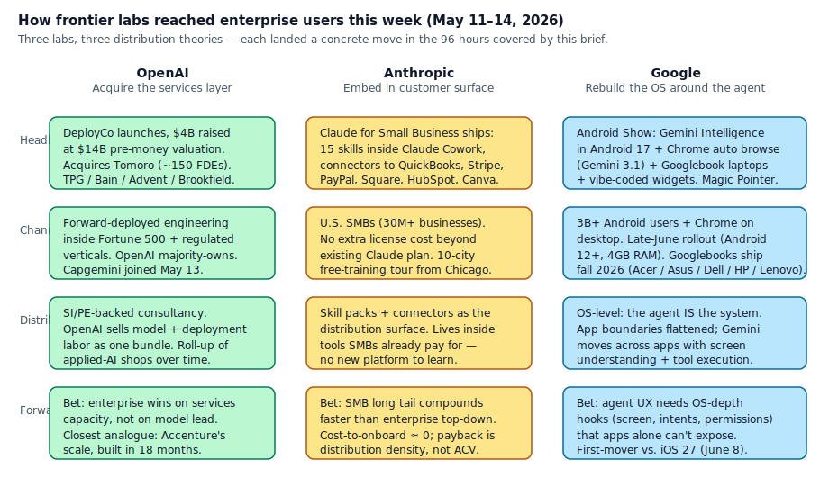
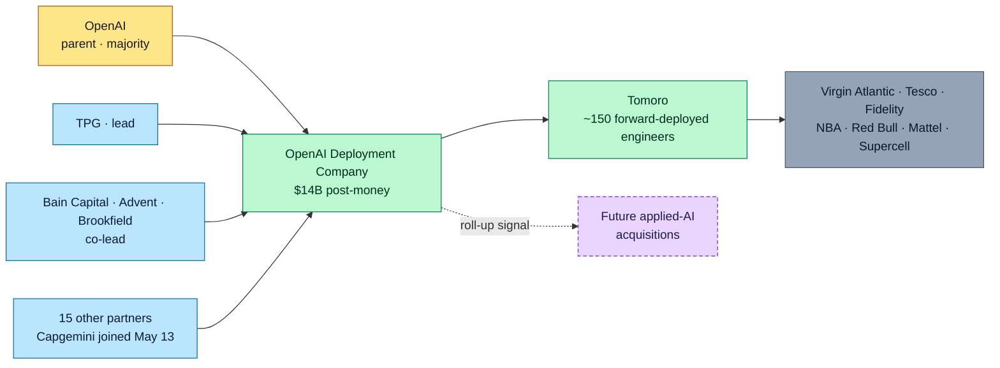
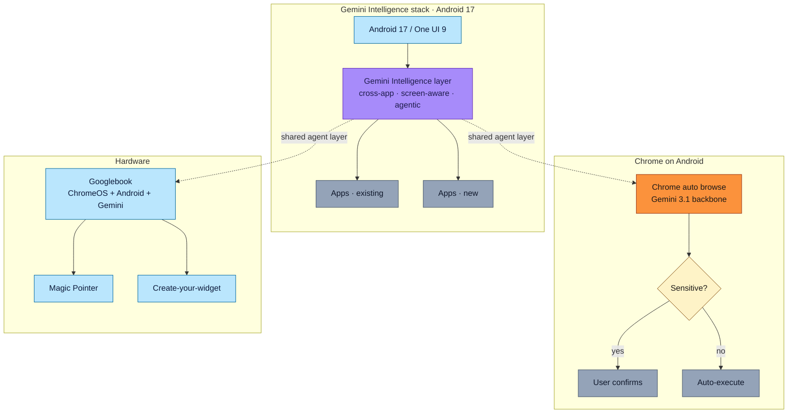
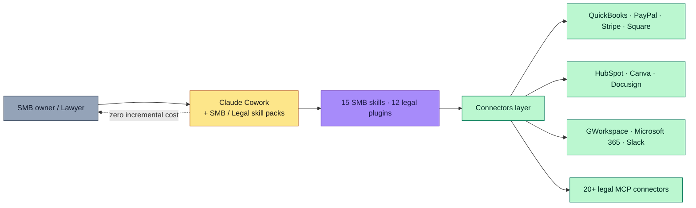
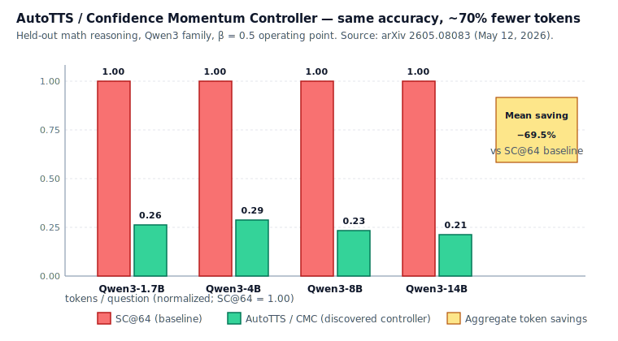
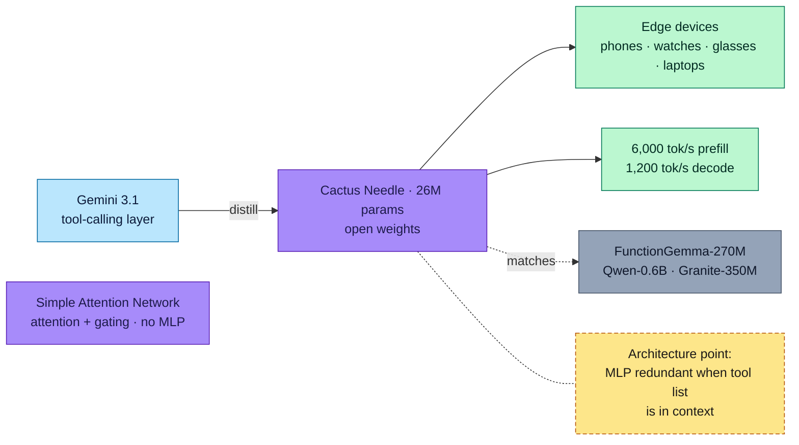

# LLM Updates — 2026-May-14

End-of-week brief, written Thursday May 14 (Los Angeles time). The May 8
report covered Anthropic × SpaceX Colossus 1, OpenAI's GPT-Realtime-2 /
Translate / Whisper drop, the Trusted Contact + CPC-ads + Deployment-Company
package, Zyphra ZAYA1-8B on AMD MI300x, the ReasonMaxxer "RL is sparse
policy selection" paper, ServiceNow × Anthropic, Cognizant Secure AI, and
the iOS 27 Extensions firming-up. The six days since have been about
**distribution** — three frontier labs each landed a concrete distribution
move, plus two research papers worth keeping, one on-device tool-call
model, and Alibaba's first quarter that puts numbers on the
"AI is now real cloud revenue" claim:

1. **OpenAI Deployment Company → live (May 11)** — the $4B raise telegraphed
   on May 7 closed. DeployCo launches as a standalone OpenAI subsidiary at a
   $14B pre-money valuation, with TPG / Bain Capital / Advent / Brookfield as
   co-lead founding partners and 19 firms in total. Founding acquisition:
   **Tomoro**, the Scottish applied-AI consultancy with ~150 forward-deployed
   engineers (Virgin Atlantic, Tesco, Fidelity, NBA, Red Bull, Supercell).
   Capgemini joined as an investor on May 13.
2. **Google "Android Show: I/O Edition" (May 12)** — Google previewed
   **Gemini Intelligence** as an OS-level agent for Android 17, shipped
   **Gemini in Chrome with auto browse** (Gemini-3.1-backed) for Android,
   and announced **Googlebook**, an AI-native laptop line built with Acer,
   Asus, Dell, HP, and Lenovo. The framing — "we're transitioning from an
   operating system to an intelligence system" — is the first OS vendor
   stating the OS *is* the agent.
3. **Claude for Small Business (May 13)** — Anthropic released **15
   pre-built SMB workflows** inside Claude Cowork, connecting to QuickBooks,
   PayPal, Stripe, Square, HubSpot, Canva, Docusign, Slack, Webflow, Gmail,
   and Microsoft 365. No incremental license cost. Paired with a **10-city
   free-training tour** from Chicago.
4. **Claude Code rate-limit +50% (May 13)** — weekly limits on Claude Code
   raised 50% for Pro / Max / Team / Enterprise through July 13, plus **Opus
   4.7 Fast mode** in research preview through the API. Read together with
   the May 6 Colossus-1 capacity step, this is the second rate-limit
   *raise* on Anthropic's release rhythm in eight days.
5. **Anthropic Legal MCP expansion (May 13)** — 20+ new legal-domain MCP
   connectors and 12 practice-area plugins. Pairs with §3 (SMB) as the
   second vertical-distribution package Anthropic has shipped in a week.
6. **AutoTTS / Confidence Momentum Controller (arXiv May 12)** — Zheng et al.
   show that a small agent can **discover** test-time-scaling controllers
   that beat hand-crafted self-consistency on the accuracy/cost frontier.
   Their discovered controller, **CMC**, cuts aggregate token usage **~69.5%
   vs SC@64** at matched accuracy across Qwen3 1.7B / 4B / 8B / 14B, total
   discovery cost **$39.9 / 160 minutes**.
7. **"The Many Faces of On-Policy Distillation" (arXiv May 11)** — a
   critical empirical study of OPSD that catalogs three concrete failure
   modes (collapse to teacher prior, mode-shrinkage, and on-policy bias
   amplification) and gives a recipe to detect each before they burn the
   training run.
8. **Cactus Needle (May 12)** — Cactus Compute distilled **Gemini 3.1's
   function-calling layer** into a **26M-parameter "Simple Attention
   Network"** with no MLP / feed-forward layers. Runs at **6,000 tok/s
   prefill / 1,200 tok/s decode**, competitive with FunctionGemma-270M,
   Qwen-0.6B, and Granite-350M at one-tenth to one-twenty-third the
   parameter count.
9. **iOS 27 Extensions API confirmed in beta (May 7–13)** — the May 6
   Bloomberg rumor and May 7/8 multi-source firming-up have moved into
   actual iOS 27 test-build stubs. Apple's WWDC keynote on June 8 will
   confirm; the Extensions framework is now visible in beta strings.
10. **Alibaba Q4 FY26 earnings (May 13)** — Cloud Intelligence Group grew
    38% YoY to $6.04B. **AI-related products = ~30% of external cloud
    revenue ($1.3B / quarter)**, with triple-digit YoY growth. CEO Eddie
    Wu publicly projected AI > 50% of cloud revenue within 12 months and
    confirmed Alibaba will exceed its three-year 380B-yuan (~$55B) AI
    capex commitment.

Items already covered in the April 30 / May 1 / May 4 / May 6 / May 8 briefs
— GPT-5.5 Instant default, Claude for Finance, SubQ 12M context, Apple
ParaRNN / Manzano / Mirror-SD, Mistral Medium 3.5, NIST CAISI's DeepSeek
V4-Pro evaluation, FlashAttention-4, Mamba-3, DLM, Genie 3, ZAYA1-8B's
CCA / MoE++ stack, ReasonMaxxer's sparse-policy-selection thesis,
Anthropic × SpaceX Colossus 1, GPT-Realtime-2, ServiceNow Build Agent,
Cognizant Secure AI, Perplexity finance_search — are referenced briefly
where the May 9–14 news intersects them, and not re-derived.

---

## 1. Three labs, three distribution theories

The single most striking shape of the May 9–14 window is that the three
US frontier labs each landed a concrete distribution move in the same
96 hours, and the three moves are *non-overlapping bets* about how
frontier-model adoption scales from here. The table below is the
working model; sections 2–4 unpack the moves themselves.

The differences worth saying out loud:

- **OpenAI buys the services layer.** DeployCo + Tomoro is the same shape
  Accenture and Deloitte spent twenty years building, compressed into a
  $4B vehicle. The bet is that enterprise model adoption is bottlenecked
  on *deployment labor*, not on model capability, and that capturing that
  labor margin is more valuable than licensing models to an SI that
  captures it instead. OpenAI keeps majority control of the new entity.
- **Anthropic embeds inside the customer's existing surface.** Claude for
  Small Business has no new product to install; it lives inside QuickBooks
  / PayPal / Stripe / Square / HubSpot / Docusign / Microsoft 365 / Google
  Workspace. The May 13 legal MCP expansion (20+ connectors, 12
  practice-area plugins) is the same playbook one tier up. Anthropic's
  bet: distribution density wins over ACV concentration, especially in
  the SMB long tail where SI-led deployments have historically been
  cost-prohibitive.
- **Google rebuilds the OS around the agent.** Gemini Intelligence in
  Android 17 + Gemini-in-Chrome auto-browse on Android + Googlebook as
  net-new hardware adds up to the strongest "the agent is the operating
  system" position any vendor has shipped. Google's bet: agent UX needs
  OS-depth hooks (screen understanding, intent capture, permissions,
  cross-app state) that an app-tier agent can't expose. The timing —
  one month before Apple's WWDC iOS 27 reveal on June 8 — is not an
  accident.

These bets are *all internally consistent*. The interesting question is
whether they're all correct. The historical pattern in enterprise
software says distribution-density and OS-depth both win in different
verticals; the services-layer bet has the longest track record but also
the lowest defensibility. The next twelve months will sort which lab's
read of the bottleneck was right.

---

## 2. OpenAI Deployment Company: from blog post to subsidiary in four days

The May 7 brief flagged OpenAI's $4B raise to spin up a deployment
vehicle. On **May 11** the vehicle launched, with three concrete
specifics that weren't in the original reporting
([OpenAI press release](https://openai.com/index/openai-launches-the-deployment-company/),
[Bloomberg](https://www.bloomberg.com/news/articles/2026-05-11/openai-to-buy-consulting-firm-for-private-equity-joint-venture),
[Axios](https://www.axios.com/2026/05/11/openai-deployco-private-equity),
[TechCrunch via The Next Web](https://thenextweb.com/news/tomoro-openai-deployment-company-consulting),
[CIO Dive](https://www.ciodive.com/news/openai-deployment-company-4-billion-ai-consulting-integration/819942/)):

| Item                          | Value                                                |
| ----------------------------- | ---------------------------------------------------- |
| Standalone subsidiary         | **OpenAI Deployment Company** ("DeployCo")           |
| Initial investment            | **$4B**                                              |
| Pre-money valuation           | **$10B** (≈ **$14B post**)                           |
| Lead investor                 | **TPG**                                              |
| Co-lead founding partners     | Advent, Bain Capital, Brookfield                     |
| Total partners                | **19** investment firms, SIs, and consultancies      |
| Founding acquisition          | **Tomoro** (Scottish applied-AI consultancy)         |
| Tomoro headcount transferred  | **~150** forward-deployed engineers / specialists    |
| OpenAI control                | **Majority** retained                                |
| Capgemini investment          | Joined May 13 ([TechMarketView](https://www.techmarketview.com/ukhotviews/archive/2026/05/13/capgemini-invests-in-openai-deployment-company)) |

**Tomoro is the right founding piece**
([Tomoro's announcement](https://tomoro.ai/insights/tomoro-acquired-by-openai-deployment-company),
[Bain & Company release](https://www.bain.com/about/media-center/press-releases/2026/bain-company-openai-a-new-venture-to-deploy-ai-at-enterprise-scale/),
[Digit.fyi](https://www.digit.fyi/openai-acquires-scottish-ai-firm-tomoro-in-4bn-deployment-drive/),
[Let's Data Science](https://letsdatascience.com/blog/openai-deployment-company-4b-tpg-tomoro-may-11-2026)).
It was founded in 2023 *as an OpenAI partner*, ran live deployments inside
Virgin Atlantic (concierge), Supercell (in-game support agents), Fidelity
International, Tesco, Red Bull, Mattel, and the NBA, and gives DeployCo an
immediate ~150 forward-deployed engineers without a recruiting cycle. The
strategic read: OpenAI bought *deployment know-how at scale* in a single
transaction.

**The valuation is the actual headline.** DeployCo launches at $14B
post-money — half of Palantir's revenue multiple, with no operating
history. The implied bet is that AI-deployment services compound
faster than software-licensing margin compresses. Whether that bet
holds is the open question of the back half of 2026.

**Bain & Company invested** ([press release](https://www.bain.com/about/media-center/press-releases/2026/bain-company-openai-a-new-venture-to-deploy-ai-at-enterprise-scale/))
and is named in the founding partner list — meaning DeployCo will *not*
compete with the top-tier strategy houses on strategy work, only on
applied-AI engineering. That's the cleanest possible market boundary
for the vehicle to keep its PE investors comfortable while not torching
its SI partnerships.

---

## 3. Google: the operating system is the agent

Google's annual "I/O" had a **pre-I/O Android Show** on **May 12**, ahead
of the main I/O 2026 keynote on **May 19–20**. The Android Show landed
three OS-level moves and one piece of net-new hardware
([Google blog](https://blog.google/products-and-platforms/platforms/android/android-show-io-edition-2026/),
[TechCrunch](https://techcrunch.com/2026/05/12/everything-google-announced-at-its-android-show-from-googlebooks-to-vibe-coded-widgets/),
[Engadget](https://www.engadget.com/2171038/everything-announced-at-android-show-google-io-2026/),
[CNBC](https://www.cnbc.com/2026/05/12/google-races-put-gemini-at-center-of-android-before-apples-ai-reboot.html),
[MacRumors / "Gemini Intelligence" framing](https://www.macrumors.com/2026/05/12/google-previews-android-17/)).

### 3.1 Gemini Intelligence on Android 17

The product framing came directly from Sameer Samat (Android lead):
*"We're transitioning from an operating system to an intelligence system."*
Concretely:

- Gemini Intelligence can **move across apps**, **understand what's on
  the screen**, and **complete multi-step tasks** that historically
  required the user to context-switch.
- Available on Android 12+ devices with **≥4GB RAM** at launch in late
  June (US first; international rolling).
- Distribution scale: **3 billion+ Android users** worldwide. There has
  never been an LLM-rollout cohort this big.

The architectural significance is that Gemini is no longer a tab in the
app drawer — it's a layer that sits *above* the app graph, with
permission to read screen state and write into apps it has authorization
for. That is precisely what Apple has signaled iOS 27 Extensions will
become; the difference is that Google can ship it without waiting for
WWDC.

### 3.2 Gemini in Chrome + auto browse (Android)

Chrome on Android picks up **auto browse**, an agentic browsing mode
that "automate[s] errands like booking parking or updating orders, with
built-in security to confirm sensitive actions"
([Google Chrome blog](https://blog.google/products-and-platforms/products/chrome/bringing-chrome-ai-to-android/),
[Chrome Gemini-3 release notes](https://blog.google/products-and-platforms/products/chrome/gemini-3-auto-browse/),
[UC Today](https://www.uctoday.com/productivity-automation/gemini-in-chrome-android/)).
Powered by **Gemini 3.1** — confirming the production-tier model for
2026 Q2 is now Gemini 3.1, with Gemini 3.2 Flash still in iOS-app /
AI Studio leak status pending the I/O 2026 keynote on May 19–20.

The auto-browse design pattern worth noting: **sensitive actions are
explicitly held back for user confirmation** (payments, account
changes), with the rest of the flow executed inline. That's the same
human-in-the-loop boundary that ServiceNow's Action Fabric MCP server
adopted on May 7 — the convergence on "agent executes routine,
confirms before consequential" as the default UX shape is one of the
clearer patterns to emerge in May.

### 3.3 Googlebook: an AI-native laptop

**Googlebook** is a net-new laptop category: ChromeOS + Android + Gemini
Intelligence merged into one OS, with five OEMs shipping hardware in fall
2026 ([Google blog](https://blog.google/products-and-platforms/platforms/android/meet-googlebook/),
[TechCrunch](https://techcrunch.com/2026/05/12/google-unveils-googlebooks-a-new-line-of-ai-native-laptops/),
[MacRumors](https://www.macrumors.com/2026/05/12/google-unveils-googlebook/),
[9to5Google](https://9to5google.com/2026/05/12/googlebooks-announcement/),
[SiliconANGLE](https://siliconangle.com/2026/05/12/google-debuts-gemini-intelligence-automation-features-googlebook-laptop-series/)).
Two of the new affordances are worth recording:

- **Magic Pointer.** A DeepMind-developed cursor that surfaces
  contextual suggestions on cursor-wiggle (schedule a meeting from
  a date in an email; visualize a couch in a photo of your living
  room). Think of it as "right-click for the agent age."
- **Create-Your-Widget.** Prompt-built widgets that pull live data
  from Gmail / Calendar / Drive / web sources. The agent compiles
  a personal dashboard *the user prompts into existence*. Closest
  analogue: **vibe-coding for the home screen**.

Googlebook is Google's first **hardware bet around the agent** since
Pixel — and unlike Pixel, it ships through five OEMs (Acer, Asus, Dell,
HP, Lenovo) rather than first-party, which is a structurally different
distribution play.

### 3.4 What I/O 2026 (May 19–20) likely adds

Three items have leaked or been pre-confirmed and should land at the
main keynote:

- **Gemini 3.2 Flash** — already visible in iOS Gemini-app strings
  and AI Studio metadata on May 5, leaked pricing **$0.25 / $2.00**
  per 1M input/output tokens
  ([Build Fast With AI](https://www.buildfastwithai.com/blogs/gemini-3-2-flash-release-2026),
  [Pasquale Pillitteri](https://pasqualepillitteri.it/en/news/2013/gemini-3-2-flash-leak-ios-ai-studio-2026-en)).
- **Workspace agent expansion** — covered in §3.1 in the May 8 brief
  as "almost certain"; the Android Show keynote was the warm-up.
- **Android XR** — Google has staged the Android XR developer event
  for I/O 2026 evening; expect spatial Gemini surfaces.

---

## 4. Anthropic: Small Business + Legal + Code rate-limit raise

Anthropic shipped three coordinated moves on **May 13** that, taken
together, are the most aggressive distribution push the lab has run in
2026 — and *all three* land on the same Wednesday.

### 4.1 Claude for Small Business

The headline of the day is **Claude for Small Business**: a package of
**15 pre-built workflows** (Anthropic uses the term "skills") for small
business owners, surfaced through a toggle inside **Claude Cowork** —
the task-automation surface introduced earlier this year
([Anthropic via 9to5Mac](https://9to5mac.com/2026/05/13/anthropics-latest-claude-release-turns-your-mac-into-a-small-business-powerhouse/),
[TechCrunch](https://techcrunch.com/2026/05/13/anthropic-courts-a-new-kind-of-customer-small-business-owners/),
[Inc](https://www.inc.com/ben-sherry/anthropics-newest-claude-feature-is-here-to-help-small-business-owners-with-their-pain-points/91343926),
[Axios](https://www.axios.com/2026/05/13/anthropic-claude-small-business-smb),
[The Register](https://www.theregister.com/ai-ml/2026/05/13/anthropic-butts-in-to-small-business-promises-help-with-payroll-and-other-core-tasks/5239967),
[Fast Company](https://www.fastcompany.com/91540953/anthropic-launches-claude-for-small-business),
[SiliconANGLE](https://siliconangle.com/2026/05/13/anthropic-launches-claude-small-business-new-automation-workflows/)).

The 15 workflows span the SMB operations stack: **payroll**, **books-vs-financial-statements
reconciliation**, **business-insight surfacing**, **marketing campaigns**,
and **employee onboarding** are the headline five. Connectors at launch:

- **Accounting / payments:** QuickBooks, Stripe, PayPal, Square
- **CRM / marketing:** HubSpot, Canva
- **Documents:** Docusign, Google Workspace (Gmail / Drive / Calendar),
  Microsoft 365
- **Collaboration:** Slack
- **E-commerce:** Webflow

**Pricing:** no incremental license cost beyond the Claude plan and
whatever the business already pays for connector software. Anthropic
is funding distribution through a **10-city free-training tour** out of
Chicago, with **100 SMB owners per workshop**. The shape of the bet is
the same as the May 7 ServiceNow expansion: *Anthropic does not build
the surface; it inserts Claude into the surface the customer already
trusts*.

The SMB market sizing read: the U.S. alone has ~33M small businesses,
versus ~20K enterprises with >$1B revenue. If Anthropic captures
even single-digit-percent penetration of the SMB long tail at zero
incremental ACV (the connector model means the seat margin is in the
existing Claude Pro/Team subscription), the cumulative ARR exceeds
Enterprise-tier ACV concentration — but only if the connector quality
and the SMB-skill quality clear the trust bar. The 10-city tour is
the trust-building leg of the rollout.

### 4.2 Claude Code weekly rate-limit raise (+50%)

Pro / Max / Team / Enterprise weekly limits on Claude Code raised **50%
through July 13, 2026** ([Releasebot](https://releasebot.io/updates/anthropic/claude-code),
[Pasquale Pillitteri](https://pasqualepillitteri.it/en/news/2494/claude-code-weekly-limits-50-percent-anti-codex-anthropic-2026)).
Read together with the **2× rate-limit raise on May 6** (the SpaceX
Colossus 1 capacity step, covered in last week's brief), this is the
**second rate-limit raise in eight days**, and the first time in 2026
that Anthropic has had enough headroom to ship two raises in the same
quarter, never mind the same week.

The operationally relevant note: Pro and Max users running Claude Code
in CI under the old quotas should re-check their retry-and-backoff
config. The May 8 brief flagged this for Pro/Max chat limits; on May 13
the same applies to **claude-code-weekly**.

### 4.3 Claude Opus 4.7 Fast mode (research preview)

The Claude Developer Platform added **Fast mode for Opus 4.7** through
the API: set `speed: "fast"` with `model: "claude-opus-4-7"` and the
`fast-mode-2026-02-01` beta header, and you get **significantly faster
output-token generation at premium pricing** ([Releasebot Claude
updates](https://releasebot.io/updates/anthropic/claude)). The same
model lattice as the Claude Code CLI Fast Mode that shipped on Opus
4.6 earlier in 2026, now extended to API users on the current Opus.

### 4.4 Legal MCP expansion (20+ connectors, 12 practice plugins)

Anthropic also shipped **20+ new legal-domain MCP connectors and 12
practice-area plugins** on May 13 ([Releasebot Anthropic updates](https://releasebot.io/updates/anthropic)).
The connectors cover litigation research, contract review, discovery
management, matter management, and legal-aid intake. The pattern is the
same vertical-skill-pack shape as Claude for Small Business and Claude
for Finance (covered May 4 / May 6 briefs): **Anthropic ships the
plumbing, not the product**, and lets the vertical SI / customer ship
the surface.

---

## 5. AutoTTS / Confidence Momentum Controller: discovering inference scaling

If ReasonMaxxer (May 7) reframed RL post-training as **sparse policy
selection**, the most consequential paper of the May 9–14 window —
**"LLMs Improving LLMs: Agentic Discovery for Test-Time Scaling"** by
Zheng et al., **arXiv 2605.08083** — reframes **test-time scaling**
the same way ([arXiv abstract](https://arxiv.org/abs/2605.08083),
[arXiv HTML](https://arxiv.org/html/2605.08083),
[project page](https://zhengkid.github.io/AutoTTS-web/),
[GitHub](https://github.com/zhengkid/AutoTTS),
[HuggingFace paper](https://huggingface.co/papers/2605.08083),
[Firethering explainer](https://firethering.com/autotts-ai-inference-test-time-scaling/)).

The setup: most TTS strategies in production today — self-consistency,
Tree-of-Thoughts, beam search at the trajectory level, majority-voting
ensembles — are **hand-designed**. Researchers pick the branching factor
and stopping criterion by intuition, tune the heuristics by hand, and
ship the result. AutoTTS argues this is exactly the problem
neural-architecture-search solved for model topology a decade ago:
make the strategy space discoverable.

**The mechanic.** AutoTTS:

1. Pre-collects a corpus of reasoning trajectories and *probe signals*
   from a base model on a small math dataset.
2. Defines a **controller** — a program that decides at each round
   whether to branch, continue, probe, prune, or stop — over those
   trajectories. The decision is *cheap* because the trajectories are
   pre-computed; no new LLM calls during search.
3. Uses an agent to **search the controller space**, with execution-trace
   feedback ("here's why this controller failed at step 7") to guide
   the search.
4. The winning controller is **CMC, the Confidence Momentum Controller**.

**CMC's contribution.** Prior TTS gates use *instantaneous* Beta-majority
confidence at the current step. CMC replaces it with an **exponential
moving average over the last T_ema rounds** plus a **non-deterioration
delta**: the gate fires only when EMA confidence is both *high* and *not
falling*. The result is that lucky single-step confidence spikes — the
known failure mode of self-consistency — can no longer trigger early
stopping.

**The numbers.** At β = 0.5 (balanced operating point):

- **Token usage cut ~69.5%** vs running 64 parallel chains (SC@64).
- **Held-out accuracy matched** across Qwen3-1.7B / 4B / 8B / 14B.
- Discovery cost: **$39.9 / 160 minutes** of compute, end to end.

The strategy generalises **out-of-distribution** — it was discovered on
one benchmark/model and held on others — which is the requirement that
killed most prior search-based TTS proposals.

**Why this matters in production.** Almost every reasoning-class agent
in production today runs some hand-tuned TTS loop — self-consistency
at N=8, N=16, N=64 are the typical configs. The cost of "always run
64 chains" is roughly 64× the single-chain inference cost; the cost of
"adapt the chain count to per-question difficulty" is much lower, but
no one ships it because the adaptation logic is hard to design. AutoTTS
shows the adaptation logic can be **discovered for $40 of compute** and
**transfer across model scales**. If the result holds in replication,
inference cost for production reasoning loops drops materially through
H1 2026.

The interesting downstream is the **stacking** read. ReasonMaxxer cut
**RL cost** by ~1000× by identifying the right intervention points
without rollouts. AutoTTS cuts **TTS cost** ~3× by discovering the
right controller without manual tuning. Both are *cost compression at
the post-training and inference frontier*. The same week ZAYA1-8B
showed an 8× KV-cache compression, and Cactus Needle showed a 10–23×
parameter compression for tool-calling — see §7 — the through-line is
that May 2026 is **the cost-compression month**.

---

## 6. The Many Faces of On-Policy Distillation: a sharp critique

**"The Many Faces of On-Policy Distillation: Pitfalls, Mechanisms, and
Fixes"**, **arXiv 2605.11182** (May 11) is the necessary counterweight
to the recent enthusiasm around OPSD as a post-training tool
([arXiv abstract](https://arxiv.org/abs/2605.11182)).

OPSD — first formalised in arXiv 2601.18734 (Zhao et al., January 2026,
covered in our Feb / April briefs) — has been adopted as a post-training
method by several open-weight efforts (the **Self-Distilled Reasoner**
line, ZAYA1-8B's SFT step, the Lightning OPD work). It's attractive
because it gives **dense token-level supervision** on **on-policy
rollouts**, which sidesteps the off-policy bias of standard distillation.

The May 11 paper catalogs three concrete failure modes:

1. **Collapse to teacher prior.** When the teacher conditions on
   privileged information (e.g., a verified reasoning trace) and the
   student does not, the student can over-fit to *imitating the
   teacher's surface distribution* rather than learning to reach the
   teacher's *behavior* from its own context. The student's diversity
   collapses; held-out tasks degrade.
2. **Mode shrinkage.** Across training, the student's output entropy
   monotonically falls. In small models this is desirable (less
   noise); in models near the capability frontier it removes the
   exploration that downstream RL or TTS relies on. ZAYA1-8B's
   PID-controlled router (May 6 brief) is one example of architectures
   that *resist* mode shrinkage; OPSD-trained models without that
   guardrail can lose ~15% of pass@k performance.
3. **On-policy bias amplification.** Because the student samples from
   its own current distribution, any early bias in that distribution
   gets reinforced. The paper shows this is detectable as a *rising*
   ratio of teacher-divergence over training — most easily monitored
   by tracking the per-token KL between teacher and student on a held-out
   probe set.

**The fix recipe.** For each failure mode the paper gives a concrete
diagnostic + a concrete mitigation: **information-rate-matched
prompting** for (1), **entropy-floor regularisation** for (2), and
**rolling-KL early-stopping** for (3). The mitigations are small —
each adds < 5% training-compute overhead — and the failure-mode
catalog is the more durable contribution.

For teams running OPSD pipelines in production: this is the **first
public failure-mode taxonomy with named diagnostics**. The April 2026
OPSD survey (arXiv 2604.00626) is the conceptual primer; this paper is
the operations manual.

---

## 7. Cactus Needle: tool-calling distilled to 26M parameters, no MLP

The on-device story of the week is **Cactus Needle**, a **26-million-parameter
function-calling model** distilled from **Gemini 3.1**'s tool-calling layer,
shipping under fully open weights
([Cactus on HuggingFace](https://huggingface.co/Cactus-Compute/needle),
[GitHub](https://github.com/cactus-compute/needle),
[Simple Attention Networks docs](https://github.com/cactus-compute/needle/blob/main/docs/simple_attention_networks.md),
[Hacker News thread](https://news.ycombinator.com/item?id=48111896),
[Startup Fortune](https://startupfortune.com/needle-shows-tiny-models-can-move-ai-agents-onto-devices/),
[TechPlanet](https://techplanet.today/post/needle-distilling-gemini-into-a-26m-parameter-model-for-on-device-ai)).

Three things make Needle a real architectural data point and not just
a small model:

**(a) No MLP / feed-forward layers.** Cactus's "Simple Attention Network"
(SAN) thesis is that **for tool-calling specifically**, the MLP layers in
a transformer are doing redundant work — the model is essentially
rewriting the tool list into a different representation and then reading
it back. If the model has direct access to the tool list as external
context (it does, by construction for function-calling), the rewrite is
load-bearing for nothing. Drop the MLPs, keep attention and gating, and
the model retains tool-call quality at one-tenth the parameters.

**(b) Throughput on consumer silicon.** On a Cactus laptop runtime, Needle
hits **6,000 tokens/second prefill** and **1,200 tokens/second decode**.
At 26M parameters that's not surprising; what *is* surprising is that
the function-call task quality is competitive with **FunctionGemma-270M,
Qwen-0.6B, and Granite-350M** — models with 10× to 23× the parameter
count.

**(c) Training profile.** 200B pretraining tokens on **16 TPU v6e units**,
plus 2B post-training tokens of function-call data. The end-to-end
training profile fits on a single research lab's experiment-budget line,
which is the second-derivative point: distilled tool-calling is now
*reproducible* by small teams.

The strategic shape worth flagging: if MLP-less SANs hold for
tool-calling, **the same architectural argument extends to retrieval-
grounded generation** (the model has direct access to the corpus through
context; the MLP rewriting is partially redundant). Cactus has not made
that claim, but it's the implied direction. If true, the on-device LLM
stack for **tool-using + retrieval-augmented** agents collapses to a
30–50M-parameter footprint that runs at thousands of tokens per second
on phones, watches, and glasses. That's the on-device frontier moving
from "tomorrow's bet" to **shippable today**.

---

## 8. Alibaba Q4 FY26 earnings: putting numbers on the "AI is real" claim

Alibaba reported on **May 13** ([CNBC](https://www.cnbc.com/2026/05/13/alibaba-earnings-march-quarter-ai-cloud-growth.html),
[Bloomberg via TradingKey](https://www.tradingkey.com/analysis/stocks/us-stocks/261894140-alibaba-baba-earnings-cloud-growth-ai-revenue-qwen-investment-valuation-re-rating-technical-analysis-tradingkey),
[Domain-b](https://www.domain-b.com/technology/artificial-intelligence/alibaba-cloud-ai-growth-profitability-pressure-2026),
[Invezz](https://invezz.com/ng/news/2026/05/13/alibaba-shares-fall-as-ai-spending-dents-earnings-despite-strong-cloud-growth/)).
The earnings matter to LLM forecasters because they're the first quarterly
report from a hyperscaler in 2026 that breaks out AI revenue with enough
detail to test the "AI cloud demand is real" hypothesis directly. The
numbers:

| Metric                                  | Q4 FY26 value                              |
| --------------------------------------- | ------------------------------------------ |
| Cloud Intelligence Group revenue        | **¥41.6B / $6.04B** · **+38% YoY**         |
| AI-related products in cloud revenue    | **~$1.3B** · **~30%** of external segment  |
| AI revenue growth                       | **Triple-digit YoY** (third consecutive Q) |
| Projected AI share of cloud (12 mo)     | **> 50%** (Eddie Wu)                       |
| Three-year AI capex commitment          | **¥380B / ~$55B** · *will exceed*          |
| Operating result                        | Core profit compressed by AI spend         |
| Stock reaction (May 13)                 | **+7–8%**                                  |

Two things worth flagging beyond the headline numbers:

**(a) The Qwen "shop via chat" monetization tie-in.** Alibaba's Q4
explicitly attributed cloud growth in part to **Qwen's shopping-agent
upgrade on Taobao / Tmall**, where users complete purchases through
conversational interactions rather than browsing. This is the first
publicly-disclosed direct-revenue tie-in from a Chinese frontier
open-weight model into the parent company's commerce surface, and the
shape is closer to "Gemini shopping in Chrome auto-browse" than to
"Claude SMB connectors": the agent is **inside the buy flow**, not
adjacent to it.

**(b) The capex-vs-margin tradeoff is now public.** Alibaba's core
profit fell despite cloud revenue growth, *because* of AI capex. CFO
commentary acknowledged the tradeoff directly and committed to
exceeding the ¥380B three-year plan. Investors initially rewarded
the move (+7–8%) — a contrast to U.S. hyperscalers, where margin
contraction from AI capex has historically been punished. The signal
worth tracking: whether the U.S. hyperscaler pattern shifts as Q2 2026
earnings land in the next month, with Alibaba as the precedent.

---

## 9. iOS 27 Extensions: beta stub visible, June 8 keynote firm

The May 6 / May 8 Apple-Extensions story is now in iOS 27 test-build
strings, per Apple's own internal description rather than Bloomberg
sourcing ([Apple-Siri-iOS-27-Extensions guide](https://www.digitalapplied.com/blog/apple-siri-ios-27-extensions-claude-gemini-chatgpt-guide),
[MacRumors May 7](https://www.macrumors.com/2026/05/07/ios-27-and-macos-27-rumored-features/),
[Fello AI WWDC 2026 preview](https://felloai.com/wwdc-2026-preview/),
[WWDC 2026 guide](https://www.abhs.in/blog/apple-wwdc-2026-dates-ios-27-gemini-siri-developer-guide)).
WWDC keynote is firm for **Monday June 8, 2026 at 10am PT**; developer
betas of iOS / iPadOS / macOS 27 are expected immediately, public betas
in July, full release in September.

Three things crystallised this week that weren't certain at the May 8
brief:

- **Per-feature routing is per-Apple-Intelligence-feature**, not
  per-system-call. Users will pick a model for Siri, a different model
  for Writing Tools, a different model for Image Playground, etc. —
  not a single global selection. That's the architecturally clean
  shape and matches the way Mac default-browser / default-mail-client
  preferences work today.
- **Apple's on-device 3B + server PT-MoE sits under the same routing
  layer.** Extensions does not bypass Apple Intelligence; it lets the
  user override the default for specific features. The on-device path
  is preserved as the fallback for offline / privacy-sensitive use.
- **Apple Intelligence Extensions API is in iOS 27 test builds.**
  The beta strings reference "AppleIntelligenceExtension" and confirm
  that any chatbot app can register an extension once the API is
  public — meaning the route is **app-registered**, not
  Apple-pre-approved-per-provider. That's a structurally more open
  channel than the iOS 18 ChatGPT special case.

The competitive frame against Google's May 12 Android Show: **Google
ships agentic OS in late June; Apple ships substitutable model choice
through Extensions in September**. Different design philosophy, same
fundamental observation that the agent UI needs OS hooks the app tier
can't expose.

---

## 10. Frontier snapshot, May 14

The May 8 frontier table holds, with three lines updated and one new:

| Slot                          | Top model / item (May 14)                          | Comment                                                       |
| ----------------------------- | -------------------------------------------------- | ------------------------------------------------------------- |
| Frontier reasoning            | Claude Opus 4.7 (+ Fast mode preview)              | Fast mode now in research preview through the API             |
| Frontier coding               | GPT-5.5 Pro / Claude Opus 4.7                      | Claude Code weekly limits +50% through July 13                |
| Default consumer chat         | GPT-5.5 Instant                                    | unchanged                                                     |
| Voice / realtime              | GPT-Realtime-2                                     | unchanged from May 7                                          |
| Open-weight frontier          | DeepSeek V4-Pro / Mistral Med 3.5 / Qwen 3.6       | Qwen 3.6-Plus now MMLU-Pro leader at 0.885                    |
| Open-weight efficient         | ZAYA1-8B (Apache 2.0)                              | unchanged from May 6                                          |
| **On-device tool-calling**    | **Cactus Needle (26M, May 12)**                    | distilled from Gemini 3.1 · no-MLP SAN · 6000 tok/s prefill   |
| On-device flagship            | Apple PT-MoE + 3B local                            | iOS 27 Extensions API stubs visible in beta strings           |
| Multimodal unified            | Manzano (research) / GPT-5.5                       | unchanged                                                     |
| Subquadratic / long-context   | SubQ (claims) · Mamba-3 · GPT-5.5                  | independent SubQ verification still pending                   |
| Enterprise vertical (finance) | Claude for Finance + Perplexity Finance Search    | unchanged                                                     |
| **Enterprise vertical (SMB)** | **Claude for Small Business (May 13)**             | 15 skills · 12+ connectors · 10-city training tour            |
| **Enterprise vertical (legal)** | **Claude legal MCP pack (May 13)**               | 20+ legal connectors · 12 practice-area plugins               |
| Capacity / infra              | Anthropic ↔ SpaceX Colossus 1                      | unchanged                                                     |
| **Services / deployment**     | **OpenAI Deployment Company (May 11)**             | $4B · $14B post · Tomoro acquired · Capgemini joined          |
| **Agentic OS**                | **Android 17 + Gemini Intelligence (May 12)**      | first OS-level agent layer · Late June rollout · 3B+ Android  |
| RL-for-reasoning              | ReasonMaxxer (research)                            | unchanged from May 7                                          |
| **TTS / inference**           | **AutoTTS / CMC (research, May 12)**               | discovered controller · −69.5% tokens vs SC@64                |
| **On-policy distillation**    | **OPSD failure-mode catalog (research, May 11)**   | first public diagnostic taxonomy for OPSD failure             |
| Agent governance              | Cognizant Secure AI / ServiceNow Action Fabric MCP | unchanged                                                     |

---

## 11. Forward signals into the week of May 18–24

Calendar items and watch-list dated for the next seven days:

- **Google I/O 2026 keynote (May 19–20).** Gemini 3.2 Flash GA almost
  certain (pricing leaked at $0.25 / $2.00 per 1M input/output —
  see May 6 brief); Workspace agent expansion and Android XR likely
  on the keynote ([androidauthority preview](https://www.androidauthority.com/what-to-expect-from-google-io-2026-3664979/),
  [TechWiser countdown](https://techwiser.com/countdowns/google-i-o/)).
- **AutoTTS / CMC replications.** Code is at
  [github.com/zhengkid/AutoTTS](https://github.com/zhengkid/AutoTTS).
  Expect at least two third-party replications inside 10 days; the
  $40 / 160 minutes discovery cost is the part that determines whether
  this becomes a default-shipped strategy in production TTS loops.
- **OPSD failure-mode replications.** The arXiv 2605.11182 diagnostic
  recipes are simple to instrument; expect production-pipeline teams
  to add the rolling-KL and entropy-floor probes inside a sprint.
- **OpenAI DeployCo follow-on acquisitions.** Tomoro is the first;
  the original raise telegraphed three deals "in advanced talks."
  Expect at least one more announcement this week, more likely from
  the SI-roll-up direction than from the strategy-house direction.
- **Capgemini × DeployCo joint engagement structure.** Capgemini joined
  as an investor on May 13; the next public artifact will be a joint
  customer-deployment announcement, likely from a Capgemini-led
  Fortune 500 account.
- **Gemini Intelligence rollout pre-flight.** Late-June launch on
  Android 12+ / ≥4GB RAM. Watch for *capability-fence* leaks (which
  agent actions need user confirmation in the production build) as
  the first developer-preview seed lands.
- **Anthropic Mythos Preview broadening.** Glasswing access list at
  ~50 organizations as of May 8. Capacity headroom from Colossus 1
  + Claude Code rate-limit raise = the prerequisites for broadening
  are now in place; watch for an access-list announcement.
- **Apple iOS 27 developer-beta stubs.** WWDC is June 8 but Apple's
  pattern is to seed signals two weeks early. Watch 9to5Mac / MacRumors
  for AppleIntelligenceExtension API references.

---

## 12. Action set, May 14

For teams operating production LLM stacks this week:

**Inference cost**
- If you run **self-consistency at N=32 or N=64** in production, prototype
  AutoTTS / CMC against your reasoning workload. The 69.5% token reduction
  at matched accuracy is the largest cost cut on the table in May, and the
  $40 discovery cost is small enough to be a sprint-level experiment.
- If you're spending RL post-training hours on rollout-based PPO/GRPO,
  the ReasonMaxxer × AutoTTS combination is now the cost-floor for what
  "competitive math reasoning" costs to train and serve. Re-cost your
  next training run against both.

**On-device / edge**
- If you ship a tool-using agent on phone / watch / glasses, **try Cactus
  Needle** against your current function-call backbone. The no-MLP SAN
  thesis is reproducible from the open repo, and the parameter savings
  free up budget for retrieval-grounded context.
- For function-call quality validation, the Needle baseline puts the
  bar at FunctionGemma-270M / Qwen-0.6B / Granite-350M — confirm your
  larger-model setup actually justifies its inference cost.

**OPSD pipelines**
- If you train on OPSD, instrument the **three failure-mode probes**
  (information-rate-matched prompting test for teacher-prior collapse,
  entropy-floor monitor for mode shrinkage, rolling teacher-student KL
  for on-policy bias). The mitigations add <5% training compute; the
  detections are free.

**Anthropic stack**
- Claude Code limits are **+50% through July 13**. Audit CI-side
  retry/backoff and worker-pool sizing.
- Opus 4.7 Fast mode through the API: if you have a latency-sensitive
  Opus workload, A/B Fast against standard on your eval harness. The
  premium-pricing dimension is the part that determines whether it's
  net-positive for your workload.

**Vertical (SMB / legal / finance)**
- If your customer base is SMB, **prototype against Claude for Small
  Business connectors** before building a custom integration. The 15
  pre-built workflows cover most of the SMB ops stack and the connector
  list is broad enough to subsume the typical custom integration.
- If your firm is in legal services, the 20+ legal MCP connectors and
  12 practice-area plugins shipped May 13 are worth evaluating before
  starting any per-firm Claude rollout. Anthropic's release notes name
  the connectors explicitly.

**Distribution architecture**
- If you sell into Fortune 500 via SI partners, the **DeployCo** structure
  is a near-term competitor for forward-deployed-engineer wallet share.
  Re-cost your services line against the $14B-post-money implied price
  per FDE.
- If you sell into Android / Chrome users, the **late-June Gemini
  Intelligence rollout** changes the agent-baseline assumption for
  millions of users. Audit which of your features become redundant
  with OS-level Gemini and which become enhanced.

**Apple / WWDC**
- If your iOS app exposes agentic features, prep for the **Extensions
  API** in the iOS 27 developer beta after June 8. Apps that register
  as Apple-Intelligence Extensions on day one will own the "default
  for X" feature surface in the September public release.

---

## Sources

OpenAI Deployment Company
- [OpenAI — Launches the OpenAI Deployment Company](https://openai.com/index/openai-launches-the-deployment-company/)
- [Bloomberg — OpenAI to buy consulting firm for PE joint venture](https://www.bloomberg.com/news/articles/2026-05-11/openai-to-buy-consulting-firm-for-private-equity-joint-venture)
- [Bloomberg — OpenAI finalizes $10B venture with PE firms](https://www.bloomberg.com/news/articles/2026-05-04/openai-finalizes-10-billion-joint-venture-with-pe-firms-to-deploy-ai)
- [Axios — OpenAI launches AI consulting arm valued at $14B](https://www.axios.com/2026/05/11/openai-deployco-private-equity)
- [Yahoo Finance — OpenAI launches $4B AI deployment company](https://finance.yahoo.com/sectors/technology/articles/openai-launches-4-billion-ai-134916653.html)
- [PYMNTS — OpenAI launches $4B company](https://www.pymnts.com/news/artificial-intelligence/2026/openai-launches-4-billion-dollar-company-accelerate-enterprise-ai-adoption/)
- [Let's Data Science — OpenAI Deployment Company / TPG / Tomoro](https://letsdatascience.com/blog/openai-deployment-company-4b-tpg-tomoro-may-11-2026)
- [Constellation Research — OpenAI launches Deployment Company](https://www.constellationr.com/insights/news/openai-launches-openai-deployment-company-acquires-tomoro)
- [Tomoro — Acquired by OpenAI Deployment Company](https://tomoro.ai/insights/tomoro-acquired-by-openai-deployment-company)
- [The Next Web — Tomoro / OpenAI Deployment Company](https://thenextweb.com/news/tomoro-openai-deployment-company-consulting)
- [Digit.fyi — OpenAI acquires Tomoro](https://www.digit.fyi/openai-acquires-scottish-ai-firm-tomoro-in-4bn-deployment-drive/)
- [CIO Dive — OpenAI spins up standalone consulting business](https://www.ciodive.com/news/openai-deployment-company-4-billion-ai-consulting-integration/819942/)
- [Bain & Company — Invests in OpenAI Deployment Company](https://www.bain.com/about/media-center/press-releases/2026/bain-company-openai-a-new-venture-to-deploy-ai-at-enterprise-scale/)
- [TechMarketView — Capgemini invests in OpenAI Deployment Company](https://www.techmarketview.com/ukhotviews/archive/2026/05/13/capgemini-invests-in-openai-deployment-company)
- [Techstrong AI — OpenAI launches $4B venture, acquires Tomoro](https://techstrong.ai/articles/openai-launches-4-billion-venture-for-enterprise-market-acquires-tomoro/)
- [TechAfrica News — OpenAI Deployment Company backed by $4B](https://techafricanews.com/2026/05/12/openai-unveils-new-deployment-company-backed-by-4-billion-investment/)

Google Android Show / I/O 2026 / Gemini Intelligence / Googlebook
- [Google blog — Android Show: I/O Edition 2026](https://blog.google/products-and-platforms/platforms/android/android-show-io-edition-2026/)
- [Google blog — Meet Googlebook](https://blog.google/products-and-platforms/platforms/android/meet-googlebook/)
- [Google blog — Gemini in Chrome with auto browse comes to Android](https://blog.google/products-and-platforms/products/chrome/bringing-chrome-ai-to-android/)
- [Google blog — Chrome gets new Gemini 3 features, including auto browse](https://blog.google/products-and-platforms/products/chrome/gemini-3-auto-browse/)
- [Android — New features on Android, I/O 2026](https://www.android.com/new-features-on-android/io-2026/)
- [TechCrunch — Everything Google announced at its Android Show](https://techcrunch.com/2026/05/12/everything-google-announced-at-its-android-show-from-googlebooks-to-vibe-coded-widgets/)
- [TechCrunch — Google unveils Googlebooks](https://techcrunch.com/2026/05/12/google-unveils-googlebooks-a-new-line-of-ai-native-laptops/)
- [Engadget — Everything announced at Android Show: I/O 2026](https://www.engadget.com/2171038/everything-announced-at-android-show-google-io-2026/)
- [CNBC — Google races to put Gemini at center of Android](https://www.cnbc.com/2026/05/12/google-races-put-gemini-at-center-of-android-before-apples-ai-reboot.html)
- [MacRumors — Google previews Android 17 with Gemini Intelligence](https://www.macrumors.com/2026/05/12/google-previews-android-17/)
- [MacRumors — Google unveils Googlebook](https://www.macrumors.com/2026/05/12/google-unveils-googlebook/)
- [9to5Google — Googlebooks announcement](https://9to5google.com/2026/05/12/googlebooks-announcement/)
- [SiliconANGLE — Google debuts Gemini Intelligence and Googlebook](https://siliconangle.com/2026/05/12/google-debuts-gemini-intelligence-automation-features-googlebook-laptop-series/)
- [UC Today — Gemini in Chrome on Android with agentic AI](https://www.uctoday.com/productivity-automation/gemini-in-chrome-android/)
- [Android Authority — What to expect from Google I/O 2026](https://www.androidauthority.com/what-to-expect-from-google-io-2026-3664979/)
- [Business Standard — Google previews Gemini Intelligence, Googlebook](https://www.business-standard.com/technology/tech-news/google-android-show-2026-highlights-everything-announced-gemini-intelligence-ai-googlebook-126051300461_1.html)
- [TechRadar — Googlebook reinvents the laptop OS](https://www.techradar.com/computing/laptops/google-just-delivered-its-first-gemini-centric-platform-in-googlebook-and-it-may-feature-the-first-ai-os)
- [Build Fast With AI — Gemini 3.2 Flash before I/O 2026](https://www.buildfastwithai.com/blogs/gemini-3-2-flash-release-2026)
- [Pasquale Pillitteri — Gemini 3.2 Flash leak in iOS / AI Studio](https://pasqualepillitteri.it/en/news/2013/gemini-3-2-flash-leak-ios-ai-studio-2026-en)

Anthropic Claude for Small Business / Legal MCP / Code rate limits / Opus Fast
- [TechCrunch — Anthropic courts small business owners](https://techcrunch.com/2026/05/13/anthropic-courts-a-new-kind-of-customer-small-business-owners/)
- [9to5Mac — Anthropic's latest Claude release turns your Mac into a small business powerhouse](https://9to5mac.com/2026/05/13/anthropics-latest-claude-release-turns-your-mac-into-a-small-business-powerhouse/)
- [Inc — Anthropic's newest Claude feature for small business](https://www.inc.com/ben-sherry/anthropics-newest-claude-feature-is-here-to-help-small-business-owners-with-their-pain-points/91343926)
- [Axios — Anthropic offers Claude Code tools for small businesses](https://www.axios.com/2026/05/13/anthropic-claude-small-business-smb)
- [The Register — Anthropic butts in to small business](https://www.theregister.com/ai-ml/2026/05/13/anthropic-butts-in-to-small-business-promises-help-with-payroll-and-other-core-tasks/5239967)
- [Fast Company — Claude for Small Business](https://www.fastcompany.com/91540953/anthropic-launches-claude-for-small-business)
- [SiliconANGLE — Anthropic launches Claude for Small Business](https://siliconangle.com/2026/05/13/anthropic-launches-claude-small-business-new-automation-workflows/)
- [Thurrott — Anthropic introduces Claude for Small Business](https://www.thurrott.com/a-i/anthropic/336043/anthropic-introduces-claude-for-small-business)
- [Releasebot — Anthropic May 2026 updates](https://releasebot.io/updates/anthropic)
- [Releasebot — Claude Code May 2026 updates](https://releasebot.io/updates/anthropic/claude-code)
- [Releasebot — Claude updates May 2026](https://releasebot.io/updates/anthropic/claude)
- [Pasquale Pillitteri — Claude Code weekly limits +50% through July 13](https://pasqualepillitteri.it/en/news/2494/claude-code-weekly-limits-50-percent-anti-codex-anthropic-2026)
- [Rollingout — Claude for Small Business 15 new workflows](https://rollingout.com/2026/05/13/claude-for-small-business-15-new/)

AutoTTS / Confidence Momentum Controller
- [arXiv 2605.08083 — LLMs Improving LLMs: Agentic Discovery for TTS](https://arxiv.org/abs/2605.08083)
- [arXiv 2605.08083 (HTML)](https://arxiv.org/html/2605.08083)
- [AutoTTS project page](https://zhengkid.github.io/AutoTTS-web/)
- [GitHub — zhengkid/AutoTTS](https://github.com/zhengkid/AutoTTS)
- [HuggingFace papers — LLMs Improving LLMs](https://huggingface.co/papers/2605.08083)
- [Firethering — AutoTTS / inference test-time scaling](https://firethering.com/autotts-ai-inference-test-time-scaling/)

On-policy distillation critique
- [arXiv 2605.11182 — The Many Faces of On-Policy Distillation](https://arxiv.org/abs/2605.11182)
- [arXiv 2601.18734 — Self-Distilled Reasoner (OPSD original)](https://arxiv.org/abs/2601.18734)
- [arXiv 2604.00626 — Survey of On-Policy Distillation for LLMs](https://arxiv.org/abs/2604.00626)
- [Siyan Zhao — OPSD blog post](https://siyan-zhao.github.io/blog/2026/opsd/)

Cactus Needle
- [Cactus-Compute/needle — HuggingFace weights](https://huggingface.co/Cactus-Compute/needle)
- [GitHub — cactus-compute/needle](https://github.com/cactus-compute/needle)
- [Cactus — Simple Attention Networks docs](https://github.com/cactus-compute/needle/blob/main/docs/simple_attention_networks.md)
- [Hacker News — Show HN: Needle: We distilled Gemini tool calling into 26M](https://news.ycombinator.com/item?id=48111896)
- [TechPlanet — Needle, Gemini distilled to 26M](https://techplanet.today/post/needle-distilling-gemini-into-a-26m-parameter-model-for-on-device-ai)
- [Startup Fortune — Needle moves AI agents onto devices](https://startupfortune.com/needle-shows-tiny-models-can-move-ai-agents-onto-devices/)
- [byteiota — Needle 26M Gemini tool calling on devices](https://byteiota.com/needle-26m-model-gemini-tool-calling-runs-on-devices/)

Alibaba Q4 FY26 earnings
- [CNBC — Alibaba jumps as it strikes bullish tone on AI investments](https://www.cnbc.com/2026/05/13/alibaba-earnings-march-quarter-ai-cloud-growth.html)
- [TradingKey — Alibaba cloud grew 38%, AI heading for 50% of segment](https://www.tradingkey.com/analysis/stocks/us-stocks/261894140-alibaba-baba-earnings-cloud-growth-ai-revenue-qwen-investment-valuation-re-rating-technical-analysis-tradingkey)
- [Domain-b — Alibaba cloud growth offsets AI investment pressures](https://www.domain-b.com/technology/artificial-intelligence/alibaba-cloud-ai-growth-profitability-pressure-2026)
- [Invezz — Alibaba shares fall as AI spending dents earnings](https://invezz.com/ng/news/2026/05/13/alibaba-shares-fall-as-ai-spending-dents-earnings-despite-strong-cloud-growth/)
- [Investing.com — Why is Alibaba stock surging today](https://in.investing.com/news/company-news/why-is-alibaba-stock-surging-today-93CH-5403853)

iOS 27 Extensions / WWDC 2026
- [DigitalApplied — Apple Siri iOS 27 Extensions (Claude/Gemini/ChatGPT) guide](https://www.digitalapplied.com/blog/apple-siri-ios-27-extensions-claude-gemini-chatgpt-guide)
- [MacRumors — Apple to unveil iOS 27 / macOS 27 next month](https://www.macrumors.com/2026/05/07/ios-27-and-macos-27-rumored-features/)
- [Fello AI — WWDC 2026 preview](https://felloai.com/wwdc-2026-preview/)
- [WWDC 2026 developer guide](https://www.abhs.in/blog/apple-wwdc-2026-dates-ios-27-gemini-siri-developer-guide)

General trackers and aggregators
- [llm-stats.com — AI Updates Today / Latest AI Model Releases](https://llm-stats.com/llm-updates)
- [llm-stats.com — LLM News May 2026](https://llm-stats.com/ai-news)
- [LLM Release Dashboard](https://llm-release-dashboard.vercel.app/)
- [AI Flash Report — Model release timeline 2025–2026](https://aiflashreport.com/model-releases.html)
- [Hipther — AI Dispatch May 13 2026](https://hipther.com/latest-news/2026/05/13/111656/ai-dispatch-daily-trends-and-innovations-may-13-2026-alibaba-openai-google-deepmind-gemini-intelligence-and-sp-global/)
- [Radical Data Science — AI News Briefs May 2026](https://radicaldatascience.wordpress.com/2026/05/13/ai-news-briefs-bulletin-board-for-may-2026/)
- [Air Street Press — State of AI May 2026](https://press.airstreet.com/p/state-of-ai-may-2026)
- [Crescendo — Latest AI news and updates](https://www.crescendo.ai/news/latest-ai-news-and-updates)
- [Futureagi — Best LLMs of May 2026](https://futureagi.com/blog/best-llms-may-2026)
- [TechWiser — Google I/O 2026 countdown](https://techwiser.com/countdowns/google-i-o/)
