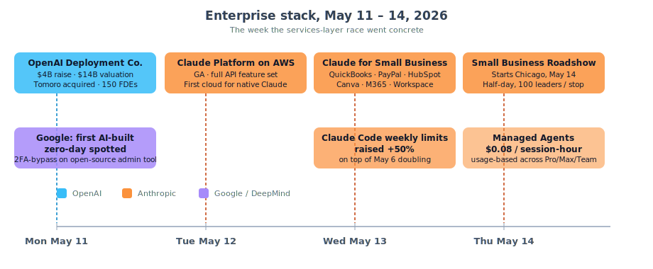
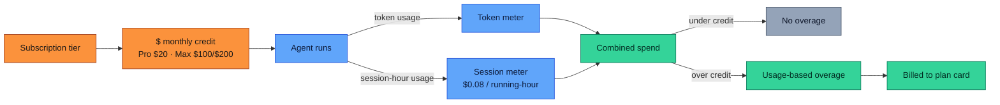
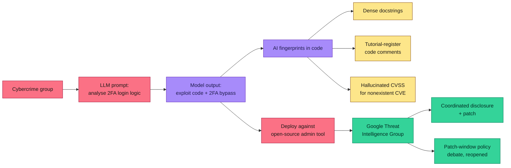
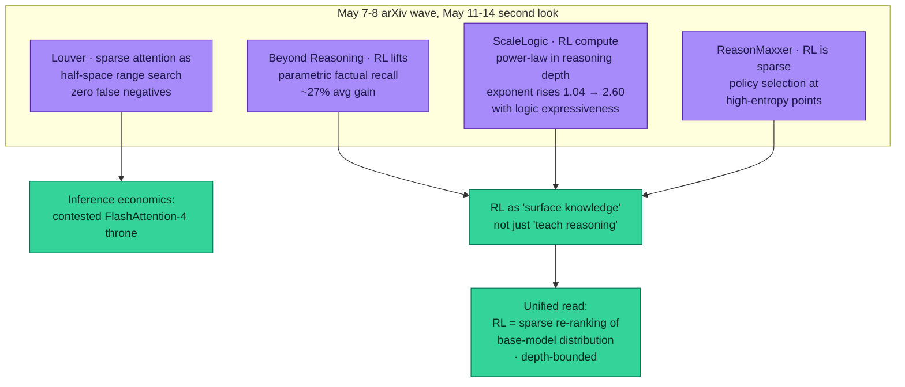
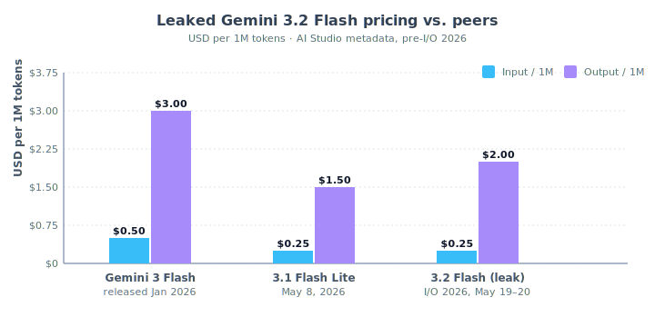

# LLM Updates — 2026-May-15

End-of-week brief, written Friday May 15 (Los Angeles time). The May 8
report covered the Anthropic ↔ SpaceX Colossus 1 capacity step,
OpenAI's GPT-Realtime-2 / Translate / Whisper voice trio, the *seed*
of OpenAI's "Deployment Company" ($4B raise hint), ZAYA1-8B's MoE++
on AMD, ReasonMaxxer's sparse-policy-selection thesis, the
ServiceNow × Anthropic Build-Agent default, and iOS 27 Extensions
firming up for WWDC. The seven days since have been about **turning
the announcements into shipping product**, plus one genuinely novel
threat-intelligence disclosure:

1. **OpenAI Deployment Company launches** (May 11) — the $4B raise
   *closed*, valuation set at $14B post-money / $10B pre-money, lead
   investor TPG, with Tomoro acquired (~150 Forward-Deployed
   Engineers) as the founding services chassis. Bain, Capgemini, and
   McKinsey are also investors.
2. **Anthropic ships *Claude Platform on AWS* GA** (May 12) — the
   full Claude API feature set (Managed Agents, code execution, web
   search, Skills, MCP, prompt caching, batch) lands on AWS with AWS
   billing and auth, processed by Anthropic outside the AWS data
   boundary. AWS becomes the first cloud to host the *native* Claude
   Platform.
3. **Anthropic *Claude for Small Business*** (May 13) — a packaged
   surface that puts Claude inside QuickBooks, PayPal, HubSpot,
   Canva, DocuSign, M365 and Google Workspace, with the
   Small-Business *Roadshow* starting in Chicago on May 14.
4. **Anthropic puts Managed Agents on a $0.08 / session-hour
   meter** (May 13) — usage-based billing for the agent loop
   itself (not just tokens) lands across Pro / Max / Team. Claude
   Code weekly limits also raised **+50%** on top of the May 6
   doubling.
5. **Google's first AI-built zero-day disclosure** (May 11) — Google
   Threat Intelligence Group reports an in-the-wild **AI-developed
   2FA-bypass exploit** targeting an open-source admin tool, attributed
   to a cybercrime group (not state). Their report flags this as the
   first time the AI fingerprint on an exploit was strong enough to
   *prove*.
6. **DeepMind's *AlphaEvolve impact report*** (May 13) — the
   Gemini-powered coding agent has now been integrated as a
   production tool across Google: TPU layout tweaks shipped into
   next-gen silicon, DeepConsensus variant-detection errors cut 30%,
   improved lower bounds for Ramsey numbers and Traveling-Salesman,
   and a 10× error reduction on a Willow quantum-processor circuit.
7. **Pre-I/O 2026 calm** (May 14) — Google I/O is Tue/Wed May 19–20
   and the field is fully into setup mode. **Gemini 3.2 Flash** has
   leaked at **$0.25 / $2.00 per 1M tokens** in AI Studio metadata
   (now confirmed across three independent observers); **Android XR**
   has a confirmed preview slot; the unified vision-audio-video
   prompt surface is the strategic question.
8. **Research bump**: the May 7 arXiv wave keeps getting denser.
   **Louver** (arXiv 2605.06763) reframes sparse attention as
   half-space range search and reports beating FlashAttention.
   **Beyond Reasoning** (arXiv 2605.07153) shows that RL can lift
   *parametric* (no-CoT) factual recall by ~27% average. **ScaleLogic**
   (arXiv 2605.06638) measures the RL-depth power-law exponent and
   shows it climbs sharply with logic expressiveness.

Items from the April 30 / May 1 / May 4 / May 6 / May 8 briefs that
are *not* re-derived here: GPT-5.5 Instant default, Claude Opus 4.7
release, Claude-for-Finance × Moody's, SubQ 12M context,
GPT-Realtime-2 / Translate / Whisper, ZAYA1-8B + CCA, ReasonMaxxer,
ServiceNow × Anthropic, the Anthropic ↔ SpaceX deal, the May 6
Trusted Contact + CPC-bidding announcements, Apple's iOS 27
Extensions and the ParaRNN / Manzano / Mirror-SD ICLR trio,
FlashAttention-4, Mamba-3, DLM, Genie 3.

---

## 1. The enterprise services layer crystallizes (May 11 – 14)

What was thesis on May 8 — *frontier labs have stopped competing on
consumer chat alone and started competing on the services layer
that gets the model into enterprise workflows* — became contractual
this week.

### 1.1 OpenAI Deployment Company: the consultancy layer

The $4B raise OpenAI flagged on May 7 *closed* on **May 11**, structured
as a new majority-OpenAI-owned subsidiary called the **OpenAI
Deployment Company** (DeployCo) at a **$14B post-money / $10B
pre-money** valuation
([OpenAI](https://openai.com/index/openai-launches-the-deployment-company/),
[Axios](https://www.axios.com/2026/05/11/openai-deployco-private-equity),
[TechAfrica News](https://techafricanews.com/2026/05/12/openai-unveils-new-deployment-company-backed-by-4-billion-investment/),
[The Tech Portal](https://thetechportal.com/2026/05/11/openai-launches-enterprise-ai-service-focused-4bn-openai-deployment-company/),
[PYMNTS](https://www.pymnts.com/news/artificial-intelligence/2026/openai-launches-4-billion-dollar-company-accelerate-enterprise-ai-adoption/)).

The cap-table is the strategic read:

| Layer                       | Names                                          |
| --------------------------- | ---------------------------------------------- |
| Lead investor               | **TPG**                                        |
| Co-lead founding partners   | Advent International · Bain Capital · Brookfield |
| Strategic consultancies (LP) | **Bain & Co. · Capgemini · McKinsey & Co.**   |
| Other backers               | B Capital · BBVA · Emergence · Goanna · SoftBank · Warburg Pincus · WCAS |

DeployCo's first acquisition is **Tomoro**, an applied-AI services
firm based in London/Edinburgh that was incubated alongside OpenAI
in 2023 and built deployments for Virgin Atlantic, Supercell,
Fidelity International, Tesco, Red Bull, Mattel, and the NBA
([Tomoro / OpenAI deal coverage — The Next Web](https://thenextweb.com/news/tomoro-openai-deployment-company-consulting),
[Let's Data Science](https://letsdatascience.com/blog/openai-deployment-company-4b-tpg-tomoro-may-11-2026)).
The Tomoro deal hands DeployCo **~150 Forward-Deployed Engineers
(FDEs) on day one**. Two additional acquisitions are reportedly in
late-stage talks.

The architectural framing that matters: **DeployCo is OpenAI's
*Palantir model* applied to AI**. The FDE pattern — embed senior
engineers inside the customer's operating environment, build the
workflow around the model rather than the other way around — is a
recognition that *the enterprise deployment surface is itself a
product*. OpenAI is also explicitly stating it will *invest in*
customers' AI transformations, not just service them, which is the
private-equity-adjacent extension of the same idea.

The notable absence is **Accenture** — none of the three named
LP-consultancies is the largest pure-play SI in the market, which
keeps the door open for an Accenture-Anthropic or Accenture-Google
counter. Expect a response inside three weeks.

### 1.2 Anthropic: distribution by embedding (AWS + small business)

Anthropic's counter to the DeployCo move is the same one it played
with ServiceNow on May 7: **distribute through existing surfaces,
don't build the SI capacity from scratch**. Two shipments this week:

**Claude Platform on AWS, GA (May 12)**
([AWS blog](https://aws.amazon.com/blogs/machine-learning/introducing-claude-platform-on-aws-anthropics-native-platform-through-your-aws-account/),
[AWS What's New](https://aws.amazon.com/about-aws/whats-new/2026/05/claude-platform-aws/),
[InfoQ](https://www.infoq.com/news/2026/05/anthropic-claude-aws/),
[The New Stack](https://thenewstack.io/anthropics-claude-platform-comes-to-aws/),
[TechMonitor](https://www.techmonitor.ai/news/aws-introduces-claude-platform-to-global-customers)).
The full **Anthropic-native** Claude Platform — Managed Agents,
code execution, web search, Skills, MCP connectors, prompt caching,
batch, citations — is now available through an AWS-billed,
AWS-authenticated surface. The non-obvious detail: **Anthropic
operates the runtime itself**, meaning customer data leaves the AWS
data boundary in transit to Anthropic infrastructure. That is *not*
how Bedrock's Claude works (where AWS is data processor). The two
options now co-exist: Bedrock-Claude (AWS-processed, more
constrained feature set) vs. Claude-Platform-on-AWS (Anthropic
processed, full feature set). Expect compliance teams to
distinguish carefully.

**Claude for Small Business (May 13)**
([Anthropic](https://www.anthropic.com/news/claude-for-small-business),
[9to5Mac](https://9to5mac.com/2026/05/13/anthropics-latest-claude-release-turns-your-mac-into-a-small-business-powerhouse/),
[SiliconANGLE](https://siliconangle.com/2026/05/13/anthropic-launches-claude-small-business-new-automation-workflows/),
[Coinalert](https://coinalertnews.com/news/2026/05/13/anthropic-claude-small-business-launch),
[PYMNTS](https://www.pymnts.com/artificial-intelligence-2/2026/anthropic-launches-claude-ai-agents-for-small-business-finance/)).
A toggle inside Claude Cowork that puts Claude inside **Intuit
QuickBooks, PayPal, HubSpot, Canva, DocuSign, Google Workspace, and
Microsoft 365**, plus 12 new connector plug-ins for the legal vertical
(Thomson Reuters, Harvey, Box, Everlaw, DocuSign). The
half-day-workshop **Roadshow** that started in Chicago on May 14
will hit ten more cities. The 50% time-to-implement-reduction goal
Anthropic stated for ServiceNow on May 7 generalises here: the
small-business SKU bets that *the integration matrix is the bottleneck*
to SMB adoption, and that doing the matrix once at the vendor side
is cheaper than doing it once per customer.

### 1.3 Agents on a meter (May 13)

The third Anthropic move this week is the most quietly important.
Anthropic put **Claude Managed Agents on a usage meter at $0.08 per
session-hour** while an agent is in *running* status — billed on
top of token usage, across **Pro / Max / Team / Enterprise** plans
([InfoWorld — Anthropic puts Claude agents on a meter](https://www.infoworld.com/article/4171274/anthropic-puts-claude-agents-on-a-meter-across-its-subscriptions.html),
[Implicator — Usage-based billing is exact, plan limits are vague](https://www.implicator.ai/anthropics-usage-based-billing-is-exact-its-plan-limits-are-vague-by-design/)).
Subscription prices supply a monthly credit (Pro = $20 credit, Max
5× = $100, Max 20× = $200), and overage falls through to
usage-billed. **Claude Code weekly usage limits were raised +50%**
on the same day, on top of the May 6 doubling of the 5-hour session
window.

The framework worth naming: every frontier lab has, through 2025,
been pretending that "agents" fit inside a token-and-message-based
billing model. They don't. An agent running unattended for two
hours, calling a single low-cost tool 100 times, doesn't look like
the chat-message billing surface. Anthropic is the first lab to
move pricing primitives to match: **price the *agent loop* as a
first-class object**. OpenAI's Realtime-2 cached-input rate from May 7
was a step in the same direction; this is the further step.

---

## 2. Google: first AI-built zero-day (May 11)

The most consequential *security* disclosure since Claude Mythos
Preview landed in early April is Google Threat Intelligence Group's
**May 11 report on the first AI-developed zero-day exploit
observed in the wild**
([Google Cloud blog](https://cloud.google.com/blog/topics/threat-intelligence/ai-vulnerability-exploitation-initial-access),
[Bloomberg](https://www.bloomberg.com/news/articles/2026-05-11/hackers-used-ai-to-build-zero-day-attack-google-researchers-say),
[CNBC](https://www.cnbc.com/2026/05/11/google-thwarts-effort-hacker-group-use-ai-mass-exploitation-event.html),
[CyberScoop](https://cyberscoop.com/google-threat-intelligence-group-ai-developed-zero-day-exploit/),
[SecurityWeek](https://www.securityweek.com/google-detects-first-ai-generated-zero-day-exploit/),
[The Register](https://www.theregister.com/ai-ml/2026/05/11/google-says-criminals-used-ai-built-zero-day-in-planned-mass-hack-spree/5237982)).

The technical core:

- **Target:** an open-source web-based system-administration tool
  in wide enterprise use (Google did not name it; the disclosure was
  coordinated with the maintainer).
- **What the model did:** identified a hidden trust assumption in
  the login logic that allowed **two-factor authentication bypass**,
  and produced a working exploit chain.
- **What told Google it was AI-generated:**
  - extensive, dense Python docstrings characteristic of LLM
    chain-of-thought rationalisation, not human shorthand;
  - heavily-annotated code with comments that *explain the human
    reader through* the exploit steps in tutorial register;
  - **a hallucinated CVSS score** referencing a non-existent CVE —
    the giveaway fingerprint, because a human exploit author would
    not have invented a CVE that doesn't exist.
- **Attribution:** a financially-motivated cybercrime group
  (not state).
- **What Google says it *wasn't*:** Gemini. Google explicitly
  states it does not believe its own model was used.

The disclosure is the first time the AI fingerprint has been strong
enough to *prove* in a published threat-intel report. Two policy
consequences worth tracking:

**(a) Patch-window debate, reopened.** US officials are now reportedly
considering shorter mandated remediation deadlines for software
vulnerabilities, on the logic that *if offensive discovery is now AI-
accelerated, the historical patch window may be too long.* This is a
genuinely difficult debate — shorter deadlines transfer cost from
attackers to defenders by forcing more emergency patching — and it
is now a live policy debate, not a hypothetical one.

**(b) Frontier-lab cyber-offense disclosure.** Anthropic's Mythos
Preview gate (defensive-cyber only, expanded access expected this
week per the May 8 brief) is suddenly load-bearing — it's the first
frontier model with a *named*, *gated* cyber-offense surface, and
Google's report makes the gate look prescient.

The companion finding worth flagging: Google reports that **APT45**
(North Korea, military-aligned) has been observed using AI to
*validate* thousands of candidate exploits against software flaws —
not to invent them, but to filter. Chinese groups are doing similar
reconnaissance work. This is closer to the GPT-5.5 +
Claude-Mythos-class results on cyber-offense ranges that the
May 2026 *State of AI* report covers
([Air Street — State of AI: May 2026](https://press.airstreet.com/p/state-of-ai-may-2026)):
two frontier models cleared a 32-step end-to-end cyber range in a
single month, UK AISI estimates frontier cyber-offence is doubling
every four months.

---

## 3. AlphaEvolve: integrated, not just announced (May 13)

DeepMind published an **impact summary on AlphaEvolve** — the
Gemini-powered evolutionary coding agent first announced in May 2025
([Google DeepMind — AlphaEvolve impact](https://deepmind.google/blog/alphaevolve-impact/),
[Google Cloud blog](https://cloud.google.com/blog/products/ai-machine-learning/alphaevolve-on-google-cloud),
[arXiv 2506.13131](https://arxiv.org/abs/2506.13131)). The May 13
report's significance isn't the *announcement* — it's that
AlphaEvolve has graduated from pilot to **integrated production
tool inside Google**, with concrete outputs:

- **TPU silicon.** AlphaEvolve suggested layout changes that have
  been *integrated into next-generation TPU design*.
- **Genomics.** Cut DeepConsensus variant-detection error rates by
  ~**30%**, now in production on Google's bioinformatics stack.
- **Quantum computing.** Designed circuits with **10× lower error**
  than conventionally-optimised baselines on the Willow quantum
  processor, enabling complex molecular simulations that hadn't been
  feasible before.
- **Pure math.** Improved lower bounds on the **Traveling-Salesman
  problem** and **Ramsey numbers**; collaborator Terence Tao has
  used it on **Erdős problems**.
- **Power grid + cryptography + interpretable neuroscience models +
  microeconomic market limits** — DeepMind names these as additional
  domains where AlphaEvolve has shipped material results.

The architectural read worth recording: the *coding-agent shape* of
AlphaEvolve — Gemini generating candidate algorithms, an evaluator
loop scoring them, evolution-strategy selection across iterations —
is now the **first frontier-lab agent surface to publish hard,
domain-specific economic outputs at production scale**. Anthropic's
Mythos has named results in cyber; OpenAI's o-series has named
results in math competitions. AlphaEvolve is the first to be named
as a *running production component of the lab's own
infrastructure*.

The interesting forward signal: the TPU-design-integration is a
self-improvement loop. AlphaEvolve makes silicon faster → faster
silicon trains better Gemini → better Gemini drives better
AlphaEvolve. Whether this loop is asymptotically meaningful or just
a one-time efficiency uplift is genuinely open; DeepMind has been
careful not to over-claim.

---

## 4. Research wave: Louver, Beyond Reasoning, ScaleLogic

The May 6–8 arXiv wave was already dense (CCA, ReasonMaxxer — see
May 8 brief). The May 11–14 follow-on three papers are worth pulling
out:

### 4.1 Louver — sparse attention as range searching (arXiv 2605.06763)

**Louver** reframes sparse attention as a classic computational-
geometry problem: **half-space range searching** in the
KV-embedding space
([arXiv 2605.06763](https://arxiv.org/abs/2605.06763)). The
contribution stack:

- **Reformulation.** Given a query vector q, the set of KV entries
  whose attention weight exceeds threshold θ is *exactly* the set
  of keys lying in a half-space defined by q and θ. So choosing
  "which KV entries to attend to" is a range-search query against
  a half-space, indexed over the KV cache.
- **Index structure.** Louver is a hardware-aware index over KV
  embeddings that supports the half-space query with
  **zero false negatives** at the chosen threshold (so no critical
  token is missed) and very low false-positive rate.
- **Headline result.** Louver beats prior sparse-attention methods
  on both accuracy and latency, and **outpaces FlashAttention** —
  i.e., it is faster than the optimised *dense* baseline — on
  long-context inference.

The thing that makes Louver more interesting than the usual sparse-
attention paper is the **zero-false-negative guarantee**. Most
sparse-attention methods trade a few percent of attention recall for
big speedups; the failure mode is *dropping the one critical token*,
which causes sharp accuracy spikes on long-reasoning tasks. Louver
removes that risk by construction. If the result generalises beyond
the paper's setup, the FlashAttention-4 throne (see the May 1 brief)
is contested.

### 4.2 Beyond Reasoning — RL unlocks parametric knowledge (arXiv 2605.07153)

**Beyond Reasoning** (May 8) makes a claim that would seem
contradictory to ReasonMaxxer (May 7) at first glance, but the two
are actually complementary
([arXiv 2605.07153](https://arxiv.org/abs/2605.07153)). The setup:

- **Task.** Zero-shot, one-hop, closed-book factual QA — *no
  chain-of-thought allowed*. The model must answer factual questions
  from its parametric memory alone, without reasoning steps.
- **Method.** Standard RL post-training on this no-CoT QA task.
- **Result.** RL yields ~**27% average relative accuracy gain**
  across three model families and multiple factual QA benchmarks.

The interpretive bridge to ReasonMaxxer: ReasonMaxxer argues that
RL doesn't *teach* reasoning capability, only *re-ranks* tokens at
high-entropy decision points. Beyond Reasoning argues that *the same
re-ranking mechanism* applies to factual retrieval: the parametric
knowledge is already in the model; RL surfaces it. Together, the two
papers point to a unified read: **RL post-training is a sparse
attention mechanism over the base model's existing distribution,
not a capability transfer**.

### 4.3 ScaleLogic — RL depth scaling law (arXiv 2605.06638)

**ScaleLogic** (May 7, getting attention this week) is the most
direct measurement of RL's reach into long-horizon reasoning
([arXiv 2605.06638](https://arxiv.org/abs/2605.06638)). The
construction:

- **Synthetic logic benchmark.** ScaleLogic controls two axes
  independently: **proof depth** (the chain length required to
  solve the problem) and **logical expressiveness** (the underlying
  logic — propositional, first-order, modal, …).
- **Measurement.** RL training compute follows a **power law in
  reasoning depth**, with exponent that *increases with logical
  expressiveness*: from **1.04** at propositional logic to **2.60**
  at the most expressive variant.

The implication: as the field tries to push RL into longer-horizon
reasoning, the compute cost grows roughly *quadratically* in depth
for expressive logics, not linearly. ReasonMaxxer's "RL is sparse
correction" claim and ScaleLogic's "RL depth scales as a power law"
claim are not mutually exclusive — sparse correction at each depth
level can still aggregate to power-law cost — but the combination
sharpens the implication: **the RL-for-reasoning frontier is bounded
by depth-expressiveness more than by compute**.

---

## 5. Pre-Google-I/O 2026 setup (May 19 – 20)

**Google I/O 2026** opens Tue May 19 at 10am PT and runs through
Wed May 20 at the Shoreline Amphitheatre
([io.google/2026](https://io.google/2026/),
[Engadget — Android Show I/O 2026](https://www.engadget.com/2171038/everything-announced-at-android-show-google-io-2026/),
[Android Authority](https://www.androidauthority.com/what-to-expect-from-google-io-2026-3664979/),
[Tom's Guide](https://tech.yahoo.com/general/article/google-io-2026-how-to-watch-and-what-to-expect-including-android-17-gemini-announcements-and-more-131200691.html)).
The setup signals firmed up this week:

### 5.1 Gemini 3.2 Flash — leaked pricing now triangulated

**Gemini 3.2 Flash** has appeared in three independent metadata
leaks (AI Studio, the iOS Gemini app, and an OpenRouter preview
listing) with consistent pricing
([buildfastwithai — Gemini 3.2 Flash, everything we know](https://www.buildfastwithai.com/blogs/gemini-3-2-flash-release-2026),
[pricepertoken — Gemini 3 Flash Preview](https://pricepertoken.com/pricing-page/model/google-gemini-3-flash-preview),
[OpenRouter — Gemini 3 Flash Preview](https://openrouter.ai/google/gemini-3-flash-preview)):

| Model                       | Input / 1M | Output / 1M | Position                  |
| --------------------------- | ---------- | ----------- | ------------------------- |
| Gemini 3 Flash (Jan)        | **$0.50**  | **$3.00**   | Main Flash, prior gen     |
| Gemini 3.1 Flash Lite (May 8)| **$0.25** | **$1.50**   | Cheapest sibling          |
| **Gemini 3.2 Flash (leak)** | **$0.25**  | **$2.00**   | **Pro-class quality, Lite-price input** |

The Flash-Lite-price input with above-Flash output is the giveaway
that 3.2 Flash is the **Pro-quality successor at Flash-tier pricing**,
not a Flash++ refresh. If the leak holds at the I/O reveal, the
Flash → Pro substitution that began at Gemini 3 collapses by another
step.

### 5.2 What else to watch at I/O

- **Unified multimodal prompt.** Google has confirmed Veo and Lyria
  (video + music) stage time. The keynote question is whether
  Gemini 3.2 or a new "Gemini 3.5"-class flagship presents the
  **single-prompt vision-audio-video-code** surface — the closest
  thing the field has to an actual unified-modal model.
- **Android XR.** Confirmed preview slot — the Gemini-powered
  smart-glasses demo is on the show floor.
- **Gemini-default routing in Android 17.** *LiveNewsChat* and
  multiple Android-press leaks suggest Android 17 will make
  Gemini-the-default-assistant a one-tap setting, with third-party
  AI assistants exposed via an extension model that mirrors iOS 27.
  This is *parallel* to the iOS 27 Extensions framework (see May 6
  brief).
- **AlphaEvolve productization.** With the May 13 impact report
  fresh, expect an explicit on-stage tie between AlphaEvolve and
  Google Cloud — likely as a *managed evolutionary-coding service*
  on Vertex AI.

---

## 6. Frontier snapshot, May 15

The May 8 frontier table holds, with three lines updated:

| Slot                          | Top model (May 15)                    | Δ vs. May 8 brief                                              |
| ----------------------------- | ------------------------------------- | -------------------------------------------------------------- |
| Frontier reasoning            | Claude Opus 4.7                       | unchanged                                                      |
| Frontier coding               | GPT-5.5 Pro / Claude Opus 4.7         | unchanged                                                      |
| Default consumer chat         | GPT-5.5 Instant                       | unchanged                                                      |
| Voice / realtime              | GPT-Realtime-2                        | unchanged from May 8                                           |
| Open-weight frontier          | DeepSeek V4-Pro / Mistral Medium 3.5  | NIST CAISI: V4-Pro is 8 months behind US frontier on aggregate |
| Open-weight efficient         | ZAYA1-8B (Apache-2.0)                 | unchanged                                                      |
| **Cloud-managed Claude**      | **Claude Platform on AWS, GA**        | **new this week** — full native API on AWS                     |
| **Enterprise vertical (SMB)** | **Claude for Small Business**         | **new this week** — QuickBooks + PayPal + HubSpot + …          |
| **Enterprise services layer** | **OpenAI DeployCo + Tomoro FDEs**     | **new this week** — $14B-valued, McKinsey/Bain/Capgemini-LP   |
| On-device flagship            | Apple PT-MoE + 3B local               | iOS 27 Extensions still queued for WWDC                        |
| Subquadratic / long-context   | SubQ (claims) · Mamba-3 · GPT-5.5     | independent SubQ verification still pending                    |
| **Sparse-attention research** | **Louver (arXiv 2605.06763)**         | **new** — zero-false-negative half-space search, beats FA      |
| RL-for-reasoning              | ReasonMaxxer · ScaleLogic · Beyond Reasoning | **3-paper view crystallised: RL is sparse re-ranking**     |
| Coding-agent / research       | **AlphaEvolve, integrated production** | **graduated** — TPU silicon, quantum circuits, math bounds   |
| Cyber-offence (in the wild)   | **Cybercrime AI zero-day (May 11)**   | **new** — first AI-fingerprinted exploit disclosure            |
| Agent governance              | Cognizant Secure AI / ServiceNow Action Fabric MCP | unchanged from May 8                              |
| **Agent pricing primitives**  | **Anthropic $0.08 / session-hour**    | **new** — usage-billed agent loop across Pro/Max/Team          |

---

## 7. Forward signals, May 18 – 24

Calendar items and watch-list dated for the next seven days:

- **Google I/O 2026 keynote (Tue May 19, 10am PT) and Day 2 (Wed
  May 20).** Gemini 3.2 Flash GA is highly likely; the unified
  vision-audio-video flagship is the open question. Android XR
  glasses on the show floor. AlphaEvolve → Vertex productisation is
  the highest-probability surprise.
- **Anthropic Mythos Preview broadening.** May 8 brief flagged this
  as imminent; the Google AI-zero-day disclosure on May 11 raises
  the urgency for *defensive* customers to gain access. Watch for
  an expanded-access announcement before WWDC.
- **OpenAI DeployCo: second + third acquisitions.** Two more
  acquisitions are reportedly in late-stage talks. Expect at least
  one by Wed May 20 (so as not to be drowned out by I/O).
- **Accenture / Deloitte / Wipro response.** None of the big-three
  pure-play SIs is named in either the DeployCo cap table or the
  Anthropic SI partner list yet. A response within three weeks is
  the baseline expectation; a *competing JV* announcement is the
  tail outcome to watch.
- **SubQ independent benchmarks.** Now ~14 days into the
  measurement window the May 6 community asked for. *VentureBeat* and
  *Startup Fortune* both still flag "researchers demand independent
  proof" — the absence of confirmation is itself a signal.
- **iOS 27 developer beta drop.** WWDC is June 8 but the historical
  pattern is mid-May Beta-1 seed releases. Extensions API string
  references would be the high-value signal.
- **AlphaEvolve open-source replication (OpenEvolve).** HuggingFace
  hosts a public OpenEvolve port; the May 13 impact summary will
  drive a citation/usage bump and likely a v2 release inside two
  weeks.

---

## 8. Action set, May 15

For teams operating production LLM stacks this week:

**Enterprise procurement / deployment**
- If you are mid-evaluation on **Bedrock-Claude vs. Claude-direct**,
  re-open the question — **Claude Platform on AWS GA** is a third
  option that gives you AWS billing + native Anthropic feature set,
  with the **caveat that data leaves the AWS boundary** to Anthropic.
  Compliance teams need to map this against your existing AWS data-
  residency contract before approving.
- If you've committed to OpenAI but use one of Tomoro's prior
  customers' analogue (consumer aviation, mobile gaming, asset
  management, retail), **the DeployCo FDE team is now in-house at
  OpenAI**. The model for engagement is changing; expect
  re-engagement outreach.
- If you build on **ServiceNow** *and* you are an SMB candidate for
  **Claude for Small Business**, the integration matrix is now
  end-to-end Anthropic-managed. Don't replicate it.

**Agent stack**
- Anthropic's **$0.08 / session-hour** meter changes long-running
  agent economics materially. **If you run agents > 30 minutes,
  re-run your cost model.** A two-hour agent that does 10 tool calls
  now has a cost floor independent of token usage.
- The **+50% Claude Code weekly limit raise** + the May 6 doubling
  of session-window cap is **3× the cap from May 5**. If your CI /
  Claude-Code-as-engineer setup hit limits in April, retry.

**Security / cyber**
- Google's AI-zero-day disclosure is **citable evidence** for the
  patch-window-shortening conversation. If you are inside a
  regulated industry (finance, healthcare, critical infrastructure),
  expect this to be raised on your next compliance review.
- If you are in the **Anthropic Mythos Preview waitlist** as a
  *defensive* customer (red-team or SOC), this is the week to
  re-push the request: capacity is now available (post-Colossus 1)
  and Google's disclosure is the policy lever.

**Research / training**
- If you run **long-context inference** at scale, read the **Louver**
  paper and benchmark it against your existing FlashAttention-4
  baseline. The zero-false-negative property is the part that
  matters for long-reasoning workloads.
- If you are scoping an RL-post-training run for **factual recall**
  (not just reasoning), **Beyond Reasoning's 27% gain** is the new
  reference point and is reproducible from the paper's code.
- If you are designing an **RL-for-reasoning** training curriculum
  at depths > 8, **ScaleLogic's power-law exponent** tells you
  whether you have the compute budget. Above propositional logic,
  budget grows close to quadratically in depth.

**Pre-I/O hedging**
- Google's Gemini 3.2 Flash leak at $0.25 input / $2.00 output
  changes the **Flash tier** cost-of-quality equation. If your
  production stack runs on Gemini 3 Flash, **prepare a migration
  plan for May 20** in case the leak is accurate.

---

## Sources

OpenAI Deployment Company / Tomoro
- [OpenAI — Launches the Deployment Company](https://openai.com/index/openai-launches-the-deployment-company/)
- [Axios — OpenAI launches AI consulting arm valued at $14B](https://www.axios.com/2026/05/11/openai-deployco-private-equity)
- [TechAfrica News — $4B-backed Deployment Company](https://techafricanews.com/2026/05/12/openai-unveils-new-deployment-company-backed-by-4-billion-investment/)
- [The Tech Portal — $4Bn OpenAI Deployment Company + Tomoro](https://thetechportal.com/2026/05/11/openai-launches-enterprise-ai-service-focused-4bn-openai-deployment-company/)
- [PYMNTS — OpenAI launches $4B company](https://www.pymnts.com/news/artificial-intelligence/2026/openai-launches-4-billion-dollar-company-accelerate-enterprise-ai-adoption/)
- [Channel Dive — OpenAI consulting business](https://www.channeldive.com/news/openai-deployment-company-4-billion-ai-consulting-integration/819888/)
- [The Next Web — Tomoro acquisition](https://thenextweb.com/news/tomoro-openai-deployment-company-consulting)
- [Let's Data Science — $4B / TPG / Tomoro](https://letsdatascience.com/blog/openai-deployment-company-4b-tpg-tomoro-may-11-2026)
- [Capgemini press — investment in DeployCo](https://www.capgemini.com/news/press-releases/capgemini-strengthens-its-position-in-enterprise-ai-with-investment-in-the-openai-deployment-company/)
- [WinBuzzer — Deployment Company + Tomoro](https://winbuzzer.com/2026/05/12/openai-launches-deployment-company-tomoro-acquisition-xcxwbn/)
- [OfficeChai — OpenAI gets 150 FDEs](https://officechai.com/ai/openai-deployment-company-acquires-tomoro/)

Anthropic — Claude Platform on AWS, Small Business, Agents on a meter
- [AWS ML blog — Claude Platform on AWS](https://aws.amazon.com/blogs/machine-learning/introducing-claude-platform-on-aws-anthropics-native-platform-through-your-aws-account/)
- [AWS What's New — Claude Platform on AWS GA](https://aws.amazon.com/about-aws/whats-new/2026/05/claude-platform-aws/)
- [InfoQ — Anthropic launches Claude Platform on AWS](https://www.infoq.com/news/2026/05/anthropic-claude-aws/)
- [The New Stack — Claude Platform comes to AWS](https://thenewstack.io/anthropics-claude-platform-comes-to-aws/)
- [TechMonitor — AWS introduces Claude Platform globally](https://www.techmonitor.ai/news/aws-introduces-claude-platform-to-global-customers)
- [DQ India — Claude Platform GA on AWS](https://www.dqindia.com/news/anthropics-claude-platform-generally-available-on-aws-11824938)
- [Anthropic — Claude for Small Business](https://www.anthropic.com/news/claude-for-small-business)
- [SiliconANGLE — Claude for Small Business automation workflows](https://siliconangle.com/2026/05/13/anthropic-launches-claude-small-business-new-automation-workflows/)
- [9to5Mac — Anthropic's small business push](https://9to5mac.com/2026/05/13/anthropics-latest-claude-release-turns-your-mac-into-a-small-business-powerhouse/)
- [Coinalert News — Claude Small Business with QuickBooks/PayPal](https://coinalertnews.com/news/2026/05/13/anthropic-claude-small-business-launch)
- [PYMNTS — Anthropic launches Claude AI Agents for SMB Finance](https://www.pymnts.com/artificial-intelligence-2/2026/anthropic-launches-claude-ai-agents-for-small-business-finance/)
- [InfoWorld — Anthropic puts Claude agents on a meter](https://www.infoworld.com/article/4171274/anthropic-puts-claude-agents-on-a-meter-across-its-subscriptions.html)
- [Implicator — Usage-based billing exact, plan limits vague](https://www.implicator.ai/anthropics-usage-based-billing-is-exact-its-plan-limits-are-vague-by-design/)
- [Releasebot — Anthropic May 2026 updates](https://releasebot.io/updates/anthropic)
- [Releasebot — Claude Code May 2026](https://releasebot.io/updates/anthropic/claude-code)

Google: AI-built zero-day disclosure
- [Google Cloud — Adversaries leverage AI for vuln exploitation](https://cloud.google.com/blog/topics/threat-intelligence/ai-vulnerability-exploitation-initial-access)
- [Bloomberg — Hackers used AI to build zero-day attack](https://www.bloomberg.com/news/articles/2026-05-11/hackers-used-ai-to-build-zero-day-attack-google-researchers-say)
- [CNBC — Google thwarts mass exploitation event](https://www.cnbc.com/2026/05/11/google-thwarts-effort-hacker-group-use-ai-mass-exploitation-event.html)
- [SecurityWeek — Google detects first AI-generated zero-day](https://www.securityweek.com/google-detects-first-ai-generated-zero-day-exploit/)
- [CyberScoop — Google spotted AI-developed zero-day before attackers used it](https://cyberscoop.com/google-threat-intelligence-group-ai-developed-zero-day-exploit/)
- [The Register — Criminals used AI-built zero-day in planned mass spree](https://www.theregister.com/ai-ml/2026/05/11/google-says-criminals-used-ai-built-zero-day-in-planned-mass-hack-spree/5237982)
- [Axios — AI-assisted hacking is already here](https://www.axios.com/2026/05/12/ai-hacking-found-google-report)
- [Engadget — Google's first-ever discovery of AI-developed zero-day](https://www.engadget.com/2170002/google-announces-its-first-ever-discovery-of-a-zero-day-exploit-made-with-ai/)
- [Help Net Security — Google researchers uncover criminal zero-day](https://www.helpnetsecurity.com/2026/05/11/google-ai-vulnerability-exploitation/)

DeepMind — AlphaEvolve impact
- [Google DeepMind — AlphaEvolve impact summary](https://deepmind.google/blog/alphaevolve-impact/)
- [Google DeepMind — original AlphaEvolve announcement](https://deepmind.google/blog/alphaevolve-a-gemini-powered-coding-agent-for-designing-advanced-algorithms/)
- [arXiv 2506.13131 — AlphaEvolve paper](https://arxiv.org/abs/2506.13131)
- [Google Cloud — AlphaEvolve on Google Cloud](https://cloud.google.com/blog/products/ai-machine-learning/alphaevolve-on-google-cloud)
- [HuggingFace — OpenEvolve open-source port](https://huggingface.co/blog/codelion/openevolve)

Research wave (May 7-8 arXiv, mid-May read)
- [arXiv 2605.06763 — Sparse Attention as a Range Searching Problem (Louver)](https://arxiv.org/abs/2605.06763)
- [arXiv 2605.07153 — Beyond Reasoning: RL Unlocks Parametric Knowledge](https://arxiv.org/abs/2605.07153)
- [arXiv 2605.06638 — Can RL Teach Long-Horizon Reasoning? Expressiveness Is Key (ScaleLogic)](https://arxiv.org/abs/2605.06638)
- [arXiv 2605.06241 — Rethinking RL for LLM Reasoning (ReasonMaxxer)](https://arxiv.org/abs/2605.06241)
- [arXiv 2605.06206 — Federation of Experts: Communication Efficient Distributed Inference](https://arxiv.org/html/2605.06206v1)

NIST CAISI evaluation
- [NIST — CAISI Evaluation of DeepSeek V4 Pro](https://www.nist.gov/news-events/news/2026/05/caisi-evaluation-deepseek-v4-pro)
- [Digital Watch Observatory — DeepSeek V4 trails US frontier by 8 months](https://dig.watch/updates/deepseek-v4-pro-caisi-us-nist-evaluation)
- [The Decoder — China falling behind per US benchmark](https://the-decoder.com/china-is-falling-behind-in-the-ai-race-according-to-a-us-government-benchmark/)
- [tbreak — DeepSeek V4 Pro lags US AI by 8 months](https://tbreak.com/deepseek-v4-pro-us-ai-models-gap/)

Google I/O 2026 setup, Gemini 3.2 Flash leak
- [io.google/2026](https://io.google/2026/)
- [Engadget — Android Show I/O 2026](https://www.engadget.com/2171038/everything-announced-at-android-show-google-io-2026/)
- [Android Authority — what to expect from I/O 2026](https://www.androidauthority.com/what-to-expect-from-google-io-2026-3664979/)
- [Tom's Guide / Yahoo — how to watch and what to expect](https://tech.yahoo.com/general/article/google-io-2026-how-to-watch-and-what-to-expect-including-android-17-gemini-announcements-and-more-131200691.html)
- [buildfastwithai — Gemini 3.2 Flash, everything we know](https://www.buildfastwithai.com/blogs/gemini-3-2-flash-release-2026)
- [MSN — Gemini 3.2 Flash quietly leaks ahead of I/O 2026](https://www.msn.com/en-us/news/other/gemini-32-flash-quietly-leaks-ahead-of-google-io-2026/gm-GM76BA32DD)
- [pricepertoken — Gemini 3 Flash Preview pricing](https://pricepertoken.com/pricing-page/model/google-gemini-3-flash-preview)
- [OpenRouter — Gemini 3 Flash Preview listing](https://openrouter.ai/google/gemini-3-flash-preview)
- [LiveNewsChat — I/O 2026, Gemini default in Android](https://livenewschat.eu/google-io-2026-gemini-default/)

Big-picture trackers
- [Air Street Press — State of AI: May 2026](https://press.airstreet.com/p/state-of-ai-may-2026)
- [whatllm.org — New AI Models May 2026, frontier took a breath](https://whatllm.org/blog/new-ai-models-may-2026)
- [llm-stats — LLM news May 2026](https://llm-stats.com/ai-news)
- [llm-stats — Latest AI model releases](https://llm-stats.com/llm-updates)
- [Crescendo — Latest AI news May 2026](https://www.crescendo.ai/news/latest-ai-news-and-updates)
- [Prompt Injection — AI news roundup, Apr 29 – May 13, 2026](https://www.promptinjection.net/p/ai-llm-news-roundup-april-29-may-13-2026)
