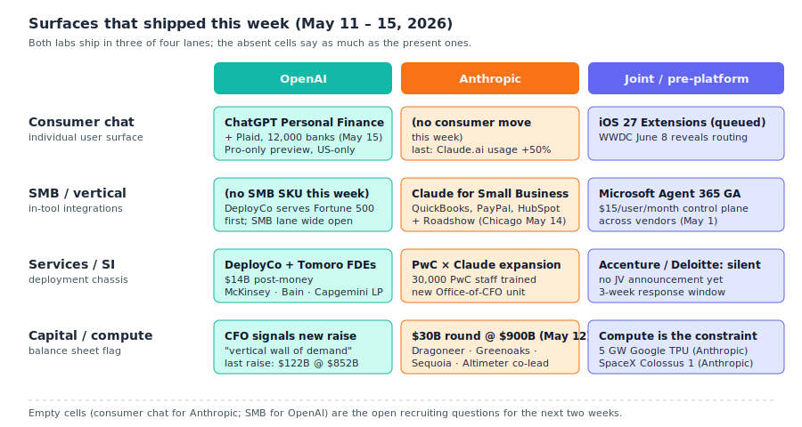
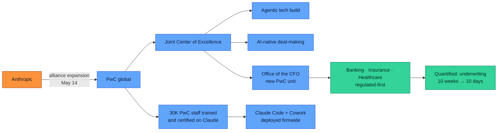
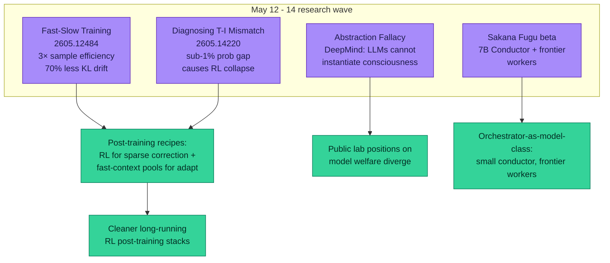

# LLM Updates — 2026-May-16

Saturday weekend brief, written Saturday May 16 (Los Angeles time), three
days before **Google I/O 2026** opens at Shoreline on Tue May 19. The
May 15 brief covered the **OpenAI Deployment Company close**, **Claude
Platform on AWS GA**, **Claude for Small Business**, the **$0.08 /
session-hour Anthropic agent meter**, Google's **first AI-built
zero-day disclosure** (May 11), **DeepMind's AlphaEvolve impact
report**, and the **Louver / Beyond Reasoning / ScaleLogic** research
wave. Two more news cycles have landed since:

1. **Anthropic's $30B raise at ~$900B valuation** (Bloomberg, May 12)
   has been confirmed across multiple co-lead investors, with
   Dragoneer, Greenoaks, Sequoia, and Altimeter each on the hook for
   ≥ $2B. If this prices, Anthropic's *paper* valuation crosses
   OpenAI's $852B (March round) for the **first time since the lab
   was founded**.
2. **PwC × Anthropic expanded alliance** (May 14) — PwC will train
   and certify **30,000** professionals on Claude, deploy Claude Code
   and Cowork globally, and launch a new **Office of the CFO**
   business unit anchored on Claude.
3. **Anthropic × Gates Foundation $200M partnership** (May 14) for
   global health, education, agriculture, and African-language data.
4. **OpenAI counters on the consumer surface: ChatGPT Personal
   Finance** (May 15) — partnership with **Plaid** opens connections
   to ~12,000 banks; Pro-only US preview; spending analysis,
   investment review, future-planning Q&A.
5. **OpenAI CFO Sarah Friar publicly signals another raise** (May 15)
   — *"a vertical wall of demand"* but *"not a lot of compute in
   2026"*. The capital-cycle clock starts again.
6. **Anthropic / Apple lawsuit thread becomes live** — OpenAI is
   "considering legal action" against Apple over alleged underperformance
   of the existing ChatGPT-in-Siri integration. Three weeks before
   WWDC.
7. **Gemini "Omni" unified video-image model** continues to firm up
   in Gemini UI strings as the likely I/O-keynote unveil. Reports
   suggest a **single-pipeline replacement** for the current
   Veo + Imagen + Lyria split.
8. **Research wave keeps coming**: **Fast-Slow Training** (arXiv
   2605.12484, May 12) — 3× more sample-efficient than RL with 70%
   less KL drift. **Diagnosing Training-Inference Mismatch** (arXiv
   2605.14220, May 14) — small per-token probability disagreements
   between rollout and policy stages can independently cause RL
   training collapse. **DeepMind's "Abstraction Fallacy"** — a
   formal argument that no LLM can ever instantiate consciousness,
   only simulate it.

Items from the May 1 / May 4 / May 6 / May 8 / May 15 briefs *not*
re-derived here: GPT-5.5 Instant default, Claude Opus 4.7,
Claude-for-Finance × Moody's, SubQ 12M context, GPT-Realtime-2 voice
trio, ZAYA1-8B + CCA, ReasonMaxxer, ServiceNow × Anthropic, the
Colossus 1 deal, the May 6 CPC-bidding announcements, Apple iOS 27
Extensions, ParaRNN / Manzano / Mirror-SD, FlashAttention-4, Mamba-3,
DLM, Genie 3, Louver (arXiv 2605.06763), Beyond Reasoning (2605.07153),
ScaleLogic (2605.06638), Anthropic Mythos Preview, OpenAI DeployCo's
close + Tomoro acquisition, Claude Platform on AWS GA, Claude for
Small Business, Anthropic $0.08 / session-hour meter, Google's
AI-built zero-day disclosure, AlphaEvolve impact report.

---

## 1. The valuation flip (May 12) and what it actually means

The headline of the week — and a *first* since Anthropic was founded
in 2021 — is that the in-progress $30B round at a ~$900B paper
valuation crosses **OpenAI's $852B** March round
([Bloomberg](https://www.bloomberg.com/news/articles/2026-05-12/anthropic-in-talks-to-raise-30-billion-at-900-billion-valuation),
[Yahoo Finance — $30B at $900B](https://finance.yahoo.com/news/anthropic-talks-raise-30-billion-210804604.html),
[The Decoder — Anthropic above OpenAI for the first time](https://the-decoder.com/anthropics-900-billion-valuation-would-make-it-more-valuable-than-openai-for-the-first-time/),
[Shacknews](https://www.shacknews.com/article/149157/anthropic-900-billion-valuation),
[TechFundingNews](https://techfundingnews.com/anthropic-30b-fundraise-900b-valuation-mega-round/),
[MacObserver](https://www.macobserver.com/news/anthropic-reportedly-seeks-30-billion-funding-round-at-900-billion-valuation/),
[Seeking Alpha](https://seekingalpha.com/news/4591807-anthropic-said-to-be-in-talks-to-raise-30b-at-900b-valuation)).
The four co-leads — **Dragoneer, Greenoaks, Sequoia, and Altimeter**
— are each writing checks of at least $2B. The round is expected to
close as soon as **end of May**. No term sheet is signed yet, so the
print may move, but the curve points the same way.

Three things worth disentangling in that flip:

1. **Anthropic's run-rate revenue narrative is doing the work.** The
   Counterpoint Research Q1 2026 LLM revenue league table puts
   Anthropic at **31.4%** share vs. OpenAI's **29%**
   ([The Register](https://www.theregister.com/2026/04/30/openai_anthropic_top_lines_research_counterpoint/)).
   The Ramp AI Index for April 2026 shows business *adoption* at
   **34.4%** of all firms running an Anthropic SKU, +3.8 pts in a
   single month. The valuation step is the capital-markets
   acknowledgment that the *enterprise* tape is breaking Anthropic's
   way.
2. **The compute commitment is now ~$240B over five years.** Anthropic
   signed a **$200B / 5 GW Google TPU** deal in early May
   ([The Information](https://www.theinformation.com/articles/anthropic-commits-spending-200-billion-googles-cloud-chips),
   [Engadget](https://www.engadget.com/2165585/anthropic-reportedly-agrees-to-pay-google-200-billion-for-chips-and-cloud-access/),
   [Let's Data Science](https://letsdatascience.com/blog/anthropic-200-billion-google-cloud-five-year-commitment-may-5)),
   and the **SpaceX Colossus 1 capacity** anchored the May 8 brief.
   The $30B raise is *the financing leg* of those compute commitments
   — at a $40B/year payable to Google alone, the equity round is the
   working-capital plug to a balance-sheet shape that already exists.
3. **The "crossing" is paper, not enterprise value or cash.** OpenAI
   still ships at higher gross consumer volume and its
   Microsoft/OpenAI joint venture has the larger combined data-center
   footprint. The crossing is a *story about where the next $100B
   wants to invest*, not a story about who is "winning" in any GAAP
   sense. The fact that the story is now possible is the news.

The watch item for the next two weeks: whether OpenAI's CFO comments
on May 15 ("we may raise more, vertical wall of demand")
([PYMNTS — OpenAI considers raising more capital](https://www.pymnts.com/news/artificial-intelligence/2026/openai-considers-raising-more-capital-meet-ai-demand/))
turn into a counter-raise at a *re-priced upward* valuation before
Anthropic's $30B prints. Expect a board-driven response.

---

## 2. The week's surface-by-surface scoreboard

The DeployCo / AWS / SMB / agent-meter cluster from the May 15 brief
was the *first* wave of ship-the-surface. This week's second wave
adds the consumer-finance lane on OpenAI's side and the
professional-services lane on Anthropic's. Side-by-side:

### 2.1 ChatGPT × Plaid — Personal Finance (May 15)

OpenAI shipped **ChatGPT Personal Finance** in preview to Pro
subscribers in the US on Friday May 15
([Bloomberg](https://www.bloomberg.com/news/articles/2026-05-15/openai-taps-plaid-to-bring-tailored-financial-advice-to-masses),
[TechCrunch](https://techcrunch.com/2026/05/15/openai-launches-chatgpt-for-personal-finance-will-let-you-connect-bank-accounts/),
[MacRumors](https://www.macrumors.com/2026/05/15/chatgpt-personal-finance/),
[ChatGPT Release Notes](https://help.openai.com/en/articles/6825453-chatgpt-release-notes)).
The shape:

- **Plaid as the data plane.** ChatGPT links into Plaid's existing
  ~12,000 financial-institution catalogue (Schwab, Fidelity, Chase,
  Robinhood, AmEx, Capital One — i.e., the same set Mint / Copilot
  Money / Monarch use).
- **Read-only.** ChatGPT sees balances, transactions, holdings, and
  liabilities; full account numbers are masked; no transfer or
  payment capability.
- **Capabilities.** Spending-pattern analysis, scenario planning
  ("what if I move $5k to a Roth"), portfolio review, debt-paydown
  prioritisation. Notably: *not yet* trading or actual product
  recommendations, which is the regulated tier.

The strategic shape worth naming: **OpenAI has built a personal-CFO
surface that competes head-on with Anthropic's Claude-for-Finance ×
Moody's enterprise-finance surface from April 30**, but on the
*opposite side of the regulated wall*. Anthropic owns the underwriter
/ analyst seat; OpenAI is reaching for the *consumer*. Both labs are
walking up to the SEC fiduciary line carefully.

The compliance hedge that turned up in the press: OpenAI is *not*
naming individual securities, *not* suggesting trades, and has a
**human-fiduciary handoff** ready. That is the same playbook
Anthropic ran for Mythos cyber: ship the capability, attach a
liability gate, let the regulator catch up.

### 2.2 PwC × Anthropic alliance expansion (May 14)

PwC and Anthropic expanded their existing alliance into the largest
SI-side commitment any frontier lab has yet announced
([Anthropic](https://www.anthropic.com/news/pwc-expanded-partnership),
[PwC press](https://www.pwc.com/us/en/about-us/newsroom/press-releases/anthropic-pwc-expand-alliance-agentic-enterprise.html),
[PR Newswire](https://www.prnewswire.com/news-releases/anthropic-and-pwc-expand-alliance-driving-impact-across-client-work-and-the-firm-302772321.html),
[Yahoo Finance](https://finance.yahoo.com/sectors/technology/articles/anthropic-expands-partnership-pwc-pushes-130101877.html),
[SiliconANGLE — 30,000 PwC staff](https://siliconangle.com/2026/05/14/pwc-expands-anthropic-alliance-will-train-30000-staff-claude/),
[International Accounting Bulletin](https://www.internationalaccountingbulletin.com/news/pwc-anthropic-expand-alliance/),
[WinBuzzer](https://winbuzzer.com/2026/05/15/pwc-is-deploying-claude-to-build-technology-execut-xcxwbn/)):

- **30,000 PwC professionals** to be trained and certified on Claude
  Code and Cowork. PwC's global workforce is ~370,000, so this is
  ~8% of the firm, concentrated on the consulting/audit side.
- **Joint Center of Excellence** anchored in three focus areas:
  agentic technology build, **AI-native deal-making** (M&A and PE
  diligence), and reinvention of the enterprise function.
- **Office of the CFO** — a brand-new PwC business unit, the first
  standalone unit at PwC built around Claude. Targets regulated
  industries (banking, insurance, healthcare) first, where the
  audit-trail + reasoning-trace property of Claude is the
  differentiator.
- **Quantified results so far**: insurance underwriting cycle cut
  from **10 weeks → 10 days** (~70% reduction) in PwC client
  deployments; named verticals already in production include
  professional sports operations, mainframe modernization, HR
  transformation, and cybersecurity.

The architectural read: **Anthropic answers OpenAI's DeployCo by
embedding into the *existing* big-four SI**. DeployCo is OpenAI
*building* an FDE consultancy chassis from scratch (Tomoro + Bain LP +
McKinsey LP + Capgemini LP). Anthropic is *renting* the world's
second-largest SI's chassis at scale, accepting that the model layer
sits beneath the consultancy layer.

The competing thesis is testable inside two quarters: which
deployment pattern is faster — Anthropic's *embed-in-PwC* or
OpenAI's *build-your-own-PwC*? The expected answer is that they win
different segments, with PwC's existing client relationships
materializing first.

### 2.3 Anthropic × Gates Foundation $200M (May 14)

The third Anthropic move of the week is a four-year, $200M commitment
to global health, education, and agriculture with the Gates
Foundation
([Anthropic](https://www.anthropic.com/news/gates-foundation-partnership),
[Gates Foundation](https://www.gatesfoundation.org/ideas/media-center/press-releases/2026/05/ai-anthropic-partnership),
[PYMNTS](https://www.pymnts.com/partnerships/2026/anthropic-gates-foundation-form-200-million-dollar-health-focused-pact/),
[PharmaLive](https://www.pharmalive.com/anthropic-gates-foundation-launch-200-million-partnership-for-ai-in-health-education/),
[US News](https://money.usnews.com/investing/news/articles/2026-05-14/anthropic-gates-foundation-launch-200-million-partnership-for-ai-in-health-education)).
Structurally it is grant + Claude credits + technical support, split
across:

| Lane               | What ships                                                        |
| ------------------ | ----------------------------------------------------------------- |
| Global health      | Vaccine + therapy development; first targets polio, HPV, eclampsia |
| Education          | K-12 tutoring (US); literacy / numeracy apps (sub-Saharan Africa, India) |
| Economic mobility  | Smallholder-farming productivity; agriculture-specific Claude     |
| Language data      | African-language data collection + labeling, **released publicly** |

The non-obvious detail is the **public release** of the African-
language data: Anthropic is committing to release training data to
help *all* models (including competitors') reduce the
high-resource-language bias. This is the same pattern as Anthropic's
constitution-style alignment publications — give away the
infrastructure-floor work, keep the model work proprietary.

### 2.4 Microsoft Agent 365 GA (May 1 — included for completeness)

Worth recording in this matrix since the May 1 brief predates the
DeployCo / Claude Small Business cascade. **Microsoft Agent 365** is
now GA at **$15 / user / month**
([Microsoft Security blog — Agent 365 GA](https://www.microsoft.com/en-us/security/blog/2026/05/01/microsoft-agent-365-now-generally-available-expands-capabilities-and-integrations/)).
It's the *vendor-neutral* control plane competing with both DeployCo
(services) and Claude-on-AWS / Claude-for-Small-Business
(distribution). Microsoft's wedge is governance, not the model layer:
Agent 365 registers and inventories agents across **AWS Bedrock and
Google Cloud connections**, not just M365. If you operate a
multi-lab agent stack, this is the first credibly cross-vendor
inventory tool to ship.

---

## 3. Pre-I/O 2026 endgame: Gemini "Omni" and the unified-modal bet

Three days from now, **Google I/O 2026** opens Tue May 19, 10am PT
([io.google/2026](https://io.google/2026/),
[Android Authority — I/O 2026 expectations](https://www.androidauthority.com/what-to-expect-from-google-io-2026-3664979/),
[Tom's Guide / Yahoo](https://tech.yahoo.com/general/article/google-io-2026-how-to-watch-and-what-to-expect-including-android-17-gemini-announcements-and-more-131200691.html),
[Phemex — Gemini 3.2 Flash at I/O 2026](https://phemex.com/news/article/google-to-unveil-gemini-32-flash-at-io-2026-rivals-gpt55-81370)).
The last 48 hours of leaks have firmed up the keynote architecture in
three places.

### 3.1 Gemini 3.2 Flash, pricing confirmed across three independents

The May 15 brief flagged **$0.25 / $2.00 per 1M** as the leaked
3.2 Flash pricing across AI Studio, OpenRouter, and the iOS Gemini
app metadata. No leak has since contradicted it
([buildfastwithai](https://www.buildfastwithai.com/blogs/gemini-3-2-flash-release-2026),
[Phemex](https://phemex.com/news/article/google-to-unveil-gemini-32-flash-at-io-2026-rivals-gpt55-81370),
[pricepertoken](https://pricepertoken.com/pricing-page/model/google-gemini-3-flash-preview),
[OpenRouter](https://openrouter.ai/google/gemini-3-flash-preview)).
Phemex's read of the leak adds a striking comparative claim: **Flash
3.2 hits ~92% of GPT-5.5 quality on coding+reasoning at
~5–7% of the cost** — i.e., the Flash → Pro substitution at
*Gemini 3* becomes the **Flash → frontier** substitution at 3.2 if
the benchmarks survive scrutiny.

### 3.2 "Omni" — the unified vision-image-video model

Gemini UI strings have surfaced a new model brand called **Omni** in
the video-generation tab, with the literal copy *"Start with an idea
or try a template. Powered by Omni."*
([9to5Google — Gemini Omni demos](https://9to5google.com/2026/05/11/gemini-omni-video-model-shows-up-with-some-early-demos/),
[Chrome Unboxed](https://chromeunboxed.com/an-impressive-new-gemini-omni-video-model-just-leaked-ahead-of-google-i-o/),
[TestingCatalog](https://www.testingcatalog.com/google-is-testing-new-omni-model-for-video-generation-ahead-of-i-o/),
[WaveSpeed — Omni leak read](https://wavespeed.ai/blog/posts/google-omni-video-model-leak-i-o-2026/),
[iMini](https://imini.com/blogs/gemini-omni-google-io-2026),
[JXP](https://www.jxp.com/blog/gemini-omni-leak-google-ai-video-strategy-io-2026)).
Three plausible readings:

| Reading              | What Omni would be                                                  | Probability |
| -------------------- | ------------------------------------------------------------------- | ----------- |
| Brand re-skin        | A new consumer name for the existing Veo 3.1 pipeline               | low         |
| Sibling video model  | A new Gemini-native video model alongside Veo                       | medium      |
| **Unified omni-model** | **Single pipeline replacing Veo + Imagen + Lyria — text in, image / video / audio out** | **high**    |

The third reading is consistent with **Apple's WWDC keynote pressure**
three weeks later: if Google ships single-prompt
text→image→video→audio at I/O, the WWDC narrative ("Siri Extensions
let you choose your AI") loses some of its punch unless Apple has a
local-Omni-equivalent to demo. Watch for explicit Veo / Imagen / Lyria
**deprecation language** at the I/O keynote — that is the giveaway.

### 3.3 What else to expect at I/O

- **Android XR** smart-glasses preview ([Engadget — Android Show I/O 2026](https://www.engadget.com/2171038/everything-announced-at-android-show-google-io-2026/)).
- **Gemini Intelligence** branding for the agentic-AI push on
  Android, paralleling Apple Intelligence's naming
  ([Tech Yahoo](https://tech.yahoo.com/ai/gemini/articles/expect-google-o-2026-gemini-090000572.html)).
- **AlphaEvolve on Vertex AI** as a managed evolutionary-coding
  service is the highest-probability *surprise* — the May 13 impact
  report set the table; productization is the next move
  ([Google Cloud — AlphaEvolve on Google Cloud](https://cloud.google.com/blog/products/ai-machine-learning/alphaevolve-on-google-cloud)).
- **Googlebook** (Android-powered laptop) and **Aluminium OS** as
  the new device-side category Google is staking out against the
  Mac+iPad pair
  ([Fortune — Behold the Googlebook](https://fortune.com/2026/05/13/behold-the-googlebook/)).

---

## 4. The Apple ↔ OpenAI legal-action thread (May 15)

The most quietly destabilising story of the weekend: **OpenAI is
"considering legal action" against Apple** over the underperformance
of the existing ChatGPT-in-Siri integration that shipped with iOS
18.2
([Fortune](https://fortune.com/2026/05/15/openai-legal-action-apple-siri-chatgpt-integration/),
[9to5Mac — iOS 27 Extensions context](https://9to5mac.com/2026/03/26/ios-27-apple-will-reportedly-let-claude-and-other-ai-chatbot-apps-integrate-with-siri/)).
The alleged grievance: ChatGPT-in-Siri was supposed to drive
ChatGPT-Plus conversions and didn't, plausibly an alleged contract
breach on the placement / promotion terms.

Three reasons this matters more than a standard contract dispute:

1. **WWDC 2026 is June 8 — three weeks out.** The iOS 27 Extensions
   framework is on the keynote agenda
   ([MacRumors — iOS 27 features](https://www.macrumors.com/2026/05/07/ios-27-and-macos-27-rumored-features/),
   [TechRepublic — WWDC 2026 preview](https://www.techrepublic.com/article/news-apple-wwdc-2026-ios-27-siri-ai-preview/),
   [Marketing Trending](https://marketingtrending.asoworld.com/en/news/wwdc-2026-preview-ios-27-will-let-users-choose-their-ai-model-and-siri-is-getting-its-biggest-overhaul-ever/)).
   Extensions explicitly *demote* the bundled-ChatGPT placement to
   equal footing with Claude, Gemini, and others. The legal-action
   thread is the public expression of OpenAI's leverage to renegotiate
   *before* that demotion ships.
2. **OpenAI's "DeployCo + Personal Finance + GPT-Realtime-2" axis is
   building a consumer-side stack that doesn't need Apple's
   distribution** — finance, voice, and assistant all live inside
   ChatGPT directly. The signal is that OpenAI now feels willing to
   pick a fight with Apple in a way it couldn't have at the iOS-18
   integration moment.
3. **Anthropic's iOS 27 Extensions slot is the upside.** If WWDC
   ships Extensions with Claude on the list, Anthropic gets *equal*
   on-device distribution at *zero* exclusivity cost. The legal
   action between Apple and OpenAI raises the salience of that lane.

The watch item: any **public Apple response** before WWDC. Silence
through the next 22 days is the bullish read for Apple's strategy.

---

## 5. Research wave (May 12 – 14)

The May 7–8 wave (ReasonMaxxer, Beyond Reasoning, ScaleLogic, Louver)
in the May 15 brief is now followed by three more papers worth
recording. All three are **systems-level**, not new-architecture —
the pattern is that the field has moved from *architecture innovation*
into *training-infrastructure correction*.

### 5.1 Fast-Slow Training (arXiv 2605.12484, May 12)

**Learning, Fast and Slow: Towards LLMs That Adapt Continually**
([arXiv 2605.12484](https://arxiv.org/abs/2605.12484),
[HuggingFace papers](https://huggingface.co/papers/2605.12484))
proposes a two-pool training framework: **slow weights** are the
model parameters (updated rarely, by RL), **fast "weights"** are
textual-context pools that learn from feedback within the inference
loop. Together they form a unified optimisation surface.

Headline numbers:

- **Up to 3× more sample-efficient** than RL-only across reasoning
  benchmarks.
- **Higher accuracy asymptote** than RL-only.
- **Up to 70% lower KL divergence** from the base model — i.e., the
  trained model stays much closer to base, dramatically reducing
  catastrophic forgetting.
- **Continual learning**: FST-trained models keep absorbing new tasks
  in sequence where pure-RL parameter-only training stalls.

The bridge to ScaleLogic and ReasonMaxxer in the May 15 brief
sharpens: **RL is depth-bounded and sparse-corrective; FST adds a
non-parametric channel that absorbs task structure without
parametrically drifting**. The unified read of the four papers
together is now: *RL is the wrong-shaped tool when you want to
preserve generality; you want RL for sparse-correction + fast-context
pools for adaptation*. If the result holds up, expect the next
generation of post-training recipes — both at Anthropic and OpenAI —
to use a fast-slow split rather than pure-RL refinement.

Authors include researchers at **UC Berkeley, Google DeepMind, and
Microsoft Research**, which is unusual: a cross-lab paper this
foundational doesn't show up often.

### 5.2 Diagnosing Training-Inference Mismatch (arXiv 2605.14220, May 14)

**Diagnosing Training Inference Mismatch in LLM Reinforcement
Learning** ([arXiv 2605.14220](https://arxiv.org/abs/2605.14220),
[HTML](https://arxiv.org/html/2605.14220)) — from ByteDance + UVA —
is the first formal characterisation of why RL training collapses on
specific runs that look identical to working ones.

The mechanism: modern LLM RL pipelines split **rollout generation**
(inference) from **policy optimisation** (training). The two stages
are *supposed* to assign identical token probabilities to the same
sequence under identical weights — but implementation differences
(precision, kernel choice, attention impl, KV-cache reuse) make them
disagree. **Even sub-1% per-token disagreement can independently
cause training collapse on certain learning rates.** The paper:

- Builds **VeXact**, a zero-mismatch diagnostic harness, and isolates
  TIM as the failure mode.
- Shows **TIM changes the effective optimization problem**, not just
  numerical noise — meaning the model is being optimised against a
  reward shape the trainer never intended.
- Names remedies: precision-pinning, deterministic kernels,
  rollout-policy probability reconciliation, and reweighted loss
  terms that absorb the gap.

The implication: a *meaningful* fraction of unexplained RL training
failures across the industry over the past 18 months may be TIM-
driven. This is a systems-engineering paper, not a research paper —
its first-order audience is the infrastructure teams at every lab
running RL post-training at scale.

### 5.3 DeepMind's "Abstraction Fallacy" (March posting, May 13 public
attention)

DeepMind senior staff scientist **Alexander Lerchner**'s philosophical
paper on consciousness in LLMs surfaced in mainstream press around
May 13
([404 Media](https://www.404media.co/google-deepmind-paper-argues-llms-will-never-be-conscious/),
[Startup Fortune — Abstraction Fallacy](https://startupfortune.com/deepminds-abstraction-fallacy-paper-says-llms-can-never-be-conscious-and-means-it/),
[Gadget Review](https://www.gadgetreview.com/google-deepmind-paper-argues-llms-will-never-gain-consciousness),
[Hacker News thread](https://news.ycombinator.com/item?id=47921724)).
The core argument:

- **The Abstraction Fallacy** is mistaking sophisticated statistical
  pattern-matching for subjective experience. Simulation ≠
  instantiation.
- Consciousness requires **embodiment with intrinsic drives rooted in
  biological necessity**. LLMs exist as patterns on a hard drive that
  activate only when prompted; they have no internal motivation
  outside the user's task structure.
- All AI systems are "mapmaker-dependent" — they require an active
  experiencing cognitive agent (the human user) to alphabetise
  continuous physics into a finite set of meaningful symbols.
- The argument *re-deploys* Searle's Chinese Room, Nagel's "What is
  it like to be a bat?", and Block's access-vs-phenomenal distinction
  into a single rigorous claim against AI consciousness.

Reception is split: philosophically sound (most academics agree) but
not novel. The interesting *political* signal is that **DeepMind, as
an institution, is willing to put its name on a public claim that
LLMs cannot be conscious** in 2026 — a stance the lab pointedly did
not take three years ago. The Anthropic / OpenAI public positions on
model welfare and possible "moral status" of advanced models are now
publicly contested by Google.

### 5.4 Sakana Fugu — multi-agent RL conductor goes commercial

Worth re-recording because the **commercial product launched this
week**: Sakana AI's 7B "RL Conductor" model (May 7 paper) is now
shipping as **Sakana Fugu** in beta — an OpenAI-compatible API for
multi-agent orchestration
([Sakana — Fugu beta](https://sakana.ai/fugu-beta/),
[VentureBeat — RL Conductor explainer](https://venturebeat.com/orchestration/how-sakana-trained-a-7b-model-to-orchestrate-gpt-5-claude-sonnet-4-and-gemini-2-5-pro),
[DataWorldBank](https://www.dataworldbank.net/2026/05/07/how-sakana-trained-a-7b-model-to-orchestrate-gpt-5-claude-sonnet-4-and-gemini-2-5-pro/),
[Marketing Agent Blog](https://marketingagent.blog/2026/05/07/how-sakanas-7b-rl-conductor-beats-gpt-5-by-orchestrating-ai/)).
The shape:

- A **Qwen2.5-7B base**, RL-trained over 200 GRPO iterations on 960
  problems from MATH / MMLU / RLPR / LiveCodeBench.
- The Conductor analyses inputs and **routes work** to a pool of
  GPT-5, Claude Sonnet 4, and Gemini 2.5 Pro workers, with learned
  prompt-engineering, iterative refinement, and meta-prompt
  optimisation.
- Beats every individual frontier model on the trained-on
  benchmarks; also beats expensive hand-designed multi-agent
  pipelines.

The architectural read: **agentic orchestration is becoming a
distinct model class**. You can use a small fast model as the
*conductor* and call frontier models as *workers* — a hierarchy that
matches the actual cost structure of inference. Expect a 2026
proliferation of "conductor" models, including from the major labs
themselves.

---

## 6. Frontier snapshot, May 16

Two lines updated from May 15:

| Slot                          | Top model / state (May 16)             | Δ vs. May 15 brief                                              |
| ----------------------------- | -------------------------------------- | --------------------------------------------------------------- |
| Frontier reasoning            | Claude Opus 4.7                        | unchanged                                                       |
| Frontier coding               | GPT-5.5 Pro / Claude Opus 4.7          | unchanged                                                       |
| Default consumer chat         | GPT-5.5 Instant                        | unchanged                                                       |
| Voice / realtime              | GPT-Realtime-2                         | unchanged                                                       |
| Open-weight frontier          | DeepSeek V4-Pro / Mistral Medium 3.5   | NIST CAISI: V4-Pro ~8 months behind US frontier on aggregate    |
| Open-weight efficient         | ZAYA1-8B (Apache-2.0)                  | unchanged                                                       |
| Cloud-managed Claude          | Claude Platform on AWS, GA             | unchanged from May 15                                           |
| Enterprise vertical (SMB)     | Claude for Small Business              | unchanged from May 15                                           |
| Enterprise services layer     | OpenAI DeployCo + Tomoro FDEs          | unchanged from May 15                                           |
| **Big-4 SI deployment**       | **PwC × Anthropic, 30K certified**     | **new this week** — Office-of-CFO unit live                     |
| Consumer-finance surface      | **ChatGPT Personal Finance × Plaid**   | **new this week** — Pro-only US preview, 12k banks              |
| Multi-lab governance plane    | Microsoft Agent 365 ($15 / user / mo)  | unchanged (May 1 GA)                                            |
| On-device flagship            | Apple PT-MoE + 3B local                | iOS 27 Extensions queued for WWDC                               |
| Subquadratic / long-context   | SubQ (claims) · Mamba-3 · GPT-5.5      | independent SubQ verification still pending                     |
| Sparse-attention research     | Louver (arXiv 2605.06763)              | unchanged                                                       |
| RL-for-reasoning              | ReasonMaxxer · ScaleLogic · Beyond Reasoning · **Fast-Slow Training** | **fourth pillar**: FST as sample-efficient alt |
| RL-stability infrastructure   | **TIM diagnostic (arXiv 2605.14220)**  | **new** — sub-1% prob gap causes training collapse              |
| Multi-agent orchestrator      | **Sakana Fugu beta**                   | **new commercial** — 7B Conductor + frontier workers            |
| Coding-agent / research       | AlphaEvolve, integrated production     | unchanged from May 15                                           |
| Cyber-offence (in the wild)   | Cybercrime AI zero-day (May 11)        | unchanged from May 15                                           |
| Agent pricing primitives      | Anthropic $0.08 / session-hour         | unchanged from May 15                                           |
| **Paper valuation flag**      | **Anthropic ~$900B (in progress) >    OpenAI $852B (March)** | **new** — first crossing                  |
| Model-welfare public stance   | **DeepMind: LLMs cannot be conscious** | **new** — Abstraction Fallacy goes public                       |

---

## 7. Forward signals, May 18 – 24

The next seven days are dominated by Google I/O and the post-I/O
analysis cycle:

- **Google I/O 2026 keynote (Tue May 19, 10am PT) + Day 2 (Wed May
  20).** Highest-confidence reveals: **Gemini 3.2 Flash GA at $0.25 /
  $2.00** ([io.google/2026](https://io.google/2026/)). Highest-
  probability surprise: **AlphaEvolve → Vertex AI** as managed service.
  Most-watched ambiguous reveal: whether **Omni** is the unified
  vision-image-video pipeline or a sibling video model.
- **Anthropic $30B round formal close.** Bloomberg flagged "as soon
  as end of May." A signed term sheet would lock the paper valuation
  above OpenAI for the first time. Watch for an OpenAI counter-raise
  *announcement* before the close — the May 15 CFO comments are the
  prelude.
- **OpenAI DeployCo second + third acquisitions.** Two more
  late-stage talks. Highest-probability window remains pre-I/O (Mon
  May 18) to not be drowned out.
- **Anthropic Mythos Preview broadening.** The Google AI-zero-day
  disclosure on May 11 keeps the urgency high. CNBC noted on May 11
  that Anthropic *is* in talks with the EU about Mythos access on a
  different cadence than OpenAI's
  ([CNBC — Anthropic holding out on Mythos EU access](https://www.cnbc.com/2026/05/11/openai-eu-cyber-model-anthropic-mythos-gpt.html)).
- **Apple response to OpenAI legal threat.** Three weeks to WWDC.
  Public silence through May 24 is the most likely play.
- **TIM diagnostic adoption.** Watch for **OpenAI, Anthropic, and
  DeepMind blog acknowledgments** that they're auditing their RL
  stacks for Training-Inference Mismatch. A public adoption signal
  would be a major story.
- **Sakana Fugu API benchmark community runs.** With Fugu open in
  beta on an OpenAI-compatible API, expect third-party benchmark
  shootouts within the next 7 – 10 days. The interesting question
  is whether Fugu's claimed lead over individual frontier models
  generalises off the Conductor's training distribution.
- **WWDC 2026 pre-game**. iOS 27 / macOS 27 Developer Beta seeds are
  expected mid-May to early June
  ([MacRumors WWDC roundup](https://www.macrumors.com/roundup/wwdc/),
  [Apple WWDC 2026 schedule](https://www.macrumors.com/2026/05/07/ios-27-and-macos-27-rumored-features/)).
  Extensions API strings in the first beta are the high-value signal.

---

## 8. Action set, May 16

For teams operating production LLM stacks this weekend:

**Capital & vendor strategy**
- If you are negotiating a multi-year Anthropic contract, the **$30B
  round at ~$900B paper valuation** strengthens Anthropic's
  bargaining position. **Lock pricing before the round closes**
  rather than after.
- If your stack runs **multi-lab today** (OpenAI + Anthropic +
  Gemini), look at **Microsoft Agent 365 GA at $15 / user / mo** as
  the multi-vendor governance plane. Even if you don't use Microsoft
  agents directly, Agent 365 inventories agents across Bedrock and
  Google Cloud connections.

**Consumer applications**
- If you build a **personal-finance product** on top of GPT, the
  **ChatGPT Personal Finance + Plaid** preview is *direct* competition
  for the assistant tier of your product. Audit whether your
  differentiation is the data/agency layer (still safe) or the
  conversational assistant (now contested).

**Enterprise services / SI**
- If you're an Accenture / Deloitte / Capgemini partner, the **PwC ×
  Anthropic** alliance (training 30K, new Office-of-CFO unit) sets a
  new benchmark. The competitive response window is ~3 weeks before
  the structure hardens.
- If you're at a regulated-industry shop (banking, insurance,
  healthcare), PwC's **70% delivery-cycle reduction** on insurance
  underwriting is now a board-level reference point. Expect
  procurement to ask about it.

**Research / infra**
- If you operate any RL post-training stack, **read arXiv 2605.14220
  this weekend**. Run the VeXact diagnostic on your last failed RL
  run before re-launching. Sub-1% rollout-policy probability gaps are
  the failure mode.
- If you scope new training experiments, **Fast-Slow Training (arXiv
  2605.12484)** is now the strongest claim on sample-efficient,
  forgetting-resistant adaptation. The 70% KL-drift reduction makes
  it the natural recipe for continual-learning deployments.

**Pre-I/O hedging**
- If your production stack runs on Gemini 3 Flash, **stage the 3.2
  Flash migration plan for Tuesday May 19**. Three-independent-source
  pricing-leak confirmation is strong.
- If you build on Veo, Imagen, or Lyria as separate pipelines,
  **expect a unified-Omni migration path** to be announced. Plan
  abstractions accordingly.

**Apple / iOS surface**
- If you ship an iOS app and rely on Siri integration, the
  OpenAI-legal-threat thread + WWDC Extensions framework means
  **default-assistant routing is in flux**. Don't hard-code ChatGPT
  invocation — abstract over the Extensions surface that's coming.

---

## Sources

Anthropic — $30B / $900B funding round
- [Bloomberg — Anthropic in talks to raise $30B at $900B valuation](https://www.bloomberg.com/news/articles/2026-05-12/anthropic-in-talks-to-raise-30-billion-at-900-billion-valuation)
- [Yahoo Finance — Anthropic targets $900B valuation](https://finance.yahoo.com/news/anthropic-targets-900-billion-valuation-220005674.html)
- [The Decoder — Anthropic above OpenAI for the first time](https://the-decoder.com/anthropics-900-billion-valuation-would-make-it-more-valuable-than-openai-for-the-first-time/)
- [Shacknews — Anthropic $900B valuation](https://www.shacknews.com/article/149157/anthropic-900-billion-valuation)
- [TechFundingNews — $30B round @ $900B](https://techfundingnews.com/anthropic-30b-fundraise-900b-valuation-mega-round/)
- [MacObserver — $30B round at $900B](https://www.macobserver.com/news/anthropic-reportedly-seeks-30-billion-funding-round-at-900-billion-valuation/)
- [Seeking Alpha — $30B / $900B reports](https://seekingalpha.com/news/4591807-anthropic-said-to-be-in-talks-to-raise-30b-at-900b-valuation)
- [TradingKey — Anthropic in talks for $30B funding](https://www.tradingkey.com/analysis/stocks/us-stocks/261889029-anthropic-funding-30b-valuation-trillion-claude-code-revenue-growth-ipo-spacex-colossus-tradingkey)
- [The Register — Anthropic tops OpenAI in revenue Q1 2026](https://www.theregister.com/2026/04/30/openai_anthropic_top_lines_research_counterpoint/)
- [The Information — Anthropic $200B Google compute deal](https://www.theinformation.com/articles/anthropic-commits-spending-200-billion-googles-cloud-chips)
- [Engadget — Anthropic $200B Google compute](https://www.engadget.com/2165585/anthropic-reportedly-agrees-to-pay-google-200-billion-for-chips-and-cloud-access/)
- [Let's Data Science — $200B / 5GW context](https://letsdatascience.com/blog/anthropic-200-billion-google-cloud-five-year-commitment-may-5)

Anthropic — PwC alliance + Gates Foundation
- [Anthropic — PwC expanded partnership](https://www.anthropic.com/news/pwc-expanded-partnership)
- [PwC press — Anthropic alliance expansion](https://www.pwc.com/us/en/about-us/newsroom/press-releases/anthropic-pwc-expand-alliance-agentic-enterprise.html)
- [PR Newswire — Anthropic + PwC alliance](https://www.prnewswire.com/news-releases/anthropic-and-pwc-expand-alliance-driving-impact-across-client-work-and-the-firm-302772321.html)
- [SiliconANGLE — 30K PwC staff trained on Claude](https://siliconangle.com/2026/05/14/pwc-expands-anthropic-alliance-will-train-30000-staff-claude/)
- [Yahoo Finance — Anthropic expands partnership with PwC](https://finance.yahoo.com/sectors/technology/articles/anthropic-expands-partnership-pwc-pushes-130101877.html)
- [International Accounting Bulletin — PwC + Anthropic alliance](https://www.internationalaccountingbulletin.com/news/pwc-anthropic-expand-alliance/)
- [WinBuzzer — PwC deploys Claude](https://winbuzzer.com/2026/05/15/pwc-is-deploying-claude-to-build-technology-execut-xcxwbn/)
- [Anthropic — Gates Foundation $200M partnership](https://www.anthropic.com/news/gates-foundation-partnership)
- [Gates Foundation — Making AI work for more people](https://www.gatesfoundation.org/ideas/media-center/press-releases/2026/05/ai-anthropic-partnership)
- [PYMNTS — $200M health-focused pact](https://www.pymnts.com/partnerships/2026/anthropic-gates-foundation-form-200-million-dollar-health-focused-pact/)
- [PharmaLive — $200M global health partnership](https://www.pharmalive.com/anthropic-gates-foundation-launch-200-million-partnership-for-ai-in-health-education/)
- [US News — Gates Foundation $200M partnership](https://money.usnews.com/investing/news/articles/2026-05-14/anthropic-gates-foundation-launch-200-million-partnership-for-ai-in-health-education)

OpenAI — ChatGPT Personal Finance, CFO comments, Apple thread
- [Bloomberg — OpenAI taps Plaid for tailored financial advice](https://www.bloomberg.com/news/articles/2026-05-15/openai-taps-plaid-to-bring-tailored-financial-advice-to-masses)
- [TechCrunch — OpenAI launches ChatGPT for personal finance](https://techcrunch.com/2026/05/15/openai-launches-chatgpt-for-personal-finance-will-let-you-connect-bank-accounts/)
- [MacRumors — ChatGPT financial accounts connection](https://www.macrumors.com/2026/05/15/chatgpt-personal-finance/)
- [ChatGPT release notes](https://help.openai.com/en/articles/6825453-chatgpt-release-notes)
- [PYMNTS — OpenAI considers raising more capital](https://www.pymnts.com/news/artificial-intelligence/2026/openai-considers-raising-more-capital-meet-ai-demand/)
- [Fortune — OpenAI considering legal action against Apple](https://fortune.com/2026/05/15/openai-legal-action-apple-siri-chatgpt-integration/)
- [Microsoft Security blog — Agent 365 GA](https://www.microsoft.com/en-us/security/blog/2026/05/01/microsoft-agent-365-now-generally-available-expands-capabilities-and-integrations/)

Pre-I/O 2026 setup
- [io.google/2026](https://io.google/2026/)
- [Android Authority — what to expect at I/O 2026](https://www.androidauthority.com/what-to-expect-from-google-io-2026-3664979/)
- [Tom's Guide / Yahoo — I/O 2026 expectations](https://tech.yahoo.com/general/article/google-io-2026-how-to-watch-and-what-to-expect-including-android-17-gemini-announcements-and-more-131200691.html)
- [Engadget — Android Show I/O 2026](https://www.engadget.com/2171038/everything-announced-at-android-show-google-io-2026/)
- [Phemex — Gemini 3.2 Flash at I/O 2026](https://phemex.com/news/article/google-to-unveil-gemini-32-flash-at-io-2026-rivals-gpt55-81370)
- [buildfastwithai — Gemini 3.2 Flash everything](https://www.buildfastwithai.com/blogs/gemini-3-2-flash-release-2026)
- [pricepertoken — Gemini 3 Flash pricing](https://pricepertoken.com/pricing-page/model/google-gemini-3-flash-preview)
- [OpenRouter — Gemini 3 Flash Preview listing](https://openrouter.ai/google/gemini-3-flash-preview)
- [9to5Google — Gemini Omni demos](https://9to5google.com/2026/05/11/gemini-omni-video-model-shows-up-with-some-early-demos/)
- [Chrome Unboxed — Gemini Omni leak](https://chromeunboxed.com/an-impressive-new-gemini-omni-video-model-just-leaked-ahead-of-google-i-o/)
- [TestingCatalog — Omni model testing](https://www.testingcatalog.com/google-is-testing-new-omni-model-for-video-generation-ahead-of-i-o/)
- [WaveSpeed — Omni leak read](https://wavespeed.ai/blog/posts/google-omni-video-model-leak-i-o-2026/)
- [iMini — Gemini Omni Google I/O 2026](https://imini.com/blogs/gemini-omni-google-io-2026)
- [JXP — Gemini Omni leak read](https://www.jxp.com/blog/gemini-omni-leak-google-ai-video-strategy-io-2026)
- [Tech Yahoo — Gemini Intelligence + I/O 2026](https://tech.yahoo.com/ai/gemini/articles/expect-google-o-2026-gemini-090000572.html)
- [Fortune — Behold the Googlebook](https://fortune.com/2026/05/13/behold-the-googlebook/)
- [Google Cloud — AlphaEvolve on Google Cloud](https://cloud.google.com/blog/products/ai-machine-learning/alphaevolve-on-google-cloud)
- [CNBC — Anthropic holding out on Mythos EU access](https://www.cnbc.com/2026/05/11/openai-eu-cyber-model-anthropic-mythos-gpt.html)

WWDC 2026 / iOS 27 Extensions
- [MacRumors — iOS 27 and macOS 27 features](https://www.macrumors.com/2026/05/07/ios-27-and-macos-27-rumored-features/)
- [TechRepublic — WWDC 2026 preview](https://www.techrepublic.com/article/news-apple-wwdc-2026-ios-27-siri-ai-preview/)
- [Marketing Trending — iOS 27 AI Extensions](https://marketingtrending.asoworld.com/en/news/wwdc-2026-preview-ios-27-will-let-users-choose-their-ai-model-and-siri-is-getting-its-biggest-overhaul-ever/)
- [9to5Mac — Apple Siri Extensions for Claude / Gemini / ChatGPT](https://9to5mac.com/2026/03/26/ios-27-apple-will-reportedly-let-claude-and-other-ai-chatbot-apps-integrate-with-siri/)
- [Tech Yahoo — WWDC 2026 preview](https://tech.yahoo.com/ai/apple-intelligence/articles/wwdc-2026-preview-ios-27-043000444.html)
- [MacRumors — WWDC 2026 roundup](https://www.macrumors.com/roundup/wwdc/)

Research wave
- [arXiv 2605.12484 — Learning, Fast and Slow](https://arxiv.org/abs/2605.12484)
- [HuggingFace papers — Learning, Fast and Slow](https://huggingface.co/papers/2605.12484)
- [arXiv 2605.14220 — Diagnosing Training-Inference Mismatch](https://arxiv.org/abs/2605.14220)
- [arXiv 2605.14220 HTML](https://arxiv.org/html/2605.14220)
- [404 Media — DeepMind paper says LLMs will never be conscious](https://www.404media.co/google-deepmind-paper-argues-llms-will-never-be-conscious/)
- [Startup Fortune — Abstraction Fallacy](https://startupfortune.com/deepminds-abstraction-fallacy-paper-says-llms-can-never-be-conscious-and-means-it/)
- [Gadget Review — DeepMind LLMs never conscious](https://www.gadgetreview.com/google-deepmind-paper-argues-llms-will-never-gain-consciousness)
- [Hacker News — DeepMind consciousness paper](https://news.ycombinator.com/item?id=47921724)
- [Sakana AI — Fugu beta](https://sakana.ai/fugu-beta/)
- [VentureBeat — Sakana 7B RL Conductor](https://venturebeat.com/orchestration/how-sakana-trained-a-7b-model-to-orchestrate-gpt-5-claude-sonnet-4-and-gemini-2-5-pro)
- [DataWorldBank — Sakana RL Conductor explainer](https://www.dataworldbank.net/2026/05/07/how-sakana-trained-a-7b-model-to-orchestrate-gpt-5-claude-sonnet-4-and-gemini-2-5-pro/)
- [Marketing Agent — Sakana 7B Conductor beats GPT-5](https://marketingagent.blog/2026/05/07/how-sakanas-7b-rl-conductor-beats-gpt-5-by-orchestrating-ai/)

Big-picture trackers
- [Air Street Press — State of AI: May 2026](https://press.airstreet.com/p/state-of-ai-may-2026)
- [MarketingProfs — AI Update, May 15 2026](https://www.marketingprofs.com/opinions/2026/54786/ai-update-may-15-2026-ai-news-and-views-from-the-past-week)
- [whatllm.org — New AI Models May 2026](https://whatllm.org/blog/new-ai-models-may-2026)
- [llm-stats — Latest AI news](https://llm-stats.com/ai-news)
- [llm-stats — LLM updates](https://llm-stats.com/llm-updates)
- [Releasebot — Anthropic May 2026](https://releasebot.io/updates/anthropic)
- [Releasebot — OpenAI May 2026](https://releasebot.io/updates/openai)
- [Releasebot — xAI May 2026](https://releasebot.io/updates/xai)
- [LM Council benchmarks](https://lmcouncil.ai/benchmarks)
- [llm-stats LLM benchmarks](https://llm-stats.com/benchmarks)
- [Artificial Analysis — DeepSeek V4 Pro / Flash overview](https://artificialanalysis.ai/articles/deepseek-is-back-among-the-leading-open-weights-models-with-v4-pro-and-v4-flash)
