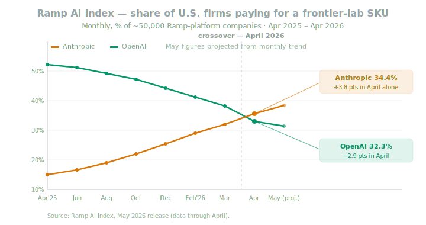
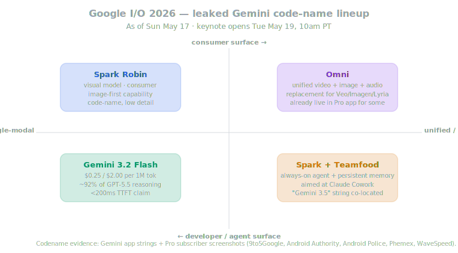
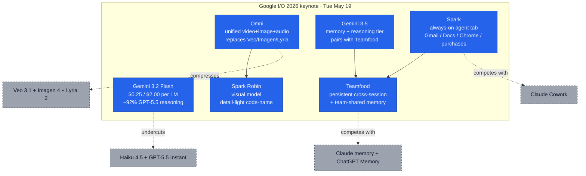
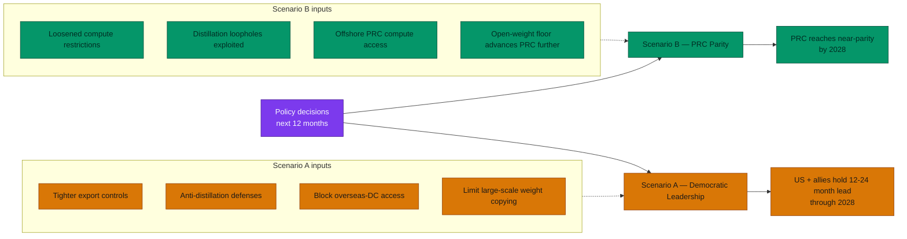
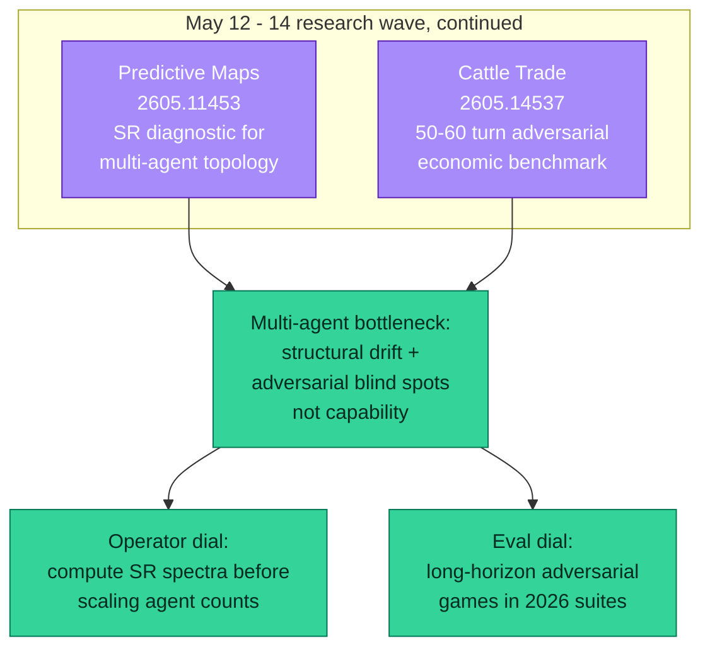

# LLM Updates — 2026-May-17

Sunday brief, written Sun May 17 (Los Angeles time), two days before
**Google I/O 2026** opens Tue May 19 at 10am PT. The May 16 brief
covered the **Anthropic $30B / $900B in-progress round**, **PwC ×
Anthropic 30K-staff alliance + Office of the CFO**, **Anthropic ×
Gates Foundation $200M**, **ChatGPT × Plaid Personal Finance**, the
**OpenAI ↔ Apple legal-action thread**, **Gemini 3.2 Flash leaked
pricing**, the first **Gemini Omni** screenshots, **Fast-Slow Training
(arXiv 2605.12484)**, **TIM diagnostic (arXiv 2605.14220)**,
**DeepMind's Abstraction Fallacy**, and **Sakana Fugu beta**. New
items in the Saturday-to-Sunday window:

1. **The Ramp AI Index for April 2026 published the actual crossover
   numbers** (May 15) — Anthropic **34.4%** of paying U.S. firms vs.
   OpenAI **32.3%**, a **+3.8 / −2.9 point** monthly delta. First
   time Anthropic has led on this index.
2. **SemiAnalysis published "Claude Code is the Inflection Point"**
   (May 15) — **4% of all public GitHub commits** are now authored by
   Claude Code (~135K commits / day), **double** the share from a
   month ago. Dylan Patel's team projects **20%+ by year-end 2026**.
3. **Anthropic published "2028: Two scenarios for global AI
   leadership"** (May 15) — a policy paper laying out a US-led vs.
   PRC-parity fork in frontier capability, with compute-access policy
   as the variable that selects between them. AGI-by-2028 framing
   moves into Anthropic's official voice for the first time.
4. **Gemini "Spark" agent + "Teamfood" memory + "Spark Robin"
   visual model code-names** leaked together (May 14 – 16), now
   firming up as a *coordinated agentic+memory push* alongside Omni
   at I/O — explicitly framed against Claude Cowork.
5. **Two new arXiv papers worth tracking**: *Predictive Maps of
   Multi-Agent Reasoning* (2605.11453, May 12) — a successor-
   representation diagnostic for *which* multi-agent topology
   amplifies vs. damps drift; *Cattle Trade* (2605.14537, May 14) —
   a long-horizon adversarial benchmark that catches structural
   failure modes (overbidding, self-bidding, weak opponent modelling)
   that standard reasoning benchmarks miss.
6. **The Brockman $50B-compute number** from the Musk-vs-OpenAI court
   testimony (May 5) gets re-framed alongside the in-progress
   Anthropic $30B raise — OpenAI's 2026 compute outlay is now public
   record, and at >2× Anthropic's 2026 run-rate compute it is the
   single best counter to the "Anthropic ahead" narrative.

Items from prior briefs *not* re-derived here: the $30B/$900B
in-progress round, the PwC alliance, the Gates Foundation pact, the
ChatGPT-Plaid preview, the OpenAI-Apple legal thread, Gemini 3.2 Flash
pricing leaks, Gemini Omni demos, Fast-Slow Training, the TIM
diagnostic, the Abstraction Fallacy, Sakana Fugu, the May 8 Colossus
1 anchor, AlphaEvolve impact, Claude Platform on AWS GA, Claude for
Small Business, DeployCo close, ZAYA1-8B, SubQ 12M context, GPT-5.5
Instant, Claude Opus 4.7, GPT-Realtime-2, Microsoft Agent 365 GA,
Louver / Beyond Reasoning / ScaleLogic / ReasonMaxxer.

---

## 1. The Ramp AI Index crossover — what the actual April numbers say

The May 15 release of the Ramp AI Index is the **first publication of
hard payment-share numbers** for the Anthropic-passes-OpenAI
narrative that's been building since Q1
([Ramp AI Index — May 2026](https://ramp.com/leading-indicators/ai-index-may-2026),
[VentureBeat — Anthropic beats OpenAI on business adoption](https://venturebeat.com/technology/anthropic-finally-beat-openai-in-business-ai-adoption-but-3-big-threats-could-erase-its-lead),
[TechTimes — Claude overtakes ChatGPT in U.S. business AI payments](https://www.techtimes.com/articles/316692/20260515/claude-overtakes-chatgpt-us-business-ai-payments-first-time.htm),
[Cryptopolitan — Anthropic overtakes OpenAI in US business spending](https://www.cryptopolitan.com/anthropic-overtakes-openai-business-spending/),
[The News — business AI adoption](https://www.thenews.com.pk/latest/1402567-anthropic-overtakes-openai-in-business-ai-adoption),
[econlab — Anthropic beats OpenAI](https://econlab.substack.com/p/anthropic-beats-openai)).

The shape worth pulling out of the chart:

- **Anthropic 34.4% / OpenAI 32.3%** of ~50,000 Ramp-platform
  companies in April. Anthropic's **+3.8 points in one month** is
  the largest single-month adoption jump on the index since it
  started; OpenAI's **−2.9 points** is its largest single-month
  drop.
- **Anthropic's twelve-month curve is roughly 4× higher** than where
  it started (Apr 2025 was ~9%). OpenAI's curve, by contrast, peaked
  in late 2025 and has been bleeding ~1.5 points / month since
  February.
- **The driver is concentrated.** Per the same Ramp piece, *Claude
  Code* alone accounts for the bulk of net-new Anthropic spend on
  cards and invoices; the next-largest contributor is Claude on AWS
  Bedrock.

The May 15 Ramp release is now the canonical citation that pricing
analysts, procurement teams, and capital-markets researchers are
plugging into the Anthropic-valuation narrative. The *valuation* leg
(yesterday's $30B / $900B in-progress round, see May 16 brief, §1)
and the *adoption* leg (today's Ramp numbers) now line up.

The May 16 brief flagged that the *story is now possible*; the May 17
update is that the story has **its numerical anchor**. Watch for
Counterpoint Research's Q2 2026 LLM revenue-share update in early
July to either confirm the crossover at the *revenue* level (not
just *count of payers*) or pull it back into ambiguity.

---

## 2. SemiAnalysis: Claude Code at 4% of GitHub public commits

The companion data point to the Ramp Index landed on the same day:
SemiAnalysis (Dylan Patel) published **"Claude Code is the Inflection
Point"** on May 15
([SemiAnalysis — Claude Code is the Inflection Point](https://newsletter.semianalysis.com/p/claude-code-is-the-inflection-point),
[Dylan Patel on X — 4% of GitHub public commits](https://x.com/dylan522p/status/2019490550911766763),
[SemiAnalysis on X](https://x.com/SemiAnalysis_/status/2027443723362042308),
[OfficeChai — 4% of GitHub commits](https://officechai.com/ai/4-of-github-commits-are-now-made-by-claude-code-semianalysis-report/),
[GIGAZINE — Claude Code commit share](https://gigazine.net/gsc_news/en/20260210-claude-code-github-commits-4-percent-20-percent/),
[36Kr — humans can no longer compete on GitHub](https://eu.36kr.com/en/p/3672726109741953),
[D3Alpha — Claude Code owns 4% of GitHub](https://blog.d3alpha.com/news/the-ai-apocalypse-is-here-claude-now-owns-4-of-github-aiming-for-20-by-2026)).

The shape:

- **~4% of all public GitHub commits authored by Claude Code today**
  — roughly **135,000 commits / day** identifiable as Claude Code
  output by either commit-trailer signature, co-author byline, or
  CLA-side metadata.
- **Daily commit volume up ~200% in the eight weeks ending mid-May**
  — i.e., the *rate* is still accelerating, not plateauing.
- **Projection: 20%+ of all daily commits by year-end 2026** if the
  current trajectory holds. SemiAnalysis explicitly flags this as
  "while you blinked, AI consumed all of software development."
- **Enterprise commercial corollary**: Anthropic's $1M+ ARR accounts
  have **doubled from 500 (Feb) to 1,000+ (May)**, with 2,000+ by
  Q4 the same-trajectory number.

The architectural implication that fits with the May 16 brief is
this: **Claude Code is the single dominant Anthropic SKU driving the
Ramp Index crossover and the $900B valuation narrative both**. It is
neither the API nor Claude consumer chat — it is the *programming-
agent surface* that has the most leverage on the lab's commercial
arc. The competitive question, restated: **can Gemini Spark agent +
Codex CLI catch the developer-mindshare flywheel before it
compounds further?** The next data point on that question is the
**Gemini Spark agent reveal at I/O on Tuesday** — §3 below.

A footnote that matters for the 20%-by-year-end projection: ~4% is
the *public-repo* share. *Private*-repo authoring share is unknown
but plausibly higher (enterprise teams using Claude Code on private
repos are a heavier tilt of the user base). If the true private-
repo share is already ~10–15%, the public 4% number is undercounting
the actual industry footprint.

---

## 3. Pre-I/O, sharpened: Spark agent + Teamfood + Spark Robin alongside Omni

The May 16 brief framed Gemini Omni as the headline I/O reveal. Two
more code-names firmed up over Saturday into Sunday, and the
combined picture is now the most ambitious I/O lineup Google has
queued since the original Gemini-3 reveal at I/O 2024.

### 3.1 Spark — the agentic Gemini, aimed at Claude Cowork

Gemini app strings, screenshots, and onboarding flows have surfaced
a feature called **"Spark"** — a dedicated *Agent* tab inside the
Gemini app, separate from Chat, where users compose recurring
"skills" (automated task templates) and schedule workflows
([Android Authority — Gemini Spark agent leak](https://www.androidauthority.com/google-gemini-spark-agent-leak-3667475/),
[Android Police — Spark screenshots](https://www.androidpolice.com/googles-ai-agent-gemini-spark-leaks-ahead-of-expected-announcement/),
[Android Headlines — Spark agent feature leak](https://www.androidheadlines.com/2026/05/google-gemini-spark-ai-agent-features-leak-io-2026.html),
[Geo.tv — Gemini Spark explainer](https://www.geo.tv/latest/664640-what-is-gemini-spark-googles-new-ai-agent-leaks-days-before-io),
[FindSkill — Gemini Spark 24/7 agent](https://findskill.ai/blog/what-is-gemini-spark/),
[MindStudio — Gemini Spark 24/7 agent profile](https://www.mindstudio.ai/blog/what-is-gemini-spark-google-24-7-agent),
[OfficeChai — Gemini Spark agentic move](https://officechai.com/ai/gemini-spark/),
[KnightLi — Gemini 3.5 Pro + Spark coding race](https://www.knightli.com/en/2026/05/15/gemini-35-pro-spark-agent-ai-coding-race/)).

What Spark can do, per the leaked onboarding:

- Clean up Gmail spam autonomously, compile meeting summaries across
  Docs / Sheets / Drive, generate scheduled personalised news
  digests, and run repeated Chrome-side browsing flows.
- Control Chrome on-device and read files from local storage and
  connected devices. *Cannot* yet control the full OS the way
  OpenClaw / Claude Cowork can.
- **Allows autonomous purchases by default** in the onboarding —
  Spark's leaked copy *explicitly* tells the user that the agent
  may transact on their behalf. Anthropic's Cowork *blocks*
  autonomous purchases at the policy level. That is the single
  largest behavioural-policy divergence between the two products.

The strategic shape: **Spark is Google's structural response to
the Claude Code → 4%-of-commits → 34.4% Ramp Index flywheel**.
Google's bet is that *consumer-grade* agentic automation (Gmail,
Docs, Calendar, Chrome) — bundled into the existing Gemini app —
flips the developer-mindshare loss into a *consumer* win that
re-anchors the brand. Whether that strategy lands depends on whether
the **autonomous-purchase posture survives WWDC / consumer-safety
scrutiny** in the next four weeks.

### 3.2 Teamfood — persistent cross-session memory

The third code-name in the same UI sweep is **"Teamfood,"** described
in leaked references as a persistent-memory layer running in parallel
to the new model speed tier
([NPowerUser — Spark, Omni, Gemini 3.5 rumors](https://nokiapoweruser.com/google-io-2026-gemini-spark-omni-gemini-3-5-rumors/),
[MindStudio — Gemini 3.5 vs Gemini Ultra strategy](https://www.mindstudio.ai/blog/gemini-3-5-speed-vs-gemini-ultra-memory-strategy)).
The shape:

- Persistent memory of user preferences, constraints, and prior
  artifacts **across sessions, not just within context** — i.e.,
  the same long-tail-persistence feature OpenAI shipped to Pro tier
  in 2024 (ChatGPT Memory) and Anthropic shipped behind Cowork
  storage in March 2026.
- Aimed at **the multi-session continuity gap** that Claude Cowork
  closed first; Spark + Teamfood together are positioned as the
  matched-feature response.
- The "Teamfood" branding suggests **enterprise / team-shared memory
  pools**, not just per-user memory — a feature neither ChatGPT
  Memory nor Cowork has shipped at parity.

### 3.3 Spark Robin and "Gemini 3.5" co-located strings

The same UI sweep also surfaced two more references:

- **"Spark Robin"** — visual model code-name with limited detail in
  leaks but consistently appearing alongside Spark / Omni / Teamfood
  in app strings ([NPowerUser — Spark Robin reference](https://nokiapoweruser.com/google-io-2026-gemini-spark-omni-gemini-3-5-rumors/)).
- **"Gemini 3.5"** as a *separate* version string from "Gemini 3.2
  Flash" — implying two distinct model-tier moves at I/O:
  *Gemini 3.2 Flash* as the speed/cost play (the May 16 brief flagged
  $0.25 / $2.00 per 1M leaked pricing), and *Gemini 3.5* as a memory-
  and-reasoning tier that pairs with Teamfood
  ([MindStudio — Gemini 3.5 Speed vs Gemini Ultra Memory](https://www.mindstudio.ai/blog/gemini-3-5-speed-vs-gemini-ultra-memory-strategy)).

The combined keynote shape, then, is a **four-axis push** that
spreads across product surfaces:

| Axis           | Code-name         | What it's competing with                |
| -------------- | ----------------- | --------------------------------------- |
| Cost / speed   | Gemini 3.2 Flash  | Claude Haiku 4.5, GPT-5.5 Instant       |
| Memory / depth | Gemini 3.5 + Teamfood | ChatGPT Memory, Claude Cowork storage |
| Agentic        | Spark             | Claude Cowork, ChatGPT agent surface    |
| Generative     | Omni + Spark Robin | Veo (internal) → unified; Sora-Pro     |

The risk Google ran into at I/O 2024 (over-announcing too many
overlapping models) is the obvious watch item for Tuesday: the
*labelling* of these four axes for consumers and developers matters
as much as the underlying capability. Expect a unified
"Gemini Intelligence" brand to be Google's container for all four.

---

## 4. Anthropic's "2028: Two scenarios for global AI leadership"

The Saturday-into-Sunday discourse cycle has been dominated by
Anthropic's policy paper **"2028: Two scenarios for global AI
leadership"**
([Anthropic — 2028 scenarios](https://www.anthropic.com/research/2028-ai-leadership),
[creati.ai — 2028 scenarios](https://creati.ai/ai-news/2026-05-15/anthropic-publishes-2028-scenarios-for-global-ai-leadership/),
[eweek — US-China decided by 2028](https://www.eweek.com/news/anthropic-us-china-ai-leadership-2028-apac/),
[Interesting Engineering — China could overtake by 2028](https://interestingengineering.com/ai-robotics/anthropic-china-us-ai-race-2028),
[YourStory — 2028 turning point](https://yourstory.com/ai-story/anthropic-2028-ai-race-us-china-policy-2026),
[Digg — 2028 scenarios overview](https://www.digg.com/ai/kkj87158?rank=2),
[ThePrint — Anthropic 2028 race](https://theprint.in/tech/anthropic-ai-race-2028-china-us/2932313/),
[RSWebSols — AGI by 2028 framing](https://www.rswebsols.com/news/anthropic-claims-agi-could-be-achieved-by-2028-urges-us-to-prevent-china-from-dominating-ai-competition/),
[NewsBytesApp — AGI by 2028](https://www.newsbytesapp.com/news/science/agi-could-arrive-by-2028-anthropic/story)).

The frame: a "country of geniuses in a datacenter" — Anthropic's
shorthand for transformative AI — is **2-to-3 years away**, and
which country owns it depends almost entirely on **compute-access
policy decisions taken in the next 12 months**.

The two scenarios:

Three things the paper does for the first time:

1. **Anthropic, as an institution, puts "AGI by 2028" into its
   official voice.** The phrase has been around the lab's senior
   researchers for two years; this is its first appearance in a
   formally-published research paper bearing Anthropic's name.
2. **It frames compute as the single binding bottleneck**, not
   talent, data, or algorithms. The Anthropic-Google $200B compute
   deal (May 5) and the in-progress $30B raise (May 12) read as the
   *operational* expression of the same thesis the paper makes
   *theoretically*.
3. **It positions Anthropic as a *policy* voice on US-China
   competition** — a posture Google DeepMind and OpenAI have so far
   declined to take publicly. This makes Anthropic, in 2026, the
   most outward-facing safety-and-policy lab in the frontier set.

The political signal worth noting: the paper aligns Anthropic with
the *export-control hawk* wing of US policy. Within 30 days, this is
likely to attract direct response from DeepSeek, Zhipu, and Alibaba
Qwen — and possibly a public counter-statement from one of the
PRC-aligned open-weights labs about how distillation-based
catch-up is framed.

The capital-markets read: the paper's "compute is everything" thesis
strengthens the in-progress $30B round's narrative directly. A
$900B valuation is easier to justify in a market where compute *is*
the moat than in one where algorithms are.

---

## 5. The $50B counter — OpenAI's compute outlay, on the record

The compute-and-capital backdrop to the Anthropic crossover narrative
got its quietest-but-most-important counter at the **Musk-vs-OpenAI
trial on May 5**, when Greg Brockman testified under oath that **OpenAI
expects to spend ~$50B on computing power in 2026**
([Bloomberg — OpenAI $50B compute in 2026](https://www.bloomberg.com/news/articles/2026-05-05/openai-to-spend-50-billion-on-computing-in-2026-brockman-says),
[Yahoo Finance — Brockman testimony](https://finance.yahoo.com/sectors/technology/articles/openai-spend-50-billion-computing-183043026.html),
[Technobezz — Brockman testifies $50B](https://www.technobezz.com/news/openai-president-greg-brockman-testifies-company-will-spend-50-billion-on-computing-this-year),
[BigGo Finance — OpenAI $50B AI infra](https://finance.biggo.com/news/eUDA-50BYH_ypPqOfra-),
[qz.com — $50B 2026 spend](https://qz.com/openai-computing-spending-50-billion-brockman-trial-050526),
[Bloomberg Law — Brockman testimony](https://news.bloomberglaw.com/artificial-intelligence/openai-to-spend-50-billion-on-computing-in-2026-brockman-says),
[Let's Data Science — $50B compute spend](https://letsdatascience.com/news/openai-executive-testifies-to-50b-compute-spend-6f5aeb5d)).

Why it matters *now*, twelve days after the testimony:

- **Anthropic's 2026 compute outlay run-rate, derived from the Google
  $200B / 5 GW deal (~$40B / year payable to Google alone) plus
  Colossus 1 capacity (May 8 brief), is in the $40 – 50B range.**
  OpenAI's $50B and Anthropic's roughly-equal number put the two
  labs at compute *parity* in 2026 for the first time.
- **OpenAI's $600B-by-2030 framework** (also disclosed in February
  2026 investor materials) implies a steeper compute curve than
  Anthropic's, but with worse 2026-onwards revenue density.
- **The CFO Sarah Friar comment of May 15** ("vertical wall of
  demand, but not a lot of compute in 2026") is the *operational*
  signal that OpenAI is bumping into the upper bound of the $50B
  outlay early in the year. A second OpenAI raise — flagged in
  yesterday's brief — is the most likely Q3 2026 capital event.

The watch item: **does OpenAI announce a counter-raise *before*
Anthropic's $30B closes** (Bloomberg flagged "end of May")? If yes,
the $50B disclosure is the prelude. If no, the disclosure becomes
the public anchor for what Brockman called the "race-condition" of
2026 — both labs are compute-binding, both labs need more, and the
order in which they print large rounds determines two years of
narrative.

---

## 6. Research wave continued — multi-agent topology and adversarial benchmarks

Two more arXiv papers from the May 12 – 14 window are worth recording.
Both are *systems / evaluation* papers, not new-architecture papers
— the pattern from yesterday's brief continues to hold: the frontier
research community is consolidating *how it runs* what it has,
rather than introducing new model families.

### 6.1 Predictive Maps of Multi-Agent Reasoning (arXiv 2605.11453, May 12)

**Predictive Maps of Multi-Agent Reasoning: A Successor-
Representation Spectrum for LLM Communication Topologies**
([arXiv 2605.11453](https://arxiv.org/abs/2605.11453),
[HTML](https://arxiv.org/html/2605.11453)) — Park & Alharthi — gives
a *pre-inference* diagnostic for which multi-agent topology (chain,
star, mesh, custom) will amplify drift, converge to consensus, or
collapse under perturbation.

The mechanism: given a row-stochastic communication operator P over
agents, the **successor representation** M = (I − γP)^(−1) has three
spectral quantities that each map to a distinct failure mode:

- **Spectral radius ρ(M)** — predicts **drift amplification** (how
  much an initial token-level disagreement compounds across agents).
- **Spectral gap Δ(M)** — predicts **consensus-convergence speed**
  (large gap → fast convergence; small → oscillation or non-
  convergence).
- **Condition number κ(M)** — predicts **robustness to perturbation**
  (high κ → small input changes flip the agent system into a
  different attractor).

The authors give closed-form spectra for the three canonical
topologies and validate empirically on a 12-step structured state-
tracking task with Qwen2.5-7B-Instruct over 100 trials per
condition. The headline takeaway: **mesh topologies have the best
robustness but worst convergence speed; star topologies converge
fastest but amplify drift via the hub; chain topologies are the
only configuration whose three spectral signatures all degrade
under length**.

The practical use: this is the first paper that gives an
infrastructure-side team a **dial they can compute before running a
multi-agent stack** to predict which failure mode it will hit. For
teams using Sakana Fugu (yesterday's brief), Claude Cowork, or
custom multi-agent orchestration, this lands at exactly the right
moment.

### 6.2 Cattle Trade benchmark (arXiv 2605.14537, May 14)

**Cattle Trade: A Multi-Agent Benchmark for LLM Bluffing, Bidding,
and Bargaining** ([arXiv 2605.14537](https://arxiv.org/abs/2605.14537),
[HTML](https://arxiv.org/html/2605.14537)) — Müller & Müller — is
the first multi-agent benchmark in 2026 that **tests adversarial
reasoning over a single long-horizon (50–60 turn) economic game**
rather than the usual disjoint single-skill suites.

What it bundles: auctions, hidden-offer trade challenges, bargaining,
bluffing, opponent modelling, and resource allocation — all inside
one game, all under imperfect information.

The headline finding that breaks with multi-agent-LLM optimism: **two
heuristic code agents (no LLM) outperform most tested LLMs on overall
rank**. Behavioural traces surface a consistent failure-mode
catalogue:

- **Overbidding** — LLMs systematically over-pay in auctions when
  uncertain about opponent valuation.
- **Self-bidding** — multi-agent LLMs occasionally bid against their
  own holdings due to context-window confusion.
- **Bankrupt TC initiation** — LLMs initiate trades they cannot
  fund.
- **Weak opponent-state adaptation** — LLMs fail to track that
  opponents have learned from earlier rounds.

The take that ties to the Predictive Maps paper above: **the failure
modes Cattle Trade surfaces are largely the spectral-radius drift-
amplification failures that the SR diagnostic predicts**. The two
papers together suggest a 2026 research thesis: *multi-agent LLM
systems' bottleneck is not capability — it is structural drift and
adversarial-reasoning blind spots that current single-agent
benchmarks do not catch*.

---

## 7. Frontier snapshot, May 17

Updated rows vs. yesterday's brief:

| Slot                          | Top model / state (May 17)               | Δ vs. May 16 brief                                                |
| ----------------------------- | ---------------------------------------- | ----------------------------------------------------------------- |
| Frontier reasoning            | Claude Opus 4.7                          | unchanged                                                         |
| Frontier coding               | GPT-5.5 Pro / Claude Opus 4.7            | unchanged                                                         |
| Default consumer chat         | GPT-5.5 Instant                          | unchanged                                                         |
| Voice / realtime              | GPT-Realtime-2                           | unchanged                                                         |
| Open-weight frontier          | DeepSeek V4-Pro / Mistral Medium 3.5     | unchanged                                                         |
| Open-weight efficient         | ZAYA1-8B (Apache-2.0)                    | unchanged                                                         |
| Cloud-managed Claude          | Claude Platform on AWS, GA               | unchanged                                                         |
| Enterprise vertical (SMB)     | Claude for Small Business                | unchanged                                                         |
| Enterprise services layer     | OpenAI DeployCo + Tomoro FDEs            | unchanged                                                         |
| Big-4 SI deployment           | PwC × Anthropic, 30K certified           | unchanged                                                         |
| **U.S. business AI payments** | **Anthropic 34.4% > OpenAI 32.3%**       | **new** — first crossover, Ramp Index April 2026                  |
| **Public-repo dev share**     | **Claude Code at ~4% of GitHub commits** | **new** — SemiAnalysis report, 20%+ projected by year-end         |
| Consumer-finance surface      | ChatGPT Personal Finance × Plaid         | unchanged from May 16                                             |
| Multi-lab governance plane    | Microsoft Agent 365 ($15 / user / mo)    | unchanged                                                         |
| On-device flagship            | Apple PT-MoE + 3B local                  | unchanged (iOS 27 Extensions queued for WWDC June 8)              |
| Subquadratic / long-context   | SubQ (claims) · Mamba-3 · GPT-5.5        | unchanged                                                         |
| Sparse-attention research     | Louver (arXiv 2605.06763)                | unchanged                                                         |
| RL-for-reasoning              | ReasonMaxxer · ScaleLogic · BR · FST     | unchanged                                                         |
| RL-stability infrastructure   | TIM diagnostic (arXiv 2605.14220)        | unchanged                                                         |
| **Multi-agent topology dial** | **SR spectrum (arXiv 2605.11453)**       | **new** — closed-form diagnostic for chain / star / mesh failures |
| **Adversarial-LLM benchmark** | **Cattle Trade (arXiv 2605.14537)**      | **new** — long-horizon economic game, code agents > LLMs          |
| Multi-agent orchestrator      | Sakana Fugu beta                         | unchanged                                                         |
| Coding-agent / research       | AlphaEvolve, integrated production       | unchanged                                                         |
| Cyber-offence (in the wild)   | Cybercrime AI zero-day (May 11)          | unchanged                                                         |
| Agent pricing primitives      | Anthropic $0.08 / session-hour           | unchanged                                                         |
| Paper valuation flag          | Anthropic ~$900B (in progress) > OpenAI $852B | unchanged from May 16                                        |
| **OpenAI 2026 compute outlay** | **$50B (under-oath disclosure)**        | **clarified** — Brockman May 5 trial testimony, ~parity Anthropic |
| Model-welfare public stance   | DeepMind: LLMs cannot be conscious       | unchanged                                                         |
| **AGI-by-2028 framing**       | **Anthropic, in its own voice**          | **new** — "2028: Two scenarios" policy paper, May 15              |
| **Pre-I/O agentic surface**   | **Gemini Spark + Teamfood (leaked)**     | **new** — coordinated agentic+memory push, aimed at Cowork        |

---

## 8. Forward signals, May 18 – 24

The next seven days are dominated by I/O, the I/O post-mortem, and
the run-up to Anthropic's $30B close window:

- **Mon May 18 — pre-I/O quiet day.** The most likely day for an
  OpenAI counter-announcement (DeployCo acquisition, a price cut, or
  a raise hint) to land before being drowned out by Tuesday's
  keynote.
- **Tue May 19 — Google I/O keynote, 10am PT.** Highest-confidence
  reveals: Gemini 3.2 Flash GA at $0.25 / $2.00, Gemini Spark agent,
  Omni unified-modal pipeline. Highest-probability surprise:
  AlphaEvolve managed service on Vertex AI. Most-watched ambiguity:
  whether **Spark allows autonomous purchases by default** in the
  GA build (the leaked onboarding said yes; whether that survives
  consumer-safety scrutiny by Tuesday is open).
- **Wed May 20 — I/O Day 2.** Developer-facing detail: pricing,
  rate limits, API GA dates, Spark MCP / extensions surface, and
  Teamfood data-residency / enterprise controls. The first community
  benchmark runs on 3.2 Flash will land Wednesday afternoon.
- **Anthropic $30B round formal close.** Bloomberg's "as soon as
  end of May" still stands. The closer the round comes to the I/O
  news cycle, the less attention it attracts — which may be a
  feature, not a bug, for the round's choreography.
- **OpenAI second + third DeployCo acquisitions.** Two more
  late-stage talks. Pre-I/O (Mon May 18) is the highest-probability
  window.
- **TIM diagnostic adoption.** Watch for OpenAI / Anthropic /
  DeepMind blog acknowledgments — particularly post-I/O, when
  Google's training-infrastructure choices come under the same
  scrutiny.
- **Apple response to OpenAI legal threat.** 22 days to WWDC. Public
  silence through May 24 is the most likely play, but the first
  iOS 27 developer beta seed (expected first week of June) will be
  the next inflection.
- **Counter-statements on Anthropic's 2028 paper.** Most likely
  source: DeepSeek or a CCP-adjacent commentary outlet, within 7
  days. Lower-probability but more interesting: an OpenAI Global
  Affairs response that disagrees on the *time-frame* rather than
  the *policy*.

---

## 9. Action set, May 17

For teams operating production LLM stacks this weekend:

**Capital & vendor strategy**
- The **Ramp AI Index crossover** (34.4% / 32.3%) is now the
  citable adoption number. If you are inside a vendor-selection
  process this week, you have a defensible reason to weight
  Anthropic higher on procurement scoring sheets than you could in
  Q1.
- **Lock pricing on Anthropic contracts before the $30B round
  closes** — yesterday's brief flagged this; the Ramp number
  sharpens the urgency. Anthropic's pricing posture will harden
  *after* the round prints, not before.

**Developer tooling**
- If you build developer tooling and are not yet **Claude Code
  integrated**, the 4%-of-GitHub-commits number is the wake-up
  call. The SemiAnalysis projection (20%+ by year-end) puts the
  *substrate* of code authorship onto Claude Code in less than a
  year. Build integrations now.
- **Watch Spark agent at I/O** as the most credible challenger.
  If Spark ships with Google Workspace integration depth + Chrome
  control + autonomous-purchase posture intact, the Claude Cowork
  competitive landscape changes in 72 hours.

**Multi-agent infrastructure**
- If you run a multi-agent stack (Cowork, Fugu, custom
  orchestrator), **compute the successor-representation spectrum**
  of your communication topology this week. The Predictive Maps
  paper (2605.11453) gives closed-form spectra for the three
  canonical shapes; the diagnostic takes hours to implement and may
  surface the failure mode your stack will hit before it hits.
- If you run multi-agent evaluation, add **Cattle Trade** to your
  suite. Single-skill benchmarks miss the overbidding /
  self-bidding / opponent-modelling failure modes; long-horizon
  adversarial games surface them.

**Policy / regulatory**
- The Anthropic 2028 paper raises the political temperature on
  export controls. If you operate compute in Hong Kong, Singapore,
  or Middle-East jurisdictions that have been used as offshore PRC
  access points, **expect tightened compliance pressure** within
  90 days.
- If you're a Chinese open-weights lab — or a Western team using
  one (DeepSeek, Qwen, Zhipu) — **the distillation-loophole
  framing in the Anthropic paper is the most direct policy signal
  the lab has issued**. Recompute your dependency risk.

**Pre-I/O hedging**
- If you run on Veo, Imagen, or Lyria, **plan an Omni migration
  path**. Yesterday's brief flagged this; the codename-cluster
  (Omni + Spark Robin) supports the unified-pipeline reading
  strongly enough to act on.
- If you sell developer tooling, **the Gemini 3.2 Flash price
  point ($0.25 / $2.00) is the floor your pricing has to clear**.
  Any feature that doesn't justify a 5–7× premium over 3.2 Flash
  will not survive a 90-day procurement cycle.

**Apple / iOS surface**
- iOS 27 developer beta seed is expected the **first week of
  June** (post-WWDC keynote on June 8). The OpenAI legal-action
  thread + Extensions framework means **default-assistant routing
  remains in flux** through summer. Don't hard-code ChatGPT
  invocation in iOS apps; abstract over the Extensions surface
  that's coming.

---

## Sources

Ramp AI Index + business-payment crossover
- [Ramp AI Index — May 2026 (data through April)](https://ramp.com/leading-indicators/ai-index-may-2026)
- [VentureBeat — Anthropic beats OpenAI in business AI adoption](https://venturebeat.com/technology/anthropic-finally-beat-openai-in-business-ai-adoption-but-3-big-threats-could-erase-its-lead)
- [TechTimes — Claude overtakes ChatGPT in U.S. business AI payments](https://www.techtimes.com/articles/316692/20260515/claude-overtakes-chatgpt-us-business-ai-payments-first-time.htm)
- [Cryptopolitan — Anthropic overtakes OpenAI in US business spending](https://www.cryptopolitan.com/anthropic-overtakes-openai-business-spending/)
- [The News — Anthropic overtakes OpenAI in business AI adoption](https://www.thenews.com.pk/latest/1402567-anthropic-overtakes-openai-in-business-ai-adoption)
- [econlab — Anthropic beats OpenAI](https://econlab.substack.com/p/anthropic-beats-openai)
- [MEXC — Claude edges out ChatGPT](https://www.mexc.co/en-PH/news/1094196)
- [FinTech Weekly — Claude overtakes ChatGPT as AI trust debate intensifies](https://www.fintechweekly.com/news/claude-surpasses-chatgpt-app-store-ai-trust)

Claude Code as inflection point
- [SemiAnalysis — Claude Code is the Inflection Point](https://newsletter.semianalysis.com/p/claude-code-is-the-inflection-point)
- [Dylan Patel on X — 4% of public GitHub commits](https://x.com/dylan522p/status/2019490550911766763)
- [SemiAnalysis on X — Claude Code 4% projection](https://x.com/SemiAnalysis_/status/2027443723362042308)
- [OfficeChai — 4% of GitHub commits by Claude Code](https://officechai.com/ai/4-of-github-commits-are-now-made-by-claude-code-semianalysis-report/)
- [GIGAZINE — Claude Code 4% commit share, 20% by year-end](https://gigazine.net/gsc_news/en/20260210-claude-code-github-commits-4-percent-20-percent/)
- [36Kr — humans can no longer compete on GitHub](https://eu.36kr.com/en/p/3672726109741953)
- [D3Alpha — Claude Code 4% of GitHub](https://blog.d3alpha.com/news/the-ai-apocalypse-is-here-claude-now-owns-4-of-github-aiming-for-20-by-2026)
- [Serpsculpt — Claude Code usage statistics 2026](https://serpsculpt.com/claude-code-usage-statistics/)

Pre-I/O 2026 — Spark, Teamfood, Spark Robin, Omni, 3.2 Flash, 3.5
- [Android Authority — Gemini Spark agent leak](https://www.androidauthority.com/google-gemini-spark-agent-leak-3667475/)
- [Android Police — Gemini Spark screenshots](https://www.androidpolice.com/googles-ai-agent-gemini-spark-leaks-ahead-of-expected-announcement/)
- [Android Headlines — Gemini Spark features leak](https://www.androidheadlines.com/2026/05/google-gemini-spark-ai-agent-features-leak-io-2026.html)
- [Geo.tv — Gemini Spark explainer](https://www.geo.tv/latest/664640-what-is-gemini-spark-googles-new-ai-agent-leaks-days-before-io)
- [FindSkill — Gemini Spark 24/7 agent](https://findskill.ai/blog/what-is-gemini-spark/)
- [MindStudio — Gemini Spark 24/7 agent profile](https://www.mindstudio.ai/blog/what-is-gemini-spark-google-24-7-agent)
- [OfficeChai — Gemini Spark agentic move](https://officechai.com/ai/gemini-spark/)
- [KnightLi — Gemini 3.5 Pro + Spark coding race](https://www.knightli.com/en/2026/05/15/gemini-35-pro-spark-agent-ai-coding-race/)
- [NPowerUser — Spark, Omni, Gemini 3.5 rumors](https://nokiapoweruser.com/google-io-2026-gemini-spark-omni-gemini-3-5-rumors/)
- [MindStudio — Gemini 3.5 Speed vs Gemini Ultra Memory strategy](https://www.mindstudio.ai/blog/gemini-3-5-speed-vs-gemini-ultra-memory-strategy)
- [MindStudio — Gemini 3.2 Flash vs Claude Opus 4.7](https://www.mindstudio.ai/blog/gemini-3-2-flash-vs-claude-opus-4-7)
- [NPowerUser — Gemini 3.2 Flash leak](https://nokiapoweruser.com/gemini-3-2-flash-leak-fast-cheap-ai-google-io-2026/)
- [9to5Google — Gemini Omni demos](https://9to5google.com/2026/05/11/gemini-omni-video-model-shows-up-with-some-early-demos/)
- [WaveSpeed — Omni leak read](https://wavespeed.ai/blog/posts/google-omni-video-model-leak-i-o-2026/)
- [AIxploria — Gemini Omni unified video-image](https://www.aixploria.com/en/ai-radar/google-gemini-omni-leak-video-model-io-2026/)
- [Oimi AI — Google Gemini Omni leak roundup](https://oimi.ai/en/blog/google-gemini-omni-leak)
- [iWeaver AI — Gemini Omni at I/O 2026](https://www.iweaver.ai/blog/gemini-omni-video-model/)
- [io.google/2026](https://io.google/2026/)
- [Tom's Guide / Yahoo — Google I/O 2026 keynote preview](https://tech.yahoo.com/general/article/google-io-2026-how-to-watch-and-what-to-expect-including-android-17-gemini-announcements-and-more-131200691.html)

Anthropic — 2028 scenarios
- [Anthropic — 2028: Two scenarios for global AI leadership](https://www.anthropic.com/research/2028-ai-leadership)
- [creati.ai — Anthropic publishes 2028 scenarios](https://creati.ai/ai-news/2026-05-15/anthropic-publishes-2028-scenarios-for-global-ai-leadership/)
- [eweek — US-China AI race could be decided by 2028](https://www.eweek.com/news/anthropic-us-china-ai-leadership-2028-apac/)
- [Interesting Engineering — China could overtake US by 2028](https://interestingengineering.com/ai-robotics/anthropic-china-us-ai-race-2028)
- [YourStory — Anthropic calls 2028 a turning point](https://yourstory.com/ai-story/anthropic-2028-ai-race-us-china-policy-2026)
- [Digg — Anthropic 2028 scenarios](https://www.digg.com/ai/kkj87158?rank=2)
- [ThePrint — Anthropic AI race 2028](https://theprint.in/tech/anthropic-ai-race-2028-china-us/2932313/)
- [RSWebSols — Anthropic AGI by 2028 framing](https://www.rswebsols.com/news/anthropic-claims-agi-could-be-achieved-by-2028-urges-us-to-prevent-china-from-dominating-ai-competition/)
- [NewsBytesApp — AGI by 2028: Anthropic](https://www.newsbytesapp.com/news/science/agi-could-arrive-by-2028-anthropic/story)
- [PunjabKesari — US vs China by 2028](https://english.punjabkesari.com/technology/ai-leadership-race-us-vs-china-by-2028/)

OpenAI — Brockman $50B testimony, compute posture
- [Bloomberg — OpenAI to spend $50B on computing in 2026](https://www.bloomberg.com/news/articles/2026-05-05/openai-to-spend-50-billion-on-computing-in-2026-brockman-says)
- [Yahoo Finance — OpenAI $50B compute, Brockman](https://finance.yahoo.com/sectors/technology/articles/openai-spend-50-billion-computing-183043026.html)
- [Technobezz — Brockman testifies $50B](https://www.technobezz.com/news/openai-president-greg-brockman-testifies-company-will-spend-50-billion-on-computing-this-year)
- [BigGo Finance — OpenAI 2026 $50B infra](https://finance.biggo.com/news/eUDA-50BYH_ypPqOfra-)
- [qz.com — OpenAI computing spending $50B](https://qz.com/openai-computing-spending-50-billion-brockman-trial-050526)
- [Bloomberg Law — Brockman $50B testimony](https://news.bloomberglaw.com/artificial-intelligence/openai-to-spend-50-billion-on-computing-in-2026-brockman-says)
- [Let's Data Science — $50B compute spend disclosure](https://letsdatascience.com/news/openai-executive-testifies-to-50b-compute-spend-6f5aeb5d)
- [Let's Data Science — OpenAI reports $50B 2026 spend](https://letsdatascience.com/news/openai-reports-50b-compute-spend-for-2026-384038dc)

Research wave (continued)
- [arXiv 2605.11453 — Predictive Maps of Multi-Agent Reasoning](https://arxiv.org/abs/2605.11453)
- [arXiv 2605.11453 HTML](https://arxiv.org/html/2605.11453)
- [arXiv 2605.14537 — Cattle Trade benchmark](https://arxiv.org/abs/2605.14537)
- [arXiv 2605.14537 HTML](https://arxiv.org/html/2605.14537)

Big-picture trackers
- [llm-stats — LLM updates May 2026](https://llm-stats.com/llm-updates)
- [llm-stats — AI news today](https://llm-stats.com/ai-news)
- [AI Flash Report — Model release timeline](https://aiflashreport.com/model-releases.html)
- [whatllm.org — New AI Models May 2026](https://whatllm.org/blog/new-ai-models-may-2026)
- [Air Street Press — State of AI May 2026](https://press.airstreet.com/p/state-of-ai-may-2026)
- [imfounder — 7 AI updates founders should know](https://imfounder.com/science-tech/ai/ai-updates-may-2026/)
- [Anthropic news](https://www.anthropic.com/news)
