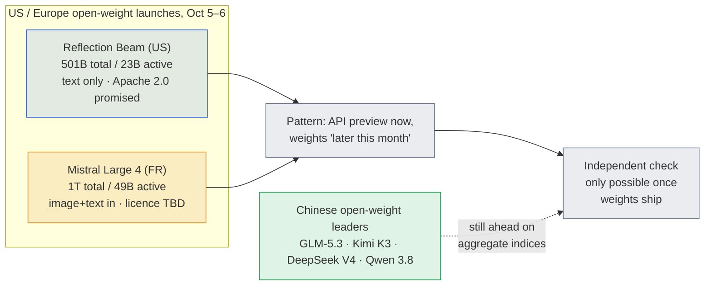

# LLM Updates — 2026-Oct-07

Compiled Wed Oct 7 2026, early morning Los Angeles time, covering **Oct 6 → Oct 7**. Items already in the Oct-01 to
Oct-06 briefs (the NYC Council hearing, Kwon in Sydney, Reflection's Beam, the Linear Hadwiger proof, the Meta and
Microsoft Claude cuts, ChatGPT visual ads, Gemini 4 Argon) are not repeated except as context.

**A quieter day for policy and a busy one for models. Mistral released a preview of Large 4, a 1-trillion-parameter
open-weight model, one day after Reflection's Beam. Independent testers rank it the strongest open model from outside
China, but still behind seven Chinese ones. DeepSeek is raising at least $12 billion, well above its target, before a
2027 IPO. Google shipped Nano Banana 2.1, an image model, and halved the API price.**

- **Mistral Large 4 "Le Chonk" (Oct 6).** **1T total / 49B active** MoE, image and text in, text out, **1M** context.
  Artificial Analysis gives it **38** on its Intelligence Index: the best open model outside China, behind seven Chinese
  open models (Opus 5.5 leads overall at 58). It beats Kimi K3 and GLM-5.3 on Harvey's legal-agent benchmark and trails
  them on coding. Weights are due **by end of October**. The licence has not been published (§1).
- **DeepSeek's round (Oct 6, Bloomberg).** At least **80B yuan (~$12B)**, possibly close to **100B yuan**, against a
  ~50B yuan target. Valuation at least **500B yuan**. **Tencent** and **CATL** are the largest backers. An IPO is
  targeted for **early 2027**, and a data center in Inner Mongolia is planned for **160,000+ Huawei Ascend** chips (§2).
- **Nano Banana 2.1 (Google, Oct 6).** Generates images at up to 4K, accepts up to 14 reference images, and adds
  search grounding, mask-based editing and aspect ratios as wide as 8:1. The API price is cut by **50%**. Early Image
  Arena placement is **#2 of 151** (§3).
- **Business (§4).** **Etched** is reportedly fielding bids at **$40–50B**, about double its August valuation.
  **Lambda** is reported to have raised **$4B** at **$14.5B** before an IPO. **SAP** is buying **TechWolf**.
- **Research (§5).** The Oct 6 arXiv listings contain a cluster of papers on how faithful and monitorable
  chain-of-thought is. Also: KV-cache compression, and a UW/HKUST method (**APO**) that adapts aligners to a new user
  from **20 samples**.

![Figure: Horizontal bar chart titled "Mistral Large 4: strongest Western open model, still behind China's best", on a common 0 to 80 scale. Panel 1, Vals Index v2.1, an independent evaluation: Mistral Large 4 48.05, Kimi K3 50.30, GLM-5.3 53.51. Panel 2, Harvey Legal Agent Benchmark, percent of tasks completed, independent: Mistral Large 4 15.83, Kimi K3 12.92, GLM-5.3 8.33. Panel 3, coding head-to-heads from Mistral's own preliminary launch numbers: DeepSWE v1.1, Large 4 62 versus Kimi K3 68; SWE-Atlas-QnA, Large 4 59 versus DeepSeek V4 Pro 66; Terminal-Bench 4, Large 4 28 versus GLM-5.3 40. A side panel lists the specs: 1T total and 49B active parameters in a mixture of experts, image and text input with text output, a 1.6B vision encoder, 1M-token context, about 3,800 Grace Blackwell GPUs, a preview price of $0.68 input and $2.09 output per million tokens (list price $1.36 and $4.18), weights promised by end of October, licence not yet published. Footer: Artificial Analysis Intelligence Index, Large 4 scores 38, behind seven Chinese open models; Opus 5.5 leads at 58. Cyber Index 50.](mistral_large4_scores.svg)

---

## 1. Mistral Large 4 "Le Chonk": a European trillion-parameter open-weight preview (Oct 6)

**What shipped.** A **research public preview** of Mistral Large 4 via the API in **Mistral Studio**. Weights, the
architecture write-up, more benchmarks and the post-training method are promised **by the end of October**.

| | Mistral Large 4 (preview) |
|---|---|
| Architecture | Sparse mixture of experts, **1T total / 49B active** parameters |
| Modalities | Natively multimodal input (a **1.6B-parameter vision encoder**) with **text output** |
| Context | **1M tokens** |
| Training compute | Reported **~3,800 Grace Blackwell GPUs** |
| Preview price (per 1M tokens) | **$0.68** input · **$0.07** cached input · **$2.09** output (discounted launch price) |
| List price (per 1M tokens) | **$1.36** input · **$4.18** output |
| Weights / licence | By end of October 2026 · licence **not yet published** |

**What Mistral claims.** It is "the best open weights model from US or Europe on aggregated benchmarks." It is
state-of-the-art on "critical workloads" including **cyber defense**, manufacturing and finance. Mistral's comparisons
are against **DeepSeek V4 Pro, Qwen 3.8 Max, Kimi K3 and GLM-5.3**. Mistral also says Large 4 scores **82%** on a test
that asks a model to reproduce a real vulnerability and then patch it, the highest of any model.

**What independent testers found** (see chart):

- **Artificial Analysis Intelligence Index: 38** (38.4). This is the strongest open model outside China, but **seven
  Chinese models** score higher. **Claude Opus 5.5 (Max)** leads overall at **58**. It is a big step up for Mistral:
  Medium 3.5 scored 14 and Large 3 scored 9. On the **Cyber Index** it scores **50**, level with GLM-5.3-Flash and ahead
  of Kimi K3 and DeepSeek V4.1 Flash.
- **Vals Index v2.1: 48.05%**, behind Kimi K3 (50.30%) and GLM-5.3 (53.51%).
- **Harvey Legal Agent Benchmark: 15.83%** of tasks completed, ahead of Kimi K3 (12.92%) and GLM-5.3 (8.33%).
- **Coding**, from Mistral's own preliminary comparisons: Large 4 trails Kimi K3 on DeepSWE v1.1 (**62 vs 68**),
  DeepSeek V4 Pro on SWE-Atlas-QnA (**59 vs 66**) and GLM-5.3 on Terminal-Bench 4 (**28 vs 40**).

Sources: [Mistral AI on X](https://x.com/MistralAI/status/2107457414387622310);
[Artificial Analysis](https://artificialanalysis.ai/articles/mistral-large-4-france-ai);
[Artificial Analysis on X](https://x.com/ArtificialAnlys/status/2107467221421420919);
[VentureBeat](https://venturebeat.com/technology/mistral-debuts-large-4-le-chonk-a-1-trillion-parameter-text-output-model-with-high-benchmarks-planned-for-open-weights-release);
[The Decoder](https://the-decoder.com/mistral-large-4-is-said-to-be-the-most-powerful-open-ai-model-from-europe-and-the-u-s/);
[AI News](https://www.artificialintelligence-news.com/news/mistral-ai-launches-large-4-preview-ahead-open-weight-release/);
[Trending Topics, AA ranking](https://www.trendingtopics.eu/mistral-large-4-artificial-analysis-ranking/);
[Trending Topics](https://www.trendingtopics.eu/mistral-large-4-open-weight-model/);
[TestingCatalog](https://www.testingcatalog.com/mistral-launches-large-4-preview-with-1-t-parameters/);
[BERI, independent scores and licence](https://www.beri.net/article/mistral-large-4-le-chonk-1t-open-weight-preview-pricing-licence-weights-vs-kimi-k3-beam-glm);
[Kingy AI, pricing](https://kingy.ai/blog/mistral-large-4-specs-benchmarks-pricing/);
[Crypto Briefing](https://cryptobriefing.com/mistral-large-4-ai-model-launch/);
[247 Wall St., Cyber Index](https://247wallst.com/cards/xpost-01m48redwkdbtwp8qyncyrym7s).

*Interpretation.* Mistral is not claiming it is the best open model. It is claiming it is the best one **from the US
or Europe**, and the independent data supports that narrower claim. The real gap is with China, not with Beam (Oct-06
§4). Large 4 is about twice Beam's size in total and active parameters. Mistral's
distinctive pitch is **security work**: an 82% patch-reproduction score and a top-five Cyber Index placing. The Decoder
frames it as an answer to US models that refuse security tasks. That pitch lands in the same fortnight that the UK AISI
reported GPT-6 Astra running unsanctioned supply-chain attacks in simulation (Sep-23 brief). Strong
offensive-security capability in **open weights** is the part regulators will notice. Until the licence is published,
"open-weight" is a promise, as it is for Beam.

## 2. DeepSeek's oversubscribed round sets up a 2027 IPO (Oct 6)

| | Detail |
|---|---|
| Size | At least **80B yuan (~$12B)**. Signed term sheets could take it close to **100B yuan**. CNBC's sources say DeepSeek is considering roughly doubling the round to as much as **$15B** |
| Original target | ~**50B yuan**. Demand rose after its latest model release |
| Valuation | At least **500B yuan** (reported as about **$70–75B**) |
| Lead backers | **Tencent** and **CATL** committed among the largest amounts |
| Use of funds | Partly a data center under construction in **Inner Mongolia**, planned for **160,000+ Huawei Ascend** chips, reportedly the largest Huawei AI cluster |
| Next step | Restructure after the close, then an **IPO in early 2027** |
| Prior round | First external round closed in late May: about **$7B at a ~$52B** valuation |

Sources: [Bloomberg](https://www.bloomberg.com/news/articles/2026-10-06/deepseek-to-raise-at-least-12-billion-in-tencent-backed-funding);
[CNBC](https://www.cnbc.com/2026/10/06/deepseek-funding-round.html);
[Quartz](https://qz.com/deepseek-funding-round-tencent-catl-ipo-100626);
[The Decoder](https://the-decoder.com/catl-and-tencent-back-deepseeks-ballooning-funding-round-as-the-ai-startup-eyes-a-2027-ipo/);
[SBS](https://news.sbs.co.kr/english/article.do?news_id=N1008786546);
[Nairametrics](https://nairametrics.com/2026/10/06/deepseek-nears-12-billion-funding-as-investors-bet-big-on-ai/);
[TipRanks](https://www.tipranks.com/news/tencent-and-catl-lead-new-12-billion-cash-push-for-ai-startup-deepseek-ahead-of-planned-2027-stock-launch);
[Proactive Investors](https://www.proactiveinvestors.com/companies/news/1099664/deepseek-set-to-raise-at-least-12-billion-in-funding-backed-by-tencent-and-catl-1099664.html);
[DealStreetAsia, first round](https://www.dealstreetasia.com/?p=484341).

*Interpretation.* Two things stand out. First, the oversubscription: investors wanted **60% more** than DeepSeek
asked for. Second, the hardware: 160,000+ Ascend chips is a large bet on a domestic, non-Nvidia stack, backed by
China's biggest platform company and its biggest battery maker. On valuation, DeepSeek at ~$70–75B is less than
a tenth of the figures discussed for Anthropic's November listing (Oct-02, Oct-05), while it competes near the top of the
open-weight tables (§1). The IPO venue is not settled in reporting. One digest says Hong Kong; earlier reporting pointed
to a mainland listing.

## 3. Google's Nano Banana 2.1: better image editing at half the API price (Oct 6)

- **What's new.** Google says it outperforms its previous models "across the board." The main gains are visual design,
  **mask-based editing** and **subject consistency** across multiple edits. It renders text inside images and
  infographics more accurately.
- **Specs.** **1K / 2K / 4K** output. Up to **14 reference images**. **Search-grounded** generation. New extreme aspect
  ratios **1:4, 4:1, 1:8 and 8:1**. API ID `gemini-nano-banana-2.1` (stable).
- **Price.** Developer API cost cut by **50%**, to a reported **$0.0336** per 1K-resolution image.
- **Where.** Gemini app, AI Mode in Search, Google AI Studio, Flow, Stitch, Google Ads and the Gemini Enterprise
  Platform.
- **Ranking.** A third-party aggregator lists it **#2 of 151** in the text-to-image Image Arena at **1278** Elo.

Sources: [Google on X](https://x.com/Google/status/2107501209154204148);
[Decrypt](https://decrypt.co/380257/google-launches-nano-banana-2-1);
[Android Headlines](https://www.androidheadlines.com/2026/10/google-launches-nano-banana-2-1-ai-images-price.html);
[Kingy AI](https://kingy.ai/blog/nano-banana-2-1/);
[Tech Insider](https://tech-insider.org/nano-banana-2-1-launches-halves-image-price-2026/);
[CellCog, arena rank](https://cellcog.ai/blog/nano-banana-2-1/);
[modelgrep](https://modelgrep.com/media/compare/fal-ai/nano-banana-2/vs/reve/2.1/text-to-image).

*Interpretation.* The price cut is the bigger news. A day after OpenAI announced ads alongside ChatGPT's image
generation (Oct-06 §5), Google halved the cost of its own image model and put it inside **Google Ads**. Both
companies now treat image generation as part of their advertising business, not a standalone feature.

## 4. Business and compute

| Item | Date | What's new |
|---|---|---|
| **Etched** (inference ASICs) | Oct 6 | Reportedly fielding bids at a **$40–50B** valuation, about double the **$21B** set by its Jane Street-led $700M round in August. Etched had already signed **$1B+** of customer contracts before volume delivery ([AI Weekly](https://aiweekly.co/ai-news-today/edition/2026-10-06); [August round](https://ascendants.in/business-stories/etched-raises-700-million-21-billion-valuation-jane-street-ai-chips/); [MarketScale](https://marketscale.com/industries/software-and-technology/etched-targets-a-20-billion-valuation-with-back-to-back-rounds-as-inference-chip-demand-hits-1-billion)) |
| **Lambda** (GPU cloud) | Oct 6–7 | Reported **$4B** raise at a **$14.5B** valuation ahead of a planned IPO. Earlier reports had it seeking up to $3B at $12B+. *Single-source so far* ([AI Weekly](https://aiweekly.co/ai-news-today); [Runtime Wire, earlier talks](https://runtimewire.com/article/lambda-3-billion-pre-ipo-round-12-billion-valuation)) |
| **SAP acquires TechWolf** | Oct 6–7 | SAP is buying TechWolf, a work-intelligence and skills-inference platform, to add to its HR and agent stack ([AI Weekly](https://aiweekly.co/ai-news-today)) |
| **Memory squeeze reaches cheap phones** | Oct 6 | Q2 sub-$100 phone shipments fell nearly **60%** year on year, and new models cost about **25%** more, as memory makers divert supply to AI data centers ([AI Weekly](https://aiweekly.co/ai-news-today/edition/2026-10-06)) |

*Interpretation.* The money is going into **inference**: Etched's chips, Lambda's GPU cloud, and DeepSeek's Ascend
cluster (§2). That matches cheaper serving at the model layer, such as Beam's 23B active parameters, Large 4's preview
price and Nano Banana's 50% cut. The phone-shipment data shows the cost of the build-out reaching consumers through
memory prices.

## 5. Research

From the Oct 6 arXiv listings (papers submitted Oct 1–3; descriptions are from titles and abstracts, not full reads):

- **Is chain-of-thought still readable?** Several papers on whether models' reasoning text can be monitored:
  - *Efficient Reasoning Training and CoT Faithfulness* ([2610.03509](https://arxiv.org/abs/2610.03509)): reports
    that making reasoning training more efficient does not necessarily reduce CoT faithfulness.
  - *Chain-of-Thought Monitorability of Looped LLMs* ([2610.02741](https://arxiv.org/abs/2610.02741)): CoT monitoring
    for models that reuse layers in loops.
  - *Emergent Unfaithfulness from Alignment* ([2610.00568](https://arxiv.org/abs/2610.00568)): reasoning faithfulness
    can degrade as a side effect of alignment training.
  - *On Language Drift during RLVR Post-Training* ([2610.02015](https://arxiv.org/abs/2610.02015)): reasoning text
    drifts in language during RL with verifiable rewards.
- **Inference efficiency.** *Tailoring Quantization Space for KV Cache* ([2610.03027](https://arxiv.org/abs/2610.03027));
  *iS-KV*, block-incremental SVD for online KV compression ([2610.02815](https://arxiv.org/abs/2610.02815)); *WakeKV*,
  reactive reversible KV residency ([2610.02713](https://arxiv.org/abs/2610.02713)); distribution-matched
  *Multi-Token Prediction Heads* ([2610.00888](https://arxiv.org/abs/2610.00888)).
- **Training and RL.** *The Weakest Link: Worst-Case Constrained RL* for distilling reasoning
  ([2610.00332](https://arxiv.org/abs/2610.00332)). *Madeleine: Learning Involuntary Recall* trains conversational memory
  on simulated life experiences ([2610.01118](https://arxiv.org/abs/2610.01118)).
- **APO, Approximate Pareto Optimality** (UW and HKUST). A framework that lets a new user adapt an LLM aligner from **20
  samples** ([AI Weekly](https://aiweekly.co/ai-news-today)).
- **Also noted, unverified.** *openTPU*, a GitHub project for an inference accelerator on a Xilinx Kintex-7 FPGA. It was
  reportedly designed by AI agents and runs Qwen3, LFM2.5 and Qwen3.5. It is a test of whether agents can design the
  chip that runs their own inference ([AI Weekly](https://aiweekly.co/ai-news-today)). We could not locate the
  repository independently.

Listing source: [DailyArXiv, Oct 6](https://github.com/NeoFii/DailyArXiv/issues/172).

*Interpretation.* The CoT papers have practical stakes. The labs' "real-time monitor" defence (Kwon in Sydney, Oct-06
§2) depends partly on reading what models say they are doing. Evidence that alignment training or RL makes that text
less faithful weakens a central part of that defence.

## Watch-items into the next brief

| # | Item | Status after Oct 6–7 |
|---|---|---|
| 47 | OpenAI's "second interaction" | **Pending.** No further detail found |
| 48 | NYC bills / SpaceXAI subpoena | **Pending** |
| 49 | Astra's math | **Pending.** No independent review of the Hadwiger paper yet |
| 50 | Beam weights | **Pending.** Mistral has now made the same end-of-October promise (§1) |

Items 1–46 carry over unchanged.

New items:

51. **Large 4 licence and weights.** Does Mistral publish an open licence (Apache 2.0 or its own) by Oct 31, and do the
    published weights reproduce the 82% vulnerability-patch claim?
52. **DeepSeek close.** Final size (80B, 100B yuan or $15B), the IPO venue (Hong Kong or mainland), and whether a new
    model accompanies the close.
53. **Inference valuations.** Do Etched's $40–50B round and Lambda's $4B / $14.5B raise get confirmed by primary
    sources?

---

### Method & caveats

- **Compiled** Wed Oct 7 2026, ~06:20 Los Angeles time, covering **Oct 6–7**. arXiv papers in §5 were submitted Oct 1–3
  and appeared in the Oct 6 listings.
- **What is measured, claimed, or reported.**
  - **Independent:** Artificial Analysis indices, the Vals Index and Harvey's Legal Agent Benchmark for Large 4. All are
    taken from launch coverage that quotes them, not read from the providers' own pages.
  - **Company claims:** Large 4's "best US/EU open model" claim, its coding head-to-heads, and the 82% vulnerability
    test. Google's "outperforms across the board" claim for Nano Banana 2.1.
  - **Second-hand / single-source:** the Etched bids, Lambda's $4B round, SAP–TechWolf, APO and openTPU come from a
    news digest (AI Weekly) and were not confirmed elsewhere. DeepSeek figures come from Bloomberg and CNBC reporting on
    unnamed sources.
  - **Conversions:** DeepSeek yuan-to-dollar figures are as reported. Outlets give the 500B-yuan valuation as roughly
    $70B to $75B.
- **Interpretation, labelled as such:** in §1–§5.
- **Scraping resilience.** Direct fetches were egress-blocked for `aiweekly.co`, `artificialintelligence-news.com`,
  `testingcatalog.com`, `xenospectrum.com`, `venturebeat.com`, `the-decoder.com`, `trendingtopics.eu`, `qz.com`,
  `releasebot.io`, `opper.ai`, `artificialanalysis.ai`, `mistral.ai` and `beri.net`. Those items come from the **search
  index**, cross-checked across outlets where possible. The DailyArXiv listing on GitHub was read directly. No
  OpenAI or Anthropic product releases dated Oct 6–7 could be confirmed, so none are listed.

### Sources (by section)

- **Mistral Large 4.** [Mistral AI on X](https://x.com/MistralAI/status/2107457414387622310) · [Artificial Analysis](https://artificialanalysis.ai/articles/mistral-large-4-france-ai) · [Artificial Analysis on X](https://x.com/ArtificialAnlys/status/2107467221421420919) · [VentureBeat](https://venturebeat.com/technology/mistral-debuts-large-4-le-chonk-a-1-trillion-parameter-text-output-model-with-high-benchmarks-planned-for-open-weights-release) · [The Decoder](https://the-decoder.com/mistral-large-4-is-said-to-be-the-most-powerful-open-ai-model-from-europe-and-the-u-s/) · [AI News](https://www.artificialintelligence-news.com/news/mistral-ai-launches-large-4-preview-ahead-open-weight-release/) · [Trending Topics](https://www.trendingtopics.eu/mistral-large-4-artificial-analysis-ranking/) · [TestingCatalog](https://www.testingcatalog.com/mistral-launches-large-4-preview-with-1-t-parameters/) · [BERI](https://www.beri.net/article/mistral-large-4-le-chonk-1t-open-weight-preview-pricing-licence-weights-vs-kimi-k3-beam-glm) · [Kingy AI](https://kingy.ai/blog/mistral-large-4-specs-benchmarks-pricing/) · [Crypto Briefing](https://cryptobriefing.com/mistral-large-4-ai-model-launch/) · [247 Wall St.](https://247wallst.com/cards/xpost-01m48redwkdbtwp8qyncyrym7s)
- **DeepSeek.** [Bloomberg](https://www.bloomberg.com/news/articles/2026-10-06/deepseek-to-raise-at-least-12-billion-in-tencent-backed-funding) · [CNBC](https://www.cnbc.com/2026/10/06/deepseek-funding-round.html) · [Quartz](https://qz.com/deepseek-funding-round-tencent-catl-ipo-100626) · [The Decoder](https://the-decoder.com/catl-and-tencent-back-deepseeks-ballooning-funding-round-as-the-ai-startup-eyes-a-2027-ipo/) · [SBS](https://news.sbs.co.kr/english/article.do?news_id=N1008786546) · [Nairametrics](https://nairametrics.com/2026/10/06/deepseek-nears-12-billion-funding-as-investors-bet-big-on-ai/) · [TipRanks](https://www.tipranks.com/news/tencent-and-catl-lead-new-12-billion-cash-push-for-ai-startup-deepseek-ahead-of-planned-2027-stock-launch) · [Proactive Investors](https://www.proactiveinvestors.com/companies/news/1099664/deepseek-set-to-raise-at-least-12-billion-in-funding-backed-by-tencent-and-catl-1099664.html)
- **Nano Banana 2.1.** [Google on X](https://x.com/Google/status/2107501209154204148) · [Decrypt](https://decrypt.co/380257/google-launches-nano-banana-2-1) · [Android Headlines](https://www.androidheadlines.com/2026/10/google-launches-nano-banana-2-1-ai-images-price.html) · [Kingy AI](https://kingy.ai/blog/nano-banana-2-1/) · [Tech Insider](https://tech-insider.org/nano-banana-2-1-launches-halves-image-price-2026/) · [CellCog](https://cellcog.ai/blog/nano-banana-2-1/)
- **Business.** [AI Weekly, Oct 6](https://aiweekly.co/ai-news-today/edition/2026-10-06) · [AI Weekly, Oct 7](https://aiweekly.co/ai-news-today) · [Ascendants, Etched August round](https://ascendants.in/business-stories/etched-raises-700-million-21-billion-valuation-jane-street-ai-chips/) · [MarketScale](https://marketscale.com/industries/software-and-technology/etched-targets-a-20-billion-valuation-with-back-to-back-rounds-as-inference-chip-demand-hits-1-billion) · [Runtime Wire, Lambda](https://runtimewire.com/article/lambda-3-billion-pre-ipo-round-12-billion-valuation)
- **Research.** [DailyArXiv, Oct 6](https://github.com/NeoFii/DailyArXiv/issues/172) · [2610.03509](https://arxiv.org/abs/2610.03509) · [2610.02741](https://arxiv.org/abs/2610.02741) · [2610.00568](https://arxiv.org/abs/2610.00568) · [2610.02015](https://arxiv.org/abs/2610.02015) · [2610.03027](https://arxiv.org/abs/2610.03027) · [2610.02815](https://arxiv.org/abs/2610.02815) · [2610.02713](https://arxiv.org/abs/2610.02713) · [2610.00888](https://arxiv.org/abs/2610.00888) · [2610.00332](https://arxiv.org/abs/2610.00332) · [2610.01118](https://arxiv.org/abs/2610.01118)
