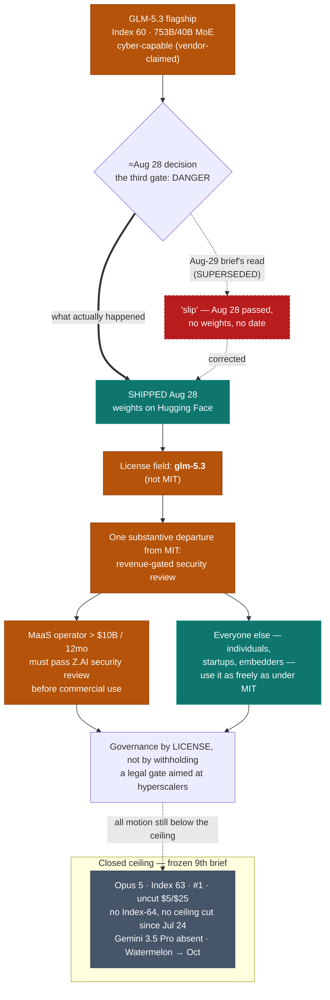

# LLM Updates — 2026-Sep-01

Monday brief, written Mon Sep 1 (Los Angeles time). For eight weeks the series has tracked two frozen
questions. **Does anyone answer at the frontier?** — no Index-64 model and no ceiling flagship price cut
since Claude Opus 5 took #1 on Jul 24. And **does the open-weights promise land?** — which ran through
three gates: Kimi K3 was *open but not runnable* (hardware, Jul-30), Qwen3.8-27B was *runnable but
unproven* until Aug-17 cleared it, and GLM-5.3 was *held because it's dangerous* — its flagship weights
kept back on a safety timer (≈Aug 28) after Z.ai's own evaluation surfaced emergent offensive-cyber
capability (Aug-24 §1), a model Artificial Analysis then *measured* at Index 60, joint-top open weights
and three points off the closed #1 (Aug-26 §1).

**This window corrects the last one and closes that third gate — and it does not close the way the Aug-29
brief called it.** The Aug-29 report read the ≈Aug 28 decision as a **split**: GLM-5.3-Flash shipped open
under MIT on Aug 26, while the **flagship "slipped"** — its `zai-org/GLM-5.3` Hugging Face placeholder
counted down to Aug 28, the date passed, and (as that brief saw it) no weights and no new date appeared.
**That read was wrong.** The flagship weights **did publish on Hugging Face on Aug 28, 2026** — the
measured, joint-#1-open, 753B/40B cyber-capable model is now downloadable — **but not under MIT.** They
shipped under a **bespoke license, tagged `glm-5.3`**, whose one substantive departure from a plain MIT
grant is a **revenue-gated security-review clause**: any Model-as-a-Service operator whose affiliated group
exceeds **$10B in revenue over any consecutive 12 months** must **pass a Z.AI security review before
commercial use** ([The New Stack](https://thenewstack.io/zai-glm-weights-license/);
[digitalapplied](https://www.digitalapplied.com/blog/glm-5-3-weights-bespoke-license-not-mit);
raw text: [`LICENSE` · zai-org/GLM-5.3](https://huggingface.co/zai-org/GLM-5.3/raw/main/LICENSE)) (§1).

**So the summer's "held because it's dangerous" arc resolves into governance *by license*, not governance
*by withholding*.** The model the last three briefs treated as the one thing being locked away is, in fact,
open — self-hostable, weights in hand — with the safety concern discharged not by keeping it closed but by
attaching a legal gate aimed squarely at the largest cloud operators. The binding constraint on the open
frontier turned out to be neither hardware (Kimi) nor credibility (Qwen) nor a lock (the Aug-29 read), but
a **bespoke commercial license** that lets a hobbyist or a startup download the cyber-capable flagship
freely while making a hyperscaler submit to review first (§1).

**Meanwhile the closed ceiling stays frozen for a 9th straight brief.** Opus 5 still #1 at Index **63**,
uncut ($5/$25); **no Index-64 model and no ceiling flagship price cut since Jul 24** — now ~6 weeks; and
**Gemini 3.5 Pro is still off the board**, its third missed target unmoved. Meta's "Watermelon" still
carries an **October** date, now paired with a paid **"Hatch"** agent platform reported for the coming
weeks. And **no new frontier model shipped in the Aug 30 → Sep 1 window** (§2).

This report advances only what is **new since Aug-29**, and corrects the one thing that brief got wrong.
It does **not** re-derive GLM-5.3's independent Index 60 and agentic Elo (Aug-26 §1), its cyber finding
(Aug-24 §1), GLM-5.3-Flash's MIT drop and specs (Aug-29 §1), or the frozen-ceiling composition (Aug-26
§2) — those are unchanged and pointed to in §4.

![Correction-and-resolution diagram of the GLM-5.3 flagship decision. On the left, the August 29 brief's read is shown struck through and superseded: it called the flagship a slip, reading that August 28 passed with no weights on Hugging Face and no new date. An arrow labelled "actually" leads to what happened: the flagship GLM-5.3 weights did publish on Hugging Face on August 28, 2026 — Artificial Analysis Intelligence Index 60, a 753-billion-parameter mixture-of-experts with 40 billion active, downloadable and self-hostable — but under a custom license tagged glm-5.3, not MIT. A center box explains the license: its one substantive departure from MIT is a revenue-gated security review — a Model-as-a-Service operator whose affiliated group exceeds 10 billion dollars of revenue over any 12 months must pass a Z.AI security review before commercial use, with the scope set by Z.AI — framed as governance by license rather than by withholding, a legal gate aimed at hyperscalers standing in for a lock. A band shows both GLM-5.3 tiers now open: the flagship at Index 60 under the glm-5.3 license from August 28, and GLM-5.3-Flash at Index 57 under plain MIT from August 26. A footer notes the closed ceiling frozen for a ninth straight brief — Opus 5 at Index 63 still number one and uncut at 5 and 25 dollars, no Index-64 model and no ceiling flagship price cut since July 24 — Gemini 3.5 Pro still absent on a third missed target, Meta's Watermelon still October and now paired with a paid Hatch agent platform, and GPT-5.6 Sol's late-August cut to 4 and 20 dollars a workhorse-tier move below the ceiling, not a new number one.](glm53_flagship_ships_open_under_bespoke_license.svg)

---

## 1. Correction: the flagship didn't slip — it shipped open Aug 28, under a bespoke, hyperscaler-gated license

**What the last brief said, and what was actually true.** The Aug-29 report closed the ≈Aug 28 decision
as a split: Flash open (MIT, Aug 26), flagship *held* — it read the `zai-org/GLM-5.3` placeholder's Aug 28
date passing as a slip with "no weights published and no new date," its **outcome (c)**. This window makes
clear that reading was premature. **The flagship's weights are on Hugging Face, published Aug 28, 2026**,
under a custom license — so the correct resolution of the Aug-26 watch-item is not a slip but a **ship with
a catch** ([The New Stack, "Z.ai's GLM-5.3 goes open weight, but its new license aims at
hyperscalers"](https://thenewstack.io/zai-glm-weights-license/);
[digitalapplied, "GLM-5.3's Weights Are Out. The Licence Is Not
MIT"](https://www.digitalapplied.com/blog/glm-5-3-weights-bespoke-license-not-mit);
[apidog self-host guide](https://apidog.com/blog/self-host-glm-5-3-open-weights/)). The model itself is the
same one AA measured: **Index 60, 753B total / 40B active MoE, open weights, verbose**
([AA GLM-5.3 model page](https://artificialanalysis.ai/models/glm-5-3)).

**The license is the whole story.** GLM-5.3-Flash shipped Aug 26 under **plain, unmodified MIT** (Aug-29
§1). The flagship did **not**: its model-card license field reads **`glm-5.3`**, a bespoke document
("GLM-5.3 License, Copyright (c) 2026 Z.AI"). Read against MIT, it is permissive for essentially everyone
**except** one class of user. The one substantive departure is **clause 2, a revenue-gated security
review**:

> If a licensee or any of its affiliates operates a Model-as-a-Service business, and their aggregate
> revenue exceeds **$10 billion (USD)** over any consecutive **12 months**, they must **pass Z.AI's
> security review** before using the software or its derivatives **for any commercial purpose**. The scope
> and method of that review are reasonably determined by Z.AI.

([`LICENSE` raw](https://huggingface.co/zai-org/GLM-5.3/raw/main/LICENSE);
[digitalapplied license read](https://www.digitalapplied.com/blog/glm-5-3-weights-bespoke-license-not-mit)).
The license defines **"Model as a Service"** narrowly — giving a third party access to model *inference or
fine-tuning* (e.g. via API) in a way that lets them control inputs, parameters, or training data. It
**excludes** end-user products that merely embed the model in a feature or harness, and mere relaying of
requests to models hosted elsewhere ([digitalapplied license
read](https://www.digitalapplied.com/blog/glm-5-3-weights-bespoke-license-not-mit)). In other words: an
individual, a startup, a university, or an enterprise embedding GLM-5.3 in a product can download and use
the flagship weights **as freely as under MIT**. The gate binds **only** a large operator whose business
*is* re-serving the model — a hyperscaler cloud, a frontier-scale inference provider — and only above the
$10B line. Hence The New Stack's framing: **the license aims at hyperscalers**, not at the open-source
community.

**Why this is the resolution of the "third gate," not a footnote.** The Aug-24 brief cast GLM-5.3 as the
open-weights story's third and hardest gate — the first model *held by its own capability* rather than by
hardware or credibility, "the first concrete, self-imposed test of the June export-control / Anthropic-policy
line." Through Aug-26 and Aug-29 the working assumption was that a cyber-capable frontier-adjacent model,
if it was too dangerous to release, would simply **not be released** — the safety mechanism was *withholding*.
This window shows Z.ai chose a **different mechanism**: it released the model to everyone and reserved a
**review right over the entities big enough to industrialize it**. The security concern (CyberGym 84.5,
the emergent exploit-chaining of Aug-24 §1) is discharged legally and selectively, not by a lock. That is a
genuinely new data point in the governance-of-capability debate the series has been tracking: **the first
frontier-adjacent open-weights model whose safety hold resolved as a license clause aimed at scaled
commercial re-servers, while leaving the weights themselves fully public.**

**The honest caveats, unchanged from prior briefs.**

- **The cyber numbers are still vendor-claimed.** CyberGym 84.5, ExploitBench 54.4, the 2,436-vulnerability
  count, and "emergent exploit-chaining" — the stated *reason* the flagship was ever treated as dangerous —
  remain **Z.ai's own figures with no independent replication** at compile time (Aug-24 §1 / Aug-26 §1).
  The Index 60 and the 753B/40B architecture are third-party (AA); the cyber ledger is not.
- **A license is not enforcement.** The clause reserves a review *right*; whether Z.AI exercises it, how it
  scopes a review "reasonably determined by Z.AI," and whether a $10B+ MaaS operator would comply rather
  than route around a Chinese-lab review are all open. The mechanism is novel on paper; its teeth are
  untested.
- **The correction cuts against the last brief, not the sources.** The Aug-29 "slip" read was this series'
  own error (or a same-day timing gap between the brief being written and the weights posting), not a
  vendor reversal. The current state — **weights on HF, `glm-5.3` license, Aug 28** — is corroborated
  across multiple independent outlets and the raw license file.

**What is now shipped vs still claimed, after this window:**

- **Shipped & open (verifiable):** **both** GLM-5.3 tiers. Flagship weights on HF under the `glm-5.3`
  license (Aug 28, Index 60 third-party); Flash weights on HF under MIT (Aug 26, Index 57 third-party).
- **New governance mechanism (verifiable in text, untested in practice):** the revenue-gated
  ($10B/12mo MaaS) Z.AI security-review clause.
- **Still vendor-claimed (no independent run):** all the flagship *cyber* figures — the stated basis for
  the hold that this license now substitutes for.

## 2. What did *not* move — the ceiling, Gemini, Meta, and the Sol price cut

- **The closed ceiling — frozen a 9th straight brief.** The [Artificial Analysis Intelligence
  Index](https://artificialanalysis.ai/leaderboards/models) top is unchanged: **Opus 5 63 (#1, uncut,
  $5/$25)**, **Fable 5 ~62** ([BenchLM](https://benchlm.ai/)). **No Index-64 model. No ceiling flagship
  price cut since Jul 24** — now roughly six weeks. Ninth brief running, the answer to "does anyone answer
  at the frontier?" is still **no**; every move this window was, again, *below* the ceiling.
- **A workhorse-tier price cut that isn't a ceiling cut.** OpenAI dropped **GPT-5.6 Sol to $4/$20** (from
  $5/$30; ~20% input, ~33% output), a **promotional** rate through ≈Nov 21, announced in the **Aug 21–24**
  window ([Enterprise DNA](https://enterprisedna.co/resources/news/openai-gpt-56-sol-price-cut-20-percent-frontier-model-august-2026/);
  [Yellow](https://yellow.com/news/openai-cuts-gpt-56-sol-prices)). At $4/$20 Sol now **undercuts Opus 5
  ($5/$25) on both input and output** — but Sol sits ~59–61 on AA, **below** the ceiling band, so this is
  a *workhorse-tier* discount, not a cut to the frozen #1. It predates the Aug-29 brief; it's noted here as
  standing context, and it does **not** break the "no *ceiling* flagship price cut since Jul 24" line the
  series tracks.
- **Gemini 3.5 Pro — still absent, still three missed targets.** No ship, no date, no model ID; still no
  `gemini-3.5-pro` in the API (newest Pro-tier remains `gemini-3.1-pro-preview`), still "testing," with
  reports the base model was rebuilt over hallucination/reliability shortfalls
  ([codersera status](https://codersera.com/blog/gemini-3-5-pro-launch-guide-2026/)). Google remains the
  lone frontier lab with no current-generation flagship on the board.
- **Meta "Watermelon" — still October, now with a product attached.** The next flagship (successor to Muse
  Spark, ~10× its compute, *internally* claimed at ~GPT-5.5 parity) is **still in development, still
  targeted for October**, still a codename with no card or benchmark. New this window is the *product*
  wrapper: Meta is reported to be launching a **paid "Hatch" agent platform** (up to ~$199.99) in the
  coming weeks, with Watermelon as its intended engine
  ([the-decoder](https://the-decoder.com/metas-paid-ai-agent-hatch-launches-soon-with-a-new-model-called-watermelon-due-in-october/);
  [TNW](https://thenextweb.com/news/meta-hatch-ai-agent-watermelon-199-subscription)). That's a
  monetization move, not a model release — it does not change the frontier board.
- **No new frontier model, Aug 30 → Sep 1.** Release trackers show nothing at the top in the window; the
  most recent releases are sub-flagship (e.g. Alibaba's Qwen3.8 Flash, Aug 26)
  ([LLM Gateway timeline](https://llmgateway.io/timeline/2026)).

## 3. The through-line

For **nine briefs** the top of the map has not moved: Opus 5 at Index 63, uncut, unanswered by any Index-64
challenger and undercut in price only *below* its own tier. Everything that has moved all summer has moved
**below** the ceiling — and this window the open-weights arc that has driven most of that motion reaches its
end. It ran **Kimi K3 (gated by hardware) → Qwen3.8-27B (gated by proof) → GLM-5.3 (gated by danger)**, and
the danger gate — the one that looked like it might finally keep a frontier-adjacent model closed — instead
**opened, with a license in place of a lock.** The cyber-capable, joint-#1-open flagship is downloadable by
anyone; the only users it holds at the door are the handful of $10B+ operators who would re-serve it at
scale. The compression of the map has come **entirely from below**, and the mechanism that was supposed to
be able to stop it turned out to be a clause, not a wall.

## 4. Unchanged since prior briefs (pointers, not re-derived here)

- **GLM-5.3 flagship Index 60 & agentic Elo, architecture (753B/40B MoE, 200K ctx), verbosity** — measured
  Aug-26 §1; AA model page. Only its *license and download availability* are new here.
- **GLM-5.3 cyber finding & emergent exploit-chaining** (CyberGym 84.5, ExploitBench 54.4, 2,436 vulns) —
  Aug-24 §1; still vendor-claimed, now the concern the `glm-5.3` license substitutes for.
- **GLM-5.3-Flash** (320B-A18B, natively multimodal, 1M ctx, Index 57, MIT, Aug 26) — Aug-29 §1.
- **Frozen closed ceiling composition** (Opus 5 63 / Fable ~62 / Grok 4.6 ~61 / GPT-5.6 Sol ~59–61) —
  Aug-26 §2, Aug-29 §2.
- **Open-weights three-gate framing** (Kimi=hardware, Qwen=proof, GLM-5.3=danger) — Aug-24 §1; this brief
  closes the third gate.

---

## Sources

Independent measurement & leaderboards:

- Artificial Analysis — [GLM-5.3 model page (Index 60, 753B/40B)](https://artificialanalysis.ai/models/glm-5-3);
  [GLM-5.3-Flash page](https://artificialanalysis.ai/models/glm-5-3-flash);
  [Intelligence Index v4.1.1](https://artificialanalysis.ai/evaluations/artificial-analysis-intelligence-index);
  [leaderboards](https://artificialanalysis.ai/leaderboards/models)
- [BenchLM leaderboard (Sep 2026)](https://benchlm.ai/)
- [LLM Gateway — 2026 release timeline](https://llmgateway.io/timeline/2026)

GLM-5.3 flagship open-weights drop & license:

- The New Stack — [Z.ai's GLM-5.3 goes open weight, but its new license aims at hyperscalers](https://thenewstack.io/zai-glm-weights-license/)
- digitalapplied — [GLM-5.3's Weights Are Out. The Licence Is Not MIT](https://www.digitalapplied.com/blog/glm-5-3-weights-bespoke-license-not-mit);
  [open-weight model licence audit 2026](https://www.digitalapplied.com/blog/open-weight-model-licence-audit-2026)
- Hugging Face — [`LICENSE` · zai-org/GLM-5.3 (raw)](https://huggingface.co/zai-org/GLM-5.3/raw/main/LICENSE)
- [apidog — Self-Hosting GLM-5.3: the open-weights drop](https://apidog.com/blog/self-host-glm-5-3-open-weights/)
- [modemguides — GLM-5.3 open weights: release date, license, bug ledger](https://www.modemguides.com/blogs/ai-news/glm-5-3-open-weights-security-findings)
- [Spheron — GLM-5.3 GPU cloud setup & cost guide](https://www.spheron.network/blog/deploy-glm-5-3-gpu-cloud/)

Ceiling / pricing / other labs:

- GPT-5.6 Sol price cut — [Enterprise DNA](https://enterprisedna.co/resources/news/openai-gpt-56-sol-price-cut-20-percent-frontier-model-august-2026/);
  [Yellow (promo through ~Nov 21)](https://yellow.com/news/openai-cuts-gpt-56-sol-prices);
  [CellCog GPT-5.6 pricing](https://cellcog.ai/blog/gpt-5-6-pricing/)
- Gemini 3.5 Pro status — [codersera launch guide](https://codersera.com/blog/gemini-3-5-pro-launch-guide-2026/)
- Meta "Watermelon" / "Hatch" — [the-decoder](https://the-decoder.com/metas-paid-ai-agent-hatch-launches-soon-with-a-new-model-called-watermelon-due-in-october/);
  [The Next Web](https://thenextweb.com/news/meta-hatch-ai-agent-watermelon-199-subscription)

---

### Diagram source & watch-items

The SVG above (`glm53_flagship_ships_open_under_bespoke_license.svg`) is standalone, uses no external
resources, and is drawn in mid-slate / amber / teal tones legible on both light and dark backgrounds. A
Mermaid version of the resolution flow follows.

**Watch-items into the next brief:**

1. **Does anyone run an independent cyber eval on the now-downloadable flagship?** The weights are public,
   so the vendor-claimed CyberGym 84.5 / exploit-chaining figures — the basis for the whole hold — are now
   *replicable* by any third party. This is the first window in which the cyber ledger could stop being
   vendor-only. Watch for an outside run.
2. **Does the `glm-5.3` license get tested?** Does any $10B+ MaaS operator (a hyperscaler cloud, a
   frontier inference provider) either seek Z.AI's review or route around the clause — and does anyone
   challenge whether a Chinese-lab "security review" is a workable gate on Western hyperscalers?
3. **Does the ceiling finally move?** Tenth-brief watch: any Index-64 model, any *ceiling* flagship price
   cut, or Gemini 3.5 Pro / Meta Watermelon actually shipping (Watermelon's Oct target and the Hatch
   launch are the nearest catalysts).

---

*Scraping/data caveats: several primary domains (huggingface.co, thenewstack.io, digitalapplied.com,
apidog.com, modemguides.com) were EGRESS_BLOCKED on direct fetch this run; every figure above was taken
from the search index and corroborated across multiple independent outlets plus the quoted raw license
text. The flagship's Index 60, its 753B/40B architecture, its Aug-28 HF publication, the `glm-5.3` license
and its $10B/12mo MaaS security-review clause, and GLM-5.3-Flash's MIT drop are all third-party or
primary-text verifiable; all GLM-5.3 **cyber** figures remain vendor-claimed pending an independent run.
Written in Los Angeles time.*
