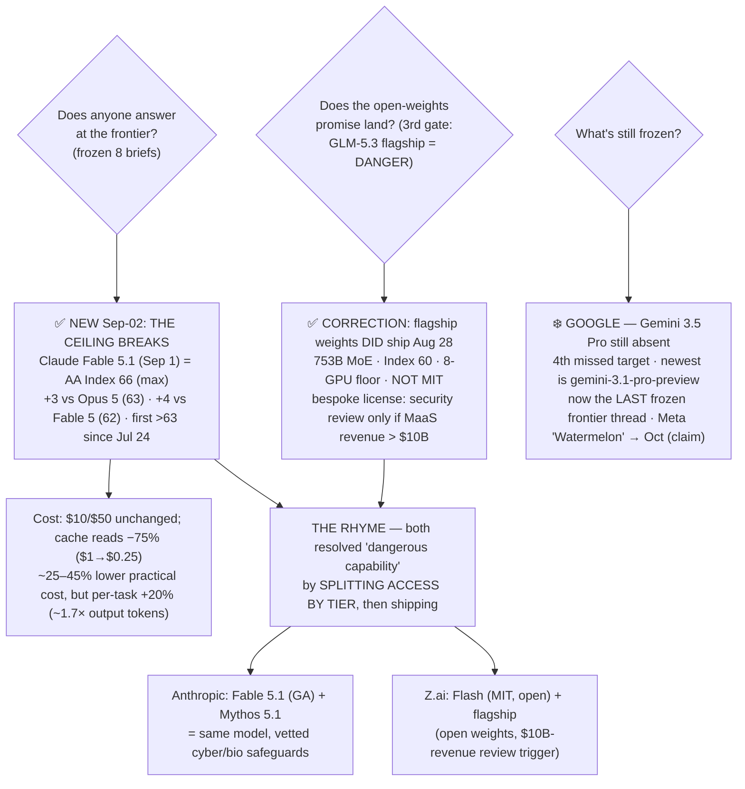

# LLM Updates — 2026-Sep-02

Wednesday brief, written Wed Sep 2 (Los Angeles time). For most of the summer this series has tracked
two frozen questions. **Does anyone answer at the frontier?** — for eight straight briefs, *no*: no model
crossed Index-64 and no flagship price cut landed after Claude Opus 5 took #1 at Index 63 on Jul 24. And
**does the open-weights promise land?** — which ran through three gates: Kimi K3 was *open but not runnable*
(hardware, Jul-30), Qwen3.8-27B was *runnable but unproven* until Aug-17 cleared it, and GLM-5.3 was *held
because it's dangerous* — its flagship weights kept back on a safety timer after Z.ai's own eval surfaced
emergent offensive-cyber capability (Aug-24 §1), a model AA then measured at Index 60 (Aug-26 §1). Aug-29
read the ≈Aug 28 decision as a *split*: GLM-5.3-Flash shipped open under MIT while the flagship appeared to
*slip*.

**This window both questions move — and they move the same way.** After eight briefs frozen, **the ceiling
breaks**: on **Sep 1 Anthropic shipped Claude Fable 5.1**, and Artificial Analysis measured it at **Index
66** at max effort — the **highest score ever recorded, +3 over Opus 5 (63) and +4 over Fable 5 (62)** —
the first Index-64+ model since Jul 24 (§1). And the GLM-5.3 flagship, which Aug-29 called a slip, **did in
fact ship its open weights on Aug 28** — reporting has since firmed up — but under a **bespoke, non-MIT
license** whose one real constraint is a **security review triggered only for Model-as-a-Service operators
above $10B revenue** (§2). The two events rhyme: **Fable 5.1 arrived paired with Mythos 5.1 — the *same
model* behind vetted cyber/bio safeguards** (§1). So the closed top and the open frontier resolved the same
"frontier-adjacent dangerous capability" problem the **same structural way this window: split access by
tier, then ship — rather than gate wholesale.** That governance-by-tier design is what let both sides move
(§3).

**What stayed frozen is now a single thread: Google.** Gemini 3.5 Pro is still off the board — now a
*fourth* missed target, still `gemini-3.1-pro-preview` as the newest Pro entry (§2). Meta's "Watermelon"
still carries only an October claim and no card. With the ceiling broken, Google is the last frozen frontier
question on the board.

This report advances only what is **new since Aug-29.** It does **not** re-derive GLM-5.3's independent Index
60 and agentic Elo (Aug-26 §1), its cyber finding and hold cause (Aug-24 §1), GLM-5.3-Flash's MIT drop
(Aug-29 §1), or the composition of the ceiling band (Aug-26 §2) — those are unchanged and pointed to in §5.

![Horizontal bar chart of the Artificial Analysis Intelligence Index showing the frozen ceiling breaking. For eight briefs the top was a frozen amber band from 61 to 63 — Claude Opus 5 at 63 (number one, uncut) over Claude Fable 5 at 62, GPT-5.6 Sol at 61 and Grok 4.6 at 61 — with nothing above 63 since July 24. This window a teal bar for Claude Fable 5.1, released September 1, reaches 66 at max effort, the highest ever measured, plus three over Opus 5 and plus four over Fable 5, ending the freeze; an arrow marks the breakout past the 63 line. Below the ceiling band sit the open-weights models: the GLM-5.3 flagship and Kimi K3 both at 60 and GLM-5.3-Flash at 57. A callout explains Fable 5.1 keeps Fable 5's ten- and fifty-dollar per-million input and output pricing but cuts cache reads seventy-five percent from one dollar to twenty-five cents per million, for roughly twenty-five to forty-five percent lower practical cost, though its per-task cost of 3.76 dollars is twenty percent above Fable 5 because it emits about 1.7 times the output tokens. A footer states the through-line: the frontier finally moved, and it moved by governing capability by tier rather than gating it wholesale — Fable 5.1 shipped generally available alongside Mythos 5.1, the same model behind vetted cyber and biology safeguards, while Z.ai shipped the GLM-5.3 flagship weights open on August 28 under a bespoke license whose security-review clause fires only for Model-as-a-Service operators above ten billion dollars in revenue.](ceiling_breaks_fable_5_1_66_governance_by_tier.svg)

---

## 1. The ceiling breaks — Claude Fable 5.1 tops the Index at 66, first over 63 since Jul 24

For eight straight briefs the top of the Artificial Analysis Intelligence Index had one answer: nothing new
above Opus 5's 63, and no flagship price cut since Jul 24. **On Sep 1 that broke.** Anthropic released
**Claude Fable 5.1** (and its gated sibling Mythos 5.1, §3), and AA — which supported Anthropic with
pre-release evaluation — measured Fable 5.1 at **Index 66 at max effort, the highest score it has ever
recorded**
([Artificial Analysis, "Claude Fable 5.1 tops the Intelligence Index"](https://artificialanalysis.ai/articles/claude-fable-5-1);
[Artificial Analysis on X](https://x.com/ArtificialAnlys/status/2094881171066978525);
[officechai](https://officechai.com/ai/claude-fable-5-1-scores-tops-artificial-analysis-intelligence-index-with-score-of-66-beats-opus-5-by-3-points/)).

**Where it lands on the board:**

| Model (max/high effort) | AA Intelligence Index | Note |
|---|---|---|
| **Claude Fable 5.1 (max)** | **66** | **NEW #1 · Sep 1 · first >63 since Jul 24** |
| Claude Opus 5 (max) | 63 | prior #1 (since Jul 24), uncut |
| Claude Fable 5 (max) | 62 | Fable 5.1's own predecessor |
| GPT-5.6 Sol (max) | 61 | unchanged |
| Grok 4.6 (high) | 61 | unchanged |
| GLM-5.3 flagship / Kimi K3 | 60 / 60 | top open weights (§2) |

So the jump is **+4 over Fable 5 and +3 over Opus 5**, and the "no Index-64 model" line that held for eight
briefs is gone — 66 clears it outright. The gains are **broad-based, not a single-benchmark spike**: on the
nine-eval Index, Anthropic and AA report Fable 5.1 posting **HLE 59.1%** (up from Fable 5's 55.5%),
**Terminal-Bench v2.1 91.4%**, and **SciCode 62.0%**, and — the sharpest deltas — **Terminal-Bench-Science
24.7% → 52.6% (more than doubled)** and **Terminal-Bench 4.0 (coding) 42.0% → 55.8%**, with agentic coding
up **>30%** over Fable 5
([the-decoder](https://the-decoder.com/anthropics-claude-fable-5-1-promises-better-coding-and-research-at-up-to-45-percent-less/);
[VentureBeat](https://venturebeat.com/technology/anthropics-claude-fable-5-1-and-mythos-5-1-arrive-with-a-75-cost-reduction-for-fable-cache-reads);
[datasciencedojo](https://datasciencedojo.com/blog/claude-fable-5-1-performance-and-safety/)).
It is available immediately via the Claude API, **Amazon Bedrock, Google Cloud, and Microsoft Azure**.

**The cost story is "cheaper to run, not cheaper on the sticker" — and that nuance matters.** Fable 5.1
keeps Fable 5's headline rate of **$10 / $50 per 1M input/output**, unchanged. What moved is **cache reads,
cut 75% from $1 to $0.25 per 1M**, which Anthropic estimates at **~25% lower practical cost for typical
workloads and up to ~45% for highly agentic ones**
([VentureBeat](https://venturebeat.com/technology/anthropics-claude-fable-5-1-and-mythos-5-1-arrive-with-a-75-cost-reduction-for-fable-cache-reads);
[thenextweb](https://thenextweb.com/news/claude-fable-mythos-5-1-eu-ai-act-watermark-detection-api-private-preview)).
But AA's own per-task accounting cuts the other way: Fable 5.1 costs **$3.76 per Intelligence Index task at
max, 20% *more* than Fable 5's $3.14**, because it emits **~1.7× the output tokens** — the cache cut saves
~$1.40/task but the extra generation eats into it
([Artificial Analysis](https://artificialanalysis.ai/articles/claude-fable-5-1)). Net: a genuinely smarter
top model whose *effective* cost falls for cache-heavy agentic loops but whose *per-task* cost rises if you
lean on raw generation. This is not the Jul-24 "top quality at *mid* price" move — Fable's $10/$50 sits
*above* Opus 5's $5/$25 — it is "top quality, with the cost relief routed through caching and effort."

**Why it counts as the ceiling breaking, precisely.** The series' frozen-frontier question was narrow: *no
Index-64 model, no new closed #1, no flagship cut since Jul 24.* Fable 5.1 answers the first two cleanly —
a **new closed #1 at 66**, well past 64 — from the same lab that set the old ceiling. The price line is
answered only partially (cache/effort relief, not a sticker cut). But after eight briefs of "no," the
frontier moved, and it was a US closed lab that moved it.

## 2. The GLM-5.3 flagship weights *did* ship — correcting Aug-29's "slip" — under a bespoke, non-MIT license

Aug-29 §1 read the ≈Aug 28 flagship decision as **outcome (c), a slip**: the `zai-org/GLM-5.3` Hugging Face
placeholder counted down to Aug 28, the date appeared to pass, and early reporting (implicator.ai,
MindStudio) framed it as a delay. **That read needs updating.** Reporting since has firmed up that the
**GLM-5.3 flagship open weights did land on Hugging Face on Aug 28, 2026** — multiple independent outlets now
describe the checkpoints as published, not held
([The New Stack, "Z.ai's GLM-5.3 goes open weight"](https://thenewstack.io/zai-glm-weights-license/);
[digitalapplied, "GLM-5.3's weights are out — the licence is not MIT"](https://www.digitalapplied.com/blog/glm-5-3-weights-bespoke-license-not-mit);
[kingy.ai, "GLM-5.3 weights are out — running them takes eight GPUs"](https://kingy.ai/blog/glm-5-3-specs-benchmarks-api-how-to-use/)).
The honest correction: **the flagship shipped on time; the "slip" was a premature read of a countdown that
resolved into a publish.**

**What actually shipped, and the catch that replaces the "hold."**

| Attribute | GLM-5.3 flagship (**shipped Aug 28**) |
|---|---|
| Params | **753B-total MoE** (~40B active) |
| Context / output | **1M tokens** / 128K max output |
| AA Intelligence Index | **60** (ties Kimi K3 for top open weights) |
| Formats | **BF16 and FP8**; runs on vLLM, SGLang, KTransformers, HF Transformers |
| Hardware floor | **8-GPU Hopper-class node** — not consumer-runnable |
| License | **bespoke "glm-5.3"** — *not* MIT/Apache |

The license is the real story, and it is a **new governance instrument, not a plain open-source drop.** The
model card's license field reads `glm-5.3`, and the one substantive departure from MIT is **clause 2: a
revenue-gated security-review requirement.** Any Model-as-a-Service operator with **over $10B in aggregate
revenue over any trailing 12 months must pass a Z.ai security review before hosting the model commercially**;
individual users and smaller companies see no change
([The New Stack](https://thenewstack.io/zai-glm-weights-license/);
[digitalapplied](https://www.digitalapplied.com/blog/glm-5-3-weights-bespoke-license-not-mit)). The
license, as The New Stack frames it, **aims squarely at hyperscalers** — the entities large enough to serve
the cyber-capable flagship at scale — while leaving the long tail of users fully open.

**So the third gate resolves — not as a hold, but as a *conditioned release*.** The Aug-24/26 framing was
"held because dangerous." What Z.ai actually did was **ship the dangerous flagship's weights openly *and*
attach a revenue-triggered security-review clause to the only actors who could operationalize it at scale.**
Combined with Aug-26's MIT drop of the smaller GLM-5.3-Flash (Index 57), the open-weights promise resolves
**fully landed across both tiers** — but with the *license*, not the *release date*, carrying the safety
logic. The abstract "capability-tier filter" from Aug-29 §3 turns concrete: the safe tier got the freest
terms (Flash, MIT), the cyber-capable tier got the *conditioned* terms (flagship, revenue-gated review), and
both are downloadable.

> **What is now verifiable vs still claimed.** *Verifiable:* GLM-5.3 flagship weights on HF (Aug 28), 753B
> MoE, bespoke license, 8-GPU floor; GLM-5.3-Flash weights on HF under MIT (Aug 26). *Third-party (AA):*
> flagship Index 60, Flash Index 57. *Still vendor-claimed, no independent run:* **all** the flagship cyber
> figures — CyberGym 84.5, ExploitBench 54.4, the 2,436-vulnerability count, "emergent exploit-chaining" —
> the stated reason for the license clause, still unreplicated (Aug-24 §1). Now that the weights are public,
> an outside CyberGym/ExploitBench run is finally *possible*; it hasn't appeared yet.

## 3. The rhyme — Anthropic's Fable/Mythos split is the same governance-by-tier design

The Fable 5.1 launch was **not one model but a paired release**, and the pairing is the point. Anthropic
shipped **Claude Fable 5.1 and Claude Mythos 5.1 as the *same model* with different levels of safeguards**
([Anthropic, "Introducing Claude Fable 5.1 and Claude Mythos 5.1"](https://www.anthropic.com/claude-fable-and-mythos-5-1);
[Unite.AI, "split safeguards"](https://www.unite.ai/anthropic-debuts-claude-fable-5-1-and-mythos-5-1-with-split-safeguards/);
[thurrott](https://www.thurrott.com/a-i/anthropic/340951/anthropic-releases-claude-fable-5-1-and-mythos-5-1)):

- **Fable 5.1** is **generally available**. Its safeguards were *relaxed where they were over-firing*: cyber
  false positives are down **60%**, and biology filters fire **85% less** on benign elementary-biology and
  medical questions. Fable 5.1 **may now be used to identify software vulnerabilities**, while exploit
  generation and penetration testing stay gated.
- **Mythos 5.1** is the same weights behind **more permissive safeguards for vetted work**, available
  **only through trusted-access programs**: the **Cyber Verification Program** (vetted defenders) and the
  **Life Sciences Verification Program** (first enrolled via a US-government partnership). It is not
  "unrestricted" — it is a **verified-access configuration** with Anthropic's Usage Policy still in force
  ([Unite.AI](https://www.unite.ai/anthropic-debuts-claude-fable-5-1-and-mythos-5-1-with-split-safeguards/);
  [thenextweb](https://thenextweb.com/news/claude-fable-mythos-5-1-eu-ai-act-watermark-detection-api-private-preview)).

Put §1–§3 together and the window has one shape. **Both the top closed lab and the top open lab, in the
same ~72 hours, resolved the "frontier-adjacent dangerous capability" problem by splitting *access by tier*
rather than gating capability wholesale:**

- **Anthropic:** one model, two safeguard tiers — **Fable 5.1 (open GA, relaxed-where-safe)** + **Mythos 5.1
  (vetted access, permissive-for-approved-work).**
- **Z.ai:** one model line, two license tiers — **GLM-5.3-Flash (MIT, fully open)** + **GLM-5.3 flagship
  (open weights, but a $10B-revenue security-review trigger).**

Neither shipped a raw, ungoverned frontier-cyber model to everyone, and neither held it back entirely. Both
**partitioned by who's asking / how big they are**, then released. That common design is what unfroze the
top of the map *and* completed the open-weights landing in the same window — and it's a more interesting
resolution than either "shipped" or "held" alone.

## 4. What did *not* move — Google is now the last frozen frontier thread

- **Gemini 3.5 Pro — still absent, now a *fourth* missed target.** No ship, no date. The newest Pro-tier
  entry is still `gemini-3.1-pro-preview`; Google still says 3.5 Pro is in partner testing, more than three
  months past its May-19 I/O "next month" (June) promise, and past mid-July and early-August targets too
  ([eesel AI, "Gemini 3.5 Pro: is it out yet?"](https://www.eesel.ai/blog/gemini-3-5-pro);
  [nokiapoweruser, "Google confirms 3.5 Pro isn't ready — partner testing continues"](https://nokiapoweruser.com/gemini-3-5-pro-release-partner-testing-delay/)).
  With the Anthropic ceiling broken, **Gemini 3.5 Pro is the single most overdue frontier event on the
  board** — and now the *only* frozen one.
- **Meta "Watermelon" — still an October claim, still no card.** Unchanged from Aug-29 §2: reported for
  October alongside the "Hatch" consumer-agent platform, ~GPT-5.5 parity on Meta's own numbers, no benchmark,
  no third-party score. A claim, not a move.
- **GPT-5.6 Sol / Grok 4.6 — unchanged at ~61.** Both sit a notch below the old ceiling band and further
  below the new Fable 5.1 line. OpenAI's Aug-21/24 temporary Sol price cut ($4/$20 in/out through ~Nov 21)
  predates this window and is a *second-tier* promo, not the closed-#1 flagship cut the series tracks
  ([orcarouter](https://www.orcarouter.ai/blog/gpt-5-6-sol-pricing);
  [technology.org](https://www.technology.org/2026/08/24/openai-gpt-5-6-sol-price-cut-developers/)).
- **No other closed-frontier release in the window.** The only frontier-topping event Aug 29–Sep 2 was Fable
  5.1; the only open-weights event was the flagship's confirmed Aug-28 landing (§2).

## 5. Unchanged since Aug-29 (not re-derived here)

- **GLM-5.3 flagship independent Index 60** (AA): +7 vs GLM-5.2 on post-training alone, ties Kimi K3 for top
  open; agentic GDPval-AA v2 Elo 1524→1770; verbose ~18.7k output tok/task — Aug-26 §1. *This brief adds
  only that its **weights shipped** Aug 28 under a bespoke license (§2); the measured number is unchanged.*
- **GLM-5.3-Flash** (Z.ai, Aug 26): 320B-A18B MoE, natively multimodal, 1M ctx, **MIT**, Index 57 — Aug-29
  §1. Still the fully-open, consumer-tier half of the GLM-5.3 line.
- **GLM-5.3 cyber finding & hold cause** (Z.ai, Aug 14 eval): CyberGym 84.5, ExploitBench 54.4, emergent
  exploit-chaining, 2,436 vulns / 1,097 critical — **all still vendor-claimed, no independent run** (now
  *possible* since the weights are public) — Aug-24 §1.
- **Opus 5** — Index 63, **#1 for eight briefs until this window**, $5/$25, uncut — Jul-25; now the #2 closed
  model behind Fable 5.1.
- **Fable 5** — Index 62, $10/$50 — the direct predecessor Fable 5.1 replaces (+4).
- **Grok 4.6** (SpaceXAI, Aug 6): Index 60.9–61, ceiling band, $2/$6 cheap end — Aug-14 §1.
- **GPT-5.6 Sol** — ~61; temporary $4/$20 promo through ~Nov 21 (Aug-21/24), second-tier — §4.
- **Qwen3.8-27B** — Index 52, Agentic Index 51, verbose — Aug-18 §1. **Qwen3.8-Max** open — Index 56 —
  Aug-14 §2.
- **Kimi K3** open weights (Moonshot, Jul-26): 2.8T MoE, Modified-MIT, hardware-gated, Index 60 — Jul-30.
- **Meta "Watermelon"** — October target + "Hatch" agent platform, ~GPT-5.5-parity claim, no card — Aug-29
  §2.
- **v4.1.1 grader** (Aug 6): top's absolute numbers rose ~+2 from the ruler, not the models — Aug-14.

## Watch-items into the next brief

1. **Does the broken ceiling hold — and does anyone follow Fable 5.1 over 63?** The freeze is over, but 66
   is a single-lab, single-eval-provider result (AA supported the pre-release run). Watch for the 66 holding
   across more runs/providers, an Opus-class response, and whether **Google's Gemini 3.5 Pro** — the last
   frozen thread — finally ships against a target that has now moved *up*, not just persisted.
2. **Independent replication of GLM-5.3's flagship *cyber* numbers — now finally possible.** With the weights
   public (§2), CyberGym 84.5 / ExploitBench 54.4 / the 2,436-vuln claim can at last be run by outsiders.
   Whether the numbers replicate is now the test of the whole "conditioned release" logic — the license
   clause is justified only if the capability is real.
3. **Real-world uptake of the GLM-5.3 flagship under the bespoke license.** Does the $10B-revenue
   security-review trigger actually bind any hyperscaler, and do serving providers pick up the flagship at
   its 8-GPU floor — or does Flash (MIT) remain the practical open GLM-5.3?
4. **Fable 5.1's cost profile in the wild.** The cache-read cut promises 25–45% practical savings but the
   per-task cost rose 20% on ~1.7× output tokens (§1). A third-party read on real agentic workloads —
   cache-heavy vs generation-heavy — would settle whether Fable 5.1 is cheaper or dearer in practice.
5. **Mythos 5.1 access reach.** Whether the Cyber and Life Sciences Verification Programs expand beyond their
   first vetted cohorts is the test of whether "governance-by-tier" (§3) scales or stays a narrow pilot.

---

### Method & caveats

- **Compiled** Wed Sep 2 2026 (Los Angeles time). Advances only items **new since the Aug-29 brief**;
  unchanged threads are listed in §5 with pointers, not re-derived.
- **Correction.** Aug-29 §1 read the GLM-5.3 **flagship** as having *slipped* past Aug 28. Reporting has
  since firmed up that the flagship weights **did ship on Aug 28** under a bespoke license (§2). This brief
  supersedes that read; the "slip" was a premature reading of the Hugging Face countdown.
- **Scraping resilience.** Direct page fetch is broadly egress-limited from this environment (artificialanalysis.ai,
  benchlm.ai, thenewstack.io among others returned `EGRESS_BLOCKED` on direct fetch); all figures were taken
  from the **search index** and **corroborated across multiple independent outlets**. No quantitative claim
  here rests on a single source.
- **What is measured vs claimed.** **Third-party (AA):** Fable 5.1 **Index 66** (max), its component
  benchmarks, and per-task cost $3.76; GLM-5.3 flagship **60**, Flash **57**. **Verifiable events:** Fable
  5.1 + Mythos 5.1 shipped Sep 1 (Anthropic); GLM-5.3 flagship weights on HF under a bespoke license (Aug
  28); Flash on HF under MIT (Aug 26). **Vendor-reported:** Anthropic's own safety-filter deltas (−60% cyber
  FP, −85% bio) and cost-reduction estimates; **all** GLM-5.3 flagship cyber figures (still no independent
  run). **Meta "Watermelon"** — codename + internal claim, October target, no benchmark.
- **Diagrams** are a standalone theme-neutral SVG (slate/amber/teal strokes that read on light and dark
  backgrounds, no external URLs) and an inline Mermaid flowchart; both render in GitHub-flavored markdown.

### Sources

- **Claude Fable 5.1 tops the Index at 66** — [Artificial Analysis, "Claude Fable 5.1 tops the Intelligence Index"](https://artificialanalysis.ai/articles/claude-fable-5-1) · [Artificial Analysis on X (66 at max, +20% cost, 75% cache cut)](https://x.com/ArtificialAnlys/status/2094881171066978525) · [officechai, "score of 66, beats Opus 5 by 3 points"](https://officechai.com/ai/claude-fable-5-1-scores-tops-artificial-analysis-intelligence-index-with-score-of-66-beats-opus-5-by-3-points/) · [heise, "Fable 5.1 takes the benchmark lead"](https://www.heise.de/en/news/Anthropic-enhances-Claude-Fable-5-1-takes-the-benchmark-lead-11438053.html)
- **Fable 5.1 benchmarks, pricing, availability** — [the-decoder, "better coding and research at up to 45% less"](https://the-decoder.com/anthropics-claude-fable-5-1-promises-better-coding-and-research-at-up-to-45-percent-less/) · [VentureBeat, "75% cost reduction for Fable cache reads"](https://venturebeat.com/technology/anthropics-claude-fable-5-1-and-mythos-5-1-arrive-with-a-75-cost-reduction-for-fable-cache-reads) · [datasciencedojo, "benchmarks and safety changes"](https://datasciencedojo.com/blog/claude-fable-5-1-performance-and-safety/) · [MacRumors, "lower costs and fewer false positives"](https://www.macrumors.com/2026/09/01/anthropic-claude-fable-5-1/)
- **Fable 5.1 + Mythos 5.1 — split safeguards** — [Anthropic, "Introducing Claude Fable 5.1 and Claude Mythos 5.1"](https://www.anthropic.com/claude-fable-and-mythos-5-1) · [Unite.AI, "split safeguards"](https://www.unite.ai/anthropic-debuts-claude-fable-5-1-and-mythos-5-1-with-split-safeguards/) · [thurrott, "Anthropic releases Fable 5.1 and Mythos 5.1"](https://www.thurrott.com/a-i/anthropic/340951/anthropic-releases-claude-fable-5-1-and-mythos-5-1) · [thenextweb, "cutting cache read prices by 75%"](https://thenextweb.com/news/claude-fable-mythos-5-1-eu-ai-act-watermark-detection-api-private-preview)
- **GLM-5.3 flagship weights shipped Aug 28 under a bespoke license** — [The New Stack, "Z.ai's GLM-5.3 goes open weight, but its new license aims at hyperscalers"](https://thenewstack.io/zai-glm-weights-license/) · [digitalapplied, "GLM-5.3's weights are out — the licence is not MIT"](https://www.digitalapplied.com/blog/glm-5-3-weights-bespoke-license-not-mit) · [kingy.ai, "GLM-5.3 weights are out — running them takes eight GPUs"](https://kingy.ai/blog/glm-5-3-specs-benchmarks-api-how-to-use/) · [MindStudio, "when will GLM-5.3 open weights be released?"](https://www.mindstudio.ai/blog/glm-5-3-open-weights-release-timing)
- **Leaderboard / ceiling** — [Artificial Analysis LLM leaderboard](https://artificialanalysis.ai/leaderboards/models) · [Artificial Analysis Intelligence Index v4.1.1](https://artificialanalysis.ai/evaluations/artificial-analysis-intelligence-index)
- **Gemini 3.5 Pro still absent** — [eesel AI, "is it out yet?"](https://www.eesel.ai/blog/gemini-3-5-pro) · [nokiapoweruser, "Google confirms 3.5 Pro isn't ready — partner testing continues"](https://nokiapoweruser.com/gemini-3-5-pro-release-partner-testing-delay/) · [Codersera, "why it's delayed (Aug 2026 status)"](https://codersera.com/blog/gemini-3-5-pro-launch-guide-2026/)
- **GPT-5.6 Sol / Grok 4.6 (reference, unchanged)** — [orcarouter, "GPT-5.6 Sol pricing $4/$20 through Nov 21"](https://www.orcarouter.ai/blog/gpt-5-6-sol-pricing) · [technology.org, "OpenAI cuts GPT-5.6 Sol prices"](https://www.technology.org/2026/08/24/openai-gpt-5-6-sol-price-cut-developers/)
